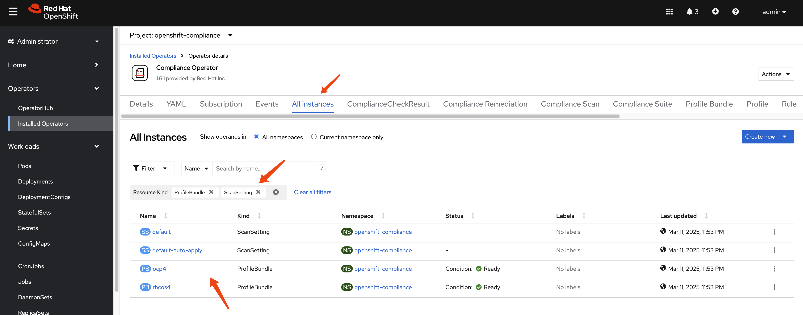

# Compliance Operator usage guide

OpenShift4 has a built-in compliance operator that can be used to monitor and enforce compliance policies across the cluster. But it is hard to use it directly because it requires some configuration and setup. And the documentation is not very clear, so the end user may have difficulty using it.

In this guide, we will show you how to use the compliance operator to monitor and enforce compliance policies across the cluster.

# deploy compliance-operator

# carry out a scan

# generate report

# end