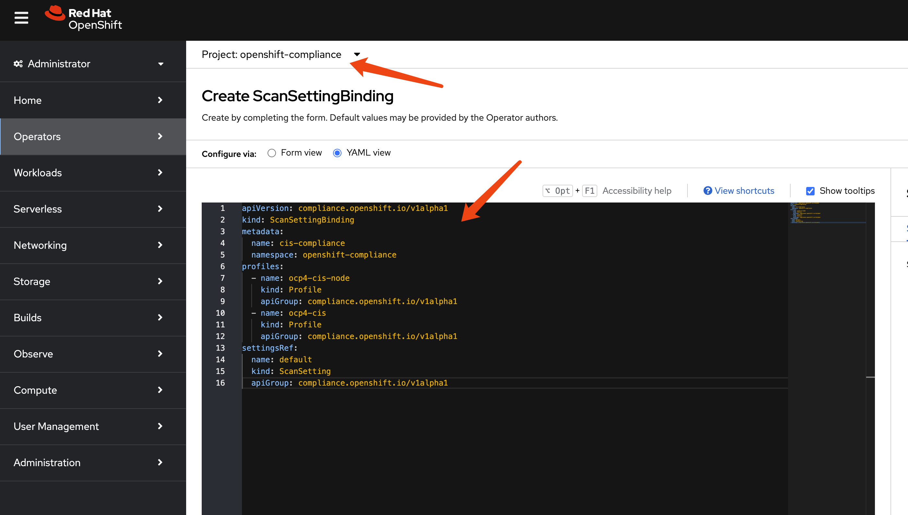

# Compliance Operator usage guide

OpenShift4 has a built-in compliance operator that can be used to monitor and enforce compliance policies across the cluster. But it is hard to use it directly because it requires some configuration and setup. And the documentation is not very clear, so the end user may have difficulty using it.

In this guide, we will show you how to use the compliance operator to monitor and enforce compliance policies across the cluster.

# deploy compliance-operator

Select the `compliance operator` from the list of available operators and click on it to deploy it.


Accept the default settings and click on `Install` to start the installation process.


After the installation is complete, you can access the operator dashboard by navigating to the appropriate URL. In the `all instances` section, you can see a list of all the instances that have been deployed. We filter out `profile bundle` and `scan setting`, and we can see there are 2 instances each of them deployed.


Let's take a closer look at them.

`profile bundle` definition for `rhcos4`:
```yaml
apiVersion: compliance.openshift.io/v1alpha1
kind: ProfileBundle
metadata:
  finalizers:
    - profilebundle.finalizers.compliance.openshift.io
  name: rhcos4
  namespace: openshift-compliance
spec:
  contentFile: ssg-rhcos4-ds.xml
  contentImage: 'registry.redhat.io/compliance/openshift-compliance-content-rhel8@sha256:b286929357b82f8ff3845f535bab23382bf06f075ff2379063e2456f1a93e809'
status:
  conditions:
    - lastTransitionTime: '2025-03-11T15:54:42Z'
      message: Profile bundle successfully parsed
      reason: Valid
      status: 'True'
      type: Ready
  dataStreamStatus: VALID
```

`profile bundle` definition for `ocp4`:
```yaml
apiVersion: compliance.openshift.io/v1alpha1
kind: ProfileBundle
metadata:
  finalizers:
    - profilebundle.finalizers.compliance.openshift.io
  name: ocp4
  namespace: openshift-compliance
spec:
  contentFile: ssg-ocp4-ds.xml
  contentImage: 'registry.redhat.io/compliance/openshift-compliance-content-rhel8@sha256:b286929357b82f8ff3845f535bab23382bf06f075ff2379063e2456f1a93e809'
status:
  conditions:
    - lastTransitionTime: '2025-03-11T15:53:55Z'
      message: Profile bundle successfully parsed
      reason: Valid
      status: 'True'
      type: Ready
  dataStreamStatus: VALID
```

`scan setting` definition for `default`:
```yaml
timeout: 30m
strictNodeScan: true
metadata:
  name: default
  namespace: openshift-compliance
kind: ScanSetting
showNotApplicable: false
rawResultStorage:
  nodeSelector:
    node-role.kubernetes.io/master: ''
  pvAccessModes:
    - ReadWriteOnce
  rotation: 3
  size: 1Gi
  tolerations:
    - effect: NoSchedule
      key: node-role.kubernetes.io/master
      operator: Exists
    - effect: NoExecute
      key: node.kubernetes.io/not-ready
      operator: Exists
      tolerationSeconds: 300
    - effect: NoExecute
      key: node.kubernetes.io/unreachable
      operator: Exists
      tolerationSeconds: 300
    - effect: NoSchedule
      key: node.kubernetes.io/memory-pressure
      operator: Exists
schedule: 0 1 * * *
suspend: false
roles:
  - master
  - worker
apiVersion: compliance.openshift.io/v1alpha1
maxRetryOnTimeout: 3
scanTolerations:
  - operator: Exists
```

`scan setting` definition for `default-auto-apply`:
```yaml
timeout: 30m
autoUpdateRemediations: true
strictNodeScan: true
autoApplyRemediations: true
metadata:
  name: default-auto-apply
  namespace: openshift-compliance
kind: ScanSetting
showNotApplicable: false
rawResultStorage:
  nodeSelector:
    node-role.kubernetes.io/master: ''
  pvAccessModes:
    - ReadWriteOnce
  rotation: 3
  size: 1Gi
  tolerations:
    - effect: NoSchedule
      key: node-role.kubernetes.io/master
      operator: Exists
    - effect: NoExecute
      key: node.kubernetes.io/not-ready
      operator: Exists
      tolerationSeconds: 300
    - effect: NoExecute
      key: node.kubernetes.io/unreachable
      operator: Exists
      tolerationSeconds: 300
    - effect: NoSchedule
      key: node.kubernetes.io/memory-pressure
      operator: Exists
schedule: 0 1 * * *
suspend: false
roles:
  - master
  - worker
apiVersion: compliance.openshift.io/v1alpha1
maxRetryOnTimeout: 3
scanTolerations:
  - operator: Exists
```

There are many other kind of resources predefined.


Let's take a look at the build-in `profile` defined:


```bash
oc get Profile -A
# NAMESPACE              NAME                       AGE   VERSION
# openshift-compliance   ocp4-cis                   10h   1.5.0
# openshift-compliance   ocp4-cis-1-4               10h   1.4.0
# openshift-compliance   ocp4-cis-1-5               10h   1.5.0
# openshift-compliance   ocp4-cis-node              10h   1.5.0
# openshift-compliance   ocp4-cis-node-1-4          10h   1.4.0
# openshift-compliance   ocp4-cis-node-1-5          10h   1.5.0
# openshift-compliance   ocp4-e8                    10h
# openshift-compliance   ocp4-high                  10h   Revision 4
# openshift-compliance   ocp4-high-node             10h   Revision 4
# openshift-compliance   ocp4-high-node-rev-4       10h   Revision 4
# openshift-compliance   ocp4-high-rev-4            10h   Revision 4
# openshift-compliance   ocp4-moderate              10h   Revision 4
# openshift-compliance   ocp4-moderate-node         10h   Revision 4
# openshift-compliance   ocp4-moderate-node-rev-4   10h   Revision 4
# openshift-compliance   ocp4-moderate-rev-4        10h   Revision 4
# openshift-compliance   ocp4-nerc-cip              10h
# openshift-compliance   ocp4-nerc-cip-node         10h
# openshift-compliance   ocp4-pci-dss               10h   3.2.1
# openshift-compliance   ocp4-pci-dss-3-2           10h   3.2.1
# openshift-compliance   ocp4-pci-dss-4-0           10h   4.0.0
# openshift-compliance   ocp4-pci-dss-node          10h   3.2.1
# openshift-compliance   ocp4-pci-dss-node-3-2      10h   3.2.1
# openshift-compliance   ocp4-pci-dss-node-4-0      10h   4.0.0
# openshift-compliance   ocp4-stig                  10h   V2R1
# openshift-compliance   ocp4-stig-node             10h   V2R1
# openshift-compliance   ocp4-stig-node-v1r1        10h   V1R1
# openshift-compliance   ocp4-stig-node-v2r1        10h   V2R1
# openshift-compliance   ocp4-stig-v1r1             10h   V1R1
# openshift-compliance   ocp4-stig-v2r1             10h   V2R1
# openshift-compliance   rhcos4-e8                  10h
# openshift-compliance   rhcos4-high                10h   Revision 4
# openshift-compliance   rhcos4-high-rev-4          10h   Revision 4
# openshift-compliance   rhcos4-moderate            10h   Revision 4
# openshift-compliance   rhcos4-moderate-rev-4      10h   Revision 4
# openshift-compliance   rhcos4-nerc-cip            10h
# openshift-compliance   rhcos4-stig                10h   V2R1
# openshift-compliance   rhcos4-stig-v1r1           10h   V1R1
# openshift-compliance   rhcos4-stig-v2r1           10h   V2R1

```

And the detail of an profile of `ocp4-cis`

```yaml
apiVersion: compliance.openshift.io/v1alpha1
description: 'This profile defines a baseline that aligns to the Center for Internet Security® Red Hat OpenShift Container Platform 4 Benchmark™, V1.5. This profile includes Center for Internet Security® Red Hat OpenShift Container Platform 4 CIS Benchmarks™ content. Note that this part of the profile is meant to run on the Platform that Red Hat OpenShift Container Platform 4 runs on top of. This profile is applicable to OpenShift versions 4.12 and greater.'
id: xccdf_org.ssgproject.content_profile_cis
kind: Profile
metadata:
  annotations:
    compliance.openshift.io/image-digest: pb-ocp4m2njf
    compliance.openshift.io/product: redhat_openshift_container_platform_4.1
    compliance.openshift.io/product-type: Platform
  name: ocp4-cis
  namespace: openshift-compliance
  labels:
    compliance.openshift.io/profile-bundle: ocp4
    compliance.openshift.io/profile-guid: a230315d-3e4a-5b58-b00f-f96f1553e036
rules:
  - ocp4-accounts-restrict-service-account-tokens
  - ocp4-accounts-unique-service-account
  - ocp4-api-server-admission-control-plugin-alwaysadmit
  - ocp4-api-server-admission-control-plugin-alwayspullimages
  - ocp4-api-server-admission-control-plugin-namespacelifecycle
  - ocp4-api-server-admission-control-plugin-noderestriction
  - ocp4-api-server-admission-control-plugin-scc
  - ocp4-api-server-admission-control-plugin-service-account
  - ocp4-api-server-anonymous-auth
  - ocp4-api-server-audit-log-maxbackup
  - ocp4-api-server-audit-log-maxsize
  - ocp4-api-server-audit-log-path
  - ocp4-api-server-auth-mode-no-aa
  - ocp4-api-server-auth-mode-rbac
  - ocp4-api-server-basic-auth
  - ocp4-api-server-bind-address
  - ocp4-api-server-client-ca
  - ocp4-api-server-encryption-provider-cipher
  - ocp4-api-server-etcd-ca
  - ocp4-api-server-etcd-cert
  - ocp4-api-server-etcd-key
  - ocp4-api-server-https-for-kubelet-conn
  - ocp4-api-server-insecure-bind-address
  - ocp4-api-server-kubelet-certificate-authority
  - ocp4-api-server-kubelet-client-cert
  - ocp4-api-server-kubelet-client-cert-pre-4-9
  - ocp4-api-server-kubelet-client-key
  - ocp4-api-server-kubelet-client-key-pre-4-9
  - ocp4-api-server-oauth-https-serving-cert
  - ocp4-api-server-openshift-https-serving-cert
  - ocp4-api-server-profiling-protected-by-rbac
  - ocp4-api-server-request-timeout
  - ocp4-api-server-service-account-lookup
  - ocp4-api-server-service-account-public-key
  - ocp4-api-server-tls-cert
  - ocp4-api-server-tls-cipher-suites
  - ocp4-api-server-tls-private-key
  - ocp4-api-server-token-auth
  - ocp4-audit-log-forwarding-enabled
  - ocp4-audit-log-forwarding-webhook
  - ocp4-audit-logging-enabled
  - ocp4-audit-profile-set
  - ocp4-configure-network-policies
  - ocp4-configure-network-policies-hypershift-hosted
  - ocp4-configure-network-policies-namespaces
  - ocp4-controller-insecure-port-disabled
  - ocp4-controller-secure-port
  - ocp4-controller-service-account-ca
  - ocp4-controller-service-account-private-key
  - ocp4-controller-use-service-account
  - ocp4-etcd-auto-tls
  - ocp4-etcd-cert-file
  - ocp4-etcd-client-cert-auth
  - ocp4-etcd-key-file
  - ocp4-etcd-peer-auto-tls
  - ocp4-etcd-peer-cert-file
  - ocp4-etcd-peer-client-cert-auth
  - ocp4-etcd-peer-key-file
  - ocp4-file-groupowner-proxy-kubeconfig
  - ocp4-file-owner-proxy-kubeconfig
  - ocp4-file-permissions-proxy-kubeconfig
  - ocp4-general-apply-scc
  - ocp4-general-default-namespace-use
  - ocp4-general-default-seccomp-profile
  - ocp4-general-namespaces-in-use
  - ocp4-idp-is-configured
  - ocp4-kubeadmin-removed
  - ocp4-kubelet-configure-tls-cert
  - ocp4-kubelet-configure-tls-cipher-suites-ingresscontroller
  - ocp4-kubelet-configure-tls-key
  - ocp4-kubelet-disable-readonly-port
  - ocp4-ocp-allowed-registries
  - ocp4-ocp-allowed-registries-for-import
  - ocp4-ocp-api-server-audit-log-maxbackup
  - ocp4-ocp-api-server-audit-log-maxsize
  - ocp4-ocp-insecure-allowed-registries-for-import
  - ocp4-ocp-insecure-registries
  - ocp4-openshift-api-server-audit-log-path
  - ocp4-rbac-debug-role-protects-pprof
  - ocp4-rbac-least-privilege
  - ocp4-rbac-limit-cluster-admin
  - ocp4-rbac-limit-secrets-access
  - ocp4-rbac-pod-creation-access
  - ocp4-rbac-wildcard-use
  - ocp4-scc-drop-container-capabilities
  - ocp4-scc-limit-container-allowed-capabilities
  - ocp4-scc-limit-ipc-namespace
  - ocp4-scc-limit-net-raw-capability
  - ocp4-scc-limit-network-namespace
  - ocp4-scc-limit-privilege-escalation
  - ocp4-scc-limit-privileged-containers
  - ocp4-scc-limit-process-id-namespace
  - ocp4-scc-limit-root-containers
  - ocp4-scheduler-profiling-protected-by-rbac
  - ocp4-scheduler-service-protected-by-rbac
  - ocp4-secrets-consider-external-storage
  - ocp4-secrets-no-environment-variables
  - ocp4-version-detect-in-hypershift
  - ocp4-version-detect-in-ocp
title: CIS Red Hat OpenShift Container Platform 4 Benchmark
version: 1.5.0
```

There are many `rule` predefined.


```bash
oc get Rule -A | wc -l
# 1082
```

Let's see an example of `rule`: `ocp4-kubeadmin-removed`

```yaml
checkType: Platform
instructions: |-
  To verify that the kubeadmin secret has been deleted, make sure
  that oc get secrets kubeadmin -n kube-system
  returns a NotFound error.
  Is it the case that the kubeadmin secret has not been deleted?
metadata:
  annotations:
    policies.open-cluster-management.io/standards: 'NERC-CIP,NIST-800-53,PCI-DSS,STIG,CIS-OCP,PCI-DSS-4-0'
    control.compliance.openshift.io/PCI-DSS-4-0: 2.2.1;2.2.2;2.2;8.2.2;8.2;8.3
    compliance.openshift.io/profiles: 'ocp4-stig,ocp4-moderate-rev-4,ocp4-cis-1-5,ocp4-pci-dss,ocp4-cis,ocp4-stig-v1r1,ocp4-pci-dss-4-0,ocp4-nerc-cip,ocp4-pci-dss-3-2,ocp4-high,ocp4-stig-v2r1,ocp4-cis-1-4,ocp4-high-rev-4,ocp4-moderate'
    control.compliance.openshift.io/CIS-OCP: 3.1.1;5.1.1
    policies.open-cluster-management.io/controls: 'CIP-004-6 R2.2.2,CIP-004-6 R2.2.3,CIP-007-3 R.1.3,CIP-007-3 R2,CIP-007-3 R5,CIP-007-3 R5.1.1,CIP-007-3 R5.1.3,CIP-007-3 R5.2.1,CIP-007-3 R5.2.3,CIP-007-3 R6.1,CIP-007-3 R6.2,CIP-007-3 R6.3,CIP-007-3 R6.4,AC-2(2),AC-2(7),AC-2(9),AC-2(10),AC-12(1),IA-2(5),MA-4,SC-12(1),Req-2.1,SRG-APP-000023-CTR-000055,3.1.1,5.1.1,2.2.1,2.2.2,2.2,8.2.2,8.2,8.3,CNTR-OS-000030,CNTR-OS-000040,CNTR-OS-000440'
    control.compliance.openshift.io/STIG: SRG-APP-000023-CTR-000055;CNTR-OS-000030;CNTR-OS-000040;CNTR-OS-000440
    control.compliance.openshift.io/NIST-800-53: AC-2(2);AC-2(7);AC-2(9);AC-2(10);AC-12(1);IA-2(5);MA-4;SC-12(1)
    control.compliance.openshift.io/NERC-CIP: CIP-004-6 R2.2.2;CIP-004-6 R2.2.3;CIP-007-3 R.1.3;CIP-007-3 R2;CIP-007-3 R5;CIP-007-3 R5.1.1;CIP-007-3 R5.1.3;CIP-007-3 R5.2.1;CIP-007-3 R5.2.3;CIP-007-3 R6.1;CIP-007-3 R6.2;CIP-007-3 R6.3;CIP-007-3 R6.4
    compliance.openshift.io/image-digest: pb-ocp4m2njf
    control.compliance.openshift.io/PCI-DSS: Req-2.1
    compliance.openshift.io/rule: kubeadmin-removed
  name: ocp4-kubeadmin-removed
  namespace: openshift-compliance
  ownerReferences:
    - apiVersion: compliance.openshift.io/v1alpha1
      blockOwnerDeletion: true
      controller: true
      kind: ProfileBundle
      name: ocp4
      uid: a7e06c24-12d2-4f21-97bd-a59b5d158f3b
  labels:
    compliance.openshift.io/profile-bundle: ocp4
kind: Rule
rationale: |-
  The kubeadmin user has an auto-generated password and a self-signed certificate, and has effectively

  cluster-admin

  permissions; therefore, it's considered a security liability.
title: Ensure that the kubeadmin secret has been removed
id: xccdf_org.ssgproject.content_rule_kubeadmin_removed
description: |-
  The kubeadmin user is meant to be a temporary user used for bootstrapping purposes. It is preferable to assign system administrators whose users are backed by an Identity Provider.

  Make sure to remove the user as described in the documentation ( https://docs.openshift.com/container-platform/latest/authentication/remove-kubeadmin.html )
severity: medium
apiVersion: compliance.openshift.io/v1alpha1
```

There are also many `variables` defined.


```bash
oc get Variables -A | wc -l
# 153
```

Let's look at the `Variables`: `rhcos4-sshd-idle-timeout-value` in detail.

```yaml
selections:
  - description: 10_minutes
    value: '600'
  - description: 120_minutes
    value: '7200'
  - description: 14_minutes
    value: '840'
  - description: 15_minutes
    value: '900'
  - description: 30_minutes
    value: '1800'
  - description: 5_minutes
    value: '300'
  - description: 60_minutes
    value: '3600'
metadata:
  annotations:
    compliance.openshift.io/image-digest: pb-rhcos4s7b7g
  name: rhcos4-sshd-idle-timeout-value
  namespace: openshift-compliance
  ownerReferences:
    - apiVersion: compliance.openshift.io/v1alpha1
      blockOwnerDeletion: true
      controller: true
      kind: ProfileBundle
      name: rhcos4
      uid: 648c319d-7378-4474-9f0c-6f1a5f536bfb
  labels:
    compliance.openshift.io/profile-bundle: rhcos4
value: '300'
kind: Variable
title: SSH session Idle time
type: number
id: xccdf_org.ssgproject.content_value_sshd_idle_timeout_value
description: Specify duration of allowed idle time.
apiVersion: compliance.openshift.io/v1alpha1
```

# carry out a scan

To run a new scan, just define a new `scan setting binding`

```yaml
apiVersion: compliance.openshift.io/v1alpha1
kind: ScanSettingBinding
metadata:
  name: cis-compliance
  namespace: openshift-compliance
profiles:
  - name: ocp4-cis-node
    kind: Profile
    apiGroup: compliance.openshift.io/v1alpha1
  - name: ocp4-cis
    kind: Profile
    apiGroup: compliance.openshift.io/v1alpha1
settingsRef:
  name: default
  kind: ScanSetting
  apiGroup: compliance.openshift.io/v1alpha1
```





```yaml
apiVersion: compliance.openshift.io/v1alpha1
kind: ComplianceSuite
metadata:
  name: cis-compliance
  namespace: openshift-compliance
  ownerReferences:
    - apiVersion: compliance.openshift.io/v1alpha1
      blockOwnerDeletion: true
      controller: true
      kind: ScanSettingBinding
      name: cis-compliance
      uid: 34099038-7d08-4ed1-b981-95f8a67be73b
  finalizers:
    - suite.finalizers.compliance.openshift.io
spec:
  scans:
    - nodeSelector:
        node-role.kubernetes.io/master: ''
      timeout: 30m
      contentImage: 'registry.redhat.io/compliance/openshift-compliance-content-rhel8@sha256:b286929357b82f8ff3845f535bab23382bf06f075ff2379063e2456f1a93e809'
      strictNodeScan: true
      profile: xccdf_org.ssgproject.content_profile_cis-node
      name: ocp4-cis-node-master
      showNotApplicable: false
      rawResultStorage:
        nodeSelector:
          node-role.kubernetes.io/master: ''
        pvAccessModes:
          - ReadWriteOnce
        rotation: 3
        size: 1Gi
        tolerations:
          - effect: NoSchedule
            key: node-role.kubernetes.io/master
            operator: Exists
          - effect: NoExecute
            key: node.kubernetes.io/not-ready
            operator: Exists
            tolerationSeconds: 300
          - effect: NoExecute
            key: node.kubernetes.io/unreachable
            operator: Exists
            tolerationSeconds: 300
          - effect: NoSchedule
            key: node.kubernetes.io/memory-pressure
            operator: Exists
      scanType: Node
      content: ssg-ocp4-ds.xml
      maxRetryOnTimeout: 3
      scanTolerations:
        - operator: Exists
    - nodeSelector:
        node-role.kubernetes.io/worker: ''
      timeout: 30m
      contentImage: 'registry.redhat.io/compliance/openshift-compliance-content-rhel8@sha256:b286929357b82f8ff3845f535bab23382bf06f075ff2379063e2456f1a93e809'
      strictNodeScan: true
      profile: xccdf_org.ssgproject.content_profile_cis-node
      name: ocp4-cis-node-worker
      showNotApplicable: false
      rawResultStorage:
        nodeSelector:
          node-role.kubernetes.io/master: ''
        pvAccessModes:
          - ReadWriteOnce
        rotation: 3
        size: 1Gi
        tolerations:
          - effect: NoSchedule
            key: node-role.kubernetes.io/master
            operator: Exists
          - effect: NoExecute
            key: node.kubernetes.io/not-ready
            operator: Exists
            tolerationSeconds: 300
          - effect: NoExecute
            key: node.kubernetes.io/unreachable
            operator: Exists
            tolerationSeconds: 300
          - effect: NoSchedule
            key: node.kubernetes.io/memory-pressure
            operator: Exists
      scanType: Node
      content: ssg-ocp4-ds.xml
      maxRetryOnTimeout: 3
      scanTolerations:
        - operator: Exists
    - timeout: 30m
      contentImage: 'registry.redhat.io/compliance/openshift-compliance-content-rhel8@sha256:b286929357b82f8ff3845f535bab23382bf06f075ff2379063e2456f1a93e809'
      strictNodeScan: true
      profile: xccdf_org.ssgproject.content_profile_cis
      name: ocp4-cis
      showNotApplicable: false
      rawResultStorage:
        nodeSelector:
          node-role.kubernetes.io/master: ''
        pvAccessModes:
          - ReadWriteOnce
        rotation: 3
        size: 1Gi
        tolerations:
          - effect: NoSchedule
            key: node-role.kubernetes.io/master
            operator: Exists
          - effect: NoExecute
            key: node.kubernetes.io/not-ready
            operator: Exists
            tolerationSeconds: 300
          - effect: NoExecute
            key: node.kubernetes.io/unreachable
            operator: Exists
            tolerationSeconds: 300
          - effect: NoSchedule
            key: node.kubernetes.io/memory-pressure
            operator: Exists
      scanType: Platform
      content: ssg-ocp4-ds.xml
      maxRetryOnTimeout: 3
      scanTolerations:
        - operator: Exists
  schedule: 0 1 * * *
  suspend: false
status:
  conditions:
    - lastTransitionTime: '2025-03-12T03:10:44Z'
      message: Compliance suite run is done running the scans
      reason: NotRunning
      status: 'False'
      type: Processing
    - lastTransitionTime: '2025-03-12T03:10:44Z'
      message: Compliance suite run is done and has results
      reason: Done
      status: 'True'
      type: Ready
  phase: DONE
  result: NON-COMPLIANT
  scanStatuses:
    - conditions:
        - lastTransitionTime: '2025-03-12T03:10:44Z'
          message: Compliance scan run is done running the scans
          reason: NotRunning
          status: 'False'
          type: Processing
        - lastTransitionTime: '2025-03-12T03:10:44Z'
          message: Compliance scan run is done and has results
          reason: Done
          status: 'True'
          type: Ready
      endTimestamp: '2025-03-12T03:10:44Z'
      name: ocp4-cis-node-master
      phase: DONE
      remainingRetries: 3
      result: NON-COMPLIANT
      resultsStorage:
        name: ocp4-cis-node-master
        namespace: openshift-compliance
      startTimestamp: '2025-03-12T03:09:30Z'
    - conditions:
        - lastTransitionTime: '2025-03-12T03:10:44Z'
          message: Compliance scan run is done running the scans
          reason: NotRunning
          status: 'False'
          type: Processing
        - lastTransitionTime: '2025-03-12T03:10:44Z'
          message: Compliance scan run is done and has results
          reason: Done
          status: 'True'
          type: Ready
      endTimestamp: '2025-03-12T03:10:44Z'
      name: ocp4-cis-node-worker
      phase: DONE
      remainingRetries: 3
      result: NON-COMPLIANT
      resultsStorage:
        name: ocp4-cis-node-worker
        namespace: openshift-compliance
      startTimestamp: '2025-03-12T03:09:22Z'
    - resultsStorage:
        name: ocp4-cis
        namespace: openshift-compliance
      name: ocp4-cis
      remainingRetries: 3
      startTimestamp: '2025-03-12T03:09:22Z'
      warnings: 'could not fetch /apis/apps/v1/namespaces/openshift-sdn/daemonsets/sdn: daemonsets.apps "sdn" not found'
      conditions:
        - lastTransitionTime: '2025-03-12T03:10:44Z'
          message: Compliance scan run is done running the scans
          reason: NotRunning
          status: 'False'
          type: Processing
        - lastTransitionTime: '2025-03-12T03:10:44Z'
          message: Compliance scan run is done and has results
          reason: Done
          status: 'True'
          type: Ready
      phase: DONE
      endTimestamp: '2025-03-12T03:10:44Z'
      result: NON-COMPLIANT
```

```yaml
apiVersion: compliance.openshift.io/v1alpha1
kind: ComplianceScan
metadata:
  annotations:
    compliance.openshift.io/check-count: '94'
  resourceVersion: '20397087'
  name: ocp4-cis-node-worker
  namespace: openshift-compliance
  ownerReferences:
    - apiVersion: compliance.openshift.io/v1alpha1
      blockOwnerDeletion: true
      controller: true
      kind: ComplianceSuite
      name: cis-compliance
      uid: 38e6939a-ac3f-4d9d-9c90-44dc3cb35632
  finalizers:
    - scan.finalizers.compliance.openshift.io
  labels:
    compliance.openshift.io/profile-guid: fea955f1-9f13-56fd-aacf-868b95b7283f
    compliance.openshift.io/suite: cis-compliance
spec:
  nodeSelector:
    node-role.kubernetes.io/worker: ''
  timeout: 30m
  contentImage: 'registry.redhat.io/compliance/openshift-compliance-content-rhel8@sha256:b286929357b82f8ff3845f535bab23382bf06f075ff2379063e2456f1a93e809'
  strictNodeScan: true
  profile: xccdf_org.ssgproject.content_profile_cis-node
  showNotApplicable: false
  rawResultStorage:
    nodeSelector:
      node-role.kubernetes.io/master: ''
    pvAccessModes:
      - ReadWriteOnce
    rotation: 3
    size: 1Gi
    tolerations:
      - effect: NoSchedule
        key: node-role.kubernetes.io/master
        operator: Exists
      - effect: NoExecute
        key: node.kubernetes.io/not-ready
        operator: Exists
        tolerationSeconds: 300
      - effect: NoExecute
        key: node.kubernetes.io/unreachable
        operator: Exists
        tolerationSeconds: 300
      - effect: NoSchedule
        key: node.kubernetes.io/memory-pressure
        operator: Exists
  scanType: Node
  content: ssg-ocp4-ds.xml
  maxRetryOnTimeout: 3
  scanTolerations:
    - operator: Exists
status:
  conditions:
    - lastTransitionTime: '2025-03-12T03:10:44Z'
      message: Compliance scan run is done running the scans
      reason: NotRunning
      status: 'False'
      type: Processing
    - lastTransitionTime: '2025-03-12T03:10:44Z'
      message: Compliance scan run is done and has results
      reason: Done
      status: 'True'
      type: Ready
  endTimestamp: '2025-03-12T03:10:44Z'
  phase: DONE
  remainingRetries: 3
  result: NON-COMPLIANT
  resultsStorage:
    name: ocp4-cis-node-worker
    namespace: openshift-compliance
  startTimestamp: '2025-03-12T03:09:22Z'
```

```yaml
apiVersion: compliance.openshift.io/v1alpha1
kind: ComplianceRemediation
metadata:
  annotations:
    compliance.openshift.io/xccdf-value-used: var-openshift-audit-profile
  resourceVersion: '20396576'
  name: ocp4-cis-audit-profile-set
  namespace: openshift-compliance
  ownerReferences:
    - apiVersion: compliance.openshift.io/v1alpha1
      blockOwnerDeletion: true
      controller: true
      kind: ComplianceCheckResult
      name: ocp4-cis-audit-profile-set
      uid: 59e647ba-8612-46b2-8864-42b3dd9c9fcc
  labels:
    compliance.openshift.io/scan-name: ocp4-cis
    compliance.openshift.io/suite: cis-compliance
spec:
  apply: false
  current:
    object:
      apiVersion: config.openshift.io/v1
      kind: APIServer
      metadata:
        name: cluster
      spec:
        audit:
          profile: WriteRequestBodies
  outdated: {}
  type: Configuration
status:
  applicationState: NotApplied
```

```yaml
instructions: |-
  To verify that the kubeadmin secret has been deleted, make sure
  that oc get secrets kubeadmin -n kube-system
  returns a NotFound error.
  Is it the case that the kubeadmin secret has not been deleted?
metadata:
  annotations:
    compliance.openshift.io/last-scanned-timestamp: '2025-03-12T03:09:22Z'
    compliance.openshift.io/rule: kubeadmin-removed
  resourceVersion: '20396818'
  name: ocp4-cis-kubeadmin-removed
  namespace: openshift-compliance
  ownerReferences:
    - apiVersion: compliance.openshift.io/v1alpha1
      blockOwnerDeletion: true
      controller: true
      kind: ComplianceScan
      name: ocp4-cis
      uid: fd80670b-0782-4c11-ab04-42bd72a7dc54
  labels:
    compliance.openshift.io/check-severity: medium
    compliance.openshift.io/check-status: FAIL
    compliance.openshift.io/profile-guid: a230315d-3e4a-5b58-b00f-f96f1553e036
    compliance.openshift.io/scan-name: ocp4-cis
    compliance.openshift.io/suite: cis-compliance
status: FAIL
kind: ComplianceCheckResult
rationale: |-
  The kubeadmin user has an auto-generated password and a self-signed certificate, and has effectively

  cluster-admin

  permissions; therefore, it's considered a security liability.
id: xccdf_org.ssgproject.content_rule_kubeadmin_removed
description: |-
  Ensure that the kubeadmin secret has been removed
  The kubeadmin user is meant to be a temporary user used for bootstrapping purposes. It is preferable to assign system administrators whose users are backed by an Identity Provider.

  Make sure to remove the user as described in the documentation ( https://docs.openshift.com/container-platform/latest/authentication/remove-kubeadmin.html )
severity: medium
apiVersion: compliance.openshift.io/v1alpha1
```


```bash
oc get ComplianceCheckResult -A | wc -l
# 279
```

# generate report


```yaml
apiVersion: "v1"
kind: Pod
metadata:
  name: pv-extract
spec:
  # securityContext:
  #   runAsNonRoot: true
  #   seccompProfile:
  #     type: RuntimeDefault
  containers:
    - name: pv-extract-pod
      image: registry.access.redhat.com/ubi9/ubi
      command: ["sleep", "3000"]
      volumeMounts:
      - mountPath: "/workers-scan-results"
        name: workers-scan-vol
      securityContext:
        privileged: true
        # allowPrivilegeEscalation: true
        # allowPrivilegeEscalation: false
        # capabilities:
        #  drop: [ALL]
  volumes:
    - name: workers-scan-vol
      persistentVolumeClaim:
        claimName: ocp4-cis-node-master
```

You can create the pod easily using the webUI as follows:


On bastation machine, you can copy the files from the pod using the following command:
```bash
oc cp pv-extract:/workers-scan-results -n openshift-compliance .
```

On a rhel machine, you can use the following command to convert the bzip2 file into report html

```bash
# get command oscap
dnf install -y openscap-scan


# in the directory where you have the report.xml.bz2 file
cat << 'EOF' > report.sh
#!/bin/bash

# Ensure that openscap is installed
if ! command -v oscap &> /dev/null; then
  echo "Please install openscap first."
  exit 1
fi

# Loop through all .xml.bzip2 files in the current directory
find . -maxdepth 1 -name "*.xml.bzip2" -print0 | while IFS= read -r -d $'\0' file; do
  # Get the filename (without extension)
  filename=$(basename "$file" .xml.bzip2)

  # Generate a unique output filename
  output_file="report_${filename}_$(date +%s).html"

  # Execute the oscap command to generate the report
  oscap xccdf generate report --output "$output_file" "$file"

  # Check if the command was executed successfully
  if [ $? -eq 0 ]; then
    echo "Generated report for $file: $output_file"
  else
    echo "Error generating report for $file."
  fi
done

echo "Processing complete."
EOF

bash report.sh
# Generated report for ./openscap-pod-19994a9a1de267c235b347b8a6e1502b13ad99c0.xml.bzip2: report_openscap-pod-19994a9a1de267c235b347b8a6e1502b13ad99c0_1741357399.html
# Generated report for ./openscap-pod-fd1520f0f9f45782bb20d55a348df304b6449965.xml.bzip2: report_openscap-pod-fd1520f0f9f45782bb20d55a348df304b6449965_1741357400.html
# Generated report for ./openscap-pod-e25e31adc70c84fd0f2bc355e5d0221b8c655a58.xml.bzip2: report_openscap-pod-e25e31adc70c84fd0f2bc355e5d0221b8c655a58_1741357401.html
# Generated report for ./openscap-pod-3baa2cb68109d2d1f3b6c3421be4b7e20c344692.xml.bzip2: report_openscap-pod-3baa2cb68109d2d1f3b6c3421be4b7e20c344692_1741357401.html
# Processing complete.

```

# end