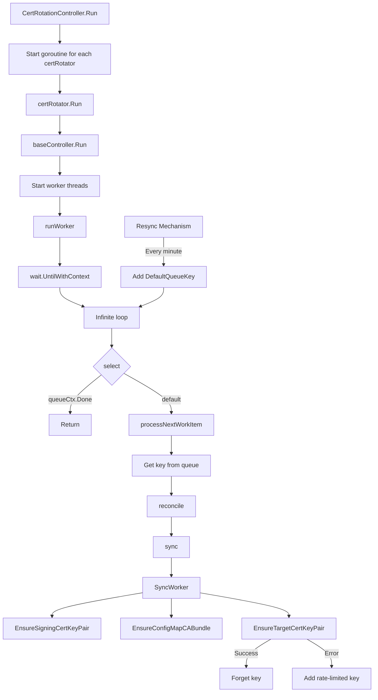
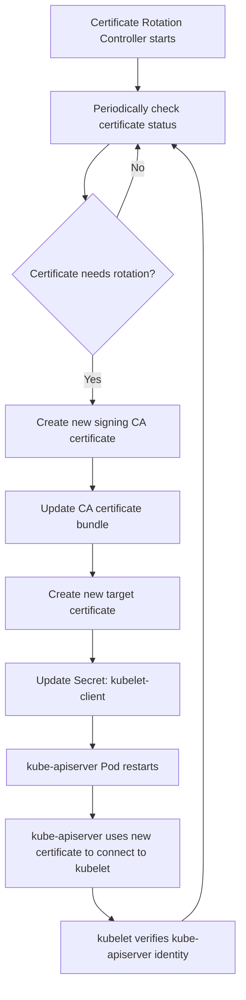

# Kubernetes Certificate Rotation Process and Monitoring Solution

## Background

When using OpenShift, users often notice that OpenShift creates/updates certificates. The certificate creation process consumes CPU resources, which may cause performance issues in CPU-sensitive scenarios. The timing of certificate creation or updates can be confusing for customers, as they cannot predict an exact time. Therefore, this article will analyze how these certificates are created, who maintains them, and when they will be updated, so that we can make appropriate plans for future operations and maintenance.

OpenShift has made many enhancements on top of Kubernetes, one of the most significant differences being the extensive use of Operators. We can view the TLS and CA certificates managed by these Operators using the following commands:

```bash
# get current time
date
# Tue Apr  1 12:02:49 AM CST 2025

# get all the secrets that are tls certificates
echo -e "NAMESPACE\tNAME\tEXPIRY" && oc get secrets -A -o go-template='{{range .items}}{{if eq .type "kubernetes.io/tls"}}{{.metadata.namespace}}{{" "}}{{.metadata.name}}{{" "}}{{index .data "tls.crt"}}{{"\n"}}{{end}}{{end}}' | while read namespace name cert; do echo -en "$namespace\t$name\t"; echo $cert | base64 -d | openssl x509 -noout -enddate; done | column -t
# NAMESPACE       NAME    EXPIRY
# ......
# openshift-apiserver-operator                      openshift-apiserver-operator-serving-cert           notAfter=Oct  20  02:54:55  2026  GMT
# openshift-apiserver                               etcd-client                                         notAfter=Oct  20  02:46:45  2027  GMT
# openshift-apiserver                               serving-cert                                        notAfter=Oct  20  02:55:08  2026  GMT
# openshift-kube-apiserver-operator                 aggregator-client-signer                            notAfter=Apr  20  04:37:04  2025  GMT
# openshift-kube-apiserver-operator                 kube-apiserver-operator-serving-cert                notAfter=Oct  20  02:54:59  2026  GMT
# openshift-kube-apiserver-operator                 kube-apiserver-to-kubelet-signer                    notAfter=Oct  20  02:44:49  2025  GMT
# openshift-kube-apiserver-operator                 kube-control-plane-signer                           notAfter=May  3   10:10:59  2025  GMT
# openshift-kube-apiserver-operator                 loadbalancer-serving-signer                         notAfter=Oct  18  02:35:45  2034  GMT
# openshift-kube-apiserver-operator                 localhost-recovery-serving-signer                   notAfter=Oct  18  02:54:45  2034  GMT
# openshift-kube-apiserver-operator                 localhost-serving-signer                            notAfter=Oct  18  02:35:46  2034  GMT
# openshift-kube-apiserver-operator                 node-system-admin-client                            notAfter=Oct  20  02:54:45  2025  GMT
# openshift-kube-apiserver-operator                 node-system-admin-signer                            notAfter=Oct  20  02:54:45  2025  GMT
# openshift-kube-apiserver-operator                 service-network-serving-signer                      notAfter=Oct  18  02:35:46  2034  GMT
# openshift-kube-apiserver                          aggregator-client                                   notAfter=Apr  20  04:37:04  2025  GMT
# openshift-kube-apiserver                          check-endpoints-client-cert-key                     notAfter=Apr  20  04:37:04  2025  GMT
# openshift-kube-apiserver                          control-plane-node-admin-client-cert-key            notAfter=Apr  20  04:37:04  2025  GMT
# openshift-kube-apiserver                          etcd-client                                         notAfter=Oct  20  02:46:45  2027  GMT
# openshift-kube-apiserver                          external-loadbalancer-serving-certkey               notAfter=Apr  20  04:37:04  2025  GMT
# openshift-kube-apiserver                          internal-loadbalancer-serving-certkey               notAfter=Apr  20  04:37:12  2025  GMT
# openshift-kube-apiserver                          kubelet-client                                      notAfter=Apr  20  04:37:04  2025  GMT
# openshift-kube-apiserver                          localhost-recovery-serving-certkey                  notAfter=Oct  18  02:54:45  2034  GMT
# openshift-kube-apiserver                          localhost-serving-cert-certkey                      notAfter=Apr  20  04:37:04  2025  GMT
# openshift-kube-apiserver                          service-network-serving-certkey                     notAfter=Apr  20  04:37:13  2025  GMT
# ......

# get CA Bundle Certificates
oc get configmap -A -o json | jq -r '.items[] | select(.data["service-ca.crt"] or .data["ca-bundle.crt"]) | [.metadata.namespace, .metadata.name] | join("\t")'  | column -t
# ......
# openshift-apiserver-operator                      openshift-service-ca.crt
# openshift-apiserver-operator                      trusted-ca-bundle
# openshift-apiserver                               etcd-serving-ca
# openshift-apiserver                               openshift-service-ca.crt
# openshift-apiserver                               trusted-ca-bundle
# openshift-kube-apiserver-operator                 kube-apiserver-to-kubelet-client-ca
# openshift-kube-apiserver-operator                 kube-control-plane-signer-ca
# openshift-kube-apiserver-operator                 loadbalancer-serving-ca
# openshift-kube-apiserver-operator                 localhost-recovery-serving-ca
# openshift-kube-apiserver-operator                 localhost-serving-ca
# openshift-kube-apiserver-operator                 node-system-admin-ca
# openshift-kube-apiserver-operator                 openshift-service-ca.crt
# openshift-kube-apiserver-operator                 service-network-serving-ca
# openshift-kube-apiserver                          aggregator-client-ca
# openshift-kube-apiserver                          client-ca
# openshift-kube-apiserver                          etcd-serving-ca
# openshift-kube-apiserver                          kube-apiserver-server-ca
# openshift-kube-apiserver                          kubelet-serving-ca
# openshift-kube-apiserver                          openshift-service-ca.crt
# openshift-kube-apiserver                          trusted-ca-bundle
# ......

```

We can see that there are a large number of certificates, and most of them expire within 1-2 years. Among them, the most noticeable to customers, and also the starting point of [Red Hat Case 03857456](https://docs.google.com/document/d/16U2TLCRglmwPWYfjZu-nBtZSHp7JeujNDFXldVRdtHk/edit?tab=t.0#heading=h.tqctc166nwq9) failure, is the expiration of the `openshift-kube-apiserver-operator/kube-apiserver-to-kubelet-signer` certificate. Its expiration will cause the API Server to restart, which has a certain impact on the cluster.

This document details the certificate rotation process in a Kubernetes cluster, especially the certificate rotation mechanism from kube-apiserver to kubelet, and how to effectively monitor certificates before and during updates. The source code for `openshift-kube-apiserver-operator` is [here](https://github.com/openshift/cluster-kube-apiserver-operator), and this analysis is based on research of the source code, with the assistance of AI technology during the analysis process.

## 1. Certificate Rotation Overview

In a Kubernetes cluster, certificate rotation is an automated process that ensures certificates are updated before they expire, thereby maintaining the security and availability of the cluster. The Certificate Rotation Controller (CertRotationController) is responsible for managing multiple certificate rotators, each responsible for updating a specific type of certificate.

### 1.1 Certificate Rotation Controller Structure

The certificate rotation controller is implemented in `pkg/operator/certrotationcontroller/certrotationcontroller.go` and mainly includes the following components:

```go
type CertRotationController struct {
    certRotators []factory.Controller
    // ... other fields
}
```

Each certificate rotator is responsible for a specific type of certificate, such as `KubeAPIServerToKubeletClientCert`, `AggregatorProxyClientCert`, etc.

### 1.2 Certificate Rotator Configuration

Taking `KubeAPIServerToKubeletClientCert` as an example, its configuration is as follows:

```go
certRotator = certrotation.NewCertRotationController(
    "KubeAPIServerToKubeletClientCert",
    certrotation.RotatedSigningCASecret{
        Namespace: operatorclient.OperatorNamespace,
        Name:      "kube-apiserver-to-kubelet-signer",
        AdditionalAnnotations: certrotation.AdditionalAnnotations{
            JiraComponent: "kube-apiserver",
        },
        Validity: 1 * 365 * defaultRotationDay, // Validity period is 1 year
        // Refresh time is set to 80% of the validity period
        Refresh:                292 * defaultRotationDay,
        RefreshOnlyWhenExpired: refreshOnlyWhenExpired,
        EventRecorder: eventRecorder,
        // ... other configurations
    },
    // ... other configurations
)
```

Key parameter explanations:
- **Validity**: The validity period of the certificate, set to 1 year here
- **Refresh**: The refresh period of the certificate, set to 292 days here (approximately 80% of the validity period)
- **RefreshOnlyWhenExpired**: Whether to refresh only when the certificate expires; if set to true, it will only refresh when the certificate expires

When a CA certificate rotates, the following process occurs:

1. Create a new CA certificate and key pair
2. Add the new CA certificate to the CA certificate bundle
3. The old CA certificate is retained in the certificate bundle until it expires
4. New target certificates will be signed using the new CA certificate

This mechanism ensures a smooth transition period during CA certificate rotation, during which both old and new CA certificates are trusted, thereby avoiding service interruptions.

```go
certrotation.CABundleConfigMap{
			Namespace: operatorclient.OperatorNamespace,
			Name:      "kube-apiserver-to-kubelet-client-ca",
			AdditionalAnnotations: certrotation.AdditionalAnnotations{
				JiraComponent: "kube-apiserver",
			},
			EventRecorder: eventRecorder,
      // ... other configurations
		},
```

Key parameter explanations:
- **Namespace**: The namespace where the ConfigMap is located, which is the operator's namespace here
- **Name**: The name of the ConfigMap, used to store the CA certificate bundle
- **EventRecorder**: Used to record certificate-related events, facilitating subsequent monitoring and troubleshooting

```go
		certrotation.RotatedSelfSignedCertKeySecret{
			Namespace: operatorclient.TargetNamespace,
			Name:      "kubelet-client",
			AdditionalAnnotations: certrotation.AdditionalAnnotations{
				JiraComponent: "kube-apiserver",
			},
			Validity:               30 * rotationDay,
			Refresh:                15 * rotationDay,
			CertCreator: &certrotation.ClientRotation{
				UserInfo: &user.DefaultInfo{Name: "system:kube-apiserver", Groups: []string{"kube-master"}},
			},
			EventRecorder: eventRecorder,
      // ... other configurations
		},
```

Key parameter explanations:
- **Namespace**: The namespace where the Secret is located, which is the target namespace here
- **Name**: The name of the Secret, used to store the client certificate and key
- **Validity**: The validity period of the certificate, set to 30 days here
- **Refresh**: The refresh period of the certificate, set to 15 days here (approximately 50% of the validity period)
- **CertCreator**: The certificate creator, specifying the user information of the certificate (system:kube-apiserver), which determines the permission scope of the certificate

From the above data structure, we can infer that the CA bundle update also follows the client certificate update, because the CA bundle is used to verify the client certificate. When the client certificate needs to be updated, the corresponding CA bundle also needs to be updated to ensure the integrity of the verification chain.

## 2. Certificate Rotation Internal Mechanism

With the core data structure, let's look at the overall process of certificate updates. This process is not only used internally by `openshift-kube-apiserver-operator`, but also calls common class libraries, so this pattern can be reused in multiple Operators, ensuring the consistency and reliability of the certificate rotation mechanism.

### 2.1 Controller Execution Flow



#### Controller Structure

The certificate rotation process is managed by the `CertRotationController` in `pkg/operator/certrotationcontroller/certrotationcontroller.go`. This controller creates and manages multiple certificate rotators, each responsible for rotating specific certificates.

#### Initialization Flow

1. The `CertRotationController` is created with multiple certificate rotators:
```go
certRotator = certrotation.NewCertRotationController(
    "KubeAPIServerToKubeletClientCert",
    certrotation.RotatedSigningCASecret{...},
    certrotation.CABundleConfigMap{...},
    certrotation.RotatedSelfSignedCertKeySecret{...},
    eventRecorder,
    &certrotation.StaticPodConditionStatusReporter{OperatorClient: operatorClient},
)
```

2. Each rotator is added to the controller's list:
   ```go
   ret.certRotators = append(ret.certRotators, certRotator)
   ```

#### Execution Flow

When the controller is run, it starts each certificate rotator in a separate goroutine:

```go
func (c *CertRotationController) Run(ctx context.Context, workers int) {
    // ...
    for _, certRotator := range c.certRotators {
        go certRotator.Run(ctx, workers)
    }
    // ...
}
```

#### Internal Loop Mechanism

The internal loop that handles certificate rotation is implemented in the factory controller pattern in the OpenShift library-go package. Here's how it works:

1. Each `certRotator.Run(ctx, workers)` call executes the `baseController.Run` method from `vendor/github.com/openshift/library-go/pkg/controller/factory/base_controller.go`:

    ```go
    func (c *baseController) Run(ctx context.Context, workers int) {
        // ...
        for i := 1; i <= workers; i++ {
            workerWg.Add(1)
            go func() {
                defer workerWg.Done()
            }()
            c.runWorker(queueContext)
        }
        // ...
    }
    ```

2. The `runWorker` method in `vendor/github.com/openshift/library-go/pkg/controller/factory/base_controller.go` contains the actual internal loop:

    ```go
    func (c *baseController) runWorker(queueCtx context.Context) {
        wait.UntilWithContext(
            queueCtx,
            func(queueCtx context.Context) {
                defer utilruntime.HandleCrash(c.degradedPanicHandler)
                for {
                    select {
                    case <-queueCtx.Done():
                        return
                    default:
                        c.processNextWorkItem(queueCtx)
                    }
                }
            },
            1*time.Second)
    }
    ```

3. The `processNextWorkItem` method in `vendor/github.com/openshift/library-go/pkg/controller/factory/base_controller.go` gets an item from the queue and processes it:

   ```go
   func (c *baseController) processNextWorkItem(queueCtx context.Context) {
       key, quit := c.syncContext.Queue().Get()
       if quit {
           return
       }
       defer c.syncContext.Queue().Done(key)
       
       // ...
       
       if err := c.reconcile(queueCtx, syncCtx); err != nil {
           // Handle error and requeue if needed
           c.syncContext.Queue().AddRateLimited(key)
           return
       }
       
       c.syncContext.Queue().Forget(key)
   }
   ```

4. The `reconcile` method calls the `sync` method, which for the certificate rotator calls `SyncWorker` from `vendor/github.com/openshift/library-go/pkg/operator/certrotation/client_cert_rotation_controller.go`:

   ```go
   func (c CertRotationController) Sync(ctx context.Context, syncCtx factory.SyncContext) error {
       syncErr := c.SyncWorker(ctx)
       // ...
       return syncErr
   }
   ```

5. The `SyncWorker` method in `vendor/github.com/openshift/library-go/pkg/operator/certrotation/client_cert_rotation_controller.go` performs the actual certificate rotation:

   ```go
   func (c CertRotationController) SyncWorker(ctx context.Context) error {
       signingCertKeyPair, err := c.RotatedSigningCASecret.EnsureSigningCertKeyPair(ctx)
       if err != nil {
           return err
       }
       
       cabundleCerts, err := c.CABundleConfigMap.EnsureConfigMapCABundle(ctx, signingCertKeyPair)
       if err != nil {
           return err
       }
       
       if _, err := c.RotatedSelfSignedCertKeySecret.EnsureTargetCertKeyPair(ctx, signingCertKeyPair, cabundleCerts); err != nil {
           return err
       }
       
       return nil
   }
   ```

#### Resync Mechanism

The controller also has a resync mechanism that adds items to the queue periodically in `vendor/github.com/openshift/library-go/pkg/controller/factory/base_controller.go`:

```go
if c.resyncEvery > 0 {
		workerWg.Add(1)
		if c.resyncEvery < 60*time.Second {
			// Warn about too fast resyncs as they might drain the operators QPS.
			// This event is cheap as it is only emitted on operator startup.
			c.syncContext.Recorder().Warningf("FastControllerResync", "Controller %q resync interval is set to %s which might lead to client request throttling", c.name, c.resyncEvery)
		}
		go func() {
			defer workerWg.Done()
			wait.UntilWithContext(ctx, func(ctx context.Context) { c.syncContext.Queue().Add(DefaultQueueKey) }, c.resyncEvery)
		}()
}
```

By default, this resync happens every minute, ensuring certificates are checked regularly and rotated when needed based on their validity periods and refresh settings.

After the controller starts, it creates a goroutine for each certificate rotator, and each rotator runs an infinite loop that periodically checks the certificate status and rotates it when needed. This parallel processing approach ensures that the rotation processes of various types of certificates do not interfere with each other, improving the reliability of the system.

### 2.2 Certificate Rotation Process

The certificate rotation process includes three main steps:

1. **EnsureSigningCertKeyPair**: Ensure the signing CA certificate and key pair are valid, creating or rotating them if needed
2. **EnsureConfigMapCABundle**: Update the CA certificate bundle ConfigMap with the current signing CA certificate
3. **EnsureTargetCertKeyPair**: Ensure the target certificate and key pair are valid, creating or rotating them if needed

### 2.3 Certificate Rotation Decision Logic

The controller uses the following logic to decide when to rotate certificates, which is the core decision mechanism in the certificate rotation process:

```go
func needNewTargetCertKeyPairForTime(annotations map[string]string, signer *crypto.CA, refresh time.Duration, refreshOnlyWhenExpired bool) string {
    // Check if the certificate has already expired
    if time.Now().After(notAfter) {
        return "already expired"
    }

    // If set to refresh only when expired, do not perform early refresh
    if refreshOnlyWhenExpired {
        return ""
    }

    // Check if it has reached 80% of the validity period
    validity := notAfter.Sub(notBefore)
    at80Percent := notAfter.Add(-validity / 5)
    if time.Now().After(at80Percent) {
        return fmt.Sprintf("past its latest possible time %v", at80Percent)
    }

    // Check if it has reached the preset refresh time
    refreshTime := notBefore.Add(refresh)
    if time.Now().After(refreshTime) {
        // Ensure the signing CA has been valid for more than 10% of the target refresh time
        timeToWaitForTrustRotation := refresh / 10
        if time.Now().After(signer.Config.Certs[0].NotBefore.Add(time.Duration(timeToWaitForTrustRotation))) {
            return fmt.Sprintf("past its refresh time %v", refreshTime)
        }
    }

    return ""
}
```

The conditions for triggering certificate rotation include:
- The certificate has already expired (highest priority condition)
- The certificate validity period has reached 80% (if RefreshOnlyWhenExpired is false)
- The preset refresh time has been reached (specified by the Refresh parameter)

These conditions ensure that there is enough time for certificate rotation before expiration, while avoiding unnecessary frequent rotations.

## 3. Certificate Rotation Events and Logs

### 3.1 Event Triggering Mechanism

During the certificate rotation process, the system triggers Kubernetes events at key points, which can be viewed using the `kubectl get events` command. These events provide important sources of information for monitoring and troubleshooting.

#### 3.1.1 Signing CA Certificate Rotation Events

When a signing CA certificate needs to be rotated, the system triggers an event:

```go
c.EventRecorder.Eventf("SignerUpdateRequired", "%q in %q requires a new signing cert/key pair: %v", c.Name, c.Namespace, reason)
```

#### 3.1.2 CA Certificate Bundle Update Events

When a CA certificate bundle needs to be updated, the system triggers an event:

```go
c.EventRecorder.Eventf("CABundleUpdateRequired", "%q in %q requires a new cert", c.Name, c.Namespace)
```

#### 3.1.3 Target Certificate Rotation Events

When a target certificate needs to be rotated, the system triggers an event:

```go
c.EventRecorder.Eventf("TargetUpdateRequired", "%q in %q requires a new target cert/key pair: %v", c.Name, c.Namespace, reason)
```

### 3.2 Relationship Between Events and Certificate Updates

**Important finding**: Certificate rotation events and actual certificate updates occur immediately within the same controller cycle:

1. The controller runs checks every minute (triggered by the resync mechanism)
2. When a certificate needs to be rotated, an event is issued (e.g., `SignerUpdateRequired`)
3. In the same function call, a new certificate is immediately created and applied
4. There is no delay between the event being issued and the certificate being updated; they are atomic operations

This means that when we observe a certificate rotation event, the corresponding certificate update operation has already been completed or is in progress, which is very important for monitoring and troubleshooting.

### 3.3 Logging Mechanism

In addition to Kubernetes events, key operations in the certificate rotation process are also recorded in the system logs, providing more detailed information:

```go
klog.Infof("Starting CertRotation")
klog.Infof("Waiting for CertRotation")
klog.V(2).Infof("Updated ca-bundle.crt configmap %s/%s with:\n%s", certs.CertificateBundleToString(updatedCerts), caBundleConfigMap.Namespace, caBundleConfigMap.Name)
```

## 4. kube-apiserver to kubelet Certificate Rotation Flow

Below is the detailed flow of certificate rotation from kube-apiserver to kubelet, which is one of the most critical parts of the entire certificate rotation mechanism:

### 4.1 Certificate Rotation Flow Chart



### 4.3 How kubelet Verifies kube-apiserver's Certificate

The kubelet does not need to be redeployed to accept the new kube-apiserver certificate. This is because:

1. This certificate is a client certificate used by kube-apiserver to authenticate to kubelet
2. The kubelet verifies whether the certificate provided by kube-apiserver is signed by a trusted CA
3. The kubelet verifies kube-apiserver's client certificate using the CA certificate file specified by the `--kubelet-client-ca` flag

This mechanism ensures a smooth transition during the certificate rotation process, without the need to restart or reconfigure the kubelet.

Example kubelet configuration:

```bash
/usr/bin/kubelet --config=/etc/kubernetes/kubelet.conf --bootstrap-kubeconfig=/etc/kubernetes/kubeconfig --kubeconfig=/var/lib/kubelet/kubeconfig --container-runtime-endpoint=/var/run/crio/crio.sock ...
```

Relevant configuration in kubelet.conf:

```yaml
"authentication": {
  "x509": {
    "clientCAFile": "/etc/kubernetes/kubelet-ca.crt"
  },
  "webhook": {
    "cacheTTL": "0s"
  },
  "anonymous": {
    "enabled": false
  }
},
```

In OpenShift 4.14+, the `/etc/kubernetes/kubelet.conf` configuration is managed by the Machine Config Operator, and the `clientCAFile` setting (pointing to `/etc/kubernetes/kubelet-ca.crt`) is also maintained by the Machine Config Operator. This centralized management approach simplifies the certificate management process and improves the reliability of the system.

## 5. Certificate Monitoring Solution (To Be Verified)

We already know that certificate updates generate Kubernetes-level events and logs, so we can monitor these events and logs to implement monitoring of certificate rotation. This monitoring is crucial for preventing service interruptions caused by certificate expiration. The specific monitoring solution can refer to the following steps:

### 5.1 Event-Based Monitoring

The certificate rotation controller generates specific Kubernetes events when performing certificate rotation operations. We can monitor these events to get real-time information about certificate rotation and timely understand certificate status changes:

1. **Monitor key event types**:
   - `SignerUpdateRequired`: Signing CA certificate needs to be updated
   - `CABundleUpdateRequired`: CA certificate bundle needs to be updated
   - `TargetUpdateRequired`: Target certificate needs to be updated

2. **Event monitoring implementation**:
   ```bash
   # Use kubectl to monitor certificate rotation events in a specific namespace
   kubectl get events -n openshift-kube-apiserver-operator --field-selector reason=SignerUpdateRequired,reason=CABundleUpdateRequired,reason=TargetUpdateRequired
   
   # Use the watch command for real-time monitoring
   watch "kubectl get events -n openshift-kube-apiserver-operator | grep -E 'SignerUpdateRequired|CABundleUpdateRequired|TargetUpdateRequired'"
   ```

3. **Integration with monitoring systems**:
   - Collect events into Prometheus, using Kubernetes Event Exporter
   - Create dedicated certificate rotation event dashboards in Grafana
   - Configure event-based alerting rules

### 5.2 Log-Based Monitoring

Key operations in the certificate rotation process are recorded in the system logs. We can track the certificate rotation process by monitoring these logs and obtain more detailed operation information:

1. **Key log patterns**:
   ```
   "Starting CertRotation"
   "Waiting for CertRotation"
   "Updated ca-bundle.crt configmap"
   "Creating new target cert/key pair"
   ```

2. **Log monitoring implementation**:
   ```bash
   # View kube-apiserver-operator logs
   kubectl logs -n openshift-kube-apiserver-operator deployment/kube-apiserver-operator | grep -E "CertRotation|cert/key|ca-bundle"
   
   # Use OpenShift Logging or EFK stack to collect and analyze logs
   ```

3. **Log alert configuration**:
   - Configure log analysis tools (such as Loki, Elasticsearch) to detect certificate rotation-related log patterns
   - Set up alerting rules based on log patterns

### 5.3 Certificate Expiry Monitoring

To get alerts before certificates are about to be updated, we need to monitor the expiration time of certificates, which is the most direct preventive measure:

1. **Certificate expiration time check**:
   ```bash
   # Create a script to check the expiration time of certificates in all TLS type Secrets
   #!/bin/bash
   
   echo -e "NAMESPACE\tNAME\tEXPIRY\tDAYS_LEFT"
   kubectl get secrets -A -o go-template='{{range .items}}{{if eq .type "kubernetes.io/tls"}}{{.metadata.namespace}}{{" "}}{{.metadata.name}}{{" "}}{{index .data "tls.crt"}}{{"\n"}}{{end}}{{end}}' | while read namespace name cert; do
     if [ ! -z "$cert" ]; then
       expiry=$(echo $cert | base64 -d | openssl x509 -noout -enddate | cut -d= -f2)
       expiry_date=$(date -d "$expiry" +%s)
       current_date=$(date +%s)
       days_left=$(( ($expiry_date - $current_date) / 86400 ))
       echo -e "$namespace\t$name\t$expiry\t$days_left"
     fi
   done | sort -t $'\t' -k4,4n | column -t
   ```
  The output of this script is similar to this:
  ```log
  NAMESPACE       NAME    EXPIRY  DAYS_LEFT
  openshift-config-managed                          kube-controller-manager-client-cert-key             Apr  20  04:37:04  2025  GMT  19
  openshift-config-managed                          kube-scheduler-client-cert-key                      Apr  20  04:37:04  2025  GMT  19
  openshift-kube-apiserver                          aggregator-client                                   Apr  20  04:37:04  2025  GMT  19
  openshift-kube-apiserver                          check-endpoints-client-cert-key                     Apr  20  04:37:04  2025  GMT  19
  openshift-kube-apiserver                          control-plane-node-admin-client-cert-key            Apr  20  04:37:04  2025  GMT  19
  openshift-kube-apiserver                          external-loadbalancer-serving-certkey               Apr  20  04:37:04  2025  GMT  19
  openshift-kube-apiserver                          internal-loadbalancer-serving-certkey               Apr  20  04:37:12  2025  GMT  19
  openshift-kube-apiserver                          kubelet-client                                      Apr  20  04:37:04  2025  GMT  19
  openshift-kube-apiserver                          localhost-serving-cert-certkey                      Apr  20  04:37:04  2025  GMT  19
  openshift-kube-apiserver-operator                 aggregator-client-signer                            Apr  20  04:37:04  2025  GMT  19
  openshift-kube-apiserver                          service-network-serving-certkey                     Apr  20  04:37:13  2025  GMT  19
  openshift-kube-controller-manager                 csr-signer                                          Apr  20  04:39:51  2025  GMT  19
  ```
2. **Prometheus Monitoring Integration**:
   - Create a custom Prometheus Exporter to expose certificate expiration information
   - Use OpenShift Monitoring or a custom Prometheus instance to collect these metrics

### 5.4 Differentiated Alerting Rules Based on Certificate Types

Different types of certificates have different validity periods and refresh times, so different alerting rules need to be set for different types of certificates. This differentiated alerting strategy can more precisely monitor the lifecycle of various types of certificates. Below are differentiated alerting rules based on certificate types:

#### 5.4.1 Certificate Types and Their Characteristics

Below are examples of expiration times and refresh times for some key certificates, which are important for setting reasonable alerting thresholds:

| Certificate Type | Validity Period | Refresh Time | Refresh Percentage | Recommended Alert Threshold |
|---------|-------|---------|----------|------------|
| kube-apiserver-to-kubelet-signer | 365 days | 292 days | 80% | 60 days |
| kubelet-client | 30 days | 15 days | 50% | 7 days |
| aggregator-client-signer | 365 days | 292 days | 80% | 60 days |
| kube-control-plane-signer | 365 days | 292 days | 80% | 60 days |
| node-system-admin-signer | 365 days | 292 days | 80% | 60 days |
| loadbalancer-serving-signer | 3650 days | 2920 days | 80% | 180 days |
| localhost-serving-signer | 3650 days | 2920 days | 80% | 180 days |
| service-network-serving-signer | 3650 days | 2920 days | 80% | 180 days |

#### 5.4.2 Differentiated Alerting Rules

Below are Prometheus alerting rules for different certificate types, which can be directly integrated into existing monitoring systems:

```yaml
groups:
- name: CertificateRotation
  rules:
  # Short-term certificate alerting rules (30-day validity)
  - alert: ShortTermCertificateApproachingRotation
    expr: |
      (
        certificate_expiry_timestamp_seconds{certificate_type=~"kubelet-client|check-endpoints-client-cert-key|control-plane-node-admin-client-cert-key"} - time()
      ) / 86400 < 7 and (
        certificate_expiry_timestamp_seconds{certificate_type=~"kubelet-client|check-endpoints-client-cert-key|control-plane-node-admin-client-cert-key"} - time()
      ) / 86400 > 0
    for: 1h
    labels:
      severity: warning
    annotations:
      summary: "Short-term certificate approaching rotation"
      description: "Certificate {{ $labels.certificate_name }} (type: {{ $labels.certificate_type }}) in namespace {{ $labels.namespace }} will be rotated in {{ $value }} days."

  # Medium-term certificate alerting rules (1-year validity)
  - alert: MediumTermCertificateApproachingRotation
    expr: |
      (
        certificate_expiry_timestamp_seconds{certificate_type=~"kube-apiserver-to-kubelet-signer|aggregator-client-signer|kube-control-plane-signer|node-system-admin-signer"} - time()
      ) / 86400 < 60 and (
        certificate_expiry_timestamp_seconds{certificate_type=~"kube-apiserver-to-kubelet-signer|aggregator-client-signer|kube-control-plane-signer|node-system-admin-signer"} - time()
      ) / 86400 > 0
    for: 6h
    labels:
      severity: warning
    annotations:
      summary: "Medium-term certificate approaching rotation"
      description: "Certificate {{ $labels.certificate_name }} (type: {{ $labels.certificate_type }}) in namespace {{ $labels.namespace }} will be rotated in {{ $value }} days."

  # Long-term certificate alerting rules (10-year validity)
  - alert: LongTermCertificateApproachingRotation
    expr: |
      (
        certificate_expiry_timestamp_seconds{certificate_type=~"loadbalancer-serving-signer|localhost-serving-signer|service-network-serving-signer"} - time()
      ) / 86400 < 180 and (
        certificate_expiry_timestamp_seconds{certificate_type=~"loadbalancer-serving-signer|localhost-serving-signer|service-network-serving-signer"} - time()
      ) / 86400 > 0
    for: 24h
    labels:
      severity: warning
    annotations:
      summary: "Long-term certificate approaching rotation"
      description: "Certificate {{ $labels.certificate_name }} (type: {{ $labels.certificate_type }}) in namespace {{ $labels.namespace }} will be rotated in {{ $value }} days."

  # General certificate near expiry critical alert
  - alert: CertificateNearExpiry
    expr: |
      (
        certificate_expiry_timestamp_seconds - time()
      ) / 86400 < 3 and (
        certificate_expiry_timestamp_seconds - time()
      ) / 86400 > 0
    for: 1h
    labels:
      severity: critical
    annotations:
      summary: "Certificate near expiry"
      description: "Certificate {{ $labels.certificate_name }} in namespace {{ $labels.namespace }} will expire in {{ $value }} days, immediate action required!"
```

### 5.5 Specific Alerts for Certificate Rotation Events

In addition to alerts based on certificate expiration time, alerts based on certificate rotation events can also be set up, which helps monitor the frequency and abnormal situations of certificate rotation:

```yaml
groups:
- name: CertificateRotationEvents
  rules:
  - alert: CertificateRotationInProgress
    expr: |
      sum by (namespace, certificate_name) (
        increase(kube_event_count{reason=~"SignerUpdateRequired|CABundleUpdateRequired|TargetUpdateRequired"}[15m])
      ) > 0
    for: 5m
    labels:
      severity: info
    annotations:
      summary: "Certificate rotation in progress"
      description: "Certificate {{ $labels.certificate_name }} in namespace {{ $labels.namespace }} is undergoing rotation."

  - alert: FrequentCertificateRotation
    expr: |
      sum by (namespace, certificate_name) (
        increase(kube_event_count{reason=~"SignerUpdateRequired|CABundleUpdateRequired|TargetUpdateRequired"}[1d])
      ) > 3
    for: 1h
    labels:
      severity: warning
    annotations:
      summary: "Frequent certificate rotation"
      description: "Certificate {{ $labels.certificate_name }} in namespace {{ $labels.namespace }} has undergone multiple rotations in the past 24 hours, there may be a configuration issue."
```

## 6. Summary

Certificate rotation is an important part of the security mechanism of Kubernetes clusters. By understanding the internal mechanism of certificate rotation and implementing appropriate monitoring solutions, the smooth progress of the certificate update process can be ensured, avoiding service interruptions caused by certificate expiration.

Effective monitoring before and during certificate updates can help administrators discover potential problems in a timely manner, ensuring the security and stable operation of the cluster. By deploying differentiated alerting rules based on certificate types, the lifecycle of different types of certificates can be monitored more precisely, and operational preparations can be made in advance to avoid unexpected problems caused by certificate rotation.

To create a comprehensive certificate expiration and renewal monitoring solution, we need to collect all operators for the target cluster, study the source code to determine the exact certificate and renewal timestamps, and then write monitoring and alerting rules based on this information.
