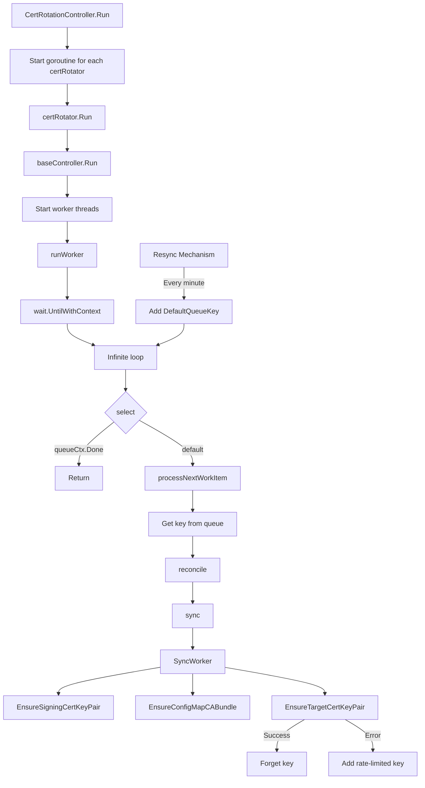
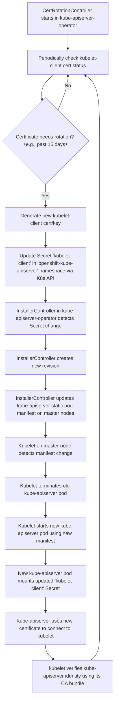
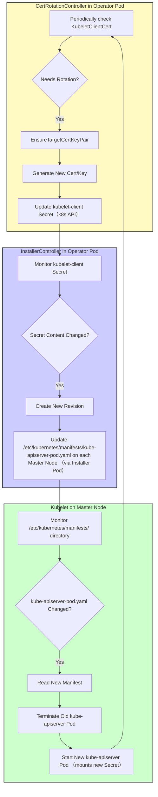

> [!WARNING] 
> Working in progress, use with caution.
# Kubernetes Certificate Rotation Process and Monitoring Solution

## 1. Background

When using OpenShift, users often notice that OpenShift creates/updates certificates. The certificate creation process consumes CPU resources, which may cause performance issues in CPU-sensitive scenarios. The timing of certificate creation or updates can be confusing for customers, as they cannot predict an exact time. Therefore, this article will analyze how these certificates are created, who maintains them, and when they will be updated, so that we can make appropriate plans for future operations and maintenance.

OpenShift has made many enhancements on top of Kubernetes, one of the most significant differences being the extensive use of Operators. We can view the TLS and CA certificates managed by these Operators using the following commands:

```bash
# get current time
date
# Tue Apr  1 12:02:49 AM CST 2025

# get all the secrets that are tls certificates
echo -e "NAMESPACE\tNAME\tEXPIRY" && oc get secrets -A -o go-template='{{range .items}}{{if eq .type "kubernetes.io/tls"}}{{.metadata.namespace}}{{" "}}{{.metadata.name}}{{" "}}{{index .data "tls.crt"}}{{"\n"}}{{end}}{{end}}' | while read namespace name cert; do echo -en "$namespace\t$name\t"; echo $cert | base64 -d | openssl x509 -noout -enddate; done | column -t
# NAMESPACE       NAME    EXPIRY
# ......
# openshift-apiserver-operator                      openshift-apiserver-operator-serving-cert           notAfter=Oct  20  02:54:55  2026  GMT
# openshift-apiserver                               etcd-client                                         notAfter=Oct  20  02:46:45  2027  GMT
# openshift-apiserver                               serving-cert                                        notAfter=Oct  20  02:55:08  2026  GMT
# openshift-kube-apiserver-operator                 aggregator-client-signer                            notAfter=Apr  20  04:37:04  2025  GMT
# openshift-kube-apiserver-operator                 kube-apiserver-operator-serving-cert                notAfter=Oct  20  02:54:59  2026  GMT
# openshift-kube-apiserver-operator                 kube-apiserver-to-kubelet-signer                    notAfter=Oct  20  02:44:49  2025  GMT
# openshift-kube-apiserver-operator                 kube-control-plane-signer                           notAfter=May  3   10:10:59  2025  GMT
# openshift-kube-apiserver-operator                 loadbalancer-serving-signer                         notAfter=Oct  18  02:35:45  2034  GMT
# openshift-kube-apiserver-operator                 localhost-recovery-serving-signer                   notAfter=Oct  18  02:54:45  2034  GMT
# openshift-kube-apiserver-operator                 localhost-serving-signer                            notAfter=Oct  18  02:35:46  2034  GMT
# openshift-kube-apiserver-operator                 node-system-admin-client                            notAfter=Oct  20  02:54:45  2025  GMT
# openshift-kube-apiserver-operator                 node-system-admin-signer                            notAfter=Oct  20  02:54:45  2025  GMT
# openshift-kube-apiserver-operator                 service-network-serving-signer                      notAfter=Oct  18  02:35:46  2034  GMT
# openshift-kube-apiserver                          aggregator-client                                   notAfter=Apr  20  04:37:04  2025  GMT
# openshift-kube-apiserver                          check-endpoints-client-cert-key                     notAfter=Apr  20  04:37:04  2025  GMT
# openshift-kube-apiserver                          control-plane-node-admin-client-cert-key            notAfter=Apr  20  04:37:04  2025  GMT
# openshift-kube-apiserver                          etcd-client                                         notAfter=Oct  20  02:46:45  2027  GMT
# openshift-kube-apiserver                          external-loadbalancer-serving-certkey               notAfter=Apr  20  04:37:04  2025  GMT
# openshift-kube-apiserver                          internal-loadbalancer-serving-certkey               notAfter=Apr  20  04:37:12  2025  GMT
# openshift-kube-apiserver                          kubelet-client                                      notAfter=Apr  20  04:37:04  2025  GMT
# openshift-kube-apiserver                          localhost-recovery-serving-certkey                  notAfter=Oct  18  02:54:45  2034  GMT
# openshift-kube-apiserver                          localhost-serving-cert-certkey                      notAfter=Apr  20  04:37:04  2025  GMT
# openshift-kube-apiserver                          service-network-serving-certkey                     notAfter=Apr  20  04:37:13  2025  GMT
# ......

# get CA Bundle Certificates
oc get configmap -A -o json | jq -r '.items[] | select(.data["service-ca.crt"] or .data["ca-bundle.crt"]) | [.metadata.namespace, .metadata.name] | join("\t")'  | column -t
# ......
# openshift-apiserver-operator                      openshift-service-ca.crt
# openshift-apiserver-operator                      trusted-ca-bundle
# openshift-apiserver                               etcd-serving-ca
# openshift-apiserver                               openshift-service-ca.crt
# openshift-apiserver                               trusted-ca-bundle
# openshift-kube-apiserver-operator                 kube-apiserver-to-kubelet-client-ca
# openshift-kube-apiserver-operator                 kube-control-plane-signer-ca
# openshift-kube-apiserver-operator                 loadbalancer-serving-ca
# openshift-kube-apiserver-operator                 localhost-recovery-serving-ca
# openshift-kube-apiserver-operator                 localhost-serving-ca
# openshift-kube-apiserver-operator                 node-system-admin-ca
# openshift-kube-apiserver-operator                 openshift-service-ca.crt
# openshift-kube-apiserver-operator                 service-network-serving-ca
# openshift-kube-apiserver                          aggregator-client-ca
# openshift-kube-apiserver                          client-ca
# openshift-kube-apiserver                          etcd-serving-ca
# openshift-kube-apiserver                          kube-apiserver-server-ca
# openshift-kube-apiserver                          kubelet-serving-ca
# openshift-kube-apiserver                          openshift-service-ca.crt
# openshift-kube-apiserver                          trusted-ca-bundle
# ......

```

We can see that there are a large number of certificates, and most of them expire within 1-2 years. Among them, the most noticeable to customers, and also the starting point of [Red Hat Case 03857456](https://docs.google.com/document/d/16U2TLCRglmwPWYfjZu-nBtZSHp7JeujNDFXldVRdtHk/edit?tab=t.0#heading=h.tqctc166nwq9) failure, is the expiration of the `openshift-kube-apiserver-operator/kube-apiserver-to-kubelet-signer` certificate. Its expiration will cause the API Server to restart, which has a certain impact on the cluster.

This document details the certificate rotation process in a Kubernetes cluster, especially the certificate rotation mechanism from kube-apiserver to kubelet, and how to effectively monitor certificates before and during updates. The source code for `openshift-kube-apiserver-operator` is [here](https://github.com/openshift/cluster-kube-apiserver-operator), and this analysis is based on research of the source code, with the assistance of AI technology during the analysis process.

## 2. Certificate Rotation Overview

In a Kubernetes cluster, certificate rotation is an automated process that ensures certificates are updated before they expire, thereby maintaining the security and availability of the cluster. The Certificate Rotation Controller (CertRotationController) is responsible for managing multiple certificate rotators, each responsible for updating a specific type of certificate.

### 2.1 Certificate Rotation Controller Structure

The certificate rotation controller is implemented in `pkg/operator/certrotationcontroller/certrotationcontroller.go` and mainly includes the following components:

```go
type CertRotationController struct {
    certRotators []factory.Controller
    // ... other fields
}
```

Each certificate rotator is responsible for a specific type of certificate, such as `KubeAPIServerToKubeletClientCert`, `AggregatorProxyClientCert`, etc.

### 2.2 Certificate Rotator Configuration

Taking `KubeAPIServerToKubeletClientCert` as an example, its configuration involves three parts: the signing CA secret, the CA bundle config map, and the target certificate secret.

#### 2.2.1 Signing CA Secret Configuration

```go
certrotation.RotatedSigningCASecret{
    Namespace: operatorclient.OperatorNamespace,
    Name:      "kube-apiserver-to-kubelet-signer",
    AdditionalAnnotations: certrotation.AdditionalAnnotations{
        JiraComponent: "kube-apiserver",
    },
    Validity: 1 * 365 * defaultRotationDay, // Validity period is 1 year
    // Refresh time is set to 80% of the validity period
    Refresh:                292 * defaultRotationDay,
    RefreshOnlyWhenExpired: refreshOnlyWhenExpired,
    EventRecorder: eventRecorder,
    // ... other configurations
}
```

Key parameter explanations:
- **Validity**: The validity period of the signing CA certificate, set to 1 year here.
- **Refresh**: The refresh period of the signing CA certificate, set to 292 days here (approximately 80% of the validity period).
- **RefreshOnlyWhenExpired**: Whether to refresh only when the certificate expires; if set to true, it will only refresh when the certificate expires.

When a signing CA certificate rotates, the following process occurs:
1. Create a new CA certificate and key pair.
2. Add the new CA certificate to the CA certificate bundle (see next section).
3. The old CA certificate is retained in the certificate bundle until it expires.
4. New target certificates will be signed using the new CA certificate.

This mechanism ensures a smooth transition period during CA certificate rotation, during which both old and new CA certificates are trusted, thereby avoiding service interruptions.

#### 2.2.2 CA Bundle ConfigMap Configuration

```go
certrotation.CABundleConfigMap{
    Namespace: operatorclient.OperatorNamespace,
    Name:      "kube-apiserver-to-kubelet-client-ca",
    AdditionalAnnotations: certrotation.AdditionalAnnotations{
        JiraComponent: "kube-apiserver",
    },
    EventRecorder: eventRecorder,
    // ... other configurations
}
```

Key parameter explanations:
- **Namespace**: The namespace where the ConfigMap is located, which is the operator's namespace here.
- **Name**: The name of the ConfigMap, used to store the CA certificate bundle. This bundle contains the current and potentially previous signing CA certificates to ensure trust during rotation.
- **EventRecorder**: Used to record certificate-related events, facilitating subsequent monitoring and troubleshooting.

#### 2.2.3 Target Certificate Secret Configuration

```go
certrotation.RotatedSelfSignedCertKeySecret{
    Namespace: operatorclient.TargetNamespace,
    Name:      "kubelet-client",
    AdditionalAnnotations: certrotation.AdditionalAnnotations{
        JiraComponent: "kube-apiserver",
    },
    Validity:               30 * rotationDay,
    Refresh:                15 * rotationDay,
    CertCreator: &certrotation.ClientRotation{
        UserInfo: &user.DefaultInfo{Name: "system:kube-apiserver", Groups: []string{"kube-master"}},
    },
    EventRecorder: eventRecorder,
    // ... other configurations
}
```

Key parameter explanations:
- **Namespace**: The namespace where the Secret is located, which is the target namespace (`openshift-kube-apiserver`) here.
- **Name**: The name of the Secret, used to store the client certificate and key (`kubelet-client`).
- **Validity**: The validity period of the target certificate, set to 30 days here.
- **Refresh**: The refresh period of the target certificate, set to 15 days here (approximately 50% of the validity period).
- **CertCreator**: The certificate creator, specifying the user information of the certificate (`system:kube-apiserver`), which determines the permission scope of the certificate.

From the above data structure, we can infer that the CA bundle update also follows the signing CA certificate update. When the signing CA certificate needs to be updated, the corresponding CA bundle also needs to be updated to include the new CA, ensuring the integrity of the verification chain for target certificates.

## 3. Certificate Rotation Internal Mechanism

With the core data structure understood, let's look at the overall process of certificate updates. This process is not only used internally by `openshift-kube-apiserver-operator`, but also calls common class libraries (`library-go`), so this pattern can be reused in multiple Operators, ensuring the consistency and reliability of the certificate rotation mechanism.

### 3.1 Controller Execution Flow



#### 3.1.1 Controller Structure

The certificate rotation process is managed by the `CertRotationController` in `pkg/operator/certrotationcontroller/certrotationcontroller.go`. This controller creates and manages multiple certificate rotators, each responsible for rotating specific certificates (signing CA, CA bundle, target certificate).

#### 3.1.2 Initialization Flow

1. The `CertRotationController` is created with multiple certificate rotators, for example, for `KubeAPIServerToKubeletClientCert`:
   ```go
   certRotator = certrotation.NewCertRotationController(
       "KubeAPIServerToKubeletClientCert",
       certrotation.RotatedSigningCASecret{...}, // Config for the signer secret
       certrotation.CABundleConfigMap{...},    // Config for the CA bundle configmap
       certrotation.RotatedSelfSignedCertKeySecret{...}, // Config for the target secret
       eventRecorder,
       &certrotation.StaticPodConditionStatusReporter{OperatorClient: operatorClient},
   )
   ```

2. Each rotator is added to the controller's list:
   ```go
   ret.certRotators = append(ret.certRotators, certRotator)
   ```

#### 3.1.3 Execution Flow

When the controller is run, it starts each certificate rotator in a separate goroutine:

```go
func (c *CertRotationController) Run(ctx context.Context, workers int) {
    // ...
    for _, certRotator := range c.certRotators {
        go certRotator.Run(ctx, workers)
    }
    // ...
}
```

#### 3.1.4 Internal Loop Mechanism

The internal loop that handles certificate rotation is implemented in the factory controller pattern in the OpenShift `library-go` package. Here's how it works:

1. Each `certRotator.Run(ctx, workers)` call executes the `baseController.Run` method from `vendor/github.com/openshift/library-go/pkg/controller/factory/base_controller.go`:

    ```go
    func (c *baseController) Run(ctx context.Context, workers int) {
        // ...
        for i := 1; i <= workers; i++ {
            workerWg.Add(1)
            go func() {
                defer workerWg.Done()
                // Pass the queue context to runWorker
                c.runWorker(queueContext) 
            }()
        }
        // ...
    }
    ```

2. The `runWorker` method in `vendor/github.com/openshift/library-go/pkg/controller/factory/base_controller.go` contains the actual internal loop:

    ```go
    func (c *baseController) runWorker(queueCtx context.Context) {
        wait.UntilWithContext(
            queueCtx,
            func(queueCtx context.Context) {
                defer utilruntime.HandleCrash(c.degradedPanicHandler)
                for {
                    select {
                    case <-queueCtx.Done():
                        return
                    default:
                        // Process items until context is cancelled
                        if !c.processNextWorkItem(queueCtx) { 
                            // If processNextWorkItem returns false, it means the queue is shutting down
                            return 
                        }
                    }
                }
            },
            1*time.Second) // Wait time between checks if queue is empty
    }
    ```

3. The `processNextWorkItem` method in `vendor/github.com/openshift/library-go/pkg/controller/factory/base_controller.go` gets an item from the queue and processes it:

   ```go
   func (c *baseController) processNextWorkItem(queueCtx context.Context) bool { // Returns bool indicating if processing should continue
       key, quit := c.syncContext.Queue().Get()
       if quit {
           return false // Queue is shutting down
       }
       defer c.syncContext.Queue().Done(key)
       
       // ... (Context creation for reconcile) ...
       
       if err := c.reconcile(reconcileCtx, syncCtx); err != nil {
           // Handle error and requeue if needed
           utilruntime.HandleError(fmt.Errorf("%s: failed processing item %q with error: %w", c.name, key, err))
           c.syncContext.Queue().AddRateLimited(key)
           return true // Continue processing
       }
       
       c.syncContext.Queue().Forget(key)
       return true // Continue processing
   }
   ```

4. The `reconcile` method calls the `sync` method provided during factory creation. For the certificate rotator, this calls `SyncWorker` from `vendor/github.com/openshift/library-go/pkg/operator/certrotation/client_cert_rotation_controller.go`:

   ```go
   func (c CertRotationController) Sync(ctx context.Context, syncCtx factory.SyncContext) error {
       // The actual sync logic is in SyncWorker
       syncErr := c.SyncWorker(ctx) 
       // ... (Handle status reporting based on syncErr) ...
       return syncErr // Return the error from SyncWorker
   }
   ```

5. The `SyncWorker` method in `vendor/github.com/openshift/library-go/pkg/operator/certrotation/client_cert_rotation_controller.go` performs the actual certificate rotation steps:

   ```go
   func (c CertRotationController) SyncWorker(ctx context.Context) error {
       // 1. Ensure the signing CA certificate exists and is valid
       signingCertKeyPair, err := c.RotatedSigningCASecret.EnsureSigningCertKeyPair(ctx)
       if err != nil {
           return fmt.Errorf("error ensuring signing cert/key pair: %w", err)
       }
       
       // 2. Ensure the CA bundle ConfigMap contains the valid signing CA(s)
       cabundleCerts, err := c.CABundleConfigMap.EnsureConfigMapCABundle(ctx, signingCertKeyPair)
       if err != nil {
           return fmt.Errorf("error ensuring CA bundle configmap: %w", err)
       }
       
       // 3. Ensure the target certificate exists, is valid, and signed by the current CA
       if _, err := c.RotatedSelfSignedCertKeySecret.EnsureTargetCertKeyPair(ctx, signingCertKeyPair, cabundleCerts); err != nil {
           return fmt.Errorf("error ensuring target cert/key pair: %w", err)
       }
       
       return nil // Success
   }
   ```

#### 3.1.5 Resync Mechanism

The controller also has a resync mechanism that adds items to the queue periodically, defined in `vendor/github.com/openshift/library-go/pkg/controller/factory/base_controller.go`:

```go
if c.resyncEvery > 0 {
    workerWg.Add(1)
    if c.resyncEvery < 60*time.Second {
        // Warn about too fast resyncs as they might drain the operators QPS.
        // This event is cheap as it is only emitted on operator startup.
        c.syncContext.Recorder().Warningf("FastControllerResync", "Controller %q resync interval is set to %s which might lead to client request throttling", c.name, c.resyncEvery)
    }
    go func() {
        defer workerWg.Done()
        // Periodically add the default key to trigger a reconcile
        wait.UntilWithContext(ctx, func(ctx context.Context) { c.syncContext.Queue().Add(DefaultQueueKey) }, c.resyncEvery) 
    }()
}
```

By default, this resync happens every minute (`DefaultResyncInterval = 1 * time.Minute`), ensuring certificates are checked regularly and rotated when needed based on their validity periods and refresh settings defined in the rotator configuration.

After the controller starts, it creates a goroutine for each certificate rotator, and each rotator runs an infinite loop (`runWorker`) that periodically checks the certificate status (triggered by the resync mechanism adding `DefaultQueueKey` to the queue) and rotates it when needed via the `SyncWorker` logic. This parallel processing approach ensures that the rotation processes of various types of certificates do not interfere with each other, improving the reliability of the system.

### 3.2 Certificate Rotation Process Steps

The certificate rotation process within `SyncWorker` includes three main steps:

1.  **EnsureSigningCertKeyPair**: Ensure the signing CA certificate and key pair are valid, creating or rotating them if needed.
2.  **EnsureConfigMapCABundle**: Update the CA certificate bundle ConfigMap with the current (and possibly previous) signing CA certificate(s).
3.  **EnsureTargetCertKeyPair**: Ensure the target certificate and key pair are valid, creating or rotating them if needed, signed by the current signing CA.

### 3.3 Certificate Rotation Decision Logic

The controller uses the following logic (primarily within `NeedNewTargetCertKeyPair` called by `EnsureTargetCertKeyPair`) to decide when to rotate target certificates, which is the core decision mechanism:

```go
// Simplified logic from NeedNewTargetCertKeyPair in vendor/github.com/openshift/library-go/pkg/operator/certrotation/target_rotation.go
func needNewTargetCertKeyPairForTime(secret *corev1.Secret, signer *crypto.CA, refresh time.Duration, refreshOnlyWhenExpired bool) string {
    // 1. Check if secret data exists
    // ...

    // 2. Check if certificate is parseable
    // ...
    cert, err := crypto.CertsFromPEM(secret.Data["tls.crt"])
    // ...

    // 3. Check if signed by the correct CA
    // ...

    // 4. Check validity period based on time
    notBefore := cert[0].NotBefore
    notAfter := cert[0].NotAfter

    // Check if the certificate has already expired
    if time.Now().After(notAfter) {
        return "already expired"
    }

    // If set to refresh only when expired, do not perform early refresh
    if refreshOnlyWhenExpired {
        // Only rotate if expired (handled above) or past 80% validity
        validity := notAfter.Sub(notBefore)
        at80Percent := notAfter.Add(-validity / 5)
        if time.Now().After(at80Percent) {
             return fmt.Sprintf("past its latest possible time %v", at80Percent)
        }
        return "" // Don't refresh based on 'refresh' duration
    }

    // Check if it has reached 80% of the validity period
    validity := notAfter.Sub(notBefore)
    at80Percent := notAfter.Add(-validity / 5)
    if time.Now().After(at80Percent) {
        return fmt.Sprintf("past its latest possible time %v", at80Percent)
    }

    // Check if it has reached the preset refresh time
    refreshTime := notBefore.Add(refresh)
    if time.Now().After(refreshTime) {
        // Ensure the signing CA has been valid for more than 10% of the target refresh time
        // This prevents rotating a target cert immediately after the signer rotates
        timeToWaitForTrustRotation := refresh / 10
        // Check against the *current* signer's NotBefore
        if len(signer.Config.Certs) > 0 && time.Now().After(signer.Config.Certs[0].NotBefore.Add(time.Duration(timeToWaitForTrustRotation))) {
            return fmt.Sprintf("past its refresh time %v", refreshTime)
        }
    }

    return "" // No rotation needed based on time
}
```

The conditions for triggering target certificate rotation include:
- The certificate has already expired (highest priority condition).
- The certificate validity period has reached 80% (if `RefreshOnlyWhenExpired` is false, or always if true).
- The preset refresh time (`Refresh` parameter) has been reached (only if `RefreshOnlyWhenExpired` is false), AND the current signing CA has been valid for at least 10% of the refresh duration.

Similar logic exists for rotating the signing CA itself (`NeedNewSigningCertKeyPair` in `signer.go`), primarily checking expiration and the `Refresh` duration. The CA bundle (`NeedNewCABundle` in `cabundle.go`) is updated if the current signer is not present or if expired certificates can be removed.

These conditions ensure that there is enough time for certificate rotation before expiration, while avoiding unnecessary frequent rotations.

## 4. Certificate Rotation Events and Logs

### 4.1 Event Triggering Mechanism

During the certificate rotation process, the system triggers Kubernetes events at key points, which can be viewed using the `kubectl get events` command. These events provide important sources of information for monitoring and troubleshooting.

#### 4.1.1 Signing CA Certificate Rotation Events

When a signing CA certificate needs to be rotated (`EnsureSigningCertKeyPair` detects a need), the system triggers an event:

```go
// From vendor/github.com/openshift/library-go/pkg/operator/certrotation/signer.go
c.EventRecorder.Eventf("SignerUpdateRequired", "%q in %q requires a new signing cert/key pair: %v", c.Name, c.Namespace, reason)
```

#### 4.1.2 CA Certificate Bundle Update Events

When a CA certificate bundle needs to be updated (`EnsureConfigMapCABundle` detects a need), the system triggers an event:

```go
// From vendor/github.com/openshift/library-go/pkg/operator/certrotation/cabundle.go
c.EventRecorder.Eventf("CABundleUpdateRequired", "%q in %q requires a new cert", c.Name, c.Namespace) 
// Note: The reason for update isn't included in this specific event message format.
```

#### 4.1.3 Target Certificate Rotation Events

When a target certificate needs to be rotated (`EnsureTargetCertKeyPair` detects a need), the system triggers an event:

```go
// From vendor/github.com/openshift/library-go/pkg/operator/certrotation/target.go
c.EventRecorder.Eventf("TargetUpdateRequired", "%q in %q requires a new target cert/key pair: %v", c.Name, c.Namespace, reason)
```

### 4.2 Relationship Between Events and Certificate Updates

**Important finding**: Certificate rotation events and actual certificate updates occur immediately within the same controller reconcile cycle:

1. The controller runs checks (e.g., every minute triggered by the resync mechanism).
2. The `SyncWorker` function is called.
3. Inside `SyncWorker`, functions like `EnsureSigningCertKeyPair`, `EnsureConfigMapCABundle`, and `EnsureTargetCertKeyPair` are called sequentially.
4. If one of these functions determines an update is needed (e.g., `NeedNewTargetCertKeyPair` returns a reason), it **first** issues the corresponding event (e.g., `TargetUpdateRequired`).
5. **Then**, in the same function call, it generates the new certificate/key/bundle and applies the change to the Kubernetes API (e.g., updates the Secret or ConfigMap).
6. The `SyncWorker` function only returns after these steps (or if an error occurred).

This means that when we observe a certificate rotation event, the corresponding certificate update operation has already been completed or is in the process of being applied within that same reconcile loop. There is no significant delay between the event being issued and the certificate resource being updated in the API server.

### 4.3 Logging Mechanism

In addition to Kubernetes events, key operations in the certificate rotation process are also recorded in the operator logs using `klog`, providing more detailed information:

```go
// Example log messages from library-go/operator/certrotation
klog.V(2).Infof("Starting CertRotation controller %q", c.Name) // Controller start
klog.V(4).Infof("Syncing CertRotation controller %q", c.Name) // Sync loop start
klog.V(2).Infof("Updating signing cert/key pair for %s/%s: %s", c.Namespace, c.Name, reason) // Signer update
klog.V(2).Infof("Updating CA bundle for %s/%s", c.Namespace, c.Name) // CA bundle update
klog.V(2).Infof("Updating target cert/key pair for %s/%s: %s", c.Namespace, c.Name, reason) // Target update
klog.V(4).Infof("Finished syncing CertRotation controller %q", c.Name) // Sync loop end
```
Higher verbosity levels (`klog.V(4)`) provide more detailed step-by-step logging.

## 5. kube-apiserver to kubelet Certificate Rotation Flow

Below is the detailed flow of certificate rotation from kube-apiserver to kubelet, which is one of the most critical parts of the entire certificate rotation mechanism.

### 5.1 Certificate Rotation Flow Chart



### 5.2 Detailed Process of kubelet-client Certificate Update Triggering kube-apiserver Restart

In an OpenShift cluster, the `cluster-kube-apiserver-operator` manages the lifecycle of the `kube-apiserver`, including its configuration and associated certificates. The `kubelet-client` certificate is used for authentication when the `kube-apiserver` makes requests to the `kubelet`. This certificate is automatically rotated by the `CertRotationController`. A common observation is that when the `kubelet-client` certificate is updated, the `kube-apiserver` Pod restarts. This section explains the logic flow and key code paths behind this process.

#### 5.2.1 Core Components

The key components involved in this process are:

*   **CertRotationController**: A generic controller provided by the `library-go` library, used for automatic certificate rotation. In `cluster-kube-apiserver-operator`, it's configured to manage certificates like `kubelet-client`.
*   **kubelet-client Secret**: Stores the client certificate and private key used by `kube-apiserver` to connect to `kubelet`. Located in the `openshift-kube-apiserver` namespace.
*   **InstallerController**: A static Pod controller provided by the `library-go` library. `cluster-kube-apiserver-operator` uses it to manage the deployment and updates of the `kube-apiserver` static Pod. It monitors input resources (like Secrets, ConfigMaps), and triggers Pod updates (rollouts) when these resources change.
*   **Kubelet**: Runs on each master node and is responsible for starting and managing the `kube-apiserver` Pod based on the static Pod manifest file in the `/etc/kubernetes/manifests/` directory.

#### 5.2.2 Logical Flow

Here are the detailed logical steps for how a `kubelet-client` certificate update leads to a `kube-apiserver` restart:

1.  **Certificate Rotation Check**: The `CertRotationController` (running within the `cluster-kube-apiserver-operator` Pod) periodically checks the certificates it manages (default is every minute via the `resync` mechanism). For the `kubelet-client` certificate, it checks if rotation conditions are met (e.g., has the preset `Refresh` time of 15 days been reached?).
2.  **Trigger Certificate Update**: When rotation conditions are met, the `CertRotationController`'s `SyncWorker` function is called.
3.  **Generate New Certificate**: `SyncWorker` calls the `RotatedSelfSignedCertKeySecret.EnsureTargetCertKeyPair` function. This function generates a new `kubelet-client` certificate and private key pair.
4.  **Update Secret**: The `EnsureTargetCertKeyPair` function then calls the Kubernetes API to update the `kubelet-client` Secret object in the `openshift-kube-apiserver` namespace, writing the new certificate and private key.
5.  **InstallerController Detects Change**: The `InstallerController` (also running within the `cluster-kube-apiserver-operator` Pod) monitors the input resources required by the `kube-apiserver` static Pod, including the `kubelet-client` Secret. When it detects that the content of the `kubelet-client` Secret has changed, it determines that the `kube-apiserver` configuration needs an update.
6.  **Create New Revision**: The `InstallerController` creates a new deployment "revision". This typically involves creating a new ConfigMap or Secret to represent this revision (e.g., `kube-apiserver-pod-5`) and recording the current revision number in the operator's status.
7.  **Update Static Pod Manifest**: The `InstallerController` updates the `kube-apiserver` static Pod manifest file (usually `/etc/kubernetes/manifests/kube-apiserver-pod.yaml`) on each master node. This updated manifest will reference resources related to the new revision (if applicable), and its own metadata (like labels or annotations) might also change to reflect the new revision. This update is often performed by an "installer" pod launched by the InstallerController onto the target node.
8.  **Kubelet Detects Manifest Change**: The Kubelet running on the master node monitors the `/etc/kubernetes/manifests/` directory. When it detects a change in the `kube-apiserver-pod.yaml` file, it reads the new manifest.
9.  **Trigger Pod Restart**: Kubelet compares the new and old manifests. Since the manifest content (at least the part identifying the revision) has changed, Kubelet gracefully terminates the old `kube-apiserver` Pod container and starts a new `kube-apiserver` Pod container based on the new manifest file. This new Pod will mount the updated `kubelet-client` Secret.

#### 5.2.3 Key Code Flow Points

*   **Certificate Check and Update**:
    *   `vendor/github.com/openshift/library-go/pkg/operator/certrotation/client_cert_rotation_controller.go`: `CertRotationController.SyncWorker` is the entry point.
        ```go
        func (c CertRotationController) SyncWorker(ctx context.Context) error {
            // ... (EnsureSigningCertKeyPair and EnsureConfigMapCABundle calls) ...

            // This calls EnsureTargetCertKeyPair below
            if _, err := c.RotatedSelfSignedCertKeySecret.EnsureTargetCertKeyPair(ctx, signingCertKeyPair, cabundleCerts); err != nil {
                return fmt.Errorf("error ensuring target cert/key pair: %w", err)
            }

            return nil
        }
        ```
    *   `vendor/github.com/openshift/library-go/pkg/operator/certrotation/target.go`: `RotatedSelfSignedCertKeySecret.EnsureTargetCertKeyPair` is responsible for checking rotation conditions (`NeedNewTargetCertKeyPair`), generating the new certificate (`setTargetCertKeyPairSecret`), and updating the Secret (`resourceapply.ApplySecret`).
        ```go
        func (c RotatedSelfSignedCertKeySecret) EnsureTargetCertKeyPair(ctx context.Context, signingCertKeyPair *crypto.CA, caBundleCerts []*x509.Certificate) (*corev1.Secret, error) {
            // ... (error handling and secret retrieval/creation) ...

            applyFn := resourceapply.ApplySecret // Or resourceapply.ApplySecretDoNotUse if UseSecretUpdateOnly is true
            // ... (metadata update) ...

            // Check if a new cert is needed
            if reason := c.CertCreator.NeedNewTargetCertKeyPair(targetCertKeyPairSecret, signingCertKeyPair, caBundleCerts, c.Refresh, c.RefreshOnlyWhenExpired); len(reason) > 0 {
                c.EventRecorder.Eventf("TargetUpdateRequired", "%q in %q requires a new target cert/key pair: %v", c.Name, c.Namespace, reason)
                // Generate and set the new cert/key in the secret data
                if err := setTargetCertKeyPairSecret(targetCertKeyPairSecret, c.Validity, signingCertKeyPair, c.CertCreator, c.AdditionalAnnotations); err != nil {
                    return nil, err
                }

                LabelAsManagedSecret(targetCertKeyPairSecret, CertificateTypeTarget)

                // Apply the updated secret to the API server
                actualTargetCertKeyPairSecret, _, err := applyFn(ctx, c.Client, c.EventRecorder, targetCertKeyPairSecret)
                if err != nil {
                    return nil, err
                }
                targetCertKeyPairSecret = actualTargetCertKeyPairSecret
            }

            return targetCertKeyPairSecret, nil
        }
        ```
*   **Static Pod Update Trigger**:
    *   `vendor/github.com/openshift/library-go/pkg/operator/staticpod/controller/installer/installer_controller.go`: `InstallerController.Sync` is the core logic entry point. It checks if required resources exist and then calls `manageInstallationPods` to handle the installation/update process.
        ```go
        func (c *InstallerController) Sync(ctx context.Context, syncCtx factory.SyncContext) error {
            // ... (Get operator spec and status) ...

            // Ensure ConfigMaps/Secrets for the target revision exist
            // This involves checking secrets like kubelet-client
            err := c.ensureRequiredResourcesExist(ctx, targetRevision) 
            // ...

            // Only manage installation pods when all required resources are present.
            if err == nil {
                // This function handles the node-by-node rollout logic
                requeue, after, syncErr := c.manageInstallationPods(ctx, operatorSpec, operatorStatus)
                // ... (Handle requeue and error) ...
                err = syncErr
            }

            // ... (Update operator status conditions) ...

            return err
        }
        ```
    *   The `manageInstallationPods` method (in `installer_controller.go`) determines which node needs updating (`nodeToStartRevisionWith`), checks if waiting is necessary (`timeToWaitBeforeInstallingNextPod`), and then potentially creates or manages an `installer` Pod for the target node (`ensureInstallerPod`). It also updates the `NodeStatus` to reflect installation progress or failure (`newNodeStateForInstallInProgress`). When the `TargetRevision` in `NodeStatus` is set or updated, it signifies that a new static Pod version is required.
    *   The `ensureInstallerPod` function is responsible for creating the actual `installer` Pod. This Pod runs on the target node and writes the new static Pod manifest and related resources to the node's `/etc/kubernetes/manifests/` and `/etc/kubernetes/static-pod-resources/` directories. **Discovery**: The `installer` pod directly writes to the local disk files, rather than going through the Machine Config Operator for these specific static pod manifests.
*   **Kubelet Behavior**: Kubelet's monitoring of the `/etc/kubernetes/manifests/` directory and restarting Pods based on file changes is standard Kubernetes behavior, not directly controlled by the operator's code but an inherent function of Kubelet.

#### 5.2.4 Mermaid Flow Diagram



#### 5.2.5 Summary

The restart of `kube-apiserver` upon `kubelet-client` certificate update is an orchestrated process managed by the `cluster-kube-apiserver-operator`. The `CertRotationController` updates the Secret object as scheduled, while the `InstallerController` monitors these Secrets used as input for the static Pod. Once a Secret changes, the `InstallerController` drives the deployment of a new revision by updating the static Pod manifest file on the nodes. Finally, Kubelet executes the Pod restart, ensuring the `kube-apiserver` uses the latest configuration and credentials. This mechanism guarantees that certificates are updated before expiration and that configuration changes are safely and automatically applied to critical static Pods.

### 5.3 How kubelet Verifies kube-apiserver's Certificate

The kubelet does not need to be redeployed or restarted to accept the new `kubelet-client` certificate presented by the kube-apiserver. This is because:

1.  The `kubelet-client` certificate is a **client certificate** used by kube-apiserver to authenticate itself *to* the kubelet when making requests (e.g., for logs, exec).
2.  The kubelet verifies incoming client certificates based on a **Certificate Authority (CA)** bundle it trusts.
3.  The kubelet is configured (via its configuration file, typically `/etc/kubernetes/kubelet.conf`) with a path to the CA file used to verify client certificates. This is specified by the `clientCAFile` field within the `authentication.x509` section.

Example kubelet configuration:

```bash
/usr/bin/kubelet --config=/etc/kubernetes/kubelet.conf --bootstrap-kubeconfig=/etc/kubernetes/kubeconfig --kubeconfig=/var/lib/kubelet/kubeconfig --container-runtime-endpoint=/var/run/crio/crio.sock ...
```

Relevant configuration in kubelet.conf:

```yaml
"authentication": {
  "x509": {
    "clientCAFile": "/etc/kubernetes/kubelet-ca.crt"
  },
  "webhook": {
    "cacheTTL": "0s"
  },
  "anonymous": {
    "enabled": false
  }
},
```

The CA bundle specified in `clientCAFile` (e.g., `/etc/kubernetes/kubelet-ca.crt`) contains the public certificate of the CA that *signed* the `kubelet-client` certificate (which is the `kube-apiserver-to-kubelet-signer` CA). As long as the new `kubelet-client` certificate presented by the restarted kube-apiserver is signed by a CA present in the kubelet's `clientCAFile`, the kubelet will trust it.

The `kube-apiserver-to-kubelet-signer` CA certificate itself has a longer validity (1 year) and its rotation (managed by `CertRotationController` updating the `kube-apiserver-to-kubelet-signer` Secret and the `kube-apiserver-to-kubelet-client-ca` ConfigMap) is a separate process. The `kubelet-ca.crt` file on the node, managed by the Machine Config Operator (MCO), needs to contain the necessary CA(s) to verify the client certificate. Typically, the MCO ensures this file is updated if the underlying CA (`kube-apiserver-to-kubelet-signer`) rotates.

Therefore, the rotation of the short-lived `kubelet-client` certificate only requires the kube-apiserver to restart to pick up the new certificate; the kubelet continues to operate normally as long as its trusted CA bundle is up-to-date.

## 6. Certificate Monitoring Solution (To Be Verified)

> [!WARNING] 
> Pending verification, testing, and implementation details. Do not use in production without validation.

We already know that certificate updates generate Kubernetes-level events and logs, so we can monitor these events and logs to implement monitoring of certificate rotation. This monitoring is crucial for preventing service interruptions caused by certificate expiration. The specific monitoring solution can refer to the following steps:

### 6.1 Event-Based Monitoring

The certificate rotation controller generates specific Kubernetes events when performing certificate rotation operations. We can monitor these events to get real-time information about certificate rotation and timely understand certificate status changes:

1.  **Monitor key event types**:
    *   `SignerUpdateRequired`: Signing CA certificate needs to be updated.
    *   `CABundleUpdateRequired`: CA certificate bundle needs to be updated.
    *   `TargetUpdateRequired`: Target certificate needs to be updated.

2.  **Event monitoring implementation**:
    ```bash
    # Use kubectl to monitor certificate rotation events in a specific namespace (e.g., operator namespace)
    kubectl get events -n openshift-kube-apiserver-operator --field-selector reason=SignerUpdateRequired,reason=CABundleUpdateRequired,reason=TargetUpdateRequired

    # Use the watch command for real-time monitoring
    watch "kubectl get events -n openshift-kube-apiserver-operator --sort-by='.metadata.creationTimestamp' | grep -E 'SignerUpdateRequired|CABundleUpdateRequired|TargetUpdateRequired'"
    ```

3. **Integration with monitoring systems**:
   - Collect events into Prometheus, using Kubernetes Event Exporter
   - Create dedicated certificate rotation event dashboards in Grafana
   - Configure event-based alerting rules

### 6.2 Log-Based Monitoring

Key operations in the certificate rotation process are recorded in the operator logs. We can track the certificate rotation process by monitoring these logs and obtain more detailed operation information:

1.  **Key log patterns** (adjust based on actual log messages and verbosity):
    ```
    "Updating signing cert/key pair"
    "Updating CA bundle"
    "Updating target cert/key pair"
    "requires a new signing cert/key pair"
    "requires a new cert" // For CA bundle
    "requires a new target cert/key pair"
    ```

2.  **Log monitoring implementation**:
    ```bash
    # View kube-apiserver-operator logs
    kubectl logs -n openshift-kube-apiserver-operator deployment/kube-apiserver-operator -c operator | grep -Ei "certrotation|cert/key|ca-bundle|update.*required"

    # Use OpenShift Logging (Loki/Elasticsearch) or a similar stack to collect and analyze logs
    ```

3.  **Log alert configuration**:
    *   Configure log analysis tools (such as Loki, Elasticsearch) to detect certificate rotation-related log patterns.
    *   Set up alerting rules based on log patterns, potentially correlating with specific certificate names if available in logs.

### 6.3 Certificate Expiry Monitoring

To get alerts before certificates are about to be updated or expire, we need to monitor the expiration time of certificates, which is the most direct preventive measure:

1.  **Certificate expiration time check script**:
    ```bash
    #!/bin/bash

    # Get current time in seconds since epoch for comparison
    now_epoch=$(date +%s)

    echo -e "NAMESPACE\tSECRET_NAME\tEXPIRY_DATE\tDAYS_LEFT"
    # Iterate through all secrets of type kubernetes.io/tls across all namespaces
    kubectl get secret --all-namespaces -o go-template='{{range .items}}{{if eq .type "kubernetes.io/tls"}}{{.metadata.namespace}}{{"\t"}}{{.metadata.name}}{{"\t"}}{{index .data "tls.crt"}}{{"\n"}}{{end}}{{end}}' | \
    while IFS=$'\t' read -r namespace name cert_b64; do
      # Ensure cert_b64 is not empty
      if [[ -n "$cert_b64" ]]; then
        # Decode base64, extract expiry date using openssl, handle potential errors
        expiry_str=$(echo "$cert_b64" | base64 -d 2>/dev/null | openssl x509 -noout -enddate 2>/dev/null)
        if [[ $? -eq 0 && "$expiry_str" == *"notAfter="* ]]; then
          expiry_date=$(echo "$expiry_str" | cut -d= -f2)
          # Convert expiry date to seconds since epoch (works with common date formats)
          expiry_epoch=$(date -d "$expiry_date" +%s 2>/dev/null)
          if [[ $? -eq 0 ]]; then
            # Calculate days left
            days_left=$(( ($expiry_epoch - $now_epoch) / 86400 ))
            echo -e "$namespace\t$name\t$expiry_date\t$days_left"
          else
            echo -e "$namespace\t$name\t$expiry_date\tERROR_CONVERTING_EXPIRY_DATE" >&2
          fi
        else
           echo -e "$namespace\t$name\t-\tERROR_READING_CERT" >&2
        fi
      fi
    done | sort -t $'\t' -k4,4n | column -t # Sort by days_left numerically
    ```
   The output of this script is similar to this:
   ```log
   NAMESPACE                          SECRET_NAME                                 EXPIRY_DATE              DAYS_LEFT
   openshift-kube-apiserver           kubelet-client                              Apr  20 04:37:04 2025 GMT  11
   openshift-config-managed           kube-controller-manager-client-cert-key     Apr  20 04:37:04 2025 GMT  11
   openshift-config-managed           kube-scheduler-client-cert-key              Apr  20 04:37:04 2025 GMT  11
   openshift-kube-apiserver           aggregator-client                           Apr  20 04:37:04 2025 GMT  11
   openshift-kube-apiserver           check-endpoints-client-cert-key             Apr  20 04:37:04 2025 GMT  11
   openshift-kube-apiserver           control-plane-node-admin-client-cert-key    Apr  20 04:37:04 2025 GMT  11
   openshift-kube-apiserver           external-loadbalancer-serving-certkey       Apr  20 04:37:04 2025 GMT  11
   openshift-kube-apiserver           internal-loadbalancer-serving-certkey       Apr  20 04:37:12 2025 GMT  11
   openshift-kube-apiserver           localhost-serving-cert-certkey              Apr  20 04:37:04 2025 GMT  11
   openshift-kube-apiserver           service-network-serving-certkey             Apr  20 04:37:13 2025 GMT  11
   openshift-kube-controller-manager  csr-signer                                  Apr  20 04:39:51 2025 GMT  11
   openshift-kube-apiserver-operator  aggregator-client-signer                    Apr  20 04:37:04 2025 GMT  11
   openshift-kube-apiserver-operator  kube-control-plane-signer                   May   3 10:10:59 2025 GMT  24
   openshift-kube-apiserver-operator  kube-apiserver-to-kubelet-signer            Oct  20 02:44:49 2025 GMT  194
   openshift-kube-apiserver-operator  node-system-admin-signer                    Oct  20 02:54:45 2025 GMT  195
   openshift-kube-apiserver-operator  node-system-admin-client                    Oct  20 02:54:45 2025 GMT  195
   openshift-apiserver-operator       openshift-apiserver-operator-serving-cert   Oct  20 02:54:55 2026 GMT  559
   openshift-kube-apiserver-operator  kube-apiserver-operator-serving-cert        Oct  20 02:54:59 2026 GMT  559
   openshift-apiserver                serving-cert                                Oct  20 02:55:08 2026 GMT  559
   openshift-apiserver                etcd-client                                 Oct  20 02:46:45 2027 GMT  925
   openshift-kube-apiserver           etcd-client                                 Oct  20 02:46:45 2027 GMT  925
   openshift-kube-apiserver-operator  loadbalancer-serving-signer                 Oct  18 02:35:45 2034 GMT  3479
   openshift-kube-apiserver           localhost-recovery-serving-certkey          Oct  18 02:54:45 2034 GMT  3479
   openshift-kube-apiserver-operator  localhost-recovery-serving-signer           Oct  18 02:54:45 2034 GMT  3479
   openshift-kube-apiserver-operator  localhost-serving-signer                    Oct  18 02:35:46 2034 GMT  3479
   openshift-kube-apiserver-operator  service-network-serving-signer              Oct  18 02:35:46 2034 GMT  3479
   ```
   *(Note: Example output assumes current date is around Apr 9, 2025)*

2.  **Prometheus Monitoring Integration**:
    *   Use a Prometheus exporter like `kube-state-metrics` (which exposes secret creation/update timestamps but not expiry directly) or a dedicated certificate exporter like `ssl-exporter` or `prometheus-cert-exporter`. These exporters can read secrets, parse certificates, and expose the `notAfter` timestamp as a gauge metric.
    *   Example metric name: `cert_exporter_not_after` or `ssl_cert_not_after`.
    *   Configure OpenShift Monitoring or a custom Prometheus instance to scrape these metrics.

### 6.4 Differentiated Alerting Rules Based on Certificate Types/Lifetimes

Different certificates have different validity periods and refresh cycles. Alerting thresholds should reflect this to provide timely warnings without excessive noise.

#### 6.4.1 Certificate Types and Their Characteristics

Below are examples of expiration times and refresh times for some key certificates, which are important for setting reasonable alerting thresholds:

| Certificate Type | Validity Period | Refresh Time | Refresh Percentage | Recommended Alert Threshold |
|---------|-------|---------|----------|------------|
| kube-apiserver-to-kubelet-signer | 365 days | 292 days | 80% | 60 days |
| kubelet-client | 30 days | 15 days | 50% | 7 days |
| aggregator-client-signer | 365 days | 292 days | 80% | 60 days |
| kube-control-plane-signer | 365 days | 292 days | 80% | 60 days |
| node-system-admin-signer | 365 days | 292 days | 80% | 60 days |
| loadbalancer-serving-signer | 3650 days | 2920 days | 80% | 180 days |
| localhost-serving-signer | 3650 days | 2920 days | 80% | 180 days |
| service-network-serving-signer | 3650 days | 2920 days | 80% | 180 days |

#### 6.4.2 Differentiated Prometheus Alerting Rules (using hypothetical `cert_exporter_not_after` metric)

```yaml
groups:
- name: CertificateExpiryAlerts
  rules:
  # Alert for short-lived certs (e.g., kubelet-client, some serving certs) - 7 days warning
  - alert: ShortLivedCertificateApproachingExpiry
    expr: |
      (cert_exporter_not_after{secret_name=~"kubelet-client|.*serving-certkey"} - time()) / 86400 < 7
      and
      (cert_exporter_not_after{secret_name=~"kubelet-client|.*serving-certkey"} - time()) / 86400 > 0
    for: 1h
    labels:
      severity: warning
      certificate_lifetime: short
    annotations:
      summary: "Short-lived certificate {{ $labels.secret_name }} in {{ $labels.namespace }} expiring soon"
      description: "Certificate {{ $labels.secret_name }} in namespace {{ $labels.namespace }} will expire in {{ $value | printf \"%.1f\" }} days. Rotation expected."

  # Alert for medium-lived certs (e.g., 1-year signers) - 60 days warning
  - alert: MediumLivedCertificateApproachingExpiry
    expr: |
      (cert_exporter_not_after{secret_name=~".*-signer"} - time()) / 86400 < 60
      and
      (cert_exporter_not_after{secret_name=~".*-signer"} - time()) / 86400 > 0
      and on(secret_name) # Exclude long-lived signers matched by the pattern
      (cert_exporter_not_after{secret_name!~"loadbalancer-serving-signer|localhost-serving-signer|service-network-serving-signer"} - time()) / 86400 < 60
    for: 6h
    labels:
      severity: warning
      certificate_lifetime: medium
    annotations:
      summary: "Medium-lived certificate {{ $labels.secret_name }} in {{ $labels.namespace }} expiring soon"
      description: "Certificate {{ $labels.secret_name }} in namespace {{ $labels.namespace }} will expire in {{ $value | printf \"%.1f\" }} days. Rotation expected."

  # Alert for operator/etcd certs (e.g., 2-year) - 90 days warning
  - alert: OperatorEtcdCertificateApproachingExpiry
    expr: |
      (cert_exporter_not_after{secret_name=~".*operator-serving-cert|etcd-client"} - time()) / 86400 < 90
      and
      (cert_exporter_not_after{secret_name=~".*operator-serving-cert|etcd-client"} - time()) / 86400 > 0
    for: 12h
    labels:
      severity: warning
      certificate_lifetime: medium_long
    annotations:
      summary: "Operator/Etcd certificate {{ $labels.secret_name }} in {{ $labels.namespace }} expiring soon"
      description: "Certificate {{ $labels.secret_name }} in namespace {{ $labels.namespace }} will expire in {{ $value | printf \"%.1f\" }} days. Rotation expected."

  # Alert for long-lived certs (e.g., 10-year signers) - 180 days warning
  - alert: LongLivedCertificateApproachingExpiry
    expr: |
      (cert_exporter_not_after{secret_name=~"loadbalancer-serving-signer|localhost-serving-signer|service-network-serving-signer"} - time()) / 86400 < 180
      and
      (cert_exporter_not_after{secret_name=~"loadbalancer-serving-signer|localhost-serving-signer|service-network-serving-signer"} - time()) / 86400 > 0
    for: 24h
    labels:
      severity: warning
      certificate_lifetime: long
    annotations:
      summary: "Long-lived certificate {{ $labels.secret_name }} in {{ $labels.namespace }} expiring soon"
      description: "Certificate {{ $labels.secret_name }} in namespace {{ $labels.namespace }} will expire in {{ $value | printf \"%.1f\" }} days. Rotation is rare but expected eventually."

  # General certificate near expiry critical alert - 3 days warning
  - alert: CertificateNearExpiryCritical
    expr: |
      (cert_exporter_not_after - time()) / 86400 < 3
      and
      (cert_exporter_not_after - time()) / 86400 > 0
    for: 1h
    labels:
      severity: critical
    annotations:
      summary: "Certificate {{ $labels.secret_name }} in {{ $labels.namespace }} nearing expiry!"
      description: "Certificate {{ $labels.secret_name }} in namespace {{ $labels.namespace }} will expire in {{ $value | printf \"%.1f\" }} days. Immediate attention required if rotation hasn't occurred!"

```
*(Note: These rules assume a metric `cert_exporter_not_after` with labels `namespace` and `secret_name`. Adjust metric name and labels based on your chosen exporter.)*

### 6.5 Specific Alerts for Certificate Rotation Events

In addition to expiry alerts, monitoring the rotation *events* themselves can provide operational awareness and detect potential issues (like excessive rotation).

```yaml
groups:
- name: CertificateRotationEventsAlerts
  rules:
  # Info alert when any certificate rotation event occurs
  - alert: CertificateRotationEventOccurred
    expr: |
      increase(kube_event_count{reason=~"SignerUpdateRequired|CABundleUpdateRequired|TargetUpdateRequired"}[15m]) > 0
    for: 1m # Fire immediately when detected
    labels:
      severity: info
    annotations:
      summary: "Certificate rotation event detected"
      description: "A certificate rotation event ({{ $labels.reason }}) occurred for {{ $labels.involved_object_name }} in namespace {{ $labels.involved_object_namespace }}."

  # Warning alert for frequent rotation of the same certificate
  - alert: FrequentCertificateRotationDetected
    expr: |
      sum by (involved_object_namespace, involved_object_name) (
        increase(kube_event_count{reason="TargetUpdateRequired"}[1h])
      ) > 2 # More than 2 target updates for the same cert in 1 hour
    for: 30m
    labels:
      severity: warning
    annotations:
      summary: "Frequent certificate rotation detected"
      description: "Certificate {{ $labels.involved_object_name }} in namespace {{ $labels.involved_object_namespace }} has rotated more than twice in the past hour. Check operator logs for potential issues."

  # Warning alert if a signer rotates unexpectedly frequently
  - alert: FrequentSignerRotationDetected
    expr: |
      sum by (involved_object_namespace, involved_object_name) (
        increase(kube_event_count{reason="SignerUpdateRequired"}[24h])
      ) > 1 # More than 1 signer update for the same CA in 24 hours (signers usually last much longer)
    for: 1h
    labels:
      severity: warning
    annotations:
      summary: "Frequent signer certificate rotation detected"
      description: "Signing CA {{ $labels.involved_object_name }} in namespace {{ $labels.involved_object_namespace }} has rotated more than once in the past 24 hours. This is unusual, investigate operator logs."

```
*(Note: These rules assume metrics from an event exporter like `kubernetes-event-exporter` mapped to Prometheus, providing `kube_event_count` with appropriate labels like `reason`, `involved_object_name`, `involved_object_namespace`.)*

## 7. Summary

Certificate rotation is a crucial security mechanism in Kubernetes clusters. Understanding the internal workings of the `CertRotationController` and related components like the `InstallerController` is key to managing OpenShift clusters effectively. By implementing appropriate monitoring solutions based on events, logs, and direct certificate expiry checks, administrators can ensure the smooth operation of the certificate update process and prevent service disruptions caused by expired certificates.

Effective monitoring before and during certificate updates helps administrators identify potential problems promptly, ensuring cluster security and stability. Deploying differentiated alerting rules based on certificate lifetimes allows for more precise monitoring and enables proactive operational planning to mitigate risks associated with certificate rotation, especially for critical components like the kube-apiserver.

To create a truly comprehensive monitoring solution, it's recommended to:
1.  Identify all operators managing certificates in the target cluster.
2.  Analyze their source code or documentation to confirm the exact certificate names, validity periods, and refresh logic.
3.  Implement and validate monitoring metrics (e.g., using a certificate exporter) and alerting rules based on this verified information.
