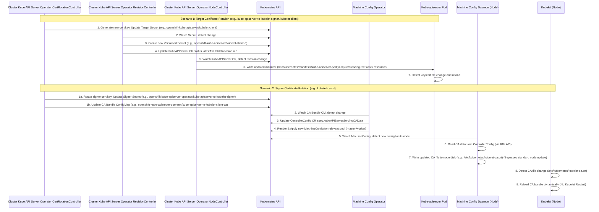

# Analysis of Kube-apiserver Certificate Rotation in OpenShift 4.16

This document analyzes the processes triggered during certificate rotation related to the Kubernetes API server (`kube-apiserver`) in an OpenShift 4.16 cluster. It details the involved components, storage locations, the role of the Machine Config Operator (MCO), and the certificate update behavior of `kube-apiserver` and `kubelet`.

## Overview

The certificate rotation for `kube-apiserver` involves several key Operators and Controllers:

1.  **Cluster Kube API Server Operator:** Manages the `kube-apiserver` static Pod and its associated certificates (serving certs, client certs like kubelet-client, aggregator-client, etc.). It utilizes the `library-go/operator/certrotation` library for time-based rotation.
2.  **RevisionController (within Cluster Kube API Server Operator/library-go):** Monitors ConfigMaps and Secrets used by the `kube-apiserver` static Pod. When these resources change due to certificate rotation or configuration updates, it creates a new revision and updates the status of the `KubeAPIServer` Custom Resource (CR).
3.  **Static Pod Controllers (within Cluster Kube API Server Operator/library-go):** Detect revision changes in the `KubeAPIServer` CR status (`status.latestAvailableRevision`). When a revision changes, they are responsible for writing the updated static Pod manifest, referencing the new revision's resources, to the `/etc/kubernetes/manifests/kube-apiserver-pod.yaml` file on control plane nodes. The Kubelet monitors this file and **restarts** the `kube-apiserver` static Pod upon detecting changes. However, in the scenario we are studying, which is just certificate rotation, the corresponding certificate files under `/etc/kubernetes/static-pod-resources` are updated. The `kube-apiserver` detects the certificate file updates and reloads the certificates at the application level, so it does not involve the Kubelet restarting the `kube-apiserver` static pod.
4.  **Machine Config Operator (MCO):** Monitors cluster-wide configurations, including the CA bundle (`kube-apiserver-to-kubelet-client-ca`) used by Kubelet to verify the `kube-apiserver`. When the CA bundle is updated, MCO updates its internal `ControllerConfig` Custom Resource and generates new `MachineConfig` objects based on it, defining the target state for nodes.
5.  **Machine Config Daemon (MCD):** Runs on each node, applying `MachineConfig` changes. When it detects a `MachineConfig` containing an updated CA bundle, the MCD's `certificate_writer` writes the new CA data to the node's filesystem (e.g., `/etc/kubernetes/kubelet-ca.crt`). While the standard process for applying a `MachineConfig` **typically involves node draining and rebooting** to ensure changes take effect consistently, which indirectly causes Kubelet to restart, the update for the `/etc/kubernetes/kubelet-ca.crt` file involves the `MachineConfig` directly writing the new CA data to the node filesystem. The Kubelet can detect the certificate update and reload the new CA bundle at the application level without requiring node draining or rebooting.

## Certificate Rotation Triggers and Flow (Cluster Kube API Server Operator)

The Cluster Kube API Server Operator manages the lifecycle of various certificates required by the `kube-apiserver`.

*   **Trigger:** Rotation is primarily time-based, configured within the Cluster Kube API Server Operator's `certrotationcontroller`. Each certificate type (signer or target) has a defined `Validity` and `Refresh` period. The rotation process begins when a certificate's age exceeds its `Refresh` duration.

    ```go
    // pkg/operator/certrotationcontroller/certrotationcontroller.go
    // Example for KubeAPIServerToKubeletClientCert target certificate:
    certrotation.RotatedSelfSignedCertKeySecret{
        Namespace: operatorclient.TargetNamespace,
        Name:      "kubelet-client",
        // ... other fields ...
        Validity:               30 * rotationDay, // e.g., 30 days
        Refresh:                15 * rotationDay, // e.g., 15 days
        RefreshOnlyWhenExpired: refreshOnlyWhenExpired,
        CertCreator: &certrotation.ClientRotation{
            UserInfo: &user.DefaultInfo{Name: "system:kube-apiserver", Groups: []string{"kube-master"}},
        },
        // ... informer/client config ...
    },
    ```

*   **Flow:** The `library-go/pkg/operator/certrotation` logic handles the actual rotation:
    1.  Checks if the current target certificate needs refreshing based on its issuance date and the configured `Refresh` period.
    2.  If refresh is needed, ensures the corresponding *signer* certificate (defined in `RotatedSigningCASecret`) is valid and loaded.
    3.  Creates a new target certificate by signing a CSR using the signer certificate and key, based on the `CertCreator`.
    4.  Saves the new key and certificate into the target Secret (e.g., `kubelet-client` in the `openshift-kube-apiserver` namespace).
    5.  If the *signer* certificate itself is rotated, the corresponding CA bundle ConfigMap (e.g., `kube-apiserver-to-kubelet-client-ca` in `openshift-kube-apiserver-operator`) is updated to include the new CA certificate.

*   **Storage:**
    *   **Signer Certs/Keys:** Stored in Secrets within the Cluster Kube API Server Operator's namespace (`openshift-kube-apiserver-operator`), e.g., `kube-apiserver-to-kubelet-signer`.
    *   **Target Certs/Keys:** Stored in Secrets within the operand's namespace (`openshift-kube-apiserver`), e.g., `kubelet-client`, `localhost-serving-cert-certkey`.
    *   **CA Bundles:** Stored in ConfigMaps, typically in the Cluster Kube API Server Operator's namespace (`openshift-kube-apiserver-operator`) or `openshift-config-managed`, e.g., `kube-apiserver-to-kubelet-client-ca`, `kube-apiserver-aggregator-client-ca`.

## Kube-apiserver Restart Flow (Cluster Kube API Server Operator)

When certificates directly used by the `kube-apiserver` static Pod are rotated (updated in their Secrets), the `RevisionController` triggers a restart.

*   **Trigger:** A change detected in any ConfigMap or Secret monitored by the `RevisionController`. This includes Secrets containing rotated certificates like `kubelet-client`, `localhost-serving-cert-certkey`, `aggregator-client`, etc.

*   **Flow:**
    1.  The `RevisionController.sync` loop calls `isLatestRevisionCurrent`.
    2.  `isLatestRevisionCurrent` compares data from the base Secrets/ConfigMaps (e.g., `secrets/kubelet-client`) with data in the latest versioned copies (e.g., `secrets/kubelet-client-3`). If certificate rotation updated the base Secret, a difference is detected.
    3.  `createRevisionIfNeeded` is called, determining a new revision number (`nextRevision = latestAvailableRevision + 1`).
    4.  `createNewRevision` copies the *current* content of the base Secrets/ConfigMaps into new Secrets/ConfigMaps suffixed with `nextRevision` (e.g., `secrets/kubelet-client-4`).
    5.  Key Step: `createRevisionIfNeeded` updates the `status.latestAvailableRevision` field in the `KubeAPIServer` CR via an `operatorClient.UpdateLatestRevisionOperatorStatus` call.
    6.  Other controllers within the Cluster Kube API Server Operator (part of the static pod management framework, like `InstallerController`, `NodeController`) monitor the `KubeAPIServer` CR. They detect the change in `status.latestAvailableRevision`.
    7.  The `InstallerController` (likely) generates a new `kube-apiserver` static Pod manifest (`pod.yaml`) that references `nextRevision`. This manifest, along with other versioned resources, is placed into a revision-specific ConfigMap (e.g., `kube-apiserver-pod-4`).
    8.  The `NodeController` ensures this ConfigMap is mounted into the correct directory on each control plane node (`/etc/kubernetes/static-pod-resources/kube-apiserver-pod-<revision>`) and updates the static Pod manifest file (`/etc/kubernetes/manifests/kube-apiserver-pod.yaml`) to point to the new revision's manifest.
    9.  The Kubelet on the control plane node monitors the `/etc/kubernetes/manifests` directory. Upon detecting the change in `kube-apiserver-pod.yaml`, it gracefully stops the old `kube-apiserver` static Pod and starts a new one based on the updated manifest, which uses the new versioned Secrets/ConfigMaps containing the rotated certificates.

*   **Code Snippet (Revision Trigger):**
    ```go
    // vendor/github.com/openshift/library-go/pkg/operator/revisioncontroller/revision_controller.go

    // isLatestRevisionCurrent compares base resources with the latest versioned copies.
    func (c RevisionController) isLatestRevisionCurrent(ctx context.Context, revision int32) (bool, bool, string) {
        // ... comparison logic for configmaps and secrets ...
        if !equality.Semantic.DeepEqual(existingData, requiredData) {
            // Difference detected
            return false, false, "resource changed"
        }
        // ...
        return true, false, ""
    }

    // createRevisionIfNeeded creates a new revision if changes are detected.
    func (c RevisionController) createRevisionIfNeeded(ctx context.Context, recorder events.Recorder, latestAvailableRevision int32, resourceVersion string) (bool, error) {
        isLatestRevisionCurrent, requiredIsNotFound, reason := c.isLatestRevisionCurrent(ctx, latestAvailableRevision)
        if isLatestRevisionCurrent {
            return false, nil // No change
        }

        nextRevision := latestAvailableRevision + 1
        // ... check required resources ...

        // Create new versioned resource copies
        createdNewRevision, err := c.createNewRevision(ctx, recorder, nextRevision, reason)
        // ... error handling ...

        if !createdNewRevision { return false, nil }

        // *** Key Step: Update Operator status with the new revision number ***
        cond := operatorv1.OperatorCondition{ /* ... */ }
        if _, updated, updateError := c.operatorClient.UpdateLatestRevisionOperatorStatus(ctx, nextRevision, v1helpers.UpdateConditionFn(cond)); updateError != nil {
            return true, updateError
        } else if updated {
            recorder.Eventf("RevisionCreate", "Revision %d created because %s", nextRevision, reason)
        }
        return false, nil
    }
    ```

## CA Bundle Distribution (MCO/MCD)

When a CA bundle used by components external to the static Pod (like Kubelet) is updated, MCO and MCD handle its distribution to nodes. The primary example is the CA bundle used by Kubelet to verify the `kube-apiserver` serving certificate.

*   **Trigger:** The Cluster Kube API Server Operator's `CertRotationController` updates the CA bundle ConfigMap (e.g., `kube-apiserver-to-kubelet-client-ca` in `openshift-kube-apiserver-operator`) when the corresponding *signer* certificate is rotated.
*   **Components:** MCO Controller, MCD (Machine Config Daemon).
*   **Flow:**
    1.  The MCO controller (`pkg/operator/sync.go`) watches relevant ConfigMaps, including `kube-apiserver-to-kubelet-client-ca`.
    2.  Upon detecting a change, it reads the updated CA bundle data (`ca-bundle.crt`).
    3.  This data (`kubeAPIServerServingCABytes`) is stored in the MCO's internal `ControllerConfig` CR spec (`spec.KubeAPIServerServingCAData`).
    4.  MCO renders new `MachineConfig` objects for the relevant pools (e.g., `master`, `worker`). These `MachineConfigs` define the desired state of files on the node, including the target path for the Kubelet CA bundle, populated with the data from `spec.KubeAPIServerServingCAData`.
    5.  The MCD running on each node detects that a new `MachineConfig` is available for it.
    6.  The MCD's `certificate_writer.go` specifically handles writing the CA data from the applied `ControllerConfig`'s `Spec.KubeAPIServerServingCAData` to the specified path on the node's filesystem.
*   **Storage:** The CA bundle is written to the node filesystem by MCD. The typical path used by Kubelet's `--client-ca-file` argument (or corresponding KubeletConfiguration field `clientCAFile`) is `/etc/kubernetes/kubelet-ca.crt`.
*   **Code Snippets:**
    ```go
    // pkg/operator/sync.go - MCO reads the CA bundle ConfigMap
    func (optr *Operator) syncRenderConfig(_ *renderConfig) error {
        // ... other logic ...
        var kubeAPIServerServingCABytes []byte
        // ... logic to determine which CM to read based on auth mode ...
        kubeAPIServerServingCABytes, err = optr.getCAsFromConfigMap("openshift-kube-apiserver-operator", "kube-apiserver-to-kubelet-client-ca", "ca-bundle.crt")
        // ... error handling and merging logic ...

        // Store in ControllerConfig spec
        spec.KubeAPIServerServingCAData = kubeAPIServerServingCABytes
        // ... render MachineConfigs using this data ...
    }

    // pkg/daemon/certificate_writer.go - MCD writes the CA bundle to the node
    func (cw *CertificateWriter) writeCertificatesToDisk() error {
        // ... get controllerConfig ...
        kubeAPIServerServingCABytes := controllerConfig.Spec.KubeAPIServerServingCAData
        // ... other CAs ...

        pathToData := make(map[string][]byte)
        // Assuming caBundleFilePath resolves to /etc/kubernetes/kubelet-ca.crt or similar
        pathToData[caBundleFilePath] = kubeAPIServerServingCABytes
        // ... add other CAs to pathToData ...

        // Write files defined in pathToData
        if err := cw.writeFiles(pathToData); err != nil {
            return fmt.Errorf("error writing certificate files: %w", err)
        }
        // ... potentially restart services ...
        return nil
    }
    ```

## Kubelet and CA Bundle Updates

When the `kube-apiserver-to-kubelet-client-ca` CA bundle is updated, Kubelet's behavior needs to distinguish between the capabilities of the Kubelet process itself and the standard operating procedures of MCO/MCD.

*   **Trigger:** MCD applies a new `MachineConfig` containing the updated CA bundle data to the node. The MCD's `certificate_writer` writes the new CA bundle content to the file path specified in the Kubelet configuration (e.g., `/etc/kubernetes/kubelet-ca.crt`).

*   **Flow and Behavior:**
    1.  **Kubelet File Monitoring:** The Kubelet process itself is designed to monitor changes to the certificate files it uses (including the one specified by `--client-ca-file`). Theoretically, when the file content is updated, Kubelet *can* reload this CA bundle without restarting its service process.
    2.  **MCO/MCD Standard Operation:** However, in OpenShift, updates to such CA bundles are managed via MCO and MCD. MCO generates the `MachineConfig`, and MCD is responsible for applying it. The standard, default, and safest method for applying a `MachineConfig` (especially for changes involving core system files or configurations) is to perform a coordinated node update, which **typically includes draining the node and then rebooting it**.
    3.  **CA Special Handling:** There is special handling for `kubelet-ca.crt` within `certificate_writer.go` that specifically deals with writing the certificate file. This bypasses the standard MCO/MCD update flow, thus skipping the reboot or `systemd` update steps.

*   **Conclusion on Kubelet Update:** The Kubelet service does not restart. The update of the CA bundle file on disk **triggers** a reload of the certificate. The Kubelet process itself has the capability to reload the file. However, the distribution of the CA update is handled by the MCO/MCD mechanism.

## Sequence Diagram



## Summary

*   **Certificate Rotation Trigger:** Time-based refresh interval configured in the Cluster Kube API Server Operator.
*   **Components:** Cluster Kube API Server Operator (`CertRotationController`, `RevisionController`, Static Pod Controllers), MCO, MCD, Kubelet.
*   **Certificate Storage:** Secrets and ConfigMaps in the `openshift-kube-apiserver-operator` and `openshift-kube-apiserver` namespaces. The CA bundle is also written to `/etc/kubernetes/kubelet-ca.crt` on nodes by MCD.
*   **Kube-apiserver Restart:** **Restarts occur**. Triggered when the Cluster Kube API Server Operator's `RevisionController` detects changes in its dependent Secrets/ConfigMaps (e.g., the rotated target certificate `kubelet-client`). The Cluster Kube API Server Operator updates the `KubeAPIServer` CR status (`status.latestAvailableRevision`), the `Static Pod Controller` (like `NodeController`) detects this change and updates the static Pod manifest (`/etc/kubernetes/manifests/kube-apiserver-pod.yaml`) on control plane nodes to reference the new versioned resources. Kubelet monitors this manifest file change and **restarts** the `kube-apiserver` Pod. (Note: The overview section mentioned the apiserver might only reload certificates, but the detailed restart flow describes the restart mechanism based on revision changes. This summary follows the detailed flow description).
*   **Kubelet Restart:** **Does not restart**. When the CA bundle (`kube-apiserver-to-kubelet-client-ca`) is updated, MCO detects the change and generates a new `MachineConfig`. MCD writes the new CA file to the node (`/etc/kubernetes/kubelet-ca.crt`). Due to special handling logic for this CA file in MCD (`certificate_writer`), it writes the file directly **without triggering the standard node drain and reboot process**. Kubelet monitors the CA file for changes and dynamically **reloads** the CA bundle; the service process itself does not restart.
