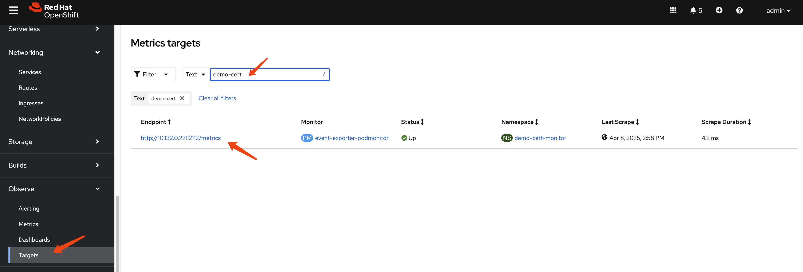

> [!WARNING] 
> Working in progress, use with caution.
# Kubernetes Certificate Rotation Process and Monitoring Solution

# Kubernetes Event Exporter

- https://github.com/resmoio/kubernetes-event-exporter

```bash

DEMO_PROJECT=demo-cert-monitor

oc new-project ${DEMO_PROJECT}


oc delete -f ${BASE_DIR}/data/install/kubernetes-event-exporter.yaml

cat << EOF > ${BASE_DIR}/data/install/kubernetes-event-exporter.yaml
---
apiVersion: v1
kind: ServiceAccount
metadata:
  name: event-exporter
  namespace: ${DEMO_PROJECT}

---
kind: Role
apiVersion: rbac.authorization.k8s.io/v1
metadata:
  name: event-exporter-role
  namespace: ${DEMO_PROJECT}
rules:
- apiGroups: [""]
  resources: ["events"]
  verbs: ["get", "list", "watch"]
---
kind: RoleBinding
apiVersion: rbac.authorization.k8s.io/v1
metadata:
  name: event-exporter-rolebinding
  namespace: ${DEMO_PROJECT}
subjects:
- kind: ServiceAccount
  name: event-exporter
  namespace: ${DEMO_PROJECT}
roleRef:
  kind: Role
  name: event-exporter-role
  apiGroup: rbac.authorization.k8s.io

EOF

oc apply -f ${BASE_DIR}/data/install/kubernetes-event-exporter.yaml


```


```bash

helm repo add bitnami https://charts.bitnami.com/bitnami
helm repo update


helm install event-exporter bitnami/kubernetes-event-exporter \
  --namespace ${DEMO_PROJECT} \
  --set serviceAccount.create=false \
  --set serviceAccount.name=event-exporter


oc get pod
# NAME                                                       READY   STATUS    RESTARTS   AGE
# event-exporter-kubernetes-event-exporter-54c9999d4-8mp92   1/1     Running   0          52s

oc delete -f ${BASE_DIR}/data/install/kubernetes-event-exporter-monitor.yaml

cat << EOF > ${BASE_DIR}/data/install/kubernetes-event-exporter-monitor.yaml
apiVersion: monitoring.coreos.com/v1
kind: PodMonitor
metadata:
  name: event-exporter-podmonitor
  namespace: ${DEMO_PROJECT} # 确保 PodMonitor 部署在 Prometheus 可以访问的命名空间中
spec:
  selector:
    matchLabels:
      app.kubernetes.io/name: kubernetes-event-exporter # 与 Event Exporter Pod 的标签匹配
  podMetricsEndpoints:
  - port: http # Event Exporter 公开指标的端口名称
    path: /metrics # 指标的路径
    interval: 30s # 抓取指标的频率
EOF

oc apply -f ${BASE_DIR}/data/install/kubernetes-event-exporter-monitor.yaml

```



```bash
curl http://10.132.0.221:2112/metrics
```
```ini
# HELP build_info A metric with a constant '1' value labeled by version, revision, branch, and goversion from which Kubernetes Event Exporter was built.
# TYPE build_info gauge
build_info{goarch="amd64",goos="linux",goversion="go1.23.8",revision="unknown",version="unknown"} 1
# HELP events_discarded The total number of events discarded because of being older than the maxEventAgeSeconds specified
# TYPE events_discarded counter
events_discarded 0
# HELP events_sent The total number of events processed
# TYPE events_sent counter
events_sent 110
# HELP go_build_info Build information about the main Go module.
# TYPE go_build_info gauge
go_build_info{checksum="",path="github.com/resmoio/kubernetes-event-exporter",version="(devel)"} 1
# HELP go_gc_duration_seconds A summary of the pause duration of garbage collection cycles.
# TYPE go_gc_duration_seconds summary
go_gc_duration_seconds{quantile="0"} 0.000113523
go_gc_duration_seconds{quantile="0.25"} 0.000152831
go_gc_duration_seconds{quantile="0.5"} 0.000186284
go_gc_duration_seconds{quantile="0.75"} 0.000239695
go_gc_duration_seconds{quantile="1"} 0.094225732
go_gc_duration_seconds_sum 0.104832055
go_gc_duration_seconds_count 29
# HELP go_goroutines Number of goroutines that currently exist.
# TYPE go_goroutines gauge
go_goroutines 24
# HELP go_info Information about the Go environment.
# TYPE go_info gauge
go_info{version="go1.23.8"} 1
# HELP go_memstats_alloc_bytes Number of bytes allocated and still in use.
# TYPE go_memstats_alloc_bytes gauge
go_memstats_alloc_bytes 9.578656e+06
# HELP go_memstats_alloc_bytes_total Total number of bytes allocated, even if freed.
# TYPE go_memstats_alloc_bytes_total counter
go_memstats_alloc_bytes_total 1.6816108e+08
# HELP go_memstats_buck_hash_sys_bytes Number of bytes used by the profiling bucket hash table.
# TYPE go_memstats_buck_hash_sys_bytes gauge
go_memstats_buck_hash_sys_bytes 1.498428e+06
# HELP go_memstats_frees_total Total number of frees.
# TYPE go_memstats_frees_total counter
go_memstats_frees_total 796322
# HELP go_memstats_gc_sys_bytes Number of bytes used for garbage collection system metadata.
# TYPE go_memstats_gc_sys_bytes gauge
go_memstats_gc_sys_bytes 3.605248e+06
# HELP go_memstats_heap_alloc_bytes Number of heap bytes allocated and still in use.
# TYPE go_memstats_heap_alloc_bytes gauge
go_memstats_heap_alloc_bytes 9.578656e+06
# HELP go_memstats_heap_idle_bytes Number of heap bytes waiting to be used.
# TYPE go_memstats_heap_idle_bytes gauge
go_memstats_heap_idle_bytes 1.4450688e+07
# HELP go_memstats_heap_inuse_bytes Number of heap bytes that are in use.
# TYPE go_memstats_heap_inuse_bytes gauge
go_memstats_heap_inuse_bytes 1.3336576e+07
# HELP go_memstats_heap_objects Number of allocated objects.
# TYPE go_memstats_heap_objects gauge
go_memstats_heap_objects 47587
# HELP go_memstats_heap_released_bytes Number of heap bytes released to OS.
# TYPE go_memstats_heap_released_bytes gauge
go_memstats_heap_released_bytes 5.750784e+06
# HELP go_memstats_heap_sys_bytes Number of heap bytes obtained from system.
# TYPE go_memstats_heap_sys_bytes gauge
go_memstats_heap_sys_bytes 2.7787264e+07
# HELP go_memstats_last_gc_time_seconds Number of seconds since 1970 of last garbage collection.
# TYPE go_memstats_last_gc_time_seconds gauge
go_memstats_last_gc_time_seconds 1.7440954793870912e+09
# HELP go_memstats_lookups_total Total number of pointer lookups.
# TYPE go_memstats_lookups_total counter
go_memstats_lookups_total 0
# HELP go_memstats_mallocs_total Total number of mallocs.
# TYPE go_memstats_mallocs_total counter
go_memstats_mallocs_total 843909
# HELP go_memstats_mcache_inuse_bytes Number of bytes in use by mcache structures.
# TYPE go_memstats_mcache_inuse_bytes gauge
go_memstats_mcache_inuse_bytes 38400
# HELP go_memstats_mcache_sys_bytes Number of bytes used for mcache structures obtained from system.
# TYPE go_memstats_mcache_sys_bytes gauge
go_memstats_mcache_sys_bytes 46800
# HELP go_memstats_mspan_inuse_bytes Number of bytes in use by mspan structures.
# TYPE go_memstats_mspan_inuse_bytes gauge
go_memstats_mspan_inuse_bytes 330560
# HELP go_memstats_mspan_sys_bytes Number of bytes used for mspan structures obtained from system.
# TYPE go_memstats_mspan_sys_bytes gauge
go_memstats_mspan_sys_bytes 424320
# HELP go_memstats_next_gc_bytes Number of heap bytes when next garbage collection will take place.
# TYPE go_memstats_next_gc_bytes gauge
go_memstats_next_gc_bytes 1.772944e+07
# HELP go_memstats_other_sys_bytes Number of bytes used for other system allocations.
# TYPE go_memstats_other_sys_bytes gauge
go_memstats_other_sys_bytes 3.196028e+06
# HELP go_memstats_stack_inuse_bytes Number of bytes in use by the stack allocator.
# TYPE go_memstats_stack_inuse_bytes gauge
go_memstats_stack_inuse_bytes 1.540096e+06
# HELP go_memstats_stack_sys_bytes Number of bytes obtained from system for stack allocator.
# TYPE go_memstats_stack_sys_bytes gauge
go_memstats_stack_sys_bytes 1.540096e+06
# HELP go_memstats_sys_bytes Number of bytes obtained from system.
# TYPE go_memstats_sys_bytes gauge
go_memstats_sys_bytes 3.8098184e+07
# HELP go_threads Number of OS threads created.
# TYPE go_threads gauge
go_threads 21
# HELP kube_api_read_cache_hits The total number of read requests served from cache when looking up object metadata
# TYPE kube_api_read_cache_hits counter
kube_api_read_cache_hits 75
# HELP kube_api_read_cache_misses The total number of read requests served from kube-apiserver when looking up object metadata
# TYPE kube_api_read_cache_misses counter
kube_api_read_cache_misses 35
# HELP process_cpu_seconds_total Total user and system CPU time spent in seconds.
# TYPE process_cpu_seconds_total counter
process_cpu_seconds_total 1.27
# HELP process_max_fds Maximum number of open file descriptors.
# TYPE process_max_fds gauge
process_max_fds 1.048576e+06
# HELP process_open_fds Number of open file descriptors.
# TYPE process_open_fds gauge
process_open_fds 11
# HELP process_resident_memory_bytes Resident memory size in bytes.
# TYPE process_resident_memory_bytes gauge
process_resident_memory_bytes 6.490112e+07
# HELP process_start_time_seconds Start time of the process since unix epoch in seconds.
# TYPE process_start_time_seconds gauge
process_start_time_seconds 1.744094628e+09
# HELP process_virtual_memory_bytes Virtual memory size in bytes.
# TYPE process_virtual_memory_bytes gauge
process_virtual_memory_bytes 1.332334592e+09
# HELP process_virtual_memory_max_bytes Maximum amount of virtual memory available in bytes.
# TYPE process_virtual_memory_max_bytes gauge
process_virtual_memory_max_bytes 1.8446744073709552e+19
# HELP send_event_errors The total number of send event errors
# TYPE send_event_errors counter
send_event_errors 0
# HELP watch_errors The total number of errors received from the informer
# TYPE watch_errors counter
watch_errors 0


```

# end