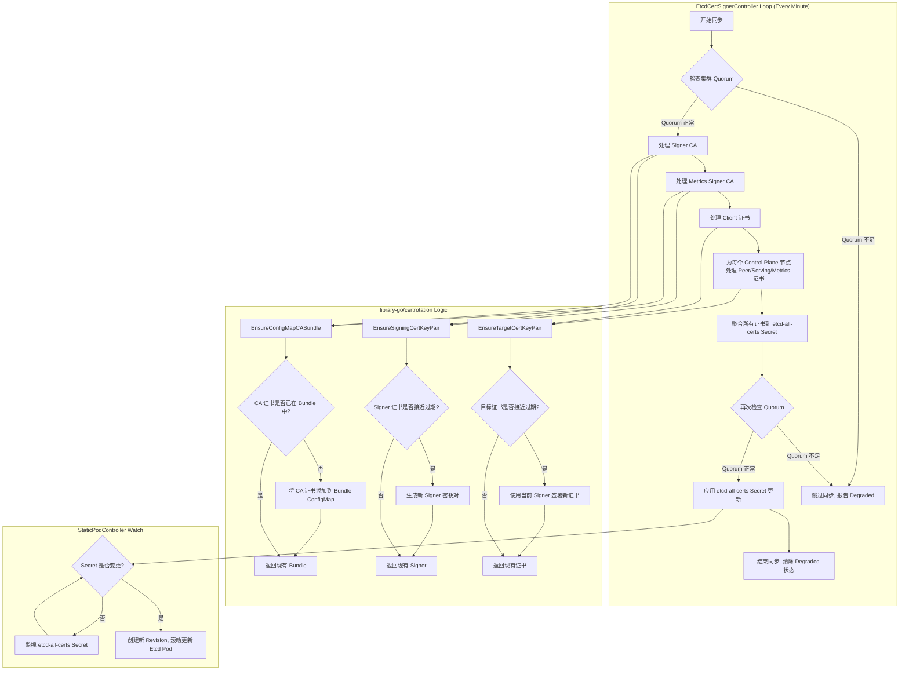

# OpenShift Etcd Operator 证书轮替分析报告

## 1. 引言

Etcd 作为 OpenShift 集群的关键组件，其通信安全至关重要。集群 [Etcd Operator (CEO)](https://github.com/openshift/cluster-etcd-operator) 负责管理 Etcd 集群的生命周期，包括其 TLS 证书的生成和轮替。本报告旨在分析 OpenShift Etcd Operator 中证书轮替的实现逻辑、相关日志、监控指标以及运维人员需要关注的方面。

## 2. 核心组件

证书轮替涉及以下几个关键组件：

*   **EtcdCertSignerController:** (位于 `pkg/operator/etcdcertsigner/`) 这是证书管理的核心控制器。它负责：
    *   创建和管理 Etcd 所需的各种证书（Signer CA、Peer、Serving、Client、Metrics 相关证书）。
    *   利用 `library-go/pkg/operator/certrotation` 库提供的能力，根据证书有效期自动触发轮替。
    *   将所有节点的证书聚合到一个名为 `etcd-all-certs` 的 Secret 中。
    *   在更新证书前进行集群健康检查（Quorum Check）。
*   **StaticPodController:** (来自 `library-go`) 负责管理 Etcd 的静态 Pod。它监视 `etcd-all-certs` 等 `RevisionSecrets`。当这些 Secret 发生变化（例如证书轮替导致内容更新）时，它会创建一个新的 Revision 并触发 Etcd Pod 的滚动更新，从而将新的证书部署到节点上。
*   **CertSyncController:** (来自 `library-go`) 负责将 `CertConfigMaps` 和 `CertSecrets` 中定义的非版本化证书（如 CA Bundle）同步到各个节点上的 `/etc/kubernetes/static-pod-resources/etcd-certs` 目录，供静态 Pod 使用。

## 3. 证书类型

`EtcdCertSignerController` 管理以下主要证书/密钥对和 CA Bundle：

*   **Signer CA:**
    *   `etcd-signer` (Secret): 签署 Peer、Serving、Client 证书的 CA 密钥对。
    *   `etcd-ca-bundle` (ConfigMap): 包含当前和（轮替期间）下一个 Signer CA 的证书，用于验证。
*   **Metrics Signer CA:**
    *   `etcd-metric-signer` (Secret): 签署 Metrics 相关证书的 CA 密钥对。
    *   `etcd-metric-ca-bundle` (ConfigMap): 包含 Metrics Signer CA 的证书。
*   **Client Certificates:**
    *   `etcd-client` (Secret): Etcd 客户端证书。
    *   `etcd-metric-client` (Secret): Metrics Client 证书。
*   **Per-Node Certificates:** (聚合在 `etcd-all-certs` Secret 中)
    *   `etcd-peer-<nodeName>`: 节点间通信证书。
    *   `etcd-serving-<nodeName>`: Etcd API 服务端证书。
    *   `etcd-serving-metrics-<nodeName>`: Metrics 服务端证书。

## 4. 证书轮替机制

证书轮替主要由 `EtcdCertSignerController` 驱动，并依赖 `library-go` 的 `certrotation` 库。



**机制详解:**

1.  **定时检查:** `EtcdCertSignerController` 定期（默认每分钟）执行同步逻辑。
2.  **Quorum 检查:** 在进行任何证书操作和最终更新 `etcd-all-certs` Secret 之前，都会检查 Etcd 集群的 Quorum 状态。如果 Quorum 不足，则会跳过同步并设置 `EtcdCertSignerControllerDegraded` 状态，防止在不健康的集群上进行可能导致问题的证书变更。
3.  **Signer 轮替 (`EnsureSigningCertKeyPair`):**
    *   控制器检查 `etcd-signer` 和 `etcd-metric-signer` Secret 的注解，判断 CA 证书是否接近过期（基于 `library-go` 的默认或配置的提前期）。
    *   如果需要轮替，会生成一个新的 CA 密钥对，并更新 Secret。**关键点:** `library-go` 的逻辑会保留旧的 CA 一段时间（通过注解记录），而不是立即删除。
    *   `EnsureConfigMapCABundle` 确保将**新旧两个 Signer CA** 的证书都添加到对应的 CA Bundle ConfigMap (`etcd-ca-bundle`, `etcd-metric-ca-bundle`) 中。这允许集群在轮替期间同时信任由新旧两个 CA 签发的证书，实现平滑过渡。
4.  **目标证书轮替 (`EnsureTargetCertKeyPair`):**
    *   控制器检查所有目标证书（Client, Peer, Serving, Metrics Serving）的 Secret 注解，判断是否接近过期。
    *   如果需要轮替，会使用**当前活动**的 Signer CA（从 `etcd-signer` 或 `etcd-metric-signer` 读取）签发新的证书/密钥对，并更新对应的 Secret。
5.  **聚合与部署:**
    *   所有节点的目标证书（Peer, Serving, Metrics Serving）被收集并合并到 `etcd-all-certs` Secret 的 `data` 字段中。
    *   `StaticPodController` 监视 `etcd-all-certs`。当该 Secret 更新时（无论是 Signer 轮替间接导致目标证书更新，还是目标证书自身轮替），`StaticPodController` 会检测到变化。
    *   检测到变化后，`StaticPodController` 会创建 Etcd Pod 的新 Revision，并触发滚动更新，将包含新证书引用的 Pod 部署到所有 Control Plane 节点。

## 5. 代码片段


**pkg/operator/etcdcertsigner/etcdcertsignercontroller.go** `EtcdCertSignerController` 定期（默认每分钟）执行同步逻辑。

```go
// pkg/operator/etcdcertsigner/etcdcertsignercontroller.go
func NewEtcdCertSignerController(
    // ... 参数省略 ...
) factory.Controller {
    // ... 初始化代码省略 ...
    
    // 创建一个健康检查包装器，包装实际的同步函数
    syncer := health.NewDefaultCheckingSyncWrapper(c.sync)
    livenessChecker.Add("EtcdCertSignerController", syncer)

    // 关键部分：设置控制器每分钟执行一次同步
    return factory.New().ResyncEvery(time.Minute).WithInformers(
        masterNodeInformer,
        kubeInformers.InformersFor(operatorclient.GlobalUserSpecifiedConfigNamespace).Core().V1().Secrets().Informer(),
        cmInformer.Informer(),
        secretInformer.Informer(),
        operatorClient.Informer(),
    ).WithSync(syncer.Sync).ToController("EtcdCertSignerController", c.eventRecorder)
}

// 每次同步时执行的主要逻辑
func (c *EtcdCertSignerController) sync(ctx context.Context, syncCtx factory.SyncContext) error {
    // 首先检查集群是否有足够的 Quorum 来安全地进行更新
    safe, err := c.quorumChecker.IsSafeToUpdateRevision()
    if err != nil {
        return fmt.Errorf("EtcdCertSignerController can't evaluate whether quorum is safe: %w", err)
    }

    if !safe {
        return fmt.Errorf("skipping EtcdCertSignerController reconciliation due to insufficient quorum")
    }

    // 执行所有证书的同步逻辑
    if err := c.syncAllMasterCertificates(ctx, syncCtx.Recorder()); err != nil {
        // 如果同步失败，设置 Degraded 状态条件
        _, _, updateErr := v1helpers.UpdateStatus(ctx, c.operatorClient, v1helpers.UpdateConditionFn(operatorv1.OperatorCondition{
            Type:    "EtcdCertSignerControllerDegraded",
            Status:  operatorv1.ConditionTrue,
            Reason:  "Error",
            Message: err.Error(),
        }))
        if updateErr != nil {
            syncCtx.Recorder().Warning("EtcdCertSignerControllerUpdatingStatus", updateErr.Error())
        }
        return err
    }

    // 同步成功，清除 Degraded 状态
    _, _, updateErr := v1helpers.UpdateStatus(ctx, c.operatorClient,
        v1helpers.UpdateConditionFn(operatorv1.OperatorCondition{
            Type:   "EtcdCertSignerControllerDegraded",
            Status: operatorv1.ConditionFalse,
            Reason: "AsExpected",
        }))
    return updateErr
}
```

这段代码展示了 `EtcdCertSignerController` 的定时检查机制：

1. 在控制器初始化时，通过 `ResyncEvery(time.Minute)` 设置每分钟执行一次同步操作。
2. 每次同步时，首先通过 `IsSafeToUpdateRevision()` 检查 Etcd 集群是否有足够的 Quorum 来安全地进行更新。
3. 如果 Quorum 检查通过，则调用 `syncAllMasterCertificates()` 执行实际的证书管理逻辑。
4. 根据同步结果更新控制器的状态条件 `EtcdCertSignerControllerDegraded`，以反映控制器的健康状态。

这种定时检查机制确保了证书管理逻辑会定期执行，及时发现并处理需要轮替的证书，同时通过 Quorum 检查避免在集群不健康时进行可能有风险的操作。

**pkg/operator/starter.go:** 定义了哪些 Secrets/ConfigMaps 包含证书，以及哪些会触发 Revision。

```go
// RevisionConfigMaps is a list of configmaps that are directly copied for the current values.  A different actor/controller modifies these.
// the first element should be the configmap that contains the static pod manifest
var RevisionConfigMaps = []revision.RevisionResource{
	{Name: "etcd-pod"},
	// ... CA Bundles ...
	{Name: "etcd-serving-ca"},
	{Name: "etcd-peer-client-ca"},
	{Name: "etcd-metrics-proxy-serving-ca"},
	{Name: "etcd-metrics-proxy-client-ca"},
	{Name: "etcd-endpoints"},
}

// RevisionSecrets is a list of secrets that are directly copied for the current values.  A different actor/controller modifies these.
var RevisionSecrets = []revision.RevisionResource{
	{Name: "etcd-all-certs"}, // <--- 聚合证书，变化触发滚动更新
}

// CertConfigMaps defines non-revisioned ConfigMaps synced by CertSyncController
var CertConfigMaps = []installer.UnrevisionedResource{
	// ... other CMs ...
	{Name: "etcd-serving-ca"},
	{Name: "etcd-peer-client-ca"},
	{Name: "etcd-metrics-proxy-serving-ca"},
	{Name: "etcd-metrics-proxy-client-ca"},
}

// CertSecrets defines non-revisioned Secrets synced by CertSyncController
var CertSecrets = []installer.UnrevisionedResource{
	{Name: "etcd-all-certs"}, // Also synced directly for constant path access
}

// ... Controller Initialization ...
	etcdCertSignerController := etcdcertsigner.NewEtcdCertSignerController(
		// ... dependencies ...
	)

	staticPodControllers, err := staticpod.NewBuilder(operatorClient, kubeClient, kubeInformersForNamespaces, configInformers).
		// ... other configurations ...
		WithRevisionedResources("openshift-etcd", "etcd", RevisionConfigMaps, RevisionSecrets). // <--- 监视 RevisionSecrets
		WithUnrevisionedCerts("etcd-certs", CertConfigMaps, CertSecrets). // <--- CertSyncController 配置
		// ... other configurations ...
		ToControllers()
```

**pkg/operator/etcdcertsigner/etcdcertsignercontroller.go:** 核心同步逻辑。

```go
func (c *EtcdCertSignerController) syncAllMasterCertificates(ctx context.Context, recorder events.Recorder) error {
	// --- Signer CA Handling ---
	signerCaPair, err := tlshelpers.ReadConfigSignerCert(ctx, c.secretClient) // Read current signer
	// ... error handling ...
	c.reportExpirationMetric(signerCaPair, "signer-ca") // Report metric
	_, err = c.certConfig.signerCaBundle.EnsureConfigMapCABundle(ctx, signerCaPair) // Add current CA to bundle
	// ... error handling ...

	// Ensure the next signer exists (creates if needed, rotates based on expiry)
	newSignerCaPair, _, err := c.certConfig.signerCert.EnsureSigningCertKeyPair(ctx)
	// ... error handling ...
	signerBundle, err := c.certConfig.signerCaBundle.EnsureConfigMapCABundle(ctx, newSignerCaPair) // Add next CA to bundle
	// ... error handling ...

	// --- Metrics Signer CA Handling (Similar logic) ---
	metricsSignerCaPair, err := tlshelpers.ReadConfigMetricsSignerCert(ctx, c.secretClient)
	// ... error handling ...
	c.reportExpirationMetric(metricsSignerCaPair, "metrics-signer-ca")
	_, err = c.certConfig.metricsSignerCaBundle.EnsureConfigMapCABundle(ctx, metricsSignerCaPair)
	// ... error handling ...
	newMetricsSignerCaPair, _, err := c.certConfig.metricsSignerCert.EnsureSigningCertKeyPair(ctx)
	// ... error handling ...
	metricsSignerBundle, err := c.certConfig.metricsSignerCaBundle.EnsureConfigMapCABundle(ctx, newMetricsSignerCaPair)
	// ... error handling ...

	// --- Client Cert Handling ---
	_, err = c.certConfig.etcdClientCert.EnsureTargetCertKeyPair(ctx, signerCaPair, signerBundle) // Ensure client cert signed by current signer
	// ... error handling ...
	_, err = c.certConfig.metricsClientCert.EnsureTargetCertKeyPair(ctx, metricsSignerCaPair, metricsSignerBundle) // Ensure metrics client cert
	// ... error handling ...

	// --- Per-Node Cert Handling ---
	nodeCfgs, err := c.createNodeCertConfigs() // Get configs for all control plane nodes
	// ... error handling ...

	allCerts := map[string][]byte{}
	for _, cfg := range nodeCfgs {
		// Ensure Peer cert signed by current signer
		secret, err := cfg.peerCert.EnsureTargetCertKeyPair(ctx, signerCaPair, signerBundle)
		// ... error handling ...
		allCerts = addCertSecretToMap(allCerts, secret) // Add to aggregation map

		// Ensure Serving cert signed by current signer
		secret, err = cfg.servingCert.EnsureTargetCertKeyPair(ctx, signerCaPair, signerBundle)
		// ... error handling ...
		allCerts = addCertSecretToMap(allCerts, secret)

		// Ensure Metrics Serving cert signed by current metrics signer
		secret, err = cfg.metricsCert.EnsureTargetCertKeyPair(ctx, metricsSignerCaPair, metricsSignerBundle)
		// ... error handling ...
		allCerts = addCertSecretToMap(allCerts, secret)
	}

	// --- Aggregate and Apply ---
	secret := &corev1.Secret{
		ObjectMeta: metav1.ObjectMeta{
			Namespace: operatorclient.TargetNamespace,
			Name:      tlshelpers.EtcdAllCertsSecretName, // "etcd-all-certs"
			// ... annotations ...
		},
		Type: corev1.SecretTypeOpaque,
		Data: allCerts, // Aggregated certs
	}

	// Final Quorum Check before applying
	safe, err := c.quorumChecker.IsSafeToUpdateRevision()
	// ... error handling ...
	if !safe {
		return fmt.Errorf("skipping EtcdCertSignerController reconciliation due to insufficient quorum")
	}
	_, _, err = resourceapply.ApplySecret(ctx, c.secretClient, recorder, secret) // Apply the aggregated secret

	return err
}

// Quorum check before sync starts
func (c *EtcdCertSignerController) sync(ctx context.Context, syncCtx factory.SyncContext) error {
	safe, err := c.quorumChecker.IsSafeToUpdateRevision()
	// ... error handling ...
	if !safe {
		return fmt.Errorf("skipping EtcdCertSignerController reconciliation due to insufficient quorum")
	}
	// ... call syncAllMasterCertificates ...
}
```

## 6. 日志、事件和消息

运维人员可以通过以下途径观察证书轮替过程和潜在问题：

*   **Operator Status Conditions:**
    *   检查 `clusteroperator/etcd` 的状态。
    *   关注 `EtcdCertSignerControllerDegraded` 条件。如果为 `True`，表示证书签名控制器遇到错误（如 Quorum 不足、API 访问失败等），轮替可能受阻。Message 字段会提供错误信息。
		```bash
		oc get clusteroperator/etcd
		# NAME   VERSION   AVAILABLE   PROGRESSING   DEGRADED   SINCE   MESSAGE
		# etcd   4.16.34   True        False         False      171d
		```
*   **Kubernetes Events:**
    *   监视 `openshift-etcd` 和 `openshift-etcd-operator` 命名空间中的事件。
    *   `EtcdCertSignerController` 会记录与证书操作相关的事件，特别是错误和警告。
    *   `library-go/certrotation` 会生成以下具体事件：
        *   `SignerUpdateRequired`: 当签名 CA 证书需要轮替时触发。
        *   `TargetUpdateRequired`: 当目标证书（如 peer、serving、client 证书）需要轮替时触发。
        *   `CABundleUpdateRequired`: 当 CA Bundle 需要更新时触发。
    *   `InstallerController` 会记录与 Revision 创建和 Pod 滚动更新相关的事件，如：
        *   `NodeTargetRevisionChanged`: 当节点目标版本变更时触发。
        *   `NodeCurrentRevisionChanged`: 当节点当前版本变更时触发。
        *   `InstallerPodFailed`: 当安装器 Pod 失败时触发。
*   **Operator Logs:**
    *   查看 `openshift-etcd-operator` 命名空间中 `cluster-etcd-operator-*` Pod 的日志。
    *   关注 `EtcdCertSignerController` 的日志输出，可以看到同步循环的执行情况、错误信息、Quorum 检查结果等。
    *   搜索关键词如：
        *   `skipping EtcdCertSignerController reconciliation due to insufficient quorum`（Quorum 不足时）
        *   `error on ensuring etcd-signer cert`（签名 CA 证书操作错误）
        *   `error on ensuring etcd client cert`（客户端证书操作错误）
        *   `error on peer cert sync for node`（节点 Peer 证书同步错误）
        *   `error on serving cert sync for node`（节点 Serving 证书同步错误）
        *   `error on serving metrics cert sync for node`（节点 Metrics 证书同步错误）
        *   `Updated ca-bundle.crt configmap`（CA Bundle 更新）
*   **Secret/ConfigMap Annotations:**
    *   `library-go/certrotation` 会在管理的 Secret 和 ConfigMap 上添加注解，记录证书的过期时间、上次轮替时间等信息。检查 `etcd-signer`, `etcd-metric-signer`, `etcd-ca-bundle`, `etcd-metric-ca-bundle` 以及 `etcd-all-certs` 中各个证书对应的 Secret（如 `etcd-peer-*`, `etcd-serving-*`）的注解可以了解轮替状态。

## 7. 监控指标

*   **`openshift_etcd_operator_signer_expiration_days`:** (Gauge) 由 `EtcdCertSignerController` 暴露。显示 `signer-ca` 和 `metrics-signer-ca` 距离过期还有多少天。这是监控 Signer CA 健康状况的关键指标。应设置告警规则，在过期时间过近（例如小于 30 天）时发出告警。

## 8. 运维角度

*   **监控:**
    *   **核心:** 监控 `openshift_etcd_operator_signer_expiration_days` 指标，确保 CA 证书有足够的有效期。
    *   监控 `clusteroperator/etcd` 的状态，特别是 `EtcdCertSignerControllerDegraded` 条件。
    *   监控相关命名空间的 Kubernetes Events。
*   **排障:**
    *   如果 `EtcdCertSignerControllerDegraded` 为 `True`，检查 Operator 日志和事件获取详细错误。常见原因包括：
        *   **Quorum 不足:** Etcd 集群不健康，需要先恢复集群健康。
        *   **API 访问问题:** Operator RBAC 权限问题或 API Server 问题。
        *   **资源写入失败:** 无法更新 Secret 或 ConfigMap。
    *   如果证书长时间未轮替（通过检查 Secret 注解或指标判断），检查 Operator 日志确认 `EtcdCertSignerController` 是否正常运行且没有持续报错。
    *   在 Signer CA 轮替期间，检查 `etcd-ca-bundle` 和 `etcd-metric-ca-bundle` ConfigMap，确认其中是否包含两个 CA 证书。
    *   检查 `etcd-all-certs` Secret 的更新时间戳和内容，确认证书是否按预期聚合。
    *   检查 Etcd Pod 的滚动更新状态，确认新 Revision 是否成功部署。
*   **手动干预:**
    *   证书轮替是**全自动**的，通常不需要手动干预。
    *   **强制轮替:** `library-go/certrotation` 通常可以通过删除 Secret 中的特定注解来强制触发下一次同步时的轮替，但这属于高级操作，应谨慎使用，并首先尝试解决导致自动轮替失败的根本原因。不建议常规操作中手动触发。
        * **强制轮替的具体操作：** 根据源代码分析，以下是强制触发证书轮替的具体步骤：
            1. 需要删除的关键注解有：
               * `auth.openshift.io/certificate-not-before` - 证书的生效时间
               * `auth.openshift.io/certificate-not-after` - 证书的过期时间
            2. 操作示例（以 etcd-signer 为例）：
               ```bash
               # 查看证书 Secret 的当前注解
               oc get secret etcd-signer -n openshift-etcd -o yaml
               
               # 编辑 Secret 删除注解
               oc edit secret etcd-signer -n openshift-etcd
               # 在编辑器中删除 auth.openshift.io/certificate-not-before 或 auth.openshift.io/certificate-not-after 注解
               ```
            3. 删除这些注解后，在下一次同步循环中（通常每分钟一次），`EtcdCertSignerController` 会检测到缺少这些注解，并认为需要生成新的证书。
            4. 源代码中的相关逻辑（来自 `library-go/pkg/operator/certrotation/signer.go`）：
               ```go
               func getValidityFromAnnotations(annotations map[string]string) (notBefore time.Time, notAfter time.Time, reason string) {
                   notAfterString := annotations[CertificateNotAfterAnnotation]
                   if len(notAfterString) == 0 {
                       return notBefore, notAfter, "missing notAfter"
                   }
                   // ...
                   notBeforeString := annotations[CertificateNotBeforeAnnotation]
                   if len(notAfterString) == 0 {
                       return notBefore, notAfter, "missing notBefore"
                   }
                   // ...
               }
               ```
               当这些注解缺失时，控制器会记录原因为 "missing notAfter" 或 "missing notBefore"，并触发证书轮替。
    *   如果 Operator 长时间故障导致证书过期，可能需要更复杂的手动恢复流程（可能涉及手动生成证书、更新 Secret、手动触发 Pod 重启等），应参考 OpenShift 官方文档或寻求支持。
*   **认知:**
    *   理解证书轮替依赖于健康的 Etcd 集群（Quorum）。
    *   理解 Signer CA 轮替是一个平滑的过程，新旧 CA 会共存一段时间。
    *   理解证书更新最终通过 `etcd-all-certs` Secret 的变更触发 Etcd Pod 滚动更新来生效。
