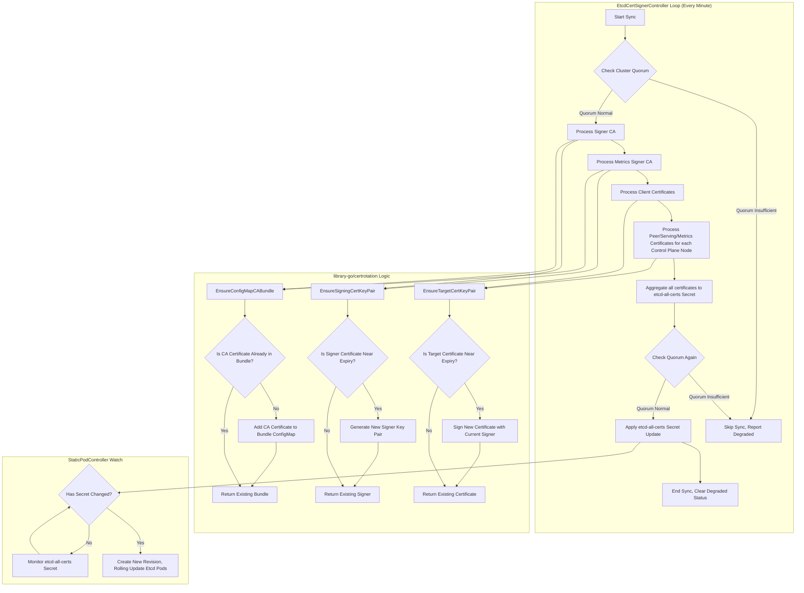

# OpenShift Etcd Operator Certificate Rotation Analysis Report

## 1. Introduction

Etcd, as a critical component of OpenShift clusters, requires secure communications. The [Cluster Etcd Operator (CEO)](https://github.com/openshift/cluster-etcd-operator) is responsible for managing the lifecycle of the Etcd cluster, including the generation and rotation of TLS certificates. This report aims to analyze the implementation logic of certificate rotation in the OpenShift Etcd Operator, related logs, monitoring metrics, and aspects that operations personnel should pay attention to.

## 2. Core Components

Certificate rotation involves the following key components:

*   **EtcdCertSignerController:** (located in `pkg/operator/etcdcertsigner/`) This is the core controller for certificate management. It is responsible for:
    *   Creating and managing various certificates required by Etcd (Signer CA, Peer, Serving, Client, Metrics-related certificates).
    *   Leveraging the capabilities provided by the `library-go/pkg/operator/certrotation` library to automatically trigger rotation based on certificate validity periods.
    *   Aggregating certificates from all nodes into a Secret named `etcd-all-certs`.
    *   Performing cluster health checks (Quorum Check) before updating certificates.
*   **StaticPodController:** (from `library-go`) Responsible for managing Etcd static Pods. It monitors `RevisionSecrets` such as `etcd-all-certs`. When these Secrets change (e.g., content updates due to certificate rotation), it creates a new Revision and triggers a rolling update of Etcd Pods, thereby deploying the new certificates to the nodes.
*   **CertSyncController:** (from `library-go`) Responsible for synchronizing non-versioned certificates (such as CA Bundles) defined in `CertConfigMaps` and `CertSecrets` to the `/etc/kubernetes/static-pod-resources/etcd-certs` directory on each node for use by static Pods.

## 3. Certificate Types

The `EtcdCertSignerController` manages the following main certificate/key pairs and CA Bundles:

*   **Signer CA:**
    *   `etcd-signer` (Secret): CA key pair that signs Peer, Serving, and Client certificates.
    *   `etcd-ca-bundle` (ConfigMap): Contains the current and (during rotation) next Signer CA certificates for verification.
*   **Metrics Signer CA:**
    *   `etcd-metric-signer` (Secret): CA key pair that signs Metrics-related certificates.
    *   `etcd-metric-ca-bundle` (ConfigMap): Contains the Metrics Signer CA certificate.
*   **Client Certificates:**
    *   `etcd-client` (Secret): Etcd client certificate.
    *   `etcd-metric-client` (Secret): Metrics Client certificate.
*   **Per-Node Certificates:** (aggregated in the `etcd-all-certs` Secret)
    *   `etcd-peer-<nodeName>`: Node-to-node communication certificate.
    *   `etcd-serving-<nodeName>`: Etcd API server certificate.
    *   `etcd-serving-metrics-<nodeName>`: Metrics server certificate.

## 4. Certificate Rotation Mechanism

Certificate rotation is primarily driven by the `EtcdCertSignerController` and relies on the `certrotation` library from `library-go`.



**Mechanism Details:**

1.  **Periodic Check:** `EtcdCertSignerController` periodically (default every minute) executes synchronization logic.
2.  **Quorum Check:** Before performing any certificate operations and finally updating the `etcd-all-certs` Secret, the Etcd cluster's Quorum status is checked. If Quorum is insufficient, synchronization is skipped and the `EtcdCertSignerControllerDegraded` status is set, preventing certificate changes that could cause problems in an unhealthy cluster.
3.  **Signer Rotation (`EnsureSigningCertKeyPair`):**
    *   The controller checks the annotations of the `etcd-signer` and `etcd-metric-signer` Secrets to determine if the CA certificates are approaching expiry (based on the default or configured advance period from `library-go`).
    *   If rotation is needed, a new CA key pair is generated and the Secret is updated. **Key point:** `library-go` logic preserves the old CA for a period of time (recorded via annotations) rather than deleting it immediately.
    *   `EnsureConfigMapCABundle` ensures that certificates from **both the old and new Signer CAs** are added to the corresponding CA Bundle ConfigMap (`etcd-ca-bundle`, `etcd-metric-ca-bundle`). This allows the cluster to trust certificates issued by both the old and new CAs during the rotation period, enabling a smooth transition.
4.  **Target Certificate Rotation (`EnsureTargetCertKeyPair`):**
    *   The controller checks the Secret annotations for all target certificates (Client, Peer, Serving, Metrics Serving) to determine if they are approaching expiry.
    *   If rotation is needed, a new certificate/key pair is issued using the **currently active** Signer CA (read from `etcd-signer` or `etcd-metric-signer`) and the corresponding Secret is updated.
5.  **Aggregation and Deployment:**
    *   All target certificates for each node (Peer, Serving, Metrics Serving) are collected and merged into the `data` field of the `etcd-all-certs` Secret.
    *   The `StaticPodController` monitors `etcd-all-certs`. When this Secret is updated (whether due to indirect Signer rotation causing target certificate updates, or target certificate rotation itself), the `StaticPodController` detects the change.
    *   After detecting the change, the `StaticPodController` creates a new Revision for the Etcd Pod and triggers a rolling update, deploying Pods with references to the new certificates to all Control Plane nodes.

## 5. Code Snippets


**pkg/operator/etcdcertsigner/etcdcertsignercontroller.go** `EtcdCertSignerController` periodically (default every minute) executes synchronization logic.

```go
// pkg/operator/etcdcertsigner/etcdcertsignercontroller.go
func NewEtcdCertSignerController(
    // ... parameters omitted ...
) factory.Controller {
    // ... initialization code omitted ...
    
    // Create a health check wrapper that wraps the actual sync function
    syncer := health.NewDefaultCheckingSyncWrapper(c.sync)
    livenessChecker.Add("EtcdCertSignerController", syncer)

    // Key part: Set the controller to execute sync once per minute
    return factory.New().ResyncEvery(time.Minute).WithInformers(
        masterNodeInformer,
        kubeInformers.InformersFor(operatorclient.GlobalUserSpecifiedConfigNamespace).Core().V1().Secrets().Informer(),
        cmInformer.Informer(),
        secretInformer.Informer(),
        operatorClient.Informer(),
    ).WithSync(syncer.Sync).ToController("EtcdCertSignerController", c.eventRecorder)
}

// Main logic executed during each sync
func (c *EtcdCertSignerController) sync(ctx context.Context, syncCtx factory.SyncContext) error {
    // First check if the cluster has sufficient Quorum to safely perform updates
    safe, err := c.quorumChecker.IsSafeToUpdateRevision()
    if err != nil {
        return fmt.Errorf("EtcdCertSignerController can't evaluate whether quorum is safe: %w", err)
    }

    if !safe {
        return fmt.Errorf("skipping EtcdCertSignerController reconciliation due to insufficient quorum")
    }

    // Execute synchronization logic for all certificates
    if err := c.syncAllMasterCertificates(ctx, syncCtx.Recorder()); err != nil {
        // If synchronization fails, set Degraded status condition
        _, _, updateErr := v1helpers.UpdateStatus(ctx, c.operatorClient, v1helpers.UpdateConditionFn(operatorv1.OperatorCondition{
            Type:    "EtcdCertSignerControllerDegraded",
            Status:  operatorv1.ConditionTrue,
            Reason:  "Error",
            Message: err.Error(),
        }))
        if updateErr != nil {
            syncCtx.Recorder().Warning("EtcdCertSignerControllerUpdatingStatus", updateErr.Error())
        }
        return err
    }

    // Synchronization successful, clear Degraded status
    _, _, updateErr := v1helpers.UpdateStatus(ctx, c.operatorClient,
        v1helpers.UpdateConditionFn(operatorv1.OperatorCondition{
            Type:   "EtcdCertSignerControllerDegraded",
            Status: operatorv1.ConditionFalse,
            Reason: "AsExpected",
        }))
    return updateErr
}
```

This code demonstrates the periodic check mechanism of the `EtcdCertSignerController`:

1. During controller initialization, `ResyncEvery(time.Minute)` sets synchronization to occur once per minute.
2. During each sync, `IsSafeToUpdateRevision()` first checks if the Etcd cluster has sufficient Quorum for safe updates.
3. If the Quorum check passes, `syncAllMasterCertificates()` executes the actual certificate management logic.
4. Based on the synchronization result, the controller's status condition `EtcdCertSignerControllerDegraded` is updated to reflect the controller's health status.

This periodic check mechanism ensures that certificate management logic is executed regularly, promptly detecting and handling certificates that need rotation, while using Quorum checks to avoid potentially risky operations when the cluster is unhealthy.

**pkg/operator/starter.go:** Defines which Secrets/ConfigMaps contain certificates and which trigger Revisions.

```go
// RevisionConfigMaps is a list of configmaps that are directly copied for the current values.  A different actor/controller modifies these.
// the first element should be the configmap that contains the static pod manifest
var RevisionConfigMaps = []revision.RevisionResource{
	{Name: "etcd-pod"},
	// ... CA Bundles ...
	{Name: "etcd-serving-ca"},
	{Name: "etcd-peer-client-ca"},
	{Name: "etcd-metrics-proxy-serving-ca"},
	{Name: "etcd-metrics-proxy-client-ca"},
	{Name: "etcd-endpoints"},
}

// RevisionSecrets is a list of secrets that are directly copied for the current values.  A different actor/controller modifies these.
var RevisionSecrets = []revision.RevisionResource{
	{Name: "etcd-all-certs"}, // <--- Aggregated certificates, changes trigger rolling updates
}

// CertConfigMaps defines non-revisioned ConfigMaps synced by CertSyncController
var CertConfigMaps = []installer.UnrevisionedResource{
	// ... other CMs ...
	{Name: "etcd-serving-ca"},
	{Name: "etcd-peer-client-ca"},
	{Name: "etcd-metrics-proxy-serving-ca"},
	{Name: "etcd-metrics-proxy-client-ca"},
}

// CertSecrets defines non-revisioned Secrets synced by CertSyncController
var CertSecrets = []installer.UnrevisionedResource{
	{Name: "etcd-all-certs"}, // Also synced directly for constant path access
}

// ... Controller Initialization ...
	etcdCertSignerController := etcdcertsigner.NewEtcdCertSignerController(
		// ... dependencies ...
	)

	staticPodControllers, err := staticpod.NewBuilder(operatorClient, kubeClient, kubeInformersForNamespaces, configInformers).
		// ... other configurations ...
		WithRevisionedResources("openshift-etcd", "etcd", RevisionConfigMaps, RevisionSecrets). // <--- Monitor RevisionSecrets
		WithUnrevisionedCerts("etcd-certs", CertConfigMaps, CertSecrets). // <--- CertSyncController configuration
		// ... other configurations ...
		ToControllers()
```

**pkg/operator/etcdcertsigner/etcdcertsignercontroller.go:** Core synchronization logic.

```go
func (c *EtcdCertSignerController) syncAllMasterCertificates(ctx context.Context, recorder events.Recorder) error {
	// --- Signer CA Handling ---
	signerCaPair, err := tlshelpers.ReadConfigSignerCert(ctx, c.secretClient) // Read current signer
	// ... error handling ...
	c.reportExpirationMetric(signerCaPair, "signer-ca") // Report metric
	_, err = c.certConfig.signerCaBundle.EnsureConfigMapCABundle(ctx, signerCaPair) // Add current CA to bundle
	// ... error handling ...

	// Ensure the next signer exists (creates if needed, rotates based on expiry)
	newSignerCaPair, _, err := c.certConfig.signerCert.EnsureSigningCertKeyPair(ctx)
	// ... error handling ...
	signerBundle, err := c.certConfig.signerCaBundle.EnsureConfigMapCABundle(ctx, newSignerCaPair) // Add next CA to bundle
	// ... error handling ...

	// --- Metrics Signer CA Handling (Similar logic) ---
	metricsSignerCaPair, err := tlshelpers.ReadConfigMetricsSignerCert(ctx, c.secretClient)
	// ... error handling ...
	c.reportExpirationMetric(metricsSignerCaPair, "metrics-signer-ca")
	_, err = c.certConfig.metricsSignerCaBundle.EnsureConfigMapCABundle(ctx, metricsSignerCaPair)
	// ... error handling ...
	newMetricsSignerCaPair, _, err := c.certConfig.metricsSignerCert.EnsureSigningCertKeyPair(ctx)
	// ... error handling ...
	metricsSignerBundle, err := c.certConfig.metricsSignerCaBundle.EnsureConfigMapCABundle(ctx, newMetricsSignerCaPair)
	// ... error handling ...

	// --- Client Cert Handling ---
	_, err = c.certConfig.etcdClientCert.EnsureTargetCertKeyPair(ctx, signerCaPair, signerBundle) // Ensure client cert signed by current signer
	// ... error handling ...
	_, err = c.certConfig.metricsClientCert.EnsureTargetCertKeyPair(ctx, metricsSignerCaPair, metricsSignerBundle) // Ensure metrics client cert
	// ... error handling ...

	// --- Per-Node Cert Handling ---
	nodeCfgs, err := c.createNodeCertConfigs() // Get configs for all control plane nodes
	// ... error handling ...

	allCerts := map[string][]byte{}
	for _, cfg := range nodeCfgs {
		// Ensure Peer cert signed by current signer
		secret, err := cfg.peerCert.EnsureTargetCertKeyPair(ctx, signerCaPair, signerBundle)
		// ... error handling ...
		allCerts = addCertSecretToMap(allCerts, secret) // Add to aggregation map

		// Ensure Serving cert signed by current signer
		secret, err = cfg.servingCert.EnsureTargetCertKeyPair(ctx, signerCaPair, signerBundle)
		// ... error handling ...
		allCerts = addCertSecretToMap(allCerts, secret)

		// Ensure Metrics Serving cert signed by current metrics signer
		secret, err = cfg.metricsCert.EnsureTargetCertKeyPair(ctx, metricsSignerCaPair, metricsSignerBundle)
		// ... error handling ...
		allCerts = addCertSecretToMap(allCerts, secret)
	}

	// --- Aggregate and Apply ---
	secret := &corev1.Secret{
		ObjectMeta: metav1.ObjectMeta{
			Namespace: operatorclient.TargetNamespace,
			Name:      tlshelpers.EtcdAllCertsSecretName, // "etcd-all-certs"
			// ... annotations ...
		},
		Type: corev1.SecretTypeOpaque,
		Data: allCerts, // Aggregated certs
	}

	// Final Quorum Check before applying
	safe, err := c.quorumChecker.IsSafeToUpdateRevision()
	// ... error handling ...
	if !safe {
		return fmt.Errorf("skipping EtcdCertSignerController reconciliation due to insufficient quorum")
	}
	_, _, err = resourceapply.ApplySecret(ctx, c.secretClient, recorder, secret) // Apply the aggregated secret

	return err
}

// Quorum check before sync starts
func (c *EtcdCertSignerController) sync(ctx context.Context, syncCtx factory.SyncContext) error {
	safe, err := c.quorumChecker.IsSafeToUpdateRevision()
	// ... error handling ...
	if !safe {
		return fmt.Errorf("skipping EtcdCertSignerController reconciliation due to insufficient quorum")
	}
	// ... call syncAllMasterCertificates ...
}
```

## 6. Logs, Events, and Messages

Operations personnel can observe the certificate rotation process and potential issues through the following channels:

*   **Operator Status Conditions:**
    *   Check the status of `clusteroperator/etcd`.
    *   Pay attention to the `EtcdCertSignerControllerDegraded` condition. If it is `True`, it indicates that the certificate signing controller has encountered an error (such as insufficient Quorum, API access failure, etc.), and rotation may be blocked. The Message field will provide error information.
		```bash
		oc get clusteroperator/etcd
		# NAME   VERSION   AVAILABLE   PROGRESSING   DEGRADED   SINCE   MESSAGE
		# etcd   4.16.34   True        False         False      171d
		```
*   **Kubernetes Events:**
    *   Monitor events in the `openshift-etcd` and `openshift-etcd-operator` namespaces.
    *   The `EtcdCertSignerController` will record events related to certificate operations, especially errors and warnings.
    *   `library-go/certrotation` will generate the following specific events:
        *   `SignerUpdateRequired`: Triggered when the signing CA certificate needs to be rotated.
        *   `TargetUpdateRequired`: Triggered when target certificates (such as peer, serving, client certificates) need to be rotated.
        *   `CABundleUpdateRequired`: Triggered when the CA Bundle needs to be updated.
    *   `InstallerController` will record events related to Revision creation and Pod rolling updates, such as:
        *   `NodeTargetRevisionChanged`: Triggered when the node target version changes.
        *   `NodeCurrentRevisionChanged`: Triggered when the node current version changes.
        *   `InstallerPodFailed`: Triggered when the installer Pod fails.
*   **Operator Logs:**
    *   View the logs of the `cluster-etcd-operator-*` Pod in the `openshift-etcd-operator` namespace.
    *   Pay attention to the log output of the `EtcdCertSignerController`, which shows the execution of the synchronization loop, error messages, Quorum check results, etc.
    *   Search for keywords such as:
        *   `skipping EtcdCertSignerController reconciliation due to insufficient quorum` (when Quorum is insufficient)
        *   `error on ensuring etcd-signer cert` (signing CA certificate operation error)
        *   `error on ensuring etcd client cert` (client certificate operation error)
        *   `error on peer cert sync for node` (node Peer certificate synchronization error)
        *   `error on serving cert sync for node` (node Serving certificate synchronization error)
        *   `error on serving metrics cert sync for node` (node Metrics certificate synchronization error)
        *   `Updated ca-bundle.crt configmap` (CA Bundle update)
*   **Secret/ConfigMap Annotations:**
    *   `library-go/certrotation` adds annotations to the Secrets and ConfigMaps it manages, recording information such as certificate expiration time and last rotation time. Checking the annotations of `etcd-signer`, `etcd-metric-signer`, `etcd-ca-bundle`, `etcd-metric-ca-bundle`, and the Secrets corresponding to each certificate in `etcd-all-certs` (such as `etcd-peer-*`, `etcd-serving-*`) can provide insight into the rotation status.

## 7. Monitoring Metrics

*   **`openshift_etcd_operator_signer_expiration_days`:** (Gauge) Exposed by the `EtcdCertSignerController`. Shows how many days remain until the `signer-ca` and `metrics-signer-ca` expire. This is a key metric for monitoring Signer CA health. Alert rules should be set to trigger an alarm when the expiration time is too close (e.g., less than 30 days).

## 8. Operational Perspective

*   **Monitoring:**
    *   **Core:** Monitor the `openshift_etcd_operator_signer_expiration_days` metric to ensure CA certificates have sufficient validity period.
    *   Monitor the status of `clusteroperator/etcd`, especially the `EtcdCertSignerControllerDegraded` condition.
    *   Monitor Kubernetes Events in relevant namespaces.
*   **Troubleshooting:**
    *   If `EtcdCertSignerControllerDegraded` is `True`, check Operator logs and events for detailed errors. Common causes include:
        *   **Insufficient Quorum:** The Etcd cluster is unhealthy and needs to be restored to health first.
        *   **API Access Issues:** Operator RBAC permission problems or API Server issues.
        *   **Resource Write Failures:** Unable to update Secrets or ConfigMaps.
    *   If certificates have not been rotated for a long time (determined by checking Secret annotations or metrics), check Operator logs to confirm that the `EtcdCertSignerController` is running normally and not continuously reporting errors.
    *   During Signer CA rotation, check the `etcd-ca-bundle` and `etcd-metric-ca-bundle` ConfigMaps to confirm that they contain two CA certificates.
    *   Check the update timestamp and content of the `etcd-all-certs` Secret to confirm that certificates are being aggregated as expected.
    *   Check the rolling update status of Etcd Pods to confirm that new Revisions are being successfully deployed.
*   **Manual Intervention:**
    *   Certificate rotation is **fully automatic** and typically does not require manual intervention.
    *   **Forced Rotation:** `library-go/certrotation` can usually force rotation during the next sync by deleting specific annotations from the Secret, but this is an advanced operation and should be used with caution. It's better to first try to resolve the root cause of automatic rotation failure. Manual triggering is not recommended in routine operations.
        * **Specific steps for forced rotation:** Based on source code analysis, here are the specific steps to force certificate rotation:
            1. Key annotations that need to be deleted:
               * `auth.openshift.io/certificate-not-before` - Certificate effective time
               * `auth.openshift.io/certificate-not-after` - Certificate expiration time
            2. Operation example (using etcd-signer as an example):
               ```bash
               # View current annotations of the certificate Secret
               oc get secret etcd-signer -n openshift-etcd -o yaml
               
               # Edit the Secret to delete annotations
               oc edit secret etcd-signer -n openshift-etcd
               # In the editor, delete the auth.openshift.io/certificate-not-before or auth.openshift.io/certificate-not-after annotations
               ```
            3. After deleting these annotations, in the next sync cycle (typically once per minute), the `EtcdCertSignerController` will detect the missing annotations and consider that a new certificate needs to be generated.
            4. Related logic in the source code (from `library-go/pkg/operator/certrotation/signer.go`):
               ```go
               func getValidityFromAnnotations(annotations map[string]string) (notBefore time.Time, notAfter time.Time, reason string) {
                   notAfterString := annotations[CertificateNotAfterAnnotation]
                   if len(notAfterString) == 0 {
                       return notBefore, notAfter, "missing notAfter"
                   }
                   // ...
                   notBeforeString := annotations[CertificateNotBeforeAnnotation]
                   if len(notAfterString) == 0 {
                       return notBefore, notAfter, "missing notBefore"
                   }
                   // ...
               }
               ```
               When these annotations are missing, the controller will record the reason as "missing notAfter" or "missing notBefore" and trigger certificate rotation.
    *   If long-term Operator failure leads to certificate expiration, a more complex manual recovery process may be required (potentially involving manual certificate generation, Secret updates, manual Pod restarts, etc.). Refer to the official OpenShift documentation or seek support.
*   **Awareness:**
    *   Understand that certificate rotation depends on a healthy Etcd cluster (Quorum).
    *   Understand that Signer CA rotation is a smooth process, with old and new CAs coexisting for a period of time.
    *   Understand that certificate updates ultimately take effect through Etcd Pod rolling updates triggered by changes to the `etcd-all-certs` Secret.
