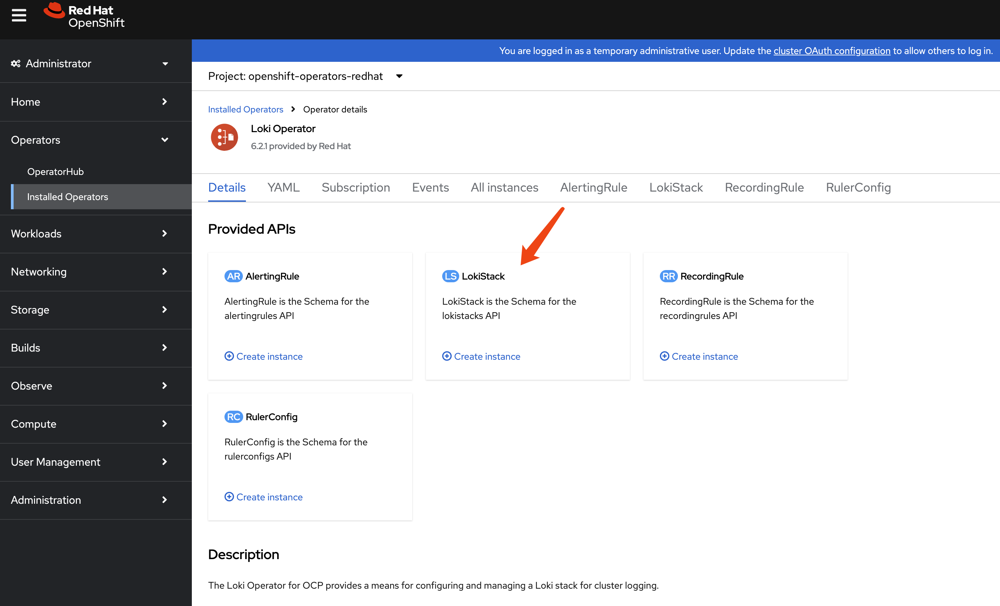

# Logging, Loki

- https://docs.redhat.com/en/documentation/openshift_container_platform/4.16/html/logging/log-storage-4#logging-loki-gui-install_installing-log-storage

1. install `Loki` operator

2. install `Red Hat OpenShift Logging` operator




```yaml
apiVersion: loki.grafana.com/v1
kind: LokiStack
metadata:
  name: logging-loki 
  namespace: openshift-logging 
spec:
  size: 1x.demo
  storage:
    schemas:
    - version: v13
      effectiveDate: "<yyyy>-<mm>-<dd>"
    secret:
      name: logging-loki-s3 
      type: s3 
      credentialMode: 
  storageClassName: gp3-csi
  tenants:
    mode: openshift-logging 
```

# end