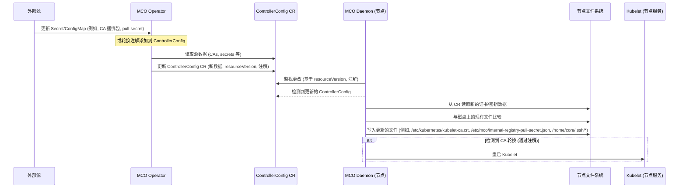

# OpenShift Machine Config Operator 证书/密钥轮换逻辑

本文档概述了 [Machine Config Operator (MCO)](https://github.com/openshift/machine-config-operator) 及其相关组件（如 Machine Config Daemon - MCD）用于处理证书、密钥和秘钥轮换并将其分发到 OpenShift 节点的逻辑（基于对 4.16 版本代码库的分析）。

## 概述

MCO 通常不*直接生成*新的证书或密钥（这通常由其他 OpenShift 组件处理，如 `service-ca-operator`、`ingress-operator` 或管理员手动操作）。MCO 也不直接读取 `service-ca-operator` 等组件内部生成的 Secret。相反，MCO/MCD 系统依赖于一个解耦的机制，负责：

1.  **检测**包含相关数据（例如，CA 捆绑包、拉取密钥、云提供商配置）的源 ConfigMap 和 Secret 的更改。
2.  通过 `ControllerConfig` 自定义资源将这些更改**传播**到节点。
3.  通过将文件写入节点文件系统上的正确位置，在每个节点上**应用**这些更改。
4.  如果更改需要（例如，重大的 CA 更新，通常通过 `ControllerConfig` 上的注解发出信号），则**重启**相关服务（如 `kubelet`）。


## 关键组件和逻辑流程

该过程涉及两个主要参与者：集中运行的 MCO Operator 和在每个节点上作为 DaemonSet 运行的 MCD。



### 1. MCO Operator (`pkg/operator/sync.go`)

*   Operator 作为中央部署运行。
*   它监视集群中的各种源 ConfigMap 和 Secret，主要在 `openshift-config` 和 `openshift-config-managed` 命名空间中。示例包括：
    *   `pull-secret` (Secret)
    *   `kube-cloud-config` (用于云提供商详细信息的 ConfigMap)
    *   CA 捆绑包 (例如, `*-ca-bundle` ConfigMaps)
    *   与 MCO 服务帐户关联的镜像仓库拉取密钥。
*   当在这些源中检测到更改时，Operator 会获取相关数据。
*   它在必要时合并数据（例如，合并多个 CA 捆绑包，将镜像仓库拉取密钥与全局拉取密钥合并）。
*   它使用最新的合并数据更新中央 `ControllerConfig` 自定义资源 (`machineconfiguration.openshift.io`)。此更新会更改 `ControllerConfig` 的 `resourceVersion`。
*   它还可能更新 `ControllerConfig` 上的注解，例如 `machineconfiguration.openshift.io/service-ca-rotate` (由常量 `ServiceCARotateAnnotation` 定义)，以指示守护进程需要执行的特定操作。

**与 `service-ca-operator` 的交互:**

需要强调的是，MCO 与 `service-ca-operator` 的交互是**间接**的。`service-ca-operator` 将其管理的 CA 证书发布到集群中**众所周知的 ConfigMap**（例如 `openshift-config-managed/kube-apiserver-client-ca`）。MCO Operator 会**监视**这些 ConfigMap。当这些 ConfigMap 更新时，MCO Operator 读取新的数据，并将其填充到 `ControllerConfig` CR 中。随后，MCO Daemon 从 `ControllerConfig` 读取数据并将其应用到节点上。因此，MCO 代码中不会包含直接读取 `service-ca-operator` 内部 Secret 的逻辑，而是通过监视标准的 ConfigMap 和 `ControllerConfig` CR 来实现解耦。

**相关源代码片段:**

*   `pkg/operator/sync.go`: 包含用于准备渲染配置 (`syncRenderConfig`) 的逻辑，以及用于获取 CA (`getCAsFromConfigMap`)、云配置 (`getCloudConfigFromConfigMap`) 和合并拉取密钥 (`getImageRegistryPullSecrets`) 的辅助函数。主同步循环由 `syncAll` 编排。

    ```go
    // syncRenderConfig gathers all necessary configuration (infra, network, CAs, pull secrets, images, etc.)
    // and populates the optr.renderConfig structure, which is then used to render various manifests.
    func (optr *Operator) syncRenderConfig(_ *renderConfig) error {
        // ... check if inClusterBringup ...

        // sync up the images used by operands.
        imgsRaw, err := os.ReadFile(optr.imagesFile)
        // ... handle error & unmarshal ...

        // handle image registry certificates.
        cfg, err := optr.imgLister.Get("cluster")
        // ... handle error & process AdditionalTrustedCA ...
        // ... process image-registry-ca ConfigMap ...
        // ... merge CAs and update/create merged-trusted-image-registry-ca ConfigMap ...

        // sync up CAs
        rootCA, err := optr.getCAsFromConfigMap("kube-system", "root-ca", "ca.crt")
        // ... handle error ...

        // Determine if bootstrap is complete
        _, err = optr.clusterCmLister.ConfigMaps("kube-system").Get("bootstrap")
        // ... handle bootstrap status ...

        var kubeAPIServerServingCABytes []byte
        var internalRegistryPullSecret []byte
        if bootstrapComplete && !optr.inClusterBringup {
            kubeAPIServerServingCABytes, err = optr.getCAsFromConfigMap("openshift-config-managed", "kube-apiserver-client-ca", "ca-bundle.crt")
            // ... handle error ...
            internalRegistryPullSecret, err = optr.getImageRegistryPullSecrets()
            // ... handle error ...
        } else {
            // ... logic for initial/bootstrap CA bundle ...
            internalRegistryPullSecret = nil
        }

        bundle := make([]byte, 0)
        bundle = append(bundle, rootCA...)
        // bundle = append(bundle, kubeAPIServerServingCABytes...) // Note: This line seems commented out in the source

        // sync up os image url
        oscontainer, osextensionscontainer, err := optr.getOsImageURLs(optr.namespace)
        // ... handle error & update imgs struct ...

        // sync up the ControllerConfigSpec
        infra, network, proxy, dns, err := optr.getGlobalConfig()
        // ... handle error ...
        spec, err := createDiscoveredControllerConfigSpec(infra, network, proxy, dns)
        // ... handle error ...

        // Process AdditionalTrustBundle and Proxy Trust Bundle
        var trustBundle []byte
        // ... logic to fetch and merge user-ca-bundle and proxy trustedCA ...
        spec.AdditionalTrustBundle = trustBundle

        // Sync cloud provider config if needed
        if err := optr.syncCloudConfig(spec, infra); err != nil {
            return err
        }

        spec.KubeAPIServerServingCAData = kubeAPIServerServingCABytes
        spec.RootCAData = bundle // Note: Seems to only contain rootCA based on current source
        spec.ImageRegistryBundleData = imgRegistryData
        spec.ImageRegistryBundleUserData = imgRegistryUsrData
        spec.PullSecret = &corev1.ObjectReference{Namespace: "openshift-config", Name: "pull-secret"}
        spec.InternalRegistryPullSecret = internalRegistryPullSecret
        spec.BaseOSContainerImage = imgs.BaseOSContainerImage
        spec.BaseOSExtensionsContainerImage = imgs.BaseOSExtensionsContainerImage
        spec.Images = map[string]string{
            // ... image mappings ...
        }

        // Create pointer config
        ignitionHost, err := getIgnitionHost(&infra.Status)
        // ... handle error ...
        pointerConfig, err := ctrlcommon.PointerConfig(ignitionHost, rootCA)
        // ... handle error & marshal ...

        // Handle OnClusterBuild feature gate and MachineOSConfigs
        isOnClusterBuildEnabled, err := optr.isOnClusterBuildFeatureGateEnabled()
        // ... handle error ...
        var moscs []*mcfgv1alpha1.MachineOSConfig
        if isOnClusterBuildEnabled {
             moscs, err = optr.getAndValidateMachineOSConfigs()
             // ... handle error ...
        }

        // create renderConfig
        optr.renderConfig = getRenderConfig(optr.namespace, string(kubeAPIServerServingCABytes), spec, &imgs.RenderConfigImages, infra.Status.APIServerInternalURL, pointerConfigData, moscs)

        return nil
    }

    // getCAsFromConfigMap fetches CA data from a given key within a ConfigMap.
    // It checks BinaryData first, then Data (handling potential base64 encoding).
    func getCAsFromConfigMap(cm *corev1.ConfigMap, key string) ([]byte, error) {
        if bd, bdok := cm.BinaryData[key]; bdok {
            return bd, nil
        } else if d, dok := cm.Data[key]; dok {
            // Handle potential base64 encoding
            raw, err := base64.StdEncoding.DecodeString(d)
            if err != nil {
                // Assume it's not encoded if decode fails
                return []byte(d), nil
            }
            return raw, nil
        } else {
            return nil, fmt.Errorf("%s not found in %s/%s", key, cm.Namespace, cm.Name)
        }
    }

    // getCloudConfigFromConfigMap fetches cloud provider config data from the "cloud.conf" key.
    func getCloudConfigFromConfigMap(cm *corev1.ConfigMap, key string) (string, error) {
        // 'key' parameter is usually "cloud.conf" when called by syncCloudConfig
        if cc, ok := cm.Data[key]; ok {
            return cc, nil
        }
        return "", fmt.Errorf("%s not found in %s/%s", key, cm.Namespace, cm.Name)
    }

    // getImageRegistryPullSecrets fetches image registry pull secrets from the
    // machine-os-puller service account, merges them with the global pull-secret,
    // and potentially adds a default route entry.
    func (optr *Operator) getImageRegistryPullSecrets() ([]byte, error) {
        // Check if image registry operator exists
        co, err := optr.mcoCOLister.Get("image-registry")
        // ... handle registry operator existence checks ...

        // Get DNS cluster object for default route construction
        dns, err := optr.dnsLister.Get("cluster")
        // ... handle error ...

        dockerConfigJSON := ctrlcommon.DockerConfigJSON{
            Auths: map[string]ctrlcommon.DockerConfigEntry{},
        }

        // Get secrets from machine-os-puller service account
        imageRegistrySA, err := optr.mcoSALister.ServiceAccounts(optr.namespace).Get("machine-os-puller")
        // ... handle error (e.g., SA not existing yet during upgrade) ...

        // Loop through SA's ImagePullSecrets
        for _, imagePullSecret := range imageRegistrySA.ImagePullSecrets {
             secret, err := optr.mcoSecretLister.Secrets(optr.namespace).Get(imagePullSecret.Name)
             // ... handle error ...
             // Merge secret into dockerConfigJSON.Auths
             if err := ctrlcommon.MergeDockerConfigstoJSONMap(secret.Data[corev1.DockerConfigKey], dockerConfigJSON.Auths); err != nil {
                 return nil, fmt.Errorf("could not merge auths from secret %s: %w", imagePullSecret.Name, err)
             }
        }

        // Fetch global pull-secret from openshift-config
        clusterPullSecret, err := optr.ocSecretLister.Secrets("openshift-config").Get("pull-secret")
        // ... handle error & type check ...
        clusterPullSecretRaw := clusterPullSecret.Data[corev1.DockerConfigJsonKey]

        // Convert global secret format if needed (dockerconfigjson -> dockercfg)
        clusterPullSecretRawOld, err := ctrlcommon.ConvertSecretTodockercfg(clusterPullSecretRaw)
        // ... handle error ...

        // Merge converted global pull secret
        err = ctrlcommon.MergeDockerConfigstoJSONMap(clusterPullSecretRawOld, dockerConfigJSON.Auths)
        if err != nil {
            return nil, fmt.Errorf("failed to merge global pull secret:  %w", err)
        }

        // Add default route entry if internal registry route exists
        if entry, ok := dockerConfigJSON.Auths["image-registry.openshift-image-registry.svc:5000"]; ok {
            assembledDefaultRoute := "default-route-openshift-image-registry.apps." + dns.Spec.BaseDomain
            dockerConfigJSON.Auths[assembledDefaultRoute] = entry
        }

        // Marshal the final merged secrets if Auths is not empty
        if len(dockerConfigJSON.Auths) > 0 {
            mergedPullSecrets, err := json.Marshal(dockerConfigJSON)
            // ... handle marshal error ...
            return mergedPullSecrets, nil
        }

        return nil, nil // Return nil if no auths were merged
    }
    ```

### 2. MCO Daemon (`pkg/daemon/certificate_writer.go`, `pkg/daemon/update.go`)

*   Daemon 在每个由 machineconfig 管理的节点上运行。
*   它监视 `ControllerConfig` 自定义资源。
*   当它检测到 `ControllerConfig` 中的更改时（通过比较它上次处理的 `metadata.resourceVersion`（存储在 Node 对象的注解中）与当前版本），它会触发同步。
*   **证书处理 (`pkg/daemon/certificate_writer.go`):**
    *   `syncControllerConfigHandler` 函数专门处理从 `ControllerConfig` 派生的证书更新。
    *   它从 `ControllerConfig` 读取 CA 数据（如 kubelet CA）。
    *   它将接收到的 CA 与当前存在于 `/etc/kubernetes/kubelet-ca.crt` 中的 CA 进行比较。
    *   如果发现差异，它会将新的捆绑包写入 `/etc/kubernetes/kubelet-ca.crt`。
    *   如果检测到 `machineconfiguration.openshift.io/service-ca-rotate: "true"` 注解 (常量 `ServiceCARotateAnnotation` 的值) 并且 CA 已更改，它会触发 `kubelet` 重启 (`systemctl stop kubelet`)。
    *   它还处理合并内部镜像仓库拉取密钥并将其写入 `/etc/mco/internal-registry-pull-secret.json`。
*   **通用文件/更新处理 (`pkg/daemon/update.go`):**
    *   主节点同步循环 (`syncNode`) 将期望的配置（从 `ControllerConfig` 派生）与当前节点状态进行比较。
    *   `updateFiles` 函数处理写入 MachineConfig 中定义的通用文件，包括 SSH 密钥 (`/home/core/.ssh/authorized_keys` 或 `/home/core/.ssh/authorized_keys.d/ignition`)。对 SSH 密钥或主拉取密钥 (`/var/lib/kubelet/config.json`) 的更改通常被视为 `postConfigChangeActionNone`，这意味着它们通常不需要重启或驱逐节点，只需更新文件。

**相关源代码片段:**

*   `pkg/daemon/certificate_writer.go`: 包含 `syncControllerConfigHandler`，写入 `kubelet-ca.crt` 的逻辑，处理服务 CA 轮换注解 (常量 `ServiceCARotateAnnotation`，值为 `machineconfiguration.openshift.io/service-ca-rotate`)，以及写入内部仓库拉取密钥。包括 `mergeMountedSecretsWithControllerConfig` 等函数。

    ```go
    // syncControllerConfigHandler handles updates from the ControllerConfig object.
    func (dn *Daemon) syncControllerConfigHandler(key string) error {
        // ... initial checks ...

        controllerConfig, err := dn.ccLister.Get(ctrlcommon.ControllerConfigName)
        // ... handle error ...

        currentNodeControllerConfigResource := dn.node.Annotations[constants.ControllerConfigResourceVersionKey]

        // Check if the ControllerConfig has changed or if a rotation is explicitly requested
        if currentNodeControllerConfigResource != controllerConfig.ObjectMeta.ResourceVersion || controllerConfig.Annotations[ctrlcommon.ServiceCARotateAnnotation] == ctrlcommon.ServiceCARotateTrue {
            pathToData := make(map[string][]byte)
            kubeAPIServerServingCABytes := controllerConfig.Spec.KubeAPIServerServingCAData
            cloudCA := controllerConfig.Spec.CloudProviderCAData
            pathToData[caBundleFilePath] = kubeAPIServerServingCABytes // /etc/kubernetes/kubelet-ca.crt
            pathToData[cloudCABundleFilePath] = cloudCA

            // ... logic to handle kubeconfig CA rotation via kubeconfig-data ConfigMap ...
            // This involves comparing CM data with on-disk /etc/kubernetes/kubeconfig
            // and potentially adding the updated kubeconfig to pathToData

            // Write CA bundles and potentially updated kubeconfig
            if err := writeToDisk(pathToData); err != nil {
                return err
            }

            // Sync image registry CAs
            mergedData := append(controllerConfig.Spec.ImageRegistryBundleData, controllerConfig.Spec.ImageRegistryBundleUserData...)
            // ... logic to clean old certs from /etc/docker/certs.d ...
            for _, CA := range mergedData {
                 caFile := strings.ReplaceAll(CA.File, "..", ":")
                 // ... create dir /etc/docker/certs.d/<caFile> ...
                 // ... write CA.Data to /etc/docker/certs.d/<caFile>/ca.crt ...
            }

            // Sync internal registry pull secret
            if err := dn.syncOSImagePullSecrets(controllerConfig); err != nil {
                 return err
            }
        }

        // ... update node annotations with processed resourceVersion ...

        // Check if rotation annotation is set and CA actually changed, then restart kubelet
        if controllerConfig.Annotations[ctrlcommon.ServiceCARotateAnnotation] == ctrlcommon.ServiceCARotateTrue && /* kubeConfigDiff && !allCertsThere && */ !dn.deferKubeletRestart {
             logSystem("restarting kubelet due to server-ca rotation")
             if err := runCmdSync("systemctl", "stop", "kubelet"); err != nil {
                 return err
             }
             // ... update /var/lib/kubelet/kubeconfig with new CA data ...
             if err := runCmdSync("systemctl", "daemon-reload"); err != nil {
                 return err
             }
             if err := runCmdSync("systemctl", "start", "kubelet"); err != nil {
                 return err
             }
        }
        return nil
    }

    // syncOSImagePullSecrets merges internal registry pull secret with potential mounted secrets.
    func (dn *Daemon) syncOSImagePullSecrets(controllerConfig *mcfgv1.ControllerConfig) error {
        // ... lock mutex ...
        // ... get controllerConfig if nil ...

        merged, err := reconcileOSImageRegistryPullSecretData(dn.node, controllerConfig, osImagePullSecretDir)
        // ... handle error ...

        // Writes to /etc/mco/internal-registry-pull-secret.json
        if err := writeToDisk(map[string][]byte{imageRegistryAuthFile: merged}); err != nil {
            return fmt.Errorf("could not write image pull secret data to node filesystem: %w", err)
        }
        // ... log success ...
        return nil
    }

    // reconcileOSImageRegistryPullSecretData merges secrets from ControllerConfig and mounted secrets.
    func reconcileOSImageRegistryPullSecretData(node *corev1.Node, controllerCfg *mcfgv1.ControllerConfig, secretDirPath string) ([]byte, error) {
        // ... get node roles ...
        mountedSecret, err := readMountedSecretByNodeRole(nodeRoles, secretDirPath)
        // ... handle error ...

        if mountedSecret == nil {
            return controllerCfg.Spec.InternalRegistryPullSecret, nil
        }

        merged, err := mergeMountedSecretsWithControllerConfig(mountedSecret, controllerCfg)
        // ... handle error ...
        return merged, nil
    }

    // writeToDisk writes data to specified paths atomically.
    func writeToDisk(pathToData map[string][]byte) error {
        for bundle, data := range pathToData {
            // ... ensure data ends with newline ...
            // ... get existing file/dir modes ...
            if err := writeFileAtomically(bundle, data, /* dirMode */, /* fileMode */, -1, -1); err != nil {
                 return err
            }
        }
        return nil
    }
    ```

*   `pkg/daemon/update.go`: 包含 `syncNode`、`updateFiles` 以及处理 SSH 密钥更新 (`updateSSHKeys`, `cleanSSHKeyPaths`) 的逻辑。定义了 `caBundleFilePath` (在 certificate_writer.go 中使用) 和 `postConfigChangeActionNone` 等常量。

    ```go
    // syncNode compares the current config to the desired config and triggers
    // an update if necessary.
    func (dn *Daemon) syncNode() error {
        // ... get current node state ...
        state, err := dn.getStateAndConfigs()
        // ... handle error ...

        // Check if we are already in the desired config
        if reflect.DeepEqual(state.currentConfig, state.desiredConfig) {
            // ... handle already updated state ...
            return nil
        }

        // Trigger the update process
        return dn.triggerUpdateWithMachineConfig(state.currentConfig, state.desiredConfig, false)
    }

    // update is the main update function called by triggerUpdateWithMachineConfig.
    func (dn *Daemon) update(oldConfig, newConfig *mcfgv1.MachineConfig, skipCertificateWrite bool) (retErr error) {
        // ... set node state to Working ...
        // ... parse ignition configs ...
        // ... check reconcilability ...

        diff, _ := reconcilable(oldConfig, newConfig) // Error already checked

        // ... calculate postConfigChangeActions (legacy or NodeDisruptionPolicy based) ...
        // ... perform drain if needed ...

        // update files on disk that need updating
        if err := dn.updateFiles(oldIgnConfig, newIgnConfig, skipCertificateWrite); err != nil {
            return err
        }
        // ... defer rollback for updateFiles ...

        // update file permissions (kubeconfig)
        if err := dn.updateKubeConfigPermission(); err != nil {
            return err
        }

        // only update passwd if it has changed
        if diff.passwd {
            if err := dn.updateSSHKeys(newIgnConfig.Passwd.Users, oldIgnConfig.Passwd.Users); err != nil {
                return err
            }
            // ... defer rollback for updateSSHKeys ...
        }

        // Set password hash
        if err := dn.SetPasswordHash(newIgnConfig.Passwd.Users, oldIgnConfig.Passwd.Users); err != nil {
            return err
        }
        // ... defer rollback for SetPasswordHash ...

        // Apply OS changes (rpm-ostree rebase, kargs, kernel type, extensions) if CoreOS
        if dn.os.IsCoreOSVariant() {
             coreOSDaemon := CoreOSDaemon{dn}
             if err := coreOSDaemon.applyOSChanges(*diff, oldConfig, newConfig); err != nil {
                 return err
             }
             // ... defer rollback for applyOSChanges ...
        }

        // ... update tuning args ...

        // Store the new config as current on disk
        odc := &onDiskConfig{currentConfig: newConfig}
        if err := dn.storeCurrentConfigOnDisk(odc); err != nil {
            return err
        }
        // ... defer rollback for storeCurrentConfigOnDisk ...

        // Perform post-config change action (reboot, reload crio, none, etc.)
        // This is where postConfigChangeActionNone is evaluated.
        if fg != nil && fg.Enabled(features.FeatureGateNodeDisruptionPolicy) && nodeDisruptionError == nil {
             return dn.performPostConfigChangeNodeDisruptionAction(nodeDisruptionActions, newConfig.GetName())
        }
        return dn.performPostConfigChangeAction(actions, newConfig.GetName())
    }


    // updateFiles writes files specified by the nodeconfig to disk.
    func (dn *Daemon) updateFiles(oldIgnConfig, newIgnConfig ign3types.Config, skipCertificateWrite bool) error {
        klog.Info("Updating files")
        // Writes files from newIgnConfig.Storage.Files
        if err := dn.writeFiles(newIgnConfig.Storage.Files, skipCertificateWrite); err != nil {
            return err
        }
        // Writes systemd units from newIgnConfig.Systemd.Units
        if err := dn.writeUnits(newIgnConfig.Systemd.Units); err != nil {
            return err
        }
        // Deletes files/units present in oldIgnConfig but not in newIgnConfig
        return dn.deleteStaleData(oldIgnConfig, newIgnConfig)
    }

    // Update a given PasswdUser's SSHKey
    func (dn *Daemon) updateSSHKeys(newUsers, oldUsers []ign3types.PasswdUser) error {
        // ... check if core user exists ...

        var concatSSHKeys string
        for _, u := range newUsers {
            for _, k := range u.SSHAuthorizedKeys {
                concatSSHKeys = concatSSHKeys + string(k) + "\n"
            }
        }

        // Determine correct path based on OS version (RHCOS 8 vs 9+)
        authKeyPath := constants.RHCOS8SSHKeyPath
        if dn.useNewSSHKeyPath() {
             authKeyPath = constants.RHCOS9SSHKeyPath
             if err := cleanSSHKeyPaths(); err != nil { // Removes old path if exists
                 return err
             }
             if err := removeNonIgnitionKeyPathFragments(); err != nil { // Removes other fragments in .d dir
                 return err
             }
        }

        // Write the concatenated keys atomically to the determined path
        return dn.atomicallyWriteSSHKey(authKeyPath, concatSSHKeys)
    }

    // atomicallyWriteSSHKey writes SSH keys ensuring correct ownership and permissions.
    func (dn *Daemon) atomicallyWriteSSHKey(authKeyPath, keys string) error {
        uid, _ := lookupUID(constants.CoreUserName)
        gid, _ := lookupGID(constants.CoreGroupName)

        authKeyDir := filepath.Dir(authKeyPath)
        if _, err := os.Stat(authKeyDir); os.IsNotExist(err) {
            if err := createSSHKeyDir(authKeyDir); err != nil { // Ensures dir exists with core:core 0700
                return err
            }
        }

        // Writes the file with core:core 0600 permissions
        if err := writeFileAtomically(authKeyPath, []byte(keys), os.FileMode(0o700), os.FileMode(0o600), uid, gid); err != nil {
            return err
        }
        // ... log success ...
        return nil
    }

    // calculatePostConfigChangeAction determines the action needed after applying config.
    // postConfigChangeActionNone is used when only specific safe files change.
    func calculatePostConfigChangeAction(diff *machineConfigDiff, diffFileSet []string) ([]string, error) {
        // ... check for force file ...
        // ... check for OS update, kargs, fips, units, kernelType, extensions (require reboot) ...

        // Calculate actions based on file diffs
        actions := calculatePostConfigChangeActionFromMCDiffs(diffFileSet)
        return actions, nil
    }

    // calculatePostConfigChangeActionFromMCDiffs checks changed files against known safe/reload/restart lists.
    func calculatePostConfigChangeActionFromMCDiffs(diffFileSet []string) (actions []string) {
        filesPostConfigChangeActionNone := []string{
            caBundleFilePath, // /etc/kubernetes/kubelet-ca.crt
            "/var/lib/kubelet/config.json",
        }
        // ... other lists for reload/restart ...

        actions = []string{postConfigChangeActionNone} // Default to none
        for _, path := range diffFileSet {
            if ctrlcommon.InSlice(path, filesPostConfigChangeActionNone) {
                continue // Safe file, action remains 'none' unless overridden
            } else if /* check reload list */ {
                 actions = []string{postConfigChangeActionReloadCrio}
            } else if /* check restart list */ {
                 actions = []string{postConfigChangeActionRestartCrio}
            } else if /* check safe directories */ {
                 continue
            } else {
                 actions = []string{postConfigChangeActionReboot} // Unknown file change, require reboot
                 return
            }
        }
        return
    }
    ```

## 结论

MCO 系统提供了一个强大的机制，用于将更新的证书和密钥分发到节点。Operator 集中收集数据并将其合并到 `ControllerConfig` CR 中，而每个节点上的 Daemon 则确保这些更改在本地应用于文件系统，并根据注解等特定信号触发必要的服务重启。这种分离允许在集群节点之间实现一致的配置。
