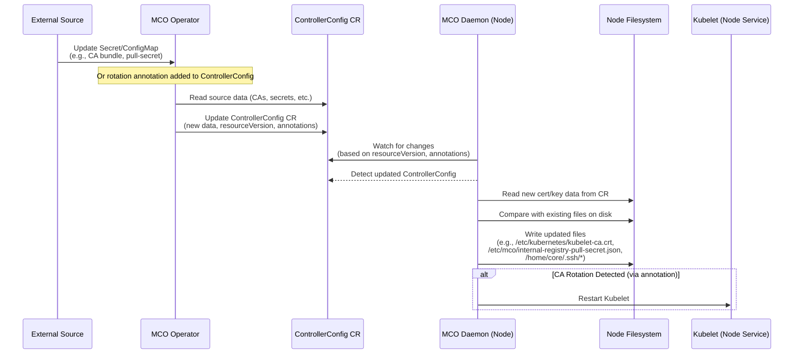

# OpenShift Machine Config Operator Certificate/Key Rotation Logic

This document outlines the logic used by the Machine Config Operator (MCO) and its related components, such as the Machine Config Daemon (MCD), to handle the rotation and distribution of certificates, keys, and secrets to OpenShift nodes (based on analysis of the 4.16 codebase).

## Overview

The MCO generally does not *directly generate* new certificates or keys (this is typically handled by other OpenShift components like `service-ca-operator`, `ingress-operator`, or manual administrator actions). MCO also does not directly read Secrets generated internally by components like `service-ca-operator`. Instead, the MCO/MCD system relies on a decoupled mechanism responsible for:

1.  **Detecting** changes in source ConfigMaps and Secrets containing relevant data (e.g., CA bundles, pull secrets, cloud provider configurations).
2.  **Propagating** these changes to nodes via the `ControllerConfig` custom resource.
3.  **Applying** these changes on each node by writing files to the correct locations on the node filesystem.
4.  **Restarting** relevant services (like `kubelet`) if the change requires it (e.g., significant CA updates, often signaled via annotations on the `ControllerConfig`).

## Key Components and Logic Flow

The process involves two main players: the centrally running MCO Operator and the MCD running as a DaemonSet on each node.



### 1. MCO Operator (`pkg/operator/sync.go`)

*   The Operator runs as a central deployment.
*   It watches various source ConfigMaps and Secrets in the cluster, primarily in the `openshift-config` and `openshift-config-managed` namespaces. Examples include:
    *   `pull-secret` (Secret)
    *   `kube-cloud-config` (ConfigMap for cloud provider details)
    *   CA bundles (e.g., `*-ca-bundle` ConfigMaps)
    *   Image registry pull secrets associated with the MCO service account.
*   When changes are detected in these sources, the Operator fetches the relevant data.
*   It merges data where necessary (e.g., combining multiple CA bundles, merging image registry pull secrets with the global pull secret).
*   It updates the central `ControllerConfig` custom resource (`machineconfiguration.openshift.io`) with the latest merged data. This update changes the `resourceVersion` of the `ControllerConfig`.
*   It may also update annotations on the `ControllerConfig`, such as `machineconfiguration.openshift.io/service-ca-rotate` (defined by the constant `ServiceCARotateAnnotation`), to signal specific actions required by the daemons.

**Interaction with `service-ca-operator`:**

It's important to emphasize that MCO's interaction with `service-ca-operator` is **indirect**. The `service-ca-operator` publishes the CA certificates it manages into **well-known ConfigMaps** in the cluster (e.g., `openshift-config-managed/kube-apiserver-client-ca`). The MCO Operator **watches** these ConfigMaps. When these ConfigMaps are updated, the MCO Operator reads the new data and populates it into the `ControllerConfig` CR. Subsequently, the MCO Daemon reads the data from the `ControllerConfig` and applies it to the node. Therefore, the MCO code does not contain logic to directly read internal Secrets of the `service-ca-operator`; decoupling is achieved by watching standard ConfigMaps and the `ControllerConfig` CR.

**Relevant Source Code Snippets:**

*   `pkg/operator/sync.go`: Contains the logic for preparing the render config (`syncRenderConfig`), and helper functions for fetching CAs (`getCAsFromConfigMap`), cloud config (`getCloudConfigFromConfigMap`), and merging pull secrets (`getImageRegistryPullSecrets`). The main sync loop is orchestrated by `syncAll`.

    ```go
    // syncRenderConfig gathers all necessary configuration (infra, network, CAs, pull secrets, images, etc.)
    // and populates the optr.renderConfig structure, which is then used to render various manifests.
    func (optr *Operator) syncRenderConfig(_ *renderConfig) error {
        // ... check if inClusterBringup ...

        // sync up the images used by operands.
        imgsRaw, err := os.ReadFile(optr.imagesFile)
        // ... handle error & unmarshal ...

        // handle image registry certificates.
        cfg, err := optr.imgLister.Get("cluster")
        // ... handle error & process AdditionalTrustedCA ...
        // ... process image-registry-ca ConfigMap ...
        // ... merge CAs and update/create merged-trusted-image-registry-ca ConfigMap ...

        // sync up CAs
        rootCA, err := optr.getCAsFromConfigMap("kube-system", "root-ca", "ca.crt")
        // ... handle error ...

        // Determine if bootstrap is complete
        _, err = optr.clusterCmLister.ConfigMaps("kube-system").Get("bootstrap")
        // ... handle bootstrap status ...

        var kubeAPIServerServingCABytes []byte
        var internalRegistryPullSecret []byte
        if bootstrapComplete && !optr.inClusterBringup {
            kubeAPIServerServingCABytes, err = optr.getCAsFromConfigMap("openshift-config-managed", "kube-apiserver-client-ca", "ca-bundle.crt")
            // ... handle error ...
            internalRegistryPullSecret, err = optr.getImageRegistryPullSecrets()
            // ... handle error ...
        } else {
            // ... logic for initial/bootstrap CA bundle ...
            internalRegistryPullSecret = nil
        }

        bundle := make([]byte, 0)
        bundle = append(bundle, rootCA...)
        // bundle = append(bundle, kubeAPIServerServingCABytes...) // Note: This line seems commented out in the source

        // sync up os image url
        oscontainer, osextensionscontainer, err := optr.getOsImageURLs(optr.namespace)
        // ... handle error & update imgs struct ...

        // sync up the ControllerConfigSpec
        infra, network, proxy, dns, err := optr.getGlobalConfig()
        // ... handle error ...
        spec, err := createDiscoveredControllerConfigSpec(infra, network, proxy, dns)
        // ... handle error ...

        // Process AdditionalTrustBundle and Proxy Trust Bundle
        var trustBundle []byte
        // ... logic to fetch and merge user-ca-bundle and proxy trustedCA ...
        spec.AdditionalTrustBundle = trustBundle

        // Sync cloud provider config if needed
        if err := optr.syncCloudConfig(spec, infra); err != nil {
            return err
        }

        spec.KubeAPIServerServingCAData = kubeAPIServerServingCABytes
        spec.RootCAData = bundle // Note: Seems to only contain rootCA based on current source
        spec.ImageRegistryBundleData = imgRegistryData
        spec.ImageRegistryBundleUserData = imgRegistryUsrData
        spec.PullSecret = &corev1.ObjectReference{Namespace: "openshift-config", Name: "pull-secret"}
        spec.InternalRegistryPullSecret = internalRegistryPullSecret
        spec.BaseOSContainerImage = imgs.BaseOSContainerImage
        spec.BaseOSExtensionsContainerImage = imgs.BaseOSExtensionsContainerImage
        spec.Images = map[string]string{
            // ... image mappings ...
        }

        // Create pointer config
        ignitionHost, err := getIgnitionHost(&infra.Status)
        // ... handle error ...
        pointerConfig, err := ctrlcommon.PointerConfig(ignitionHost, rootCA)
        // ... handle error & marshal ...

        // Handle OnClusterBuild feature gate and MachineOSConfigs
        isOnClusterBuildEnabled, err := optr.isOnClusterBuildFeatureGateEnabled()
        // ... handle error ...
        var moscs []*mcfgv1alpha1.MachineOSConfig
        if isOnClusterBuildEnabled {
             moscs, err = optr.getAndValidateMachineOSConfigs()
             // ... handle error ...
        }

        // create renderConfig
        optr.renderConfig = getRenderConfig(optr.namespace, string(kubeAPIServerServingCABytes), spec, &imgs.RenderConfigImages, infra.Status.APIServerInternalURL, pointerConfigData, moscs)

        return nil
    }

    // getCAsFromConfigMap fetches CA data from a given key within a ConfigMap.
    // It checks BinaryData first, then Data (handling potential base64 encoding).
    func getCAsFromConfigMap(cm *corev1.ConfigMap, key string) ([]byte, error) {
        if bd, bdok := cm.BinaryData[key]; bdok {
            return bd, nil
        } else if d, dok := cm.Data[key]; dok {
            // Handle potential base64 encoding
            raw, err := base64.StdEncoding.DecodeString(d)
            if err != nil {
                // Assume it's not encoded if decode fails
                return []byte(d), nil
            }
            return raw, nil
        } else {
            return nil, fmt.Errorf("%s not found in %s/%s", key, cm.Namespace, cm.Name)
        }
    }

    // getCloudConfigFromConfigMap fetches cloud provider config data from the "cloud.conf" key.
    func getCloudConfigFromConfigMap(cm *corev1.ConfigMap, key string) (string, error) {
        // 'key' parameter is usually "cloud.conf" when called by syncCloudConfig
        if cc, ok := cm.Data[key]; ok {
            return cc, nil
        }
        return "", fmt.Errorf("%s not found in %s/%s", key, cm.Namespace, cm.Name)
    }

    // getImageRegistryPullSecrets fetches image registry pull secrets from the
    // machine-os-puller service account, merges them with the global pull-secret,
    // and potentially adds a default route entry.
    func (optr *Operator) getImageRegistryPullSecrets() ([]byte, error) {
        // Check if image registry operator exists
        co, err := optr.mcoCOLister.Get("image-registry")
        // ... handle registry operator existence checks ...

        // Get DNS cluster object for default route construction
        dns, err := optr.dnsLister.Get("cluster")
        // ... handle error ...

        dockerConfigJSON := ctrlcommon.DockerConfigJSON{
            Auths: map[string]ctrlcommon.DockerConfigEntry{},
        }

        // Get secrets from machine-os-puller service account
        imageRegistrySA, err := optr.mcoSALister.ServiceAccounts(optr.namespace).Get("machine-os-puller")
        // ... handle error (e.g., SA not existing yet during upgrade) ...

        // Loop through SA's ImagePullSecrets
        for _, imagePullSecret := range imageRegistrySA.ImagePullSecrets {
             secret, err := optr.mcoSecretLister.Secrets(optr.namespace).Get(imagePullSecret.Name)
             // ... handle error ...
             // Merge secret into dockerConfigJSON.Auths
             if err := ctrlcommon.MergeDockerConfigstoJSONMap(secret.Data[corev1.DockerConfigKey], dockerConfigJSON.Auths); err != nil {
                 return nil, fmt.Errorf("could not merge auths from secret %s: %w", imagePullSecret.Name, err)
             }
        }

        // Fetch global pull-secret from openshift-config
        clusterPullSecret, err := optr.ocSecretLister.Secrets("openshift-config").Get("pull-secret")
        // ... handle error & type check ...
        clusterPullSecretRaw := clusterPullSecret.Data[corev1.DockerConfigJsonKey]

        // Convert global secret format if needed (dockerconfigjson -> dockercfg)
        clusterPullSecretRawOld, err := ctrlcommon.ConvertSecretTodockercfg(clusterPullSecretRaw)
        // ... handle error ...

        // Merge converted global pull secret
        err = ctrlcommon.MergeDockerConfigstoJSONMap(clusterPullSecretRawOld, dockerConfigJSON.Auths)
        if err != nil {
            return nil, fmt.Errorf("failed to merge global pull secret:  %w", err)
        }

        // Add default route entry if internal registry route exists
        if entry, ok := dockerConfigJSON.Auths["image-registry.openshift-image-registry.svc:5000"]; ok {
            assembledDefaultRoute := "default-route-openshift-image-registry.apps." + dns.Spec.BaseDomain
            dockerConfigJSON.Auths[assembledDefaultRoute] = entry
        }

        // Marshal the final merged secrets if Auths is not empty
        if len(dockerConfigJSON.Auths) > 0 {
            mergedPullSecrets, err := json.Marshal(dockerConfigJSON)
            // ... handle marshal error ...
            return mergedPullSecrets, nil
        }

        return nil, nil // Return nil if no auths were merged
    }
    ```

### 2. MCO Daemon (`pkg/daemon/certificate_writer.go`, `pkg/daemon/update.go`)

*   The Daemon runs on each machineconfig-managed node.
*   It watches the `ControllerConfig` custom resource.
*   When it detects a change in the `ControllerConfig` (by comparing the `metadata.resourceVersion` it last processed, stored in a Node object annotation, with the current version), it triggers a sync.
*   **Certificate Handling (`pkg/daemon/certificate_writer.go`):**
    *   The `syncControllerConfigHandler` function specifically handles certificate updates derived from the `ControllerConfig`.
    *   It reads CA data (like the kubelet CA) from the `ControllerConfig`.
    *   It compares the received CA with the one currently present in `/etc/kubernetes/kubelet-ca.crt`.
    *   If differences are found, it writes the new bundle to `/etc/kubernetes/kubelet-ca.crt`.
    *   If the `machineconfiguration.openshift.io/service-ca-rotate: "true"` annotation (value of constant `ServiceCARotateAnnotation`) is detected *and* the CA has changed, it triggers a `kubelet` restart (`systemctl stop kubelet`).
    *   It also handles merging the internal image registry pull secret and writing it to `/etc/mco/internal-registry-pull-secret.json`.
*   **General File/Update Handling (`pkg/daemon/update.go`):**
    *   The main node sync loop (`syncNode`) compares the desired configuration (derived from `ControllerConfig`) with the current node state.
    *   The `updateFiles` function handles writing generic files defined in MachineConfigs, including SSH keys (`/home/core/.ssh/authorized_keys` or `/home/core/.ssh/authorized_keys.d/ignition`). Changes to SSH keys or the main pull secret (`/var/lib/kubelet/config.json`) are generally treated as `postConfigChangeActionNone`, meaning they typically don't require a node reboot or drain, just a file update.

**Relevant Source Code Snippets:**

*   `pkg/daemon/certificate_writer.go`: Contains `syncControllerConfigHandler`, logic for writing `kubelet-ca.crt`, handling the service CA rotation annotation (constant `ServiceCARotateAnnotation` with value `machineconfiguration.openshift.io/service-ca-rotate`), and writing the internal registry pull secret. Includes functions like `mergeMountedSecretsWithControllerConfig`.

    ```go
    // syncControllerConfigHandler handles updates from the ControllerConfig object.
    func (dn *Daemon) syncControllerConfigHandler(key string) error {
        // ... initial checks ...

        controllerConfig, err := dn.ccLister.Get(ctrlcommon.ControllerConfigName)
        // ... handle error ...

        currentNodeControllerConfigResource := dn.node.Annotations[constants.ControllerConfigResourceVersionKey]

        // Check if the ControllerConfig has changed or if a rotation is explicitly requested
        if currentNodeControllerConfigResource != controllerConfig.ObjectMeta.ResourceVersion || controllerConfig.Annotations[ctrlcommon.ServiceCARotateAnnotation] == ctrlcommon.ServiceCARotateTrue {
            pathToData := make(map[string][]byte)
            kubeAPIServerServingCABytes := controllerConfig.Spec.KubeAPIServerServingCAData
            cloudCA := controllerConfig.Spec.CloudProviderCAData
            pathToData[caBundleFilePath] = kubeAPIServerServingCABytes // /etc/kubernetes/kubelet-ca.crt
            pathToData[cloudCABundleFilePath] = cloudCA

            // ... logic to handle kubeconfig CA rotation via kubeconfig-data ConfigMap ...
            // This involves comparing CM data with on-disk /etc/kubernetes/kubeconfig
            // and potentially adding the updated kubeconfig to pathToData

            // Write CA bundles and potentially updated kubeconfig
            if err := writeToDisk(pathToData); err != nil {
                return err
            }

            // Sync image registry CAs
            mergedData := append(controllerConfig.Spec.ImageRegistryBundleData, controllerConfig.Spec.ImageRegistryBundleUserData...)
            // ... logic to clean old certs from /etc/docker/certs.d ...
            for _, CA := range mergedData {
                 caFile := strings.ReplaceAll(CA.File, "..", ":")
                 // ... create dir /etc/docker/certs.d/<caFile> ...
                 // ... write CA.Data to /etc/docker/certs.d/<caFile>/ca.crt ...
            }

            // Sync internal registry pull secret
            if err := dn.syncOSImagePullSecrets(controllerConfig); err != nil {
                 return err
            }
        }

        // ... update node annotations with processed resourceVersion ...

        // Check if rotation annotation is set and CA actually changed, then restart kubelet
        if controllerConfig.Annotations[ctrlcommon.ServiceCARotateAnnotation] == ctrlcommon.ServiceCARotateTrue && /* kubeConfigDiff && !allCertsThere && */ !dn.deferKubeletRestart {
             logSystem("restarting kubelet due to server-ca rotation")
             if err := runCmdSync("systemctl", "stop", "kubelet"); err != nil {
                 return err
             }
             // ... update /var/lib/kubelet/kubeconfig with new CA data ...
             if err := runCmdSync("systemctl", "daemon-reload"); err != nil {
                 return err
             }
             if err := runCmdSync("systemctl", "start", "kubelet"); err != nil {
                 return err
             }
        }
        return nil
    }

    // syncOSImagePullSecrets merges internal registry pull secret with potential mounted secrets.
    func (dn *Daemon) syncOSImagePullSecrets(controllerConfig *mcfgv1.ControllerConfig) error {
        // ... lock mutex ...
        // ... get controllerConfig if nil ...

        merged, err := reconcileOSImageRegistryPullSecretData(dn.node, controllerConfig, osImagePullSecretDir)
        // ... handle error ...

        // Writes to /etc/mco/internal-registry-pull-secret.json
        if err := writeToDisk(map[string][]byte{imageRegistryAuthFile: merged}); err != nil {
            return fmt.Errorf("could not write image pull secret data to node filesystem: %w", err)
        }
        // ... log success ...
        return nil
    }

    // reconcileOSImageRegistryPullSecretData merges secrets from ControllerConfig and mounted secrets.
    func reconcileOSImageRegistryPullSecretData(node *corev1.Node, controllerCfg *mcfgv1.ControllerConfig, secretDirPath string) ([]byte, error) {
        // ... get node roles ...
        mountedSecret, err := readMountedSecretByNodeRole(nodeRoles, secretDirPath)
        // ... handle error ...

        if mountedSecret == nil {
            return controllerCfg.Spec.InternalRegistryPullSecret, nil
        }

        merged, err := mergeMountedSecretsWithControllerConfig(mountedSecret, controllerCfg)
        // ... handle error ...
        return merged, nil
    }

    // writeToDisk writes data to specified paths atomically.
    func writeToDisk(pathToData map[string][]byte) error {
        for bundle, data := range pathToData {
            // ... ensure data ends with newline ...
            // ... get existing file/dir modes ...
            if err := writeFileAtomically(bundle, data, /* dirMode */, /* fileMode */, -1, -1); err != nil {
                 return err
            }
        }
        return nil
    }
    ```

*   `pkg/daemon/update.go`: Contains `syncNode`, `updateFiles`, and logic for handling SSH key updates (`updateSSHKeys`, `cleanSSHKeyPaths`). Defines constants like `caBundleFilePath` (used in certificate_writer.go) and `postConfigChangeActionNone`.

    ```go
    // syncNode compares the current config to the desired config and triggers
    // an update if necessary.
    func (dn *Daemon) syncNode() error {
        // ... get current node state ...
        state, err := dn.getStateAndConfigs()
        // ... handle error ...

        // Check if we are already in the desired config
        if reflect.DeepEqual(state.currentConfig, state.desiredConfig) {
            // ... handle already updated state ...
            return nil
        }

        // Trigger the update process
        return dn.triggerUpdateWithMachineConfig(state.currentConfig, state.desiredConfig, false)
    }

    // update is the main update function called by triggerUpdateWithMachineConfig.
    func (dn *Daemon) update(oldConfig, newConfig *mcfgv1.MachineConfig, skipCertificateWrite bool) (retErr error) {
        // ... set node state to Working ...
        // ... parse ignition configs ...
        // ... check reconcilability ...

        diff, _ := reconcilable(oldConfig, newConfig) // Error already checked

        // ... calculate postConfigChangeActions (legacy or NodeDisruptionPolicy based) ...
        // ... perform drain if needed ...

        // update files on disk that need updating
        if err := dn.updateFiles(oldIgnConfig, newIgnConfig, skipCertificateWrite); err != nil {
            return err
        }
        // ... defer rollback for updateFiles ...

        // update file permissions (kubeconfig)
        if err := dn.updateKubeConfigPermission(); err != nil {
            return err
        }

        // only update passwd if it has changed
        if diff.passwd {
            if err := dn.updateSSHKeys(newIgnConfig.Passwd.Users, oldIgnConfig.Passwd.Users); err != nil {
                return err
            }
            // ... defer rollback for updateSSHKeys ...
        }

        // Set password hash
        if err := dn.SetPasswordHash(newIgnConfig.Passwd.Users, oldIgnConfig.Passwd.Users); err != nil {
            return err
        }
        // ... defer rollback for SetPasswordHash ...

        // Apply OS changes (rpm-ostree rebase, kargs, kernel type, extensions) if CoreOS
        if dn.os.IsCoreOSVariant() {
             coreOSDaemon := CoreOSDaemon{dn}
             if err := coreOSDaemon.applyOSChanges(*diff, oldConfig, newConfig); err != nil {
                 return err
             }
             // ... defer rollback for applyOSChanges ...
        }

        // ... update tuning args ...

        // Store the new config as current on disk
        odc := &onDiskConfig{currentConfig: newConfig}
        if err := dn.storeCurrentConfigOnDisk(odc); err != nil {
            return err
        }
        // ... defer rollback for storeCurrentConfigOnDisk ...

        // Perform post-config change action (reboot, reload crio, none, etc.)
        // This is where postConfigChangeActionNone is evaluated.
        if fg != nil && fg.Enabled(features.FeatureGateNodeDisruptionPolicy) && nodeDisruptionError == nil {
             return dn.performPostConfigChangeNodeDisruptionAction(nodeDisruptionActions, newConfig.GetName())
        }
        return dn.performPostConfigChangeAction(actions, newConfig.GetName())
    }


    // updateFiles writes files specified by the nodeconfig to disk.
    func (dn *Daemon) updateFiles(oldIgnConfig, newIgnConfig ign3types.Config, skipCertificateWrite bool) error {
        klog.Info("Updating files")
        // Writes files from newIgnConfig.Storage.Files
        if err := dn.writeFiles(newIgnConfig.Storage.Files, skipCertificateWrite); err != nil {
            return err
        }
        // Writes systemd units from newIgnConfig.Systemd.Units
        if err := dn.writeUnits(newIgnConfig.Systemd.Units); err != nil {
            return err
        }
        // Deletes files/units present in oldIgnConfig but not in newIgnConfig
        return dn.deleteStaleData(oldIgnConfig, newIgnConfig)
    }

    // Update a given PasswdUser's SSHKey
    func (dn *Daemon) updateSSHKeys(newUsers, oldUsers []ign3types.PasswdUser) error {
        // ... check if core user exists ...

        var concatSSHKeys string
        for _, u := range newUsers {
            for _, k := range u.SSHAuthorizedKeys {
                concatSSHKeys = concatSSHKeys + string(k) + "\n"
            }
        }

        // Determine correct path based on OS version (RHCOS 8 vs 9+)
        authKeyPath := constants.RHCOS8SSHKeyPath
        if dn.useNewSSHKeyPath() {
             authKeyPath = constants.RHCOS9SSHKeyPath
             if err := cleanSSHKeyPaths(); err != nil { // Removes old path if exists
                 return err
             }
             if err := removeNonIgnitionKeyPathFragments(); err != nil { // Removes other fragments in .d dir
                 return err
             }
        }

        // Write the concatenated keys atomically to the determined path
        return dn.atomicallyWriteSSHKey(authKeyPath, concatSSHKeys)
    }

    // atomicallyWriteSSHKey writes SSH keys ensuring correct ownership and permissions.
    func (dn *Daemon) atomicallyWriteSSHKey(authKeyPath, keys string) error {
        uid, _ := lookupUID(constants.CoreUserName)
        gid, _ := lookupGID(constants.CoreGroupName)

        authKeyDir := filepath.Dir(authKeyPath)
        if _, err := os.Stat(authKeyDir); os.IsNotExist(err) {
            if err := createSSHKeyDir(authKeyDir); err != nil { // Ensures dir exists with core:core 0700
                return err
            }
        }

        // Writes the file with core:core 0600 permissions
        if err := writeFileAtomically(authKeyPath, []byte(keys), os.FileMode(0o700), os.FileMode(0o600), uid, gid); err != nil {
            return err
        }
        // ... log success ...
        return nil
    }

    // calculatePostConfigChangeAction determines the action needed after applying config.
    // postConfigChangeActionNone is used when only specific safe files change.
    func calculatePostConfigChangeAction(diff *machineConfigDiff, diffFileSet []string) ([]string, error) {
        // ... check for force file ...
        // ... check for OS update, kargs, fips, units, kernelType, extensions (require reboot) ...

        // Calculate actions based on file diffs
        actions := calculatePostConfigChangeActionFromMCDiffs(diffFileSet)
        return actions, nil
    }

    // calculatePostConfigChangeActionFromMCDiffs checks changed files against known safe/reload/restart lists.
    func calculatePostConfigChangeActionFromMCDiffs(diffFileSet []string) (actions []string) {
        filesPostConfigChangeActionNone := []string{
            caBundleFilePath, // /etc/kubernetes/kubelet-ca.crt
            "/var/lib/kubelet/config.json",
        }
        // ... other lists for reload/restart ...

        actions = []string{postConfigChangeActionNone} // Default to none
        for _, path := range diffFileSet {
            if ctrlcommon.InSlice(path, filesPostConfigChangeActionNone) {
                continue // Safe file, action remains 'none' unless overridden
            } else if /* check reload list */ {
                 actions = []string{postConfigChangeActionReloadCrio}
            } else if /* check restart list */ {
                 actions = []string{postConfigChangeActionRestartCrio}
            } else if /* check safe directories */ {
                 continue
            } else {
                 actions = []string{postConfigChangeActionReboot} // Unknown file change, require reboot
                 return
            }
        }
        return
    }
    ```

## Conclusion

The MCO system provides a robust mechanism for distributing updated certificates and keys to nodes. The Operator centrally gathers data and consolidates it into the `ControllerConfig` CR, while the Daemon on each node ensures these changes are applied locally to the filesystem and triggers necessary service restarts based on specific signals like annotations. This separation allows for consistent configuration across cluster nodes.
