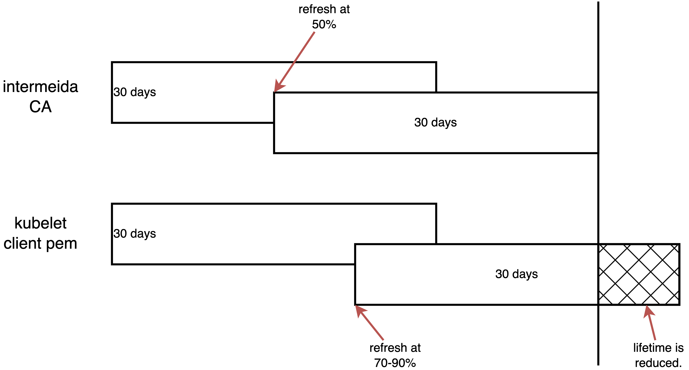

> [!NOTE]
> Work in progress
>
> with help of GenAI (gemini 2.5 pro)

# Kubelet Client Certificate Rotation Analysis

Customers frequently inquire about the `kubelet-client-current.pem` file, its rotation process, and timing. This document analyzes these aspects.

Here is a schematic diagram of the conclusion of this article.



# problem statement

For a new installed cluster, we can check the `kubelet-client-*.pem` file and the expiration time.

```bash

# select a master node
MASTER_NODE=$(oc get nodes -l node-role.kubernetes.io/master -o jsonpath='{.items[0].metadata.name}')

# list the pem files
oc debug node/${MASTER_NODE} -- chroot /host find /var/lib/kubelet/pki/ -name 'kubelet-client*.pem'
# /var/lib/kubelet/pki/kubelet-client-2025-07-08-22-39-29.pem
# /var/lib/kubelet/pki/kubelet-client-2025-07-10-07-31-58.pem
# /var/lib/kubelet/pki/kubelet-client-current.pem

# list all expiration date
oc debug node/${MASTER_NODE} -- chroot /host find /var/lib/kubelet/pki/ -name 'kubelet-client*.pem' -exec  openssl x509 -in {} -noout -dates \;
# notBefore=Jul  8 22:34:29 2025 GMT
# notAfter=Jul  9 22:29:59 2025 GMT
# notBefore=Jul 10 07:26:58 2025 GMT
# notAfter=Aug  9 07:26:58 2025 GMT
# notBefore=Jul 10 07:26:58 2025 GMT
# notAfter=Aug  9 07:26:58 2025 GMT
```

As observed, the first certificate file has a 1-day expiration, while the subsequent one is valid for almost 30 days.

However, in clusters that have been running for an extended period, the expiration dates of these certificate files can appear inconsistent. Below is an example list of `kubelet-client*.pem` expiration dates:

1. 1 days
2. 30 days
3. 24 days
4. 22 days
5. 22 days
6. 21 days

In the following sections, we will explain why these certificate expiration dates can vary.

# chain of certification

The `kubelet-client-current.pem` file is part of a certificate chain. We can use `openssl` to inspect and verify this chain. The following commands demonstrate how to identify and verify the certificates within the chain.

```bash

# get the root CA
oc get secret csr-signer-signer -n openshift-kube-controller-manager-operator -o jsonpath='{.data.tls\.crt}' | base64 --decode > root-for-csr-signer.crt

# get the intermediate CA
oc get secret csr-signer -n openshift-kube-controller-manager -o jsonpath='{.data.tls\.crt}' | base64 --decode > intermediate-ca.crt

# get the leaf CA (kubelet-client pem)
oc debug node/${WORKER_NODE} -- chroot /host cat /var/lib/kubelet/pki/kubelet-client-current.pem > kubelet-client.pem

# verify the chain
openssl verify -CAfile root-for-csr-signer.crt -untrusted intermediate-ca.crt kubelet-client.pem
# kubelet-client.pem: OK


# print root-for-csr-signer.crt intermediate-ca.crt kubelet-client.pem's issuer, subject, date

echo "--- root-for-csr-signer.crt ---"
openssl x509 -in root-for-csr-signer.crt -noout -issuer -subject -dates
# issuer=CN = openshift-kube-controller-manager-operator_csr-signer-signer@1752132658
# subject=CN = openshift-kube-controller-manager-operator_csr-signer-signer@1752132658
# notBefore=Jul 10 07:30:57 2025 GMT
# notAfter=Sep  8 07:30:58 2025 GMT

echo "--- intermediate-ca.crt ---"
openssl x509 -in intermediate-ca.crt -noout -issuer -subject -dates
# issuer=CN = openshift-kube-controller-manager-operator_csr-signer-signer@1752132658
# subject=CN = kube-csr-signer_@1752132658
# notBefore=Jul 10 07:30:57 2025 GMT
# notAfter=Aug  9 07:30:58 2025 GMT

echo "--- kubelet-client.pem ---"
openssl x509 -in kubelet-client.pem -noout -issuer -subject -dates
# issuer=CN = kube-csr-signer_@1752132658
# subject=O = system:nodes, CN = system:node:control-plane-cluster-fp5zr-1-1
# notBefore=Jul 10 07:26:58 2025 GMT
# notAfter=Aug  9 07:26:58 2025 GMT

```

# rotation logic

For the root ca `csr-signer-signer`, here is the core logic, [source code is here](https://github.com/openshift/cluster-kube-controller-manager-operator/blob/release-4.16/pkg/operator/certrotationcontroller/certrotationcontroller.go#L75):

```go
		certrotation.RotatedSigningCASecret{
			Namespace: operatorclient.OperatorNamespace,
			// this is not a typo, this is the signer of the signer
			Name: "csr-signer-signer",
			AdditionalAnnotations: certrotation.AdditionalAnnotations{
				JiraComponent: "kube-controller-manager",
			},
			Validity:               60 * rotationDay,
			Refresh:                30 * rotationDay,
			RefreshOnlyWhenExpired: refreshOnlyWhenExpired,
			Informer:               kubeInformersForNamespaces.InformersFor(operatorclient.OperatorNamespace).Core().V1().Secrets(),
			Lister:                 kubeInformersForNamespaces.InformersFor(operatorclient.OperatorNamespace).Core().V1().Secrets().Lister(),
			Client:                 secretsGetter,
			EventRecorder:          eventRecorder,
			UseSecretUpdateOnly:    true,
		},
```

We can see it has `60` days for validity and `30` days for refresh.

For the intermediate CA `csr-signer`, the core logic is defined here:

```go
		certrotation.RotatedSelfSignedCertKeySecret{
			Namespace: operatorclient.OperatorNamespace,
			Name:      "csr-signer",
			AdditionalAnnotations: certrotation.AdditionalAnnotations{
				JiraComponent: "kube-controller-manager",
			},
			Validity:               30 * rotationDay,
			Refresh:                15 * rotationDay,
			RefreshOnlyWhenExpired: refreshOnlyWhenExpired,
			CertCreator: &certrotation.SignerRotation{
				SignerName: "kube-csr-signer",
			},
```

We can see it has `30` days validity and `15` days refresh interval.

For the leaf certificate `kubelet-client.pem`, the situation is more complex. The initial logic determines the requested duration, as shown in the source code:

```yaml
  cluster-signing-duration:
  - "720h"
```

We can verify this parameter by running the following command:

```bash
MASTER_NODE=$(oc get nodes -l node-role.kubernetes.io/master -o jsonpath='{.items[0].metadata.name}')

oc debug node/${MASTER_NODE} -- chroot /host grep 'cluster-signing-duration' /etc/kubernetes/manifests/kube-controller-manager-pod.yaml

oc debug node/${MASTER_NODE} -- chroot /host cat  /etc/kubernetes/manifests/kube-controller-manager-pod.yaml | jq . | grep cluster-signing-duration
# ............. --cluster-signing-duration=720h ...................

```

As shown, when rotating a new `kubelet-client.pem`, kube-controller-manager attempts to allocate a `720` hour (30-day) period.

Another key aspect is timing. The Kubelet's internal logic triggers certificate rotation when the current `kubelet-client.pem` reaches `70-90%` of its `30-day` lifetime. This rotation is randomized to prevent all nodes from simultaneously burdening the Kube-API server in large clusters. The relevant source code is located here:

```go
// nextRotationDeadline returns a value for the threshold at which the
// current certificate should be rotated, 80%+/-10% of the expiration of the
// certificate.
func (m *manager) nextRotationDeadline() time.Time {
	// forceRotation is not protected by locks
	if m.forceRotation {
		m.forceRotation = false
		return m.now()
	}

	m.certAccessLock.RLock()
	defer m.certAccessLock.RUnlock()

	if !m.certSatisfiesTemplateLocked() {
		return m.now()
	}

	notAfter := m.cert.Leaf.NotAfter
	totalDuration := float64(notAfter.Sub(m.cert.Leaf.NotBefore))
	deadline := m.cert.Leaf.NotBefore.Add(jitteryDuration(totalDuration))

	m.logf("%s: Certificate expiration is %v, rotation deadline is %v", m.name, notAfter, deadline)
	return deadline
}

// jitteryDuration uses some jitter to set the rotation threshold so each node
// will rotate at approximately 70-90% of the total lifetime of the
// certificate.  With jitter, if a number of nodes are added to a cluster at
// approximately the same time (such as cluster creation time), they won't all
// try to rotate certificates at the same time for the rest of the life of the
// cluster.
//
// This function is represented as a variable to allow replacement during testing.
var jitteryDuration = func(totalDuration float64) time.Duration {
	return wait.Jitter(time.Duration(totalDuration), 0.2) - time.Duration(totalDuration*0.3)
}

```

# summary everything up

The intermediate CA has a 30-day lifetime and refreshes every 15 days. When Kubelet requests rotation of `kubelet-client.pem` at `70-90%` of its 30-day lifetime, the intermediate CA may not have sufficient remaining validity to issue a new `kubelet-client.pem` for the full 30-day period. In such cases, it will issue a certificate valid only until the intermediate CA's own `notAfter` time.


# end

```bash

# 随机选择一个控制平面节点
MASTER_NODE=$(oc get nodes -l node-role.kubernetes.io/master -o jsonpath='{.items[0].metadata.name}')

# 进入该节点的调试模式，并检查 kube-controller-manager 的静态 Pod 清单
oc debug node/${MASTER_NODE} -- chroot /host grep 'cluster-signing-duration' /etc/kubernetes/manifests/kube-controller-manager-pod.yaml

oc debug node/${MASTER_NODE} -- chroot /host cat  /etc/kubernetes/manifests/kube-controller-manager-pod.yaml | jq . | grep cluster-signing-duration
# ............. --cluster-signing-duration=720h ...................

oc debug node/${MASTER_NODE} -- chroot /host find /var/lib/kubelet/pki/ -name 'kubelet-client*.pem' -exec  openssl x509 -in {} -noout -dates \;
notBefore=Jul  8 22:34:29 2025 GMT
notAfter=Jul  9 22:29:59 2025 GMT
notBefore=Jul 10 07:26:58 2025 GMT
notAfter=Aug  9 07:26:58 2025 GMT
notBefore=Jul 10 07:26:58 2025 GMT
notAfter=Aug  9 07:26:58 2025 GMT

oc debug node/${MASTER_NODE} -- chroot /host find /var/lib/kubelet/pki/ -name 'kubelet-server*.pem' -exec  openssl x509 -in {} -noout -dates \;
notBefore=Jul  8 22:34:41 2025 GMT
notAfter=Jul  9 22:29:59 2025 GMT
notBefore=Jul 10 07:28:02 2025 GMT
notAfter=Aug  9 07:28:02 2025 GMT
notBefore=Jul 10 07:28:02 2025 GMT
notAfter=Aug  9 07:28:02 2025 GMT

oc get csr
NAME        AGE   SIGNERNAME                            REQUESTOR                                     REQUESTEDDURATION   CONDITION
csr-7d5lr   30m   kubernetes.io/kube-apiserver-client   system:node:control-plane-cluster-fp5zr-1-1   24h                 Approved,Issued
csr-tdxdw   29m   kubernetes.io/kube-apiserver-client   system:node:control-plane-cluster-fp5zr-1-1   24h                 Approved,Issued

oc get csr -o jsonpath='{.items[0].status.certificate}' | base64 --decode | openssl x509  -noout -dates
notBefore=Jul 12 08:42:59 2025 GMT
notAfter=Jul 13 08:42:59 2025 GMT

WORKER_NODE=$(oc get nodes -l node-role.kubernetes.io/worker -o jsonpath='{.items[0].metadata.name}')
oc debug node/${WORKER_NODE} -- chroot /host openssl x509 -in /var/lib/kubelet/pki/kubelet-client-current.pem -noout -dates
notBefore=Jul 10 07:26:58 2025 GMT
notAfter=Aug  9 07:26:58 2025 GMT


oc get secret csr-signer -n openshift-kube-controller-manager -o jsonpath='{.data.tls\.crt}' | base64 --decode | openssl x509 -noout -dates
notBefore=Jul 10 07:30:57 2025 GMT
notAfter=Aug  9 07:30:58 2025 GMT

oc get secret kube-apiserver-to-kubelet-signer -n openshift-kube-apiserver-operator -o jsonpath='{.data.tls\.crt}' | base64 --decode | openssl x509 -noout -dates
notBefore=Jul  8 22:29:59 2025 GMT
notAfter=Jul  8 22:29:59 2026 GMT


# Replace <worker-node-name> with one of your actual worker nodes

oc debug node/${WORKER_NODE} -- chroot /host openssl x509 -in /var/lib/kubelet/pki/kubelet-client-current.pem -noout -issuer
# issuer=CN = kube-csr-signer_@1752132658


oc get secret csr-signer -n openshift-kube-controller-manager -o jsonpath='{.data.tls\.crt}' | base64 --decode | openssl x509 -noout -subject
# subject=CN = kube-csr-signer_@1752132658


# 提取集群的根CA证书
oc get configmap kube-root-ca.crt -n openshift-config-managed -o jsonpath='{.data.ca\.crt}' > cluster-root-ca.crt

oc get secret csr-signer -n openshift-kube-controller-manager -o jsonpath='{.data.tls\.crt}' | base64 --decode > csr-signer-ca.crt

# 将中间CA和根CA合并成一个证书包文件
cat csr-signer-ca.crt cluster-root-ca.crt > full-ca-bundle.crt

# Replace <worker-node-name> with the same worker node as before
oc debug node/${WORKER_NODE} -- chroot /host cat /var/lib/kubelet/pki/kubelet-client-current.pem > kubelet-client.pem


openssl verify -CAfile full-ca-bundle.crt kubelet-client.pem
# CN = kube-csr-signer_@1752132658
# error 2 at 1 depth lookup: unable to get issuer certificate
# error kubelet-client.pem: verification failed

openssl verify -untrusted csr-signer-ca.crt -CAfile csr-signer-ca.crt kubelet-client.pem
# CN = kube-csr-signer_@1752132658
# error 2 at 1 depth lookup: unable to get issuer certificate
# error kubelet-client.pem: verification failed

# 1. 提取可能包含完整链的证书包
oc get secret csr-signer -n openshift-kube-controller-manager -o jsonpath='{.data.tls\.crt}' | base64 --decode > csr-signer-bundle.crt

# 2. 将证书包拆分成独立的文件 (cert1.pem, cert2.pem,...)
awk 'split_after==1{n++;split_after=0} /-----END CERTIFICATE-----/{split_after=1} {print > "cert" n ".pem"}' < csr-signer-bundle.crt


oc get secret csr-signer -n openshift-kube-controller-manager -o jsonpath='{.data.tls\.crt}' | base64 --decode | openssl x509 -noout -subject -issuer
# subject=CN = kube-csr-signer_@1752132658
# issuer=CN = openshift-kube-controller-manager-operator_csr-signer-signer@1752132658


# 提取“签名者的签名者”的证书，我们称之为“根”
oc get secret csr-signer-signer -n openshift-kube-controller-manager-operator -o jsonpath='{.data.tls\.crt}' | base64 --decode > root-for-csr-signer.crt

# 提取中间CA
oc get secret csr-signer -n openshift-kube-controller-manager -o jsonpath='{.data.tls\.crt}' | base64 --decode > intermediate-ca.crt

# 提取叶子证书
oc debug node/${WORKER_NODE} -- chroot /host cat /var/lib/kubelet/pki/kubelet-client-current.pem > kubelet-client.pem


openssl verify -CAfile root-for-csr-signer.crt -untrusted intermediate-ca.crt kubelet-client.pem
# kubelet-client.pem: OK


# print root-for-csr-signer.crt intermediate-ca.crt kubelet-client.pem's issuer, subject, date

echo "--- root-for-csr-signer.crt ---"
openssl x509 -in root-for-csr-signer.crt -noout -issuer -subject -dates
# issuer=CN = openshift-kube-controller-manager-operator_csr-signer-signer@1752132658
# subject=CN = openshift-kube-controller-manager-operator_csr-signer-signer@1752132658
# notBefore=Jul 10 07:30:57 2025 GMT
# notAfter=Sep  8 07:30:58 2025 GMT

echo "--- intermediate-ca.crt ---"
openssl x509 -in intermediate-ca.crt -noout -issuer -subject -dates
# issuer=CN = openshift-kube-controller-manager-operator_csr-signer-signer@1752132658
# subject=CN = kube-csr-signer_@1752132658
# notBefore=Jul 10 07:30:57 2025 GMT
# notAfter=Aug  9 07:30:58 2025 GMT

echo "--- kubelet-client.pem ---"
openssl x509 -in kubelet-client.pem -noout -issuer -subject -dates
# issuer=CN = kube-csr-signer_@1752132658
# subject=O = system:nodes, CN = system:node:control-plane-cluster-fp5zr-1-1
# notBefore=Jul 10 07:26:58 2025 GMT
# notAfter=Aug  9 07:26:58 2025 GMT


```