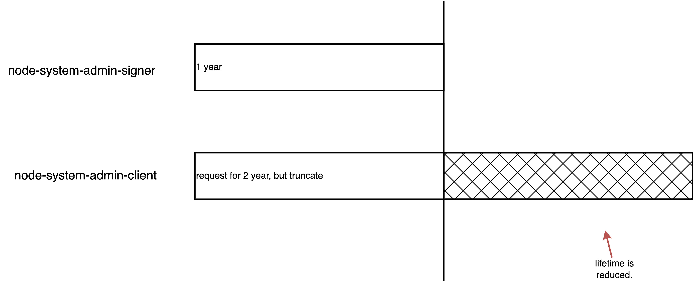
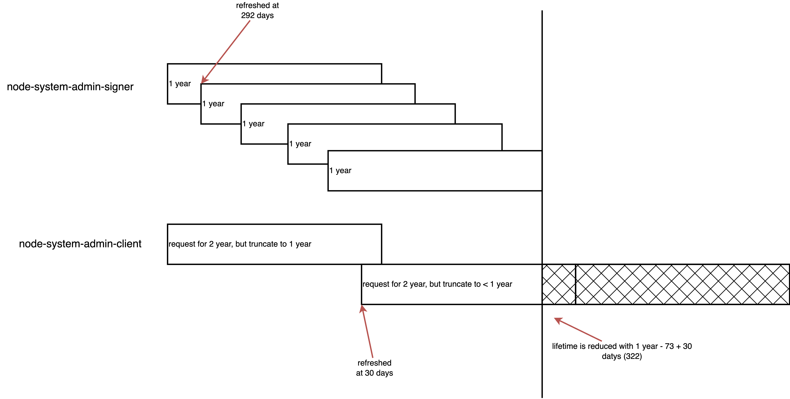

> [!NOTE]
> Work in progress
>
> with the help of Gemini pro 2.5
# cert analyze for node-system-admin-client

For the fresh installed ocp cluster:



For the existing ocp cluster:



Customer checks the internal certs `node-system-admin-client`, this cert is used for user `system:admin`, which has `cluster-admin` role.

As we can see from the below output, the cert will expire in one year.

```bash
oc get secret -n openshift-kube-apiserver-operator node-system-admin-client -o jsonpath='{.data.tls\.crt}' | base64 --decode | openssl x509 -noout -issuer -subject -dates
# issuer=CN=openshift-kube-apiserver-operator_node-system-admin-signer@1752634724
# subject=O=system:masters, CN=system:admin
# notBefore=Jul 16 02:58:51 2025 GMT
# notAfter=Jul 16 02:58:44 2026 GMT


oc get secret -n openshift-kube-apiserver-operator node-system-admin-signer -o jsonpath='{.data.tls\.crt}' | base64 --decode | openssl x509 -noout -issuer -subject -dates
# issuer=CN=openshift-kube-apiserver-operator_node-system-admin-signer@1752634724
# subject=CN=openshift-kube-apiserver-operator_node-system-admin-signer@1752634724
# notBefore=Jul 16 02:58:43 2025 GMT
# notAfter=Jul 16 02:58:44 2026 GMT

# verify the certification chain
oc get secret -n openshift-kube-apiserver-operator node-system-admin-client -o jsonpath='{.data.tls\.crt}' | base64 --decode > client.crt

oc get secret -n openshift-kube-apiserver-operator node-system-admin-signer -o jsonpath='{.data.tls\.crt}' | base64 --decode > root-for-csr-signer.crt

openssl verify -CAfile root-for-csr-signer.crt client.crt
# client.crt: OK

```

But based on the source code, it should have 2 years of validity. Let's check the [source code](https://github.com/openshift/cluster-kube-apiserver-operator/blob/release-4.16/pkg/operator/certrotationcontroller/certrotationcontroller.go#L814).

```go
		certrotation.RotatedSelfSignedCertKeySecret{
			Namespace: operatorclient.OperatorNamespace,
			Name:      "node-system-admin-client",
			AdditionalAnnotations: certrotation.AdditionalAnnotations{
				JiraComponent: "kube-apiserver",
			},
			// This needs to live longer then control plane certs so there is high chance that if a cluster breaks
			// because of expired certs these are still valid to use for collecting data using localhost-recovery
			// endpoint with long lived serving certs for localhost.
			Validity: 2 * 365 * defaultRotationDay,
			// We rotate sooner so certs are always valid for 90 days (30 days more then kube-control-plane-signer)
			Refresh:                30 * defaultRotationDay,
			RefreshOnlyWhenExpired: refreshOnlyWhenExpired,
			CertCreator: &certrotation.ClientRotation{
				UserInfo: &user.DefaultInfo{
					Name:   "system:admin",
					Groups: []string{"system:masters"},
				},
			},
			Informer:      kubeInformersForNamespaces.InformersFor(operatorclient.OperatorNamespace).Core().V1().Secrets(),
			Lister:        kubeInformersForNamespaces.InformersFor(operatorclient.OperatorNamespace).Core().V1().Secrets().Lister(),
			Client:        kubeClient.CoreV1(),
			EventRecorder: eventRecorder,

			// we will remove this when we migrate all of the affected secret
			// objects to their intended type: https://issues.redhat.com/browse/API-1800
			UseSecretUpdateOnly: true,
		},
```

The answer is clear, the root CA (signer) has 1 year expiration time. So the issued cert `node-system-admin-client` can not be longer than that.

And the root CA (signer) has 1 year expiration time, and will be refreshed at `80%` of lifetime. Here are [source code](https://github.com/openshift/cluster-kube-apiserver-operator/blob/release-4.16/pkg/operator/certrotationcontroller/certrotationcontroller.go#L783).

```go
		certrotation.RotatedSigningCASecret{
			Namespace: operatorclient.OperatorNamespace,
			Name:      "node-system-admin-signer",
			AdditionalAnnotations: certrotation.AdditionalAnnotations{
				JiraComponent: "kube-apiserver",
			},
			Validity: 1 * 365 * defaultRotationDay,
			// Refresh set to 80% of the validity.
			// This range is consistent with most other signers defined in this pkg.
			Refresh:                292 * defaultRotationDay,
			RefreshOnlyWhenExpired: refreshOnlyWhenExpired,
			Informer:               kubeInformersForNamespaces.InformersFor(operatorclient.OperatorNamespace).Core().V1().Secrets(),
			Lister:                 kubeInformersForNamespaces.InformersFor(operatorclient.OperatorNamespace).Core().V1().Secrets().Lister(),
			Client:                 kubeClient.CoreV1(),
			EventRecorder:          eventRecorder,

			// we will remove this when we migrate all of the affected secret
			// objects to their intended type: https://issues.redhat.com/browse/API-1800
			UseSecretUpdateOnly: true,
		},
```

# simulate rotation

We will simualte the key/cert rotation, we can see after delete the signer, the client cert does not autorenew. But the cert chain failed. Do not worry about the failed, the real rotation process will care about the cert chain, and will store the old cert public key into CA bundle, to avoid the cert chain failure.

Get Signer CA Details:

```bash
# Get creation timestamp
oc get secret node-system-admin-signer -n openshift-kube-apiserver-operator -o=jsonpath='{.metadata.creationTimestamp}{"\n"}'
# 2025-07-08T22:40:46Z

# Get serial number and subject
oc get secret node-system-admin-signer -n openshift-kube-apiserver-operator -o=jsonpath='{.data.tls\.crt}' | base64 -d | openssl x509 -noout -serial -issuer -subject -dates
# serial=038106BD877BDCBE
# issuer=CN = openshift-kube-apiserver-operator_node-system-admin-signer@1752014437
# subject=CN = openshift-kube-apiserver-operator_node-system-admin-signer@1752014437
# notBefore=Jul  8 22:40:37 2025 GMT
# notAfter=Jul  8 22:40:38 2026 GMT
```

Get Leaf Certificate Details:

```bash
# Get creation timestamp
oc get secret node-system-admin-client -n openshift-kube-apiserver-operator -o=jsonpath='{.metadata.creationTimestamp}{"\n"}'
# 2025-07-08T22:40:53Z

# Get serial number and issuer
oc get secret node-system-admin-client -n openshift-kube-apiserver-operator -o=jsonpath='{.data.tls\.crt}' | base64 -d | openssl x509 -noout -serial -issuer -subject -dates
# serial=023EE1F3311AF1D5
# issuer=CN = openshift-kube-apiserver-operator_node-system-admin-signer@1752014437
# subject=O = system:masters, CN = system:admin
# notBefore=Jul  8 22:40:50 2025 GMT
# notAfter=Jul  8 22:40:38 2026 GMT
```

Manually Rotate the Signer CA

```bash
oc delete secret node-system-admin-signer -n openshift-kube-apiserver-operator
```

Get Signer CA Details: (**IT IS UPDATED**)

```bash
# Get creation timestamp
oc get secret node-system-admin-signer -n openshift-kube-apiserver-operator -o=jsonpath='{.metadata.creationTimestamp}{"\n"}'
# 2025-07-17T06:30:49Z

# Get serial number and subject
oc get secret node-system-admin-signer -n openshift-kube-apiserver-operator -o=jsonpath='{.data.tls\.crt}' | base64 -d | openssl x509 -noout -serial -issuer -subject -dates
# serial=31A8CCE1005C0642
# issuer=CN = openshift-kube-apiserver-operator_node-system-admin-signer@1752733849
# subject=CN = openshift-kube-apiserver-operator_node-system-admin-signer@1752733849
# notBefore=Jul 17 06:30:48 2025 GMT
# notAfter=Jul 17 06:30:49 2026 GMT
```

Get Leaf Certificate Details: (**IT IS NOT UPDATED**).

```bash
# Get creation timestamp
oc get secret node-system-admin-client -n openshift-kube-apiserver-operator -o=jsonpath='{.metadata.creationTimestamp}{"\n"}'
# 2025-07-08T22:40:53Z

# Get serial number and issuer
oc get secret node-system-admin-client -n openshift-kube-apiserver-operator -o=jsonpath='{.data.tls\.crt}' | base64 -d | openssl x509 -noout -serial -issuer -subject -dates
# serial=023EE1F3311AF1D5
# issuer=CN = openshift-kube-apiserver-operator_node-system-admin-signer@1752014437
# subject=O = system:masters, CN = system:admin
# notBefore=Jul  8 22:40:50 2025 GMT
# notAfter=Jul  8 22:40:38 2026 GMT
```

State Verification

```bash
# Extract the new CA certificate
oc get secret node-system-admin-signer -n openshift-kube-apiserver-operator -o=jsonpath='{.data.tls\.crt}' | base64 -d > new-ca.crt

# Extract the new leaf certificate
oc get secret node-system-admin-client -n openshift-kube-apiserver-operator -o=jsonpath='{.data.tls\.crt}' | base64 -d > new-leaf.crt

# Verify the chain
openssl verify -CAfile new-ca.crt new-leaf.crt
# O = system:masters, CN = system:admin
# error 20 at 0 depth lookup: unable to get local issuer certificate
# error new-leaf.crt: verification failed
```

Forcing the Leaf Certificate Update

```bash
oc patch secret node-system-admin-client -n openshift-kube-apiserver-operator -p='{"metadata": {"annotations": {"auth.openshift.io/certificate-not-after": null}}}'

# Get creation timestamp
oc get secret node-system-admin-client -n openshift-kube-apiserver-operator -o=jsonpath='{.metadata.creationTimestamp}{"\n"}'
# 2025-07-08T22:40:53Z

# Get serial number and issuer
oc get secret node-system-admin-client -n openshift-kube-apiserver-operator -o=jsonpath='{.data.tls\.crt}' | base64 -d | openssl x509 -noout -serial -issuer -subject -dates
# serial=028AC59829CF3F15
# issuer=CN = openshift-kube-apiserver-operator_node-system-admin-signer@1752733849
# subject=O = system:masters, CN = system:admin
# notBefore=Jul 17 06:52:17 2025 GMT
# notAfter=Jul 17 06:30:49 2026 GMT

oc get secret node-system-admin-signer -n openshift-kube-apiserver-operator -o=jsonpath='{.data.tls\.crt}' | base64 -d > new-ca.crt

# Extract the new leaf certificate
oc get secret node-system-admin-client -n openshift-kube-apiserver-operator -o=jsonpath='{.data.tls\.crt}' | base64 -d > new-leaf.crt

# Verify the chain
openssl verify -CAfile new-ca.crt new-leaf.crt
# new-leaf.crt: OK
```

# following up

It turn out to be an openshift bug and got fixed.
- https://redhat-internal.slack.com/archives/CGJAM135J/p1752829278533109?thread_ts=1752657543.150449&cid=CGJAM135J
- https://issues.redhat.com/browse/OCPBUGS-59527

# end