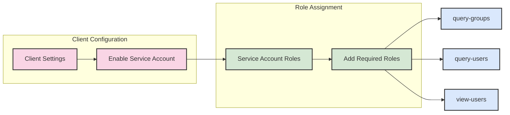

```mermaid
flowchart LR
    A[Client Settings] --> B[Enable Service Account]
    B --> C[Service Account Roles]
    C --> D[Add Required Roles]
    
    subgraph "Client Configuration"
        A
        B
    end
    
    subgraph "Role Assignment"
        C
        D
    end
    
    D --> E[query-groups]
    D --> F[query-users]
    D --> G[view-users]
    
    style A fill:#f9d5e5,stroke:#333,stroke-width:2px
    style B fill:#f9d5e5,stroke:#333,stroke-width:2px
    style C fill:#d5e8d4,stroke:#333,stroke-width:2px
    style D fill:#d5e8d4,stroke:#333,stroke-width:2px
    style E fill:#dae8fc,stroke:#333,stroke-width:2px
    style F fill:#dae8fc,stroke:#333,stroke-width:2px
    style G fill:#dae8fc,stroke:#333,stroke-width:2px
```
