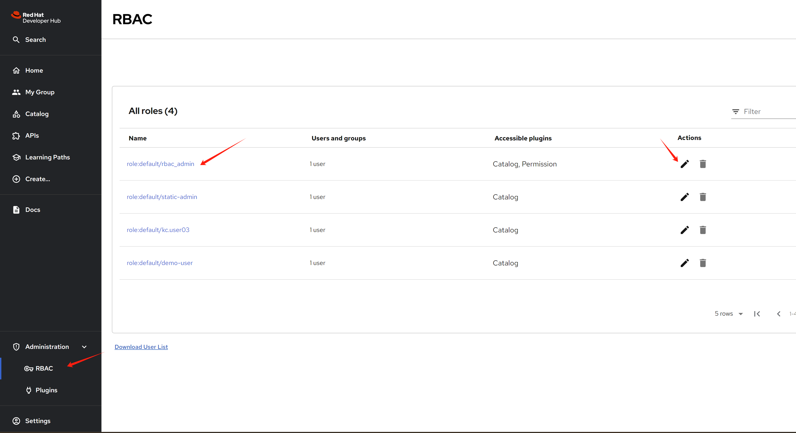
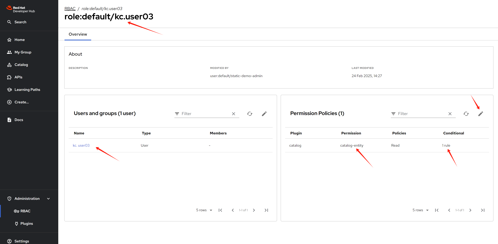

<!-- _class: title -->

<style scoped>
section {
  display: flex;
  flex-direction: column;
  justify-content: center;
  align-items: center;
  height: 100%;
  text-align: center;
}
ul {
  font-size: 0.8em;
  text-align: left;
  margin: 0 auto;
  width: fit-content;
}
</style>

# RHDH 1.4 with Conditional Policy Permission


- Red Hat Developer Hub (RHDH) 1.4 introduces GUI for permission management
- Supports conditional policy for fine-grained access control
- Current implementation has some bugs that require workarounds
- This presentation demonstrates how it works and provides solutions

---

# Overview

1. Install RHSSO/Keycloak as OAuth2 provider
2. Configure users and groups in Keycloak
3. Install RHDH 1.4
4. Configure RHDH with Keycloak integration
5. Set up conditional policies
6. Test with different user permissions

---

# Install RHSSO/Keycloak


- Deploy PostgreSQL database for Keycloak
- Configure TLS for secure access
- Deploy Keycloak using Kubernetes operator

---

# Keycloak Configuration - Key Steps

```bash
# Create PVC for PostgreSQL
oc create -f keycloak-db-pvc.yaml -n demo-keycloak

# Deploy PostgreSQL database
oc create -f keycloak-db.yaml -n demo-keycloak

# Create TLS certificate
openssl req -subj "/CN=$RHSSO_HOST/O=Test Keycloak./C=US" \
  -newkey rsa:2048 -nodes -keyout key.pem -x509 -days 365 -out certificate.pem

# Create Keycloak instance
oc create -f keycloak.yaml -n demo-keycloak
```

---

# Keycloak Realm Setup

1. Create a realm named `RHDH`
2. Create test users (e.g., `demo-user`)
3. Set non-expiring passwords
4. Create client for RHDH integration


---

# Keycloak Client Configuration

- Set client ID (e.g., `rhdh-client`)
- Configure redirect URL: `https://<RHDH_URL>/api/auth/oidc/handler/frame`
- Set access type to confidential
- Enable service accounts
- Copy client secret for RHDH configuration


---

# Service Account Roles

For user/group synchronization, add these roles:
- query-groups
- query-users
- view-users


---

# Install RHDH 1.4

- Create a new namespace for RHDH
- Install using Helm chart (alternative: operator)

```bash
oc new-project demo-rhdh
```


---

# Configure RHDH - Preparation

1. Create service account for Kubernetes access
2. Create PVC for RHDH plugins
3. Generate service account token
4. Set up environment variables

```bash
# Create service account with appropriate permissions
oc create -f sa-rhdh.yaml -n $NAMESPACES

# Create PVC for plugins
oc apply -f pvc-rhdh.yaml -n $NAMESPACES

# Generate long-lived token
SA_TOKEN=`oc create token backstage-read-only-sa --duration=876000h -n $NAMESPACES`
```

---

# RHDH Configuration - App Config

Key configuration elements:
- Authentication providers (Keycloak OIDC)
- Catalog sources
- Kubernetes integration
- Permission settings

```yaml
auth:
  environment: development
  providers:
    oidc:
      development:
        clientId: ${AUTH_KEYCLOAK_CLIENT_ID}
        clientSecret: ${AUTH_KEYCLOAK_CLIENT_SECRET}
        metadataUrl: ${KEYCLOAK_BASE_URL}/realms/${KEYCLOAK_REALM}/.well-known/openid-configuration
```

---

# RHDH Configuration - Permissions

Enable RBAC and plugin permissions:

```yaml
permission:
  enabled: true
  rbac:
    admin:
      users:
        - name: user:default/static-demo-admin
    pluginsWithPermission:
      - catalog
      - scaffolder
      - permission
      - topology
      - kubernetes
```

---

# RHDH Configuration - Keycloak Integration

Configure Keycloak as identity provider:

```yaml
catalog:
  providers:
    keycloakOrg:
      default:
        baseUrl: ${KEYCLOAK_BASE_URL}
        loginRealm: ${KEYCLOAK_REALM}
        realm: ${KEYCLOAK_REALM}
        clientId: ${AUTH_KEYCLOAK_CLIENT_ID}
        clientSecret: ${AUTH_KEYCLOAK_CLIENT_SECRET}
        schedule:
          frequency: { minutes: 1 }
          timeout: { minutes: 1 }
          initialDelay: { seconds: 15 }
```

---

# Helm Configuration

Update Helm chart with:
- Extra app configuration
- Environment variables from secrets
- Dynamic plugins

```yaml
upstream:
  backstage:
    extraAppConfig:
      - configMapRef: app-config-rhdh
        filename: app-config-rhdh.yaml
    extraEnvVarsSecrets:
      - wzh-rhdh-credentials
```

---

# User and Group Requirements

**Important Workaround**: RHDH 1.4 has bugs where conditional policy doesn't work if users don't belong to groups.

Solution:
- Create multiple test users
- Assign users to appropriate groups
- Test with different permission scenarios


---

# Login Options

After configuration, RHDH provides multiple login options:
- Guest login (for admin/troubleshooting)
- OIDC login (normal user access)


---

# Conditional Policy - Built-in Policies

RHDH comes with built-in policies that cannot be edited:




---

# Creating Custom Policies

Custom policies include:
- Name and description
- User/group assignments
- Permission settings
- Conditional rules



---

# Permission Configuration

Configure which resources users can access:


---

# Conditional Rules

Define conditions for resource access:


---

# Permission Workflow Diagram


RHDH conditional permission workflow:

- User Authentication: Verifies user identity and group membership
- Permission Policy Engine: Evaluates user's operation request
- Condition Assessment: Checks if target resources meet defined conditions
- Access Control: Access granted only when all conditions are satisfied

---

# Service Account Setup


A Keycloak Service Account is essential for RHDH to interact with Keycloak:

- Configure a dedicated client in Keycloak with service account capability
- Enable "Service Account Enabled" option in client settings
- Assign appropriate client roles to access user and group information
- Configure client authentication with client ID and secret credentials

---

# RHDH Configuration Process

<style>
.current-page p, .current-page li {
  font-size: 14px; /* 约等于10pt字体 */
}
</style>

<div class="current-page">



1. **Set up environment variables** - Define all necessary parameters for your RHDH deployment including cluster details, authentication credentials, and service endpoints

2. **Create Kubernetes secrets** - Store sensitive information securely using Kubernetes secrets

3. **Configure app-config YAML** - Define the core RHDH configuration including:
   - Authentication settings
   - Plugin enablement
   - Catalog sources
   - Permission settings

4. **Apply Helm chart configuration** - Complete the setup by:
   - Referencing your custom ConfigMaps
   - Configuring dynamic plugins
   - Setting environment variables from secrets
   - Applying any additional runtime parameters

5. **Deploy and test** - Deploy the updated configuration and verify functionality

</div>

---

# Conditional Policy Workflow


1. **Policy Creation** - Administrators define policies with specific conditions
2. **User Authentication** - Users log in through configured identity providers
3. **Permission Evaluation** - The system evaluates user permissions based on their identity and group memberships
4. **Conditional Filtering** - Resources are filtered according to policy conditions
5. **Resource Access** - Users can only access resources permitted by policies that match their context


---

# Results

- Users see only resources they have permission to access
- Permissions can be based on:
  - User identity
  - Group membership
  - Resource attributes
  - Custom conditions

---

# Summary

- RHDH 1.4 provides GUI-based permission management
- Keycloak integration enables robust identity management
- Conditional policies allow fine-grained access control
- Current bugs require workarounds (users must belong to groups)
- Proper configuration enables role-based access to developer resources

---

# Thank You!

Questions?
