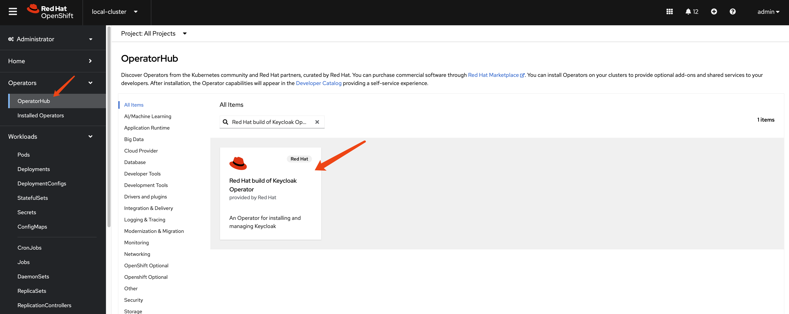
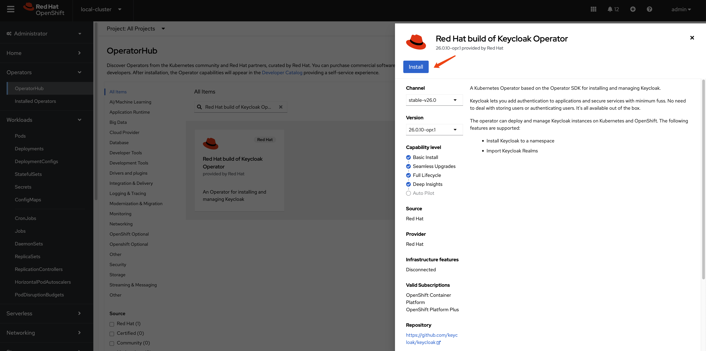
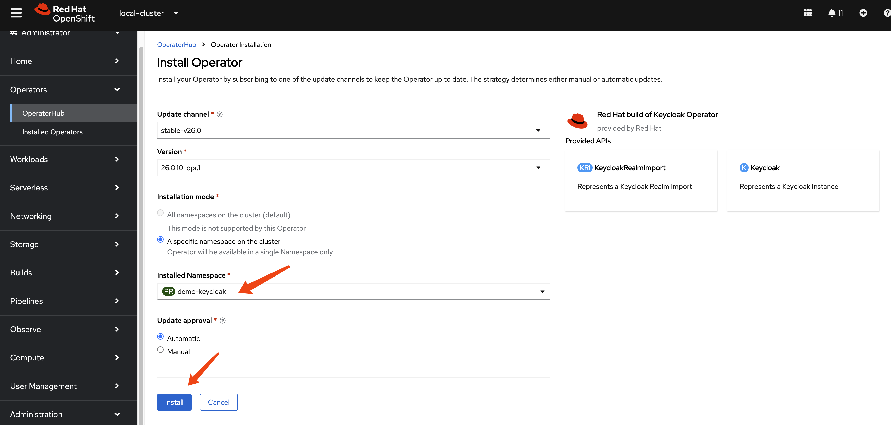
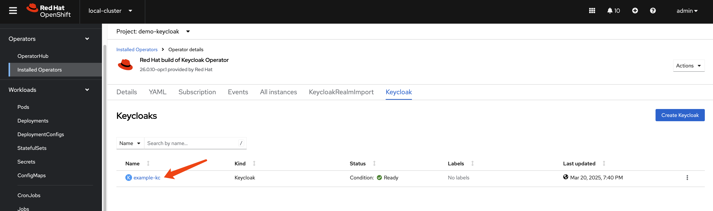

> [!WARNING]
> Working in progress
# RedHat Keycloak-26 Performance Test

We want to test the performance of Red Hat Keycloak 26 on a specific requirements and configurations:

1. 45 nodes
2. 50k users in total
3. 100 db connections per node

# install keycloak operator

Create a namespace for Keycloak:
```bash
oc new-project demo-keycloak
```







# create a keycloak instance with basic settings

To create a Keycloak instance with basic settings, first you need to create a backend DB. Then, you can create the Keycloak instance based on this DB.

```bash

oc delete -f ${BASE_DIR}/data/install/keycloak-db-pvc.yaml -n demo-keycloak

cat << EOF > ${BASE_DIR}/data/install/keycloak-db-pvc.yaml
apiVersion: v1
kind: PersistentVolumeClaim
metadata:
  name: postgresql-db-pvc
spec:
  accessModes:
    - ReadWriteOnce
  resources:
    requests:
      storage: 1Gi
EOF

oc create -f ${BASE_DIR}/data/install/keycloak-db-pvc.yaml -n demo-keycloak


oc delete -f ${BASE_DIR}/data/install/keycloak-db.yaml -n demo-keycloak

cat << EOF > ${BASE_DIR}/data/install/keycloak-db.yaml
---
apiVersion: apps/v1
kind: StatefulSet
metadata:
  name: postgresql-db
spec:
  serviceName: postgresql-db-service
  selector:
    matchLabels:
      app: postgresql-db
  replicas: 1
  template:
    metadata:
      labels:
        app: postgresql-db
    spec:
      containers:
        - name: postgresql-db
          image: postgres:15
          args: ["-c", "max_connections=1000"]
          volumeMounts:
            - mountPath: /data
              name: cache-volume
          env:
            - name: POSTGRES_USER
              value: testuser
            - name: POSTGRES_PASSWORD
              value: testpassword
            - name: PGDATA
              value: /data/pgdata
            - name: POSTGRES_DB
              value: keycloak
      volumes:
        - name: cache-volume
          persistentVolumeClaim:
            claimName: postgresql-db-pvc
---
apiVersion: v1
kind: Service
metadata:
  name: postgres-db
spec:
  selector:
    app: postgresql-db
  type: LoadBalancer
  ports:
  - port: 5432
    targetPort: 5432

EOF

oc create -f ${BASE_DIR}/data/install/keycloak-db.yaml -n demo-keycloak

```

Now, we have a Keycloak database running in our OpenShift cluster. Next, we need to configure Keycloak to use this database.

```bash

# create secret needed by keycloak
# the host name here, we use '*' to limit the length of the hostname in the certificate
RHSSO_HOST="*.apps.cluster-r9m7r.r9m7r.sandbox2453.opentlc.com"

cd ${BASE_DIR}/data/install/

openssl req -subj "/CN=$RHSSO_HOST/O=Test Keycloak./C=US" -newkey rsa:2048 -nodes -keyout key.pem -x509 -days 365 -out certificate.pem

oc delete secret example-tls-secret -n demo-keycloak
oc create secret tls example-tls-secret --cert certificate.pem --key key.pem -n demo-keycloak


oc delete secret keycloak-db-secret -n demo-keycloak
oc create secret generic keycloak-db-secret -n demo-keycloak \
  --from-literal=username=testuser \
  --from-literal=password=testpassword


# here we create keycloak instance with postgres db and tls secret
# here we change back the host name to actual hostname
oc delete -f ${BASE_DIR}/data/install/keycloak.yaml -n demo-keycloak

RHSSO_HOST="example-kc-demo-keycloak.apps.cluster-r9m7r.r9m7r.sandbox2453.opentlc.com"

cat << EOF > ${BASE_DIR}/data/install/keycloak.yaml
apiVersion: k8s.keycloak.org/v2alpha1
kind: Keycloak
metadata:
  name: example-kc
spec:
  instances: 1
  db:
    vendor: postgres
    host: postgres-db
    usernameSecret:
      name: keycloak-db-secret
      key: username
    passwordSecret:
      name: keycloak-db-secret
      key: password
  http:
    tlsSecret: example-tls-secret
  # ingress:
  #   className: openshift-default
  hostname:
    hostname: $RHSSO_HOST
    httpEnabled: true
  proxy:
    headers: xforwarded
EOF

oc create -f ${BASE_DIR}/data/install/keycloak.yaml -n demo-keycloak

# get the keycloak initial admin user and password
oc get secret example-kc-initial-admin -n demo-keycloak -o jsonpath='{.data.username}' | base64 --decode && echo
# temp-admin

oc get secret example-kc-initial-admin -n demo-keycloak -o jsonpath='{.data.password}' | base64 --decode && echo
# 070e14a1bc504496a64e10aa2a514bde


# in postgresql pod terminal
# we can see the current value of max_connections is 1000. We can change it to a higher value if needed.
psql -U testuser -d keycloak
# Type "help" for help.

# keycloak=# SHOW max_connections;
#  max_connections 
# -----------------
#  1000
# (1 row)
```

# get current keycloak config

Let us check the config of keycloak instance from web console.



```yaml
apiVersion: k8s.keycloak.org/v2alpha1
kind: Keycloak
metadata:
  name: example-kc
  namespace: demo-keycloak
spec:
  db:
    host: postgres-db
    passwordSecret:
      key: password
      name: keycloak-db-secret
    usernameSecret:
      key: username
      name: keycloak-db-secret
    vendor: postgres
  hostname:
    hostname: example-kc-demo-keycloak.apps.cluster-r9m7r.r9m7r.sandbox2453.opentlc.com
  http:
    tlsSecret: example-tls-secret
    httpEnabled: true
  instances: 1
  proxy:
    headers: xforwarded
```

Next, we will check the contents of the `/opt/keycloak/conf` directory inside the `example-kc-0` pod in the `demo-keycloak` namespace. This will help us learn more about how the Keycloak server is configured.

```bash

oc exec -it example-kc-0 -n demo-keycloak -- ls /opt/keycloak/conf
# cache-ispn.xml  keycloak.conf  README.md  truststores

# oc exec -it example-kc-0 -n demo-keycloak -- ls -R /opt/keycloak

oc exec -it example-kc-0 -n demo-keycloak -- cat /opt/keycloak/conf/keycloak.conf
```

content of `/opt/keycloak/conf/keycloak.conf`

```conf
# Basic settings for running in production. Change accordingly before deploying the server.

# Database

# The database vendor.
#db=postgres

# The username of the database user.
#db-username=keycloak

# The password of the database user.
#db-password=password

# The full database JDBC URL. If not provided, a default URL is set based on the selected database vendor.
#db-url=jdbc:postgresql://localhost/keycloak

# Observability

# If the server should expose healthcheck endpoints.
#health-enabled=true

# If the server should expose metrics endpoints.
#metrics-enabled=true

# HTTP

# The file path to a server certificate or certificate chain in PEM format.
#https-certificate-file=${kc.home.dir}conf/server.crt.pem

# The file path to a private key in PEM format.
#https-certificate-key-file=${kc.home.dir}conf/server.key.pem

# The proxy address forwarding mode if the server is behind a reverse proxy.
#proxy=reencrypt

# Do not attach route to cookies and rely on the session affinity capabilities from reverse proxy
#spi-sticky-session-encoder-infinispan-should-attach-route=false

# Hostname for the Keycloak server.
#hostname=myhostname
```

Next, let's check the `cache-ispn.xml` file. We can do this by running the following command:

```bash
oc exec -it example-kc-0 -n demo-keycloak -- cat /opt/keycloak/conf/cache-ispn.xml
```
```xml
<?xml version="1.0" encoding="UTF-8"?>
<!--
  ~ Copyright 2019 Red Hat, Inc. and/or its affiliates
  ~ and other contributors as indicated by the @author tags.
  ~
  ~ Licensed under the Apache License, Version 2.0 (the "License");
  ~ you may not use this file except in compliance with the License.
  ~ You may obtain a copy of the License at
  ~
  ~ http://www.apache.org/licenses/LICENSE-2.0
  ~
  ~ Unless required by applicable law or agreed to in writing, software
  ~ distributed under the License is distributed on an "AS IS" BASIS,
  ~ WITHOUT WARRANTIES OR CONDITIONS OF ANY KIND, either express or implied.
  ~ See the License for the specific language governing permissions and
  ~ limitations under the License.
  -->

<infinispan
        xmlns:xsi="http://www.w3.org/2001/XMLSchema-instance"
        xsi:schemaLocation="urn:infinispan:config:14.0 http://www.infinispan.org/schemas/infinispan-config-14.0.xsd"
        xmlns="urn:infinispan:config:14.0">

    <cache-container name="keycloak">
        <transport lock-timeout="60000" stack="udp"/>
        <metrics names-as-tags="true" />
        <local-cache name="realms" simple-cache="true">
            <encoding>
                <key media-type="application/x-java-object"/>
                <value media-type="application/x-java-object"/>
            </encoding>
            <memory max-count="10000"/>
        </local-cache>
        <local-cache name="users" simple-cache="true">
            <encoding>
                <key media-type="application/x-java-object"/>
                <value media-type="application/x-java-object"/>
            </encoding>
            <memory max-count="10000"/>
        </local-cache>
        <distributed-cache name="sessions" owners="2">
            <expiration lifespan="-1"/>
        </distributed-cache>
        <distributed-cache name="authenticationSessions" owners="2">
            <expiration lifespan="-1"/>
        </distributed-cache>
        <distributed-cache name="offlineSessions" owners="2">
            <expiration lifespan="-1"/>
        </distributed-cache>
        <distributed-cache name="clientSessions" owners="2">
            <expiration lifespan="-1"/>
        </distributed-cache>
        <distributed-cache name="offlineClientSessions" owners="2">
            <expiration lifespan="-1"/>
        </distributed-cache>
        <distributed-cache name="loginFailures" owners="2">
            <expiration lifespan="-1"/>
        </distributed-cache>
        <local-cache name="authorization" simple-cache="true">
            <encoding>
                <key media-type="application/x-java-object"/>
                <value media-type="application/x-java-object"/>
            </encoding>
            <memory max-count="10000"/>
        </local-cache>
        <replicated-cache name="work">
            <expiration lifespan="-1"/>
        </replicated-cache>
        <local-cache name="keys" simple-cache="true">
            <encoding>
                <key media-type="application/x-java-object"/>
                <value media-type="application/x-java-object"/>
            </encoding>
            <expiration max-idle="3600000"/>
            <memory max-count="1000"/>
        </local-cache>
        <distributed-cache name="actionTokens" owners="2">
            <encoding>
                <key media-type="application/x-java-object"/>
                <value media-type="application/x-java-object"/>
            </encoding>
            <expiration max-idle="-1" lifespan="-1" interval="300000"/>
            <memory max-count="-1"/>
        </distributed-cache>
    </cache-container>
</infinispan>
```


# end