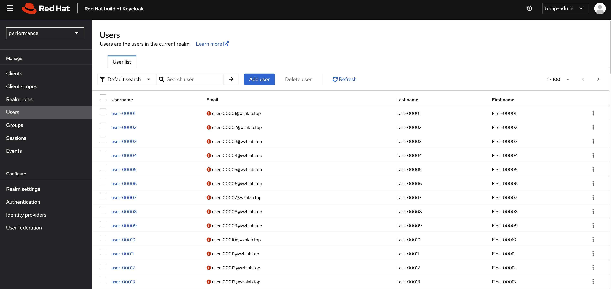
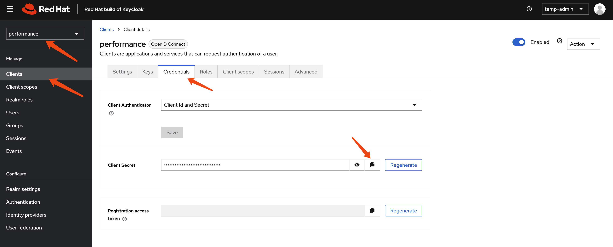
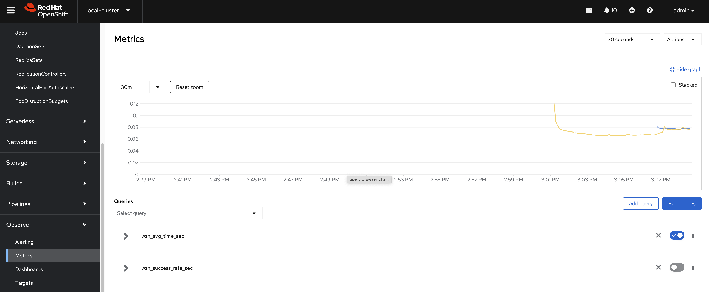

> [!WARNING]
> Working in progress
# RedHat Keycloak-26 Performance Test

We want to test the performance of Red Hat Keycloak 26 on a specific requirements and configurations:

1. 45 nodes
2. 50k users in total
3. 100 db connections per node

# install keycloak operator

Create a namespace for Keycloak:
```bash
oc new-project demo-keycloak
```


# create a keycloak instance with basic settings

To create a Keycloak instance with basic settings, first you need to create a backend DB. Then, you can create the Keycloak instance based on this DB.

```bash

oc delete -f ${BASE_DIR}/data/install/keycloak-db-pvc.yaml -n demo-keycloak

cat << EOF > ${BASE_DIR}/data/install/keycloak-db-pvc.yaml
apiVersion: v1
kind: PersistentVolumeClaim
metadata:
  name: postgresql-db-pvc
spec:
  accessModes:
    - ReadWriteOnce
  resources:
    requests:
      storage: 1Gi
EOF

oc create -f ${BASE_DIR}/data/install/keycloak-db-pvc.yaml -n demo-keycloak


oc delete -f ${BASE_DIR}/data/install/keycloak-db.yaml -n demo-keycloak

cat << EOF > ${BASE_DIR}/data/install/keycloak-db.yaml
---
apiVersion: apps/v1
kind: StatefulSet
metadata:
  name: postgresql-db
spec:
  serviceName: postgresql-db-service
  selector:
    matchLabels:
      app: postgresql-db
  replicas: 1
  template:
    metadata:
      labels:
        app: postgresql-db
    spec:
      containers:
        - name: postgresql-db
          image: postgres:15
          args: ["-c", "max_connections=1000"]
          volumeMounts:
            - mountPath: /data
              name: cache-volume
          env:
            - name: POSTGRES_USER
              value: testuser
            - name: POSTGRES_PASSWORD
              value: testpassword
            - name: PGDATA
              value: /data/pgdata
            - name: POSTGRES_DB
              value: keycloak
      volumes:
        - name: cache-volume
          persistentVolumeClaim:
            claimName: postgresql-db-pvc
---
apiVersion: v1
kind: Service
metadata:
  name: postgres-db
spec:
  selector:
    app: postgresql-db
  type: LoadBalancer
  ports:
  - port: 5432
    targetPort: 5432

EOF

oc create -f ${BASE_DIR}/data/install/keycloak-db.yaml -n demo-keycloak

```

Now, we have a Keycloak database running in our OpenShift cluster. Next, we need to configure Keycloak to use this database.

```bash

# create secret needed by keycloak
# the host name here, we use '*' to limit the length of the hostname in the certificate
RHSSO_HOST="*.apps.cluster-r9m7r.r9m7r.sandbox2453.opentlc.com"

cd ${BASE_DIR}/data/install/

openssl req -subj "/CN=$RHSSO_HOST/O=Test Keycloak./C=US" -newkey rsa:2048 -nodes -keyout key.pem -x509 -days 365 -out certificate.pem

oc delete secret example-tls-secret -n demo-keycloak
oc create secret tls example-tls-secret --cert certificate.pem --key key.pem -n demo-keycloak


oc delete secret keycloak-db-secret -n demo-keycloak
oc create secret generic keycloak-db-secret -n demo-keycloak \
  --from-literal=username=testuser \
  --from-literal=password=testpassword


# here we create keycloak instance with postgres db and tls secret
# here we change back the host name to actual hostname
oc delete -f ${BASE_DIR}/data/install/keycloak.yaml -n demo-keycloak

RHSSO_HOST="example-kc-demo-keycloak.apps.cluster-r9m7r.r9m7r.sandbox2453.opentlc.com"

cat << EOF > ${BASE_DIR}/data/install/keycloak.yaml
apiVersion: k8s.keycloak.org/v2alpha1
kind: Keycloak
metadata:
  name: example-kc
spec:
  instances: 1
  db:
    vendor: postgres
    host: postgres-db
    usernameSecret:
      name: keycloak-db-secret
      key: username
    passwordSecret:
      name: keycloak-db-secret
      key: password
  http:
    tlsSecret: example-tls-secret
  # ingress:
  #   className: openshift-default
  hostname:
    hostname: $RHSSO_HOST
    httpEnabled: true
  proxy:
    headers: xforwarded
EOF

oc create -f ${BASE_DIR}/data/install/keycloak.yaml -n demo-keycloak

# get the keycloak initial admin user and password
oc get secret example-kc-initial-admin -n demo-keycloak -o jsonpath='{.data.username}' | base64 --decode && echo
# temp-admin

oc get secret example-kc-initial-admin -n demo-keycloak -o jsonpath='{.data.password}' | base64 --decode && echo
# 070e14a1bc504496a64e10aa2a514bde


# in postgresql pod terminal
# we can see the current value of max_connections is 1000. We can change it to a higher value if needed.
psql -U testuser -d keycloak
# Type "help" for help.

# keycloak=# SHOW max_connections;
#  max_connections 
# -----------------
#  1000
# (1 row)
```

## check the keycloak instance on web interface

Goto `https://example-kc-demo-keycloak.apps.cluster-r9m7r.r9m7r.sandbox2453.opentlc.com` and login with admin credentials. Then you can see the rhbk default admin console.


For testing purposes, we will extend the session timeout to several days.

> [!WARNING]
> For testing only, do not use this configuration in production.


# get current keycloak config

Let us check the config of keycloak instance from web console. Current version is `26.0.10-opr.1`.


```yaml
apiVersion: k8s.keycloak.org/v2alpha1
kind: Keycloak
metadata:
  name: example-kc
  namespace: demo-keycloak
spec:
  db:
    host: postgres-db
    passwordSecret:
      key: password
      name: keycloak-db-secret
    usernameSecret:
      key: username
      name: keycloak-db-secret
    vendor: postgres
  hostname:
    hostname: example-kc-demo-keycloak.apps.cluster-r9m7r.r9m7r.sandbox2453.opentlc.com
  http:
    tlsSecret: example-tls-secret
  instances: 1
  proxy:
    headers: xforwarded
```

Next, we will check the contents of the `/opt/keycloak/conf` directory inside the `example-kc-0` pod in the `demo-keycloak` namespace. This will help us learn more about how the Keycloak server is configured.

```bash

oc exec -it example-kc-0 -n demo-keycloak -- ls /opt/keycloak/conf
# cache-ispn.xml  keycloak.conf  README.md  truststores

# oc exec -it example-kc-0 -n demo-keycloak -- ls -R /opt/keycloak

oc exec -it example-kc-0 -n demo-keycloak -- cat /opt/keycloak/conf/keycloak.conf
```

content of `/opt/keycloak/conf/keycloak.conf`

```conf
# Basic settings for running in production. Change accordingly before deploying the server.

# Database

# The database vendor.
#db=postgres

# The username of the database user.
#db-username=keycloak

# The password of the database user.
#db-password=password

# The full database JDBC URL. If not provided, a default URL is set based on the selected database vendor.
#db-url=jdbc:postgresql://localhost/keycloak

# Observability

# If the server should expose healthcheck endpoints.
#health-enabled=true

# If the server should expose metrics endpoints.
#metrics-enabled=true

# HTTP

# The file path to a server certificate or certificate chain in PEM format.
#https-certificate-file=${kc.home.dir}conf/server.crt.pem

# The file path to a private key in PEM format.
#https-certificate-key-file=${kc.home.dir}conf/server.key.pem

# The proxy address forwarding mode if the server is behind a reverse proxy.
#proxy=reencrypt

# Do not attach route to cookies and rely on the session affinity capabilities from reverse proxy
#spi-sticky-session-encoder-infinispan-should-attach-route=false

# Hostname for the Keycloak server.
#hostname=myhostname
```

Next, let's check the `cache-ispn.xml` file. We can do this by running the following command:

```bash
oc exec -it example-kc-0 -n demo-keycloak -- cat /opt/keycloak/conf/cache-ispn.xml
```

And the content of `cache-ispn.xml` is:

```xml
<?xml version="1.0" encoding="UTF-8"?>
<!--
  ~ Copyright 2019 Red Hat, Inc. and/or its affiliates
  ~ and other contributors as indicated by the @author tags.
  ~
  ~ Licensed under the Apache License, Version 2.0 (the "License");
  ~ you may not use this file except in compliance with the License.
  ~ You may obtain a copy of the License at
  ~
  ~ http://www.apache.org/licenses/LICENSE-2.0
  ~
  ~ Unless required by applicable law or agreed to in writing, software
  ~ distributed under the License is distributed on an "AS IS" BASIS,
  ~ WITHOUT WARRANTIES OR CONDITIONS OF ANY KIND, either express or implied.
  ~ See the License for the specific language governing permissions and
  ~ limitations under the License.
  -->

<infinispan
        xmlns:xsi="http://www.w3.org/2001/XMLSchema-instance"
        xsi:schemaLocation="urn:infinispan:config:15.0 http://www.infinispan.org/schemas/infinispan-config-15.0.xsd"
        xmlns="urn:infinispan:config:15.0">

    <cache-container name="keycloak">
        <transport lock-timeout="60000" stack="udp"/>
        <local-cache name="realms" simple-cache="true">
            <encoding>
                <key media-type="application/x-java-object"/>
                <value media-type="application/x-java-object"/>
            </encoding>
            <memory max-count="10000"/>
        </local-cache>
        <local-cache name="users" simple-cache="true">
            <encoding>
                <key media-type="application/x-java-object"/>
                <value media-type="application/x-java-object"/>
            </encoding>
            <memory max-count="10000"/>
        </local-cache>
        <distributed-cache name="sessions" owners="1">
            <expiration lifespan="-1"/>
            <memory max-count="10000"/>
        </distributed-cache>
        <distributed-cache name="authenticationSessions" owners="2">
            <expiration lifespan="-1"/>
        </distributed-cache>
        <distributed-cache name="offlineSessions" owners="1">
            <expiration lifespan="-1"/>
            <memory max-count="10000"/>
        </distributed-cache>
        <distributed-cache name="clientSessions" owners="1">
            <expiration lifespan="-1"/>
            <memory max-count="10000"/>
        </distributed-cache>
        <distributed-cache name="offlineClientSessions" owners="1">
            <expiration lifespan="-1"/>
            <memory max-count="10000"/>
        </distributed-cache>
        <distributed-cache name="loginFailures" owners="2">
            <expiration lifespan="-1"/>
        </distributed-cache>
        <local-cache name="authorization" simple-cache="true">
            <encoding>
                <key media-type="application/x-java-object"/>
                <value media-type="application/x-java-object"/>
            </encoding>
            <memory max-count="10000"/>
        </local-cache>
        <replicated-cache name="work">
            <expiration lifespan="-1"/>
        </replicated-cache>
        <local-cache name="keys" simple-cache="true">
            <encoding>
                <key media-type="application/x-java-object"/>
                <value media-type="application/x-java-object"/>
            </encoding>
            <expiration max-idle="3600000"/>
            <memory max-count="1000"/>
        </local-cache>
        <distributed-cache name="actionTokens" owners="2">
            <encoding>
                <key media-type="application/x-java-object"/>
                <value media-type="application/x-java-object"/>
            </encoding>
            <expiration max-idle="-1" lifespan="-1" interval="300000"/>
            <memory max-count="-1"/>
        </distributed-cache>
    </cache-container>
</infinispan>
```

It is interesting to see how the `cache-ispn.xml` file has been modified since rhbk-24, espeically in the `sessions` section and the `<memory max-count="10000"/>` configuration. 

# monitor the keycloak instance

Now, we need to configure `openshift-monitoring` to monitor the keycloak instance. We can do this by creating a configmap and applying it to the cluster. Here is an example of how to create the configmap and monitoring settings.

```bash
# create a configmap for openshift-monitoring to enable monitoring for customer workload
cat << EOF > ${BASE_DIR}/data/install/enable-monitor.yaml
apiVersion: v1
kind: ConfigMap
metadata:
  name: cluster-monitoring-config
  namespace: openshift-monitoring
data:
  config.yaml: |
    enableUserWorkload: true 
    # alertmanagerMain:
    #   enableUserAlertmanagerConfig: true 
EOF

oc apply -f ${BASE_DIR}/data/install/enable-monitor.yaml

oc -n openshift-user-workload-monitoring get pod

# monitor keycloak
oc delete -n demo-keycloak -f ${BASE_DIR}/data/install/keycloak-monitor.yaml

cat << EOF > ${BASE_DIR}/data/install/keycloak-monitor.yaml
---
apiVersion: monitoring.coreos.com/v1
kind: ServiceMonitor
metadata:
  name: keycloak
  namespace: demo-keycloak
spec:
  endpoints:
    - interval: 5s
      path: /metrics
      port: http
      scheme: http
  namespaceSelector:
    matchNames:
      - demo-keycloak
  selector:
    matchLabels:
      app: keycloak
# ---
# apiVersion: monitoring.coreos.com/v1
# kind: PodMonitor
# metadata:
#   name: keycloak
#   namespace: demo-keycloak
# spec:
#   podMetricsEndpoints:
#     - interval: 5s
#       path: /metrics
#       port: http
#       scheme: http
#       # relabelings:
#       #   - sourceLabels: [__name__]
#       #     targetLabel: __name__
#       #     replacement: 'keycloak.${1}'
#   namespaceSelector:
#     matchNames:
#       - demo-keycloak
#   selector:
#     matchLabels:
#       app: keycloak
EOF

oc apply -f ${BASE_DIR}/data/install/keycloak-monitor.yaml -n demo-keycloak

```

## check the metric on ocp web console

By login to the ocp web console, we can check the metric on the dashboard, using `jboss_infinispan_number_of_entries_in_memory` as metrics, we can see internal statics of keycloak/infinispan.


# create testing data in keycloak

We will create some (50k) users under a new realm in Keycloak to test the performance of keycloak.

## create keycloak-tool container image

We need a pod to run testing scripts, and the script will call keycloak API to perform operations. So we will create a dedicated container image for the pod.

We will use redhat official container image for keycloak. You can find the image on Red Hat Container Catalog:
- https://catalog.redhat.com/software/containers/rhbk/keycloak-rhel9/64f0add883a29ec473d40906?container-tabs=dockerfile

```bash
# as root

mkdir -p ${BASE_DIR}/data/keycloak.tool
cd ${BASE_DIR}/data/keycloak.tool

cat << 'EOF' > bashrc
alias ls='ls --color=auto'
export PATH=/opt/keycloak/bin:$PATH
EOF


cat << EOF > Dockerfile
FROM registry.redhat.io/ubi9/ubi AS ubi-micro-build
RUN mkdir -p /mnt/rootfs
RUN dnf install --installroot /mnt/rootfs  --releasever 9 --setopt install_weak_deps=false --nodocs -y /usr/bin/ps bash-completion coreutils /usr/bin/curl jq python3 /usr/bin/tar /usr/bin/sha256sum vim nano && \
    dnf --installroot /mnt/rootfs clean all && \
    rpm --root /mnt/rootfs -e --nodeps setup

FROM registry.redhat.io/rhbk/keycloak-rhel9:26.0-11
COPY --from=ubi-micro-build /mnt/rootfs /
COPY bashrc /opt/keycloak/.bashrc
EOF

podman build -t quay.io/wangzheng422/qimgs:keycloak-26.tool-2025-03-21-v01 .

podman push quay.io/wangzheng422/qimgs:keycloak-26.tool-2025-03-21-v01

podman run -it --entrypoint /bin/bash quay.io/wangzheng422/qimgs:keycloak-26.tool-2025-03-21-v01

```

## deploy keycloak tool on ocp

```bash

oc delete -n demo-keycloak -f ${BASE_DIR}/data/install/keycloak.tool.yaml

cat << EOF > ${BASE_DIR}/data/install/keycloak.tool.yaml
apiVersion: v1
kind: Pod
metadata:
  name: keycloak-tool
spec:
  containers:
  - name: keycloak-tool-container
    image: quay.io/wangzheng422/qimgs:keycloak-26.tool-2025-03-21-v01
    command: ["tail", "-f", "/dev/null"]
EOF

oc apply -f ${BASE_DIR}/data/install/keycloak.tool.yaml -n demo-keycloak

# start the shell
oc exec -it keycloak-tool -n demo-keycloak -- bash

# copy something out
oc cp -n demo-keycloak keycloak-tool:/opt/keycloak/metrics ./metrics

```


## init demo users

First, we need to create 50k user in keycloak. 

Lets do it by using keycloak admin cli.

This is the script framework, and we've written the entire process here. However, we are only creating realms. The script for creating users only demonstrates the creation logic; there are dedicated chapters later that will use more techniques to create users.

```bash

ADMIN_PWD='070e14a1bc504496a64e10aa2a514bde'

# after enable http in keycloak, you can use http endpoint
# it is better to set session timeout for admin for 1 day :)
kcadm.sh config credentials --server http://example-kc-service:8080/ --realm master --user temp-admin --password $ADMIN_PWD

# create a realm
kcadm.sh create realms -s realm=performance -s enabled=true

# Set SSO Session Max and SSO Session Idle to 1 day (1440 minutes)
kcadm.sh update realms/performance -s 'ssoSessionMaxLifespan=86400' -s 'ssoSessionIdleTimeout=86400'

# delete the realm
kcadm.sh delete realms/performance

# create a client
kcadm.sh create clients -r performance -s clientId=performance -s enabled=true -s 'directAccessGrantsEnabled=true'

# delete the client
CLIENT_ID=$(kcadm.sh get clients -r performance -q clientId=performance | jq -r '.[0].id')
if [ -n "$CLIENT_ID" ]; then
  echo "Deleting client performance"
  kcadm.sh delete clients/$CLIENT_ID -r performance
else
  echo "Client performance not found"
fi

# create 50k user, from user-00001 to user-50000, and set password for each user
for i in {1..50000}; do
  echo "Creating user user-$(printf "%05d" $i)"
  kcadm.sh create users -r performance -s username=user-$(printf "%05d" $i) -s enabled=true -s email=user-$(printf "%05d" $i)@wzhlab.top -s firstName=First-$(printf "%05d" $i) -s lastName=Last-$(printf "%05d" $i)
  kcadm.sh set-password -r performance --username user-$(printf "%05d" $i) --new-password password
done

# Delete users
for i in {1..50000}; do
  USER_ID=$(kcadm.sh get users -r performance -q username=user-$(printf "%05d" $i) | jq -r '.[0].id')
  if [ -n "$USER_ID" ]; then
    echo "Deleting user user-$(printf "%05d" $i)"
    kcadm.sh delete users/$USER_ID -r performance
  else
    echo "User user-$(printf "%05d" $i) not found"
  fi
done

```

## create user using job

Now we try to create users using jobs. 

First, we create a service account, and assign priviledge to it, so it can run the script in keycloak-tool.

```bash

oc delete -n demo-keycloak -f ${BASE_DIR}/data/install/keycloak-script-create-users.yaml

cat << EOF > ${BASE_DIR}/data/install/keycloak-script-sa.yaml
---
apiVersion: v1
kind: ServiceAccount
metadata:
  name: keycloak-sa
  namespace: demo-keycloak
---
apiVersion: security.openshift.io/v1
kind: SecurityContextConstraints
metadata:
  name: keycloak-scc
allowHostDirVolumePlugin: false
allowHostIPC: false
allowHostNetwork: false
allowHostPID: false
allowHostPorts: false
allowPrivilegeEscalation: true
allowPrivilegedContainer: false
allowedCapabilities: []
defaultAddCapabilities: []
fsGroup:
  type: RunAsAny
groups: []
priority: null
readOnlyRootFilesystem: false
requiredDropCapabilities: []
runAsUser:
  type: MustRunAs
  uid: 1000
seLinuxContext:
  type: RunAsAny
seccompProfiles:
- '*'
supplementalGroups:
  type: RunAsAny
users:
- system:serviceaccount:demo-keycloak:keycloak-sa
volumes:
- configMap
- emptyDir
- projected
- secret
- downwardAPI
EOF

oc apply -f ${BASE_DIR}/data/install/keycloak-script-sa.yaml -n demo-keycloak

oc adm policy add-scc-to-user keycloak-scc -z keycloak-sa -n demo-keycloak

```

create user use multiple jobs

```bash

TOTAL_USERS=50000
NUM_JOBS=10
USERS_PER_JOB=$((TOTAL_USERS / NUM_JOBS))

for job_id in $(seq 1 $NUM_JOBS); do
  START_USER=$(( (job_id - 1) * USERS_PER_JOB + 1 ))
  END_USER=$(( job_id * USERS_PER_JOB ))

  cat << EOF > ${BASE_DIR}/data/install/keycloak-script-create-users-${job_id}.yaml

---
apiVersion: v1
kind: ConfigMap
metadata:
  name: keycloak-script-config-${job_id}
data:
  create-users.sh: |
    kcadm.sh config credentials --server http://example-kc-service:8080/ --realm master --user temp-admin --password $ADMIN_PWD 

    for i in {$START_USER..$END_USER}; do
      echo "Creating user user-\$(printf "%05d" \$i)"
      kcadm.sh create users -r performance -s username=user-\$(printf "%05d" \$i) -s enabled=true -s email=user-\$(printf "%05d" \$i)@wzhlab.top -s firstName=First-\$(printf "%05d" \$i) -s lastName=Last-\$(printf "%05d" \$i)
      kcadm.sh set-password -r performance --username user-\$(printf "%05d" \$i) --new-password password
    done

---
apiVersion: batch/v1
kind: Job
metadata:
  name: keycloak-create-users-job-${job_id}
spec:
  template:
    spec:
      serviceAccountName: keycloak-sa
      containers:
      - name: keycloak-tool
        image: quay.io/wangzheng422/qimgs:keycloak-26.tool-2025-03-21-v01
        command: ["/bin/bash", "-c"]
        args: ["source /opt/keycloak/.bashrc && cp /scripts/create-users.sh /tmp/create-users.sh && chmod +x /tmp/create-users.sh && bash /tmp/create-users.sh"]
        securityContext:
          runAsUser: 1000
        volumeMounts:
        - name: script-volume
          mountPath: /scripts
      restartPolicy: Never
      volumes:
      - name: script-volume
        configMap:
          name: keycloak-script-config-${job_id}
  backoffLimit: 4
EOF
  oc delete -n demo-keycloak -f ${BASE_DIR}/data/install/keycloak-script-create-users-${job_id}.yaml
  oc apply -f ${BASE_DIR}/data/install/keycloak-script-create-users-${job_id}.yaml -n demo-keycloak
done

```

If everything ok, you can see those users in web console.



# test performance using curl

Now, we have 50k user in keycloak. Lets test the performance of keycloak.

Get the client secert from keycloak's web console.



And test the login rest api using curl.

```bash
# test the performance of keycloak, by login with each user
CLIENT_SECRET="hiZJdnJCCu0WXDhCVDWoyLix5bcWuYxq"

curl -X POST 'http://example-kc-service:8080/realms/performance/protocol/openid-connect/token' \
-H "Content-Type: application/x-www-form-urlencoded" \
-d "client_id=performance" \
-d "client_secret=$CLIENT_SECRET" \
-d "username=user-00001" \
-d "password=password" \
-d "grant_type=password" | jq .

# {
#   "access_token": "eyJhbGciOiJSUzI1NiIsInR5cCIgOiAiSldUIiwia2lkIiA6ICJick9pa2tPX3l2dmtoVzlLc05zTEVUMWctSWhfZ0g2WExZZnE5U1ZfeXZFIn0.eyJleHAiOjE3MjgyMjY5NTgsImlhdCI6MTcyODIyNjY1OCwianRpIjoiMzQ5ZGZjZTctNzY1Zi00Yjc0LTgyNjMtMzlmZmQ2NDA3ZjYwIiwiaXNzIjoiaHR0cHM6Ly9rZXljbG9hay1kZW1vLWtleWNsb2FrLmFwcHMuZGVtby0wMS1yaHN5cy53emhsYWIudG9wL3JlYWxtcy9wZXJmb3JtYW5jZSIsImF1ZCI6ImFjY291bnQiLCJzdWIiOiIxZWMxMmRhZC0wMWMwLTQ5N2YtOTkzMS0xZjIyMGJiMmI5OTMiLCJ0eXAiOiJCZWFyZXIiLCJhenAiOiJwZXJmb3JtYW5jZSIsInNlc3Npb25fc3RhdGUiOiIyOWQzYTUyZC0zNjExLTQ4YzktOWM5MC0yOTE2YmMxY2Q2ODciLCJhY3IiOiIxIiwicmVhbG1fYWNjZXNzIjp7InJvbGVzIjpbImRlZmF1bHQtcm9sZXMtcGVyZm9ybWFuY2UiLCJvZmZsaW5lX2FjY2VzcyIsInVtYV9hdXRob3JpemF0aW9uIl19LCJyZXNvdXJjZV9hY2Nlc3MiOnsiYWNjb3VudCI6eyJyb2xlcyI6WyJtYW5hZ2UtYWNjb3VudCIsIm1hbmFnZS1hY2NvdW50LWxpbmtzIiwidmlldy1wcm9maWxlIl19fSwic2NvcGUiOiJlbWFpbCBwcm9maWxlIiwic2lkIjoiMjlkM2E1MmQtMzYxMS00OGM5LTljOTAtMjkxNmJjMWNkNjg3IiwiZW1haWxfdmVyaWZpZWQiOmZhbHNlLCJuYW1lIjoiRmlyc3QtMDAwMDEgTGFzdC0wMDAwMSIsInByZWZlcnJlZF91c2VybmFtZSI6InVzZXItMDAwMDEiLCJnaXZlbl9uYW1lIjoiRmlyc3QtMDAwMDEiLCJmYW1pbHlfbmFtZSI6Ikxhc3QtMDAwMDEiLCJlbWFpbCI6InVzZXItMDAwMDFAd3pobGFiLnRvcCJ9.ioqCjbSuolrhGDPW8SF_Ls0NTOn9mJM8QO7btRo7N24lLZrNaKNrv7R5Mvcs4Bu5xDuB5KHEDh-IU-c3iT8TRK8hc5DHhWYwe7_WICp_O7DQEVIP-9wgeqSY4qmdwBkXvwYN0q8AIOjRwYOYqTP6rLcWiPEhdWDqkCL-S9tyhYBwRt44-k455zi1JOFSBd_vWVXp68TJ5b8TWResz3L-cT02Fk0y9_RZBXang1I3tZUOqpHBCVBhRlDwAvst2QtE3tG-rnIXBR4l1vVn1TXlfoRiDwXE5ski9B1KhHuRNZEqbPdkFpWIfb01h9qwtygv4yNKJEW_knw5t_7iaOwRhA",
#   "expires_in": 300,
#   "refresh_expires_in": 86400,
#   "refresh_token": "eyJhbGciOiJIUzUxMiIsInR5cCIgOiAiSldUIiwia2lkIiA6ICI2YWY4Mjc5Mi02NmQ3LTQ0OWItODI4MS0wY2M0NWU4ZjU0ZTkifQ.eyJleHAiOjE3MjgzMTMwNTgsImlhdCI6MTcyODIyNjY1OCwianRpIjoiYjczYWYxODktZDQzZi00MjZiLWJhZGYtNjc0NTI3MGIzZWIzIiwiaXNzIjoiaHR0cHM6Ly9rZXljbG9hay1kZW1vLWtleWNsb2FrLmFwcHMuZGVtby0wMS1yaHN5cy53emhsYWIudG9wL3JlYWxtcy9wZXJmb3JtYW5jZSIsImF1ZCI6Imh0dHBzOi8va2V5Y2xvYWstZGVtby1rZXljbG9hay5hcHBzLmRlbW8tMDEtcmhzeXMud3pobGFiLnRvcC9yZWFsbXMvcGVyZm9ybWFuY2UiLCJzdWIiOiIxZWMxMmRhZC0wMWMwLTQ5N2YtOTkzMS0xZjIyMGJiMmI5OTMiLCJ0eXAiOiJSZWZyZXNoIiwiYXpwIjoicGVyZm9ybWFuY2UiLCJzZXNzaW9uX3N0YXRlIjoiMjlkM2E1MmQtMzYxMS00OGM5LTljOTAtMjkxNmJjMWNkNjg3Iiwic2NvcGUiOiJlbWFpbCBwcm9maWxlIiwic2lkIjoiMjlkM2E1MmQtMzYxMS00OGM5LTljOTAtMjkxNmJjMWNkNjg3In0.un_vmkLIo8elfXAwrgYAnCd6xMHtPkER1j7xuxaDn_lbdmFJSBYJld4YdB6Rxezv7auOmEdd9y1GiFGd3SOGUw",
#   "token_type": "Bearer",
#   "not-before-policy": 0,
#   "session_state": "29d3a52d-3611-48c9-9c90-2916bc1cd687",
#   "scope": "email profile"
# }

```

We can see it is ok to call rest api to login, so we can carry out out testing by using the login rest api.

## test with python job

We also need a benchmark tool to test the rhsso, we can use python to write a simple script to do this. The python has a build-in prometheus client, so we can monitor the python pod with prometheus.

Make changes to `performance_test_keycloak.py`, espeically the `client secert`, then copy file `performance_test_keycloak.py` from ./files to bastation. And create jobs using the python script.

```bash
URL='http://example-kc-service:8080/realms/performance/protocol/openid-connect/token'

VAR_PROJECT=demo-keycloak

# copy file performance_test_keycloak.py from ./files
oc delete -n demo-keycloak configmap performance-test-script
oc create configmap performance-test-script -n demo-keycloak --from-file=${BASE_DIR}/data/install/performance_test_keycloak.py


oc delete -n $VAR_PROJECT -f ${BASE_DIR}/data/install/performance-test-deployment.yaml

cat << EOF > ${BASE_DIR}/data/install/performance-test-deployment.yaml
---
apiVersion: apps/v1
kind: Deployment
metadata:
  name: performance-test-deployment
spec:
  replicas: 1
  selector:
    matchLabels:
      app: performance-test
  template:
    metadata:
      labels:
        app: performance-test
    spec:
      containers:
      - name: performance-test
        image: quay.io/wangzheng422/qimgs:rocky9-test-2024.10.14.v01 
        command: ["/usr/bin/python3", "/scripts/performance_test_keycloak.py"]
        env:
        - name: CLIENT_SECRET
          value: "hiZJdnJCCu0WXDhCVDWoyLix5bcWuYxq"  # Replace this with your actual client key here.
        volumeMounts:
        - name: script-volume
          mountPath: /scripts
      restartPolicy: Always
      volumes:
      - name: script-volume
        configMap:
          name: performance-test-script
---
apiVersion: v1
kind: Service
metadata:
  name: performance-test-service
  labels:
    app: performance-test
spec:
  selector:
    app: performance-test
  ports:
    - name: http
      protocol: TCP
      port: 8000
      targetPort: 8000
EOF


oc apply -f ${BASE_DIR}/data/install/performance-test-deployment.yaml -n $VAR_PROJECT

```

## monitor metrics using ocp monitoring

Our performance testing script has promethus build-in, so we can monitor the performance test result using openshift monitoring subsystem.

```bash
oc delete -n $VAR_PROJECT -f ${BASE_DIR}/data/install/performance-monitor.yaml

cat << EOF > ${BASE_DIR}/data/install/performance-monitor.yaml
---
apiVersion: monitoring.coreos.com/v1
kind: ServiceMonitor
metadata:
  name: performance-test
  namespace: $VAR_PROJECT
spec:
  endpoints:
    - interval: 5s
      path: /metrics
      port: http
      scheme: http
  namespaceSelector:
    matchNames:
      - $VAR_PROJECT
  selector:
    matchLabels:
      app: performance-test
# ---
# apiVersion: monitoring.coreos.com/v1
# kind: PodMonitor
# metadata:
#   name: performance-test
#   namespace: $VAR_PROJECT
# spec:
#   podMetricsEndpoints:
#     - interval: 5s
#       path: /metrics
#       port: '8000'
#       scheme: http
#   namespaceSelector:
#     matchNames:
#       - $VAR_PROJECT
#   selector:
#     matchLabels:
#       app: performance-test
EOF

oc apply -f ${BASE_DIR}/data/install/performance-monitor.yaml -n $VAR_PROJECT

```

You can checkout the metrics by search the name begins with `wzh`, like `wzh_avg_time_sec` and `wzh_success_rate_sec`




# patch to the keycloak instance config using 2 owner 2 instance.

- https://www.keycloak.org/server/all-config

Update `cache-ispn.xml` with the following content, I update the `memory max-count` to 50k, which is the target user number, and update `lifespan` to `1 day`, which is based on use case, also enable `statistics`, and set `owners` to `2`.

```bash

cat << EOF >  ${BASE_DIR}/data/install/keycloak.cache-ispn.xml
<infinispan
        xmlns:xsi="http://www.w3.org/2001/XMLSchema-instance"
        xsi:schemaLocation="urn:infinispan:config:15.0 http://www.infinispan.org/schemas/infinispan-config-15.0.xsd"
        xmlns="urn:infinispan:config:15.0">

    <cache-container name="keycloak" statistics="true">
        <transport lock-timeout="60000" stack="udp"/>
        <metrics names-as-tags="true" />
        <local-cache name="realms" simple-cache="true" statistics="true">
            <encoding>
                <key media-type="application/x-java-object"/>
                <value media-type="application/x-java-object"/>
            </encoding>
            <memory max-count="10000"/>
        </local-cache>
        <local-cache name="users" simple-cache="true" statistics="true">
            <encoding>
                <key media-type="application/x-java-object"/>
                <value media-type="application/x-java-object"/>
            </encoding>
            <memory max-count="50000"/>
        </local-cache>
        <distributed-cache name="sessions" owners="2" statistics="true">
            <expiration lifespan="86400"/>
            <memory max-count="50000"/>
        </distributed-cache>
        <distributed-cache name="authenticationSessions" owners="2" statistics="true">
            <expiration lifespan="86400"/>
        </distributed-cache>
        <distributed-cache name="offlineSessions" owners="2" statistics="true">
            <expiration lifespan="86400"/>
            <memory max-count="50000"/>
        </distributed-cache>
        <distributed-cache name="clientSessions" owners="2" statistics="true">
            <expiration lifespan="86400"/>
            <memory max-count="50000"/>
        </distributed-cache>
        <distributed-cache name="offlineClientSessions" owners="2" statistics="true">
            <expiration lifespan="86400"/>
            <memory max-count="50000"/>
        </distributed-cache>
        <distributed-cache name="loginFailures" owners="2" statistics="true">
            <expiration lifespan="86400"/>
        </distributed-cache>
        <local-cache name="authorization" simple-cache="true">
            <encoding>
                <key media-type="application/x-java-object"/>
                <value media-type="application/x-java-object"/>
            </encoding>
            <memory max-count="50000"/>
        </local-cache>
        <replicated-cache name="work" statistics="true">
            <expiration lifespan="86400"/>
        </replicated-cache>
        <local-cache name="keys" simple-cache="true" statistics="true">
            <encoding>
                <key media-type="application/x-java-object"/>
                <value media-type="application/x-java-object"/>
            </encoding>
            <expiration max-idle="3600000"/>
            <memory max-count="50000"/>
        </local-cache>
        <distributed-cache name="actionTokens" owners="2" statistics="true">
            <encoding>
                <key media-type="application/x-java-object"/>
                <value media-type="application/x-java-object"/>
            </encoding>
            <expiration max-idle="86400" lifespan="86400" interval="300000"/>
            <memory max-count="-1"/>
        </distributed-cache>
    </cache-container>
</infinispan>
EOF

# create configmap
oc delete configmap keycloak-cache-ispn -n demo-keycloak
oc create configmap keycloak-cache-ispn --from-file=${BASE_DIR}/data/install/keycloak.cache-ispn.xml -n demo-keycloak

```

Then, we update the config of the keycloak instance to enable HTTP and configure the cache, enable metrics.

```yaml
apiVersion: k8s.keycloak.org/v2alpha1
kind: Keycloak
metadata:
  name: example-kc
  namespace: demo-keycloak
spec:
  ......
  http:
    httpEnabled: true
  cache:
    configMapFile:
      key: keycloak.cache-ispn.xml
      name: keycloak-cache-ispn
  db:
    poolMaxSize: 100
  additionalOptions:
    - name: metrics-enabled
      value: 'true'
    # - name: log-level
    #   value: debug
  instances: 2
  ......
```

It seems the config is enabled using env. Here is part of the keycload pod yaml file:

```yaml
kind: Pod
apiVersion: v1
metadata:
  name: example-kc-0
  namespace: demo-keycloak
  ......
spec:
  ......
  containers:
    - name: keycloak
      ......
      env:
        - name: KC_HOSTNAME
          value: example-kc-demo-keycloak.apps.cluster-r9m7r.r9m7r.sandbox2453.opentlc.com
        - name: KC_HTTP_ENABLED
          value: 'true'
        - name: KC_HTTP_PORT
          value: '8080'
        - name: KC_HTTPS_PORT
          value: '8443'
        - name: KC_HTTPS_CERTIFICATE_FILE
          value: /mnt/certificates/tls.crt
        - name: KC_HTTPS_CERTIFICATE_KEY_FILE
          value: /mnt/certificates/tls.key
        - name: KC_DB
          value: postgres
        - name: KC_DB_USERNAME
          valueFrom:
            secretKeyRef:
              name: keycloak-db-secret
              key: username
        - name: KC_DB_PASSWORD
          valueFrom:
            secretKeyRef:
              name: keycloak-db-secret
              key: password
        - name: KC_DB_URL_HOST
          value: postgres-db
        - name: KC_DB_POOL_MAX_SIZE
          value: '100'
        - name: KC_CACHE_CONFIG_FILE
          value: cache/keycloak.cache-ispn.xml
        - name: KC_PROXY_HEADERS
          value: xforwarded
        - name: KC_BOOTSTRAP_ADMIN_USERNAME
          valueFrom:
            secretKeyRef:
              name: example-kc-initial-admin
              key: username
        - name: KC_BOOTSTRAP_ADMIN_PASSWORD
          valueFrom:
            secretKeyRef:
              name: example-kc-initial-admin
              key: password
        - name: KC_HEALTH_ENABLED
          value: 'true'
        - name: KC_CACHE
          value: ispn
        - name: KC_CACHE_STACK
          value: kubernetes
        - name: KC_TRUSTSTORE_PATHS
          value: '/var/run/secrets/kubernetes.io/serviceaccount/ca.crt,/var/run/secrets/kubernetes.io/serviceaccount/service-ca.crt'
        - name: KC_TRACING_SERVICE_NAME
          value: example-kc
        - name: KC_TRACING_RESOURCE_ATTRIBUTES
          value: k8s.namespace.name=demo-keycloak
  ......
```


# end