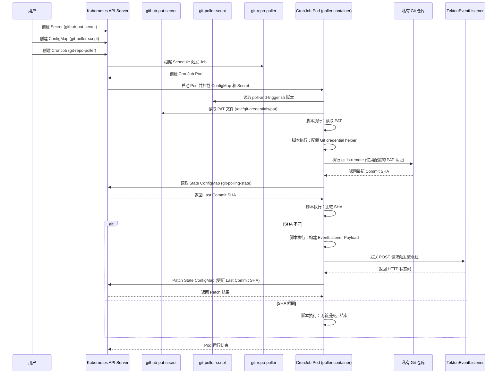

# Monitoring github without webhook

是一个使用 Kubernetes `CronJob` 配合一个脚本来轮询 Git 仓库并触发 Tekton `EventListener` 的示例 YAML 配置。

这个方案包含以下几个部分：

1.  **一个 Secret 用于存放 Git 仓库的认证凭据（如个人访问令牌 PAT）。**
2.  **一个 ConfigMap 用于存放轮询脚本。**
3.  **一个 ConfigMap 用于存放 Git 仓库的最新提交 SHA，作为状态存储。**
4.  **一个 ServiceAccount** 供 CronJob 的 Pod 使用。
5.  **一个 Role 和 RoleBinding** 赋予 ServiceAccount 读取和更新状态 ConfigMap 的权限。
6.  **一个 CronJob** 定义，它会定时运行一个 Pod，该 Pod 执行轮询脚本。

请注意：

*   你需要一个包含 `git`, `curl`, `kubectl` (或 `oc` 如果在 OpenShift 上), 和 `jq` 命令的容器镜像。你可以基于 `ubuntu` 或 `alpine` 构建一个简单的镜像，或者找一个包含这些工具的现有镜像。示例中使用了一个占位符镜像名 `my-custom-git-poller-image:latest`。
*   你需要替换 YAML 中的占位符，如仓库 URL、分支名、Tekton EventListener 的 Service 名称和命名空间等。
*   状态存储使用了 ConfigMap，脚本会读取其中的 `last-commit-sha` 字段，并在成功触发流水线后更新它。这要求 CronJob 的 ServiceAccount 有权限修改这个 ConfigMap。
*   这个方案的轮询频率取决于 `CronJob` 的 `schedule` 设置。
*   **Git 认证：** 如果你的 Git 仓库是私有的，你需要配置容器来处理认证。本示例展示了如何使用 Kubernetes Secret 存储个人访问令牌 (Personal Access Token, PAT) 并通过 volumeMounts 将其挂载到容器中供脚本使用。

---

## 私有仓库访问问题及解决方案

针对私有仓库需要密码访问的问题，文档中通过引入 Kubernetes Secret 来存储 Git 认证凭据（例如 GitHub 的 Personal Access Token, PAT）来解决。

核心逻辑梳理如下：

1.  **创建 Kubernetes Secret**:
    *   首先，需要手动创建一个 Kubernetes Secret，用于安全地存储 Git 仓库的认证凭据。
    *   文档中提供了一个名为 `github-pat-secret` 的 Secret 示例，类型为 `Opaque`。
    *   Secret 的 `data` 字段中存放了认证凭据，例如使用 `pat` 作为 key，其值是经过 base64 编码的个人访问令牌。
    *   **源代码片段:**
        ```yaml
        # 0. Kubernetes Secret for Git Credentials (Personal Access Token)
        # Create this Secret manually before deploying the CronJob.
        # Replace <your_pat> with your actual GitHub Personal Access Token.
        # The key 'pat' can be anything, but remember it for the volume mount and script.
        apiVersion: v1
        kind: Secret
        metadata:
          name: github-pat-secret
          namespace: my-quarkus-app-01-dev # Must be in the same namespace as the CronJob
        type: Opaque
        data:
          # Replace <your_pat> with your base64 encoded Personal Access Token
          # You can get the base64 encoded value using: echo -n 'YOUR_PAT_HERE' | base64
          pat: <your_base64_encoded_pat> # Example: Z2hwX0FzaGRmZ2hqc2RmZ2hqc2RmZ2hqc2RmZ2hqc2RmZ2hqc2RmZ2hqc2RmZ2g=
        ```
        *注意：示例中的 `<your_base64_encoded_pat>` 是需要替换为实际的 base64 编码后的 PAT。*

2.  **CronJob 定义中挂载 Secret**:
    *   在 CronJob 的 Pod 模板中，通过 `volumes` 定义一个 Secret 类型的 volume，引用刚才创建的 Secret (`github-pat-secret`)。
    *   在容器定义中，通过 `volumeMounts` 将该 volume 挂载到容器内部的特定路径，例如 `/etc/git-credentials`。这样，Secret 中的数据就会作为文件出现在容器的文件系统中。
    *   **源代码片段:**
        ```yaml
              volumes:
              - name: script-volume
                configMap:
                  name: git-poller-script # Mount the script ConfigMap
                  defaultMode: 0755 # Make the script executable
              - name: github-pat-volume # Define the volume for the Secret
                secret:
                  secretName: github-pat-secret # Name of the Secret created above
                  items:
                  - key: pat # Key in the Secret data
                    path: pat # File name inside the mountPath (/etc/git-credentials/pat)
        ```
        ```yaml
              volumeMounts:
              - name: script-volume
                mountPath: /opt/script
              - name: github-pat-volume # Mount the Secret containing the PAT
                mountPath: /etc/git-credentials # Mount point for credentials
                readOnly: true # Credentials should be read-only
        ```

3.  **脚本中读取凭据并配置 Git**:
    *   在轮询脚本 (`poll-and-trigger.sh`) 中，首先检查 Secret 挂载的路径下是否存在凭据文件 (`/etc/git-credentials/pat`)。
    *   如果文件存在，读取其中的 PAT。
    *   使用读取到的 PAT 配置 Git 的 credential helper, 使其在访问私有仓库时使用该 PAT 进行认证。这里使用了 `git config --global credential.helper store` 并生成一个临时的 `.git-credentials` 文件的方式。
    *   **源代码片段:**
        ```bash
        # Configure Git to use the PAT from the mounted Secret for authentication
        # This assumes the Secret is mounted at /etc/git-credentials with a file named 'pat'
        GIT_PAT_FILE="/etc/git-credentials/pat"
        if [ -f "$GIT_PAT_FILE" ]; then
            GIT_PAT=$(cat "$GIT_PAT_FILE")
            # Use a temporary .git-credentials file and configure git to use it
            # Format: https://<token>@github.com
            # Note: This approach stores the credential in a file within the container's home directory.
            # For enhanced security, consider using git's credential.helper or other methods
            # that don't write the PAT to a file on disk if your Git server supports it.
            echo "https://${GIT_PAT}@$(echo "${REPO_URL}" | sed -e 's|^https://||' -e 's|/.*$||')" > ~/.git-credentials
            git config --global credential.helper store
            echo "Git credential helper configured using PAT."
        else
            echo "Warning: Git PAT file not found at $GIT_PAT_FILE. Proceeding without explicit authentication."
            # This might fail for private repositories unless other auth methods are configured (e.g., SSH)
        fi
        ```
    *   配置完成后，后续的 `git ls-remote` 命令在访问私有仓库时就会自动使用配置的 PAT 进行认证。

**Mermaid 时序图:**



---

## 完整的 YAML 配置示例

下面是包含上述私有仓库访问配置的完整 Kubernetes YAML 配置示例。请根据你的实际环境替换其中的占位符。

```yaml
# 0. Kubernetes Secret for Git Credentials (Personal Access Token)
# Create this Secret manually before deploying the CronJob.
# Replace <your_pat> with your actual GitHub Personal Access Token.
# The key 'pat' can be anything, but remember it for the volume mount and script.
apiVersion: v1
kind: Secret
metadata:
  name: github-pat-secret
  namespace: my-quarkus-app-01-dev # Must be in the same namespace as the CronJob
type: Opaque
data:
  # Replace <your_pat> with your base64 encoded Personal Access Token
  # You can get the base64 encoded value using: echo -n 'YOUR_PAT_HERE' | base64
  pat: <your_base64_encoded_pat> # Example: Z2hwX0FzaGRmZ2hqc2RmZ2hqc2RmZ2hqc2RmZ2hqc2RmZ2hqc2RmZ2hqc2RmZ2g=

---

# 1. ConfigMap for the Polling Script
# This ConfigMap holds the bash script that performs the polling logic.
apiVersion: v1
kind: ConfigMap
metadata:
  name: git-poller-script
  namespace: my-quarkus-app-01-dev # Change if your Tekton EventListener is in a different namespace
data:
  poll-and-trigger.sh: |
    #!/bin/bash

    set -euo pipefail

    REPO_URL="$1"
    BRANCH="$2"
    EVENT_LISTENER_SERVICE="$3" # Tekton EventListener Service Name
    TEKTON_NAMESPACE="$4"       # Tekton EventListener Namespace
    STATE_CONFIGMAP="$5"        # ConfigMap storing the last commit SHA
    STATE_CM_KEY="$6"           # Key within the state ConfigMap (e.g., last-commit-sha)
    CONFIGURED_USER_EMAIL="$7"  # New argument for configured email

    # Construct the EventListener URL (assuming cluster internal service discovery)
    EVENT_LISTENER_URL="http://el-${EVENT_LISTENER_SERVICE}.${TEKTON_NAMESPACE}.svc.cluster.local:8080"

    echo "Starting Git polling for ${REPO_URL} branch ${BRANCH}..."

    # Configure Git to use the PAT from the mounted Secret for authentication
    # This assumes the Secret is mounted at /etc/git-credentials with a file named 'pat'
    GIT_PAT_FILE="/etc/git-credentials/pat"
    if [ -f "$GIT_PAT_FILE" ]; then
        GIT_PAT=$(cat "$GIT_PAT_FILE")
        # Use a temporary .git-credentials file and configure git to use it
        # Format: https://<token>@github.com
        # Note: This approach stores the credential in a file within the container's home directory.
        # For enhanced security, consider using git's credential.helper or other methods
        # that don't write the PAT to a file on disk if your Git server supports it.
        echo "https://${GIT_PAT}@$(echo "${REPO_URL}" | sed -e 's|^https://||' -e 's|/.*$||')" > ~/.git-credentials
        git config --global credential.helper store
        echo "Git credential helper configured using PAT."
    else
        echo "Warning: Git PAT file not found at $GIT_PAT_FILE. Proceeding without explicit authentication."
        # This might fail for private repositories unless other auth methods are configured (e.g., SSH)
    fi

    # 1. Get the latest commit SHA from the remote repository
    # Use git ls-remote for efficiency - avoids cloning
    CURRENT_COMMIT_SHA=$(git ls-remote "${REPO_URL}" "refs/heads/${BRANCH}" | awk '{print $1}')

    if [ -z "$CURRENT_COMMIT_SHA" ]; then
      echo "Error: Could not get current commit SHA from ${REPO_URL} on branch ${BRANCH}. Exiting."
      exit 1
    fi

    echo "Current commit SHA: ${CURRENT_COMMIT_SHA}"

    # 2. Read the last triggered commit SHA from the State ConfigMap
    # We need to handle the case where the ConfigMap or key doesn't exist yet (first run)
    set +e # Allow kubectl get to fail if CM/key not found initially
    LAST_COMMIT_SHA=$(kubectl get configmap "${STATE_CONFIGMAP}" -n "${TEKTON_NAMESPACE}" -o jsonpath="{.data.${STATE_CM_KEY}}" --ignore-not-found)
    set -e # Re-enable strict mode

    if [ -z "$LAST_COMMIT_SHA" ]; then
        echo "No previous commit SHA found in ConfigMap '${STATE_CONFIGMAP}' key '${STATE_CM_KEY}'. Assuming first run or state reset."
        LAST_COMMIT_SHA="<initial_sha>" # Use a placeholder that won't match a real SHA
    else
        echo "Last triggered commit SHA from state: ${LAST_COMMIT_SHA}"
    fi

    # 3. Compare SHAs and trigger if different
    if [ "$CURRENT_COMMIT_SHA" != "$LAST_COMMIT_SHA" ]; then
        echo "New commit detected! ${LAST_COMMIT_SHA} -> ${CURRENT_COMMIT_SHA}"
        echo "Triggering Tekton EventListener at ${EVENT_LISTENER_URL}..."

        # Construct a simple payload (mimicking part of a GitHub push webhook)
        # This payload must match what your Tekton TriggerBinding expects.
        # Ensure jq is available in your container image to build the JSON.
        PAYLOAD=$(jq -n \
            --arg ref "refs/heads/${BRANCH}" \
            --arg after "${CURRENT_COMMIT_SHA}" \
            --arg repo_url "${REPO_URL}" \
            --arg user_email "${CONFIGURED_USER_EMAIL}" \
            --arg commit_message "Commit ${CURRENT_COMMIT_SHA} detected by poller" \
            '{ref: $ref, after: $after, commits: [{id: $after, message: $commit_message}], object_kind: "push", user_name: $user_email,user_email: $user_email, repository: {name: "my-repo", git_http_url: $repo_url}}')

        echo "Sending payload: ${PAYLOAD}"

        # Send the POST request to the EventListener Service
        # -s: Silent mode
        # -o /dev/null: Discard output
        # -w "%{http_code}": Print only the HTTP status code
        response_code=$(curl -s -o /dev/null -w "%{http_code}" -X POST \
                             -H "Content-Type: application/json" \
                             -d "${PAYLOAD}" \
                             "${EVENT_LISTENER_URL}")

        if [ "$response_code" -ge 200 ] && [ "$response_code" -lt 300 ]; then
            echo "Tekton EventListener triggered successfully (HTTP ${response_code})."

            # 4. Update the last triggered commit SHA in the State ConfigMap
            echo "Updating ConfigMap '${STATE_CONFIGMAP}' key '${STATE_CM_KEY}' with new SHA ${CURRENT_COMMIT_SHA}..."
            # Use kubectl patch to update the specific key in the data field
            kubectl patch configmap "${STATE_CONFIGMAP}" -n "${TEKTON_NAMESPACE}" \
                    --patch '{"data":{"'"${STATE_CM_KEY}"'":"'"${CURRENT_COMMIT_SHA}"'"}}'
            if [ $? -eq 0 ]; then
                echo "State ConfigMap updated successfully."
            else
                echo "Warning: Failed to update state ConfigMap. Subsequent runs might re-trigger for this commit."
                # Decide if you want the job to fail here. For polling state updates, maybe not critical.
            fi

        else
            echo "Error triggering Tekton EventListener. Received HTTP status code: ${response_code}."
            # If triggering fails, we should probably exit with an error so the Job is marked failed.
            exit 1
        fi

    else
        echo "No new commits detected. Latest SHA (${CURRENT_COMMIT_SHA}) matches last triggered SHA."
    fi

    echo "Polling job finished."

---
# 2. ConfigMap for Storing State (Last Triggered SHA)
# This ConfigMap holds the SHA of the last commit that successfully triggered a pipeline.
# You need to create this ConfigMap manually before the first run.
# The 'last-commit-sha' key should ideally be empty initially or contain a dummy value.
apiVersion: v1
kind: ConfigMap
metadata:
  name: git-polling-state # The name used in the script args
  namespace: my-quarkus-app-01-dev # Must match the namespace where the CronJob and EventListener run
data:
  last-commit-sha: "" # This will be updated by the script

---
# 3. ServiceAccount for the CronJob
# The CronJob Pod will run as this ServiceAccount.
apiVersion: v1
kind: ServiceAccount
metadata:
  name: git-poller-sa
  namespace: my-quarkus-app-01-dev # Must be in the same namespace as the CronJob and State ConfigMap

---
# 4. RBAC Role and RoleBinding
# These grant the ServiceAccount permission to get and patch the State ConfigMap.
apiVersion: rbac.authorization.k8s.io/v1
kind: Role
metadata:
  name: git-poller-state-updater-role
  namespace: my-quarkus-app-01-dev # Must be in the same namespace as the State ConfigMap
rules:
- apiGroups: [""] # Core Kubernetes API group
  resources: ["configmaps"]
  verbs: ["get", "patch"] # Need get to read and patch to update
  resourceNames: ["git-polling-state"] # Restrict to only the state ConfigMap

---
apiVersion: rbac.authorization.k8s.io/v1
kind: RoleBinding
metadata:
  name: git-poller-state-updater-binding
  namespace: my-quarkus-app-01-dev # Must be in the same namespace as the Role and ServiceAccount
roleRef:
  apiGroup: rbac.authorization.k8s.io
  kind: Role
  name: git-poller-state-updater-role # Name of the Role defined above
subjects:
- kind: ServiceAccount
  name: git-poller-sa # Name of the ServiceAccount defined above
  namespace: my-quarkus-app-01-dev # Must match the ServiceAccount's namespace

# if your base image needs special permissions, consider using a ClusterRole with the `anyuid` permission
# otherwise, use the Role defined above only.
---
apiVersion: rbac.authorization.k8s.io/v1
kind: RoleBinding
metadata:
  name: git-poller-anyuid-scc-binding
  namespace: my-quarkus-app-01-dev
subjects:
- kind: ServiceAccount
  name: git-poller-sa
  namespace: my-quarkus-app-01-dev
roleRef:
  apiGroup: rbac.authorization.k8s.io
  kind: ClusterRole
  name: system:openshift:scc:anyuid

---
# 5. The CronJob Definition
apiVersion: batch/v1
kind: CronJob
metadata:
  name: git-repo-poller
  namespace: my-quarkus-app-01-dev # Must be in the same namespace as the ServiceAccount, ConfigMaps, and EventListener
spec:
  schedule: "*/5 * * * *" # Cron expression: runs every 5 minutes
  concurrencyPolicy: Forbid # Prevent concurrent job runs if a previous one is still running
  jobTemplate:
    spec:
      template:
        spec:
          serviceAccountName: git-poller-sa # Use the dedicated ServiceAccount
          restartPolicy: OnFailure # Restart the container if it fails, but the Job will finish if the container exits
          containers:
          - name: poller
            # Replace with your custom image containing git, curl, kubectl, and jq
            image: quay.io/wangzheng422/qimgs:rocky9-test-2025.04.30.v01
            imagePullPolicy: IfNotPresent
            securityContext: # using root user only if your base image doesn't support non-root users
              runAsUser: 0
              runAsGroup: 0
            command: ["/bin/bash", "/opt/script/poll-and-trigger.sh"]
            args:
            - "https://github.com/wangzheng422/docker_env"       # Replace with your Git repository URL (e.g., https://github.com/your-org/your-repo.git)
            - "dev"        # Replace with the branch name to poll (e.g., main or master)
            - "my-quarkus-app-01-el" # Replace with the name of your Tekton EventListener Service
            - "my-quarkus-app-01-dev"        # Replace if your EventListener is in a different namespace
            - "git-polling-state"       # Name of the state ConfigMap
            - "last-commit-sha"         # Key in the state ConfigMap
            - "your-configured-email@example.com" # Add the email as a new argument
            volumeMounts:
            - name: script-volume
              mountPath: /opt/script
            - name: github-pat-volume # Mount the Secret containing the PAT
              mountPath: /etc/git-credentials # Mount point for credentials
              readOnly: true # Credentials should be read-only
          volumes:
          - name: script-volume
            configMap:
              name: git-poller-script # Mount the script ConfigMap
              defaultMode: 0755 # Make the script executable
          - name: github-pat-volume # Define the volume for the Secret
            secret:
              secretName: github-pat-secret # Name of the Secret created above
              items:
              - key: pat # Key in the Secret data
                path: pat # File name inside the mountPath (/etc/git-credentials/pat)
```

---

## 总结

本文档详细介绍了如何使用 Kubernetes CronJob 结合自定义脚本来实现对 Git 仓库的轮询，并在检测到新提交时触发 Tekton EventListener。

核心思路是通过定时任务执行一个脚本，该脚本利用 `git ls-remote` 命令获取远程仓库的最新提交 SHA，并与存储在 ConfigMap 中的上一次触发流水线时的提交 SHA 进行比较。如果两者不同，则表明有新的提交，脚本会构建一个模拟 GitHub Push Webhook 的 Payload，并通过 `curl` 命令发送 POST 请求到 Tekton EventListener Service，从而触发相应的 Tekton Pipeline。

文档还重点阐述了如何处理私有 Git 仓库的访问问题，通过创建 Kubernetes Secret 存储个人访问令牌 (PAT)，并将其挂载到 CronJob Pod 中，脚本读取 PAT 后配置 Git 的 credential helper 来实现认证。

整个方案通过 Kubernetes 的原生资源（CronJob, Secret, ConfigMap, ServiceAccount, Role, RoleBinding）实现了 Git 仓库的监控和 Tekton 流水线的自动化触发，为没有 Webhook 支持的场景提供了一种可行的持续集成触发机制。
