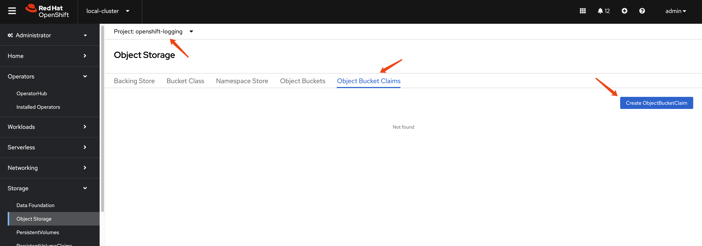
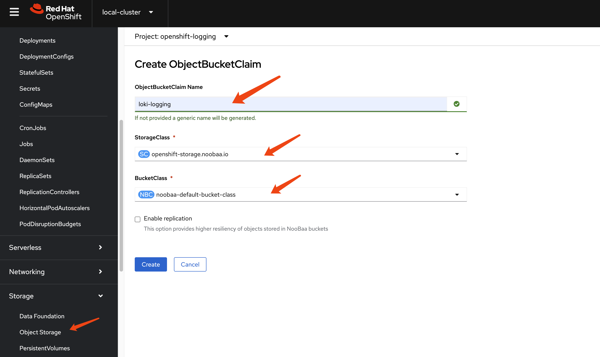
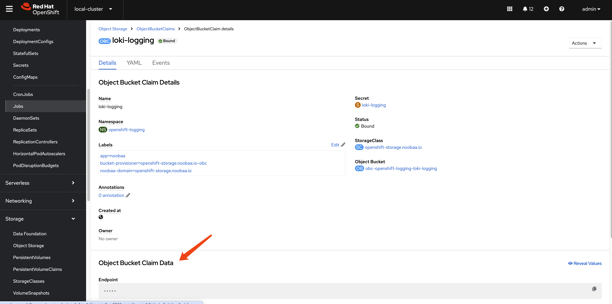

# Logging, Loki

- https://docs.redhat.com/en/documentation/openshift_container_platform/4.16/html/logging/logging-6-2#log62-cluster-logging-support

1. install `Loki` operator

2. install `Red Hat OpenShift Logging` operator

3. install `Cluster Observability Operator (COO)` operator

4. create a `s3` storage in `odf`







5. create a secret

```yaml
apiVersion: v1
kind: Secret
metadata:
  name: loki-s3 
stringData:
  access_key_id: xxxxxxxxxxxxxxxxxxx
  access_key_secret: xxxxxxxxxxxxxxxxxxxxxxxxxxxxxx
  bucketnames: loki-logging-xxxxxxxxxxxxxxxxx
  endpoint: https://s3.openshift-storage.svc:443

```


6. create a `loki stack`


```yaml
apiVersion: loki.grafana.com/v1
kind: LokiStack
metadata:
  name: logging-loki 
  namespace: openshift-logging 
spec:
  size: 1x.demo
  storage:
    schemas:
    - version: v13
      effectiveDate: "2025-04-24"
    secret:
      name: loki-s3 
      type: s3 
  storageClassName: openshift-storage.noobaa.io
  tenants:
    mode: openshift-logging 
```

# end