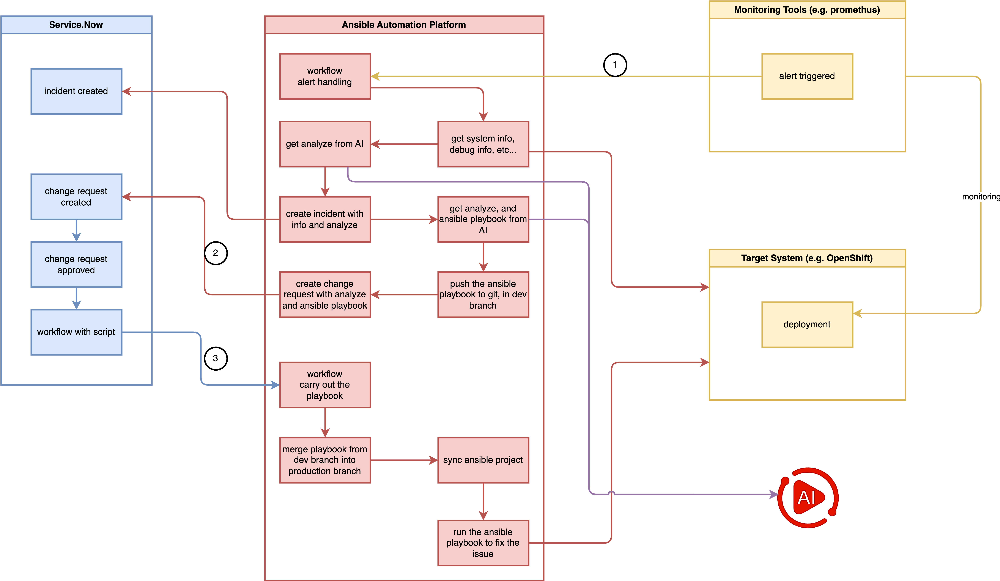
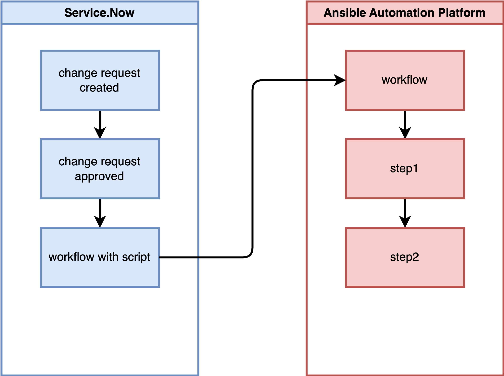

# integrate ansible platform with ai and eda

Red Hat publishes an AI-powered AAP solution with Service Now.


source:
- https://labs.demoredhat.com/
- https://interact.redhat.com/share/kCuEEAIeU2a8plQcDALz

We will try to implement the pattern, and improve it to fit our needs. Our proposed end-to-end solution will be implemented in a phased approach:



## testing service.now call aap webhook

Key points:
1. change request trigger workflow (in service now)
2. workflow approval (in service.now)
3. call aap workflow webhook (from service.now to aap)
4. pass parameter from service.now to aap workflow



overall process:
1. On Service Now, define a workflow that, upon detecting an approved change request, remotely invokes a workflow template on AAP, passing a parameter named 'playbook to run'.
2. On AAP, define a workflow:
   1. Step 1: Run project-a's playbook, outputting the message "step1 ok".
   2. Step 2: Resync project-b.
   3. Step 3: Run project-b's playbook based on the workflow's parameter 'playbook to run', outputting the message "step3 ok".

### workflow webhook setting in aap

We define a workflow in AAP and enable the `webhook` with type `gitlab`. Note down the `webhook url` and `webhook key`.


Then we define the workflow with two steps, both being very simple Ansible playbooks. We will use this pattern for later advanced logic.


the ansible source code:
- https://github.com/wangzheng422/ansible.service.now/blob/main/job.template/debug_message_step_01.yml
- https://github.com/wangzheng422/ansible.service.now/blob/main/job.template/debug_message_step_02.yml

The key point of the source code is how it gets extra variables from `Service Now`:
```yaml
  vars:
    playbook_to_run: "{{ awx_webhook_payload.gitlab_payload.playbook_to_run | default('default_playbook_value') }}"
```

We have a webhook, and we test it with a `curl` command. Through the `curl` command, we can obtain the payload and headers required for the webhook call.

> [!NOTE]
> change the project.id to correct aap project.

```bash

VAR_SHA=`date +"%Y-%m-%d %H:%M:%S"`

# change the project.id to correct aap project
cat << EOF > payload.json
{
  "ref": "refs/heads/main",
  "user_name": "Curl Manual Tester",
  "project": {
    "id": 41,
    "name": "service.now.demo.project",
    "web_url": "https://aap-aap.apps.cluster-snw5f-1.dynamic.redhatworkshops.io/execution/projects/41/details"
  },
  "commits": [
    {
      "id": "b6568db1bc1dcd7f8b4d5a946b0b91f9dacd7327",
      "message": "This is a test commit sent directly via curl.",
      "timestamp": "$VAR_SHA",
      "author": {
        "name": "Curl Tester",
        "email": "tester@example.com"
      }
    }
  ],
  "gitlab_payload": {
    "playbook_to_run": "job.template/wzh-dummy.test.yml"
  }
}
EOF

curl -X POST \
     -H "Content-Type: application/json" \
     -H "X-Gitlab-Token: $AAP_WEBHOOK_KEY" \
     -H "X-Gitlab-Event: Push Hook" \
     -d '@payload.json' \
     "$AAP_WEBHOOK_URL"

# output should be:
# {"message":"Job queued."}

```

### rest message setting in service.now

The AAP webhook is working. Next, we will define a workflow in Service Now that monitors change request approvals and triggers the AAP workflow with parameters.

<!--  -->

First, we define an `outbound REST message`:


Click `new`


Give it a name like `aap webhook demo`, provide the webhook URL, and define the `POST` method.


For the `POST` method, provide a name, webhook URL, headers, and payload content. The payload content will serve as a template for later use.


Use the payload content below as an example. Change the `project.id` to your project ID.

```js
{
  "ref": "refs/heads/main",
  "user_name": "Curl Manual Tester",
  "project": {
    "id": 41,
    "name": "service.now.demo.project",
    "web_url": "https://example.com/execution/projects/41/details"
  },
  "commits": [
    {
      "id": "1111111111111111111",
      "message": "This is a test commit sent directly via curl.",
      "timestamp": "${commit_timestamp}",
      "author": {
        "name": "Curl Tester",
        "email": "tester@example.com"
      }
    }
  ],
  "gitlab_payload": {
    "playbook_to_run": "${playbook_to_run}"
  }
}
```

The `${commit_timestamp}` and `${playbook_to_run}` are variables that can be defined and replaced during the workflow in Service Now.

### workflow setting in service.now

Now we define a workflow to use the REST message.


Create `new workflow`


Give the workflow a `name` and configure it to monitor the `change request` table.


Configure the workflow to run `always`, with the condition that the `approval` `is` `approved`.


In the workflow, add a step `run script`


Give the `run script` step a name and set the script content.


For the source code, you can use the following as an example.

```js
(function() {
    /**
     * This function parses the playbook path from work notes.
     * It searches for the keyword "playbook_to_run:" line by line, starting from the latest log entry.
     * @returns {string|null} - The playbook path if found; otherwise, null.
     */
    function getPlaybookFromWorkNotes() {
        // Get all work note entries; -1 means get all. Returns a long string with entries separated by \n\n.
        var workNotes = current.work_notes.getJournalEntry(-1);
        
        // Split log content by line
        var lines = workNotes.split('\n');

        // Iterate through lines, starting from the latest log
        for (var i = 0; i < lines.length; i++) {
            var currentLine = lines[i].trim(); // Trim whitespace from line ends

            // Check if the current line starts with "playbook_to_run:" (case-insensitive)
            if (currentLine.toLowerCase().startsWith('playbook_to_run:')) {
                // Keyword found, now extract the value after the colon
                var parts = currentLine.split(':');
                // Remove the first part (i.e., the keyword "playbook_to_run"), then recombine the remaining parts
                // This is done to prevent the playbook path itself from containing colons
                parts.shift();
                var playbookPath = parts.join(':').trim(); // Recombine and trim whitespace
                
                // Ensure the extracted path is not empty
                if (playbookPath) {
                    workflow.info("Playbook found in Work Notes: " + playbookPath);
                    return playbookPath; // Return the found path
                }
            }
        }
        
        // If not found after iterating through all lines, return null
        workflow.warn("Keyword 'playbook_to_run:' not found in Work Notes.");
        return null;
    }

    // --- Main execution logic ---
    var playbookToRun = getPlaybookFromWorkNotes();

    // Only execute the Webhook call if the playbook path is successfully extracted
    if (playbookToRun) {
        try {
            var r = new sn_ws.RESTMessageV2('aap webhook demo', 'aap post');

            // r.setStringParameterNoEscape('playbook_to_run', current.variables.script_to_run);

            var currentDateTime = new GlideDateTime().getValue(); // Gets current time in 'yyyy-MM-dd HH:mm:ss' format
            r.setStringParameterNoEscape('commit_timestamp', currentDateTime);

            
            // Key: Use the playbook path extracted from Work Notes as the value for the 'playbook_to_run' parameter
            r.setStringParameterNoEscape('playbook_to_run', playbookToRun);
            
            // In your REST Message, you also need the ${commit_timestamp} variable
            r.setStringParameterNoEscape('commit_timestamp', new GlideDateTime().getValue());

            var response = r.execute();
            var httpStatus = response.getStatusCode();

            if (httpStatus == 200) {
                workflow.info("Successfully sent data to Webhook, Playbook: " + playbookToRun);
            } else {
                workflow.error("Failed to send data to Webhook. Status code: " + httpStatus);
            }

        } catch (ex) {
            var message = ex.getMessage();
            workflow.error("An exception occurred while calling the Webhook: " + message);
        }
    } else {
        // If no playbook is found, define appropriate handling logic here, e.g., end workflow or set status
        workflow.info("Webhook call skipped because no playbook was found in Work Notes.");
    }
})();
```

### testing

We have defined the workflow in Service Now, and now we can test it.

Create a new change request.


Select a type of change request.


Give it a name and add `work notes`, for example: `playbook_to_run: 3344/5566.yml`


Find the change request created and open it.


Click on the change request.


Assign to a group, and click `request approval`


For testing, as an administrator, we can select a user to approve it.


The webhook is triggered, and we can see the webhook details in AAP, including the received parameter.


The workflow runs smoothly.


# end