# integrate ansible platform with ai and eda

usecase point or technical point

1. EDA trigger a workflow, not just a job?
2. workflow approve?


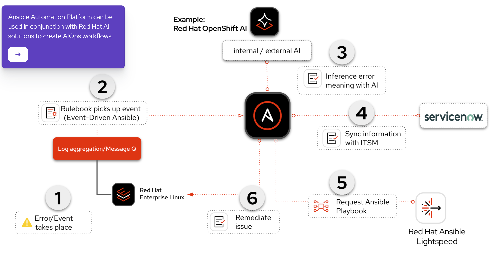

- https://labs.demoredhat.com/
- https://interact.redhat.com/share/kCuEEAIeU2a8plQcDALz

## testing service.now call aap webhook

key point:
1. change request trigger workflow (in service now)
2. workflow approval (in service.now)
3. call aap workflow webhook (from service.now to aap)
4. pass parameter from service.now to aap workflow


overall process:
1. On Service Now, define a workflow that, upon detecting an approved change request, remotely invokes a workflow template on AAP, passing a parameter named 'playbook to run'.
2. On AAP, define a workflow:
   1. Step 1: Run project-a's playbook, outputting the message "step1 ok".
   2. Step 2: Resync project-b.
   3. Step 3: Run project-b's playbook based on the workflow's parameter 'playbook to run', outputting the message "step3 ok".

We define a workflow in aap, and enable `webhook`, with type `gitlab`, write down the `webhook url` and `webhook key`.

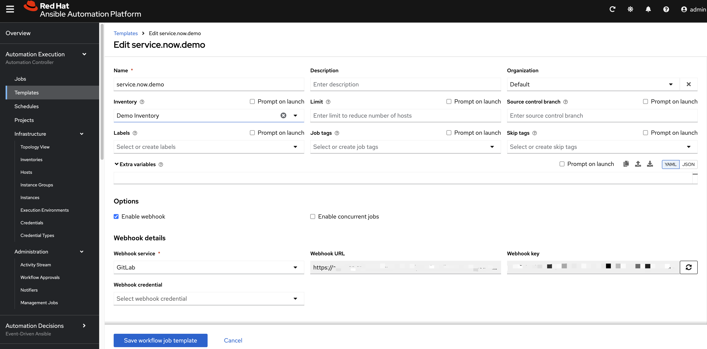

Then we define the workflow, with 2 step, both are very simple ansible playbook, we will use this pattern for later advanced logic.

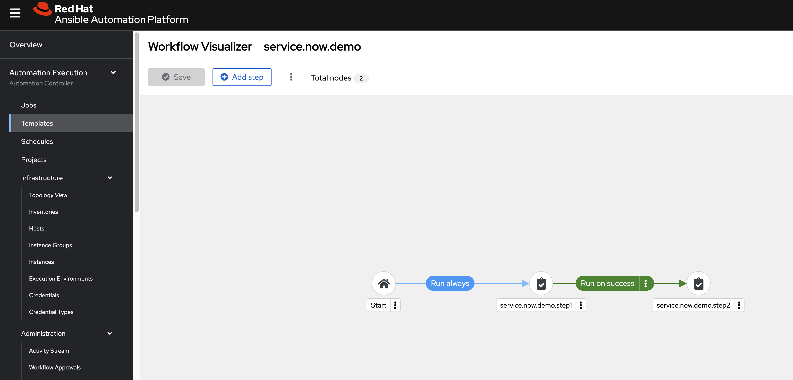

the ansible source code:
- https://github.com/wangzheng422/ansible.service.now/blob/main/job.template/debug_message_step_01.yml
- https://github.com/wangzheng422/ansible.service.now/blob/main/job.template/debug_message_step_02.yml

The keypoint of the source code, is how it get extra vars from `service.now`:
```yaml
  vars:
    playbook_to_run: "{{ awx_webhook_payload.gitlab_payload.playbook_to_run | default('default_playbook_value') }}"
```

We have a webhook, we test it out with a `curl` command. Through the `curl` command, we can get the payload and headers needed during the webhook call.

> [!NOTICE]
> change the project.id to correct aap project.

```bash

VAR_SHA=`date +"%Y-%m-%d %H:%M:%S"`

# change the project.id to correct aap project
cat << EOF > payload.json
{
  "ref": "refs/heads/main",
  "user_name": "Curl Manual Tester",
  "project": {
    "id": 41,
    "name": "service.now.demo.project",
    "web_url": "https://aap-aap.apps.cluster-snw5f-1.dynamic.redhatworkshops.io/execution/projects/41/details"
  },
  "commits": [
    {
      "id": "b6568db1bc1dcd7f8b4d5a946b0b91f9dacd7327",
      "message": "This is a test commit sent directly via curl.",
      "timestamp": "$VAR_SHA",
      "author": {
        "name": "Curl Tester",
        "email": "tester@example.com"
      }
    }
  ],
  "gitlab_payload": {
    "playbook_to_run": "job.template/wzh-dummy.test.yml"
  }
}
EOF

curl -X POST \
     -H "Content-Type: application/json" \
     -H "X-Gitlab-Token: $AAP_WEBHOOK_KEY" \
     -H "X-Gitlab-Event: Push Hook" \
     -d '@payload.json' \
     "$AAP_WEBHOOK_URL"

# output should be:
# {"message":"Job queued."}

```

The aap webhook is working, next, we will define a workflow in service.now, which will monitor change request's approval, and trigger the aap workflow with parameter.

<!-- 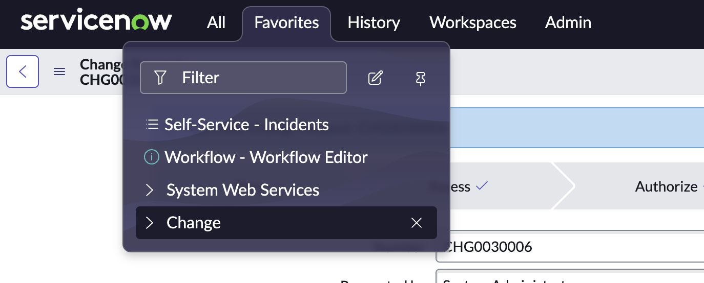 -->

First, we define a `outbound rest message`:

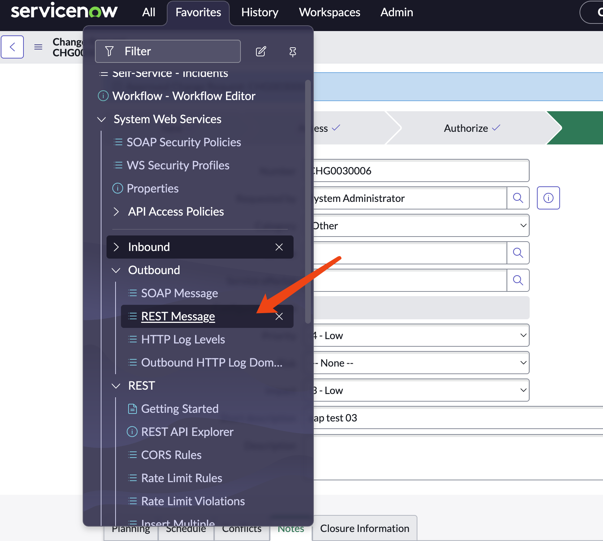

Click `new`

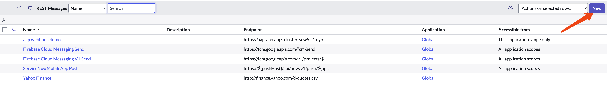

Give the name like `aap webhook demo`, and webhook url, and define the `POST` method.

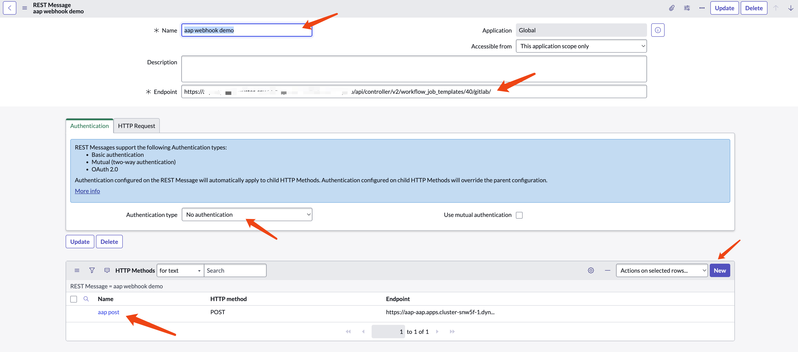

For the `POST` method, give it name, webhook url, headers, and payload content. You need the payload content as template, so later, you can use the template later.

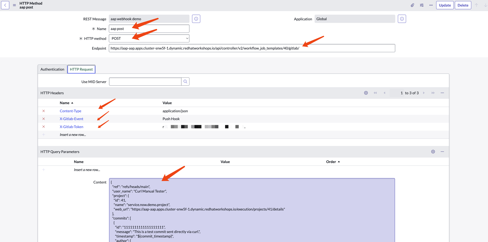

For the source code, you can use following as example.

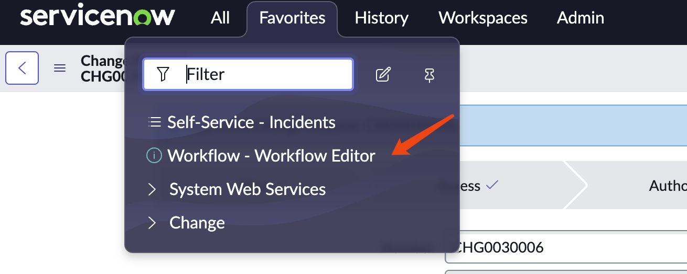

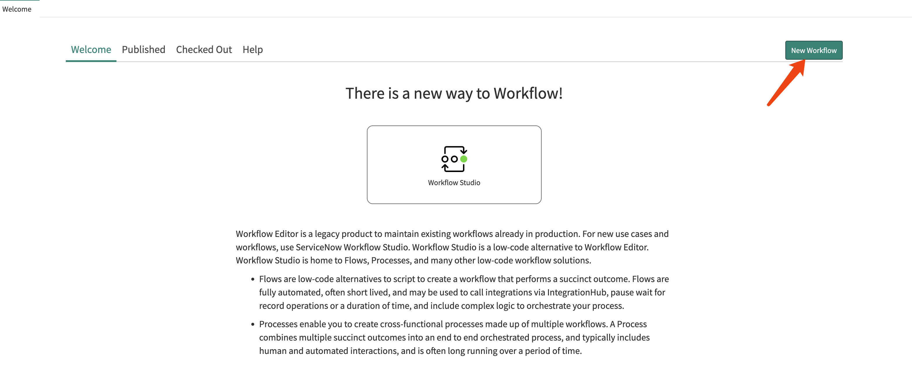

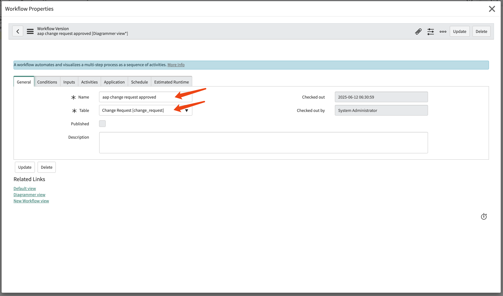

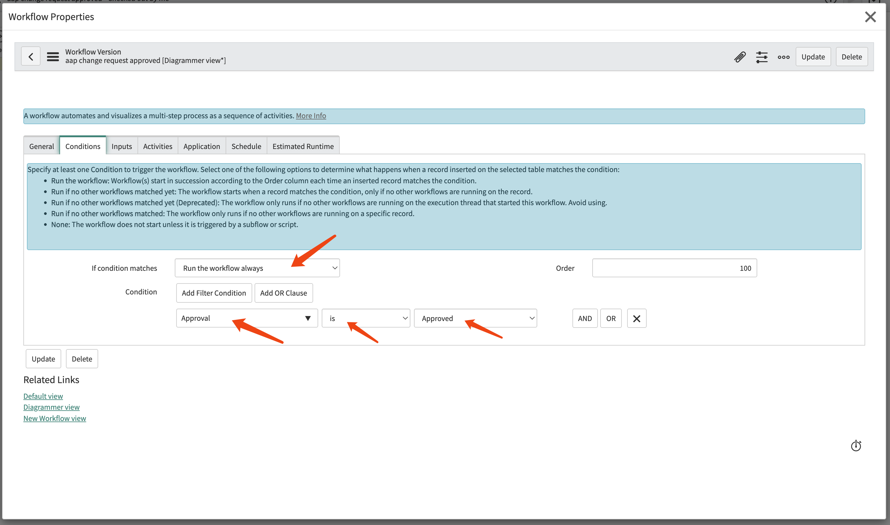

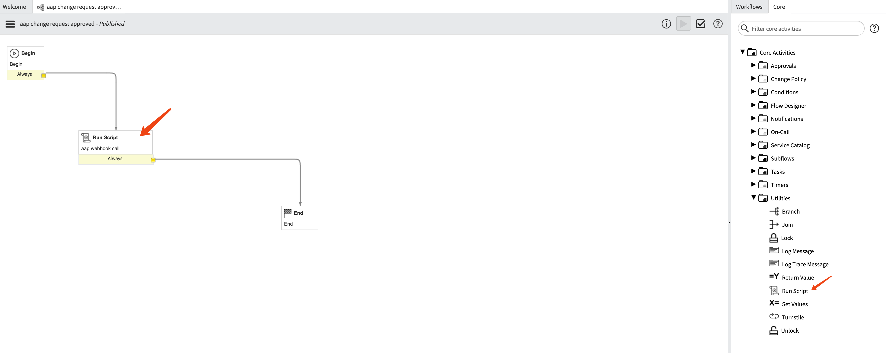

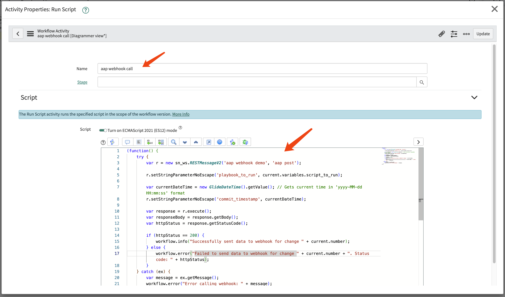


```js
(function() {
    /**
     * 此函数用于从工作日志中解析 playbook 的路径。
     * 它会从最新的日志开始，逐行查找关键字 "playbook_to_run:"。
     * @returns {string|null} - 如果找到，则返回 playbook 路径；否则返回 null。
     */
    function getPlaybookFromWorkNotes() {
        // 获取所有工作日志条目，-1代表获取全部。返回的是一个长字符串，各项由 \n\n 分隔。
        var workNotes = current.work_notes.getJournalEntry(-1);
        
        // 按行分割日志内容
        var lines = workNotes.split('\n');

        // 从最新的日志开始，逐行遍历
        for (var i = 0; i < lines.length; i++) {
            var currentLine = lines[i].trim(); // 清除行首尾的空格

            // 检查当前行是否以 "playbook_to_run:" 开头（不区分大小写）
            if (currentLine.toLowerCase().startsWith('playbook_to_run:')) {
                // 找到了关键字，现在提取冒号后面的值
                var parts = currentLine.split(':');
                // 移除第一部分（即关键字 "playbook_to_run"），然后将剩余部分重新组合
                // 这样做是为了防止 playbook 路径本身也包含冒号
                parts.shift(); 
                var playbookPath = parts.join(':').trim(); // 重新组合并清除首尾空格
                
                // 确保提取到的路径不为空
                if (playbookPath) {
                    workflow.info("在 Work Notes 中找到 Playbook: " + playbookPath);
                    return playbookPath; // 返回找到的路径
                }
            }
        }
        
        // 如果遍历完所有行都没有找到，则返回 null
        workflow.warn("在 Work Notes 中未找到 'playbook_to_run:' 关键字。");
        return null;
    }

    // --- 主执行逻辑 ---
    var playbookToRun = getPlaybookFromWorkNotes();

    // 只有在成功提取到 playbook 路径时，才执行 Webhook 调用
    if (playbookToRun) {
        try {
            var r = new sn_ws.RESTMessageV2('aap webhook demo', 'aap post');

            // r.setStringParameterNoEscape('playbook_to_run', current.variables.script_to_run); 

            var currentDateTime = new GlideDateTime().getValue(); // Gets current time in 'yyyy-MM-dd HH:mm:ss' format
            r.setStringParameterNoEscape('commit_timestamp', currentDateTime);

            
            // 关键：将从 Work Notes 中提取的 playbook 路径作为 'script_to_run' 参数的值
            r.setStringParameterNoEscape('playbook_to_run', playbookToRun);
            
            // 在您的 REST Message 中，也需要有 ${commit_timestamp} 这个变量
            r.setStringParameterNoEscape('commit_timestamp', new GlideDateTime().getValue());

            var response = r.execute();
            var httpStatus = response.getStatusCode();

            if (httpStatus == 200) {
                workflow.info("成功发送数据到 Webhook，Playbook: " + playbookToRun);
            } else {
                workflow.error("发送数据到 Webhook 失败。状态码: " + httpStatus);
            }

        } catch (ex) {
            var message = ex.getMessage();
            workflow.error("调用 Webhook 时发生异常: " + message);
        }
    } else {
        // 如果没有找到 playbook，在这里可以定义相应的处理逻辑，例如结束工作流或设置状态
        workflow.info("因未在 Work Notes 中找到 playbook，Webhook 调用被跳过。");
    }
})();
```

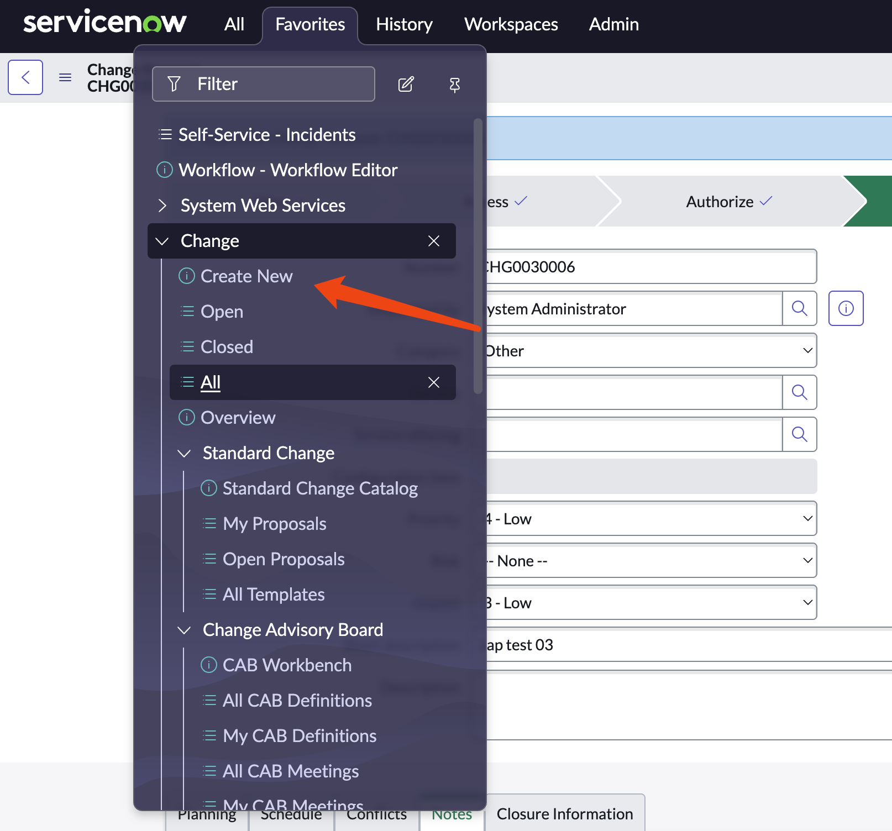


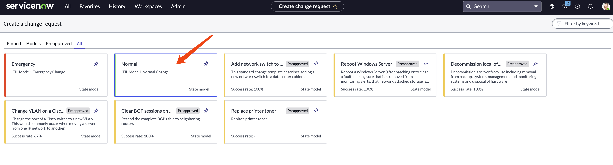

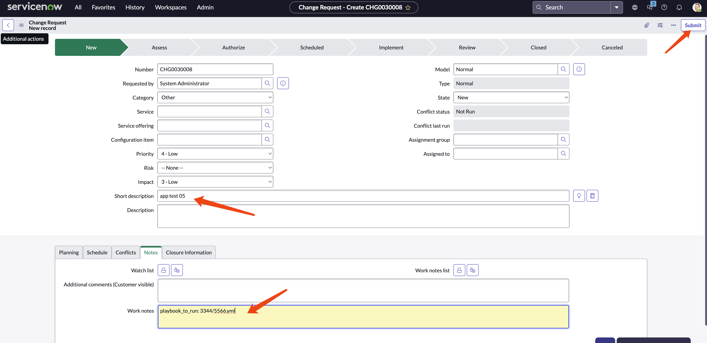

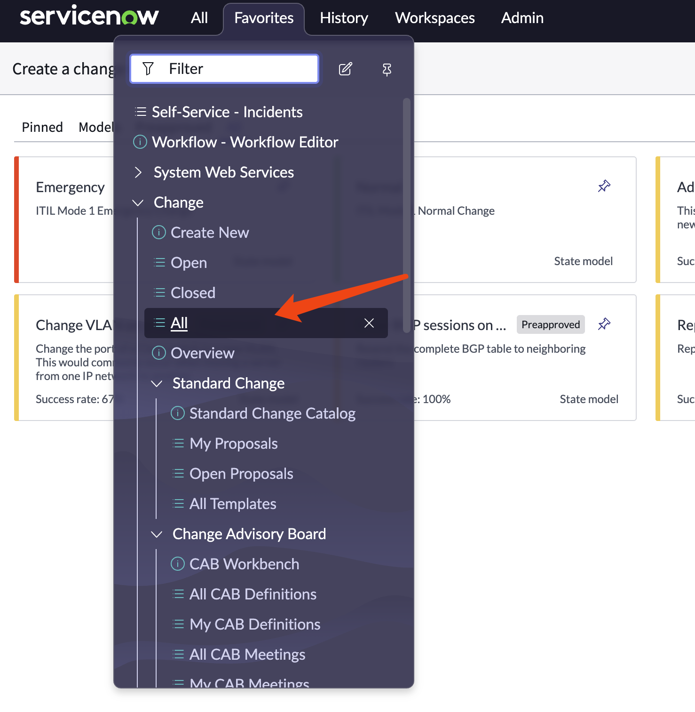

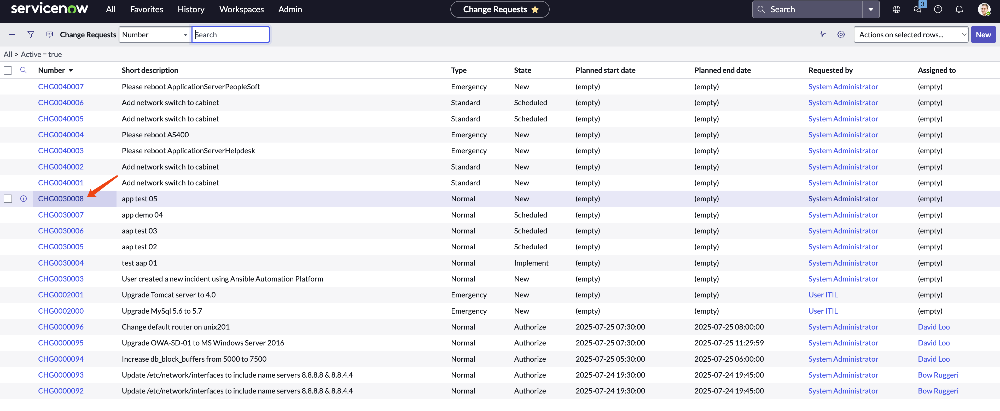

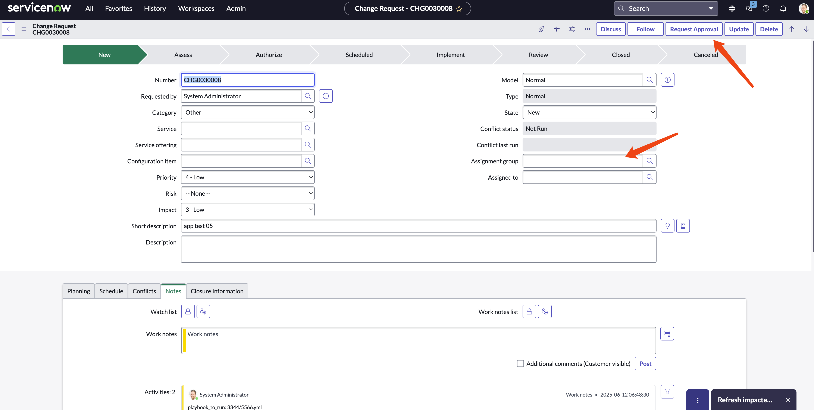

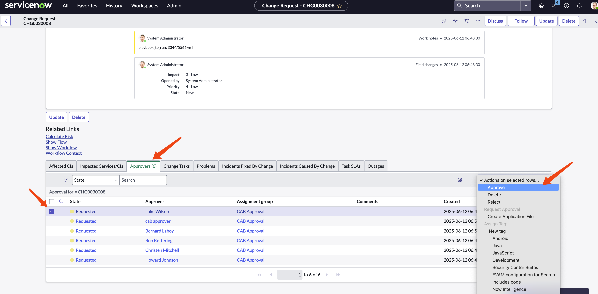


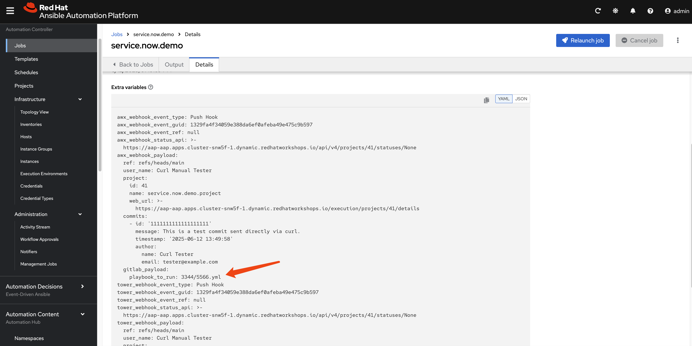

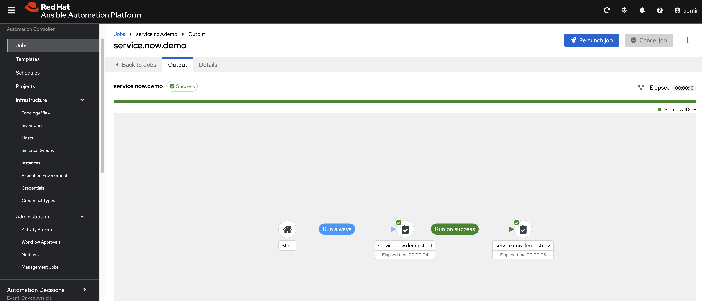


# end