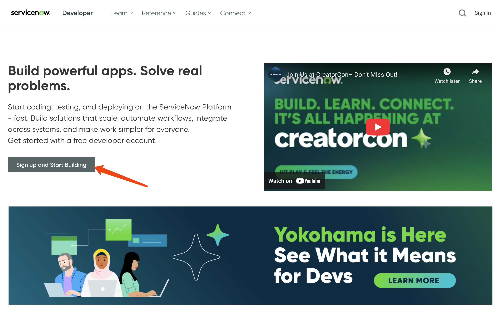
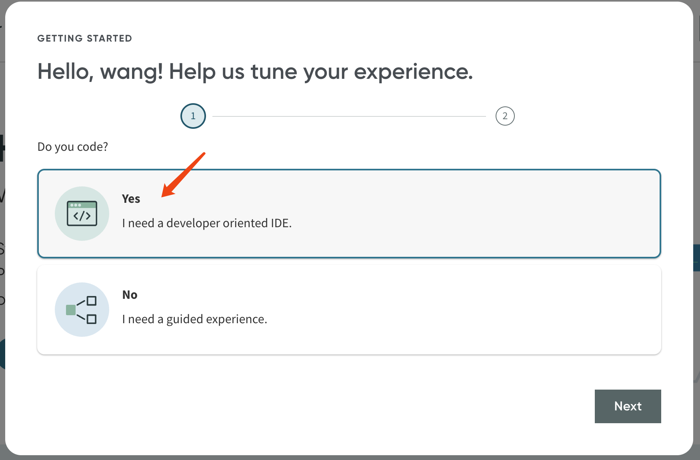
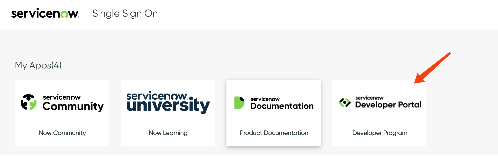
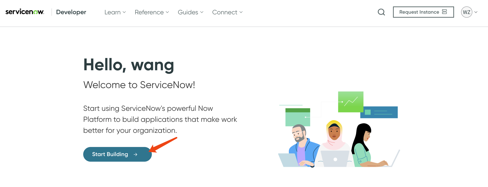
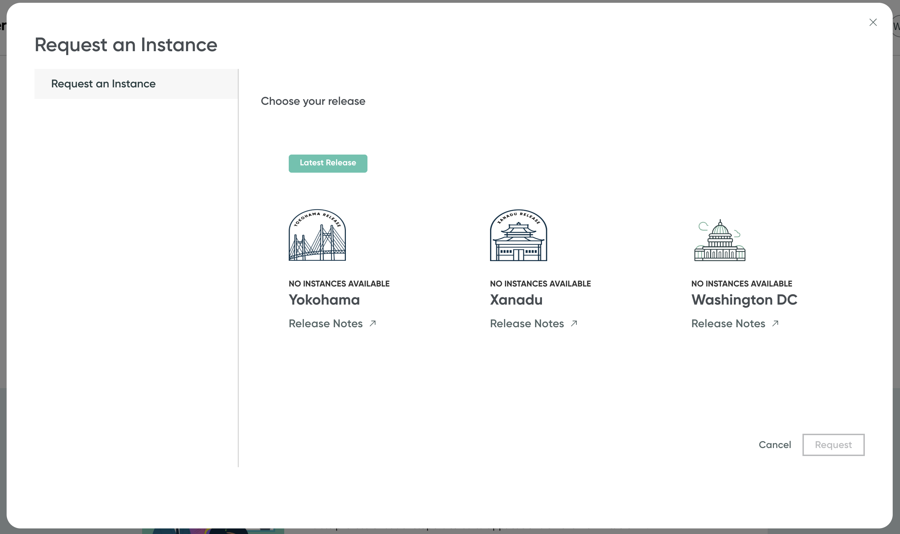
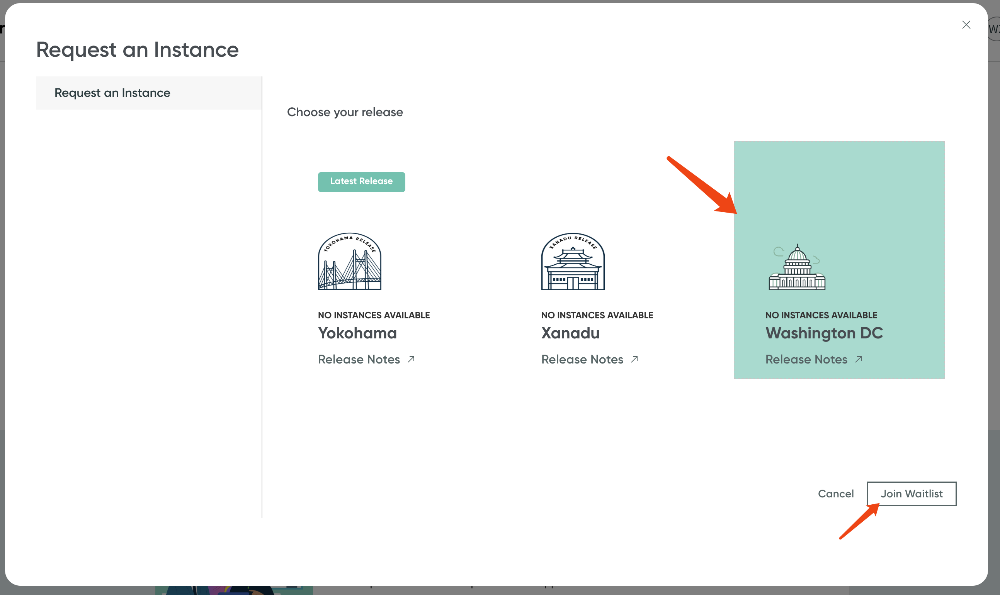

> [!CAUTION]
> work in progress
# integrate ansible with service now

usecase point or technical point

1. EDA trigger a workflow, not just a job?
2. ansible workflow approve?
3. 

# service.now instance

Following https://developer.servicenow.com/dev.do , and click `sign up and start building`

After sign up and login, you will be asked such questions.

Or maybe you will be redirect to another webpage, select `developer program`,

Then, `start building`

# end