> [!NOTE]
> Continuous improvement ongoing.
# Integrate Ansible Platform with ServiceNow

In this article, we will discuss how to integrate the Ansible Platform with ServiceNow.

We will cover the following steps:
1. Create a ServiceNow Developer Instance
2. Create ServiceNow Credentials in AAP
3. Run a Job in AAP to Create an Incident.

# ServiceNow Instance

Navigate to https://developer.servicenow.com/dev.do and click `Sign Up and Start Building`.


After signing up and logging in, you will be prompted with questions.

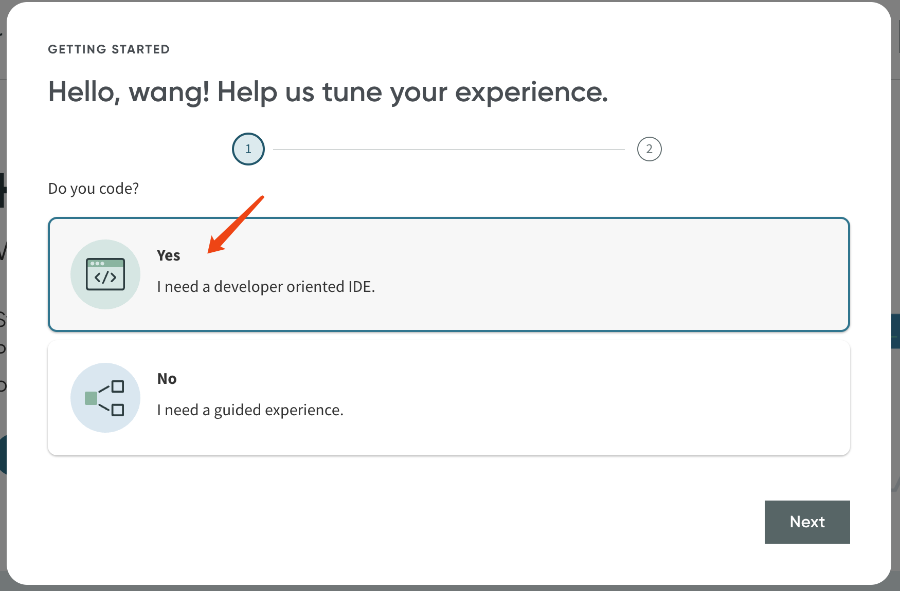

Alternatively, you may be redirected to another webpage; select `Developer Program`.

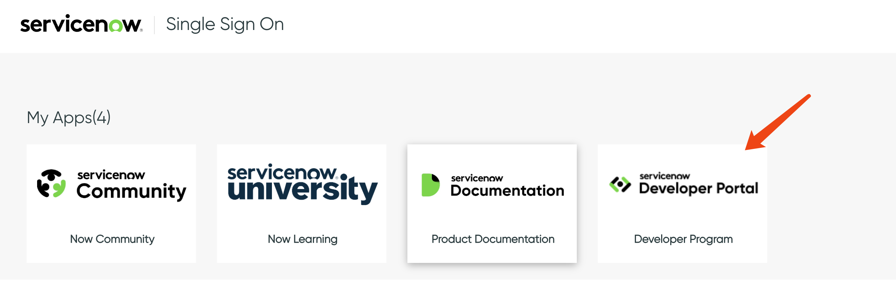

Then, `start building`

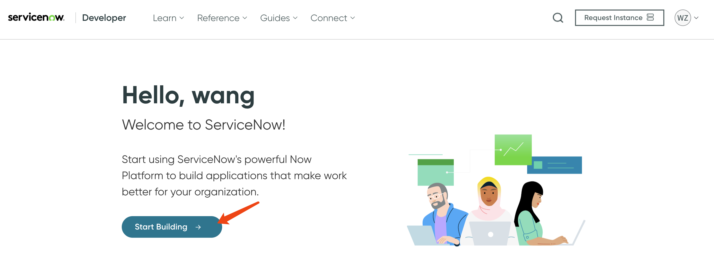

Select an instance type, preferably the newest one, `Yokohama`.

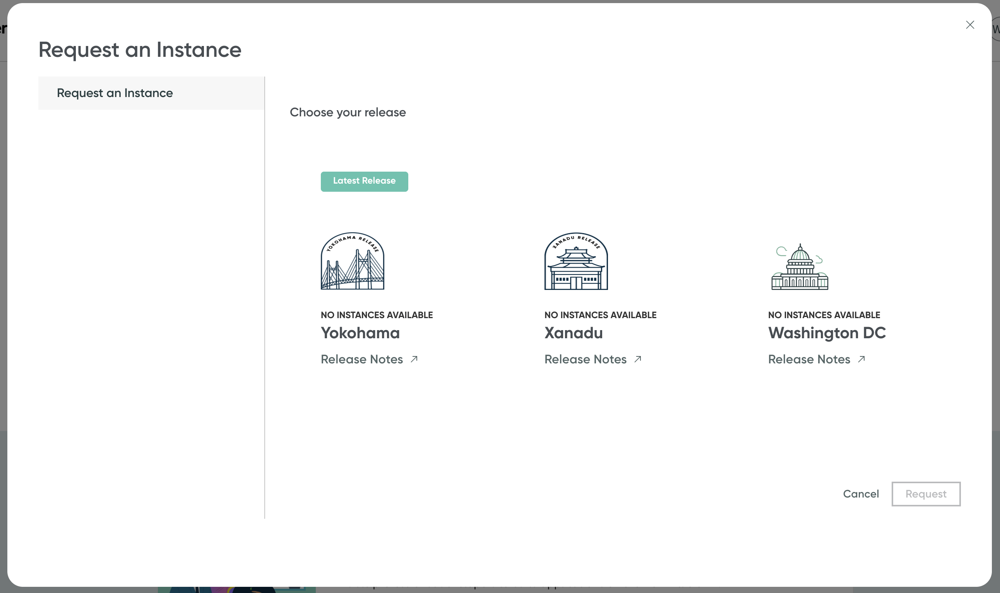

<!-- 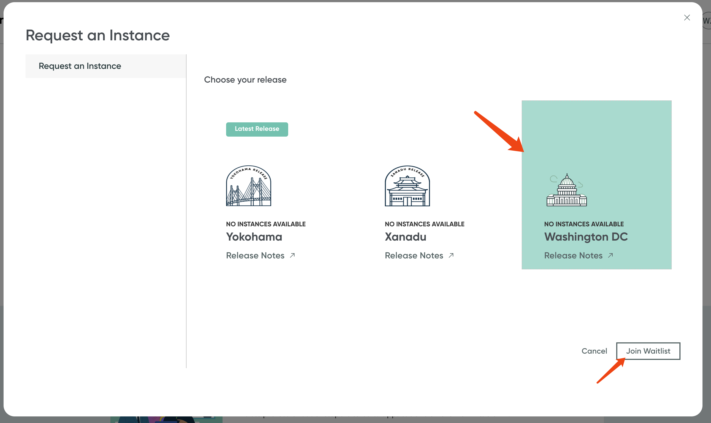 -->

You will then be prompted with a URL and password similar to this:

> Your instance URL: https://devxxxxxxxxx.service-now.com
>
> Username: admin
> Current password: Qhxxxxxxxxxxx

If you did not receive the URL and password for any reason, you can retrieve them by accessing your profile page.

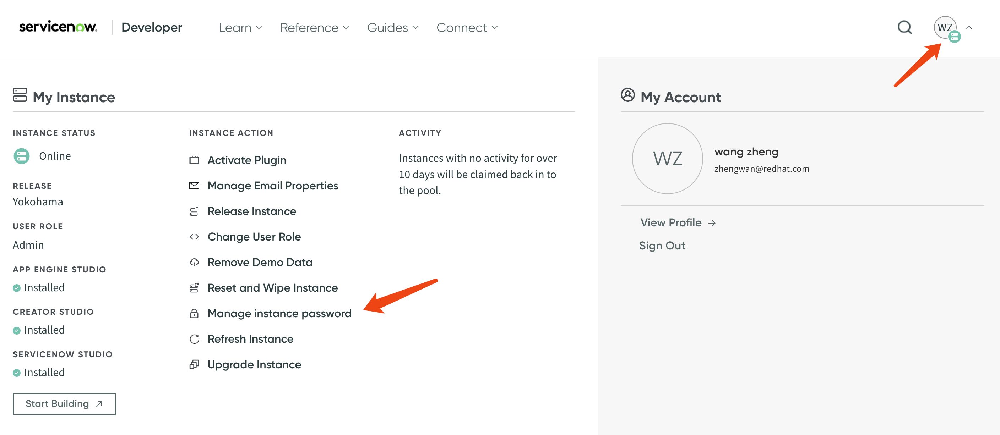

Here is the url, username, and password.

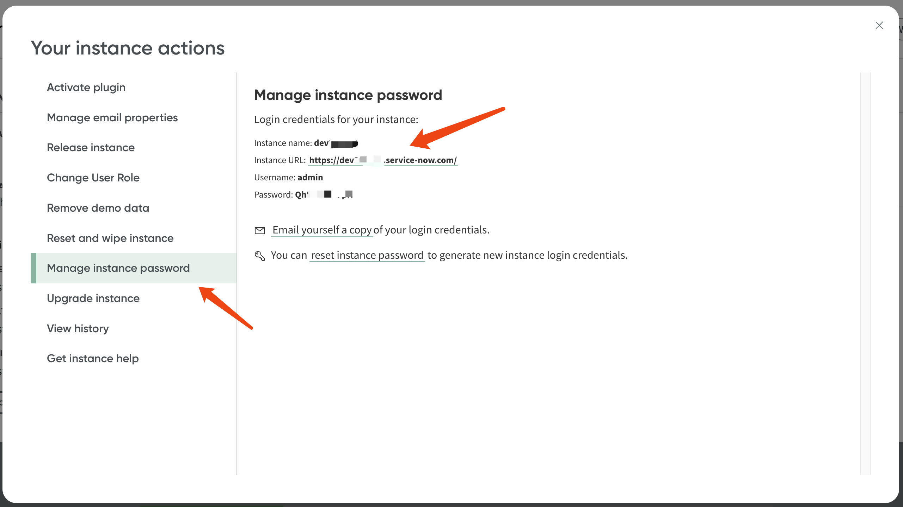


<!-- We need to install ansible plugin/app into service.now, but we only have developer instance, it does not support install ansible plugin, so we need some workaround.

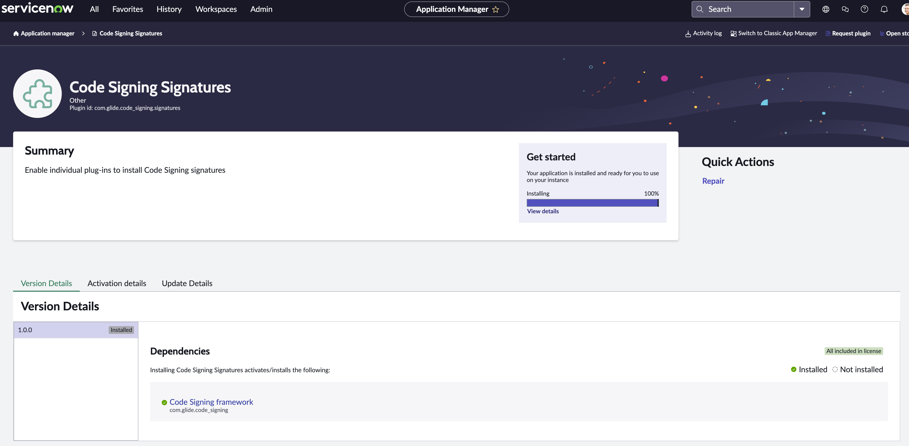

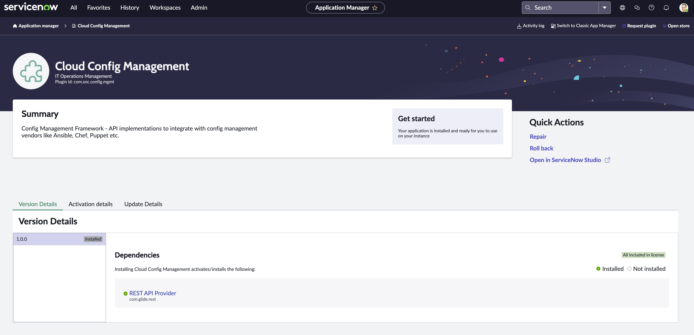


in `system application` 

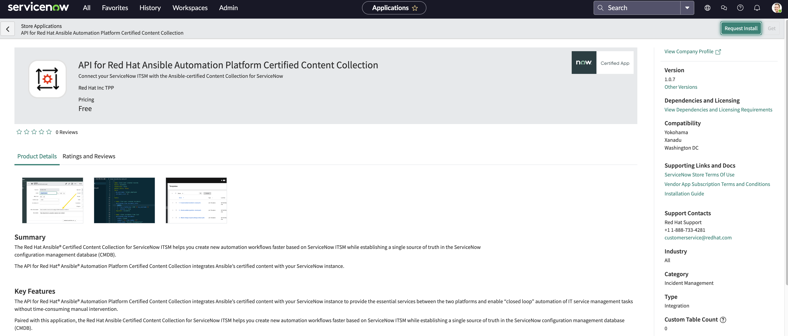 -->

And go to ansible platform, we will define a `credential type` for service.now.

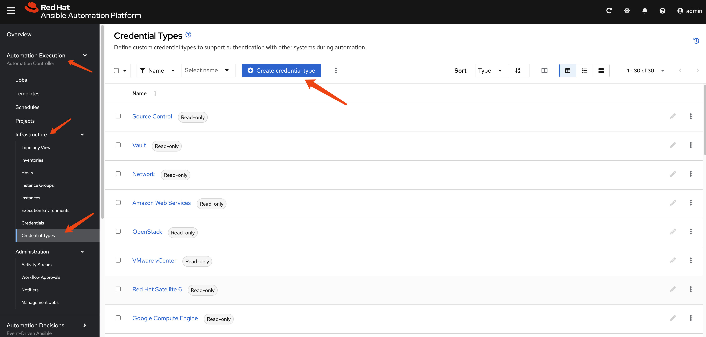

Set the parameters using following example:
```yaml
fields:
  - id: SNOW_USERNAME
    type: string
    label: Service Now Username
  - id: SNOW_INSTANCE
    type: string
    label: Service Now Instance Name (https://devXXXXX.service-now.com)
  - id: SNOW_PASSWORD
    type: string
    label: Service Now Password
    secret: true
required:
  - SNOW_USERNAME
  - SNOW_INSTANCE
  - SNOW_PASSWORD
```

```yaml
extra_vars:
  snow_instance: '{{ SNOW_INSTANCE }}'
  snow_password: '{{ SNOW_PASSWORD }}'
  snow_username: '{{ SNOW_USERNAME }}'
```

In the setting phase, it should looks like this.

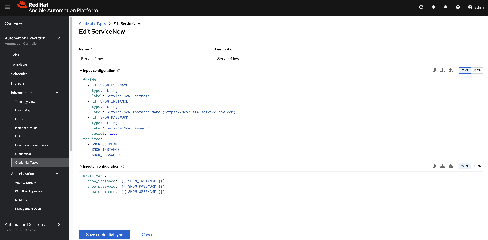

After save the `credential type`, the result should looks like:

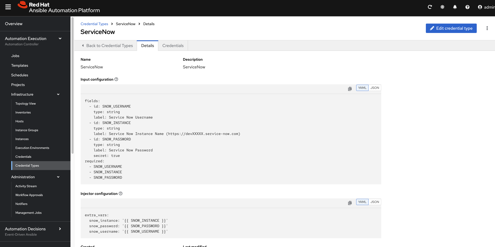

Then, we define the `credential` for our service.now dev instance.

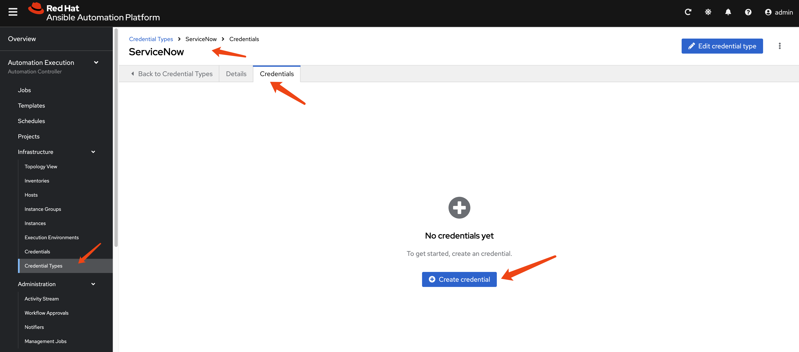

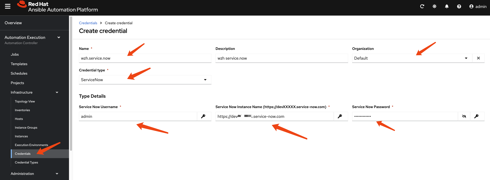

# Check Execution Environment

> [!NOTE]
> We do not need to compile a new EE image, as it contains the ServiceNow collection.

The AAP 2.5 built-in EE supported image is `registry.redhat.io/ansible-automation-platform-25/ee-supported-rhel8`, and it includes the ServiceNow Ansible collections.

```bash

podman run -it --rm registry.redhat.io/ansible-automation-platform-25/ee-supported-rhel9 bash -c 'ls /usr/share/ansible/collections/ansible_collections -lh'
# total 4.0K
# drwxr-xr-x.  3 root root   17 May 15 20:13 amazon
# drwxr-xr-x. 15 root root  186 May 15 20:13 ansible
# drwxr-xr-x.  3 root root   17 May 15 20:13 arista
# drwxr-xr-x.  6 root root   53 May 15 20:13 cisco
# drwxr-xr-x.  4 root root   37 May 15 20:13 cloud
# drwxr-xr-x.  3 root root   17 May 15 20:13 frr
# drwxr-xr-x.  3 root root   20 May 15 20:13 ibm
# drwxr-xr-x.  3 root root   19 May 15 20:13 junipernetworks
# drwxr-xr-x.  3 root root   18 May 15 20:13 kubernetes
# drwxr-xr-x.  3 root root   16 May 15 20:13 microsoft
# drwxr-xr-x.  3 root root   25 May 15 20:13 openvswitch
# drwxr-xr-x. 21 root root 4.0K May 15 20:13 redhat
# drwxr-xr-x.  3 root root   28 May 15 20:13 sap
# drwxr-xr-x.  3 root root   18 May 15 20:13 servicenow
# drwxr-xr-x.  3 root root   16 May 15 20:13 splunk
# drwxr-xr-x.  3 root root   21 May 15 20:13 trendmicro
# drwxr-xr-x.  4 root root   39 May 15 20:13 vmware
# drwxr-xr-x.  3 root root   18 May 15 20:13 vyos

podman run -it --rm registry.redhat.io/ansible-automation-platform-25/ee-supported-rhel8 bash -c 'ls /usr/share/ansible/collections/ansible_collections -lh'
# total 4.0K
# drwxr-xr-x.  3 root root   17 May 15 20:14 amazon
# drwxr-xr-x. 15 root root  186 May 15 20:14 ansible
# drwxr-xr-x.  3 root root   17 May 15 20:14 arista
# drwxr-xr-x.  6 root root   53 May 15 20:14 cisco
# drwxr-xr-x.  4 root root   37 May 15 20:14 cloud
# drwxr-xr-x.  3 root root   17 May 15 20:14 frr
# drwxr-xr-x.  3 root root   20 May 15 20:14 ibm
# drwxr-xr-x.  3 root root   19 May 15 20:14 junipernetworks
# drwxr-xr-x.  3 root root   18 May 15 20:14 kubernetes
# drwxr-xr-x.  3 root root   16 May 15 20:14 microsoft
# drwxr-xr-x.  3 root root   25 May 15 20:14 openvswitch
# drwxr-xr-x. 21 root root 4.0K May 15 20:14 redhat
# drwxr-xr-x.  3 root root   28 May 15 20:14 sap
# drwxr-xr-x.  3 root root   18 May 15 20:14 servicenow
# drwxr-xr-x.  3 root root   16 May 15 20:14 splunk
# drwxr-xr-x.  3 root root   21 May 15 20:14 trendmicro
# drwxr-xr-x.  4 root root   39 May 15 20:14 vmware
# drwxr-xr-x.  3 root root   18 May 15 20:14 vyos

```

# Test with AAP Job

We will use a job template to deploy an Ansible Playbook that will create an incident in ServiceNow. The source code is available here:
- https://github.com/wangzheng422/ansible.service.now/blob/main/job.template/incident-create.yml

First, we need to define an AAP `Project`, which links the GitHub repository into AAP.

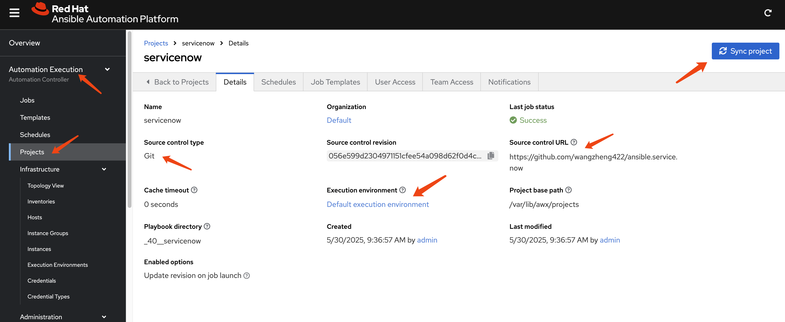

Next, we create a `Job Template`, which selects an Ansible Playbook from the `Project` and executes it.

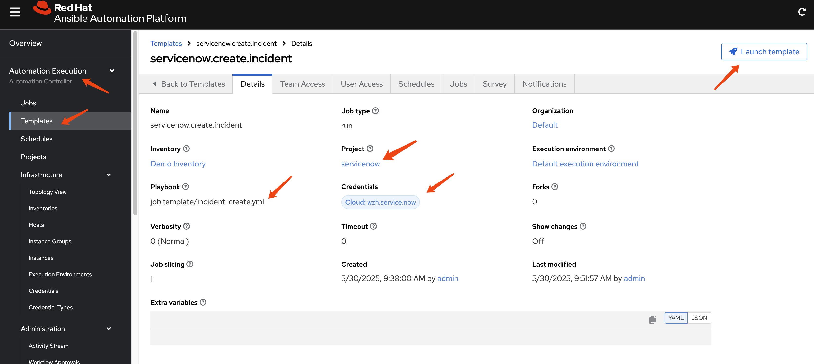

Launch the `Job Template` and check the `Job` status and output.

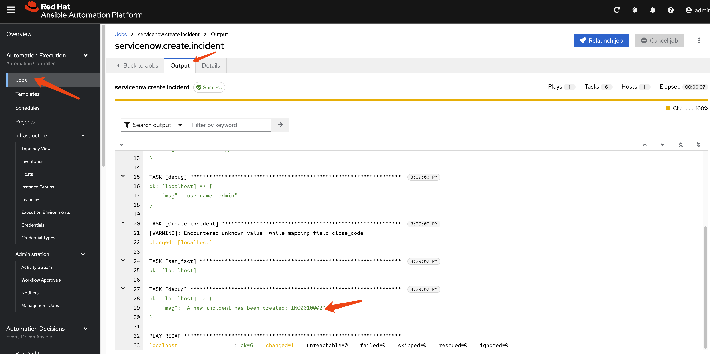

Navigate to your `ServiceNow` instance, and you will see that a new incident has been created.

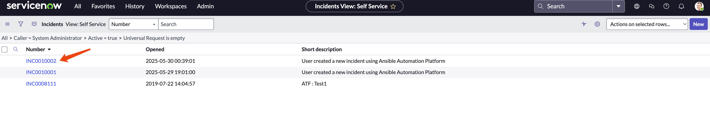

Check the details of the newly created incident.

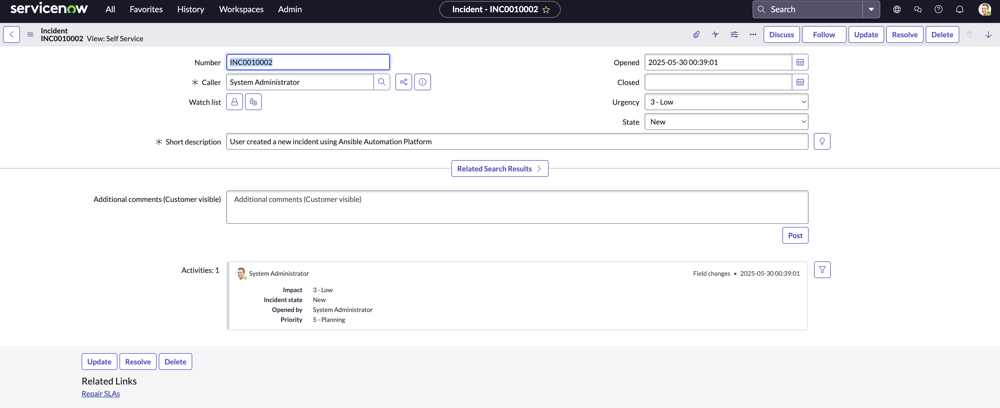


