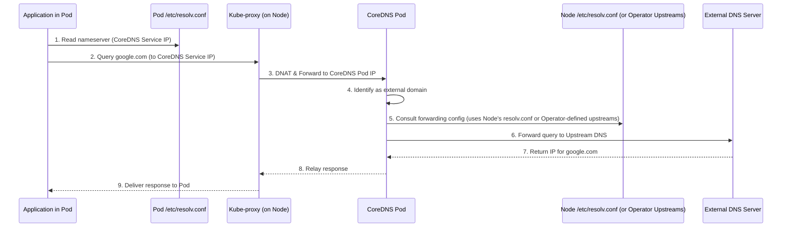
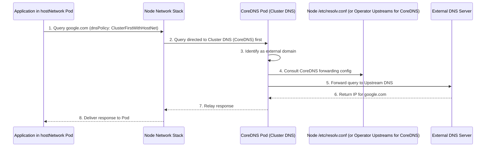
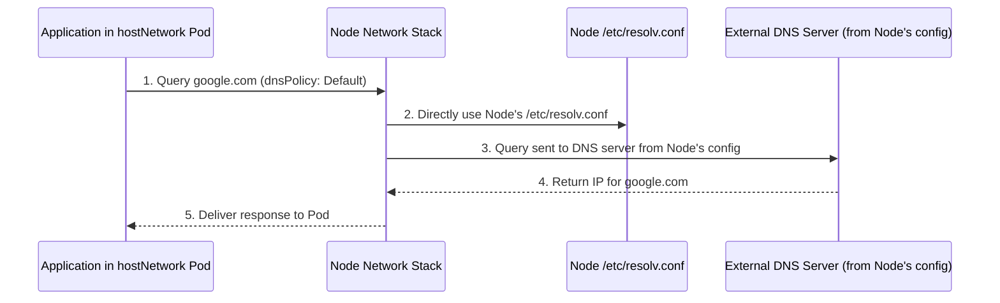

# DNS Request Handling in OpenShift 4.18: A Comprehensive Analysis

## I. Introduction to DNS in OpenShift 4.18

### A. The Critical Role of DNS in Kubernetes and OpenShift Ecosystems

Domain Name System (DNS) services are a cornerstone of network communication within Kubernetes and, by extension, OpenShift Container Platform. In highly dynamic microservices architectures, where application components are encapsulated in pods, DNS provides an indispensable abstraction layer for service discovery and inter-service communication. Applications within the cluster rely on stable DNS names to locate and connect to other services, rather than depending on ephemeral IP addresses that can change frequently as pods are created, destroyed, rescheduled, or scaled. This decoupling is vital for maintaining application connectivity and resilience in environments characterized by constant change. OpenShift leverages this Kubernetes-native DNS mechanism not only for resolving internal cluster resources, such as services and pods, but also for facilitating communication with services external to the cluster.

### B. CoreDNS: The Default DNS Provider in OpenShift 4.18

OpenShift Container Platform 4.18 employs CoreDNS as its default in-cluster DNS server. CoreDNS is a flexible, extensible, and cloud-native DNS server that integrates deeply with Kubernetes to provide DNS-based service discovery. It is responsible for resolving DNS queries for names within the cluster's domain (e.g., Kubernetes services and, in some configurations, pod hostnames) and for forwarding queries for external domain names to upstream DNS servers.

The selection of CoreDNS as the default DNS provider in OpenShift aligns with an industry-wide movement towards standardized, cloud-native DNS solutions. CoreDNS's architecture, which is based on a chain of plugins, offers significant flexibility. The `kubernetes` plugin, for instance, is central to its ability to serve DNS records for Kubernetes resources. While direct modification of the CoreDNS configuration file (Corefile) by administrators is generally managed and limited by the DNS Operator in OpenShift, the plugin architecture itself allows for a high degree of customization and extensibility in how DNS queries are processed. This design provides a robust out-of-the-box DNS service while retaining the potential for advanced configurations if needed, striking a balance between ease of use and powerful capabilities. This standardization also benefits operators and developers already familiar with Kubernetes, as the DNS mechanisms in OpenShift will be largely consistent with their existing knowledge, providing a solid foundation for managing complex network interactions within the cluster.

## II. Core DNS Components and Configuration in OpenShift 4.18

The DNS system in OpenShift 4.18 is composed of several interconnected components that work together to provide reliable name resolution. Understanding these components and their configuration is essential for managing and troubleshooting DNS within the cluster.

### A. The DNS Operator: Automated Management and Configuration

At the heart of OpenShift's DNS management is the DNS Operator. This specialized controller is responsible for the automated deployment, configuration, and lifecycle management of CoreDNS instances within the cluster. The DNS Operator is deployed as part of the initial OpenShift cluster installation process.

Key responsibilities of the DNS Operator include:

*   Deploying the CoreDNS application.
*   Creating the Kubernetes Service that exposes the CoreDNS pods.
*   Configuring the kubelet on each node to instruct pods to use the CoreDNS service's IP address for name resolution.

The health and status of the DNS Operator are critical for the overall functioning of DNS within the cluster. Administrators can monitor its status using the command `oc get clusteroperator/dns`. This command provides information about the Operator's availability, whether it's progressing through an update, or if it's in a degraded state.

Upon installation, every OpenShift cluster includes a default DNS custom resource (CR) named `default` (of kind `dns.operator.openshift.io/v1`). This CR serves as the primary configuration interface for the cluster's DNS service. Details of this configuration, including the `ClusterDomain` (typically `cluster.local`) and the `ClusterIP` address used by pods for DNS queries, can be inspected using `oc describe dns.operator/default`.

The adoption of the Operator pattern for managing DNS underscores OpenShift's commitment to automating cluster operations. The DNS Operator ensures that CoreDNS is deployed consistently across the cluster, managed according to the desired state specified in the `dns.operator/default` CR, and updated in a controlled manner. This automation simplifies DNS administration and significantly reduces the potential for manual configuration errors. Any modifications made to the `dns.operator/default` CR, such as configuring custom upstream DNS resolvers, are detected and reconciled by the DNS Operator. The Operator then translates these changes into updates to the CoreDNS configuration (often managed via a ConfigMap, typically named `dns-default` in the `openshift-dns` namespace) and may trigger a rolling update of CoreDNS pods to apply the new settings. This automated management and rollout process is a direct advantage of the Operator model.

### B. CoreDNS: Deployment, Service, and Cluster IP

The DNS Operator deploys CoreDNS using a DaemonSet. This deployment strategy ensures that a replica of a CoreDNS pod runs on each node, or a selected subset of nodes, within the cluster. This distributed topology enhances scalability as the cluster grows and improves resilience, as DNS services remain available on other nodes even if one node becomes isolated or fails.

To provide a stable access point for DNS queries, the DNS Operator also creates a Kubernetes Service, commonly named `dns-default`, in the `openshift-dns` namespace. This Service fronts the CoreDNS DaemonSet. A crucial aspect of this Service is its ClusterIP. This IP address is deterministically assigned; it is typically the 10th IP address in the cluster's configured service Classless Inter-Domain Routing (CIDR) block. For example, if the service CIDR is `172.30.0.0/16`, the CoreDNS service ClusterIP will be `172.30.0.10`. This predictable and stable ClusterIP is the address that pods use to send their DNS queries.

The deployment of CoreDNS as a DaemonSet inherently builds resilience and scalability into the cluster's DNS infrastructure. If a CoreDNS pod on one node fails, or the node itself becomes unavailable, DNS queries can still be served by CoreDNS instances running on other nodes. Furthermore, as the cluster scales out with more nodes, the DNS capacity also scales proportionally, since each new node (or designated DNS node) will host a CoreDNS pod. This distributed architecture minimizes the risk of the DNS service becoming a performance bottleneck or a single point of failure for communications within the cluster, which is paramount for maintaining the availability and reliability of production workloads.

### C. Kubelet's Role in Pod DNS Configuration

The kubelet, an agent that runs on each node in the cluster, plays a pivotal role in configuring DNS for the pods it manages. As directed by the DNS Operator's configuration, the kubelet is responsible for ensuring that pods are set up to use the in-cluster CoreDNS service. Specifically, the kubelet modifies each pod's DNS configuration (primarily the `/etc/resolv.conf` file) to include the ClusterIP of the CoreDNS service as the primary nameserver. This automatic configuration ensures that DNS queries originating from applications within pods are routed to CoreDNS for resolution, enabling discovery of other services and pods within the cluster.

### D. The Pod's /etc/resolv.conf: Default Contents and Significance

For standard pods that do not use `hostNetwork` and typically use the default `dnsPolicy` of `ClusterFirst` (this is the default if no `dnsPolicy` is explicitly specified), the `/etc/resolv.conf` file within the pod's network namespace is automatically generated and managed by the kubelet. This file dictates how DNS queries are handled by the resolver library within the pod.

The typical contents of a pod's `/etc/resolv.conf` include:

*   `nameserver <CoreDNS_Service_ClusterIP>`: This line directs all DNS queries from the pod to the stable ClusterIP of the CoreDNS service. For example, `nameserver 172.30.0.10`.
*   `search <pod_namespace>.svc.<cluster_domain> svc.<cluster_domain> <cluster_domain> [additional_host_search_domains]`: This line defines the DNS search path. For instance, in a pod within the `myapp` namespace, it might look like `search myapp.svc.cluster.local svc.cluster.local cluster.local`. This allows applications to use short names (e.g., `my-database-service`) to refer to services within the same namespace. The resolver will automatically append the search domains in order until a valid FQDN is resolved.
*   `options ndots:5` (commonly): This option influences the behavior of the resolver library. It specifies the threshold number of dots in a queried name. If a name contains fewer dots than the `ndots` value, the resolver will attempt to append the search domains. If the name contains `ndots` or more dots, it is typically treated as an absolute (fully qualified) domain name and queried directly first, before any search paths are applied.

The kubelet's management of `/etc/resolv.conf` is a core Kubernetes behavior. Attempts to manually edit this file directly within a running container or to modify it via Dockerfile instructions during image build are generally ineffective or ill-advised in a Kubernetes/OpenShift environment, as kubelet will typically overwrite such changes or the changes will not persist across pod restarts. For customizing a pod's DNS behavior, Kubernetes provides the `dnsPolicy` and `dnsConfig` fields in the Pod specification.

The dynamically generated and context-aware `/etc/resolv.conf` file is fundamental to Kubernetes' service discovery capabilities. The search path, in particular, simplifies application configuration by allowing services to be referenced by their simple names within the same namespace. The `ndots` option, while seemingly minor, has a tangible impact on DNS resolution performance and behavior, especially in distinguishing between internal cluster names and external FQDNs. The integrity and correctness of the `/etc/resolv.conf` file are paramount; an incorrect nameserver entry will lead to a complete failure of DNS resolution from the pod, while an improperly configured search list can result in failed lookups or significantly increased resolution latency.

## III. DNS Resolution for Standard Pods (non-hostNetwork)

Standard pods in OpenShift are those that operate within their own isolated network namespace and do not have `spec.hostNetwork: true` set. Their DNS resolution behavior is well-defined and relies heavily on the in-cluster CoreDNS infrastructure.

### A. /etc/resolv.conf Configuration in Standard Pods (Recap)

As established previously (Section II.D), for standard pods, the kubelet configures the pod's `/etc/resolv.conf` file. This configuration typically includes the ClusterIP of the CoreDNS service as the nameserver and a search path tailored to the pod's namespace and the cluster's domain (e.g., `cluster.local`). The default `dnsPolicy` for pods, if not otherwise specified, is `ClusterFirst`, meaning queries are first attempted against the cluster DNS, and if not resolvable as an internal name, are forwarded upstream.

### B. Internal Name Resolution (Services, other Pods)

When an application within a standard pod attempts to resolve an internal cluster name, such as a Kubernetes Service name (e.g., `backend-service` or the fully qualified `backend-service.app-namespace.svc.cluster.local`), the following occurs:

*   The application's resolver library consults the pod's `/etc/resolv.conf`.
*   The DNS query is sent to the nameserver IP address specified therein, which is the ClusterIP of the CoreDNS service.
*   The query is received by a CoreDNS pod (after being routed by kube-proxy, as detailed later).
*   CoreDNS, utilizing its `kubernetes` plugin, processes the query.
    *   If the query is for a standard Service, CoreDNS resolves the Service name to its assigned ClusterIP.
    *   If the query is for a Headless Service (a Service with `clusterIP: None`), CoreDNS returns the IP addresses of all the ready pods backing that Service.
    *   Depending on cluster configuration and service definitions, DNS records for individual pods (e.g., `pod-ip-address.namespace.pod.cluster.local`) may also be resolvable through CoreDNS.

### C. External Name Resolution (e.g., google.com)

The process for resolving an external domain name, such as `google.com`, from a standard pod involves several steps and components:

1.  **Initial Query from Pod:**
    *   An application running inside the pod initiates a DNS query for `google.com`.
    *   The pod's internal resolver library reads its `/etc/resolv.conf` file. Because `google.com` contains dots and is unlikely to match any of the cluster-specific search domains (based on the `ndots` setting and the configured search list), it is typically treated as a fully qualified domain name (FQDN).
    *   The query is then dispatched to the nameserver IP address listed in `/etc/resolv.conf`—the ClusterIP of the CoreDNS service. By default, DNS queries are sent over UDP on port 53.

2.  **Request Path to CoreDNS Service:**
    *   The DNS query packet is addressed to the CoreDNS service's ClusterIP (e.g., `172.30.0.10`).
    *   Kube-proxy, running on the worker node where the requesting pod resides, is responsible for managing network traffic related to Service IPs. Kube-proxy has programmed network rules (commonly using `iptables` or IPVS in more recent Kubernetes versions) that intercept packets destined for Service ClusterIPs.
    *   Upon intercepting the DNS query, kube-proxy performs Destination Network Address Translation (DNAT), changing the destination IP address from the CoreDNS service ClusterIP to the actual IP address of one of the healthy CoreDNS pods. Kube-proxy also typically performs load balancing if multiple CoreDNS pods are available.
    *   The modified packet is then routed through the cluster network to the selected CoreDNS pod, which may be running on the same node as the requesting pod or on a different node.

3.  **CoreDNS Processing and Forwarding:**
    *   The designated CoreDNS pod receives the DNS query for `google.com`.
    *   CoreDNS examines the query and determines that `google.com` does not fall within the cluster's internal domain (e.g., `cluster.local`).
    *   Consequently, CoreDNS prepares to forward the query to an upstream DNS server. The default behavior, as configured by the DNS Operator, is for CoreDNS to use the upstream nameservers specified in the `/etc/resolv.conf` file of the node on which that CoreDNS pod itself is running. These node-level nameservers are often acquired via DHCP or are statically configured as part of the node's operating system image.

4.  **Upstream DNS Servers (Node's /etc/resolv.conf vs. Explicit Configuration):**
    *   **Default Behavior:** In a standard OpenShift configuration, if no explicit upstream resolvers are defined for CoreDNS, it will forward external queries to the DNS servers listed in the `/etc/resolv.conf` file of its host node. This implies that the node itself must have correctly configured DNS resolvers capable of reaching the internet or other relevant external networks.
    *   **Explicit Configuration:** OpenShift administrators have the option to define specific upstream DNS servers for CoreDNS at a cluster-wide level. This is achieved by modifying the `dns.operator/default` custom resource.
        *   The `spec.upstreamResolvers.upstreams` field within the DNS operator configuration allows specifying a list of upstream servers. These can be of type `SystemResolvConf` (to continue using the node's `/etc/resolv.conf`) or, more commonly for explicit control, type `Network`, where specific IP addresses (and optionally ports) of upstream DNS servers are provided.
        *   Additionally, `spec.servers` can be used to configure forwarding for specific zones to particular upstreams.
        *   If `spec.upstreamResolvers` are explicitly configured, these will generally take precedence over the node's `/etc/resolv.conf` for forwarding non-cluster domain queries.

The chosen upstream DNS server (e.g., a public DNS resolver like 8.8.8.8, or an internal corporate DNS server) performs the resolution for `google.com` and returns the corresponding IP address(es) back to the CoreDNS pod. CoreDNS then relays this response back to the original requesting pod. The return path also traverses kube-proxy, which handles the necessary network address translation in reverse.

The resolution mechanism for external domains reveals a layered dependency. The pod's ability to resolve external names hinges on CoreDNS, and CoreDNS, by default, relies on the DNS configuration of its host node. This creates a chain of dependencies where a misconfiguration at the node level can impact the entire cluster's ability to resolve external domains. For instance, if a node's `/etc/resolv.conf` points to non-functional DNS servers, CoreDNS instances running on that node will fail to forward external queries successfully. Consequently, standard pods relying on those CoreDNS instances will also experience external DNS resolution failures, even if internal cluster name resolution remains operational. By explicitly configuring `upstreamResolvers` within the DNS Operator's settings, administrators can decouple the cluster's external DNS resolution capabilities from individual node configurations. This practice leads to more predictable and consistent DNS behavior across all nodes in the cluster and is a crucial operational best practice for ensuring reliable external connectivity.

## IV. DNS Resolution for Pods with hostNetwork: true

Pods configured with `hostNetwork: true` present a distinct scenario for DNS resolution due to their direct integration with the host node's network stack.

### A. Impact of hostNetwork: true on Pod Networking and DNS

When a pod specification includes `hostNetwork: true`, the pod forgoes its own isolated network namespace. Instead, it shares the network namespace of the underlying host node on which it is scheduled. This means the pod directly uses the node's IP address(es) and can access all network interfaces of the node.

A significant consequence of this shared network namespace is that the pod's DNS resolution behavior is no longer primarily governed by the kubelet-managed `/etc/resolv.conf` typical of standard pods. Instead, its DNS settings are largely dictated by the node's own `/etc/resolv.conf` file and, critically, by the `dnsPolicy` specified in the pod's definition. As noted, such pods "use the name servers configured in the host node's /etc/resolv.conf file."

### B. The dnsPolicy Setting for hostNetwork: true Pods

The `dnsPolicy` field within the PodSpec is of paramount importance when dealing with `hostNetwork: true` pods, as it determines how, or if, these pods interact with the cluster's DNS services.

1.  **dnsPolicy: Default:**
    *   If `dnsPolicy` is explicitly set to `Default` for a `hostNetwork: true` pod, the pod directly inherits the name resolution configuration from the host node. This means the pod will use the nameservers and search domains specified in the node's `/etc/resolv.conf` file.
    *   A key implication of this policy is that the pod will typically be unable to resolve internal Kubernetes service names (e.g., `my-service.mynamespace.svc.cluster.local`). This is because the node's `/etc/resolv.conf` usually does not list the in-cluster CoreDNS service as a nameserver, nor does it include the necessary `cluster.local` search domains. The node itself is generally not configured to use CoreDNS for its own resolution needs.

2.  **dnsPolicy: ClusterFirst (Fallback Behavior):**
    *   For pods running with `hostNetwork: true`, simply setting `dnsPolicy: ClusterFirst` does not achieve the typical `ClusterFirst` behavior seen in standard pods. Instead, for `hostNetwork: true` pods, a `dnsPolicy` of `ClusterFirst` effectively falls back to the behavior of the `Default` policy.
    *   Therefore, using `ClusterFirst` with `hostNetwork: true` will result in the pod using the node's `/etc/resolv.conf` and being unable to resolve internal cluster names, similar to the `Default` policy.

3.  **dnsPolicy: ClusterFirstWithHostNet (Recommended for Cluster DNS Access):**
    *   The `ClusterFirstWithHostNet` policy is specifically designed for pods that run with `hostNetwork: true` but still require the ability to resolve cluster-internal service names.
    *   When this policy is applied:
        *   The pod still operates within the host's network namespace and effectively uses the node's `/etc/resolv.conf` for its base DNS configuration (i.e., the upstream nameservers it might ultimately use for external queries are derived from the node's configuration).
        *   However, the crucial difference is that DNS queries originating from the pod are first directed to the cluster's DNS service (CoreDNS).
        *   If CoreDNS can resolve the query (e.g., it's a name within the `cluster.local` domain), CoreDNS provides the response.
        *   If the query does not match the configured cluster domain suffix (e.g., it's an external domain like `google.com`), CoreDNS forwards the query to the upstream nameservers. These upstream nameservers are typically those configured for CoreDNS itself, which by default are inherited from the node's `/etc/resolv.conf` or can be explicitly set in the DNS Operator configuration.

An example manifest illustrating the use of `hostNetwork: true` in conjunction with `dnsPolicy: ClusterFirstWithHostNet` is available in Kubernetes documentation.

The `hostNetwork: true` setting fundamentally alters a pod's networking from the standard isolated model. The `ClusterFirstWithHostNet` policy serves as an essential bridge, enabling these network-privileged pods to retain access to the host's network interfaces and IP addressing while simultaneously participating in the cluster's internal service discovery mechanism via CoreDNS. Without `ClusterFirstWithHostNet`, `hostNetwork: true` pods would effectively be isolated from resolving in-cluster services by their DNS names, potentially complicating their integration into the broader application architecture. The choice of `dnsPolicy` for a `hostNetwork: true` pod directly determines its ability to resolve `cluster.local` names: `Default` (or `ClusterFirst` which falls back to `Default`) means no direct access to cluster DNS for internal names, whereas `ClusterFirstWithHostNet` enables this hybrid resolution behavior.

The following table summarizes the behavior of different `dnsPolicy` values for both standard and `hostNetwork: true` pods:

**Table 1: Pod dnsPolicy Behavior in OpenShift 4.18**

| dnsPolicy | Standard Pod (non-hostNetwork) | hostNetwork: true Pod |
|-----------|--------------------------------|----------------------|
| Default | Uses node's /etc/resolv.conf. Cannot resolve cluster-internal names. | Uses node's /etc/resolv.conf. Cannot resolve cluster-internal names. |
| ClusterFirst (default if not specified) | Uses CoreDNS for all queries. Resolves cluster-internal names. Forwards external queries to upstream DNS. | Falls back to Default behavior. Uses node's /etc/resolv.conf. Cannot resolve cluster-internal names. |
| ClusterFirstWithHostNet | Not typically used for standard pods. | Uses CoreDNS for all queries. Can resolve cluster-internal names. Forwards external queries to upstream DNS. |
| None | Uses only the nameservers specified in pod's dnsConfig. | Uses only the nameservers specified in pod's dnsConfig. |

## V. DNS Query Flow: From Pod to CoreDNS and Beyond

Understanding the path that DNS queries take through the OpenShift networking infrastructure is essential for troubleshooting and optimizing DNS performance.

### A. Standard Pod to CoreDNS Service Path

For a standard pod (non-hostNetwork), the DNS query flow is as follows:

1. **Pod Initiates Query:**
   * Application in pod calls resolver library function (e.g., `getaddrinfo()`)
   * Resolver reads pod's `/etc/resolv.conf` and sends query to the nameserver listed (CoreDNS Service ClusterIP)

2. **Kube-proxy Intercepts and Routes:**
   * Query packet is addressed to CoreDNS Service ClusterIP
   * Kube-proxy on the node intercepts the packet
   * Kube-proxy performs DNAT, changing destination to a specific CoreDNS pod IP
   * Kube-proxy load balances across available CoreDNS pods

3. **CoreDNS Processing:**
   * CoreDNS pod receives the query
   * CoreDNS processes the query through its plugin chain
   * For cluster-internal names, the kubernetes plugin provides the answer
   * For external names, CoreDNS forwards to configured upstream resolvers

4. **Response Return Path:**
   * CoreDNS pod sends response back to the originating pod
   * Response traverses kube-proxy, which performs reverse NAT
   * Pod receives the DNS response with the resolved IP address

### B. hostNetwork: true Pod to DNS Server Path

For a pod with `hostNetwork: true` and `dnsPolicy: ClusterFirstWithHostNet`, the flow differs:

1. **Pod Initiates Query:**
   * Application in pod calls resolver library function
   * Resolver is configured to send queries to CoreDNS (when using ClusterFirstWithHostNet)
   * Query is sent directly to CoreDNS pod IP or Service IP, depending on configuration

2. **CoreDNS Processing:**
   * CoreDNS receives and processes the query as with standard pods
   * Internal cluster names are resolved by the kubernetes plugin
   * External names are forwarded to upstream resolvers

3. **Response Return Path:**
   * CoreDNS sends response directly back to the pod
   * Since the pod is on the host network, the response doesn't need to traverse kube-proxy NAT

For a pod with `hostNetwork: true` and `dnsPolicy: Default`, the flow is much simpler:

1. **Pod Initiates Query:**
   * Query goes directly to DNS server(s) listed in Node's `/etc/resolv.conf`
   * The DNS query is sent directly to the nameservers configured for the host node. The cluster's CoreDNS service is not involved in this transaction.

2. **Response Returns:**
   * The external DNS server (from the node's configuration) resolves the name and sends the response back to the pod via the node's network stack.

These distinct flows highlight the importance of both the hostNetwork setting and the dnsPolicy in determining how a pod resolves domain names in OpenShift.

## VI. Key Considerations and Summary

Effective DNS resolution is paramount for the stability and functionality of applications deployed on OpenShift. Understanding the nuances between different pod configurations and their impact on DNS is crucial for both design and troubleshooting.

### A. Recap of Differences: Standard vs. hostNetwork: true Pod DNS

The primary distinction in DNS behavior arises from whether a pod uses its own isolated network namespace (standard pod) or shares the host's network namespace (hostNetwork: true). This, combined with the dnsPolicy, dictates the resolution path.

The following table provides a comparative overview of DNS characteristics for these configurations:

**Table 2: Comparison of DNS Characteristics: Standard Pod vs. hostNetwork: true Pod in OpenShift 4.18**

| DNS Characteristic | Standard Pod (non-hostNetwork, dnsPolicy: ClusterFirst) | hostNetwork: true Pod (with dnsPolicy: ClusterFirstWithHostNet) | hostNetwork: true Pod (with dnsPolicy: Default) |
|-------------------|--------------------------------------------------------|----------------------------------------------------------------|------------------------------------------------|
| Pod /etc/resolv.conf Management | Managed by Kubelet; isolated to pod. | Effectively uses Node's /etc/resolv.conf as base, but resolution path modified by policy. | Directly uses Node's /etc/resolv.conf. |
| Primary nameserver in /etc/resolv.conf (effective) | CoreDNS Service ClusterIP. | Node's nameservers (from Node /etc/resolv.conf), but queries for cluster names go to CoreDNS first. CoreDNS uses its own upstreams (often node's resolvers or operator-defined) for external. | Node's nameservers (from Node /etc/resolv.conf). |
| Search Domains Source | Cluster-derived (e.g., <namespace>.svc.cluster.local, svc.cluster.local, cluster.local). | For cluster names, CoreDNS applies cluster search logic. For external names forwarded by CoreDNS, node's search domains might apply if CoreDNS uses node's resolver. If directly using node, node's search domains apply. | Node's search domains (from Node /etc/resolv.conf). |
| Path for Internal Cluster Names (e.g., *.cluster.local) | Pod -> CoreDNS Service IP -> CoreDNS Pod -> Resolution. | Pod (on host network) -> CoreDNS Pod -> Resolution. | Pod (on host network) -> Node's DNS Servers. Typically fails unless node's DNS is specially configured to resolve cluster names (uncommon). |
| Path for External Names (e.g., google.com) | Pod -> CoreDNS Service IP -> CoreDNS Pod -> Upstream DNS. | Pod (on host network) -> CoreDNS Pod -> Upstream DNS. | Pod (on host network) -> Node's DNS Servers -> Upstream DNS. |
| Susceptibility to Node DNS Misconfiguration | Low if CoreDNS has explicit upstreams. Medium if CoreDNS uses node's /etc/resolv.conf as upstream. | Medium. CoreDNS (if resolving external) may rely on node's resolvers or operator-defined upstreams. If node's resolvers are used by CoreDNS, then susceptible. | High. Directly dependent on node's DNS configuration for all non-dnsConfig based resolution. |

This table underscores that hostNetwork: true fundamentally changes how a pod interacts with DNS. While dnsPolicy: ClusterFirstWithHostNet provides a bridge to cluster DNS services, dnsPolicy: Default largely isolates the hostNetwork: true pod to the node's DNS environment for resolution purposes.

### B. Troubleshooting Common DNS Issues in OpenShift

When DNS resolution problems arise in OpenShift, a systematic approach is necessary. Key areas to investigate include:

* **CoreDNS Pod Logs**: Check the logs of the CoreDNS pods for errors or unusual activity. These can be accessed using `oc logs -n openshift-dns ds/dns-default -c coredns` (adjust container name if necessary, coredns is typical).
* **DNS Operator Status and Logs**: Ensure the DNS Operator is healthy and not reporting errors. Use `oc get clusteroperator/dns` and `oc logs -n openshift-dns-operator deployment/dns-operator -c dns-operator`.
* **Pod's /etc/resolv.conf Contents**: For standard pods, verify that the nameserver points to the CoreDNS service ClusterIP and that the search domains are appropriate. For hostNetwork: true pods, inspect the node's /etc/resolv.conf.
* **Network Connectivity**:
  * From application pods to the CoreDNS service ClusterIP and subsequently to the CoreDNS pod IPs.
  * From CoreDNS pods to their configured upstream DNS servers (UDP/TCP port 53).
* **Node's /etc/resolv.conf**: This is particularly important if CoreDNS is configured to use the node's resolvers as its upstreams, or when troubleshooting hostNetwork: true pods (especially with dnsPolicy: Default).
* **NetworkPolicies**: Ensure that no NetworkPolicies are inadvertently blocking DNS traffic (UDP/TCP port 53) between pods and CoreDNS, or from CoreDNS to its upstreams.
* **DNS Operator Configuration (dns.operator/default)**: If custom upstream resolvers or other specific DNS configurations have been applied via the dns.operator/default CR, verify their correctness.
* **External DNS Server Health**: If external name resolution is failing, ensure the upstream DNS servers used by CoreDNS (or by the node) are operational and reachable.
* **Application-Level Issues**: Sometimes, applications may have their own DNS caching or specific resolver libraries that can influence behavior.

## VII. Conclusion

DNS resolution in OpenShift 4.18 is a sophisticated system orchestrated by the DNS Operator and implemented by CoreDNS. It provides essential service discovery for applications within the cluster and facilitates communication with external resources. The default configuration, centered around CoreDNS deployed as a DaemonSet and exposed via a stable ClusterIP service, ensures that standard pods can seamlessly resolve both internal cluster names and external domains. Kubelet plays a crucial role by automatically configuring each pod's /etc/resolv.conf to utilize this in-cluster DNS infrastructure.

A critical aspect of understanding OpenShift DNS is recognizing the profound differences in resolution behavior for pods configured with hostNetwork: true. These pods operate within the node's network namespace, and their DNS resolution path is heavily influenced by the dnsPolicy setting. While dnsPolicy: ClusterFirstWithHostNet allows such pods to leverage cluster DNS for internal name resolution while still using the host network, other policies like Default will typically bypass cluster DNS
