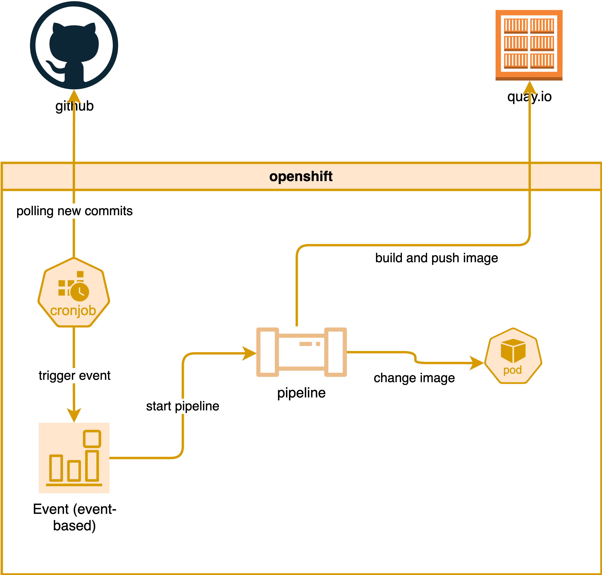
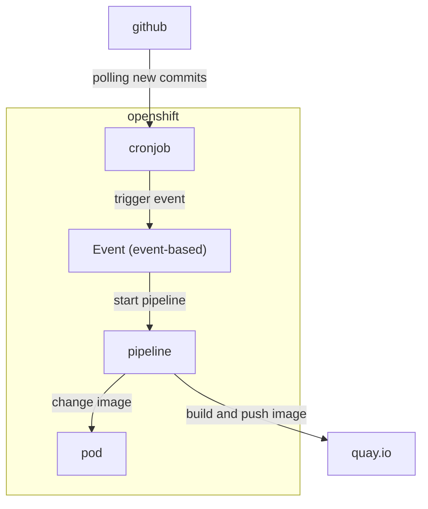
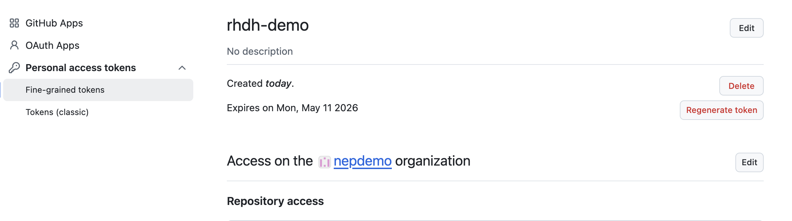
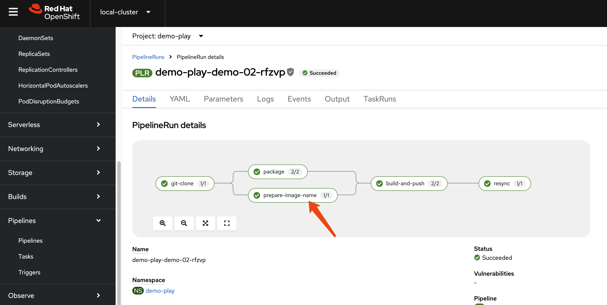
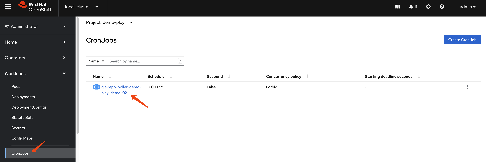

> [!TIP]
> Ongoing and occasional updates and improvements.
# Integrate RHDH with GitHub Repo

We previously had a demo, following the documentation [here](../4.15/2024.08.rhdh.book.md).

The old demo used GitLab as the source code repository, but this time we will switch to using GitHub.

The upstream demo repositories containing the newest code are:
- https://github.com/redhat-gpte-devopsautomation/agnosticg.git
- https://github.com/redhat-gpe/rhdh-demo-entities.git
- https://github.com/redhat-gpe/janus-idp-gitops.git
- https://github.com/redhat-gpte-devopsautomation/backstage-workshop.git
- https://github.com/redhat-gpte-devopsautomation/software-templates.git

However, we will still fork the old repository for this demo:
- https://github.com/nepdemo/rhdh-book1-templates/blob/wzh-2025.05

The forked repository will focus on:
- Using a GitHub repository as the source code repository for new projects instead of GitLab.
- Triggering the pipeline by monitoring the GitHub repository for new commits using a cronjob instead of a GitHub webhook.
- Modifying the pipeline to compile a new image with a different tag and updating the deployment with the new tag.

The overall architecture for the changes:


mermaid version:


## Prepare the GitHub Environment

Follow the official documentation:
- https://docs.redhat.com/en/documentation/red_hat_developer_hub/1.5/html/authentication_in_red_hat_developer_hub/authenticating-with-github#enabling-authentication-with-github

Create a personal access token in GitHub, giving it only `read` permission, and copy the token.
- https://github.com/settings/personal-access-tokens
- `Read` access to code, commit statuses, and metadata



Create a GitHub App:
- https://github.com/settings/apps/new

## Patch for Demo Environment

Create a secret under the `backstage` namespace:

```yaml
kind: Secret
apiVersion: v1
metadata:
  name: wzh-rhdh-credentials
data:
  GITHUB_CLIENT_SECRET: xxxxxxxxxxxxxxxxxxxx
  AUTH_GITHUB_CLIENT_ID: xxxxxxxxxxxxxxxxxxxx
  GITHUB_WEBHOOK_URL: xxxxxxxxxxxxxxxxxxxx
  GITHUB_ORGANIZATION: xxxxxxxxxxxxxxxxxxxx
  GITHUB_WEBHOOK_SECRET: xxxxxxxxxxxxxxxxxxxx
  GITHUB_PRIVATE_KEY_FILE: xxxxxxxxxxxxxxxxxxxx
  GITHUB_ORG_URL: xxxxxxxxxxxxxxxxxxxx
  AUTH_GITHUB_APP_ID: xxxxxxxxxxxxxxxxxxxx
  GITHUB_HOST_DOMAIN: xxxxxxxxxxxxxxxxxxxx
type: Opaque
```

For the Red Hat demo environment, patch this file:
- https://<gitlab-host>/gitops/janus-idp-gitops/-/blob/main/charts/backstage/backstage-values.yaml?ref_type=heads

```yaml
global:
  dynamic:
    plugins:
      - package: ./dynamic-plugins/dist/backstage-plugin-scaffolder-backend-module-github-dynamic
        disabled: false
upstream:
  backstage:
    # patch for secrets
    extraEnvVarsSecrets:
      - wzh-rhdh-credentials

    appConfig:
      integrations:
        github:
          - host: ${GITHUB_HOST_DOMAIN}
            apps:
              - appId: ${AUTH_GITHUB_APP_ID}
                clientId: ${AUTH_GITHUB_CLIENT_ID}
                clientSecret: ${GITHUB_CLIENT_SECRET}
                webhookUrl: ${GITHUB_WEBHOOK_URL}
                webhookSecret: ${GITHUB_WEBHOOK_SECRET}
                privateKey: |
                  ${GITHUB_PRIVATE_KEY_FILE}

      enabled:
        github: true
        githubOrg: true
```

Then, update the `backstage-gitops` ArgoCD application in gitops to trigger the update.

And create some secrets in the target namespace so we can access GitHub and image repositories (like quay.io).
```bash

# oc delete project demo-play

oc new-project demo-play

oc create secret generic github-pat-secret --from-literal=pat='github_pat_xxxxxxxxxxx'

# create k8s secret from podman authfile
oc delete secret wzh-docker-authfile -n demo-play
oc create secret generic wzh-docker-authfile --from-file=config.json=podman_authfile.json -n demo-play

# https://github.com/tektoncd/catalog/tree/main/task/kaniko/0.7
```

Remove all completed and error pods:
```bash
oc get pods -n demo-play | grep -E 'Error|Completed' | awk '{print $1}' | xargs oc delete pod -n demo-play
```

## Create the Test Environment

Import the template into RHDH:
- https://github.com/nepdemo/rhdh-book1-templates/blob/wzh-2025.05/quarkus-with-angular/template.yaml

There will be an updated pipeline that generates a new Docker image with a customized tag and updates the deployment with the new image.


It also includes a cronjob that will repeatedly poll the repository every 5 minutes, fetch the latest commit hash, update the state ConfigMap, and curl the event listener if a new commit is detected.


## Show Me the Code

The rendered project is here:
- https://github.com/nepdemo/demo-play-demo-02-gitops

There are `git-*.yaml` files under templates, which include the polling script, ConfigMap, role, and cronjobs.
- https://github.com/nepdemo/demo-play-demo-02-gitops/tree/main/helm/build/templates

There is a new Tekton task to generate the image name; the generated image looks like `quay.io/wangzheng422/qimgs:20250513023432-3038`.
- https://github.com/nepdemo/demo-play-demo-02-gitops/blob/main/helm/build/templates/prepare-image-name-task.yaml

And an updated Tekton resync task to update the image in a deployment.
- https://github.com/nepdemo/demo-play-demo-02-gitops/blob/main/helm/build/templates/resynctask.yaml

The command used to update the image is:
`oc set image deployment/$(params.COMPONENT_ID) -n $(params.NAMESPACE) quarkus-template=$(params.IMAGE)`

Since the deployment is managed by an Argo CD application, we need to ignore certain monitoring-related changes in the Deployment and ConfigMap to allow polling and automatic updates to work correctly.
- https://github.com/nepdemo/demo-play-demo-02-gitops/blob/main/argocd/demo-play-demo-02-argocd-app-dev.yaml
- https://github.com/nepdemo/demo-play-demo-02-gitops/blob/main/argocd/demo-play-demo-02-argocd-app-dev-build.yaml

```yaml
  ignoreDifferences:
    - group: ""
      kind: ConfigMap
      name: git-polling-state-demo-play-demo-02
      jsonPointers:
      - /data/last-commit-sha

  ignoreDifferences:
    - group: apps
      kind: Deployment
      jsonPointers:
      - /spec/template/spec/containers/0/image
```

# end