> [!NOTE]
> work in progress
# run hcp with ocp-v


# install metalLB

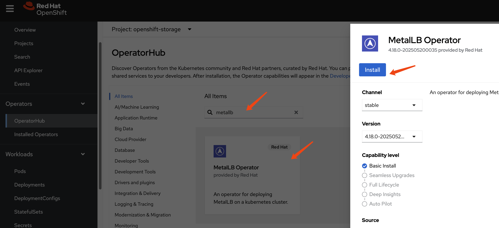


Create a single instance of a MetalLB custom resource:

```yaml
apiVersion: metallb.io/v1beta1
kind: MetalLB
metadata:
  name: metallb
  namespace: metallb-system
```

config ip address pool

```yaml
apiVersion: metallb.io/v1beta1
kind: IPAddressPool
metadata:
  namespace: metallb-system
  name: hcp-pool
spec:
  addresses:
  - 192.168.22.200-192.168.22.220
  autoAssign: true
  avoidBuggyIPs: true
```

config for L2 advertisement

```yaml
apiVersion: metallb.io/v1beta1
kind: L2Advertisement
metadata:
  name: l2-advertisement
  namespace: metallb-system
spec:
  ipAddressPools:
   - hcp-pool
```


# install lvm


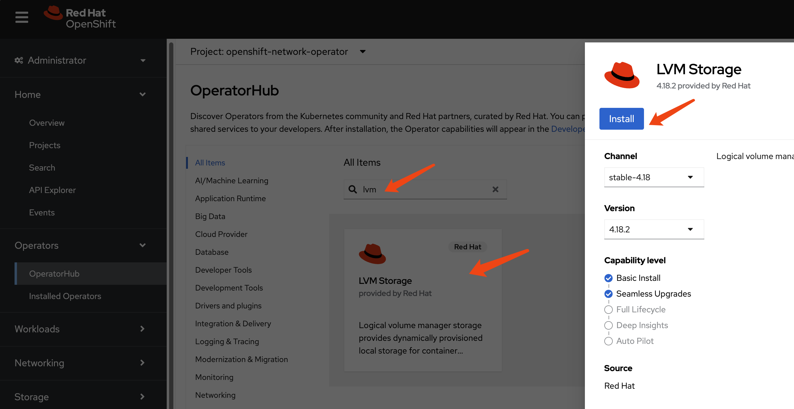

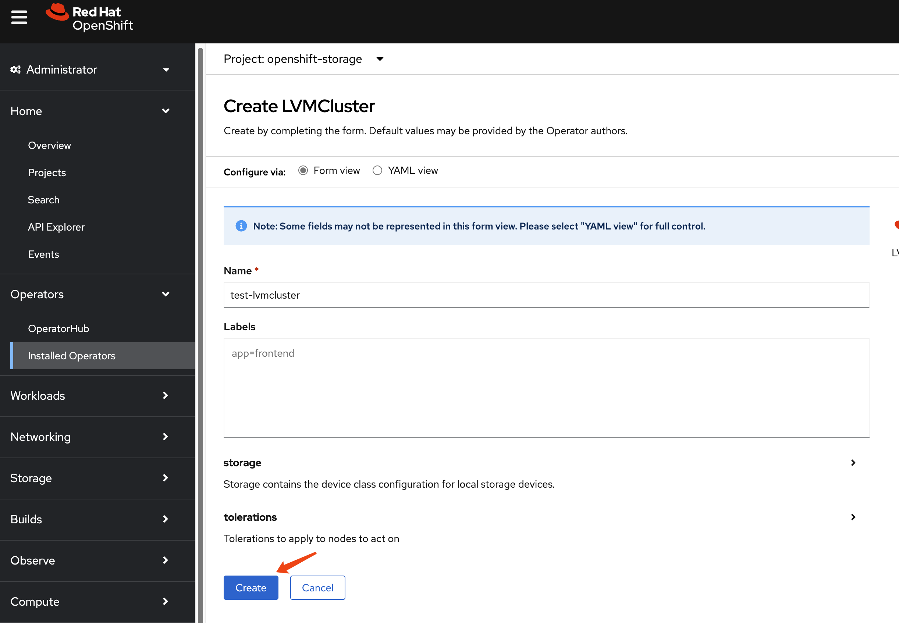

```bash
oc patch storageclass lvms-vg1 -p '{"metadata": {"annotations":{"storageclass.kubernetes.io/is-default-class":"true"}}}'
```

# install ocp-v

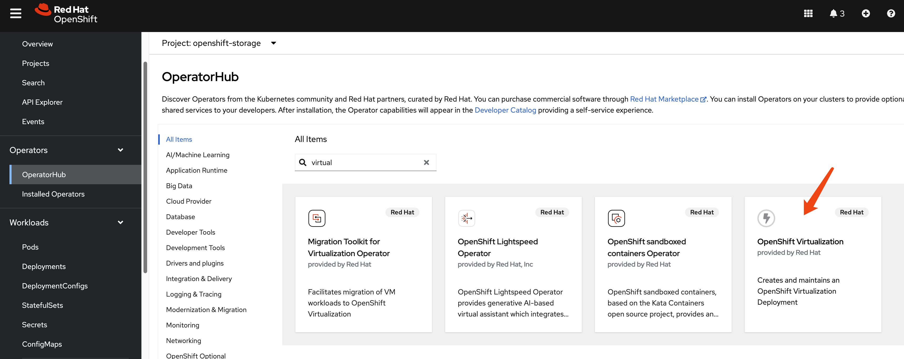

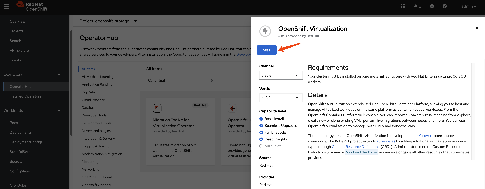

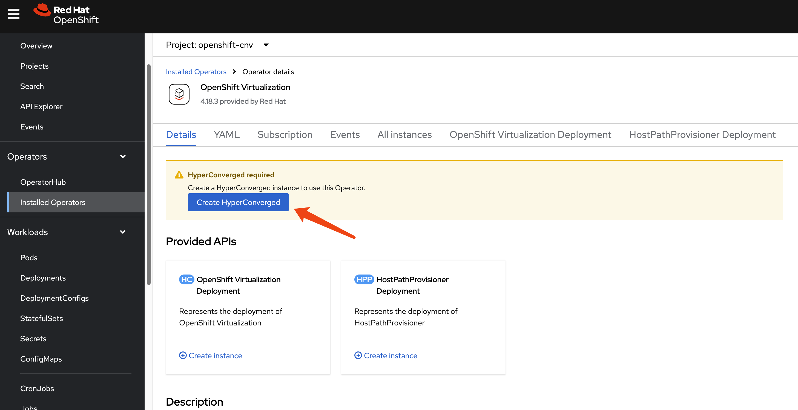

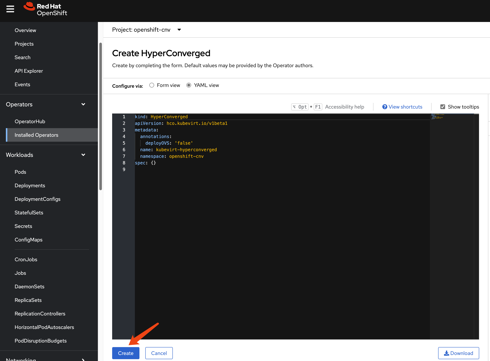

# install multicluster engine Operator

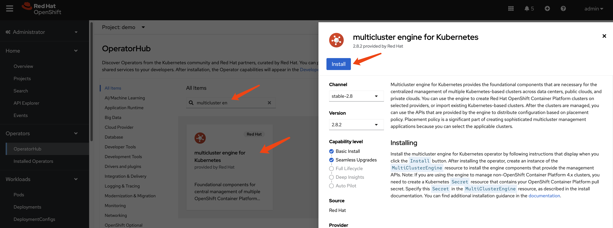

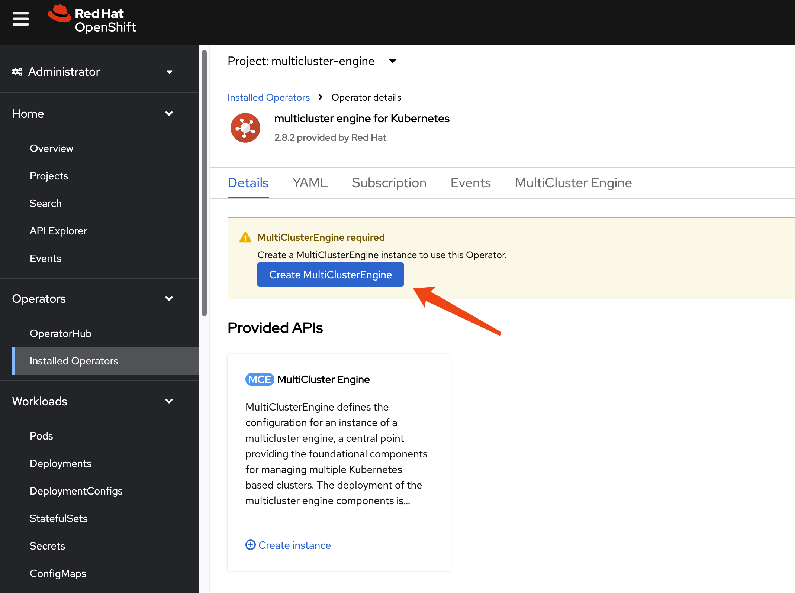

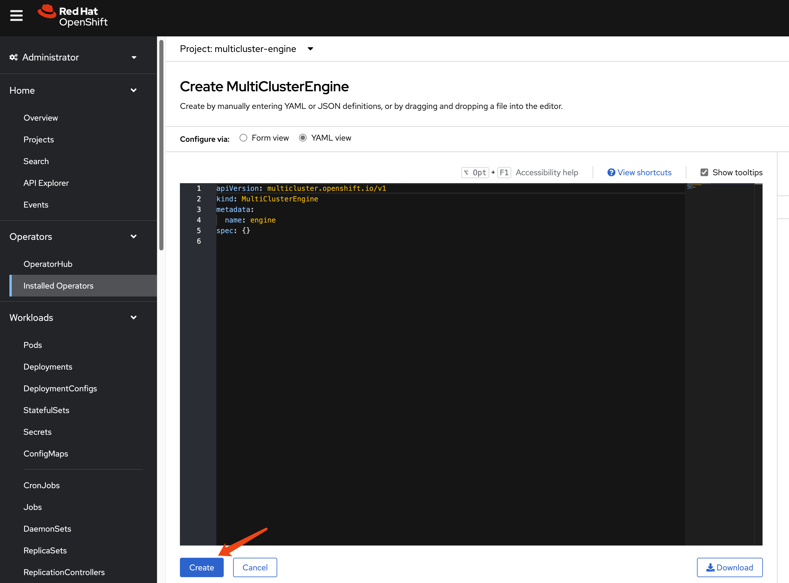

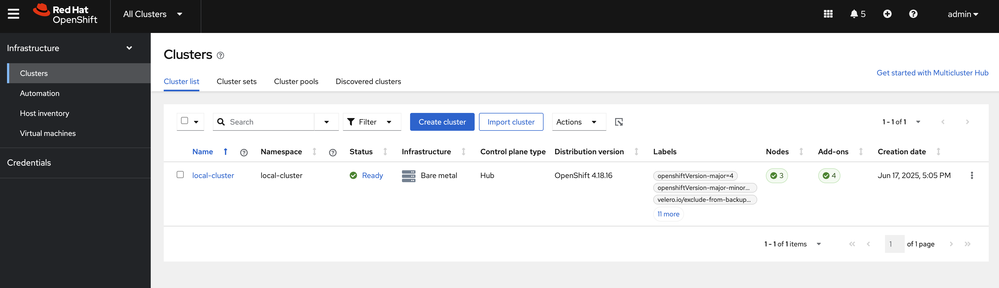

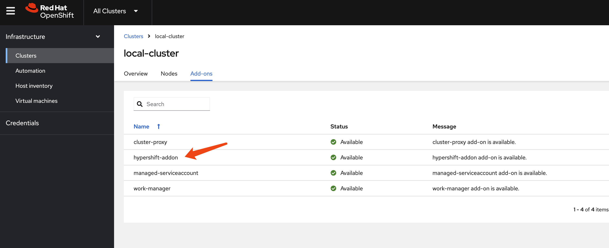

# hcp

```bash

oc patch ingresscontroller -n openshift-ingress-operator default \
--type=json \
-p '[{ "op": "add", "path": "/spec/routeAdmission", "value": {"WildcardsAllowed":
"WildcardsAllowed"}}]'

```


## bug fix

It seems there are bugs for ingress traffic for default ingress, if you use default ingress, the ingress co not working

```bash
oc --kubeconfig kubeconfig.yaml get co
# NAME                                       VERSION   AVAILABLE   PROGRESSING   DEGRADED   SINCE   MESSAGE
# console                                    4.18.17   False       True          True       71m     DeploymentAvailable: 0 replicas available for console deployment...
# csi-snapshot-controller                    4.18.17   True        False         False      83m
# dns                                        4.18.17   True        False         False      70m
# image-registry                             4.18.17   True        False         False      71m
# ingress                                    4.18.17   True        False         True       71m     The "default" ingress controller reports Degraded=True: DegradedConditions: One or more other status conditions indicate a degraded state: CanaryChecksSucceeding=False (CanaryChecksRepetitiveFailures: Canary route checks for the default ingress controller are failing. Last 2 error messages:...
# ......


oc --kubeconfig kubeconfig.yaml get co/ingress -o yaml
# ......
# status:
#   conditions:
#       The "default" ingress controller reports Degraded=True: DegradedConditions: One or more other status conditions indicate a degraded state: CanaryChecksSucceeding=False (CanaryChecksRepetitiveFailures: Canary route checks for the default ingress controller are failing. Last 2 error messages:
#       error sending canary HTTP Request: Timeout: Get "https://canary-openshift-ingress-canary.apps.wzh-01.apps.demo-01-rhsys.wzhlab.top": context deadline exceeded (Client.Timeout exceeded while awaiting headers)
#       error sending canary HTTP request to "canary-openshift-ingress-canary.apps.wzh-01.apps.demo-01-rhsys.wzhlab.top": Get "https://canary-openshift-ingress-canary.apps.wzh-01.apps.demo-01-rhsys.wzhlab.top": Bad Gateway (x71 over 1h10m0s))
# ......

```

You need to set the metalLB external ip and service which is for customerize base domain, as workaround.

```bash

oc --kubeconfig kubeconfig.yaml get services \
-n openshift-ingress router-nodeport-default \
-o jsonpath='{.spec.ports[?(@.name=="http")].nodePort}'
# 30296

oc --kubeconfig kubeconfig.yaml get services \
-n openshift-ingress router-nodeport-default \
-o jsonpath='{.spec.ports[?(@.name=="https")].nodePort}'
# 31750

hosted_cluster_name=wzh-01

cat << EOF > ${BASE_DIR}/data/install/service.yaml
apiVersion: v1
kind: Service
metadata:
  labels:
    app: $hosted_cluster_name
  name: $hosted_cluster_name-apps
  namespace: clusters-$hosted_cluster_name
spec:
  ports:
  - name: https-443
    port: 443
    protocol: TCP
    targetPort: 31750
  - name: http-80
    port: 80
    protocol: TCP
    targetPort: 30296
  selector:
    kubevirt.io: virt-launcher
  type: LoadBalancer
EOF

oc apply -f ${BASE_DIR}/data/install/service.yaml

# oc delete -f ${BASE_DIR}/data/install/service.yaml  


oc -n clusters-$hosted_cluster_name get service $hosted_cluster_name-apps \
-o jsonpath='{.status.loadBalancer.ingress[0].ip}'
# 192.168.22.201

```

set dns recode
- *.apps.demo-01-rhsys.wzhlab.top -> 192.168.22.22
  - *.apps.wzh-01.apps.demo-01-rhsys.wzhlab.top -> 192.168.22.201


```bash

oc --kubeconfig kubeconfig.yaml get pod -A | grep konnectivity-agent-
# kube-system                                        konnectivity-agent-s2dzj                                  1/1     Running            0               17m

oc --kubeconfig kubeconfig.yaml exec -n kube-system konnectivity-agent-s2dzj -- curl -vvv -k https://canary-openshift-ingress-canary.apps.wzh-01.apps.demo-01-rhsys.wzhlab.top


oc get pod -n clusters-wzh-01 | grep ingress
# ingress-operator-69c9497554-h5db5                     2/2     Running   0             25m

oc exec -n clusters-wzh-01 ingress-operator-69c9497554-h5db5 -- curl -vvv -k https://canary-openshift-ingress-canary.apps.wzh-01.apps.demo-01-rhsys.wzhlab.top


```

## using cli

```bash
oc get ConsoleCLIDownload hcp-cli-download -o json | jq -r ".spec"
# {
#   "description": "With the Hosted Control Plane command line interface, you can create and manage OpenShift hosted clusters.\n",
#   "displayName": "hcp - Hosted Control Plane Command Line Interface (CLI)",
#   "links": [
#     {
#       "href": "https://hcp-cli-download-multicluster-engine.apps.demo-01-rhsys.wzhlab.top/linux/amd64/hcp.tar.gz",
#       "text": "Download hcp CLI for Linux for x86_64"
#     },
#     {
#       "href": "https://hcp-cli-download-multicluster-engine.apps.demo-01-rhsys.wzhlab.top/darwin/amd64/hcp.tar.gz",
#       "text": "Download hcp CLI for Mac for x86_64"
#     },
#     {
#       "href": "https://hcp-cli-download-multicluster-engine.apps.demo-01-rhsys.wzhlab.top/windows/amd64/hcp.tar.gz",
#       "text": "Download hcp CLI for Windows for x86_64"
#     },
#     {
#       "href": "https://hcp-cli-download-multicluster-engine.apps.demo-01-rhsys.wzhlab.top/linux/arm64/hcp.tar.gz",
#       "text": "Download hcp CLI for Linux for ARM 64"
#     },
#     {
#       "href": "https://hcp-cli-download-multicluster-engine.apps.demo-01-rhsys.wzhlab.top/darwin/arm64/hcp.tar.gz",
#       "text": "Download hcp CLI for Mac for ARM 64"
#     },
#     {
#       "href": "https://hcp-cli-download-multicluster-engine.apps.demo-01-rhsys.wzhlab.top/linux/ppc64/hcp.tar.gz",
#       "text": "Download hcp CLI for Linux for IBM Power"
#     },
#     {
#       "href": "https://hcp-cli-download-multicluster-engine.apps.demo-01-rhsys.wzhlab.top/linux/ppc64le/hcp.tar.gz",
#       "text": "Download hcp CLI for Linux for IBM Power, little endian"
#     },
#     {
#       "href": "https://hcp-cli-download-multicluster-engine.apps.demo-01-rhsys.wzhlab.top/linux/s390x/hcp.tar.gz",
#       "text": "Download hcp CLI for Linux for IBM Z"
#     }
#   ]
# }

wget --no-check-certificate https://hcp-cli-download-multicluster-engine.apps.demo-01-rhsys.wzhlab.top/linux/amd64/hcp.tar.gz

tar -xzf hcp.tar.gz -C $HOME/.local/bin/


hosted_cluster_name=wzh-01
worker_count=1
value_for_memory=16
value_for_cpu=8
basedomain=demo-01-hcp.wzhlab.top
var_release_image=quay.io/openshift-release-dev/ocp-release:4.18.17-multi
SEC_FILE="${BASE_DIR}/data/pull-secret.json"


hcp create cluster kubevirt \
--name $hosted_cluster_name \
--node-pool-replicas $worker_count \
--pull-secret $SEC_FILE \
--memory $value_for_memory \
--cores $value_for_cpu \
--base-domain $basedomain \
--release-image $var_release_image \
--control-plane-availability-policy SingleReplica \
--infra-availability-policy SingleReplica


var_http_port=`oc --kubeconfig kubeconfig.yaml get services \
-n openshift-ingress router-nodeport-default \
-o jsonpath='{.spec.ports[?(@.name=="http")].nodePort}'`
echo $var_http_port
# 30296

var_https_port=`oc --kubeconfig kubeconfig.yaml get services \
-n openshift-ingress router-nodeport-default \
-o jsonpath='{.spec.ports[?(@.name=="https")].nodePort}'`
echo $var_https_port
# 31750

hosted_cluster_name=wzh-01

cat << EOF > ${BASE_DIR}/data/install/service.yaml
apiVersion: v1
kind: Service
metadata:
  labels:
    app: $hosted_cluster_name
  name: $hosted_cluster_name-apps
  namespace: clusters-$hosted_cluster_name
spec:
  ports:
  - name: https-443
    port: 443
    protocol: TCP
    targetPort: $var_https_port
  - name: http-80
    port: 80
    protocol: TCP
    targetPort: $var_http_port
  selector:
    kubevirt.io: virt-launcher
  type: LoadBalancer
EOF

oc apply -f ${BASE_DIR}/data/install/service.yaml

# oc delete -f ${BASE_DIR}/data/install/service.yaml  


oc -n clusters-$hosted_cluster_name get service $hosted_cluster_name-apps \
-o jsonpath='{.status.loadBalancer.ingress[0].ip}'
# 192.168.22.201

```

set dns recode
- *.apps.demo-01-rhsys.wzhlab.top -> 192.168.22.22
- *.apps.wzh-01.demo-01-hcp.wzhlab.top -> 192.168.22.201

## debug

```bash

oc patch ingresscontroller -n openshift-ingress-operator default --type=json -p '[{ "op": "add", "path": "/spec/routeAdmission", "value": {wildcardPolicy: "WildcardsAllowed"}}]'


oc get secret -n openshift-config pull-secret -o template='{{index .data ".dockerconfigjson"}}' | base64 --decode > ~/pull-secret.json

hcp create cluster kubevirt \
--name cluster1 \
--release-image quay.io/openshift-release-dev/ocp-release:4.16.41-x86_64 \
--node-pool-replicas 2 \
--pull-secret ~/pull-secret.json \
--memory 6Gi \
--cores 2

hcp create kubeconfig --name cluster1 > cluster1-kubeconfig

oc get node -o wide
# NAME                            STATUS   ROLES                  AGE   VERSION            INTERNAL-IP   EXTERNAL-IP   OS-IMAGE                                                KERNEL-VERSION                 CONTAINER-RUNTIME
# control-plane-cluster-chw7m-1   Ready    control-plane,master   96m   v1.29.14+7cf4c05   10.10.10.10   <none>        Red Hat Enterprise Linux CoreOS 416.94.202505191152-0   5.14.0-427.68.2.el9_4.x86_64   cri-o://1.29.13-6.rhaos4.16.git729443e.el9
# control-plane-cluster-chw7m-2   Ready    control-plane,master   96m   v1.29.14+7cf4c05   10.10.10.11   <none>        Red Hat Enterprise Linux CoreOS 416.94.202505191152-0   5.14.0-427.68.2.el9_4.x86_64   cri-o://1.29.13-6.rhaos4.16.git729443e.el9
# control-plane-cluster-chw7m-3   Ready    control-plane,master   80m   v1.29.14+7cf4c05   10.10.10.12   <none>        Red Hat Enterprise Linux CoreOS 416.94.202505191152-0   5.14.0-427.68.2.el9_4.x86_64   cri-o://1.29.13-6.rhaos4.16.git729443e.el9
# worker-cluster-chw7m-1          Ready    worker                 85m   v1.29.14+7cf4c05   10.10.10.20   <none>        Red Hat Enterprise Linux CoreOS 416.94.202505191152-0   5.14.0-427.68.2.el9_4.x86_64   cri-o://1.29.13-6.rhaos4.16.git729443e.el9
# worker-cluster-chw7m-2          Ready    worker                 85m   v1.29.14+7cf4c05   10.10.10.21   <none>        Red Hat Enterprise Linux CoreOS 416.94.202505191152-0   5.14.0-427.68.2.el9_4.x86_64   cri-o://1.29.13-6.rhaos4.16.git729443e.el9
# worker-cluster-chw7m-3          Ready    worker                 85m   v1.29.14+7cf4c05   10.10.10.22   <none>        Red Hat Enterprise Linux CoreOS 416.94.202505191152-0   5.14.0-427.68.2.el9_4.x86_64   cri-o://1.29.13-6.rhaos4.16.git729443e.el9

oc --kubeconfig=cluster1-kubeconfig get node -o wide
# NAME                      STATUS   ROLES    AGE   VERSION            INTERNAL-IP    EXTERNAL-IP   OS-IMAGE                                                KERNEL-VERSION                 CONTAINER-RUNTIME
# cluster1-34459eb5-8rz87   Ready    worker   20m   v1.29.14+7cf4c05   10.235.0.109   <none>        Red Hat Enterprise Linux CoreOS 416.94.202505191152-0   5.14.0-427.68.2.el9_4.x86_64   cri-o://1.29.13-6.rhaos4.16.git729443e.el9
# cluster1-34459eb5-92vwb   Ready    worker   20m   v1.29.14+7cf4c05   10.234.0.84    <none>        Red Hat Enterprise Linux CoreOS 416.94.202505191152-0   5.14.0-427.68.2.el9_4.x86_64   cri-o://1.29.13-6.rhaos4.16.git729443e.el9

oc get pod -n clusters-cluster1
# NAME                                                  READY   STATUS    RESTARTS       AGE
# capi-provider-5ffdb4ff76-q54pm                        1/1     Running   0              4h5m
# catalog-operator-5577489cfb-4fvz6                     2/2     Running   3 (4h2m ago)   4h3m
# certified-operators-catalog-66b8f94fdc-nkf8l          1/1     Running   0              4h3m
# cluster-api-65b956c6d-4nvhw                           1/1     Running   0              4h5m
# cluster-image-registry-operator-5f659c7846-wrvzp      2/2     Running   0              4h3m
# cluster-network-operator-5dc6b5d48b-mdbfm             2/2     Running   0              4h3m
# cluster-node-tuning-operator-674f7d7fb9-4ndhc         1/1     Running   0              4h3m
# cluster-policy-controller-64dd674d57-cwxl9            1/1     Running   0              4h3m
# cluster-policy-controller-64dd674d57-dfw5f            1/1     Running   0              4h3m
# cluster-policy-controller-64dd674d57-rtvv5            1/1     Running   0              4h3m
# cluster-storage-operator-8599994c74-sxs48             1/1     Running   0              4h3m
# cluster-version-operator-9d59b547c-6nk29              1/1     Running   0              4h3m
# community-operators-catalog-7f8db78548-5kjfz          1/1     Running   0              45m
# control-plane-operator-8857686b7-zgt2m                1/1     Running   0              4h5m
# control-plane-pki-operator-dfc8fb7c9-8hwtb            1/1     Running   0              4h5m
# csi-snapshot-controller-56c9c74bb8-24qnw              1/1     Running   0              4h2m
# csi-snapshot-controller-operator-55cf7d8698-pzfzl     1/1     Running   0              4h3m
# csi-snapshot-webhook-7bdd696c5-6cn76                  1/1     Running   0              4h2m
# dns-operator-594fbf7874-gggxm                         1/1     Running   0              4h3m
# etcd-0                                                4/4     Running   0              4h5m
# etcd-1                                                4/4     Running   0              4h5m
# etcd-2                                                4/4     Running   0              4h5m
# hosted-cluster-config-operator-7b54d95b7-x4zjr        1/1     Running   0              4h3m
# ignition-server-ccd54b788-7x8rz                       1/1     Running   0              4h3m
# ignition-server-ccd54b788-w47kn                       1/1     Running   0              4h3m
# ignition-server-ccd54b788-zdc7q                       1/1     Running   0              4h3m
# ignition-server-proxy-6c886bb8c-28fn9                 1/1     Running   0              4h3m
# ignition-server-proxy-6c886bb8c-6jdzl                 1/1     Running   0              4h3m
# ignition-server-proxy-6c886bb8c-6xqwz                 1/1     Running   0              4h3m
# ingress-operator-6495bb45fd-mpgvv                     2/2     Running   0              4h3m
# konnectivity-agent-74fc646974-5mw4b                   1/1     Running   0              4h3m
# konnectivity-agent-74fc646974-b28jf                   1/1     Running   0              4h3m
# konnectivity-agent-74fc646974-hwqks                   1/1     Running   0              4h3m
# kube-apiserver-c9cc7b7cf-kzmk8                        4/4     Running   0              4h4m
# kube-apiserver-c9cc7b7cf-sjsn9                        4/4     Running   0              4h4m
# kube-apiserver-c9cc7b7cf-xjdtr                        4/4     Running   0              4h4m
# kube-controller-manager-779c95db6-42tjm               1/1     Running   0              3h54m
# kube-controller-manager-779c95db6-8v96j               1/1     Running   0              3h53m
# kube-controller-manager-779c95db6-trwjb               1/1     Running   0              3h54m
# kube-scheduler-75c4d59d9b-gcn72                       1/1     Running   0              4h4m
# kube-scheduler-75c4d59d9b-mlmqw                       1/1     Running   0              4h4m
# kube-scheduler-75c4d59d9b-nf84k                       1/1     Running   0              4h4m
# kubevirt-cloud-controller-manager-646d597f9-g9f6h     1/1     Running   0              4h3m
# kubevirt-cloud-controller-manager-646d597f9-klbv9     1/1     Running   1 (4h1m ago)   4h3m
# kubevirt-cloud-controller-manager-646d597f9-l8x56     1/1     Running   0              4h3m
# kubevirt-csi-controller-f97c4b788-jcxk9               5/5     Running   0              4h3m
# machine-approver-77cfbbf4bf-g6b8c                     1/1     Running   0              4h3m
# multus-admission-controller-847d99998f-bbgdg          2/2     Running   0              3h56m
# multus-admission-controller-847d99998f-r5vxg          2/2     Running   0              3h56m
# network-node-identity-68b9756f4f-49bwn                3/3     Running   0              3h56m
# network-node-identity-68b9756f4f-7fdjx                3/3     Running   0              3h56m
# network-node-identity-68b9756f4f-tmm75                3/3     Running   0              3h56m
# oauth-openshift-97b69b444-mj6vv                       4/4     Running   0              4h1m
# oauth-openshift-97b69b444-wrq8g                       4/4     Running   0              4h1m
# oauth-openshift-97b69b444-xf95d                       4/4     Running   0              4h1m
# olm-operator-f7d557b8f-6n8sd                          2/2     Running   0              4h3m
# openshift-apiserver-686b564f95-k2xgl                  3/3     Running   0              3h52m
# openshift-apiserver-686b564f95-n9hlh                  3/3     Running   0              3h51m
# openshift-apiserver-686b564f95-xqnw6                  3/3     Running   0              3h54m
# openshift-controller-manager-7c6965c46c-5gjlc         1/1     Running   0              4h3m
# openshift-controller-manager-7c6965c46c-cbnzt         1/1     Running   0              4h3m
# openshift-controller-manager-7c6965c46c-tvjgj         1/1     Running   0              4h3m
# openshift-oauth-apiserver-85854594c8-8czdk            2/2     Running   0              4h3m
# openshift-oauth-apiserver-85854594c8-8sv5f            2/2     Running   0              4h3m
# openshift-oauth-apiserver-85854594c8-w6kc9            2/2     Running   0              4h3m
# openshift-route-controller-manager-7d545799b8-4hltt   1/1     Running   0              4h3m
# openshift-route-controller-manager-7d545799b8-dw2qr   1/1     Running   0              4h3m
# openshift-route-controller-manager-7d545799b8-x5l29   1/1     Running   0              4h3m
# ovnkube-control-plane-69dbc86f84-d58dt                3/3     Running   0              3h56m
# ovnkube-control-plane-69dbc86f84-wc45w                3/3     Running   0              3h56m
# packageserver-575b869f87-45rj5                        2/2     Running   0              4h3m
# packageserver-575b869f87-9lx7q                        2/2     Running   0              4h3m
# packageserver-575b869f87-xqfbb                        2/2     Running   0              4h3m
# redhat-marketplace-catalog-7c55888d99-zmbhq           1/1     Running   0              4h3m
# redhat-operators-catalog-584984d994-clbqz             1/1     Running   0              4h3m
# virt-launcher-cluster1-a8ceb069-p8hzl-khcfs           1/1     Running   0              4h3m
# virt-launcher-cluster1-a8ceb069-r59xh-w2hln           1/1     Running   0              4h3m

oc get --namespace clusters hostedclusters
# NAME       VERSION   KUBECONFIG                  PROGRESS    AVAILABLE   PROGRESSING   MESSAGE
# cluster1   4.16.41   cluster1-admin-kubeconfig   Completed   True        False         The hosted control plane is available


oc --kubeconfig=cluster1-kubeconfig get co 
# NAME                                       VERSION   AVAILABLE   PROGRESSING   DEGRADED   SINCE   MESSAGE
# console                                    4.16.41   True        False         False      18m     
# csi-snapshot-controller                    4.16.41   True        False         False      26m     
# dns                                        4.16.41   True        False         False      19m     
# image-registry                             4.16.41   True        False         False      19m     
# ingress                                    4.16.41   True        False         False      18m     
# insights                                   4.16.41   True        False         False      19m     
# kube-apiserver                             4.16.41   True        False         False      25m     
# kube-controller-manager                    4.16.41   True        False         False      25m     
# kube-scheduler                             4.16.41   True        False         False      25m     
# kube-storage-version-migrator              4.16.41   True        False         False      19m     
# monitoring                                 4.16.41   True        False         False      11m     
# network                                    4.16.41   True        True          False      20m     DaemonSet "/openshift-multus/network-metrics-daemon" is not available (awaiting 1 nodes)
# node-tuning                                4.16.41   True        False         False      22m     
# openshift-apiserver                        4.16.41   True        False         False      25m     
# openshift-controller-manager               4.16.41   True        False         False      25m     
# openshift-samples                          4.16.41   True        False         False      19m     
# operator-lifecycle-manager                 4.16.41   True        False         False      25m     
# operator-lifecycle-manager-catalog         4.16.41   True        False         False      26m     
# operator-lifecycle-manager-packageserver   4.16.41   True        False         False      25m     
# service-ca                                 4.16.41   True        False         False      19m     
# storage                                    4.16.41   True        False         False      26m


oc get service -n clusters-cluster1 | grep ingress
# default-ingress-passthrough-service-r4xs8f6dtw   ClusterIP      172.231.122.191   <none>         443/TCP             26m


oc get endpointslice -n clusters-cluster1 -l kubernetes.io/service-name=default-ingress-passthrough-service-r4xs8f6dtw
# NAME                                                                       ADDRESSTYPE   PORTS   ENDPOINTS      AGE
# default-ingress-passthrough-service-r4xs8f6dtw-cluster1-dnkns-6c6gb-ipv4   IPv4          31314   10.235.0.109   26m
# default-ingress-passthrough-service-r4xs8f6dtw-cluster1-dnkns-frh9v-ipv4   IPv4          31314   10.234.0.84    26m


oc get endpointslice -n clusters-cluster1 -l kubernetes.io/service-name=default-ingress-passthrough-service-r4xs8f6dtw -o yaml
# apiVersion: v1
# items:
# - addressType: IPv4
#   apiVersion: discovery.k8s.io/v1
#   endpoints:
#   - addresses:
#     - 10.235.0.109
#     conditions:
#       ready: true
#       serving: true
#       terminating: false
#   kind: EndpointSlice
#   metadata:
#     creationTimestamp: "2025-06-20T08:24:57Z"
#     generation: 3
#     labels:
#       endpointslice.kubernetes.io/managed-by: control-plane-operator.hypershift.openshift.io
#       kubernetes.io/service-name: default-ingress-passthrough-service-r4xs8f6dtw
#     name: default-ingress-passthrough-service-r4xs8f6dtw-cluster1-dnkns-6c6gb-ipv4
#     namespace: clusters-cluster1
#     ownerReferences:
#     - apiVersion: kubevirt.io/v1
#       blockOwnerDeletion: true
#       controller: true
#       kind: VirtualMachine
#       name: cluster1-34459eb5-8rz87
#       uid: b7e3efc4-fc47-4e6c-9cbc-fdf7086cee87
#     resourceVersion: "102738"
#     uid: f011bb6d-ca91-4a4a-bc23-e7488673287e
#   ports:
#   - name: https-443
#     port: 31314
#     protocol: TCP
# - addressType: IPv4
#   apiVersion: discovery.k8s.io/v1
#   endpoints:
#   - addresses:
#     - 10.234.0.84
#     conditions:
#       ready: true
#       serving: true
#       terminating: false
#   kind: EndpointSlice
#   metadata:
#     creationTimestamp: "2025-06-20T08:24:57Z"
#     generation: 3
#     labels:
#       endpointslice.kubernetes.io/managed-by: control-plane-operator.hypershift.openshift.io
#       kubernetes.io/service-name: default-ingress-passthrough-service-r4xs8f6dtw
#     name: default-ingress-passthrough-service-r4xs8f6dtw-cluster1-dnkns-frh9v-ipv4
#     namespace: clusters-cluster1
#     ownerReferences:
#     - apiVersion: kubevirt.io/v1
#       blockOwnerDeletion: true
#       controller: true
#       kind: VirtualMachine
#       name: cluster1-34459eb5-92vwb
#       uid: b7d1e3b8-fe1e-48ae-b2f7-c9ede97db9ad
#     resourceVersion: "102921"
#     uid: 40eb652a-8e5b-4707-b058-e40afbef36cc
#   ports:
#   - name: https-443
#     port: 31314
#     protocol: TCP
# kind: List
# metadata:
#   resourceVersion: ""


oc get service/default-ingress-passthrough-service-r4xs8f6dtw -n clusters-cluster1 -o yaml
# apiVersion: v1
# kind: Service
# metadata:
#   creationTimestamp: "2025-06-20T08:24:52Z"
#   labels:
#     hypershift.openshift.io/infra-id: cluster1-qnbwb
#   name: default-ingress-passthrough-service-r4xs8f6dtw
#   namespace: clusters-cluster1
#   resourceVersion: "98333"
#   uid: 8ff019e3-b2e8-4d98-aef3-f8a4c0df7ff6
# spec:
#   clusterIP: 172.231.122.191
#   clusterIPs:
#   - 172.231.122.191
#   internalTrafficPolicy: Cluster
#   ipFamilies:
#   - IPv4
#   ipFamilyPolicy: SingleStack
#   ports:
#   - name: https-443
#     port: 443
#     protocol: TCP
#     targetPort: 31314
#   sessionAffinity: None
#   type: ClusterIP
# status:
#   loadBalancer: {}


oc get pods -n openshift-ovn-kubernetes --show-labels -o wide
# NAME                                    READY   STATUS    RESTARTS   AGE   IP            NODE                            NOMINATED NODE   READINESS GATES   LABELS
# ovnkube-control-plane-996894568-6ndp5   2/2     Running   0          99m   10.10.10.10   control-plane-cluster-chw7m-1   <none>           <none>            app=ovnkube-control-plane,component=network,kubernetes.io/os=linux,openshift.io/component=network,pod-template-hash=996894568,type=infra
# ovnkube-control-plane-996894568-hdqwr   2/2     Running   0          99m   10.10.10.11   control-plane-cluster-chw7m-2   <none>           <none>            app=ovnkube-control-plane,component=network,kubernetes.io/os=linux,openshift.io/component=network,pod-template-hash=996894568,type=infra
# ovnkube-node-6nq8g                      8/8     Running   0          99m   10.10.10.11   control-plane-cluster-chw7m-2   <none>           <none>            app=ovnkube-node,component=network,controller-revision-hash=657d997c56,kubernetes.io/os=linux,openshift.io/component=network,ovn-db-pod=true,pod-template-generation=2,type=infra
# ovnkube-node-7gw6m                      8/8     Running   0          89m   10.10.10.22   worker-cluster-chw7m-3          <none>           <none>            app=ovnkube-node,component=network,controller-revision-hash=657d997c56,kubernetes.io/os=linux,openshift.io/component=network,ovn-db-pod=true,pod-template-generation=2,type=infra
# ovnkube-node-8zwbm                      8/8     Running   0          99m   10.10.10.10   control-plane-cluster-chw7m-1   <none>           <none>            app=ovnkube-node,component=network,controller-revision-hash=657d997c56,kubernetes.io/os=linux,openshift.io/component=network,ovn-db-pod=true,pod-template-generation=2,type=infra
# ovnkube-node-jx92d                      8/8     Running   0          89m   10.10.10.20   worker-cluster-chw7m-1          <none>           <none>            app=ovnkube-node,component=network,controller-revision-hash=657d997c56,kubernetes.io/os=linux,openshift.io/component=network,ovn-db-pod=true,pod-template-generation=2,type=infra
# ovnkube-node-l4rrm                      8/8     Running   0          89m   10.10.10.21   worker-cluster-chw7m-2          <none>           <none>            app=ovnkube-node,component=network,controller-revision-hash=657d997c56,kubernetes.io/os=linux,openshift.io/component=network,ovn-db-pod=true,pod-template-generation=2,type=infra
# ovnkube-node-xlfjg                      8/8     Running   0          84m   10.10.10.12   control-plane-cluster-chw7m-3   <none>           <none>            app=ovnkube-node,component=network,controller-revision-hash=657d997c56,kubernetes.io/os=linux,openshift.io/component=network,ovn-db-pod=true,pod-template-generation=2,type=infra

oc --kubeconfig=cluster1-kubeconfig get pod -n openshift-ovn-kubernetes --show-labels -o wide
# NAME                 READY   STATUS    RESTARTS   AGE   IP             NODE                      NOMINATED NODE   READINESS GATES   LABELS
# ovnkube-node-cwpnf   8/8     Running   0          25m   10.234.0.84    cluster1-34459eb5-92vwb   <none>           <none>            app=ovnkube-node,component=network,controller-revision-hash=65fdbff4c4,kubernetes.io/os=linux,openshift.io/component=network,ovn-db-pod=true,pod-template-generation=2,type=infra
# ovnkube-node-mlpmg   8/8     Running   0          25m   10.235.0.109   cluster1-34459eb5-8rz87   <none>           <none>            app=ovnkube-node,component=network,controller-revision-hash=65fdbff4c4,kubernetes.io/os=linux,openshift.io/component=network,ovn-db-pod=true,pod-template-generation=2,type=infra

VAR_POD=$(oc get pod -n openshift-ingress -l ingresscontroller.operator.openshift.io/deployment-ingresscontroller=default -o name | sed -n '1p' | awk -F '/' '{print $NF}')

oc exec -n openshift-ingress $VAR_POD -- cat haproxy.config | grep -A 8 default-ingress-passthrough-route-
# backend be_tcp:clusters-cluster1:default-ingress-passthrough-route-r4xs8f6dtw
#   balance source

#   hash-type consistent
#   timeout check 5000ms
#   server ept:default-ingress-passthrough-service-r4xs8f6dtw:https-443:10.235.0.109:31314 10.235.0.109:31314 weight 1 check inter 5000ms
#   server ept:default-ingress-passthrough-service-r4xs8f6dtw:https-443:10.234.0.84:31314 10.234.0.84:31314 weight 1 check inter 5000ms


 cat << 'EOF' > check.sh
 #!/bin/bash

# --- 用户配置区 ---

# 1. 设置您的 kubeconfig 文件路径
KUBECONFIG_PATH="cluster1-kubeconfig"

# 2. 设置要操作的 Namespace
NAMESPACE="openshift-ovn-kubernetes"

# 3. 定义您要搜索的值列表。在括号内添加或删除您的搜索词，用空格分隔。
#    例如: SEARCH_TERMS=("10.128.2.59" "some-other-value" "another-bridge")
SEARCH_TERMS=(
  "10.235.0.109"
  "10.234.0.84"
  "172.231.122.191"
)

# 4. 设置要检查的 Pod 数量
POD_COUNT=2

# --- 脚本核心逻辑 ---

# 检查 oc 命令是否存在
if ! command -v oc &> /dev/null; then
    echo "[ERROR] 'oc' command not found. Please ensure it is installed and in your PATH."
    exit 1
fi

# 将搜索词数组转换为 grep 使用的正则表达式模式 (e.g., "value1|value2|value3")
GREP_PATTERN=$(printf "%s|" "${SEARCH_TERMS[@]}")
GREP_PATTERN=${GREP_PATTERN%|} # 移除末尾多余的'|'

# 检查搜索列表是否为空
if [ -z "$GREP_PATTERN" ]; then
    echo "[ERROR] SEARCH_TERMS array is empty. Please add values to search for."
    exit 1
fi

echo "[INFO] Kubeconfig: ${KUBECONFIG_PATH}"
echo "[INFO] Namespace: ${NAMESPACE}"
echo "[INFO] Searching for patterns: ${GREP_PATTERN}"
echo "----------------------------------------------------"

# 获取前N个 Pod 的列表，这样可以避免在循环中重复执行 'oc get'
POD_LIST=$(oc --kubeconfig=${KUBECONFIG_PATH} get pods -n ${NAMESPACE} -l app=ovnkube-node -o name | head -n ${POD_COUNT})

if [ -z "${POD_LIST}" ]; then
    echo "[ERROR] No pods found with label 'app=ovnkube-node' in namespace '${NAMESPACE}'."
    exit 1
fi

# 循环处理每个 Pod
for POD_FULL_NAME in ${POD_LIST}; do
    # 从 "pod/my-pod-name" 中提取出 "my-pod-name"
    POD_NAME=$(basename "${POD_FULL_NAME}")

    echo "[INFO] ==> Checking Pod: ${POD_NAME}"

    # 执行 ovn-nbctl show 命令，并将标准错误重定向到标准输出，以捕获所有信息
    # 注意：脚本化执行时，-it (交互式终端) 是不必要且可能导致问题的，因此已移除。
    CMD_OUTPUT=$(oc --kubeconfig=${KUBECONFIG_PATH} exec -n ${NAMESPACE} "${POD_NAME}" -c ovn-controller -- ovn-nbctl show 2>&1)

    # 检查 oc exec 命令是否执行成功
    if [ $? -ne 0 ]; then
        echo "[ERROR] Failed to execute 'ovn-nbctl show' in pod ${POD_NAME}. Output:"
        echo "${CMD_OUTPUT}"
        continue # 跳过这个Pod，继续下一个
    fi

    # 使用 grep 搜索并提取上下文
    # -E: 使用扩展正则表达式 (为了'|')
    # -B 10: Before, 显示匹配行之前的10行
    # -A 10: After, 显示匹配行之后的10行
    CONTEXT_OUTPUT=$(echo "${CMD_OUTPUT}" | grep -E -B 5 -A 5 "${GREP_PATTERN}")

    # 如果 CONTEXT_OUTPUT 不为空，说明找到了匹配项
    if [ -n "${CONTEXT_OUTPUT}" ]; then
        echo "[SUCCESS] Found match in Pod: ${POD_NAME}"
        echo "================= MATCH DETAILS ================="
        echo "${CONTEXT_OUTPUT}"
        echo "================================================="
    else
        echo "[INFO] No match found in Pod: ${POD_NAME}"
    fi
    echo # 输出一个空行以分隔不同 Pod 的结果
done

echo "[INFO] Script finished."
EOF

bash check.sh
# [INFO] Kubeconfig: cluster1-kubeconfig
# [INFO] Namespace: openshift-ovn-kubernetes
# [INFO] Searching for patterns: 10.235.0.109|10.234.0.84|172.231.122.191
# ----------------------------------------------------
# [INFO] ==> Checking Pod: ovnkube-node-cwpnf
# [SUCCESS] Found match in Pod: ovnkube-node-cwpnf
# ================= MATCH DETAILS =================
#         type: router
#         router-port: rtoj-GR_cluster1-34459eb5-92vwb
# router 8f1a166a-c6b0-49a0-b8bf-5f61f75c74d1 (GR_cluster1-34459eb5-92vwb)
#     port rtoe-GR_cluster1-34459eb5-92vwb
#         mac: "0a:58:0a:ea:00:54"
#         networks: ["10.234.0.84/23"]
#     port rtoj-GR_cluster1-34459eb5-92vwb
#         mac: "0a:58:64:41:00:03"
#         networks: ["100.65.0.3/16"]
#     nat 2a4a2348-5ec0-4e24-bf67-1868756fc9fb
#         external ip: "10.234.0.84"
#         logical ip: "10.133.0.9"
#         type: "snat"
#     nat 43f5b9a8-793b-4f8f-ba46-839fc1723fcd
#         external ip: "10.234.0.84"
#         logical ip: "10.133.0.28"
#         type: "snat"
#     nat 458c3d81-c8e0-4e3b-a68c-5f905fbf4456
#         external ip: "10.234.0.84"
#         logical ip: "10.133.0.19"
#         type: "snat"
#     nat 46684c6a-8ba1-421e-b1fd-cb09e381a83c
#         external ip: "10.234.0.84"
#         logical ip: "10.133.0.17"
#         type: "snat"
#     nat 522d651f-a596-4791-ab47-77b7b3a8be35
#         external ip: "10.234.0.84"
#         logical ip: "10.133.0.5"
#         type: "snat"
#     nat 67d5a123-7e91-4411-a760-493f21d4ba0f
#         external ip: "10.234.0.84"
#         logical ip: "100.65.0.3"
#         type: "snat"
#     nat 6bf27fd3-2aff-4f71-8c1f-8de76239c2ac
#         external ip: "10.234.0.84"
#         logical ip: "10.133.0.22"
#         type: "snat"
#     nat 71f39dc9-63ec-4820-8746-852cf789df34
#         external ip: "10.234.0.84"
#         logical ip: "10.133.0.25"
#         type: "snat"
#     nat 7be25cad-98de-4fdb-bd66-175ce0fd8a2c
#         external ip: "10.234.0.84"
#         logical ip: "10.133.0.18"
#         type: "snat"
#     nat 7d1f75aa-db3e-4595-8db2-6967dc5c0916
#         external ip: "10.234.0.84"
#         logical ip: "10.133.0.4"
#         type: "snat"
#     nat 97d0804c-8e6e-4f9f-a680-98399bab80a7
#         external ip: "10.234.0.84"
#         logical ip: "10.133.0.23"
#         type: "snat"
#     nat bba70e10-a85b-402d-8dd6-ff9bd03f458e
#         external ip: "10.234.0.84"
#         logical ip: "10.133.0.27"
#         type: "snat"
#     nat c4d93873-6370-4203-a780-282f97bec059
#         external ip: "10.234.0.84"
#         logical ip: "10.133.0.12"
#         type: "snat"
#     nat c679eb74-052e-4172-b1bd-8f8a01b88f5e
#         external ip: "10.234.0.84"
#         logical ip: "10.133.0.15"
#         type: "snat"
#     nat c990fab7-7b5d-4b1c-a00f-939f3feef6c3
#         external ip: "10.234.0.84"
#         logical ip: "10.133.0.20"
#         type: "snat"
#     nat c9a1e03c-462a-4037-b3a7-ae0fc51a5682
#         external ip: "10.234.0.84"
#         logical ip: "10.133.0.10"
#         type: "snat"
#     nat e5ab788e-38f9-4062-90af-b9116470c016
#         external ip: "10.234.0.84"
#         logical ip: "10.133.0.11"
#         type: "snat"
#     nat ea1244f9-4a39-4cf8-8784-9bd713a0566a
#         external ip: "10.234.0.84"
#         logical ip: "10.133.0.8"
#         type: "snat"
#     nat eb4c4538-c3ba-4b95-9aa9-0329f319081f
#         external ip: "10.234.0.84"
#         logical ip: "10.133.0.24"
#         type: "snat"
# router 4c7f4857-7532-495e-a747-f16ed885ad98 (ovn_cluster_router)
#     port rtos-cluster1-34459eb5-92vwb
#         mac: "0a:58:0a:85:00:01"
# =================================================

# [INFO] ==> Checking Pod: ovnkube-node-mlpmg
# [SUCCESS] Found match in Pod: ovnkube-node-mlpmg
# ================= MATCH DETAILS =================
#     port rtoj-GR_cluster1-34459eb5-8rz87
#         mac: "0a:58:64:41:00:02"
#         networks: ["100.65.0.2/16"]
#     port rtoe-GR_cluster1-34459eb5-8rz87
#         mac: "0a:58:0a:eb:00:6d"
#         networks: ["10.235.0.109/23"]
#     nat 0ab003b9-f34d-4d95-baa8-d11d9dde0d65
#         external ip: "10.235.0.109"
#         logical ip: "10.132.0.24"
#         type: "snat"
#     nat 0c6c85dc-5aa1-46ad-b3d0-2a246124f2ea
#         external ip: "10.235.0.109"
#         logical ip: "10.132.0.20"
#         type: "snat"
#     nat 0e2fd9ff-8897-4b57-b78f-1a4ecb73807a
#         external ip: "10.235.0.109"
#         logical ip: "10.132.0.21"
#         type: "snat"
#     nat 0ec0b4d7-1fcd-4b4f-b579-16cbcfac5c03
#         external ip: "10.235.0.109"
#         logical ip: "10.132.0.17"
#         type: "snat"
#     nat 108ff6c8-4f3f-4226-a956-4632aab02af4
#         external ip: "10.235.0.109"
#         logical ip: "10.132.0.3"
#         type: "snat"
#     nat 1cc7be99-bfd8-4db5-8701-7f52b4afd2f7
#         external ip: "10.235.0.109"
#         logical ip: "10.132.0.25"
#         type: "snat"
#     nat 296c172b-30e6-410a-8eec-18e98ecf9837
#         external ip: "10.235.0.109"
#         logical ip: "10.132.0.28"
#         type: "snat"
#     nat 44b7f763-458e-448d-a583-b2e21280ed77
#         external ip: "10.235.0.109"
#         logical ip: "10.132.0.5"
#         type: "snat"
#     nat 5a2927dc-513e-41cb-8c3c-f8b5e2bbbe94
#         external ip: "10.235.0.109"
#         logical ip: "10.132.0.26"
#         type: "snat"
#     nat 613ef4d6-d5c0-43ba-bbd4-abcf4b62516c
#         external ip: "10.235.0.109"
#         logical ip: "10.132.0.27"
#         type: "snat"
#     nat 678a0e9a-90ac-477e-8a9b-13bb5f9af6ed
#         external ip: "10.235.0.109"
#         logical ip: "10.132.0.22"
#         type: "snat"
#     nat 85e3aa94-2157-483b-954a-91057c13bd62
#         external ip: "10.235.0.109"
#         logical ip: "10.132.0.4"
#         type: "snat"
#     nat 8a4fa442-9f1a-47a7-bff6-eefaa0fb04a3
#         external ip: "10.235.0.109"
#         logical ip: "10.132.0.23"
#         type: "snat"
#     nat 91fe543b-0828-4df0-84b5-66c1cf9881fd
#         external ip: "10.235.0.109"
#         logical ip: "100.65.0.2"
#         type: "snat"
#     nat 9234483d-df98-48a2-aa30-dcf60de85f1a
#         external ip: "10.235.0.109"
#         logical ip: "10.132.0.19"
#         type: "snat"
#     nat 99d6bb88-62df-45df-aacb-5f0581d8e029
#         external ip: "10.235.0.109"
#         logical ip: "10.132.0.9"
#         type: "snat"
#     nat 9b0e52e0-0ab7-465b-b378-80efb592b10d
#         external ip: "10.235.0.109"
#         logical ip: "10.132.0.8"
#         type: "snat"
#     nat 9f0f22ac-6c85-4da4-8842-e81df87a64f5
#         external ip: "10.235.0.109"
#         logical ip: "10.132.0.14"
#         type: "snat"
#     nat ab415e7f-16da-42fd-94c5-50ff42768b54
#         external ip: "10.235.0.109"
#         logical ip: "10.132.0.18"
#         type: "snat"
#     nat b5cc9589-9517-4519-b6c2-67c7a8d1f2a6
#         external ip: "10.235.0.109"
#         logical ip: "10.132.0.12"
#         type: "snat"
#     nat bbbe0963-30f5-4c7d-883d-8fd859b9761e
#         external ip: "10.235.0.109"
#         logical ip: "10.132.0.13"
#         type: "snat"
#     nat c3f92e3a-2fa5-45a7-9cbc-a4c629f40aec
#         external ip: "10.235.0.109"
#         logical ip: "10.132.0.6"
#         type: "snat"
#     nat d05e5a7a-7bce-4ecb-98c0-605ac5b39e69
#         external ip: "10.235.0.109"
#         logical ip: "10.132.0.7"
#         type: "snat"
#     nat df7aecda-9242-4a62-ac17-a5258607094c
#         external ip: "10.235.0.109"
#         logical ip: "10.132.0.11"
#         type: "snat"
# router 56d2d552-6bf2-4777-84b7-c85c1c2b7aad (ovn_cluster_router)
#     port rtoj-ovn_cluster_router
#         mac: "0a:58:64:41:00:01"
# =================================================

# [INFO] Script finished.


VAR_POD=$(oc --kubeconfig=cluster1-kubeconfig get pods -n openshift-ovn-kubernetes -l app=ovnkube-node -o name | sed -n '1p' | awk -F '/' '{print $NF}')

oc --kubeconfig=cluster1-kubeconfig exec -it ${VAR_POD} -c ovn-controller -n openshift-ovn-kubernetes -- ovn-nbctl show
# switch 11c7aeb0-00fa-49bb-9a72-fa2a259811ff (cluster1-34459eb5-92vwb)
#     port openshift-monitoring_monitoring-plugin-77f6d65dbd-2hpd2
#         addresses: ["0a:58:0a:85:00:16 10.133.0.22"]
#     port openshift-monitoring_metrics-server-d6c67d669-ct4l9
#         addresses: ["0a:58:0a:85:00:18 10.133.0.24"]
#     port k8s-cluster1-34459eb5-92vwb
#         addresses: ["02:33:7d:d9:be:35 10.133.0.2"]
#     port openshift-console_downloads-866955f4f5-6khn6
#         addresses: ["0a:58:0a:85:00:0c 10.133.0.12"]
#     port openshift-monitoring_prometheus-k8s-0
#         addresses: ["0a:58:0a:85:00:1b 10.133.0.27"]
#     port openshift-ingress-canary_ingress-canary-2dpxv
#         addresses: ["0a:58:0a:85:00:08 10.133.0.8"]
#     port openshift-monitoring_thanos-querier-6b9dbcbd75-fz6gv
#         addresses: ["0a:58:0a:85:00:17 10.133.0.23"]
#     port openshift-monitoring_telemeter-client-845d7cb679-smrgp
#         addresses: ["0a:58:0a:85:00:19 10.133.0.25"]
#     port openshift-cluster-csi-drivers_kubevirt-csi-node-bnmlm
#         addresses: ["0a:58:0a:85:00:04 10.133.0.4"]
#     port openshift-kube-storage-version-migrator_migrator-648764fd95-l5r6d
#         addresses: ["0a:58:0a:85:00:0a 10.133.0.10"]
#     port openshift-monitoring_kube-state-metrics-7f6869cc8f-cscn9
#         addresses: ["0a:58:0a:85:00:12 10.133.0.18"]
#     port openshift-network-diagnostics_network-check-target-ppr2l
#         addresses: ["0a:58:0a:85:00:05 10.133.0.5"]
#     port openshift-monitoring_prometheus-operator-75875ddbcc-6cml6
#         addresses: ["0a:58:0a:85:00:11 10.133.0.17"]
#     port openshift-service-ca_service-ca-5d4d4db8d4-97546
#         addresses: ["0a:58:0a:85:00:0b 10.133.0.11"]
#     port openshift-monitoring_openshift-state-metrics-7f4d5c6798-wdgpz
#         addresses: ["0a:58:0a:85:00:13 10.133.0.19"]
#     port openshift-dns_dns-default-scvxc
#         addresses: ["0a:58:0a:85:00:09 10.133.0.9"]
#     port open-cluster-management-agent-addon_governance-policy-framework-6dccbd646f-pqlw9
#         addresses: ["0a:58:0a:85:00:1c 10.133.0.28"]
#     port openshift-monitoring_prometheus-operator-admission-webhook-685485654c-r49sl
#         addresses: ["0a:58:0a:85:00:0f 10.133.0.15"]
#     port openshift-monitoring_alertmanager-main-0
#         addresses: ["0a:58:0a:85:00:14 10.133.0.20"]
#     port stor-cluster1-34459eb5-92vwb
#         type: router
#         router-port: rtos-cluster1-34459eb5-92vwb
# switch 93150709-5084-442b-ab7d-42adf17f63b4 (ext_cluster1-34459eb5-92vwb)
#     port etor-GR_cluster1-34459eb5-92vwb
#         type: router
#         addresses: ["0a:58:0a:ea:00:54"]
#         router-port: rtoe-GR_cluster1-34459eb5-92vwb
#     port br-ex_cluster1-34459eb5-92vwb
#         type: localnet
#         addresses: ["unknown"]
# switch f2d39e71-aaa7-4506-98d5-b15e0573e5d4 (transit_switch)
#     port tstor-cluster1-34459eb5-8rz87
#         type: remote
#         addresses: ["0a:58:64:58:00:02 100.88.0.2/16"]
#     port tstor-cluster1-34459eb5-92vwb
#         type: router
#         router-port: rtots-cluster1-34459eb5-92vwb
# switch 165728d5-6731-4661-b586-edbaa31da76f (join)
#     port jtor-ovn_cluster_router
#         type: router
#         router-port: rtoj-ovn_cluster_router
#     port jtor-GR_cluster1-34459eb5-92vwb
#         type: router
#         router-port: rtoj-GR_cluster1-34459eb5-92vwb
# router 8f1a166a-c6b0-49a0-b8bf-5f61f75c74d1 (GR_cluster1-34459eb5-92vwb)
#     port rtoe-GR_cluster1-34459eb5-92vwb
#         mac: "0a:58:0a:ea:00:54"
#         networks: ["10.234.0.84/23"]
#     port rtoj-GR_cluster1-34459eb5-92vwb
#         mac: "0a:58:64:41:00:03"
#         networks: ["100.65.0.3/16"]
#     nat 2a4a2348-5ec0-4e24-bf67-1868756fc9fb
#         external ip: "10.234.0.84"
#         logical ip: "10.133.0.9"
#         type: "snat"
#     nat 43f5b9a8-793b-4f8f-ba46-839fc1723fcd
#         external ip: "10.234.0.84"
#         logical ip: "10.133.0.28"
#         type: "snat"
#     nat 458c3d81-c8e0-4e3b-a68c-5f905fbf4456
#         external ip: "10.234.0.84"
#         logical ip: "10.133.0.19"
#         type: "snat"
#     nat 46684c6a-8ba1-421e-b1fd-cb09e381a83c
#         external ip: "10.234.0.84"
#         logical ip: "10.133.0.17"
#         type: "snat"
#     nat 522d651f-a596-4791-ab47-77b7b3a8be35
#         external ip: "10.234.0.84"
#         logical ip: "10.133.0.5"
#         type: "snat"
#     nat 67d5a123-7e91-4411-a760-493f21d4ba0f
#         external ip: "10.234.0.84"
#         logical ip: "100.65.0.3"
#         type: "snat"
#     nat 6bf27fd3-2aff-4f71-8c1f-8de76239c2ac
#         external ip: "10.234.0.84"
#         logical ip: "10.133.0.22"
#         type: "snat"
#     nat 71f39dc9-63ec-4820-8746-852cf789df34
#         external ip: "10.234.0.84"
#         logical ip: "10.133.0.25"
#         type: "snat"
#     nat 7be25cad-98de-4fdb-bd66-175ce0fd8a2c
#         external ip: "10.234.0.84"
#         logical ip: "10.133.0.18"
#         type: "snat"
#     nat 7d1f75aa-db3e-4595-8db2-6967dc5c0916
#         external ip: "10.234.0.84"
#         logical ip: "10.133.0.4"
#         type: "snat"
#     nat 97d0804c-8e6e-4f9f-a680-98399bab80a7
#         external ip: "10.234.0.84"
#         logical ip: "10.133.0.23"
#         type: "snat"
#     nat bba70e10-a85b-402d-8dd6-ff9bd03f458e
#         external ip: "10.234.0.84"
#         logical ip: "10.133.0.27"
#         type: "snat"
#     nat c4d93873-6370-4203-a780-282f97bec059
#         external ip: "10.234.0.84"
#         logical ip: "10.133.0.12"
#         type: "snat"
#     nat c679eb74-052e-4172-b1bd-8f8a01b88f5e
#         external ip: "10.234.0.84"
#         logical ip: "10.133.0.15"
#         type: "snat"
#     nat c990fab7-7b5d-4b1c-a00f-939f3feef6c3
#         external ip: "10.234.0.84"
#         logical ip: "10.133.0.20"
#         type: "snat"
#     nat c9a1e03c-462a-4037-b3a7-ae0fc51a5682
#         external ip: "10.234.0.84"
#         logical ip: "10.133.0.10"
#         type: "snat"
#     nat e5ab788e-38f9-4062-90af-b9116470c016
#         external ip: "10.234.0.84"
#         logical ip: "10.133.0.11"
#         type: "snat"
#     nat ea1244f9-4a39-4cf8-8784-9bd713a0566a
#         external ip: "10.234.0.84"
#         logical ip: "10.133.0.8"
#         type: "snat"
#     nat eb4c4538-c3ba-4b95-9aa9-0329f319081f
#         external ip: "10.234.0.84"
#         logical ip: "10.133.0.24"
#         type: "snat"
# router 4c7f4857-7532-495e-a747-f16ed885ad98 (ovn_cluster_router)
#     port rtos-cluster1-34459eb5-92vwb
#         mac: "0a:58:0a:85:00:01"
#         networks: ["10.133.0.1/23"]
#         gateway chassis: [63a202a3-58d7-412b-bade-bbacf270f61f]
#     port rtoj-ovn_cluster_router
#         mac: "0a:58:64:41:00:01"
#         networks: ["100.65.0.1/16"]
#     port rtots-cluster1-34459eb5-92vwb
#         mac: "0a:58:64:58:00:03"
#         networks: ["100.88.0.3/16"]


VAR_POD=$(oc --kubeconfig=cluster1-kubeconfig get pods -n openshift-ovn-kubernetes -l app=ovnkube-node -o name | sed -n '2p' | awk -F '/' '{print $NF}')

oc --kubeconfig=cluster1-kubeconfig exec -it ${VAR_POD} -c ovn-controller -n openshift-ovn-kubernetes -- ovn-nbctl show
# switch 53fee46c-d6df-46c7-8d99-c8bfbb895485 (join)
#     port jtor-GR_cluster1-34459eb5-8rz87
#         type: router
#         router-port: rtoj-GR_cluster1-34459eb5-8rz87
#     port jtor-ovn_cluster_router
#         type: router
#         router-port: rtoj-ovn_cluster_router
# switch ff70bb15-1097-4393-ab89-133d94a4e76e (cluster1-34459eb5-8rz87)
#     port openshift-multus_network-metrics-daemon-2ppw7
#         addresses: ["0a:58:0a:84:00:05 10.132.0.5"]
#     port k8s-cluster1-34459eb5-8rz87
#         addresses: ["aa:cd:92:31:87:e8 10.132.0.2"]
#     port openshift-monitoring_cluster-monitoring-operator-86c8c4d4c8-m8q4n
#         addresses: ["0a:58:0a:84:00:08 10.132.0.8"]
#     port open-cluster-management-agent-addon_klusterlet-addon-workmgr-7b8598fcfb-sw6wh
#         addresses: ["0a:58:0a:84:00:16 10.132.0.22"]
#     port openshift-network-diagnostics_network-check-target-987sw
#         addresses: ["0a:58:0a:84:00:04 10.132.0.4"]
#     port openshift-ingress-canary_ingress-canary-jhxj6
#         addresses: ["0a:58:0a:84:00:15 10.132.0.21"]
#     port open-cluster-management-agent-addon_cert-policy-controller-5966d7d64c-cww5d
#         addresses: ["0a:58:0a:84:00:1a 10.132.0.26"]
#     port openshift-cluster-csi-drivers_kubevirt-csi-node-4dskz
#         addresses: ["0a:58:0a:84:00:03 10.132.0.3"]
#     port open-cluster-management-agent-addon_application-manager-6b864484c7-blwzt
#         addresses: ["0a:58:0a:84:00:11 10.132.0.17"]
#     port openshift-console-operator_console-operator-6464bbb6dd-ntkq4
#         addresses: ["0a:58:0a:84:00:0e 10.132.0.14"]
#     port open-cluster-management-agent-addon_managed-serviceaccount-addon-agent-7987c55c89-858zw
#         addresses: ["0a:58:0a:84:00:12 10.132.0.18"]
#     port openshift-image-registry_image-registry-5fb97d5f6f-fk2vt
#         addresses: ["0a:58:0a:84:00:19 10.132.0.25"]
#     port open-cluster-management-agent-addon_klusterlet-addon-search-77568cd4c-spmdh
#         addresses: ["0a:58:0a:84:00:17 10.132.0.23"]
#     port openshift-service-ca-operator_service-ca-operator-6cf877ccd4-9g5hg
#         addresses: ["0a:58:0a:84:00:09 10.132.0.9"]
#     port open-cluster-management-agent-addon_cluster-proxy-proxy-agent-7658488cfd-4xf6t
#         addresses: ["0a:58:0a:84:00:13 10.132.0.19"]
#     port open-cluster-management-agent-addon_config-policy-controller-678785b677-wtt87
#         addresses: ["0a:58:0a:84:00:1c 10.132.0.28"]
#     port openshift-ingress_router-default-5c8755c664-p5l5g
#         addresses: ["0a:58:0a:84:00:0b 10.132.0.11"]
#     port openshift-insights_insights-operator-5d87fbf4c6-hb9nz
#         addresses: ["0a:58:0a:84:00:0d 10.132.0.13"]
#     port openshift-cluster-samples-operator_cluster-samples-operator-859f695b9d-2rz4g
#         addresses: ["0a:58:0a:84:00:07 10.132.0.7"]
#     port openshift-console-operator_console-conversion-webhook-7978854494-nd55c
#         addresses: ["0a:58:0a:84:00:0c 10.132.0.12"]
#     port openshift-kube-storage-version-migrator-operator_kube-storage-version-migrator-operator-5db697dd74-znbwj
#         addresses: ["0a:58:0a:84:00:06 10.132.0.6"]
#     port openshift-console_console-7bb8b68fbd-g9p6f
#         addresses: ["0a:58:0a:84:00:1b 10.132.0.27"]
#     port stor-cluster1-34459eb5-8rz87
#         type: router
#         router-port: rtos-cluster1-34459eb5-8rz87
#     port openshift-network-diagnostics_network-check-source-78574fb8f7-6bwkq
#         addresses: ["0a:58:0a:84:00:18 10.132.0.24"]
#     port openshift-dns_dns-default-9tcl9
#         addresses: ["0a:58:0a:84:00:14 10.132.0.20"]
# switch acc964a6-3063-4f79-9585-ea0fcb02c0ca (transit_switch)
#     port tstor-cluster1-34459eb5-92vwb
#         type: remote
#         addresses: ["0a:58:64:58:00:03 100.88.0.3/16"]
#     port tstor-cluster1-34459eb5-8rz87
#         type: router
#         router-port: rtots-cluster1-34459eb5-8rz87
# switch 9ab3b847-fcc0-47fa-8f7d-39fe4212ff9a (ext_cluster1-34459eb5-8rz87)
#     port br-ex_cluster1-34459eb5-8rz87
#         type: localnet
#         addresses: ["unknown"]
#     port etor-GR_cluster1-34459eb5-8rz87
#         type: router
#         addresses: ["0a:58:0a:eb:00:6d"]
#         router-port: rtoe-GR_cluster1-34459eb5-8rz87
# router b25cc98c-56d0-44d2-8715-a430134e6b68 (GR_cluster1-34459eb5-8rz87)
#     port rtoj-GR_cluster1-34459eb5-8rz87
#         mac: "0a:58:64:41:00:02"
#         networks: ["100.65.0.2/16"]
#     port rtoe-GR_cluster1-34459eb5-8rz87
#         mac: "0a:58:0a:eb:00:6d"
#         networks: ["10.235.0.109/23"]
#     nat 0ab003b9-f34d-4d95-baa8-d11d9dde0d65
#         external ip: "10.235.0.109"
#         logical ip: "10.132.0.24"
#         type: "snat"
#     nat 0c6c85dc-5aa1-46ad-b3d0-2a246124f2ea
#         external ip: "10.235.0.109"
#         logical ip: "10.132.0.20"
#         type: "snat"
#     nat 0e2fd9ff-8897-4b57-b78f-1a4ecb73807a
#         external ip: "10.235.0.109"
#         logical ip: "10.132.0.21"
#         type: "snat"
#     nat 0ec0b4d7-1fcd-4b4f-b579-16cbcfac5c03
#         external ip: "10.235.0.109"
#         logical ip: "10.132.0.17"
#         type: "snat"
#     nat 108ff6c8-4f3f-4226-a956-4632aab02af4
#         external ip: "10.235.0.109"
#         logical ip: "10.132.0.3"
#         type: "snat"
#     nat 1cc7be99-bfd8-4db5-8701-7f52b4afd2f7
#         external ip: "10.235.0.109"
#         logical ip: "10.132.0.25"
#         type: "snat"
#     nat 296c172b-30e6-410a-8eec-18e98ecf9837
#         external ip: "10.235.0.109"
#         logical ip: "10.132.0.28"
#         type: "snat"
#     nat 44b7f763-458e-448d-a583-b2e21280ed77
#         external ip: "10.235.0.109"
#         logical ip: "10.132.0.5"
#         type: "snat"
#     nat 5a2927dc-513e-41cb-8c3c-f8b5e2bbbe94
#         external ip: "10.235.0.109"
#         logical ip: "10.132.0.26"
#         type: "snat"
#     nat 613ef4d6-d5c0-43ba-bbd4-abcf4b62516c
#         external ip: "10.235.0.109"
#         logical ip: "10.132.0.27"
#         type: "snat"
#     nat 678a0e9a-90ac-477e-8a9b-13bb5f9af6ed
#         external ip: "10.235.0.109"
#         logical ip: "10.132.0.22"
#         type: "snat"
#     nat 85e3aa94-2157-483b-954a-91057c13bd62
#         external ip: "10.235.0.109"
#         logical ip: "10.132.0.4"
#         type: "snat"
#     nat 8a4fa442-9f1a-47a7-bff6-eefaa0fb04a3
#         external ip: "10.235.0.109"
#         logical ip: "10.132.0.23"
#         type: "snat"
#     nat 91fe543b-0828-4df0-84b5-66c1cf9881fd
#         external ip: "10.235.0.109"
#         logical ip: "100.65.0.2"
#         type: "snat"
#     nat 9234483d-df98-48a2-aa30-dcf60de85f1a
#         external ip: "10.235.0.109"
#         logical ip: "10.132.0.19"
#         type: "snat"
#     nat 99d6bb88-62df-45df-aacb-5f0581d8e029
#         external ip: "10.235.0.109"
#         logical ip: "10.132.0.9"
#         type: "snat"
#     nat 9b0e52e0-0ab7-465b-b378-80efb592b10d
#         external ip: "10.235.0.109"
#         logical ip: "10.132.0.8"
#         type: "snat"
#     nat 9f0f22ac-6c85-4da4-8842-e81df87a64f5
#         external ip: "10.235.0.109"
#         logical ip: "10.132.0.14"
#         type: "snat"
#     nat ab415e7f-16da-42fd-94c5-50ff42768b54
#         external ip: "10.235.0.109"
#         logical ip: "10.132.0.18"
#         type: "snat"
#     nat b5cc9589-9517-4519-b6c2-67c7a8d1f2a6
#         external ip: "10.235.0.109"
#         logical ip: "10.132.0.12"
#         type: "snat"
#     nat bbbe0963-30f5-4c7d-883d-8fd859b9761e
#         external ip: "10.235.0.109"
#         logical ip: "10.132.0.13"
#         type: "snat"
#     nat c3f92e3a-2fa5-45a7-9cbc-a4c629f40aec
#         external ip: "10.235.0.109"
#         logical ip: "10.132.0.6"
#         type: "snat"
#     nat d05e5a7a-7bce-4ecb-98c0-605ac5b39e69
#         external ip: "10.235.0.109"
#         logical ip: "10.132.0.7"
#         type: "snat"
#     nat df7aecda-9242-4a62-ac17-a5258607094c
#         external ip: "10.235.0.109"
#         logical ip: "10.132.0.11"
#         type: "snat"
# router 56d2d552-6bf2-4777-84b7-c85c1c2b7aad (ovn_cluster_router)
#     port rtoj-ovn_cluster_router
#         mac: "0a:58:64:41:00:01"
#         networks: ["100.65.0.1/16"]
#     port rtots-cluster1-34459eb5-8rz87
#         mac: "0a:58:64:58:00:02"
#         networks: ["100.88.0.2/16"]
#     port rtos-cluster1-34459eb5-8rz87
#         mac: "0a:58:0a:84:00:01"
#         networks: ["10.132.0.1/23"]
#         gateway chassis: [17944c0c-c841-4e93-9af4-7d27cd0eaac9]


VAR_POD=$(oc get pods -n openshift-ovn-kubernetes -l app=ovnkube-node -o name | sed -n '1p' | awk -F '/' '{print $NF}')

oc exec -it ${VAR_POD} -c ovn-controller -n openshift-ovn-kubernetes -- ovn-nbctl show
# switch 95852474-cca0-425f-83d8-13ba84370c6e (control-plane-cluster-chw7m-2)
#     port openshift-cluster-storage-operator_csi-snapshot-controller-operator-9547b5bdd-27pt2
#         addresses: ["0a:58:0a:e9:00:08 10.233.0.8"]
#     port openshift-etcd_etcd-guard-control-plane-cluster-chw7m-2
#         addresses: ["0a:58:0a:e9:00:3c 10.233.0.60"]
#     port openshift-cluster-storage-operator_csi-snapshot-controller-57957d9f5-snjpx
#         addresses: ["0a:58:0a:e9:00:23 10.233.0.35"]
#     port openshift-monitoring_prometheus-operator-7849756bfc-s2j65
#         addresses: ["0a:58:0a:e9:00:47 10.233.0.71"]
#     port openshift-apiserver_apiserver-79455b45b6-dls94
#         addresses: ["0a:58:0a:e9:00:60 10.233.0.96"]
#     port openshift-kube-controller-manager_kube-controller-manager-guard-control-plane-cluster-chw7m-2
#         addresses: ["0a:58:0a:e9:00:33 10.233.0.51"]
#     port openshift-config-operator_openshift-config-operator-75d9856697-hftm2
#         addresses: ["0a:58:0a:e9:00:1e 10.233.0.30"]
#     port openshift-machine-api_cluster-autoscaler-operator-8497c986f6-7qrkr
#         addresses: ["0a:58:0a:e9:00:13 10.233.0.19"]
#     port openshift-operator-lifecycle-manager_olm-operator-cb684bd57-8dwwp
#         addresses: ["0a:58:0a:e9:00:1a 10.233.0.26"]
#     port openshift-dns-operator_dns-operator-697ccf477c-f6599
#         addresses: ["0a:58:0a:e9:00:1d 10.233.0.29"]
#     port openshift-machine-api_machine-api-operator-8c9b94d5c-jdzl7
#         addresses: ["0a:58:0a:e9:00:06 10.233.0.6"]
#     port openshift-kube-scheduler_openshift-kube-scheduler-guard-control-plane-cluster-chw7m-2
#         addresses: ["0a:58:0a:e9:00:3b 10.233.0.59"]
#     port openshift-insights_insights-operator-7cf55ff9b8-q726s
#         addresses: ["0a:58:0a:e9:00:0f 10.233.0.15"]
#     port openshift-cnv_kube-cni-linux-bridge-plugin-4tmw7
#         addresses: ["0a:58:0a:e9:00:68 10.233.0.104"]
#     port openshift-operator-lifecycle-manager_packageserver-8c98fcdf4-m8d6w
#         addresses: ["0a:58:0a:e9:00:2d 10.233.0.45"]
#     port openshift-multus_multus-admission-controller-7f6dfc7d98-zbsrb
#         addresses: ["0a:58:0a:e9:00:32 10.233.0.50"]
#     port openshift-marketplace_marketplace-operator-78cf5d85-724w6
#         addresses: ["0a:58:0a:e9:00:1c 10.233.0.28"]
#     port openshift-kube-storage-version-migrator-operator_kube-storage-version-migrator-operator-559dddbf9-vntch
#         addresses: ["0a:58:0a:e9:00:12 10.233.0.18"]
#     port openshift-kube-apiserver_kube-apiserver-guard-control-plane-cluster-chw7m-2
#         addresses: ["0a:58:0a:e9:00:49 10.233.0.73"]
#     port openshift-operator-lifecycle-manager_catalog-operator-7b8d7f4c5f-7cxsn
#         addresses: ["0a:58:0a:e9:00:0d 10.233.0.13"]
#     port openshift-authentication-operator_authentication-operator-d74598f88-gvkgf
#         addresses: ["0a:58:0a:e9:00:16 10.233.0.22"]
#     port openshift-multus_network-metrics-daemon-twrpk
#         addresses: ["0a:58:0a:e9:00:03 10.233.0.3"]
#     port openshift-cluster-storage-operator_cluster-storage-operator-79dbcb569c-vz6fw
#         addresses: ["0a:58:0a:e9:00:10 10.233.0.16"]
#     port openshift-controller-manager_controller-manager-84f5cffd8c-rglwf
#         addresses: ["0a:58:0a:e9:00:5c 10.233.0.92"]
#     port openshift-machine-api_cluster-baremetal-operator-6fd8f598b7-zg89q
#         addresses: ["0a:58:0a:e9:00:05 10.233.0.5"]
#     port openshift-ingress-operator_ingress-operator-84db8b4c99-qjwz2
#         addresses: ["0a:58:0a:e9:00:0b 10.233.0.11"]
#     port openshift-kube-controller-manager-operator_kube-controller-manager-operator-5cf6b87b67-5vxnp
#         addresses: ["0a:58:0a:e9:00:0e 10.233.0.14"]
#     port openshift-kube-apiserver-operator_kube-apiserver-operator-77bff9c9f4-t59kh
#         addresses: ["0a:58:0a:e9:00:0a 10.233.0.10"]
#     port openshift-image-registry_cluster-image-registry-operator-6586df8789-4gpjv
#         addresses: ["0a:58:0a:e9:00:20 10.233.0.32"]
#     port openshift-operator-lifecycle-manager_package-server-manager-6d8765f697-bhd8f
#         addresses: ["0a:58:0a:e9:00:0c 10.233.0.12"]
#     port openshift-dns_dns-default-qjkgj
#         addresses: ["0a:58:0a:e9:00:2a 10.233.0.42"]
#     port openshift-service-ca-operator_service-ca-operator-6656f9fddf-4sxwq
#         addresses: ["0a:58:0a:e9:00:18 10.233.0.24"]
#     port k8s-control-plane-cluster-chw7m-2
#         addresses: ["e2:02:bd:a0:3a:67 10.233.0.2"]
#     port openshift-oauth-apiserver_apiserver-5b45f4798c-4rk9b
#         addresses: ["0a:58:0a:e9:00:54 10.233.0.84"]
#     port openshift-cloud-credential-operator_cloud-credential-operator-775d9ffb56-fgkl2
#         addresses: ["0a:58:0a:e9:00:17 10.233.0.23"]
#     port openshift-apiserver-operator_openshift-apiserver-operator-784c695d9f-qsqkb
#         addresses: ["0a:58:0a:e9:00:21 10.233.0.33"]
#     port openshift-machine-config-operator_machine-config-operator-9b75d8cf5-85srl
#         addresses: ["0a:58:0a:e9:00:15 10.233.0.21"]
#     port openshift-kube-scheduler-operator_openshift-kube-scheduler-operator-7c7f47b76d-n29dd
#         addresses: ["0a:58:0a:e9:00:11 10.233.0.17"]
#     port openshift-network-diagnostics_network-check-target-5mnzv
#         addresses: ["0a:58:0a:e9:00:04 10.233.0.4"]
#     port openshift-authentication_oauth-openshift-6559bb57d-mhgwz
#         addresses: ["0a:58:0a:e9:00:65 10.233.0.101"]
#     port openshift-monitoring_cluster-monitoring-operator-769c875d86-hq6pr
#         addresses: ["0a:58:0a:e9:00:09 10.233.0.9"]
#     port openshift-route-controller-manager_route-controller-manager-684474578-tzwgf
#         addresses: ["0a:58:0a:e9:00:5d 10.233.0.93"]
#     port openshift-controller-manager-operator_openshift-controller-manager-operator-6f5dbc85df-d8b8b
#         addresses: ["0a:58:0a:e9:00:1b 10.233.0.27"]
#     port stor-control-plane-cluster-chw7m-2
#         type: router
#         router-port: rtos-control-plane-cluster-chw7m-2
#     port openshift-cluster-samples-operator_cluster-samples-operator-7687c454c9-x58wc
#         addresses: ["0a:58:0a:e9:00:37 10.233.0.55"]
#     port openshift-cluster-node-tuning-operator_cluster-node-tuning-operator-56645b8cdd-7bnww
#         addresses: ["0a:58:0a:e9:00:07 10.233.0.7"]
#     port openshift-cluster-storage-operator_csi-snapshot-webhook-56955ff8bc-kxzpl
#         addresses: ["0a:58:0a:e9:00:28 10.233.0.40"]
#     port openshift-machine-api_control-plane-machine-set-operator-66bf58976-7vbk8
#         addresses: ["0a:58:0a:e9:00:14 10.233.0.20"]
#     port openshift-etcd-operator_etcd-operator-767547f9b6-kvq7q
#         addresses: ["0a:58:0a:e9:00:1f 10.233.0.31"]
# switch 6518151d-6d45-4a60-a784-cbee6dcb8747 (join)
#     port jtor-GR_control-plane-cluster-chw7m-2
#         type: router
#         router-port: rtoj-GR_control-plane-cluster-chw7m-2
#     port jtor-ovn_cluster_router
#         type: router
#         router-port: rtoj-ovn_cluster_router
# switch 685646be-a0ff-444f-884c-7c176ba8639b (transit_switch)
#     port tstor-control-plane-cluster-chw7m-2
#         type: router
#         router-port: rtots-control-plane-cluster-chw7m-2
#     port tstor-control-plane-cluster-chw7m-1
#         type: remote
#         addresses: ["0a:58:64:58:00:02 100.88.0.2/16"]
#     port tstor-worker-cluster-chw7m-1
#         type: remote
#         addresses: ["0a:58:64:58:00:04 100.88.0.4/16"]
#     port tstor-control-plane-cluster-chw7m-3
#         type: remote
#         addresses: ["0a:58:64:58:00:07 100.88.0.7/16"]
#     port tstor-worker-cluster-chw7m-3
#         type: remote
#         addresses: ["0a:58:64:58:00:06 100.88.0.6/16"]
#     port tstor-worker-cluster-chw7m-2
#         type: remote
#         addresses: ["0a:58:64:58:00:05 100.88.0.5/16"]
# switch 1e1b95f7-54f8-412a-83ad-ae32640f6c21 (ext_control-plane-cluster-chw7m-2)
#     port etor-GR_control-plane-cluster-chw7m-2
#         type: router
#         addresses: ["f6:27:df:01:56:04"]
#         router-port: rtoe-GR_control-plane-cluster-chw7m-2
#     port br-ex_control-plane-cluster-chw7m-2
#         type: localnet
#         addresses: ["unknown"]
# router 4b1eab88-16e0-4d15-9770-31f3509d41b3 (GR_control-plane-cluster-chw7m-2)
#     port rtoj-GR_control-plane-cluster-chw7m-2
#         mac: "0a:58:64:40:00:03"
#         networks: ["100.64.0.3/16"]
#     port rtoe-GR_control-plane-cluster-chw7m-2
#         mac: "f6:27:df:01:56:04"
#         networks: ["10.10.10.11/24"]
#     nat 08989a27-d496-4659-a313-ed46be566797
#         external ip: "10.10.10.11"
#         logical ip: "10.233.0.23"
#         type: "snat"
#     nat 127c3c8b-d40f-4fad-8a1e-279a3aed4866
#         external ip: "10.10.10.11"
#         logical ip: "10.233.0.17"
#         type: "snat"
#     nat 12a16005-1902-49e7-817d-ce5fd2cdf7be
#         external ip: "10.10.10.11"
#         logical ip: "10.233.0.5"
#         type: "snat"
#     nat 16d16471-0ea1-4b3c-80f2-05df42d0def1
#         external ip: "10.10.10.11"
#         logical ip: "10.233.0.7"
#         type: "snat"
#     nat 1ab76aa4-fe6a-4a4b-9280-5e0bd94ac338
#         external ip: "10.10.10.11"
#         logical ip: "10.233.0.28"
#         type: "snat"
#     nat 1abb54ab-cb56-4af9-af35-225c8bacaaab
#         external ip: "10.10.10.11"
#         logical ip: "10.233.0.20"
#         type: "snat"
#     nat 1bf75514-984d-4544-ba42-28fc90ac3858
#         external ip: "10.10.10.11"
#         logical ip: "10.233.0.18"
#         type: "snat"
#     nat 1c3ad533-d519-4fd2-81c1-62b628281f2e
#         external ip: "10.10.10.11"
#         logical ip: "10.233.0.32"
#         type: "snat"
#     nat 276aedcd-fedf-4da7-94f7-aa5f6bef5555
#         external ip: "10.10.10.11"
#         logical ip: "10.233.0.6"
#         type: "snat"
#     nat 39b5f18b-5b4b-4483-801f-d7acc5deec05
#         external ip: "10.10.10.11"
#         logical ip: "10.233.0.15"
#         type: "snat"
#     nat 3c1077a5-faf1-40ed-8c04-58cb7a241723
#         external ip: "10.10.10.11"
#         logical ip: "10.233.0.4"
#         type: "snat"
#     nat 4040701b-2ea5-4e62-ae34-3641eb1d2be4
#         external ip: "10.10.10.11"
#         logical ip: "10.233.0.12"
#         type: "snat"
#     nat 426b4bc5-d971-47bb-9d78-482e2cd5bfac
#         external ip: "10.10.10.11"
#         logical ip: "10.233.0.42"
#         type: "snat"
#     nat 51ae8dc5-9091-4981-98cc-8befb1fd6cc9
#         external ip: "10.10.10.11"
#         logical ip: "10.233.0.24"
#         type: "snat"
#     nat 5b95da84-390d-4854-9e8a-f6981d20533c
#         external ip: "10.10.10.11"
#         logical ip: "10.233.0.30"
#         type: "snat"
#     nat 5c8a4207-10da-4076-a712-c620ee150721
#         external ip: "10.10.10.11"
#         logical ip: "10.233.0.26"
#         type: "snat"
#     nat 5e686b72-52cf-46f8-877a-770bc81b4c63
#         external ip: "10.10.10.11"
#         logical ip: "10.233.0.84"
#         type: "snat"
#     nat 5fe33da1-b2d1-42dc-8592-aff68df837af
#         external ip: "10.10.10.11"
#         logical ip: "10.233.0.71"
#         type: "snat"
#     nat 618a2e30-03a4-41a0-9b21-40dd90591003
#         external ip: "10.10.10.11"
#         logical ip: "10.233.0.60"
#         type: "snat"
#     nat 67b26a25-a2b4-40e4-b767-d2a7c032f72d
#         external ip: "10.10.10.11"
#         logical ip: "10.233.0.10"
#         type: "snat"
#     nat 6dd6b11a-4e25-4c15-b8da-e4f3f308879b
#         external ip: "10.10.10.11"
#         logical ip: "10.233.0.92"
#         type: "snat"
#     nat 6fd767a9-1d98-435f-b669-fe69b338ca5f
#         external ip: "10.10.10.11"
#         logical ip: "100.64.0.3"
#         type: "snat"
#     nat 73fdf324-a66a-4b42-ad88-7731862909d4
#         external ip: "10.10.10.11"
#         logical ip: "10.233.0.3"
#         type: "snat"
#     nat 78ed0d40-d70c-4f4b-afb2-e55dee208e70
#         external ip: "10.10.10.11"
#         logical ip: "10.233.0.50"
#         type: "snat"
#     nat 7c7357ae-968b-4290-929f-51746090e575
#         external ip: "10.10.10.11"
#         logical ip: "10.233.0.19"
#         type: "snat"
#     nat 8bf7f8f6-62a1-454c-a63e-c1edcb5835ce
#         external ip: "10.10.10.11"
#         logical ip: "10.233.0.9"
#         type: "snat"
#     nat 93315fa6-e92c-4cf5-b512-434a2f31d91f
#         external ip: "10.10.10.11"
#         logical ip: "10.233.0.29"
#         type: "snat"
#     nat 939dd697-9a2c-46b1-948d-e2f7e224a993
#         external ip: "10.10.10.11"
#         logical ip: "10.233.0.13"
#         type: "snat"
#     nat 942a5613-d582-476f-851a-34d5395b8f92
#         external ip: "10.10.10.11"
#         logical ip: "10.233.0.93"
#         type: "snat"
#     nat 9a6a6cc2-24a7-46bd-bb7f-c10ba283e9f6
#         external ip: "10.10.10.11"
#         logical ip: "10.233.0.40"
#         type: "snat"
#     nat 9b0c6c30-5a16-4aea-9a39-cba4cdb82bdc
#         external ip: "10.10.10.11"
#         logical ip: "10.233.0.55"
#         type: "snat"
#     nat a419941f-2d60-48b5-82e7-41ae06ac03db
#         external ip: "10.10.10.11"
#         logical ip: "10.233.0.101"
#         type: "snat"
#     nat a44b2d06-ad06-4278-b6c4-cb8c98523109
#         external ip: "10.10.10.11"
#         logical ip: "10.233.0.35"
#         type: "snat"
#     nat a783e3ab-18c9-4ef5-bb2e-cf16dc5c1a69
#         external ip: "10.10.10.11"
#         logical ip: "10.233.0.21"
#         type: "snat"
#     nat aa86bec2-cd62-4a4a-80f3-57e4fdf6238a
#         external ip: "10.10.10.11"
#         logical ip: "10.233.0.45"
#         type: "snat"
#     nat aaf2accf-e947-4e8e-abb4-d0f4b2efa6cd
#         external ip: "10.10.10.11"
#         logical ip: "10.233.0.27"
#         type: "snat"
#     nat ab0da1ad-bbbe-40bf-9f6e-e2f4002de19c
#         external ip: "10.10.10.11"
#         logical ip: "10.233.0.59"
#         type: "snat"
#     nat b1b6a4a7-62a5-4f10-8632-36368629d052
#         external ip: "10.10.10.11"
#         logical ip: "10.233.0.22"
#         type: "snat"
#     nat c422baf9-243d-4833-ac72-6c81c8870b5a
#         external ip: "10.10.10.11"
#         logical ip: "10.233.0.51"
#         type: "snat"
#     nat c7476363-c5c6-454f-a7d5-0fd352907ccc
#         external ip: "10.10.10.11"
#         logical ip: "10.233.0.14"
#         type: "snat"
#     nat c7e18f7a-c3e6-4d72-8c1b-8e0b1a1fdad4
#         external ip: "10.10.10.11"
#         logical ip: "10.233.0.96"
#         type: "snat"
#     nat d1ba63de-db3f-401d-ac09-a6a733fb93c1
#         external ip: "10.10.10.11"
#         logical ip: "10.233.0.31"
#         type: "snat"
#     nat dae25066-bf37-44f3-b3a4-165af9353e79
#         external ip: "10.10.10.11"
#         logical ip: "10.233.0.11"
#         type: "snat"
#     nat de2d31ef-5d27-47a3-bb77-db61dbdeffac
#         external ip: "10.10.10.11"
#         logical ip: "10.233.0.33"
#         type: "snat"
#     nat e0461fcb-2b67-451d-a263-10d3369c96b1
#         external ip: "10.10.10.11"
#         logical ip: "10.233.0.104"
#         type: "snat"
#     nat e66d06f8-e5e6-4bae-868b-851162a84d9d
#         external ip: "10.10.10.11"
#         logical ip: "10.233.0.8"
#         type: "snat"
#     nat ed221446-df22-4c3e-9ac0-df1449bc06d4
#         external ip: "10.10.10.11"
#         logical ip: "10.233.0.73"
#         type: "snat"
#     nat f082e37b-872c-47cf-b21e-093011b7e12a
#         external ip: "10.10.10.11"
#         logical ip: "10.233.0.16"
#         type: "snat"
# router 28393a3f-a4ed-412e-9caf-6adf06e625ed (ovn_cluster_router)
#     port rtots-control-plane-cluster-chw7m-2
#         mac: "0a:58:64:58:00:03"
#         networks: ["100.88.0.3/16"]
#     port rtoj-ovn_cluster_router
#         mac: "0a:58:64:40:00:01"
#         networks: ["100.64.0.1/16"]
#     port rtos-control-plane-cluster-chw7m-2
#         mac: "0a:58:0a:e9:00:01"
#         networks: ["10.233.0.1/23"]
#         gateway chassis: [81e8b573-c46b-4572-87ee-da1be8ac3090]


VAR_POD=$(oc get pods -n openshift-ovn-kubernetes -l app=ovnkube-node -o name | sed -n '2p' | awk -F '/' '{print $NF}')

oc exec -it ${VAR_POD} -c ovn-controller -n openshift-ovn-kubernetes -- ovn-nbctl show
# switch 2a59d914-7022-4e25-a458-bae2f315cb7f (transit_switch)
#     port tstor-control-plane-cluster-chw7m-3
#         type: remote
#         addresses: ["0a:58:64:58:00:07 100.88.0.7/16"]
#     port tstor-worker-cluster-chw7m-1
#         type: remote
#         addresses: ["0a:58:64:58:00:04 100.88.0.4/16"]
#     port tstor-worker-cluster-chw7m-3
#         type: router
#         router-port: rtots-worker-cluster-chw7m-3
#     port tstor-control-plane-cluster-chw7m-2
#         type: remote
#         addresses: ["0a:58:64:58:00:03 100.88.0.3/16"]
#     port tstor-control-plane-cluster-chw7m-1
#         type: remote
#         addresses: ["0a:58:64:58:00:02 100.88.0.2/16"]
#     port tstor-worker-cluster-chw7m-2
#         type: remote
#         addresses: ["0a:58:64:58:00:05 100.88.0.5/16"]
# switch 8e31f61d-2716-4b90-967b-fc40a21d7180 (worker-cluster-chw7m-3)
#     port openshift-storage_noobaa-default-backing-store-noobaa-pod-adfb79ff
#         addresses: ["0a:58:0a:e8:02:13 10.232.2.19"]
#     port openshift-monitoring_thanos-querier-947c5c8d7-pzhq9
#         addresses: ["0a:58:0a:e8:02:4a 10.232.2.74"]
#     port clusters-cluster1_network-node-identity-646696d884-s246p
#         addresses: ["0a:58:0a:e8:02:86 10.232.2.134"]
#     port open-cluster-management_search-api-846656df95-65wrr
#         addresses: ["0a:58:0a:e8:02:52 10.232.2.82"]
#     port clusters-cluster1_kube-apiserver-86874cd6-7qqdj
#         addresses: ["0a:58:0a:e8:02:59 10.232.2.89"]
#     port clusters-cluster1_cluster-node-tuning-operator-854bb94d99-zkzsd
#         addresses: ["0a:58:0a:e8:02:65 10.232.2.101"]
#     port clusters-cluster1_kubevirt-csi-controller-75ccfc4d5-jbtvx
#         addresses: ["0a:58:0a:e8:02:73 10.232.2.115"]
#     port open-cluster-management-hub_cluster-manager-addon-manager-controller-57cbb6fb95-bx2pf
#         addresses: ["0a:58:0a:e8:02:43 10.232.2.67"]
#     port multicluster-engine_clusterclaims-controller-64c4548787-vxfzt
#         addresses: ["0a:58:0a:e8:02:39 10.232.2.57"]
#     port openshift-ingress-canary_ingress-canary-8r6hr
#         addresses: ["0a:58:0a:e8:02:06 10.232.2.6"]
#     port clusters-cluster1_openshift-route-controller-manager-568dd4b449-dv7pv
#         addresses: ["0a:58:0a:e8:02:61 10.232.2.97"]
#     port open-cluster-management_search-v2-operator-controller-manager-58864bcb5c-4tczn
#         addresses: ["0a:58:0a:e8:02:4d 10.232.2.77"]
#     port open-cluster-management_multicluster-integrations-c9f6f5464-h2m28
#         addresses: ["0a:58:0a:e8:02:33 10.232.2.51"]
#     port openshift-cnv_virt-operator-5757b67695-749jf
#         addresses: ["0a:58:0a:e8:02:24 10.232.2.36"]
#     port clusters-cluster1_dns-operator-56765d7bc8-5zjq7
#         addresses: ["0a:58:0a:e8:02:66 10.232.2.102"]
#     port openshift-multus_network-metrics-daemon-q8d95
#         addresses: ["0a:58:0a:e8:02:04 10.232.2.4"]
#     port openshift-cnv_ssp-operator-566b7bcf89-9fl2m
#         addresses: ["0a:58:0a:e8:02:1f 10.232.2.31"]
#     port openshift-cnv_virt-template-validator-6467996594-lbc4c
#         addresses: ["0a:58:0a:e8:02:2a 10.232.2.42"]
#     port clusters-cluster1_cluster-api-5bdf7654d7-hvdjb
#         addresses: ["0a:58:0a:e8:02:54 10.232.2.84"]
#     port openshift-user-workload-monitoring_thanos-ruler-user-workload-1
#         addresses: ["0a:58:0a:e8:02:49 10.232.2.73"]
#     port openshift-storage_ux-backend-server-8645bb7b6f-fwzjx
#         addresses: ["0a:58:0a:e8:02:0e 10.232.2.14"]
#     port clusters-cluster1_kubevirt-cloud-controller-manager-65458685f5-spfpl
#         addresses: ["0a:58:0a:e8:02:69 10.232.2.105"]
#     port clusters-cluster1_community-operators-catalog-69cd89c9cd-wv9f6
#         addresses: ["0a:58:0a:e8:02:77 10.232.2.119"]
#     port openshift-cnv_hco-webhook-5d58f6b895-qcjgc
#         addresses: ["0a:58:0a:e8:02:1d 10.232.2.29"]
#     port clusters-cluster1_cluster-storage-operator-59874d4c4-5krjg
#         addresses: ["0a:58:0a:e8:02:72 10.232.2.114"]
#     port open-cluster-management-agent-addon_cert-policy-controller-845cf59d5c-ctvdl
#         addresses: ["0a:58:0a:e8:02:4f 10.232.2.79"]
#     port open-cluster-management_multicluster-operators-subscription-report-6d477f84d5-kbxnc
#         addresses: ["0a:58:0a:e8:02:34 10.232.2.52"]
#     port hypershift_operator-6bbd7f6866-7b9wk
#         addresses: ["0a:58:0a:e8:02:48 10.232.2.72"]
#     port open-cluster-management_search-indexer-689c856884-z228q
#         addresses: ["0a:58:0a:e8:02:51 10.232.2.81"]
#     port clusters-cluster1_cluster-network-operator-5bbfb8b85-99pv9
#         addresses: ["0a:58:0a:e8:02:64 10.232.2.100"]
#     port clusters-cluster1_ignition-server-proxy-d56bd8764-kzvp4
#         addresses: ["0a:58:0a:e8:02:7b 10.232.2.123"]
#     port clusters-cluster1_machine-approver-644bf46db7-qpk6z
#         addresses: ["0a:58:0a:e8:02:79 10.232.2.121"]
#     port hive_hive-clustersync-0
#         addresses: ["0a:58:0a:e8:02:44 10.232.2.68"]
#     port clusters-cluster1_cluster-policy-controller-69d46c49c9-rf4p2
#         addresses: ["0a:58:0a:e8:02:62 10.232.2.98"]
#     port openshift-monitoring_kube-state-metrics-7f6869cc8f-7lrtc
#         addresses: ["0a:58:0a:e8:02:09 10.232.2.9"]
#     port cert-manager_cert-manager-cainjector-84f4df69f9-7w6lx
#         addresses: ["0a:58:0a:e8:02:16 10.232.2.22"]
#     port clusters-cluster1_cluster-version-operator-76d7559d84-7hqcw
#         addresses: ["0a:58:0a:e8:02:63 10.232.2.99"]
#     port openshift-cnv_virt-controller-86b7cf6848-4nfvq
#         addresses: ["0a:58:0a:e8:02:2c 10.232.2.44"]
#     port clusters-cluster1_openshift-oauth-apiserver-79576c9f5-cffnv
#         addresses: ["0a:58:0a:e8:02:5e 10.232.2.94"]
#     port stor-worker-cluster-chw7m-3
#         type: router
#         router-port: rtos-worker-cluster-chw7m-3
#     port multicluster-engine_ocm-controller-7879c58cbd-4hwk6
#         addresses: ["0a:58:0a:e8:02:3d 10.232.2.61"]
#     port clusters-cluster1_certified-operators-catalog-7f9c8dfcb4-4mbrb
#         addresses: ["0a:58:0a:e8:02:78 10.232.2.120"]
#     port open-cluster-management-hub_cluster-manager-registration-controller-6c58cf6876-mlhl5
#         addresses: ["0a:58:0a:e8:02:3f 10.232.2.63"]
#     port openshift-monitoring_prometheus-k8s-1
#         addresses: ["0a:58:0a:e8:02:0d 10.232.2.13"]
#     port openshift-monitoring_alertmanager-main-1
#         addresses: ["0a:58:0a:e8:02:0b 10.232.2.11"]
#     port clusters-cluster1_csi-snapshot-controller-operator-59cd69d859-v5xdz
#         addresses: ["0a:58:0a:e8:02:74 10.232.2.116"]
#     port openshift-cnv_hco-operator-6b86f6d5cb-m82r7
#         addresses: ["0a:58:0a:e8:02:1e 10.232.2.30"]
#     port multicluster-engine_cluster-proxy-addon-user-7f7c8b5c7d-v57w5
#         addresses: ["0a:58:0a:e8:02:38 10.232.2.56"]
#     port k8s-worker-cluster-chw7m-3
#         addresses: ["ea:30:16:67:fc:f9 10.232.2.2"]
#     port openshift-cnv_virt-handler-rxnm5
#         addresses: ["0a:58:0a:e8:02:2b 10.232.2.43"]
#     port clusters-cluster1_konnectivity-agent-65cc44f6bd-494hd
#         addresses: ["0a:58:0a:e8:02:5d 10.232.2.93"]
#     port openshift-cnv_hyperconverged-cluster-cli-download-6b4f655946-x4fvl
#         addresses: ["0a:58:0a:e8:02:20 10.232.2.32"]
#     port clusters-cluster1_cluster-image-registry-operator-565cb47cc7-gxxvd
#         addresses: ["0a:58:0a:e8:02:71 10.232.2.113"]
#     port multicluster-engine_infrastructure-operator-67d57dcbc5-4ds87
#         addresses: ["0a:58:0a:e8:02:3b 10.232.2.59"]
#     port openshift-operators_devworkspace-webhook-server-8679458b4-qlp82
#         addresses: ["0a:58:0a:e8:02:1b 10.232.2.27"]
#     port clusters-cluster1_hosted-cluster-config-operator-579964c75d-5twh6
#         addresses: ["0a:58:0a:e8:02:68 10.232.2.104"]
#     port open-cluster-management-hub_cluster-manager-work-webhook-56cb79f95d-vvh4j
#         addresses: ["0a:58:0a:e8:02:41 10.232.2.65"]
#     port open-cluster-management_console-chart-console-v2-595545d74f-ltwhc
#         addresses: ["0a:58:0a:e8:02:4c 10.232.2.76"]
#     port cert-manager-operator_cert-manager-operator-controller-manager-6b6f6cd4c7-4lh8d
#         addresses: ["0a:58:0a:e8:02:14 10.232.2.20"]
#     port clusters-cluster1_control-plane-operator-56c779d45b-df86c
#         addresses: ["0a:58:0a:e8:02:56 10.232.2.86"]
#     port clusters-cluster1_redhat-operators-catalog-59f955d987-9s7cp
#         addresses: ["0a:58:0a:e8:02:75 10.232.2.117"]
#     port openshift-cnv_cluster-network-addons-operator-b4f4d4949-6snx8
#         addresses: ["0a:58:0a:e8:02:1c 10.232.2.28"]
#     port clusters-cluster1_control-plane-pki-operator-574d5486cc-pkzgg
#         addresses: ["0a:58:0a:e8:02:57 10.232.2.87"]
#     port clusters-cluster1_kube-scheduler-8685f4b774-hpvs4
#         addresses: ["0a:58:0a:e8:02:5b 10.232.2.91"]
#     port clusters-cluster1_csi-snapshot-webhook-577c457684-8tl4m
#         addresses: ["0a:58:0a:e8:02:7c 10.232.2.124"]
#     port openshift-network-diagnostics_network-check-target-28v8s
#         addresses: ["0a:58:0a:e8:02:03 10.232.2.3"]
#     port openshift-cnv_kubevirt-console-plugin-5d67f4b698-d5tkt
#         addresses: ["0a:58:0a:e8:02:25 10.232.2.37"]
#     port multicluster-engine_ocm-proxyserver-555d596844-n9nvs
#         addresses: ["0a:58:0a:e8:02:3c 10.232.2.60"]
#     port multicluster-engine_cluster-curator-controller-7b9d8b9657-42cg8
#         addresses: ["0a:58:0a:e8:02:36 10.232.2.54"]
#     port clusters-cluster1_multus-admission-controller-658b77c754-t98pr
#         addresses: ["0a:58:0a:e8:02:80 10.232.2.128"]
#     port openshift-storage_csi-rbdplugin-provisioner-86965cf854-brsjr
#         addresses: ["0a:58:0a:e8:02:0f 10.232.2.15"]
#     port clusters-cluster1_csi-snapshot-controller-75f56df5c6-jmq5n
#         addresses: ["0a:58:0a:e8:02:7d 10.232.2.125"]
#     port clusters-cluster1_openshift-apiserver-745cdf54fc-g6gtn
#         addresses: ["0a:58:0a:e8:02:88 10.232.2.136"]
#     port multicluster-engine_cluster-proxy-dcf774cd8-lztz6
#         addresses: ["0a:58:0a:e8:02:3e 10.232.2.62"]
#     port clusters-cluster1_ingress-operator-8756b9998-r6hqf
#         addresses: ["0a:58:0a:e8:02:67 10.232.2.103"]
#     port openshift-storage_noobaa-default-backing-store-noobaa-pod-c654b672
#         addresses: ["0a:58:0a:e8:02:11 10.232.2.17"]
#     port clusters-cluster1_network-node-identity-646696d884-pnsqd
#         addresses: ["0a:58:0a:e8:02:85 10.232.2.133"]
#     port openshift-monitoring_prometheus-operator-admission-webhook-644c5b8768-m7rpt
#         addresses: ["0a:58:0a:e8:02:07 10.232.2.7"]
#     port clusters-cluster1_multus-admission-controller-658b77c754-k9h6q
#         addresses: ["0a:58:0a:e8:02:81 10.232.2.129"]
#     port openshift-user-workload-monitoring_prometheus-user-workload-1
#         addresses: ["0a:58:0a:e8:02:4b 10.232.2.75"]
#     port openshift-cnv_virt-api-7789c77c7f-z5lhg
#         addresses: ["0a:58:0a:e8:02:29 10.232.2.41"]
#     port clusters-cluster1_network-node-identity-646696d884-x4589
#         addresses: ["0a:58:0a:e8:02:84 10.232.2.132"]
#     port openshift-cnv_hostpath-provisioner-operator-85bddb7b69-m4bfn
#         addresses: ["0a:58:0a:e8:02:23 10.232.2.35"]
#     port openshift-operators_web-terminal-controller-5cdcdcd99d-nj9ps
#         addresses: ["0a:58:0a:e8:02:19 10.232.2.25"]
#     port openshift-operators_devworkspace-controller-manager-55df6d9986-m2wbd
#         addresses: ["0a:58:0a:e8:02:1a 10.232.2.26"]
#     port openshift-dns_dns-default-m48g7
#         addresses: ["0a:58:0a:e8:02:05 10.232.2.5"]
#     port openshift-cnv_kube-cni-linux-bridge-plugin-vhzgh
#         addresses: ["0a:58:0a:e8:02:26 10.232.2.38"]
#     port multicluster-engine_cluster-manager-659bd98c98-bk25w
#         addresses: ["0a:58:0a:e8:02:37 10.232.2.55"]
#     port clusters-cluster1_packageserver-68ffc9f67b-fs27n
#         addresses: ["0a:58:0a:e8:02:70 10.232.2.112"]
#     port clusters-cluster1_ovnkube-control-plane-7bb8895445-nh5lz
#         addresses: ["0a:58:0a:e8:02:83 10.232.2.131"]
#     port clusters-cluster1_catalog-operator-7fb79cff88-9grps
#         addresses: ["0a:58:0a:e8:02:6e 10.232.2.110"]
#     port open-cluster-management-agent_klusterlet-agent-646865cc66-kz7x8
#         addresses: ["0a:58:0a:e8:02:47 10.232.2.71"]
#     port clusters-cluster1_redhat-marketplace-catalog-5fbfdbb478-cxw92
#         addresses: ["0a:58:0a:e8:02:76 10.232.2.118"]
#     port clusters-cluster1_olm-operator-7bc7d8bdb7-9hq7s
#         addresses: ["0a:58:0a:e8:02:6f 10.232.2.111"]
#     port clusters-cluster1_kube-controller-manager-c98984675-f7dq6
#         addresses: ["0a:58:0a:e8:02:87 10.232.2.135"]
#     port multicluster-engine_console-mce-console-79654b4785-m89l2
#         addresses: ["0a:58:0a:e8:02:3a 10.232.2.58"]
#     port openshift-storage_vg-manager-j85d9
#         addresses: ["0a:58:0a:e8:02:53 10.232.2.83"]
#     port open-cluster-management-agent-addon_cluster-proxy-proxy-agent-84fc5869d9-2grrw
#         addresses: ["0a:58:0a:e8:02:46 10.232.2.70"]
#     port cert-manager_cert-manager-558f8c6f45-pfdkb
#         addresses: ["0a:58:0a:e8:02:18 10.232.2.24"]
#     port clusters-cluster1_capi-provider-7ccd6968fc-nrjb7
#         addresses: ["0a:58:0a:e8:02:55 10.232.2.85"]
#     port open-cluster-management-hub_cluster-manager-placement-controller-d9d7f487b-2cc9g
#         addresses: ["0a:58:0a:e8:02:42 10.232.2.66"]
#     port open-cluster-management_multicluster-operators-standalone-subscription-59d5f94bdc-2cksz
#         addresses: ["0a:58:0a:e8:02:35 10.232.2.53"]
#     port open-cluster-management_multicluster-operators-application-79fb86d6d8-pgsdv
#         addresses: ["0a:58:0a:e8:02:32 10.232.2.50"]
#     port openshift-cnv_aaq-operator-fd497d94f-w5c5p
#         addresses: ["0a:58:0a:e8:02:22 10.232.2.34"]
#     port clusters-cluster1_ovnkube-control-plane-7bb8895445-lgpqx
#         addresses: ["0a:58:0a:e8:02:82 10.232.2.130"]
#     port openshift-cnv_cdi-uploadproxy-74c6fdfcb7-rkq7d
#         addresses: ["0a:58:0a:e8:02:28 10.232.2.40"]
#     port open-cluster-management-hub_cluster-manager-registration-webhook-64949bbb7f-842lw
#         addresses: ["0a:58:0a:e8:02:40 10.232.2.64"]
#     port openshift-cnv_cdi-operator-685f47bf5c-9dhp7
#         addresses: ["0a:58:0a:e8:02:21 10.232.2.33"]
#     port openshift-storage_csi-cephfsplugin-provisioner-bd8c57657-l59sf
#         addresses: ["0a:58:0a:e8:02:10 10.232.2.16"]
#     port openshift-storage_noobaa-default-backing-store-noobaa-pod-7f9d0752
#         addresses: ["0a:58:0a:e8:02:12 10.232.2.18"]
#     port clusters-cluster1_ignition-server-78df8b9d55-6qctg
#         addresses: ["0a:58:0a:e8:02:7a 10.232.2.122"]
#     port open-cluster-management_search-collector-5c7f7b78fb-hcf8g
#         addresses: ["0a:58:0a:e8:02:50 10.232.2.80"]
#     port openshift-cnv_kubevirt-apiserver-proxy-7994c495f-kc2s9
#         addresses: ["0a:58:0a:e8:02:27 10.232.2.39"]
#     port openshift-monitoring_openshift-state-metrics-7f4d5c6798-6z79p
#         addresses: ["0a:58:0a:e8:02:08 10.232.2.8"]
#     port openshift-monitoring_monitoring-plugin-7bc9d78bbf-tpx2r
#         addresses: ["0a:58:0a:e8:02:0a 10.232.2.10"]
#     port open-cluster-management_grc-policy-addon-controller-58ff59cdb5-f28k4
#         addresses: ["0a:58:0a:e8:02:4e 10.232.2.78"]
#     port clusters-cluster1_oauth-openshift-59558c95d9-pp87z
#         addresses: ["0a:58:0a:e8:02:7e 10.232.2.126"]
#     port clusters-cluster1_etcd-0
#         addresses: ["0a:58:0a:e8:02:58 10.232.2.88"]
#     port clusters-cluster1_openshift-controller-manager-dfd955446-tmz6r
#         addresses: ["0a:58:0a:e8:02:60 10.232.2.96"]
#     port cert-manager_cert-manager-webhook-546885d95b-p6z9r
#         addresses: ["0a:58:0a:e8:02:15 10.232.2.21"]
# switch c267caa1-06db-4f73-9a39-8baacf36fdd2 (join)
#     port jtor-GR_worker-cluster-chw7m-3
#         type: router
#         router-port: rtoj-GR_worker-cluster-chw7m-3
#     port jtor-ovn_cluster_router
#         type: router
#         router-port: rtoj-ovn_cluster_router
# switch ccbcdd21-5898-4875-9e12-a1746c1b6c1d (ext_worker-cluster-chw7m-3)
#     port etor-GR_worker-cluster-chw7m-3
#         type: router
#         addresses: ["f6:91:59:d0:ae:07"]
#         router-port: rtoe-GR_worker-cluster-chw7m-3
#     port br-ex_worker-cluster-chw7m-3
#         type: localnet
#         addresses: ["unknown"]
# router b0c1e5e9-b151-454b-a9a7-edef701d5ab8 (GR_worker-cluster-chw7m-3)
#     port rtoe-GR_worker-cluster-chw7m-3
#         mac: "f6:91:59:d0:ae:07"
#         networks: ["10.10.10.22/24"]
#     port rtoj-GR_worker-cluster-chw7m-3
#         mac: "0a:58:64:40:00:06"
#         networks: ["100.64.0.6/16"]
#     nat 00c27f49-1348-40eb-a0a3-5d05fec11471
#         external ip: "10.10.10.22"
#         logical ip: "100.64.0.6"
#         type: "snat"
#     nat 010aef6b-1649-4b20-a1e9-4e38a54d8565
#         external ip: "10.10.10.22"
#         logical ip: "10.232.2.41"
#         type: "snat"
#     nat 01192203-1942-4300-9819-4a9c01cae226
#         external ip: "10.10.10.22"
#         logical ip: "10.232.2.72"
#         type: "snat"
#     nat 01e14633-0e6d-4d47-8f26-b0c433714d87
#         external ip: "10.10.10.22"
#         logical ip: "10.232.2.102"
#         type: "snat"
#     nat 025e39ef-3aba-468a-889f-862cb09140a0
#         external ip: "10.10.10.22"
#         logical ip: "10.232.2.112"
#         type: "snat"
#     nat 0416eb9f-b643-4738-8f3e-c5bc7edd2bbd
#         external ip: "10.10.10.22"
#         logical ip: "10.232.2.136"
#         type: "snat"
#     nat 063e1e90-11c6-4dbc-b3a7-bede8b49eb65
#         external ip: "10.10.10.22"
#         logical ip: "10.232.2.51"
#         type: "snat"
#     nat 0692e01a-ab24-447e-89b0-4505b3d45276
#         external ip: "10.10.10.22"
#         logical ip: "10.232.2.117"
#         type: "snat"
#     nat 0918d66b-2f8f-4a4c-9805-3a03b2cfaca1
#         external ip: "10.10.10.22"
#         logical ip: "10.232.2.86"
#         type: "snat"
#     nat 0a69d9d1-0f62-4abf-826f-34e76c4ebf91
#         external ip: "10.10.10.22"
#         logical ip: "10.232.2.29"
#         type: "snat"
#     nat 0c0c0fa2-49a3-43a2-adf9-e2e324327c88
#         external ip: "10.10.10.22"
#         logical ip: "10.232.2.35"
#         type: "snat"
#     nat 157ccf58-3a62-4dd6-a5f3-130feb99b048
#         external ip: "10.10.10.22"
#         logical ip: "10.232.2.82"
#         type: "snat"
#     nat 18a28fb9-56d9-4d1f-bb78-4796c4ff9178
#         external ip: "10.10.10.22"
#         logical ip: "10.232.2.100"
#         type: "snat"
#     nat 1b86b1e3-1d8f-4efe-956c-8ef429bddb48
#         external ip: "10.10.10.22"
#         logical ip: "10.232.2.24"
#         type: "snat"
#     nat 1e55a686-020f-4a11-ac54-efb2082c00ac
#         external ip: "10.10.10.22"
#         logical ip: "10.232.2.59"
#         type: "snat"
#     nat 208f4d0f-2195-4468-aa64-c4977e0bedbb
#         external ip: "10.10.10.22"
#         logical ip: "10.232.2.53"
#         type: "snat"
#     nat 2258b60d-d1ed-4c00-b6ad-3aaacb2a5dc1
#         external ip: "10.10.10.22"
#         logical ip: "10.232.2.114"
#         type: "snat"
#     nat 24090e94-4954-43c8-85cf-e443424c5e14
#         external ip: "10.10.10.22"
#         logical ip: "10.232.2.105"
#         type: "snat"
#     nat 28cd91b6-50e3-4e73-9bae-14fddd80dc4d
#         external ip: "10.10.10.22"
#         logical ip: "10.232.2.6"
#         type: "snat"
#     nat 29ec6ad7-3e77-4229-9a85-3ab72e2b7531
#         external ip: "10.10.10.22"
#         logical ip: "10.232.2.57"
#         type: "snat"
#     nat 2b8c2374-07d2-46b5-9f6f-02c23cf0048d
#         external ip: "10.10.10.22"
#         logical ip: "10.232.2.124"
#         type: "snat"
#     nat 2bf22780-f3a6-4911-bbbe-cee5c9d87e3e
#         external ip: "10.10.10.22"
#         logical ip: "10.232.2.128"
#         type: "snat"
#     nat 2c2b1aa0-5e9c-49c3-8ee0-f536088a73d5
#         external ip: "10.10.10.22"
#         logical ip: "10.232.2.94"
#         type: "snat"
#     nat 2db0fd44-9cef-46cb-b7d9-532349c6727a
#         external ip: "10.10.10.22"
#         logical ip: "10.232.2.103"
#         type: "snat"
#     nat 2eb62e1c-8f5d-43e1-b48f-98b101f807a8
#         external ip: "10.10.10.22"
#         logical ip: "10.232.2.78"
#         type: "snat"
#     nat 2f68dec0-b8ba-4b46-928a-92b53843fb7f
#         external ip: "10.10.10.22"
#         logical ip: "10.232.2.98"
#         type: "snat"
#     nat 307dc61e-0845-411f-a2f6-ff071caeea9c
#         external ip: "10.10.10.22"
#         logical ip: "10.232.2.101"
#         type: "snat"
#     nat 30a3edde-8adc-4f13-8c36-4b45ecea8f9d
#         external ip: "10.10.10.22"
#         logical ip: "10.232.2.28"
#         type: "snat"
#     nat 317aa2d6-57ec-4ced-98da-3a3fd11f26fc
#         external ip: "10.10.10.22"
#         logical ip: "10.232.2.56"
#         type: "snat"
#     nat 331cb6d0-e76c-4595-a565-21c3b56ed9ac
#         external ip: "10.10.10.22"
#         logical ip: "10.232.2.129"
#         type: "snat"
#     nat 37c2b93e-6120-4447-beeb-644443c71d74
#         external ip: "10.10.10.22"
#         logical ip: "10.232.2.33"
#         type: "snat"
#     nat 3bd15e75-e541-4ec7-a583-9a40b4fa7211
#         external ip: "10.10.10.22"
#         logical ip: "10.232.2.120"
#         type: "snat"
#     nat 40694843-bacf-47f1-a8c1-e0455ffd134c
#         external ip: "10.10.10.22"
#         logical ip: "10.232.2.54"
#         type: "snat"
#     nat 411e6343-2421-4222-9820-a310376295d7
#         external ip: "10.10.10.22"
#         logical ip: "10.232.2.75"
#         type: "snat"
#     nat 416699f0-bb0d-45e2-857a-422e2b6fff6c
#         external ip: "10.10.10.22"
#         logical ip: "10.232.2.122"
#         type: "snat"
#     nat 43d0368f-9c99-48bd-8ca3-590568bd4d35
#         external ip: "10.10.10.22"
#         logical ip: "10.232.2.39"
#         type: "snat"
#     nat 4549b7e4-38c6-407a-abf6-84078a3ef1a5
#         external ip: "10.10.10.22"
#         logical ip: "10.232.2.76"
#         type: "snat"
#     nat 49a51210-e499-4706-b7a8-d9d83b880665
#         external ip: "10.10.10.22"
#         logical ip: "10.232.2.115"
#         type: "snat"
#     nat 4a1ace36-03d3-4606-87b4-795c6bfb0628
#         external ip: "10.10.10.22"
#         logical ip: "10.232.2.21"
#         type: "snat"
#     nat 4b1b993e-f15f-4317-9ecb-41969aac8b2d
#         external ip: "10.10.10.22"
#         logical ip: "10.232.2.8"
#         type: "snat"
#     nat 4b74a4c4-8713-496b-853b-82f6fe0beb53
#         external ip: "10.10.10.22"
#         logical ip: "10.232.2.43"
#         type: "snat"
#     nat 51ecbfb3-dab2-4a60-9bb7-78e894cda2c1
#         external ip: "10.10.10.22"
#         logical ip: "10.232.2.31"
#         type: "snat"
#     nat 52dcc1fa-28d7-4f70-89cd-798f90c15cb7
#         external ip: "10.10.10.22"
#         logical ip: "10.232.2.110"
#         type: "snat"
#     nat 5301be51-1210-47d4-93a3-60607e69b573
#         external ip: "10.10.10.22"
#         logical ip: "10.232.2.83"
#         type: "snat"
#     nat 57419719-c905-4db7-add6-ddc0f51c28a5
#         external ip: "10.10.10.22"
#         logical ip: "10.232.2.93"
#         type: "snat"
#     nat 57d916fc-23f3-48a2-80c4-2ba60bb52714
#         external ip: "10.10.10.22"
#         logical ip: "10.232.2.17"
#         type: "snat"
#     nat 5af83c36-001e-495e-a935-7e433e6bc039
#         external ip: "10.10.10.22"
#         logical ip: "10.232.2.34"
#         type: "snat"
#     nat 5bab93e4-9d27-4290-a2b8-9b9f4e190929
#         external ip: "10.10.10.22"
#         logical ip: "10.232.2.65"
#         type: "snat"
#     nat 5c64dccd-be15-43d0-a353-89d9b99da4b2
#         external ip: "10.10.10.22"
#         logical ip: "10.232.2.96"
#         type: "snat"
#     nat 5df347a8-28a5-4f66-b537-f1643e99c844
#         external ip: "10.10.10.22"
#         logical ip: "10.232.2.70"
#         type: "snat"
#     nat 5f79a138-473a-472a-a28e-7adec88442ab
#         external ip: "10.10.10.22"
#         logical ip: "10.232.2.73"
#         type: "snat"
#     nat 5fc9d9ff-8f45-4d03-a8cc-33880c8074d5
#         external ip: "10.10.10.22"
#         logical ip: "10.232.2.88"
#         type: "snat"
#     nat 6235ebe7-e943-47e9-b544-8b9502140979
#         external ip: "10.10.10.22"
#         logical ip: "10.232.2.26"
#         type: "snat"
#     nat 65d80d02-1d57-4446-8970-e59d0b19b535
#         external ip: "10.10.10.22"
#         logical ip: "10.232.2.25"
#         type: "snat"
#     nat 674caa7d-74bf-41b4-abf6-5f662d3a5f94
#         external ip: "10.10.10.22"
#         logical ip: "10.232.2.119"
#         type: "snat"
#     nat 696ab626-2287-402d-96c1-97c0f9a9aa76
#         external ip: "10.10.10.22"
#         logical ip: "10.232.2.44"
#         type: "snat"
#     nat 6997f2d1-6f34-4957-b568-d1584f0b1158
#         external ip: "10.10.10.22"
#         logical ip: "10.232.2.16"
#         type: "snat"
#     nat 6b7a631e-8e8d-40a8-8577-b82ca84911f0
#         external ip: "10.10.10.22"
#         logical ip: "10.232.2.133"
#         type: "snat"
#     nat 6ca6aea9-28db-437c-bf6c-d64a8e07823b
#         external ip: "10.10.10.22"
#         logical ip: "10.232.2.5"
#         type: "snat"
#     nat 6d254d92-4a92-48af-a3fc-cabcab160d7a
#         external ip: "10.10.10.22"
#         logical ip: "10.232.2.55"
#         type: "snat"
#     nat 6f46b57b-4bb4-40be-82d8-cb9992d8ac97
#         external ip: "10.10.10.22"
#         logical ip: "10.232.2.58"
#         type: "snat"
#     nat 6f8676df-0e6a-4149-a3fc-f79b95283a23
#         external ip: "10.10.10.22"
#         logical ip: "10.232.2.14"
#         type: "snat"
#     nat 746ea867-9aae-4fa8-a8a0-427363fffb03
#         external ip: "10.10.10.22"
#         logical ip: "10.232.2.18"
#         type: "snat"
#     nat 74f62e94-8840-4da1-9aa1-9017d6cd21bc
#         external ip: "10.10.10.22"
#         logical ip: "10.232.2.36"
#         type: "snat"
#     nat 757d5a66-41d1-4df7-bde1-b7b107a39602
#         external ip: "10.10.10.22"
#         logical ip: "10.232.2.38"
#         type: "snat"
#     nat 832d65c9-aedc-457d-955a-d5492047c24f
#         external ip: "10.10.10.22"
#         logical ip: "10.232.2.60"
#         type: "snat"
#     nat 927f3b62-c5cd-4545-844c-c1f0f3a48e5a
#         external ip: "10.10.10.22"
#         logical ip: "10.232.2.40"
#         type: "snat"
#     nat 9460eda4-6c69-4cdc-8381-dfa1a4d80dec
#         external ip: "10.10.10.22"
#         logical ip: "10.232.2.79"
#         type: "snat"
#     nat 9761fb29-8522-42b5-9f44-91a6287ba491
#         external ip: "10.10.10.22"
#         logical ip: "10.232.2.67"
#         type: "snat"
#     nat 97e76c23-7f8d-4883-a2d5-06d5b1ffeb84
#         external ip: "10.10.10.22"
#         logical ip: "10.232.2.27"
#         type: "snat"
#     nat 98028eb4-fab6-45ef-bfce-223d957b13d9
#         external ip: "10.10.10.22"
#         logical ip: "10.232.2.42"
#         type: "snat"
#     nat 99fb3acc-ab58-4e48-9c31-7c431fdaa9d8
#         external ip: "10.10.10.22"
#         logical ip: "10.232.2.123"
#         type: "snat"
#     nat 9be4117a-ac9e-4fd7-8587-3af8b73014c1
#         external ip: "10.10.10.22"
#         logical ip: "10.232.2.134"
#         type: "snat"
#     nat 9c17cc0c-463a-4133-a1bd-d747d51cb1ad
#         external ip: "10.10.10.22"
#         logical ip: "10.232.2.132"
#         type: "snat"
#     nat 9e757d2f-77d4-4eba-9d6e-b4a7a9c511d4
#         external ip: "10.10.10.22"
#         logical ip: "10.232.2.22"
#         type: "snat"
#     nat 9fa8545b-e58d-4884-b56d-90adaeed83fe
#         external ip: "10.10.10.22"
#         logical ip: "10.232.2.131"
#         type: "snat"
#     nat a3dbbfd8-4126-4f4b-b1cc-820b4c0f6bf9
#         external ip: "10.10.10.22"
#         logical ip: "10.232.2.99"
#         type: "snat"
#     nat a4cbc903-1a6d-4705-ab64-0cefe1cd88e5
#         external ip: "10.10.10.22"
#         logical ip: "10.232.2.89"
#         type: "snat"
#     nat a9b6fc8d-f7ae-4b56-965c-8e8762d167a7
#         external ip: "10.10.10.22"
#         logical ip: "10.232.2.81"
#         type: "snat"
#     nat a9c1edb4-dde6-4c65-9f31-3426613d5614
#         external ip: "10.10.10.22"
#         logical ip: "10.232.2.62"
#         type: "snat"
#     nat ab60a8d8-c89e-4360-84be-ba8de90e119f
#         external ip: "10.10.10.22"
#         logical ip: "10.232.2.13"
#         type: "snat"
#     nat adf2c29c-884a-4aec-86fd-3daaae84d454
#         external ip: "10.10.10.22"
#         logical ip: "10.232.2.116"
#         type: "snat"
#     nat b3be6993-c54f-4654-8e51-228d5b2bd5b2
#         external ip: "10.10.10.22"
#         logical ip: "10.232.2.19"
#         type: "snat"
#     nat b8d3bf43-3c5b-4aa1-b60c-8aff5ca6dccf
#         external ip: "10.10.10.22"
#         logical ip: "10.232.2.121"
#         type: "snat"
#     nat c18ee2fa-8e93-4ec9-82e1-49d3c4831c9c
#         external ip: "10.10.10.22"
#         logical ip: "10.232.2.85"
#         type: "snat"
#     nat c2652d2d-6ff9-453d-9ddf-d2bbfe3cd7e9
#         external ip: "10.10.10.22"
#         logical ip: "10.232.2.80"
#         type: "snat"
#     nat c6b16895-cb78-4b9d-8212-e5acf6fd87f3
#         external ip: "10.10.10.22"
#         logical ip: "10.232.2.104"
#         type: "snat"
#     nat c7b591c5-7878-4c6f-94e9-680c54bb12f0
#         external ip: "10.10.10.22"
#         logical ip: "10.232.2.66"
#         type: "snat"
#     nat cb90fe5d-fc7d-4a7b-b0bc-f6154f6b211c
#         external ip: "10.10.10.22"
#         logical ip: "10.232.2.118"
#         type: "snat"
#     nat cba663a5-9582-4979-90cb-025337f71cf6
#         external ip: "10.10.10.22"
#         logical ip: "10.232.2.113"
#         type: "snat"
#     nat cc250bac-b455-4245-9715-d110e5398a09
#         external ip: "10.10.10.22"
#         logical ip: "10.232.2.87"
#         type: "snat"
#     nat d08494c3-5217-4a50-afc5-790c0fd75af9
#         external ip: "10.10.10.22"
#         logical ip: "10.232.2.7"
#         type: "snat"
#     nat d4115b84-c883-45b9-bbb5-cd9f4b75baba
#         external ip: "10.10.10.22"
#         logical ip: "10.232.2.97"
#         type: "snat"
#     nat d628cad6-835a-4436-838e-0576d8d8952f
#         external ip: "10.10.10.22"
#         logical ip: "10.232.2.84"
#         type: "snat"
#     nat d8dd5d6f-4e65-4778-8a45-74ae1c540270
#         external ip: "10.10.10.22"
#         logical ip: "10.232.2.30"
#         type: "snat"
#     nat d9636851-d637-4fa8-93a6-1111ccffffd8
#         external ip: "10.10.10.22"
#         logical ip: "10.232.2.91"
#         type: "snat"
#     nat de4f8155-1bfa-4d49-a154-bc52be90ac4c
#         external ip: "10.10.10.22"
#         logical ip: "10.232.2.15"
#         type: "snat"
#     nat df65cb97-8c2f-4612-9efb-811138f42915
#         external ip: "10.10.10.22"
#         logical ip: "10.232.2.32"
#         type: "snat"
#     nat dfb44e9d-9bed-4014-85c1-43d84184f772
#         external ip: "10.10.10.22"
#         logical ip: "10.232.2.130"
#         type: "snat"
#     nat e1d8406d-473c-44f5-bce2-7fbdab0b9ee3
#         external ip: "10.10.10.22"
#         logical ip: "10.232.2.64"
#         type: "snat"
#     nat e3de21a9-ab98-4245-b424-fa37cb6b09c2
#         external ip: "10.10.10.22"
#         logical ip: "10.232.2.11"
#         type: "snat"
#     nat e65c954a-46b2-460b-a87a-741aacd36d9a
#         external ip: "10.10.10.22"
#         logical ip: "10.232.2.68"
#         type: "snat"
#     nat e97cbec9-4f9c-45f2-ac90-1ee0083d2ec4
#         external ip: "10.10.10.22"
#         logical ip: "10.232.2.9"
#         type: "snat"
#     nat ea4c6d81-934b-4807-b601-c15f2f86cc4b
#         external ip: "10.10.10.22"
#         logical ip: "10.232.2.52"
#         type: "snat"
#     nat ea665885-aa47-4e93-8af5-6f390c279e8e
#         external ip: "10.10.10.22"
#         logical ip: "10.232.2.126"
#         type: "snat"
#     nat eac30c52-6db9-4f86-8f9a-b01e32fccbc6
#         external ip: "10.10.10.22"
#         logical ip: "10.232.2.71"
#         type: "snat"
#     nat eb6dad08-4774-4885-a424-59371f13ab11
#         external ip: "10.10.10.22"
#         logical ip: "10.232.2.77"
#         type: "snat"
#     nat ec9df1df-7632-413e-af9d-5ad8fc8595f6
#         external ip: "10.10.10.22"
#         logical ip: "10.232.2.111"
#         type: "snat"
#     nat ecc62230-eea6-4111-9077-46fcefd9d726
#         external ip: "10.10.10.22"
#         logical ip: "10.232.2.3"
#         type: "snat"
#     nat f040a000-e152-449b-aa02-96592404f9a2
#         external ip: "10.10.10.22"
#         logical ip: "10.232.2.74"
#         type: "snat"
#     nat f0f2fc36-03de-4af4-8f00-e0ef5d8b7a69
#         external ip: "10.10.10.22"
#         logical ip: "10.232.2.61"
#         type: "snat"
#     nat f52deb90-38f1-4183-97d0-9998fc2f50bb
#         external ip: "10.10.10.22"
#         logical ip: "10.232.2.63"
#         type: "snat"
#     nat f79f4d1c-d4d7-4537-8187-f93379f9c15f
#         external ip: "10.10.10.22"
#         logical ip: "10.232.2.135"
#         type: "snat"
#     nat f8f4eae6-8710-42a4-aeb6-66f1740070ad
#         external ip: "10.10.10.22"
#         logical ip: "10.232.2.37"
#         type: "snat"
#     nat fa36d590-e4f2-4671-b295-4326b12ec398
#         external ip: "10.10.10.22"
#         logical ip: "10.232.2.50"
#         type: "snat"
#     nat fa89315d-2bdd-4f9e-8f41-caa2e4bb7b64
#         external ip: "10.10.10.22"
#         logical ip: "10.232.2.4"
#         type: "snat"
#     nat faaa1ac4-ef25-4041-8444-cb7c68307471
#         external ip: "10.10.10.22"
#         logical ip: "10.232.2.125"
#         type: "snat"
#     nat fe49c4f0-6dce-4054-8412-b857eb5757dc
#         external ip: "10.10.10.22"
#         logical ip: "10.232.2.10"
#         type: "snat"
#     nat ff33b9f2-4e3d-438f-b982-483cdf8890ff
#         external ip: "10.10.10.22"
#         logical ip: "10.232.2.20"
#         type: "snat"
# router 0959d333-a634-4196-89bb-27047e9a7de3 (ovn_cluster_router)
#     port rtots-worker-cluster-chw7m-3
#         mac: "0a:58:64:58:00:06"
#         networks: ["100.88.0.6/16"]
#     port rtoj-ovn_cluster_router
#         mac: "0a:58:64:40:00:01"
#         networks: ["100.64.0.1/16"]
#     port rtos-worker-cluster-chw7m-3
#         mac: "0a:58:0a:e8:02:01"
#         networks: ["10.232.2.1/23"]
#         gateway chassis: [ca4191ee-5d4c-428c-9157-bd9b64f1b455]


VAR_POD=$(oc get pods -n openshift-ovn-kubernetes -l app=ovnkube-node -o name | sed -n '3p' | awk -F '/' '{print $NF}')

oc exec -it ${VAR_POD} -c ovn-controller -n openshift-ovn-kubernetes -- ovn-nbctl show
# switch 6fb066d8-eff9-438e-942e-7a01ebf3b0d0 (transit_switch)
#     port tstor-worker-cluster-chw7m-2
#         type: remote
#         addresses: ["0a:58:64:58:00:05 100.88.0.5/16"]
#     port tstor-control-plane-cluster-chw7m-2
#         type: remote
#         addresses: ["0a:58:64:58:00:03 100.88.0.3/16"]
#     port tstor-control-plane-cluster-chw7m-1
#         type: router
#         router-port: rtots-control-plane-cluster-chw7m-1
#     port tstor-worker-cluster-chw7m-3
#         type: remote
#         addresses: ["0a:58:64:58:00:06 100.88.0.6/16"]
#     port tstor-control-plane-cluster-chw7m-3
#         type: remote
#         addresses: ["0a:58:64:58:00:07 100.88.0.7/16"]
#     port tstor-worker-cluster-chw7m-1
#         type: remote
#         addresses: ["0a:58:64:58:00:04 100.88.0.4/16"]
# switch 8a1940fa-649a-4c1f-a9fb-7ac4e20bdb3b (ext_control-plane-cluster-chw7m-1)
#     port etor-GR_control-plane-cluster-chw7m-1
#         type: router
#         addresses: ["f6:6b:0c:0e:89:89"]
#         router-port: rtoe-GR_control-plane-cluster-chw7m-1
#     port br-ex_control-plane-cluster-chw7m-1
#         type: localnet
#         addresses: ["unknown"]
# switch 59bdc9b6-3306-4d67-a9b0-0e8d3bb513c0 (control-plane-cluster-chw7m-1)
#     port stor-control-plane-cluster-chw7m-1
#         type: router
#         router-port: rtos-control-plane-cluster-chw7m-1
#     port openshift-multus_multus-admission-controller-7f6dfc7d98-98tzk
#         addresses: ["0a:58:0a:e8:00:1e 10.232.0.30"]
#     port openshift-machine-api_metal3-image-customization-584ff647f8-z64dt
#         addresses: ["0a:58:0a:e8:00:13 10.232.0.19"]
#     port openshift-apiserver_apiserver-79455b45b6-qfzg4
#         addresses: ["0a:58:0a:e8:00:56 10.232.0.86"]
#     port openshift-kube-scheduler_openshift-kube-scheduler-guard-control-plane-cluster-chw7m-1
#         addresses: ["0a:58:0a:e8:00:1f 10.232.0.31"]
#     port openshift-console-operator_console-operator-86dcdc7fb5-xk8nx
#         addresses: ["0a:58:0a:e8:00:3c 10.232.0.60"]
#     port openshift-console-operator_console-conversion-webhook-69cb7cb679-q6zv6
#         addresses: ["0a:58:0a:e8:00:3b 10.232.0.59"]
#     port openshift-operator-lifecycle-manager_packageserver-8c98fcdf4-lr4lm
#         addresses: ["0a:58:0a:e8:00:18 10.232.0.24"]
#     port openshift-marketplace_redhat-operators-hdlgj
#         addresses: ["0a:58:0a:e8:00:29 10.232.0.41"]
#     port k8s-control-plane-cluster-chw7m-1
#         addresses: ["0a:de:b0:97:7b:cf 10.232.0.2"]
#     port openshift-route-controller-manager_route-controller-manager-684474578-d8m6k
#         addresses: ["0a:58:0a:e8:00:53 10.232.0.83"]
#     port openshift-cluster-storage-operator_csi-snapshot-controller-57957d9f5-7hdjg
#         addresses: ["0a:58:0a:e8:00:05 10.232.0.5"]
#     port openshift-network-diagnostics_network-check-target-dsv5m
#         addresses: ["0a:58:0a:e8:00:04 10.232.0.4"]
#     port openshift-machine-config-operator_machine-config-controller-7644b649d7-k65hj
#         addresses: ["0a:58:0a:e8:00:19 10.232.0.25"]
#     port openshift-cnv_kube-cni-linux-bridge-plugin-whftb
#         addresses: ["0a:58:0a:e8:00:5e 10.232.0.94"]
#     port openshift-kube-controller-manager_kube-controller-manager-guard-control-plane-cluster-chw7m-1
#         addresses: ["0a:58:0a:e8:00:2c 10.232.0.44"]
#     port openshift-machine-api_machine-api-controllers-67859b4cc5-nc9wr
#         addresses: ["0a:58:0a:e8:00:0f 10.232.0.15"]
#     port openshift-kube-storage-version-migrator_migrator-648764fd95-jqb67
#         addresses: ["0a:58:0a:e8:00:07 10.232.0.7"]
#     port openshift-etcd_etcd-guard-control-plane-cluster-chw7m-1
#         addresses: ["0a:58:0a:e8:00:21 10.232.0.33"]
#     port openshift-service-ca_service-ca-759d959775-66c2q
#         addresses: ["0a:58:0a:e8:00:0a 10.232.0.10"]
#     port openshift-console_console-f865bbcc6-pg944
#         addresses: ["0a:58:0a:e8:00:66 10.232.0.102"]
#     port openshift-cluster-storage-operator_csi-snapshot-webhook-56955ff8bc-zw82l
#         addresses: ["0a:58:0a:e8:00:0d 10.232.0.13"]
#     port openshift-oauth-apiserver_apiserver-5b45f4798c-bnzv4
#         addresses: ["0a:58:0a:e8:00:4b 10.232.0.75"]
#     port openshift-marketplace_certified-operators-tvjsd
#         addresses: ["0a:58:0a:e8:00:28 10.232.0.40"]
#     port openshift-machine-api_metal3-baremetal-operator-9dc676f77-h8295
#         addresses: ["0a:58:0a:e8:00:12 10.232.0.18"]
#     port openshift-controller-manager_controller-manager-84f5cffd8c-l6lcl
#         addresses: ["0a:58:0a:e8:00:52 10.232.0.82"]
#     port openshift-authentication_oauth-openshift-6559bb57d-wzxdb
#         addresses: ["0a:58:0a:e8:00:5c 10.232.0.92"]
#     port openshift-dns_dns-default-9lbnn
#         addresses: ["0a:58:0a:e8:00:10 10.232.0.16"]
#     port openshift-kube-apiserver_kube-apiserver-guard-control-plane-cluster-chw7m-1
#         addresses: ["0a:58:0a:e8:00:30 10.232.0.48"]
#     port openshift-marketplace_redhat-marketplace-tgddk
#         addresses: ["0a:58:0a:e8:00:2a 10.232.0.42"]
#     port openshift-multus_network-metrics-daemon-57m96
#         addresses: ["0a:58:0a:e8:00:03 10.232.0.3"]
# switch f4021b9f-6e88-4e1e-91b1-7a72f096c029 (join)
#     port jtor-ovn_cluster_router
#         type: router
#         router-port: rtoj-ovn_cluster_router
#     port jtor-GR_control-plane-cluster-chw7m-1
#         type: router
#         router-port: rtoj-GR_control-plane-cluster-chw7m-1
# router 8482b0a8-056e-4843-9847-947d20a9025b (ovn_cluster_router)
#     port rtos-control-plane-cluster-chw7m-1
#         mac: "0a:58:0a:e8:00:01"
#         networks: ["10.232.0.1/23"]
#         gateway chassis: [f1da8790-2606-482b-987e-98e390e02df9]
#     port rtoj-ovn_cluster_router
#         mac: "0a:58:64:40:00:01"
#         networks: ["100.64.0.1/16"]
#     port rtots-control-plane-cluster-chw7m-1
#         mac: "0a:58:64:58:00:02"
#         networks: ["100.88.0.2/16"]
# router 2fb7be9f-ab5e-4218-ac18-105598a97f73 (GR_control-plane-cluster-chw7m-1)
#     port rtoj-GR_control-plane-cluster-chw7m-1
#         mac: "0a:58:64:40:00:02"
#         networks: ["100.64.0.2/16"]
#     port rtoe-GR_control-plane-cluster-chw7m-1
#         mac: "f6:6b:0c:0e:89:89"
#         networks: ["10.10.10.10/24"]
#     nat 0a2d316b-5395-47d4-bdc2-c9da7fb142ae
#         external ip: "10.10.10.10"
#         logical ip: "10.232.0.7"
#         type: "snat"
#     nat 184b2d43-311a-4eb8-ab89-ffb30e59da42
#         external ip: "10.10.10.10"
#         logical ip: "10.232.0.33"
#         type: "snat"
#     nat 1c24a407-b48b-4df8-b1dc-6615d8eb3c35
#         external ip: "10.10.10.10"
#         logical ip: "10.232.0.10"
#         type: "snat"
#     nat 1ff1bdd4-ebde-42c1-8a7c-1d4267758678
#         external ip: "10.10.10.10"
#         logical ip: "10.232.0.3"
#         type: "snat"
#     nat 23e9af77-3819-48d7-a1f7-cabdc0e53860
#         external ip: "10.10.10.10"
#         logical ip: "10.232.0.5"
#         type: "snat"
#     nat 2a8be351-3ac9-4879-a73f-b5f80fa6d1f8
#         external ip: "10.10.10.10"
#         logical ip: "10.232.0.18"
#         type: "snat"
#     nat 2abffc35-9735-41e4-a684-899d8bd817c7
#         external ip: "10.10.10.10"
#         logical ip: "100.64.0.2"
#         type: "snat"
#     nat 3d9e6b6e-1b2d-4dad-b849-e6f875c54653
#         external ip: "10.10.10.10"
#         logical ip: "10.232.0.41"
#         type: "snat"
#     nat 450e64be-d8e0-4d52-bfd0-97ccfa80b76b
#         external ip: "10.10.10.10"
#         logical ip: "10.232.0.19"
#         type: "snat"
#     nat 5cdbe105-4302-4a03-a739-9b0ef4dac703
#         external ip: "10.10.10.10"
#         logical ip: "10.232.0.25"
#         type: "snat"
#     nat 67deb1cc-27de-4fe5-a74a-2381b8a678c3
#         external ip: "10.10.10.10"
#         logical ip: "10.232.0.48"
#         type: "snat"
#     nat 71220253-51f1-40fd-8872-1b5a30cb33b7
#         external ip: "10.10.10.10"
#         logical ip: "10.232.0.15"
#         type: "snat"
#     nat 7c35fd25-d6f3-4367-8356-70b2b820b9aa
#         external ip: "10.10.10.10"
#         logical ip: "10.232.0.83"
#         type: "snat"
#     nat 7d96d423-162a-4bce-97a2-e9a35888c136
#         external ip: "10.10.10.10"
#         logical ip: "10.232.0.102"
#         type: "snat"
#     nat 7e746b5f-f790-432a-8079-51006d67bcb2
#         external ip: "10.10.10.10"
#         logical ip: "10.232.0.4"
#         type: "snat"
#     nat 8316096e-952f-4fd3-9cef-a64643670ad7
#         external ip: "10.10.10.10"
#         logical ip: "10.232.0.60"
#         type: "snat"
#     nat 842a4b55-25ca-4ed5-95cf-3955bf7ecc9b
#         external ip: "10.10.10.10"
#         logical ip: "10.232.0.16"
#         type: "snat"
#     nat 8fa17de0-c428-4cdc-99d2-89f716675487
#         external ip: "10.10.10.10"
#         logical ip: "10.232.0.59"
#         type: "snat"
#     nat 90c59d94-8ae7-4bd1-b3a7-fc405403eed3
#         external ip: "10.10.10.10"
#         logical ip: "10.232.0.30"
#         type: "snat"
#     nat 91796971-4b3f-4052-83c2-746932b07856
#         external ip: "10.10.10.10"
#         logical ip: "10.232.0.24"
#         type: "snat"
#     nat a976308c-9bb3-44b7-a34c-ad340b31fa82
#         external ip: "10.10.10.10"
#         logical ip: "10.232.0.31"
#         type: "snat"
#     nat b656d5fc-2a72-4de7-80db-0e74e4745486
#         external ip: "10.10.10.10"
#         logical ip: "10.232.0.40"
#         type: "snat"
#     nat c0009b95-b6e8-49ae-a988-3b7a9bb6e27d
#         external ip: "10.10.10.10"
#         logical ip: "10.232.0.75"
#         type: "snat"
#     nat cb95ea45-e359-4086-b6fd-569c2e6ea4bd
#         external ip: "10.10.10.10"
#         logical ip: "10.232.0.86"
#         type: "snat"
#     nat cd992972-6b7f-4a87-acb3-919081b5fe62
#         external ip: "10.10.10.10"
#         logical ip: "10.232.0.44"
#         type: "snat"
#     nat d4014366-1606-4029-a108-3c3ba7d30b17
#         external ip: "10.10.10.10"
#         logical ip: "10.232.0.13"
#         type: "snat"
#     nat d79726a4-9231-4190-a21c-8b06fdab033c
#         external ip: "10.10.10.10"
#         logical ip: "10.232.0.82"
#         type: "snat"
#     nat e0a66916-a592-4034-a7a9-d34fdfe4136e
#         external ip: "10.10.10.10"
#         logical ip: "10.232.0.92"
#         type: "snat"
#     nat e83ad818-73c5-4690-84ec-d5a71031162b
#         external ip: "10.10.10.10"
#         logical ip: "10.232.0.94"
#         type: "snat"
#     nat efb22f0b-36c1-4744-8bf1-7efbd42e0309
#         external ip: "10.10.10.10"
#         logical ip: "10.232.0.42"
#         type: "snat"

VAR_POD=$(oc get pods -n openshift-ovn-kubernetes -l app=ovnkube-node -o name | sed -n '4p' | awk -F '/' '{print $NF}')

oc exec -it ${VAR_POD} -c ovn-controller -n openshift-ovn-kubernetes -- ovn-nbctl show
# switch af52d3ac-fbf3-4459-a36a-65eac1cac1f6 (ext_worker-cluster-chw7m-1)
#     port etor-GR_worker-cluster-chw7m-1
#         type: router
#         addresses: ["f6:4a:1c:19:4b:88"]
#         router-port: rtoe-GR_worker-cluster-chw7m-1
#     port br-ex_worker-cluster-chw7m-1
#         type: localnet
#         addresses: ["unknown"]
# switch 58984849-c193-42f7-b3e9-97e6962c15b9 (join)
#     port jtor-ovn_cluster_router
#         type: router
#         router-port: rtoj-ovn_cluster_router
#     port jtor-GR_worker-cluster-chw7m-1
#         type: router
#         router-port: rtoj-GR_worker-cluster-chw7m-1
# switch 3985e827-ddd2-4783-a0d8-68e779f36c52 (transit_switch)
#     port tstor-worker-cluster-chw7m-3
#         type: remote
#         addresses: ["0a:58:64:58:00:06 100.88.0.6/16"]
#     port tstor-worker-cluster-chw7m-1
#         type: router
#         router-port: rtots-worker-cluster-chw7m-1
#     port tstor-control-plane-cluster-chw7m-2
#         type: remote
#         addresses: ["0a:58:64:58:00:03 100.88.0.3/16"]
#     port tstor-worker-cluster-chw7m-2
#         type: remote
#         addresses: ["0a:58:64:58:00:05 100.88.0.5/16"]
#     port tstor-control-plane-cluster-chw7m-3
#         type: remote
#         addresses: ["0a:58:64:58:00:07 100.88.0.7/16"]
#     port tstor-control-plane-cluster-chw7m-1
#         type: remote
#         addresses: ["0a:58:64:58:00:02 100.88.0.2/16"]
# switch 7a808483-2e42-4668-8534-c82ba2e8cd23 (worker-cluster-chw7m-1)
#     port openshift-storage_noobaa-db-pg-0
#         addresses: ["0a:58:0a:ea:00:12 10.234.0.18"]
#     port open-cluster-management-hub_cluster-manager-registration-webhook-64949bbb7f-twlhd
#         addresses: ["0a:58:0a:ea:00:30 10.234.0.48"]
#     port openshift-cnv_cdi-deployment-5fdfb46668-sqfrr
#         addresses: ["0a:58:0a:ea:00:1a 10.234.0.26"]
#     port open-cluster-management-agent_klusterlet-agent-646865cc66-wfkg8
#         addresses: ["0a:58:0a:ea:00:38 10.234.0.56"]
#     port open-cluster-management_multicluster-operators-channel-6d7ff4b8df-4ccst
#         addresses: ["0a:58:0a:ea:00:24 10.234.0.36"]
#     port stor-worker-cluster-chw7m-1
#         type: router
#         router-port: rtos-worker-cluster-chw7m-1
#     port openshift-network-diagnostics_network-check-target-vj9r5
#         addresses: ["0a:58:0a:ea:00:04 10.234.0.4"]
#     port openshift-monitoring_monitoring-plugin-7bc9d78bbf-dj9cd
#         addresses: ["0a:58:0a:ea:00:09 10.234.0.9"]
#     port clusters-cluster1_ignition-server-78df8b9d55-vnfmr
#         addresses: ["0a:58:0a:ea:00:51 10.234.0.81"]
#     port open-cluster-management_volsync-addon-controller-69964f7476-dsmrk
#         addresses: ["0a:58:0a:ea:00:3f 10.234.0.63"]
#     port openshift-cnv_virt-handler-zhztv
#         addresses: ["0a:58:0a:ea:00:1e 10.234.0.30"]
#     port openshift-cnv_mtq-operator-7f68cfd6c4-x5cxj
#         addresses: ["0a:58:0a:ea:00:14 10.234.0.20"]
#     port multicluster-engine_cluster-proxy-addon-user-7f7c8b5c7d-s6hnc
#         addresses: ["0a:58:0a:ea:00:27 10.234.0.39"]
#     port multicluster-engine_multicluster-engine-operator-5868fb68fd-g5qb9
#         addresses: ["0a:58:0a:ea:00:25 10.234.0.37"]
#     port multicluster-engine_cluster-proxy-dcf774cd8-kvfvv
#         addresses: ["0a:58:0a:ea:00:2e 10.234.0.46"]
#     port clusters-cluster1_kubevirt-cloud-controller-manager-65458685f5-2ghkv
#         addresses: ["0a:58:0a:ea:00:4f 10.234.0.79"]
#     port open-cluster-management-hub_cluster-manager-addon-manager-controller-57cbb6fb95-h2hfc
#         addresses: ["0a:58:0a:ea:00:33 10.234.0.51"]
#     port clusters-cluster1_konnectivity-agent-65cc44f6bd-qsq7f
#         addresses: ["0a:58:0a:ea:00:49 10.234.0.73"]
#     port clusters-cluster1_oauth-openshift-59558c95d9-hkwd6
#         addresses: ["0a:58:0a:ea:00:55 10.234.0.85"]
#     port clusters-cluster1_kube-scheduler-8685f4b774-92qlj
#         addresses: ["0a:58:0a:ea:00:47 10.234.0.71"]
#     port clusters-cluster1_openshift-controller-manager-dfd955446-l8vj9
#         addresses: ["0a:58:0a:ea:00:4c 10.234.0.76"]
#     port open-cluster-management_klusterlet-addon-controller-v2-697b6b9fd8-h68b9
#         addresses: ["0a:58:0a:ea:00:3c 10.234.0.60"]
#     port open-cluster-management-agent-addon_governance-policy-framework-cb59d86f9-pt2nk
#         addresses: ["0a:58:0a:ea:00:40 10.234.0.64"]
#     port open-cluster-management_multiclusterhub-operator-78fd64b4d4-g77gs
#         addresses: ["0a:58:0a:ea:00:22 10.234.0.34"]
#     port openshift-monitoring_telemeter-client-77b7747d7-h9wll
#         addresses: ["0a:58:0a:ea:00:0c 10.234.0.12"]
#     port openshift-storage_ocs-operator-5d45765c7d-6ztpx
#         addresses: ["0a:58:0a:ea:00:0e 10.234.0.14"]
#     port multicluster-engine_ocm-webhook-69d88d9c9d-6lp9l
#         addresses: ["0a:58:0a:ea:00:2d 10.234.0.45"]
#     port openshift-user-workload-monitoring_thanos-ruler-user-workload-0
#         addresses: ["0a:58:0a:ea:00:3a 10.234.0.58"]
#     port clusters-cluster1_ignition-server-proxy-d56bd8764-rsgnd
#         addresses: ["0a:58:0a:ea:00:52 10.234.0.82"]
#     port openshift-cnv_cdi-apiserver-868d69fb4-kcc8x
#         addresses: ["0a:58:0a:ea:00:19 10.234.0.25"]
#     port multicluster-engine_cluster-manager-659bd98c98-zncs9
#         addresses: ["0a:58:0a:ea:00:29 10.234.0.41"]
#     port clusters-cluster1_openshift-route-controller-manager-568dd4b449-hh5c5
#         addresses: ["0a:58:0a:ea:00:4d 10.234.0.77"]
#     port open-cluster-management_insights-metrics-7b498956bf-s7tr2
#         addresses: ["0a:58:0a:ea:00:3e 10.234.0.62"]
#     port openshift-operators_devworkspace-webhook-server-8679458b4-78skg
#         addresses: ["0a:58:0a:ea:00:13 10.234.0.19"]
#     port openshift-storage_ocs-metrics-exporter-7db5d44878-fk6bm
#         addresses: ["0a:58:0a:ea:00:10 10.234.0.16"]
#     port openshift-user-workload-monitoring_prometheus-user-workload-0
#         addresses: ["0a:58:0a:ea:00:3b 10.234.0.59"]
#     port openshift-multus_network-metrics-daemon-5jnkl
#         addresses: ["0a:58:0a:ea:00:03 10.234.0.3"]
#     port openshift-cnv_virt-controller-86b7cf6848-lsk5b
#         addresses: ["0a:58:0a:ea:00:1f 10.234.0.31"]
#     port multicluster-engine_cluster-proxy-addon-manager-5d96887cbc-jk7j2
#         addresses: ["0a:58:0a:ea:00:26 10.234.0.38"]
#     port clusters-cluster1_kube-apiserver-86874cd6-7p2xl
#         addresses: ["0a:58:0a:ea:00:45 10.234.0.69"]
#     port multicluster-engine_managedcluster-import-controller-v2-9f94cc75f-b6tvg
#         addresses: ["0a:58:0a:ea:00:2a 10.234.0.42"]
#     port clusters-cluster1_kube-controller-manager-c98984675-qhfqk
#         addresses: ["0a:58:0a:ea:00:57 10.234.0.87"]
#     port clusters-cluster1_packageserver-68ffc9f67b-wbj26
#         addresses: ["0a:58:0a:ea:00:50 10.234.0.80"]
#     port openshift-monitoring_alertmanager-main-0
#         addresses: ["0a:58:0a:ea:00:0a 10.234.0.10"]
#     port openshift-cnv_virt-template-validator-6467996594-kpwwp
#         addresses: ["0a:58:0a:ea:00:1d 10.234.0.29"]
#     port multicluster-engine_ocm-proxyserver-555d596844-l4k87
#         addresses: ["0a:58:0a:ea:00:2b 10.234.0.43"]
#     port open-cluster-management-agent-addon_application-manager-6799978594-87pzm
#         addresses: ["0a:58:0a:ea:00:42 10.234.0.66"]
#     port clusters-cluster1_cluster-policy-controller-69d46c49c9-9xg9p
#         addresses: ["0a:58:0a:ea:00:4e 10.234.0.78"]
#     port openshift-cnv_kube-cni-linux-bridge-plugin-tdg7l
#         addresses: ["0a:58:0a:ea:00:18 10.234.0.24"]
#     port open-cluster-management_grc-policy-propagator-cf8cd7945-s29pt
#         addresses: ["0a:58:0a:ea:00:3d 10.234.0.61"]
#     port hive_hiveadmission-85749d9854-tbg8m
#         addresses: ["0a:58:0a:ea:00:35 10.234.0.53"]
#     port k8s-worker-cluster-chw7m-1
#         addresses: ["f2:ab:cd:be:48:08 10.234.0.2"]
#     port multicluster-engine_clusterclaims-controller-64c4548787-j8rmz
#         addresses: ["0a:58:0a:ea:00:28 10.234.0.40"]
#     port clusters-cluster1_virt-launcher-cluster1-34459eb5-92vwb-fkjht
#         addresses: ["0a:58:0a:ea:00:54 10.234.0.84"]
#     port openshift-ingress-canary_ingress-canary-t92m9
#         addresses: ["0a:58:0a:ea:00:06 10.234.0.6"]
#     port openshift-cnv_kubevirt-apiserver-proxy-7994c495f-dw94s
#         addresses: ["0a:58:0a:ea:00:17 10.234.0.23"]
#     port clusters-cluster1_openshift-apiserver-745cdf54fc-rsx4g
#         addresses: ["0a:58:0a:ea:00:58 10.234.0.88"]
#     port open-cluster-management_multicluster-operators-hub-subscription-bb94cdbbb-9qgmn
#         addresses: ["0a:58:0a:ea:00:23 10.234.0.35"]
#     port hive_hive-controllers-5bd99c644-bdfkc
#         addresses: ["0a:58:0a:ea:00:34 10.234.0.52"]
#     port openshift-monitoring_metrics-server-959794556-sm958
#         addresses: ["0a:58:0a:ea:00:07 10.234.0.7"]
#     port open-cluster-management_search-postgres-cb59bf665-zsfb5
#         addresses: ["0a:58:0a:ea:00:41 10.234.0.65"]
#     port openshift-cnv_kubevirt-console-plugin-5d67f4b698-cq9xq
#         addresses: ["0a:58:0a:ea:00:16 10.234.0.22"]
#     port openshift-dns_dns-default-jxmzc
#         addresses: ["0a:58:0a:ea:00:05 10.234.0.5"]
#     port clusters-cluster1_openshift-oauth-apiserver-79576c9f5-v8qcr
#         addresses: ["0a:58:0a:ea:00:4a 10.234.0.74"]
#     port openshift-storage_rook-ceph-operator-6db7677b5f-j4hzs
#         addresses: ["0a:58:0a:ea:00:0f 10.234.0.15"]
#     port openshift-storage_vg-manager-6vz72
#         addresses: ["0a:58:0a:ea:00:43 10.234.0.67"]
#     port multicluster-engine_provider-credential-controller-6698c87764-rrwpc
#         addresses: ["0a:58:0a:ea:00:2c 10.234.0.44"]
#     port open-cluster-management-hub_cluster-manager-placement-controller-d9d7f487b-clj5m
#         addresses: ["0a:58:0a:ea:00:32 10.234.0.50"]
#     port open-cluster-management-hub_cluster-manager-registration-controller-6c58cf6876-4hh8v
#         addresses: ["0a:58:0a:ea:00:2f 10.234.0.47"]
#     port openshift-cnv_virt-api-7789c77c7f-s5t88
#         addresses: ["0a:58:0a:ea:00:1c 10.234.0.28"]
#     port clusters-cluster1_etcd-1
#         addresses: ["0a:58:0a:ea:00:44 10.234.0.68"]
#     port openshift-storage_csi-rbdplugin-provisioner-86965cf854-8qx2g
#         addresses: ["0a:58:0a:ea:00:11 10.234.0.17"]
#     port openshift-console_downloads-59dbbfbf79-rx6th
#         addresses: ["0a:58:0a:ea:00:08 10.234.0.8"]
#     port open-cluster-management-agent-addon_hypershift-addon-agent-57f6ff94c6-fk6fn
#         addresses: ["0a:58:0a:ea:00:37 10.234.0.55"]
#     port openshift-monitoring_prometheus-k8s-0
#         addresses: ["0a:58:0a:ea:00:0d 10.234.0.13"]
#     port openshift-cnv_virt-operator-5757b67695-p68hr
#         addresses: ["0a:58:0a:ea:00:15 10.234.0.21"]
#     port open-cluster-management-hub_cluster-manager-work-webhook-56cb79f95d-sxshn
#         addresses: ["0a:58:0a:ea:00:31 10.234.0.49"]
# router 70e21e91-d587-4baa-9f1f-5547a5efed48 (ovn_cluster_router)
#     port rtos-worker-cluster-chw7m-1
#         mac: "0a:58:0a:ea:00:01"
#         networks: ["10.234.0.1/23"]
#         gateway chassis: [c38dee07-c244-4458-b1c0-e6e97f894e29]
#     port rtoj-ovn_cluster_router
#         mac: "0a:58:64:40:00:01"
#         networks: ["100.64.0.1/16"]
#     port rtots-worker-cluster-chw7m-1
#         mac: "0a:58:64:58:00:04"
#         networks: ["100.88.0.4/16"]
# router d825151e-fe3d-46af-ad38-3291390230a4 (GR_worker-cluster-chw7m-1)
#     port rtoe-GR_worker-cluster-chw7m-1
#         mac: "f6:4a:1c:19:4b:88"
#         networks: ["10.10.10.20/24"]
#     port rtoj-GR_worker-cluster-chw7m-1
#         mac: "0a:58:64:40:00:04"
#         networks: ["100.64.0.4/16"]
#     nat 012b17a1-19b4-4377-bf14-241e2df3e840
#         external ip: "10.10.10.20"
#         logical ip: "10.234.0.14"
#         type: "snat"
#     nat 01e8f5db-f043-45c2-aa7b-45a0e04f98de
#         external ip: "10.10.10.20"
#         logical ip: "10.234.0.47"
#         type: "snat"
#     nat 0220ebd5-55a4-430c-a72a-c95b98719f82
#         external ip: "10.10.10.20"
#         logical ip: "10.234.0.3"
#         type: "snat"
#     nat 02b98acb-4604-4ac0-8c0c-7c7a7249db92
#         external ip: "10.10.10.20"
#         logical ip: "10.234.0.26"
#         type: "snat"
#     nat 0bfa3bac-7fbf-4f07-84fd-df7b5d6d9051
#         external ip: "10.10.10.20"
#         logical ip: "10.234.0.9"
#         type: "snat"
#     nat 0d0c4644-9117-481a-9c2a-bdcf9ff9a447
#         external ip: "10.10.10.20"
#         logical ip: "10.234.0.45"
#         type: "snat"
#     nat 0fbc965a-8a1b-41b4-a949-d74d50f754a1
#         external ip: "10.10.10.20"
#         logical ip: "10.234.0.48"
#         type: "snat"
#     nat 11b14806-4ca7-447a-8d7d-cad7168754da
#         external ip: "10.10.10.20"
#         logical ip: "10.234.0.67"
#         type: "snat"
#     nat 155a3dca-8a92-4acf-91bc-a58860a6db9d
#         external ip: "10.10.10.20"
#         logical ip: "10.234.0.42"
#         type: "snat"
#     nat 1aed667e-a1e8-4b97-be59-3d2de6583524
#         external ip: "10.10.10.20"
#         logical ip: "10.234.0.73"
#         type: "snat"
#     nat 1c58ee62-ff56-4042-8c95-b05b023e54cf
#         external ip: "10.10.10.20"
#         logical ip: "10.234.0.29"
#         type: "snat"
#     nat 20c26638-d25d-45ce-89cf-38983342297c
#         external ip: "10.10.10.20"
#         logical ip: "10.234.0.69"
#         type: "snat"
#     nat 248887be-cbdd-4fdd-b467-648e63c32880
#         external ip: "10.10.10.20"
#         logical ip: "10.234.0.80"
#         type: "snat"
#     nat 29564bb9-8988-4a87-93fe-2865f5357728
#         external ip: "10.10.10.20"
#         logical ip: "10.234.0.20"
#         type: "snat"
#     nat 2b2f81f0-89b0-4e30-a6af-ccaf15cd76b4
#         external ip: "10.10.10.20"
#         logical ip: "10.234.0.60"
#         type: "snat"
#     nat 2d58a064-3af3-489f-b9ec-25805a9bcc2a
#         external ip: "10.10.10.20"
#         logical ip: "10.234.0.50"
#         type: "snat"
#     nat 30f9aea0-e3f7-470b-9322-90a91fe26ea7
#         external ip: "10.10.10.20"
#         logical ip: "10.234.0.74"
#         type: "snat"
#     nat 330090f9-5f6e-4405-9805-06bd0dea6f34
#         external ip: "10.10.10.20"
#         logical ip: "10.234.0.22"
#         type: "snat"
#     nat 344cf3fb-a4b3-4404-b830-060ce090f3ad
#         external ip: "10.10.10.20"
#         logical ip: "10.234.0.81"
#         type: "snat"
#     nat 3455f723-8fda-42fd-8ddc-c668800af619
#         external ip: "10.10.10.20"
#         logical ip: "10.234.0.59"
#         type: "snat"
#     nat 37081d16-c724-4fc6-97b4-7971ff6ea9cb
#         external ip: "10.10.10.20"
#         logical ip: "10.234.0.78"
#         type: "snat"
#     nat 38799773-74f7-48c2-ae43-e6ebd028554e
#         external ip: "10.10.10.20"
#         logical ip: "10.234.0.84"
#         type: "snat"
#     nat 3cb43b26-3574-4ee7-ae70-bda519664b6b
#         external ip: "10.10.10.20"
#         logical ip: "10.234.0.77"
#         type: "snat"
#     nat 3de14b7d-4dc5-4196-b933-e6adcd4b4a78
#         external ip: "10.10.10.20"
#         logical ip: "10.234.0.38"
#         type: "snat"
#     nat 43094831-201a-48d8-93eb-2a9e4dbf8fc6
#         external ip: "10.10.10.20"
#         logical ip: "10.234.0.46"
#         type: "snat"
#     nat 43b387f8-358f-47ff-b9c8-d88969b28287
#         external ip: "10.10.10.20"
#         logical ip: "10.234.0.23"
#         type: "snat"
#     nat 4ab22c59-8710-4479-9189-8333e0cfd48c
#         external ip: "10.10.10.20"
#         logical ip: "10.234.0.44"
#         type: "snat"
#     nat 4decf09e-cd84-48c1-8051-4602e035f81e
#         external ip: "10.10.10.20"
#         logical ip: "10.234.0.63"
#         type: "snat"
#     nat 52697cbb-7b8c-408b-8069-f981787ba345
#         external ip: "10.10.10.20"
#         logical ip: "10.234.0.68"
#         type: "snat"
#     nat 52825abf-c3e9-4f51-9c90-660f92386c30
#         external ip: "10.10.10.20"
#         logical ip: "10.234.0.64"
#         type: "snat"
#     nat 563e8c4c-9c7e-4054-8f0f-ad3623ca9b20
#         external ip: "10.10.10.20"
#         logical ip: "10.234.0.28"
#         type: "snat"
#     nat 588ddfb3-f263-472b-9110-fd61cd56e213
#         external ip: "10.10.10.20"
#         logical ip: "10.234.0.51"
#         type: "snat"
#     nat 5a86de48-91db-49e2-8336-f5cede04d37d
#         external ip: "10.10.10.20"
#         logical ip: "10.234.0.40"
#         type: "snat"
#     nat 5aa42652-73dd-42ec-b534-8f501cd03890
#         external ip: "10.10.10.20"
#         logical ip: "10.234.0.35"
#         type: "snat"
#     nat 5e5275ef-63f6-43e7-ae1f-305851d15207
#         external ip: "10.10.10.20"
#         logical ip: "10.234.0.62"
#         type: "snat"
#     nat 62078ea1-103d-4421-b304-33d8b0cfabaa
#         external ip: "10.10.10.20"
#         logical ip: "10.234.0.43"
#         type: "snat"
#     nat 6518dfce-ef1c-49e9-9c30-26e49f533984
#         external ip: "10.10.10.20"
#         logical ip: "10.234.0.39"
#         type: "snat"
#     nat 66465bf1-328e-4f82-b4c4-1c67d950d9d6
#         external ip: "10.10.10.20"
#         logical ip: "10.234.0.61"
#         type: "snat"
#     nat 6cbc159a-7672-4c9a-9055-8344207075e5
#         external ip: "10.10.10.20"
#         logical ip: "10.234.0.25"
#         type: "snat"
#     nat 6f8b60b8-b2a6-430e-8b35-0d702efa42b9
#         external ip: "10.10.10.20"
#         logical ip: "10.234.0.65"
#         type: "snat"
#     nat 6fb06cf7-9e9c-458c-9708-a06b192c5b80
#         external ip: "10.10.10.20"
#         logical ip: "10.234.0.10"
#         type: "snat"
#     nat 748dd829-1ef4-46cf-818f-ac1593982753
#         external ip: "10.10.10.20"
#         logical ip: "10.234.0.36"
#         type: "snat"
#     nat 774b9443-1f15-4514-b1ed-cc6e8807df94
#         external ip: "10.10.10.20"
#         logical ip: "10.234.0.88"
#         type: "snat"
#     nat 8040e09f-5320-49b3-8b0e-cd4771bb6dd4
#         external ip: "10.10.10.20"
#         logical ip: "10.234.0.41"
#         type: "snat"
#     nat 84f563af-721c-4240-9ad2-90e7d6c34ad6
#         external ip: "10.10.10.20"
#         logical ip: "10.234.0.15"
#         type: "snat"
#     nat 8fdf695e-2165-4b9e-a833-9967a187ae5b
#         external ip: "10.10.10.20"
#         logical ip: "10.234.0.82"
#         type: "snat"
#     nat 93d98f6a-ccb6-48b2-bc60-00141ff63220
#         external ip: "10.10.10.20"
#         logical ip: "10.234.0.19"
#         type: "snat"
#     nat ab2ceacc-8670-4dc6-98aa-9da8f84b1d8a
#         external ip: "10.10.10.20"
#         logical ip: "10.234.0.21"
#         type: "snat"
#     nat ac5a312f-839d-40f1-934b-887575da8753
#         external ip: "10.10.10.20"
#         logical ip: "10.234.0.31"
#         type: "snat"
#     nat ad261196-32e8-40b5-995c-38902a63577f
#         external ip: "10.10.10.20"
#         logical ip: "10.234.0.79"
#         type: "snat"
#     nat afc9dbca-5503-4696-b05a-9dbc253ab5fa
#         external ip: "10.10.10.20"
#         logical ip: "10.234.0.85"
#         type: "snat"
#     nat b15cf15a-b2fd-4a7c-8b60-16ce5f6b0636
#         external ip: "10.10.10.20"
#         logical ip: "10.234.0.16"
#         type: "snat"
#     nat b5b0acdb-5a94-4828-b19f-8b75b6365b00
#         external ip: "10.10.10.20"
#         logical ip: "10.234.0.52"
#         type: "snat"
#     nat b76a49d3-5110-4cba-a9b6-56491a00cd08
#         external ip: "10.10.10.20"
#         logical ip: "10.234.0.13"
#         type: "snat"
#     nat b7b158f6-a650-4acf-be41-461e1d622b72
#         external ip: "10.10.10.20"
#         logical ip: "10.234.0.24"
#         type: "snat"
#     nat bc5901aa-e347-467d-b27f-74ff785eb605
#         external ip: "10.10.10.20"
#         logical ip: "100.64.0.4"
#         type: "snat"
#     nat c5adc630-31e8-4943-aff1-5755abe74719
#         external ip: "10.10.10.20"
#         logical ip: "10.234.0.34"
#         type: "snat"
#     nat c5c8cf11-20a2-42de-8c54-0ebfa736489a
#         external ip: "10.10.10.20"
#         logical ip: "10.234.0.30"
#         type: "snat"
#     nat c7c2a33f-a4b8-4308-997c-5392fed0b52a
#         external ip: "10.10.10.20"
#         logical ip: "10.234.0.49"
#         type: "snat"
#     nat cec204d3-564d-4476-856d-2a61af2287c0
#         external ip: "10.10.10.20"
#         logical ip: "10.234.0.58"
#         type: "snat"
#     nat d0325849-301b-4e3b-be68-bbc7657bcec5
#         external ip: "10.10.10.20"
#         logical ip: "10.234.0.37"
#         type: "snat"
#     nat d4457e01-65aa-4530-8bb9-5112daf71793
#         external ip: "10.10.10.20"
#         logical ip: "10.234.0.66"
#         type: "snat"
#     nat d55c9f1f-6949-4d1b-9ea9-559c2e799c0a
#         external ip: "10.10.10.20"
#         logical ip: "10.234.0.6"
#         type: "snat"
#     nat daad9039-e4ae-4823-a4ac-bd5c52708ac5
#         external ip: "10.10.10.20"
#         logical ip: "10.234.0.55"
#         type: "snat"
#     nat de9e43ac-9b8c-49c4-a167-e1718242994c
#         external ip: "10.10.10.20"
#         logical ip: "10.234.0.18"
#         type: "snat"
#     nat df17e6fc-48e3-4c45-85c8-996522a34328
#         external ip: "10.10.10.20"
#         logical ip: "10.234.0.71"
#         type: "snat"
#     nat e0986941-a662-4b73-85f3-217af93d6c46
#         external ip: "10.10.10.20"
#         logical ip: "10.234.0.8"
#         type: "snat"
#     nat e3574185-ed08-492a-90aa-a68a5bc65ef7
#         external ip: "10.10.10.20"
#         logical ip: "10.234.0.17"
#         type: "snat"
#     nat e69b371a-bce4-48fa-8dd1-af3e888af5b3
#         external ip: "10.10.10.20"
#         logical ip: "10.234.0.87"
#         type: "snat"
#     nat e8561051-e3d7-454e-94c5-476544a3ff97
#         external ip: "10.10.10.20"
#         logical ip: "10.234.0.7"
#         type: "snat"
#     nat ebac153c-4152-4223-91d7-421efe7a4e84
#         external ip: "10.10.10.20"
#         logical ip: "10.234.0.4"
#         type: "snat"
#     nat ecfffcc9-2804-4efb-b205-5986239ea93d
#         external ip: "10.10.10.20"
#         logical ip: "10.234.0.56"
#         type: "snat"
#     nat ee879104-0899-4dee-a381-c6ea422f42ab
#         external ip: "10.10.10.20"
#         logical ip: "10.234.0.5"
#         type: "snat"
#     nat f4ab452e-86b1-4ece-853e-ba5c455d8f60
#         external ip: "10.10.10.20"
#         logical ip: "10.234.0.53"
#         type: "snat"
#     nat f839e10f-2188-4292-98d0-2a2ed3710780
#         external ip: "10.10.10.20"
#         logical ip: "10.234.0.76"
#         type: "snat"
#     nat fd6a753f-df27-4064-9c4f-f36dc4df085e
#         external ip: "10.10.10.20"
#         logical ip: "10.234.0.12"
#         type: "snat"

VAR_POD=$(oc get pods -n openshift-ovn-kubernetes -l app=ovnkube-node -o name | sed -n '5p' | awk -F '/' '{print $NF}')

oc exec -it ${VAR_POD} -c ovn-controller -n openshift-ovn-kubernetes -- ovn-nbctl show
# switch 47a3e530-1db6-4d86-b7ce-f2a01ca83c74 (join)
#     port jtor-GR_worker-cluster-chw7m-2
#         type: router
#         router-port: rtoj-GR_worker-cluster-chw7m-2
#     port jtor-ovn_cluster_router
#         type: router
#         router-port: rtoj-ovn_cluster_router
# switch ee593918-0547-4cbe-9b8f-bc026f53b6fb (ext_worker-cluster-chw7m-2)
#     port etor-GR_worker-cluster-chw7m-2
#         type: router
#         addresses: ["f6:15:5d:cb:fc:7b"]
#         router-port: rtoe-GR_worker-cluster-chw7m-2
#     port br-ex_worker-cluster-chw7m-2
#         type: localnet
#         addresses: ["unknown"]
# switch f3cb268d-8c63-40f7-9b5b-022850f591e2 (transit_switch)
#     port tstor-worker-cluster-chw7m-1
#         type: remote
#         addresses: ["0a:58:64:58:00:04 100.88.0.4/16"]
#     port tstor-control-plane-cluster-chw7m-2
#         type: remote
#         addresses: ["0a:58:64:58:00:03 100.88.0.3/16"]
#     port tstor-worker-cluster-chw7m-2
#         type: router
#         router-port: rtots-worker-cluster-chw7m-2
#     port tstor-worker-cluster-chw7m-3
#         type: remote
#         addresses: ["0a:58:64:58:00:06 100.88.0.6/16"]
#     port tstor-control-plane-cluster-chw7m-3
#         type: remote
#         addresses: ["0a:58:64:58:00:07 100.88.0.7/16"]
#     port tstor-control-plane-cluster-chw7m-1
#         type: remote
#         addresses: ["0a:58:64:58:00:02 100.88.0.2/16"]
# switch 8fa6ca07-1996-46a9-96dd-8130ec3028d0 (worker-cluster-chw7m-2)
#     port open-cluster-management-agent_klusterlet-6fc6b7866d-r8zv2
#         addresses: ["0a:58:0a:eb:00:42 10.235.0.66"]
#     port multicluster-engine_cluster-curator-controller-7b9d8b9657-dvpbd
#         addresses: ["0a:58:0a:eb:00:2e 10.235.0.46"]
#     port open-cluster-management-hub_cluster-manager-work-webhook-56cb79f95d-bkbg5
#         addresses: ["0a:58:0a:eb:00:3b 10.235.0.59"]
#     port openshift-storage_odf-console-545c9cf455-fg4wp
#         addresses: ["0a:58:0a:eb:00:16 10.235.0.22"]
#     port multicluster-engine_multicluster-engine-operator-5868fb68fd-l6dzn
#         addresses: ["0a:58:0a:eb:00:2c 10.235.0.44"]
#     port clusters-cluster1_cluster-policy-controller-69d46c49c9-svzd7
#         addresses: ["0a:58:0a:eb:00:67 10.235.0.103"]
#     port clusters-cluster1_kube-controller-manager-c98984675-2z5r2
#         addresses: ["0a:58:0a:eb:00:71 10.235.0.113"]
#     port openshift-storage_csi-cephfsplugin-provisioner-bd8c57657-scdwz
#         addresses: ["0a:58:0a:eb:00:1b 10.235.0.27"]
#     port openshift-dns_dns-default-qqx7b
#         addresses: ["0a:58:0a:eb:00:09 10.235.0.9"]
#     port stor-worker-cluster-chw7m-2
#         type: router
#         router-port: rtos-worker-cluster-chw7m-2
#     port openshift-console_downloads-59dbbfbf79-ckjlr
#         addresses: ["0a:58:0a:eb:00:0b 10.235.0.11"]
#     port openshift-storage_noobaa-operator-d4c5d8949-t7z2h
#         addresses: ["0a:58:0a:eb:00:1a 10.235.0.26"]
#     port metallb-system_metallb-operator-webhook-server-b8574bf6f-l8kkx
#         addresses: ["0a:58:0a:eb:00:55 10.235.0.85"]
#     port openshift-cnv_virt-exportproxy-66c765568d-hz5kd
#         addresses: ["0a:58:0a:eb:00:28 10.235.0.40"]
#     port open-cluster-management-hub_cluster-manager-placement-controller-d9d7f487b-d6vv6
#         addresses: ["0a:58:0a:eb:00:3c 10.235.0.60"]
#     port open-cluster-management_klusterlet-addon-controller-v2-697b6b9fd8-hhvs8
#         addresses: ["0a:58:0a:eb:00:49 10.235.0.73"]
#     port clusters-cluster1_packageserver-68ffc9f67b-gk9vf
#         addresses: ["0a:58:0a:eb:00:69 10.235.0.105"]
#     port clusters-cluster1_oauth-openshift-59558c95d9-wfvqk
#         addresses: ["0a:58:0a:eb:00:6e 10.235.0.110"]
#     port clusters-cluster1_openshift-route-controller-manager-568dd4b449-cr5cp
#         addresses: ["0a:58:0a:eb:00:66 10.235.0.102"]
#     port clusters-cluster1_virt-launcher-cluster1-34459eb5-8rz87-6zd5f
#         addresses: ["0a:58:0a:eb:00:6d 10.235.0.109"]
#     port clusters-cluster1_kube-scheduler-8685f4b774-8jsl5
#         addresses: ["0a:58:0a:eb:00:5f 10.235.0.95"]
#     port multicluster-engine_hcp-cli-download-58cfd95bcc-zdgf6
#         addresses: ["0a:58:0a:eb:00:3e 10.235.0.62"]
#     port metallb-system_metallb-operator-controller-manager-67cbcc7858-4jvcx
#         addresses: ["0a:58:0a:eb:00:54 10.235.0.84"]
#     port multicluster-engine_discovery-operator-5c4d97d656-g7pr2
#         addresses: ["0a:58:0a:eb:00:34 10.235.0.52"]
#     port clusters-cluster1_openshift-controller-manager-dfd955446-f67gr
#         addresses: ["0a:58:0a:eb:00:65 10.235.0.101"]
#     port openshift-storage_lvms-operator-6d4dcf545b-4hlzk
#         addresses: ["0a:58:0a:eb:00:58 10.235.0.88"]
#     port openshift-ingress-canary_ingress-canary-vpggl
#         addresses: ["0a:58:0a:eb:00:06 10.235.0.6"]
#     port k8s-worker-cluster-chw7m-2
#         addresses: ["8a:68:7a:b2:f2:8e 10.235.0.2"]
#     port openshift-storage_noobaa-endpoint-7f9fff9dd-slnl4
#         addresses: ["0a:58:0a:eb:00:1e 10.235.0.30"]
#     port multicluster-engine_hypershift-addon-manager-86c88448c-l5xk9
#         addresses: ["0a:58:0a:eb:00:35 10.235.0.53"]
#     port open-cluster-management_submariner-addon-8456dbdc85-gc6l9
#         addresses: ["0a:58:0a:eb:00:4f 10.235.0.79"]
#     port multicluster-engine_cluster-manager-659bd98c98-2fjpn
#         addresses: ["0a:58:0a:eb:00:2f 10.235.0.47"]
#     port openshift-network-diagnostics_network-check-target-t9cj2
#         addresses: ["0a:58:0a:eb:00:04 10.235.0.4"]
#     port open-cluster-management-hub_cluster-manager-registration-webhook-64949bbb7f-hqwrb
#         addresses: ["0a:58:0a:eb:00:3a 10.235.0.58"]
#     port multicluster-engine_cluster-proxy-addon-manager-5d96887cbc-ptlfc
#         addresses: ["0a:58:0a:eb:00:30 10.235.0.48"]
#     port open-cluster-management_grc-policy-addon-controller-58ff59cdb5-hm5hq
#         addresses: ["0a:58:0a:eb:00:50 10.235.0.80"]
#     port open-cluster-management_console-chart-console-v2-595545d74f-57mzf
#         addresses: ["0a:58:0a:eb:00:4b 10.235.0.75"]
#     port showroom_showroom-5dcf4c8dcc-n7spb
#         addresses: ["0a:58:0a:eb:00:5b 10.235.0.91"]
#     port multicluster-engine_ocm-webhook-69d88d9c9d-rqf64
#         addresses: ["0a:58:0a:eb:00:38 10.235.0.56"]
#     port clusters-cluster1_etcd-2
#         addresses: ["0a:58:0a:eb:00:5c 10.235.0.92"]
#     port clusters-cluster1_konnectivity-agent-65cc44f6bd-qsr5r
#         addresses: ["0a:58:0a:eb:00:62 10.235.0.98"]
#     port multicluster-engine_clusterlifecycle-state-metrics-v2-87cc98db7-llw7p
#         addresses: ["0a:58:0a:eb:00:31 10.235.0.49"]
#     port open-cluster-management-hub_cluster-manager-addon-manager-controller-57cbb6fb95-ghv25
#         addresses: ["0a:58:0a:eb:00:3d 10.235.0.61"]
#     port multicluster-engine_console-mce-console-79654b4785-f4vh9
#         addresses: ["0a:58:0a:eb:00:32 10.235.0.50"]
#     port openshift-cnv_kube-cni-linux-bridge-plugin-zxdsm
#         addresses: ["0a:58:0a:eb:00:25 10.235.0.37"]
#     port openshift-network-diagnostics_network-check-source-78574fb8f7-w4kzx
#         addresses: ["0a:58:0a:eb:00:08 10.235.0.8"]
#     port openshift-cnv_virt-handler-wz2vl
#         addresses: ["0a:58:0a:eb:00:27 10.235.0.39"]
#     port open-cluster-management_cluster-permission-5ccccdbfd-sv5vg
#         addresses: ["0a:58:0a:eb:00:4a 10.235.0.74"]
#     port clusters-cluster1_kube-apiserver-86874cd6-59mkp
#         addresses: ["0a:58:0a:eb:00:5d 10.235.0.93"]
#     port openshift-monitoring_prometheus-operator-admission-webhook-644c5b8768-5cq8p
#         addresses: ["0a:58:0a:eb:00:05 10.235.0.5"]
#     port clusters-cluster1_ignition-server-proxy-d56bd8764-ddv6x
#         addresses: ["0a:58:0a:eb:00:6b 10.235.0.107"]
#     port clusters-cluster1_openshift-oauth-apiserver-79576c9f5-jb4mm
#         addresses: ["0a:58:0a:eb:00:63 10.235.0.99"]
#     port klusterlet-cluster1_klusterlet-cluster1-agent-5db4fd55-dz8f9
#         addresses: ["0a:58:0a:eb:00:61 10.235.0.97"]
#     port openshift-monitoring_thanos-querier-947c5c8d7-5w5bf
#         addresses: ["0a:58:0a:eb:00:48 10.235.0.72"]
#     port open-cluster-management-hub_cluster-manager-registration-controller-6c58cf6876-vzjhd
#         addresses: ["0a:58:0a:eb:00:39 10.235.0.57"]
#     port openshift-storage_noobaa-core-0
#         addresses: ["0a:58:0a:eb:00:1d 10.235.0.29"]
#     port openshift-storage_vg-manager-5n4z7
#         addresses: ["0a:58:0a:eb:00:59 10.235.0.89"]
#     port open-cluster-management_insights-client-86f6f7554b-5k54q
#         addresses: ["0a:58:0a:eb:00:4d 10.235.0.77"]
#     port openshift-monitoring_metrics-server-959794556-hkvs5
#         addresses: ["0a:58:0a:eb:00:0a 10.235.0.10"]
#     port openshift-storage_odf-operator-controller-manager-568fd8fdf6-tgglw
#         addresses: ["0a:58:0a:eb:00:15 10.235.0.21"]
#     port openshift-storage_csi-addons-controller-manager-5ccbf54976-qfhg4
#         addresses: ["0a:58:0a:eb:00:19 10.235.0.25"]
#     port hypershift_operator-6bbd7f6866-6nd4d
#         addresses: ["0a:58:0a:eb:00:52 10.235.0.82"]
#     port metallb-system_controller-79486d99b4-r9j4f
#         addresses: ["0a:58:0a:eb:00:56 10.235.0.86"]
#     port open-cluster-management-agent-addon_klusterlet-addon-workmgr-b459cbcb5-smcnj
#         addresses: ["0a:58:0a:eb:00:43 10.235.0.67"]
#     port clusters-cluster1_openshift-apiserver-745cdf54fc-xlplv
#         addresses: ["0a:58:0a:eb:00:72 10.235.0.114"]
#     port multicluster-engine_hive-operator-5d46f6779-qw77x
#         addresses: ["0a:58:0a:eb:00:33 10.235.0.51"]
#     port open-cluster-management-agent_klusterlet-agent-646865cc66-pnm4t
#         addresses: ["0a:58:0a:eb:00:44 10.235.0.68"]
#     port multicluster-engine_ocm-controller-7879c58cbd-sdn79
#         addresses: ["0a:58:0a:eb:00:37 10.235.0.55"]
#     port open-cluster-management-agent-addon_config-policy-controller-7cd97d96d9-9vhwp
#         addresses: ["0a:58:0a:eb:00:51 10.235.0.81"]
#     port multicluster-engine_managedcluster-import-controller-v2-9f94cc75f-cxklh
#         addresses: ["0a:58:0a:eb:00:36 10.235.0.54"]
#     port openshift-image-registry_image-registry-74f87c8659-8gc5h
#         addresses: ["0a:58:0a:eb:00:1c 10.235.0.28"]
#     port openshift-multus_network-metrics-daemon-4smp9
#         addresses: ["0a:58:0a:eb:00:03 10.235.0.3"]
#     port openshift-cnv_virt-exportproxy-66c765568d-ln2dz
#         addresses: ["0a:58:0a:eb:00:26 10.235.0.38"]
#     port open-cluster-management_multiclusterhub-operator-78fd64b4d4-c88zb
#         addresses: ["0a:58:0a:eb:00:2a 10.235.0.42"]
#     port hive_hiveadmission-85749d9854-2qhms
#         addresses: ["0a:58:0a:eb:00:3f 10.235.0.63"]
#     port clusters-cluster1_kubevirt-cloud-controller-manager-65458685f5-dfscs
#         addresses: ["0a:58:0a:eb:00:68 10.235.0.104"]
#     port open-cluster-management_grc-policy-propagator-cf8cd7945-tkqfm
#         addresses: ["0a:58:0a:eb:00:4c 10.235.0.76"]
#     port multicluster-engine_cluster-image-set-controller-595c588c77-ctlkl
#         addresses: ["0a:58:0a:eb:00:2d 10.235.0.45"]
#     port clusters-cluster1_ignition-server-78df8b9d55-f6728
#         addresses: ["0a:58:0a:eb:00:6a 10.235.0.106"]
#     port open-cluster-management-agent-addon_managed-serviceaccount-addon-agent-755f7c76b9-8rlf6
#         addresses: ["0a:58:0a:eb:00:45 10.235.0.69"]
#     port open-cluster-management_multicluster-observability-operator-c74d88d58-bf2kr
#         addresses: ["0a:58:0a:eb:00:4e 10.235.0.78"]
# router 8950c184-7c71-4e71-932f-014390954db0 (GR_worker-cluster-chw7m-2)
#     port rtoj-GR_worker-cluster-chw7m-2
#         mac: "0a:58:64:40:00:05"
#         networks: ["100.64.0.5/16"]
#     port rtoe-GR_worker-cluster-chw7m-2
#         mac: "f6:15:5d:cb:fc:7b"
#         networks: ["10.10.10.21/24"]
#     nat 001afd89-169d-4646-9793-a503460c037b
#         external ip: "10.10.10.21"
#         logical ip: "10.235.0.68"
#         type: "snat"
#     nat 017254cc-6ff2-4426-93a4-6046ce64e974
#         external ip: "10.10.10.21"
#         logical ip: "10.235.0.93"
#         type: "snat"
#     nat 0448fa76-805d-449a-bf57-26c97f6ae21e
#         external ip: "10.10.10.21"
#         logical ip: "10.235.0.29"
#         type: "snat"
#     nat 04e06aeb-3368-4f5e-9e7b-7a979d5673ee
#         external ip: "10.10.10.21"
#         logical ip: "10.235.0.78"
#         type: "snat"
#     nat 188aac53-4b98-4816-b896-a0c5188b2acd
#         external ip: "10.10.10.21"
#         logical ip: "10.235.0.4"
#         type: "snat"
#     nat 1f45baa4-1b4e-4ee7-993f-a470e0ff56af
#         external ip: "10.10.10.21"
#         logical ip: "10.235.0.47"
#         type: "snat"
#     nat 20cc7536-f37b-4336-8df6-ab8b1e3c4076
#         external ip: "10.10.10.21"
#         logical ip: "10.235.0.25"
#         type: "snat"
#     nat 239d9182-1ba4-439d-a94f-d7d2d85d431c
#         external ip: "10.10.10.21"
#         logical ip: "10.235.0.58"
#         type: "snat"
#     nat 27cb9ecb-7986-4941-9e04-61e95a0f195d
#         external ip: "10.10.10.21"
#         logical ip: "100.64.0.5"
#         type: "snat"
#     nat 2bcd3fbe-853d-4570-a444-884fcca5ca63
#         external ip: "10.10.10.21"
#         logical ip: "10.235.0.106"
#         type: "snat"
#     nat 2d0c0842-9caa-4439-8985-da3829605980
#         external ip: "10.10.10.21"
#         logical ip: "10.235.0.42"
#         type: "snat"
#     nat 3138a5f8-d519-485b-a171-eca4d6c0580f
#         external ip: "10.10.10.21"
#         logical ip: "10.235.0.26"
#         type: "snat"
#     nat 3890ba95-144f-4ead-8c57-a5a074de2c81
#         external ip: "10.10.10.21"
#         logical ip: "10.235.0.11"
#         type: "snat"
#     nat 39384423-a10a-498b-868c-aeb974a2447d
#         external ip: "10.10.10.21"
#         logical ip: "10.235.0.39"
#         type: "snat"
#     nat 3c86525f-4ac3-46e9-993f-4937418824d6
#         external ip: "10.10.10.21"
#         logical ip: "10.235.0.3"
#         type: "snat"
#     nat 3d4d5966-1b40-460b-a48a-7b296c0c8762
#         external ip: "10.10.10.21"
#         logical ip: "10.235.0.56"
#         type: "snat"
#     nat 41893575-ec4c-427b-9b56-76b00aa0bb7e
#         external ip: "10.10.10.21"
#         logical ip: "10.235.0.102"
#         type: "snat"
#     nat 433f0dbc-87aa-41bb-820e-a1c2b93d807e
#         external ip: "10.10.10.21"
#         logical ip: "10.235.0.28"
#         type: "snat"
#     nat 435266d8-c5d3-4ac9-a79d-7b3fb754f1a1
#         external ip: "10.10.10.21"
#         logical ip: "10.235.0.107"
#         type: "snat"
#     nat 450a9419-2c6c-47ae-9f51-c67770a5ad0d
#         external ip: "10.10.10.21"
#         logical ip: "10.235.0.97"
#         type: "snat"
#     nat 457e5b69-ee8f-47e5-aa13-266488eafe63
#         external ip: "10.10.10.21"
#         logical ip: "10.235.0.113"
#         type: "snat"
#     nat 4759c909-408f-4d33-b6ea-f5bc2395099f
#         external ip: "10.10.10.21"
#         logical ip: "10.235.0.55"
#         type: "snat"
#     nat 49031efc-f33a-4039-879b-9b42b79b61b8
#         external ip: "10.10.10.21"
#         logical ip: "10.235.0.73"
#         type: "snat"
#     nat 4da40117-fb08-4571-9fea-21afc71d23d5
#         external ip: "10.10.10.21"
#         logical ip: "10.235.0.103"
#         type: "snat"
#     nat 4dab94e8-c97a-402e-9f60-bbec7ab300ab
#         external ip: "10.10.10.21"
#         logical ip: "10.235.0.67"
#         type: "snat"
#     nat 5216bfdd-b233-48fb-9242-a2cb9dd842a3
#         external ip: "10.10.10.21"
#         logical ip: "10.235.0.45"
#         type: "snat"
#     nat 52cacf9c-a9d3-4d11-b5ab-3c362e0cc925
#         external ip: "10.10.10.21"
#         logical ip: "10.235.0.27"
#         type: "snat"
#     nat 5abc41a8-2bcf-48ba-af00-c5c57cf6f021
#         external ip: "10.10.10.21"
#         logical ip: "10.235.0.57"
#         type: "snat"
#     nat 5cb9b942-4e17-4105-86da-70e1d8c76036
#         external ip: "10.10.10.21"
#         logical ip: "10.235.0.99"
#         type: "snat"
#     nat 66c5164c-68a9-4d20-9d19-fc046a40fbb9
#         external ip: "10.10.10.21"
#         logical ip: "10.235.0.66"
#         type: "snat"
#     nat 68f98557-b0bf-43ac-874f-979b5911e178
#         external ip: "10.10.10.21"
#         logical ip: "10.235.0.105"
#         type: "snat"
#     nat 69195730-2d18-4a17-8f3b-9718ded707c4
#         external ip: "10.10.10.21"
#         logical ip: "10.235.0.69"
#         type: "snat"
#     nat 6b46abef-42ca-4984-94ce-8c415899d21d
#         external ip: "10.10.10.21"
#         logical ip: "10.235.0.82"
#         type: "snat"
#     nat 6c3b51c5-4509-4e75-b8b1-2b707e8c6811
#         external ip: "10.10.10.21"
#         logical ip: "10.235.0.95"
#         type: "snat"
#     nat 6d946e0e-1636-412e-888c-6596a578eabb
#         external ip: "10.10.10.21"
#         logical ip: "10.235.0.61"
#         type: "snat"
#     nat 700f64f9-122c-443c-84f2-c698ab2c3a52
#         external ip: "10.10.10.21"
#         logical ip: "10.235.0.101"
#         type: "snat"
#     nat 726fb6cb-7197-435e-b516-3263ee94ba0b
#         external ip: "10.10.10.21"
#         logical ip: "10.235.0.40"
#         type: "snat"
#     nat 7396f634-7dc3-4a90-a51c-d606b4d41c49
#         external ip: "10.10.10.21"
#         logical ip: "10.235.0.6"
#         type: "snat"
#     nat 7d1df27f-35c6-43a4-95b3-3aa602ec9757
#         external ip: "10.10.10.21"
#         logical ip: "10.235.0.85"
#         type: "snat"
#     nat 803bdd81-b1e7-4954-9b87-a44807f3cc84
#         external ip: "10.10.10.21"
#         logical ip: "10.235.0.51"
#         type: "snat"
#     nat 822f1384-2b33-4307-989f-6ba4c207d007
#         external ip: "10.10.10.21"
#         logical ip: "10.235.0.8"
#         type: "snat"
#     nat 83433386-7609-4a94-85b1-8b9b79e85a65
#         external ip: "10.10.10.21"
#         logical ip: "10.235.0.84"
#         type: "snat"
#     nat 8447267c-cac8-4dbc-bcfc-37b5d1619d76
#         external ip: "10.10.10.21"
#         logical ip: "10.235.0.38"
#         type: "snat"
#     nat 8490d26c-92c7-4831-b499-0c55f85c4d0e
#         external ip: "10.10.10.21"
#         logical ip: "10.235.0.30"
#         type: "snat"
#     nat 894d02c2-c6c7-4cea-9dbd-558715b7f926
#         external ip: "10.10.10.21"
#         logical ip: "10.235.0.76"
#         type: "snat"
#     nat 89550c72-586a-40f4-a423-12a84d317fcd
#         external ip: "10.10.10.21"
#         logical ip: "10.235.0.10"
#         type: "snat"
#     nat 8987c98a-5601-416e-9e58-49e880ba2515
#         external ip: "10.10.10.21"
#         logical ip: "10.235.0.109"
#         type: "snat"
#     nat 8b20af81-98be-4367-9fc3-f26f918c4187
#         external ip: "10.10.10.21"
#         logical ip: "10.235.0.81"
#         type: "snat"
#     nat 91a1e68b-3516-4191-b484-304b2462b886
#         external ip: "10.10.10.21"
#         logical ip: "10.235.0.48"
#         type: "snat"
#     nat 9873ad8d-6b9a-495a-99b9-640af8c71af4
#         external ip: "10.10.10.21"
#         logical ip: "10.235.0.50"
#         type: "snat"
#     nat 98dcf872-3ae8-43db-b1fa-cd21e4d642f1
#         external ip: "10.10.10.21"
#         logical ip: "10.235.0.92"
#         type: "snat"
#     nat 99ce6d53-95e3-4dfe-89ef-df04c0f172f8
#         external ip: "10.10.10.21"
#         logical ip: "10.235.0.86"
#         type: "snat"
#     nat 9bd2d95a-336f-4fe1-9f40-323224821629
#         external ip: "10.10.10.21"
#         logical ip: "10.235.0.9"
#         type: "snat"
#     nat 9fecc35e-c0ca-4e25-bca4-9420afb01e08
#         external ip: "10.10.10.21"
#         logical ip: "10.235.0.63"
#         type: "snat"
#     nat a45c6de9-3543-44fa-b1b5-d213c9459932
#         external ip: "10.10.10.21"
#         logical ip: "10.235.0.46"
#         type: "snat"
#     nat a86737c1-7ab2-4439-8051-fa1e7fb47526
#         external ip: "10.10.10.21"
#         logical ip: "10.235.0.54"
#         type: "snat"
#     nat a929e338-0244-4ff7-9025-fb50182d91ee
#         external ip: "10.10.10.21"
#         logical ip: "10.235.0.104"
#         type: "snat"
#     nat a97d3b19-f256-4da6-b091-bed1930c40c0
#         external ip: "10.10.10.21"
#         logical ip: "10.235.0.77"
#         type: "snat"
#     nat aa4b5d11-6996-4149-acec-f070e819eec6
#         external ip: "10.10.10.21"
#         logical ip: "10.235.0.60"
#         type: "snat"
#     nat aa69cafc-1614-40c2-9dfe-110dea75a706
#         external ip: "10.10.10.21"
#         logical ip: "10.235.0.22"
#         type: "snat"
#     nat ab7318c2-b9a4-46dd-a3d4-5e3d2057340c
#         external ip: "10.10.10.21"
#         logical ip: "10.235.0.98"
#         type: "snat"
#     nat ac1c572d-dc61-49e5-b934-5c546c662918
#         external ip: "10.10.10.21"
#         logical ip: "10.235.0.88"
#         type: "snat"
#     nat ace63aa0-24d2-424e-8cbf-b68511a018fd
#         external ip: "10.10.10.21"
#         logical ip: "10.235.0.49"
#         type: "snat"
#     nat aec1cf21-1dea-46e4-b4ef-a0bceaadfe5e
#         external ip: "10.10.10.21"
#         logical ip: "10.235.0.114"
#         type: "snat"
#     nat b81e32f7-1458-4be3-a46d-24d2a1ad3ed6
#         external ip: "10.10.10.21"
#         logical ip: "10.235.0.62"
#         type: "snat"
#     nat b8ea31d6-f839-42ac-8f3b-b450d0b4812b
#         external ip: "10.10.10.21"
#         logical ip: "10.235.0.91"
#         type: "snat"
#     nat b90f118b-f844-4891-b003-6fdd703d49b6
#         external ip: "10.10.10.21"
#         logical ip: "10.235.0.44"
#         type: "snat"
#     nat b9dea4c7-26b9-4dcf-a560-725d3f10e929
#         external ip: "10.10.10.21"
#         logical ip: "10.235.0.75"
#         type: "snat"
#     nat bee92de8-4214-4489-899e-e08da22c34f3
#         external ip: "10.10.10.21"
#         logical ip: "10.235.0.5"
#         type: "snat"
#     nat d1dfdc89-c9a9-4a70-b6c2-0a5c6c6a9741
#         external ip: "10.10.10.21"
#         logical ip: "10.235.0.53"
#         type: "snat"
#     nat ddc1387a-d8f0-42d0-91ab-a62fd1c1393b
#         external ip: "10.10.10.21"
#         logical ip: "10.235.0.74"
#         type: "snat"
#     nat e40f4745-72df-4a45-ada7-a9c11c8deea4
#         external ip: "10.10.10.21"
#         logical ip: "10.235.0.21"
#         type: "snat"
#     nat ec3a9060-ba66-4a16-b076-22d49ab78343
#         external ip: "10.10.10.21"
#         logical ip: "10.235.0.37"
#         type: "snat"
#     nat ed7b5c3a-b717-4d1e-9af7-0690612e765e
#         external ip: "10.10.10.21"
#         logical ip: "10.235.0.59"
#         type: "snat"
#     nat f09e3f20-eb5d-4429-8b73-ffb90719b59e
#         external ip: "10.10.10.21"
#         logical ip: "10.235.0.52"
#         type: "snat"
#     nat f14cc9ef-13ee-4b67-9e78-d52197a433ff
#         external ip: "10.10.10.21"
#         logical ip: "10.235.0.110"
#         type: "snat"
#     nat f25c5b98-9c36-4951-8451-fa2a0d49d97d
#         external ip: "10.10.10.21"
#         logical ip: "10.235.0.80"
#         type: "snat"
#     nat f3b41f9b-7f1e-4275-a716-5349dccb217b
#         external ip: "10.10.10.21"
#         logical ip: "10.235.0.89"
#         type: "snat"
#     nat f7b3d1cb-01db-4896-83ca-ee5579dea081
#         external ip: "10.10.10.21"
#         logical ip: "10.235.0.79"
#         type: "snat"
#     nat fc736c5d-5acc-4ef8-b807-04f40b9d3e21
#         external ip: "10.10.10.21"
#         logical ip: "10.235.0.72"
#         type: "snat"
# router 1e77698a-90cc-4ecb-9d2f-83f7b9cfc830 (ovn_cluster_router)
#     port rtos-worker-cluster-chw7m-2
#         mac: "0a:58:0a:eb:00:01"
#         networks: ["10.235.0.1/23"]
#         gateway chassis: [06a33a86-44bf-499d-8d45-344ad17401ee]
#     port rtoj-ovn_cluster_router
#         mac: "0a:58:64:40:00:01"
#         networks: ["100.64.0.1/16"]
#     port rtots-worker-cluster-chw7m-2
#         mac: "0a:58:64:58:00:05"
#         networks: ["100.88.0.5/16"]


VAR_POD=$(oc get pods -n openshift-ovn-kubernetes -l app=ovnkube-node -o name | sed -n '6p' | awk -F '/' '{print $NF}')

oc exec -it ${VAR_POD} -c ovn-controller -n openshift-ovn-kubernetes -- ovn-nbctl show
# switch 7d308f5c-274d-4cce-a6d4-b58a2ff19c5f (transit_switch)
#     port tstor-worker-cluster-chw7m-1
#         type: remote
#         addresses: ["0a:58:64:58:00:04 100.88.0.4/16"]
#     port tstor-control-plane-cluster-chw7m-3
#         type: router
#         router-port: rtots-control-plane-cluster-chw7m-3
#     port tstor-worker-cluster-chw7m-3
#         type: remote
#         addresses: ["0a:58:64:58:00:06 100.88.0.6/16"]
#     port tstor-control-plane-cluster-chw7m-2
#         type: remote
#         addresses: ["0a:58:64:58:00:03 100.88.0.3/16"]
#     port tstor-control-plane-cluster-chw7m-1
#         type: remote
#         addresses: ["0a:58:64:58:00:02 100.88.0.2/16"]
#     port tstor-worker-cluster-chw7m-2
#         type: remote
#         addresses: ["0a:58:64:58:00:05 100.88.0.5/16"]
# switch b5d44fb8-84bb-4055-968e-a2526f27420b (join)
#     port jtor-GR_control-plane-cluster-chw7m-3
#         type: router
#         router-port: rtoj-GR_control-plane-cluster-chw7m-3
#     port jtor-ovn_cluster_router
#         type: router
#         router-port: rtoj-ovn_cluster_router
# switch 003cd459-1e79-4f9d-bc45-b13a4cdf61ac (control-plane-cluster-chw7m-3)
#     port openshift-oauth-apiserver_apiserver-5b45f4798c-zxxdn
#         addresses: ["0a:58:0a:e9:02:16 10.233.2.22"]
#     port openshift-authentication_oauth-openshift-6559bb57d-548bd
#         addresses: ["0a:58:0a:e9:02:37 10.233.2.55"]
#     port openshift-cnv_kubemacpool-mac-controller-manager-7c94d76b9f-xkj5d
#         addresses: ["0a:58:0a:e9:02:3a 10.233.2.58"]
#     port openshift-marketplace_community-operators-5f4ds
#         addresses: ["0a:58:0a:e9:02:3d 10.233.2.61"]
#     port openshift-cnv_kube-cni-linux-bridge-plugin-mk675
#         addresses: ["0a:58:0a:e9:02:38 10.233.2.56"]
#     port openshift-dns_dns-default-bl59t
#         addresses: ["0a:58:0a:e9:02:0d 10.233.2.13"]
#     port openshift-etcd_etcd-guard-control-plane-cluster-chw7m-3
#         addresses: ["0a:58:0a:e9:02:14 10.233.2.20"]
#     port k8s-control-plane-cluster-chw7m-3
#         addresses: ["8a:48:5b:de:80:e5 10.233.2.2"]
#     port openshift-controller-manager_controller-manager-84f5cffd8c-rjphk
#         addresses: ["0a:58:0a:e9:02:27 10.233.2.39"]
#     port stor-control-plane-cluster-chw7m-3
#         type: router
#         router-port: rtos-control-plane-cluster-chw7m-3
#     port openshift-cnv_kubemacpool-cert-manager-6566b6c974-p9wxc
#         addresses: ["0a:58:0a:e9:02:39 10.233.2.57"]
#     port openshift-kube-apiserver_kube-apiserver-guard-control-plane-cluster-chw7m-3
#         addresses: ["0a:58:0a:e9:02:19 10.233.2.25"]
#     port openshift-network-diagnostics_network-check-target-849fj
#         addresses: ["0a:58:0a:e9:02:07 10.233.2.7"]
#     port openshift-user-workload-monitoring_prometheus-operator-7cf66cd5c5-cjpmx
#         addresses: ["0a:58:0a:e9:02:43 10.233.2.67"]
#     port openshift-route-controller-manager_route-controller-manager-684474578-mx6th
#         addresses: ["0a:58:0a:e9:02:28 10.233.2.40"]
#     port openshift-console_console-f865bbcc6-72plk
#         addresses: ["0a:58:0a:e9:02:44 10.233.2.68"]
#     port openshift-apiserver_apiserver-79455b45b6-tpvh7
#         addresses: ["0a:58:0a:e9:02:2b 10.233.2.43"]
#     port openshift-kube-scheduler_openshift-kube-scheduler-guard-control-plane-cluster-chw7m-3
#         addresses: ["0a:58:0a:e9:02:12 10.233.2.18"]
#     port openshift-kube-controller-manager_kube-controller-manager-guard-control-plane-cluster-chw7m-3
#         addresses: ["0a:58:0a:e9:02:13 10.233.2.19"]
#     port openshift-multus_network-metrics-daemon-mfzpd
#         addresses: ["0a:58:0a:e9:02:04 10.233.2.4"]
# switch f444eeba-60ae-4ba6-ad67-fb33b1031ca1 (ext_control-plane-cluster-chw7m-3)
#     port br-ex_control-plane-cluster-chw7m-3
#         type: localnet
#         addresses: ["unknown"]
#     port etor-GR_control-plane-cluster-chw7m-3
#         type: router
#         addresses: ["f6:c2:b1:5f:1d:ab"]
#         router-port: rtoe-GR_control-plane-cluster-chw7m-3
# router 8d972e0b-6784-4b33-a9a7-c5247f9c694c (GR_control-plane-cluster-chw7m-3)
#     port rtoj-GR_control-plane-cluster-chw7m-3
#         mac: "0a:58:64:40:00:07"
#         networks: ["100.64.0.7/16"]
#     port rtoe-GR_control-plane-cluster-chw7m-3
#         mac: "f6:c2:b1:5f:1d:ab"
#         networks: ["10.10.10.12/24"]
#     nat 01db7f78-1991-4934-8fc8-dd622bfaa4c7
#         external ip: "10.10.10.12"
#         logical ip: "10.233.2.25"
#         type: "snat"
#     nat 0f0fd10e-f87f-42ea-aa4c-d8a37e104eaf
#         external ip: "10.10.10.12"
#         logical ip: "10.233.2.67"
#         type: "snat"
#     nat 1dde994b-505d-48d9-9956-3d6e4baf99ec
#         external ip: "10.10.10.12"
#         logical ip: "10.233.2.22"
#         type: "snat"
#     nat 21bee826-4d3c-4abf-b4af-0fcc5dd0729f
#         external ip: "10.10.10.12"
#         logical ip: "10.233.2.4"
#         type: "snat"
#     nat 513ac71e-2ac4-4b8d-966f-45bfae8bdbf6
#         external ip: "10.10.10.12"
#         logical ip: "10.233.2.39"
#         type: "snat"
#     nat 6108ee53-35fc-4f60-b333-475154f73716
#         external ip: "10.10.10.12"
#         logical ip: "10.233.2.20"
#         type: "snat"
#     nat 636b659f-e076-41ea-9abf-e2f6856db320
#         external ip: "10.10.10.12"
#         logical ip: "10.233.2.13"
#         type: "snat"
#     nat 7d0fc15d-71f6-46c5-b55a-8b51262e7114
#         external ip: "10.10.10.12"
#         logical ip: "10.233.2.61"
#         type: "snat"
#     nat 9f0e1dc1-84a6-45b0-bdd1-9b8d68e11eb8
#         external ip: "10.10.10.12"
#         logical ip: "10.233.2.57"
#         type: "snat"
#     nat a99ca4e2-46bf-4d02-95bd-eb32e7325cbf
#         external ip: "10.10.10.12"
#         logical ip: "10.233.2.19"
#         type: "snat"
#     nat aa6a9804-2130-4bbf-9351-d09dac570283
#         external ip: "10.10.10.12"
#         logical ip: "10.233.2.18"
#         type: "snat"
#     nat b481af43-a92e-401f-98a0-ad32eae614ac
#         external ip: "10.10.10.12"
#         logical ip: "10.233.2.7"
#         type: "snat"
#     nat b539d29b-dd9f-4049-bcfc-83c8ce82f114
#         external ip: "10.10.10.12"
#         logical ip: "10.233.2.58"
#         type: "snat"
#     nat ba03f7e8-b67f-47ca-97af-83cd716583ac
#         external ip: "10.10.10.12"
#         logical ip: "10.233.2.56"
#         type: "snat"
#     nat dd6753ba-6ec6-4353-9428-55bf2bd39267
#         external ip: "10.10.10.12"
#         logical ip: "10.233.2.43"
#         type: "snat"
#     nat de680f3c-6ed4-4d06-920c-73a4ab0ef636
#         external ip: "10.10.10.12"
#         logical ip: "10.233.2.40"
#         type: "snat"
#     nat e1d04d42-6f97-403b-8cb3-34a1ced0fc73
#         external ip: "10.10.10.12"
#         logical ip: "10.233.2.55"
#         type: "snat"
#     nat e72803b9-ee5a-4058-94e5-7256e7e8c7fc
#         external ip: "10.10.10.12"
#         logical ip: "10.233.2.68"
#         type: "snat"
#     nat efa1c815-0663-43de-9ba9-25eea8f36f75
#         external ip: "10.10.10.12"
#         logical ip: "100.64.0.7"
#         type: "snat"
# router 9520fc37-5421-41d6-84b1-77145b28f8b1 (ovn_cluster_router)
#     port rtos-control-plane-cluster-chw7m-3
#         mac: "0a:58:0a:e9:02:01"
#         networks: ["10.233.2.1/23"]
#         gateway chassis: [855efcd1-43ac-4773-8da5-3f3c1d81900a]
#     port rtots-control-plane-cluster-chw7m-3
#         mac: "0a:58:64:58:00:07"
#         networks: ["100.88.0.7/16"]
#     port rtoj-ovn_cluster_router
#         mac: "0a:58:64:40:00:01"
#         networks: ["100.64.0.1/16"]

```


```bash

POD=$(oc get pods -n openshift-ovn-kubernetes -l app=ovnkube-control-plane -o name | head -1 | awk -F '/' '{print $NF}')


oc cp -n openshift-ovn-kubernetes $POD:/usr/bin/ovnkube-trace -c ovnkube-cluster-manager ovnkube-trace

oc rsh -n openshift-ovn-kubernetes -c ovnkube-cluster-manager $POD 


./ovnkube-trace \
-src-namespace clusters-cluster1 \
-src ingress-operator-6495bb45fd-l5b9p \
-dst-namespace clusters-cluster1 \
-service default-ingress-passthrough-service-zfc68n2zx2 \
-tcp \
-loglevel 2


流量转发: 当管理集群的路由器将流量发送到 ClusterIP 服务的虚拟 IP 时，管理集群的 kube-proxy（或其 OVN-K 等效实现）会查找关联的 EndpointSlice，选择一个后端端点，并通过 DNAT 将数据包的目标地址改写为 (<virt-launcher-pod-IP>:31175)。


oc rsh -n openshift-ovn-kubernetes -c ovnkube-cluster-manager $POD 

```

```bash


```

# upgrade from ocp 4.18 to 4.19

```bash
oc -n openshift-config patch cm admin-acks --patch '{"data":{"ack-4.18-kube-1.32-api-removals-in-4.19":"true"}}' --type=merge
```
# end