> [!NOTE]
> work in progress
# run hcp with ocp-v

In this testing, we will activate a host control plane based on ocp-v to test its functionality.

The most important aspect is the ingress network traffic path, which looks like this:


# install metalLB

We need MetalLB to provide an ingress IP for the hosted cluster, such as the API server address.


Create a single instance of a MetalLB custom resource:

```yaml
apiVersion: metallb.io/v1beta1
kind: MetalLB
metadata:
  name: metallb
  namespace: metallb-system
```

Configure IP address pool

```yaml
apiVersion: metallb.io/v1beta1
kind: IPAddressPool
metadata:
  namespace: metallb-system
  name: hcp-pool
spec:
  addresses:
  - 192.168.35.200-192.168.35.220
  autoAssign: true
  avoidBuggyIPs: true
```

Configure L2 advertisements

```yaml
apiVersion: metallb.io/v1beta1
kind: L2Advertisement
metadata:
  name: l2-advertisement
  namespace: metallb-system
spec:
  ipAddressPools:
   - hcp-pool
```


# install lvm

We need storage to provide PVCs and VM disks.


```bash
oc patch storageclass lvms-vg1 -p '{"metadata": {"annotations":{"storageclass.kubernetes.io/is-default-class":"true"}}}'
```

# install ocp-v

We need ocp-v to provide VMs, which will serve as worker nodes for the hosted cluster.


# install multicluster engine Operator

We do not need ACM; we only need MCE for HCP over ocp-v.


# hcp

Okay, let's start with HCP.

```bash

oc patch ingresscontroller -n openshift-ingress-operator default \
--type=json \
-p '[{ "op": "add", "path": "/spec/routeAdmission", "value": {"wildcardPolicy":
"WildcardsAllowed"}}]'

```

Set DNS record
- `*.apps.demo-01-rhsys.wzhlab.top` -> `192.168.35.22`
  - This means: `*.apps.wzh-01.demo-01-hcp.wzhlab.top` -> `192.168.35.22`

## using webUI

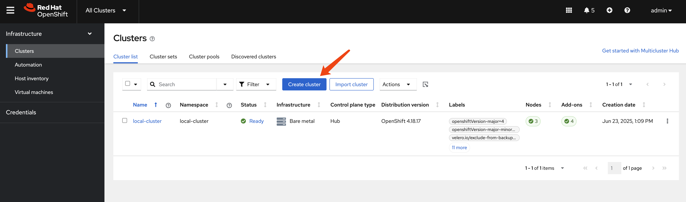

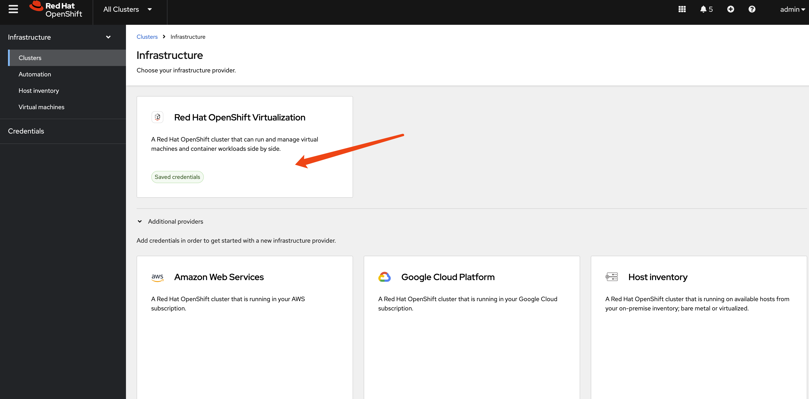

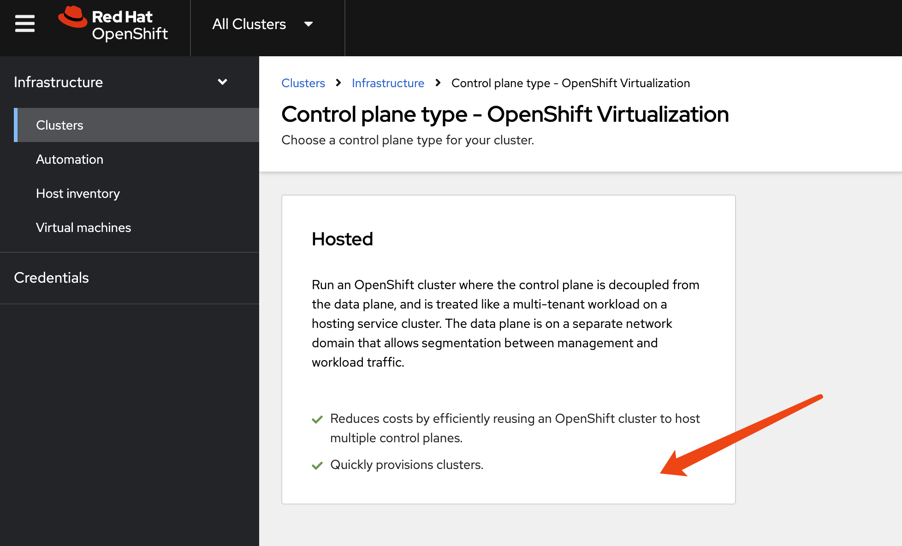

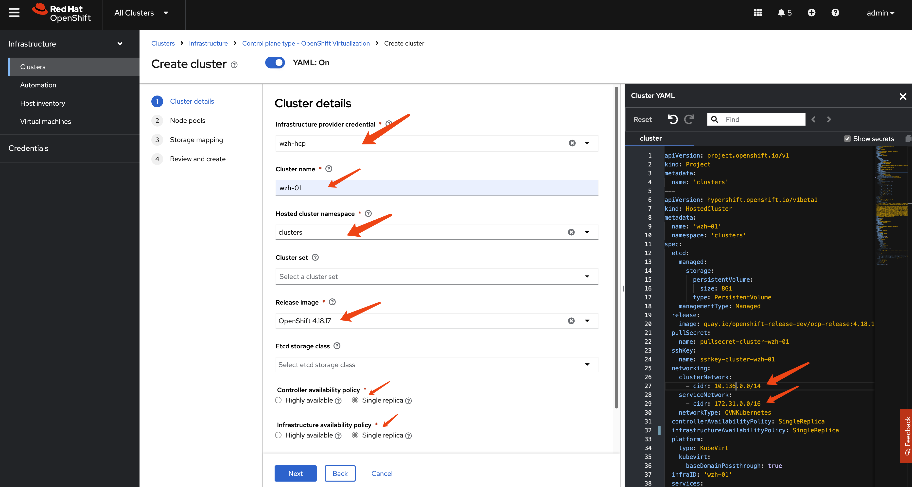

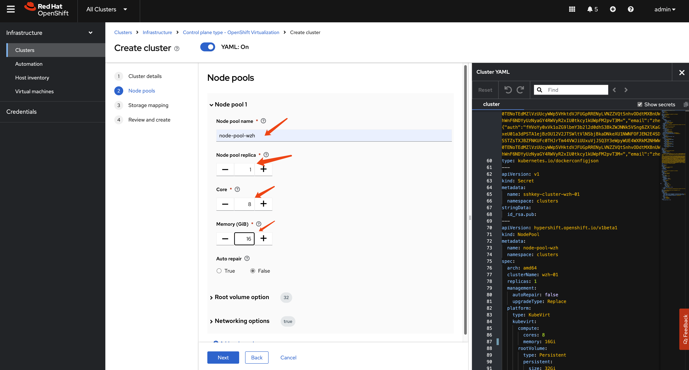

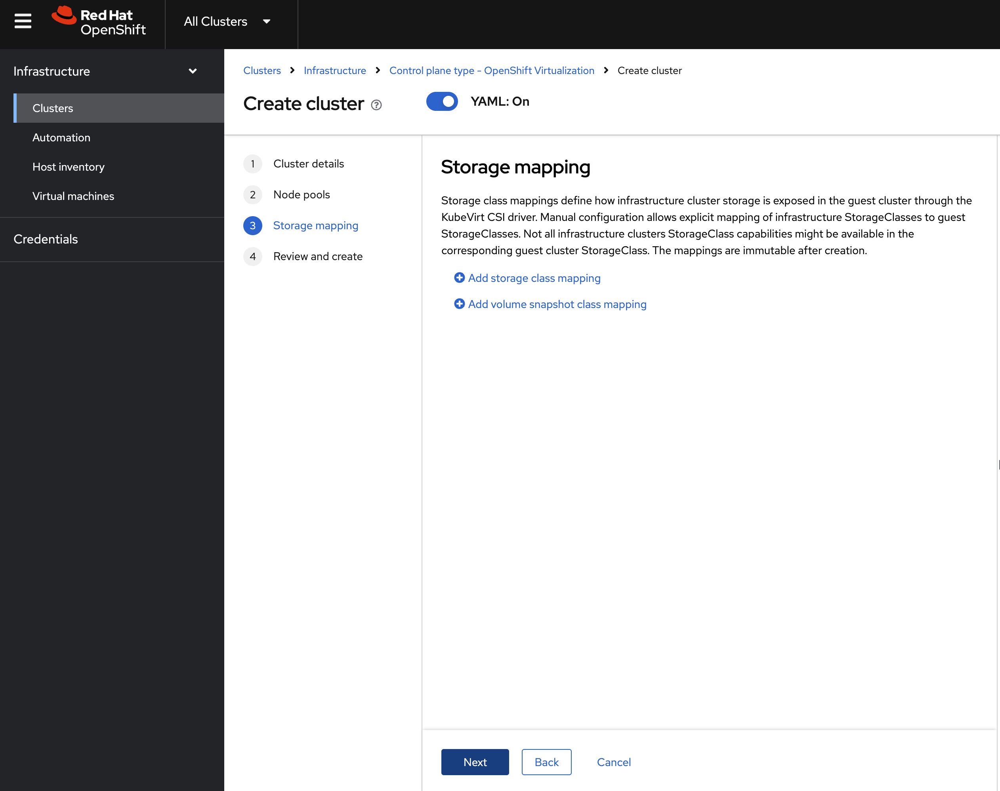

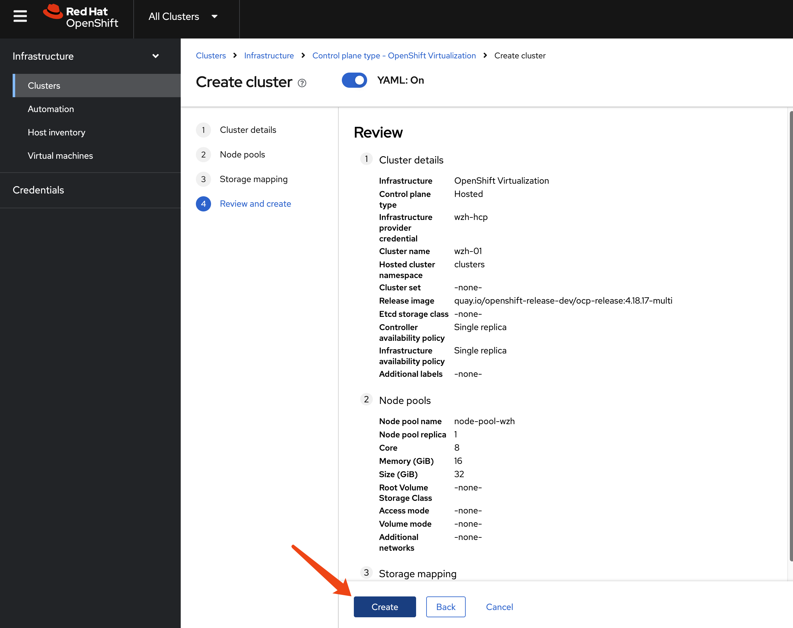

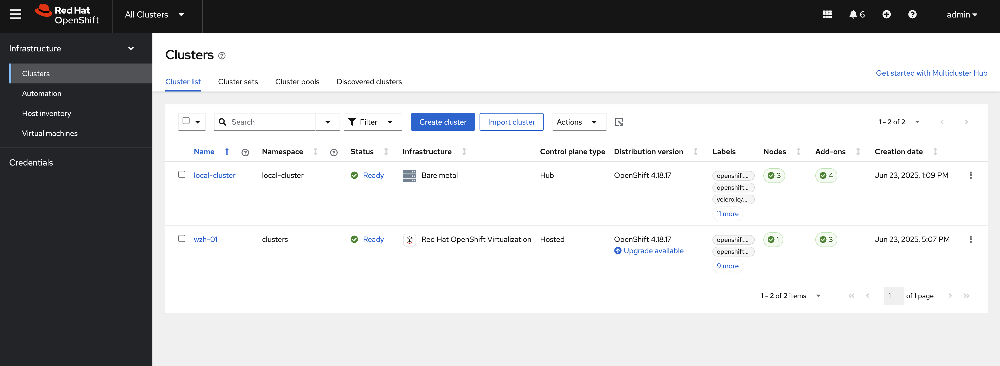

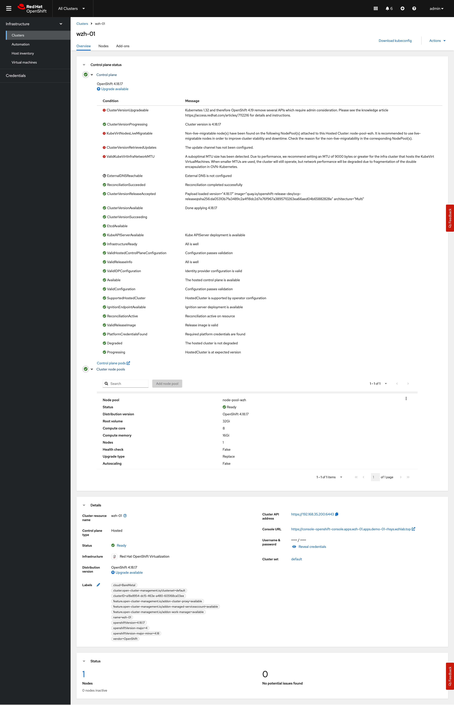

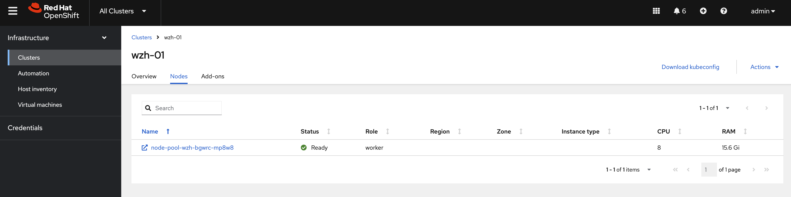

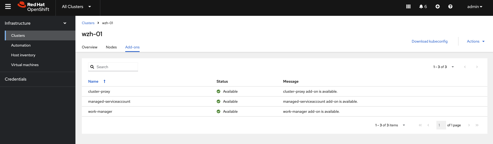

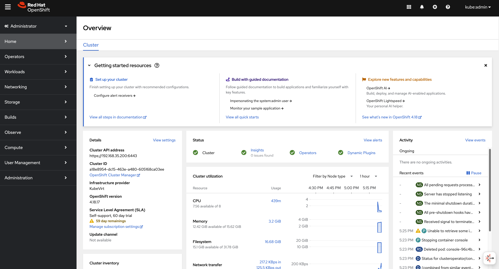

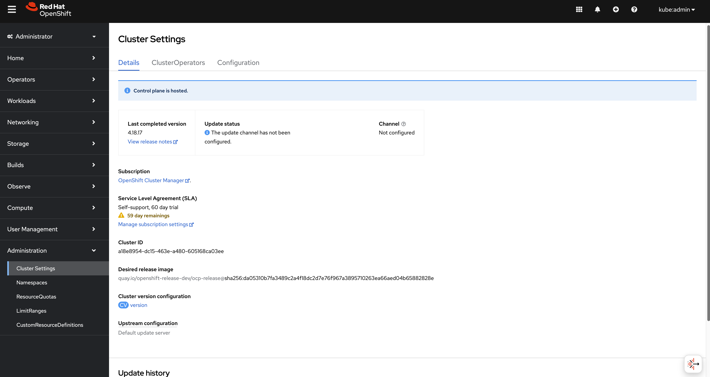

## using cli

You can use `HCP` to create the hosted cluster.

```bash
oc get ConsoleCLIDownload hcp-cli-download -o json | jq -r ".spec"
# {
#   "description": "With the Hosted Control Plane command line interface, you can create and manage OpenShift hosted clusters.\n",
#   "displayName": "hcp - Hosted Control Plane Command Line Interface (CLI)",
#   "links": [
#     {
#       "href": "https://hcp-cli-download-multicluster-engine.apps.demo-01-rhsys.wzhlab.top/linux/amd64/hcp.tar.gz",
#       "text": "Download hcp CLI for Linux for x86_64"
#     },
#     {
#       "href": "https://hcp-cli-download-multicluster-engine.apps.demo-01-rhsys.wzhlab.top/darwin/amd64/hcp.tar.gz",
#       "text": "Download hcp CLI for Mac for x86_64"
#     },
#     {
#       "href": "https://hcp-cli-download-multicluster-engine.apps.demo-01-rhsys.wzhlab.top/windows/amd64/hcp.tar.gz",
#       "text": "Download hcp CLI for Windows for x86_64"
#     },
#     {
#       "href": "https://hcp-cli-download-multicluster-engine.apps.demo-01-rhsys.wzhlab.top/linux/arm64/hcp.tar.gz",
#       "text": "Download hcp CLI for Linux for ARM 64"
#     },
#     {
#       "href": "https://hcp-cli-download-multicluster-engine.apps.demo-01-rhsys.wzhlab.top/darwin/arm64/hcp.tar.gz",
#       "text": "Download hcp CLI for Mac for ARM 64"
#     },
#     {
#       "href": "https://hcp-cli-download-multicluster-engine.apps.demo-01-rhsys.wzhlab.top/linux/ppc64/hcp.tar.gz",
#       "text": "Download hcp CLI for Linux for IBM Power"
#     },
#     {
#       "href": "https://hcp-cli-download-multicluster-engine.apps.demo-01-rhsys.wzhlab.top/linux/ppc64le/hcp.tar.gz",
#       "text": "Download hcp CLI for Linux for IBM Power, little endian"
#     },
#     {
#       "href": "https://hcp-cli-download-multicluster-engine.apps.demo-01-rhsys.wzhlab.top/linux/s390x/hcp.tar.gz",
#       "text": "Download hcp CLI for Linux for IBM Z"
#     }
#   ]
# }

wget --no-check-certificate https://hcp-cli-download-multicluster-engine.apps.demo-01-rhsys.wzhlab.top/linux/amd64/hcp.tar.gz

tar -xzf hcp.tar.gz -C $HOME/.local/bin/

oc get secret -n openshift-config pull-secret -o template='{{index .data ".dockerconfigjson"}}' | base64 --decode > ~/pull-secret.json


hosted_cluster_name=wzh-01
worker_count=1
value_for_memory=16Gi
value_for_cpu=8
var_release_image=quay.io/openshift-release-dev/ocp-release:4.18.17-multi
cluster_cidr="10.136.0.0/14"
service_cidr="172.31.0.0/16"

hcp create cluster kubevirt \
--name $hosted_cluster_name \
--node-pool-replicas $worker_count \
--pull-secret ~/pull-secret.json \
--memory $value_for_memory \
--cores $value_for_cpu \
--release-image $var_release_image \
--cluster-cidr ${cluster_cidr} \
--service-cidr ${service_cidr} \
--control-plane-availability-policy SingleReplica \
--infra-availability-policy SingleReplica

hcp create kubeconfig --name wzh-01 > kubeconfig.yaml


# hcp destroy cluster kubevirt --name wzh-01


oc --kubeconfig=kubeconfig.yaml get pod -A | grep ingress
# openshift-ingress-canary                           ingress-canary-bsf5b                                      1/1     Running   0             78m
# openshift-ingress                                  router-default-7dd6bbdd-6sw8q                             1/1     Running   0             78m


```

## debug

You can use the following steps to check the ingress network traffic path.

```bash

oc patch ingresscontroller -n openshift-ingress-operator default --type=json -p '[{ "op": "add", "path": "/spec/routeAdmission", "value": {wildcardPolicy: "WildcardsAllowed"}}]'


oc get secret -n openshift-config pull-secret -o template='{{index .data ".dockerconfigjson"}}' | base64 --decode > ~/pull-secret.json

hcp create cluster kubevirt \
--name cluster1 \
--release-image quay.io/openshift-release-dev/ocp-release:4.16.41-x86_64 \
--node-pool-replicas 2 \
--pull-secret ~/pull-secret.json \
--memory 6Gi \
--cores 2

hcp create kubeconfig --name cluster1 > cluster1-kubeconfig

oc get node -o wide
# NAME                            STATUS   ROLES                  AGE   VERSION            INTERNAL-IP   EXTERNAL-IP   OS-IMAGE                                                KERNEL-VERSION                 CONTAINER-RUNTIME
# control-plane-cluster-chw7m-1   Ready    control-plane,master   96m   v1.29.14+7cf4c05   10.10.10.10   <none>        Red Hat Enterprise Linux CoreOS 416.94.202505191152-0   5.14.0-427.68.2.el9_4.x86_64   cri-o://1.29.13-6.rhaos4.16.git729443e.el9
# control-plane-cluster-chw7m-2   Ready    control-plane,master   96m   v1.29.14+7cf4c05   10.10.10.11   <none>        Red Hat Enterprise Linux CoreOS 416.94.202505191152-0   5.14.0-427.68.2.el9_4.x86_64   cri-o://1.29.13-6.rhaos4.16.git729443e.el9
# control-plane-cluster-chw7m-3   Ready    control-plane,master   80m   v1.29.14+7cf4c05   10.10.10.12   <none>        Red Hat Enterprise Linux CoreOS 416.94.202505191152-0   5.14.0-427.68.2.el9_4.x86_64   cri-o://1.29.13-6.rhaos4.16.git729443e.el9
# worker-cluster-chw7m-1          Ready    worker                 85m   v1.29.14+7cf4c05   10.10.10.20   <none>        Red Hat Enterprise Linux CoreOS 416.94.202505191152-0   5.14.0-427.68.2.el9_4.x86_64   cri-o://1.29.13-6.rhaos4.16.git729443e.el9
# worker-cluster-chw7m-2          Ready    worker                 85m   v1.29.14+7cf4c05   10.10.10.21   <none>        Red Hat Enterprise Linux CoreOS 416.94.202505191152-0   5.14.0-427.68.2.el9_4.x86_64   cri-o://1.29.13-6.rhaos4.16.git729443e.el9
# worker-cluster-chw7m-3          Ready    worker                 85m   v1.29.14+7cf4c05   10.10.10.22   <none>        Red Hat Enterprise Linux CoreOS 416.94.202505191152-0   5.14.0-427.68.2.el9_4.x86_64   cri-o://1.29.13-6.rhaos4.16.git729443e.el9

oc --kubeconfig=cluster1-kubeconfig get node -o wide
# NAME                      STATUS   ROLES    AGE   VERSION            INTERNAL-IP    EXTERNAL-IP   OS-IMAGE                                                KERNEL-VERSION                 CONTAINER-RUNTIME
# cluster1-34459eb5-8rz87   Ready    worker   20m   v1.29.14+7cf4c05   10.235.0.109   <none>        Red Hat Enterprise Linux CoreOS 416.94.202505191152-0   5.14.0-427.68.2.el9_4.x86_64   cri-o://1.29.13-6.rhaos4.16.git729443e.el9
# cluster1-34459eb5-92vwb   Ready    worker   20m   v1.29.14+7cf4c05   10.234.0.84    <none>        Red Hat Enterprise Linux CoreOS 416.94.202505191152-0   5.14.0-427.68.2.el9_4.x86_64   cri-o://1.29.13-6.rhaos4.16.git729443e.el9

oc get pod -n clusters-cluster1
# NAME                                                  READY   STATUS    RESTARTS       AGE
# capi-provider-5ffdb4ff76-q54pm                        1/1     Running   0              4h5m
# catalog-operator-5577489cfb-4fvz6                     2/2     Running   3 (4h2m ago)   4h3m
# certified-operators-catalog-66b8f94fdc-nkf8l          1/1     Running   0              4h3m
# cluster-api-65b956c6d-4nvhw                           1/1     Running   0              4h5m
# cluster-image-registry-operator-5f659c7846-wrvzp      2/2     Running   0              4h3m
# cluster-network-operator-5dc6b5d48b-mdbfm             2/2     Running   0              4h3m
# cluster-node-tuning-operator-674f7d7fb9-4ndhc         1/1     Running   0              4h3m
# cluster-policy-controller-64dd674d57-cwxl9            1/1     Running   0              4h3m
# cluster-policy-controller-64dd674d57-dfw5f            1/1     Running   0              4h3m
# cluster-policy-controller-64dd674d57-rtvv5            1/1     Running   0              4h3m
# cluster-storage-operator-8599994c74-sxs48             1/1     Running   0              4h3m
# cluster-version-operator-9d59b547c-6nk29              1/1     Running   0              4h3m
# community-operators-catalog-7f8db78548-5kjfz          1/1     Running   0              45m
# control-plane-operator-8857686b7-zgt2m                1/1     Running   0              4h5m
# control-plane-pki-operator-dfc8fb7c9-8hwtb            1/1     Running   0              4h5m
# csi-snapshot-controller-56c9c74bb8-24qnw              1/1     Running   0              4h2m
# csi-snapshot-controller-operator-55cf7d8698-pzfzl     1/1     Running   0              4h3m
# csi-snapshot-webhook-7bdd696c5-6cn76                  1/1     Running   0              4h2m
# dns-operator-594fbf7874-gggxm                         1/1     Running   0              4h3m
# etcd-0                                                4/4     Running   0              4h5m
# etcd-1                                                4/4     Running   0              4h5m
# etcd-2                                                4/4     Running   0              4h5m
# hosted-cluster-config-operator-7b54d95b7-x4zjr        1/1     Running   0              4h3m
# ignition-server-ccd54b788-7x8rz                       1/1     Running   0              4h3m
# ignition-server-ccd54b788-w47kn                       1/1     Running   0              4h3m
# ignition-server-ccd54b788-zdc7q                       1/1     Running   0              4h3m
# ignition-server-proxy-6c886bb8c-28fn9                 1/1     Running   0              4h3m
# ignition-server-proxy-6c886bb8c-6jdzl                 1/1     Running   0              4h3m
# ignition-server-proxy-6c886bb8c-6xqwz                 1/1     Running   0              4h3m
# ingress-operator-6495bb45fd-mpgvv                     2/2     Running   0              4h3m
# konnectivity-agent-74fc646974-5mw4b                   1/1     Running   0              4h3m
# konnectivity-agent-74fc646974-b28jf                   1/1     Running   0              4h3m
# konnectivity-agent-74fc646974-hwqks                   1/1     Running   0              4h3m
# kube-apiserver-c9cc7b7cf-kzmk8                        4/4     Running   0              4h4m
# kube-apiserver-c9cc7b7cf-sjsn9                        4/4     Running   0              4h4m
# kube-apiserver-c9cc7b7cf-xjdtr                        4/4     Running   0              4h4m
# kube-controller-manager-779c95db6-42tjm               1/1     Running   0              3h54m
# kube-controller-manager-779c95db6-8v96j               1/1     Running   0              3h53m
# kube-controller-manager-779c95db6-trwjb               1/1     Running   0              3h54m
# kube-scheduler-75c4d59d9b-gcn72                       1/1     Running   0              4h4m
# kube-scheduler-75c4d59d9b-mlmqw                       1/1     Running   0              4h4m
# kube-scheduler-75c4d59d9b-nf84k                       1/1     Running   0              4h4m
# kubevirt-cloud-controller-manager-646d597f9-g9f6h     1/1     Running   0              4h3m
# kubevirt-cloud-controller-manager-646d597f9-klbv9     1/1     Running   1 (4h1m ago)   4h3m
# kubevirt-cloud-controller-manager-646d597f9-l8x56     1/1     Running   0              4h3m
# kubevirt-csi-controller-f97c4b788-jcxk9               5/5     Running   0              4h3m
# machine-approver-77cfbbf4bf-g6b8c                     1/1     Running   0              4h3m
# multus-admission-controller-847d99998f-bbgdg          2/2     Running   0              3h56m
# multus-admission-controller-847d99998f-r5vxg          2/2     Running   0              3h56m
# network-node-identity-68b9756f4f-49bwn                3/3     Running   0              3h56m
# network-node-identity-68b9756f4f-7fdjx                3/3     Running   0              3h56m
# network-node-identity-68b9756f4f-tmm75                3/3     Running   0              3h56m
# oauth-openshift-97b69b444-mj6vv                       4/4     Running   0              4h1m
# oauth-openshift-97b69b444-wrq8g                       4/4     Running   0              4h1m
# oauth-openshift-97b69b444-xf95d                       4/4     Running   0              4h1m
# olm-operator-f7d557b8f-6n8sd                          2/2     Running   0              4h3m
# openshift-apiserver-686b564f95-k2xgl                  3/3     Running   0              3h52m
# openshift-apiserver-686b564f95-n9hlh                  3/3     Running   0              3h51m
# openshift-apiserver-686b564f95-xqnw6                  3/3     Running   0              3h54m
# openshift-controller-manager-7c6965c46c-5gjlc         1/1     Running   0              4h3m
# openshift-controller-manager-7c6965c46c-cbnzt         1/1     Running   0              4h3m
# openshift-controller-manager-7c6965c46c-tvjgj         1/1     Running   0              4h3m
# openshift-oauth-apiserver-85854594c8-8czdk            2/2     Running   0              4h3m
# openshift-oauth-apiserver-85854594c8-8sv5f            2/2     Running   0              4h3m
# openshift-oauth-apiserver-85854594c8-w6kc9            2/2     Running   0              4h3m
# openshift-route-controller-manager-7d545799b8-4hltt   1/1     Running   0              4h3m
# openshift-route-controller-manager-7d545799b8-dw2qr   1/1     Running   0              4h3m
# openshift-route-controller-manager-7d545799b8-x5l29   1/1     Running   0              4h3m
# ovnkube-control-plane-69dbc86f84-d58dt                3/3     Running   0              3h56m
# ovnkube-control-plane-69dbc86f84-wc45w                3/3     Running   0              3h56m
# packageserver-575b869f87-45rj5                        2/2     Running   0              4h3m
# packageserver-575b869f87-9lx7q                        2/2     Running   0              4h3m
# packageserver-575b869f87-xqfbb                        2/2     Running   0              4h3m
# redhat-marketplace-catalog-7c55888d99-zmbhq           1/1     Running   0              4h3m
# redhat-operators-catalog-584984d994-clbqz             1/1     Running   0              4h3m
# virt-launcher-cluster1-a8ceb069-p8hzl-khcfs           1/1     Running   0              4h3m
# virt-launcher-cluster1-a8ceb069-r59xh-w2hln           1/1     Running   0              4h3m

oc get --namespace clusters hostedclusters
# NAME       VERSION   KUBECONFIG                  PROGRESS    AVAILABLE   PROGRESSING   MESSAGE
# cluster1   4.16.41   cluster1-admin-kubeconfig   Completed   True        False         The hosted control plane is available


oc --kubeconfig=cluster1-kubeconfig get co 
# NAME                                       VERSION   AVAILABLE   PROGRESSING   DEGRADED   SINCE   MESSAGE
# console                                    4.16.41   True        False         False      18m     
# csi-snapshot-controller                    4.16.41   True        False         False      26m     
# dns                                        4.16.41   True        False         False      19m     
# image-registry                             4.16.41   True        False         False      19m     
# ingress                                    4.16.41   True        False         False      18m     
# insights                                   4.16.41   True        False         False      19m     
# kube-apiserver                             4.16.41   True        False         False      25m     
# kube-controller-manager                    4.16.41   True        False         False      25m     
# kube-scheduler                             4.16.41   True        False         False      25m     
# kube-storage-version-migrator              4.16.41   True        False         False      19m     
# monitoring                                 4.16.41   True        False         False      11m     
# network                                    4.16.41   True        True          False      20m     DaemonSet "/openshift-multus/network-metrics-daemon" is not available (awaiting 1 nodes)
# node-tuning                                4.16.41   True        False         False      22m     
# openshift-apiserver                        4.16.41   True        False         False      25m     
# openshift-controller-manager               4.16.41   True        False         False      25m     
# openshift-samples                          4.16.41   True        False         False      19m     
# operator-lifecycle-manager                 4.16.41   True        False         False      25m     
# operator-lifecycle-manager-catalog         4.16.41   True        False         False      26m     
# operator-lifecycle-manager-packageserver   4.16.41   True        False         False      25m     
# service-ca                                 4.16.41   True        False         False      19m     
# storage                                    4.16.41   True        False         False      26m


oc get service -n clusters-cluster1 | grep ingress
# default-ingress-passthrough-service-r4xs8f6dtw   ClusterIP      172.231.122.191   <none>         443/TCP             26m


oc get endpointslice -n clusters-cluster1 -l kubernetes.io/service-name=default-ingress-passthrough-service-r4xs8f6dtw
# NAME                                                                       ADDRESSTYPE   PORTS   ENDPOINTS      AGE
# default-ingress-passthrough-service-r4xs8f6dtw-cluster1-dnkns-6c6gb-ipv4   IPv4          31314   10.235.0.109   26m
# default-ingress-passthrough-service-r4xs8f6dtw-cluster1-dnkns-frh9v-ipv4   IPv4          31314   10.234.0.84    26m


oc get endpointslice -n clusters-cluster1 -l kubernetes.io/service-name=default-ingress-passthrough-service-r4xs8f6dtw -o yaml
# apiVersion: v1
# items:
# - addressType: IPv4
#   apiVersion: discovery.k8s.io/v1
#   endpoints:
#   - addresses:
#     - 10.235.0.109
#     conditions:
#       ready: true
#       serving: true
#       terminating: false
#   kind: EndpointSlice
#   metadata:
#     creationTimestamp: "2025-06-20T08:24:57Z"
#     generation: 3
#     labels:
#       endpointslice.kubernetes.io/managed-by: control-plane-operator.hypershift.openshift.io
#       kubernetes.io/service-name: default-ingress-passthrough-service-r4xs8f6dtw
#     name: default-ingress-passthrough-service-r4xs8f6dtw-cluster1-dnkns-6c6gb-ipv4
#     namespace: clusters-cluster1
#     ownerReferences:
#     - apiVersion: kubevirt.io/v1
#       blockOwnerDeletion: true
#       controller: true
#       kind: VirtualMachine
#       name: cluster1-34459eb5-8rz87
#       uid: b7e3efc4-fc47-4e6c-9cbc-fdf7086cee87
#     resourceVersion: "102738"
#     uid: f011bb6d-ca91-4a4a-bc23-e7488673287e
#   ports:
#   - name: https-443
#     port: 31314
#     protocol: TCP
# - addressType: IPv4
#   apiVersion: discovery.k8s.io/v1
#   endpoints:
#   - addresses:
#     - 10.234.0.84
#     conditions:
#       ready: true
#       serving: true
#       terminating: false
#   kind: EndpointSlice
#   metadata:
#     creationTimestamp: "2025-06-20T08:24:57Z"
#     generation: 3
#     labels:
#       endpointslice.kubernetes.io/managed-by: control-plane-operator.hypershift.openshift.io
#       kubernetes.io/service-name: default-ingress-passthrough-service-r4xs8f6dtw
#     name: default-ingress-passthrough-service-r4xs8f6dtw-cluster1-dnkns-frh9v-ipv4
#     namespace: clusters-cluster1
#     ownerReferences:
#     - apiVersion: kubevirt.io/v1
#       blockOwnerDeletion: true
#       controller: true
#       kind: VirtualMachine
#       name: cluster1-34459eb5-92vwb
#       uid: b7d1e3b8-fe1e-48ae-b2f7-c9ede97db9ad
#     resourceVersion: "102921"
#     uid: 40eb652a-8e5b-4707-b058-e40afbef36cc
#   ports:
#   - name: https-443
#     port: 31314
#     protocol: TCP
# kind: List
# metadata:
#   resourceVersion: ""


oc get service/default-ingress-passthrough-service-r4xs8f6dtw -n clusters-cluster1 -o yaml
# apiVersion: v1
# kind: Service
# metadata:
#   creationTimestamp: "2025-06-20T08:24:52Z"
#   labels:
#     hypershift.openshift.io/infra-id: cluster1-qnbwb
#   name: default-ingress-passthrough-service-r4xs8f6dtw
#   namespace: clusters-cluster1
#   resourceVersion: "98333"
#   uid: 8ff019e3-b2e8-4d98-aef3-f8a4c0df7ff6
# spec:
#   clusterIP: 172.231.122.191
#   clusterIPs:
#   - 172.231.122.191
#   internalTrafficPolicy: Cluster
#   ipFamilies:
#   - IPv4
#   ipFamilyPolicy: SingleStack
#   ports:
#   - name: https-443
#     port: 443
#     protocol: TCP
#     targetPort: 31314
#   sessionAffinity: None
#   type: ClusterIP
# status:
#   loadBalancer: {}


oc get pods -n openshift-ovn-kubernetes --show-labels -o wide
# NAME                                    READY   STATUS    RESTARTS   AGE   IP            NODE                            NOMINATED NODE   READINESS GATES   LABELS
# ovnkube-control-plane-996894568-6ndp5   2/2     Running   0          99m   10.10.10.10   control-plane-cluster-chw7m-1   <none>           <none>            app=ovnkube-control-plane,component=network,kubernetes.io/os=linux,openshift.io/component=network,pod-template-hash=996894568,type=infra
# ovnkube-control-plane-996894568-hdqwr   2/2     Running   0          99m   10.10.10.11   control-plane-cluster-chw7m-2   <none>           <none>            app=ovnkube-control-plane,component=network,kubernetes.io/os=linux,openshift.io/component=network,pod-template-hash=996894568,type=infra
# ovnkube-node-6nq8g                      8/8     Running   0          99m   10.10.10.11   control-plane-cluster-chw7m-2   <none>           <none>            app=ovnkube-node,component=network,controller-revision-hash=657d997c56,kubernetes.io/os=linux,openshift.io/component=network,ovn-db-pod=true,pod-template-generation=2,type=infra
# ovnkube-node-7gw6m                      8/8     Running   0          89m   10.10.10.22   worker-cluster-chw7m-3          <none>           <none>            app=ovnkube-node,component=network,controller-revision-hash=657d997c56,kubernetes.io/os=linux,openshift.io/component=network,ovn-db-pod=true,pod-template-generation=2,type=infra
# ovnkube-node-8zwbm                      8/8     Running   0          99m   10.10.10.10   control-plane-cluster-chw7m-1   <none>           <none>            app=ovnkube-node,component=network,controller-revision-hash=657d997c56,kubernetes.io/os=linux,openshift.io/component=network,ovn-db-pod=true,pod-template-generation=2,type=infra
# ovnkube-node-jx92d                      8/8     Running   0          89m   10.10.10.20   worker-cluster-chw7m-1          <none>           <none>            app=ovnkube-node,component=network,controller-revision-hash=657d997c56,kubernetes.io/os=linux,openshift.io/component=network,ovn-db-pod=true,pod-template-generation=2,type=infra
# ovnkube-node-l4rrm                      8/8     Running   0          89m   10.10.10.21   worker-cluster-chw7m-2          <none>           <none>            app=ovnkube-node,component=network,controller-revision-hash=657d997c56,kubernetes.io/os=linux,openshift.io/component=network,ovn-db-pod=true,pod-template-generation=2,type=infra
# ovnkube-node-xlfjg                      8/8     Running   0          84m   10.10.10.12   control-plane-cluster-chw7m-3   <none>           <none>            app=ovnkube-node,component=network,controller-revision-hash=657d997c56,kubernetes.io/os=linux,openshift.io/component=network,ovn-db-pod=true,pod-template-generation=2,type=infra

oc --kubeconfig=cluster1-kubeconfig get pod -n openshift-ovn-kubernetes --show-labels -o wide
# NAME                 READY   STATUS    RESTARTS   AGE   IP             NODE                      NOMINATED NODE   READINESS GATES   LABELS
# ovnkube-node-cwpnf   8/8     Running   0          25m   10.234.0.84    cluster1-34459eb5-92vwb   <none>           <none>            app=ovnkube-node,component=network,controller-revision-hash=65fdbff4c4,kubernetes.io/os=linux,openshift.io/component=network,ovn-db-pod=true,pod-template-generation=2,type=infra
# ovnkube-node-mlpmg   8/8     Running   0          25m   10.235.0.109   cluster1-34459eb5-8rz87   <none>           <none>            app=ovnkube-node,component=network,controller-revision-hash=65fdbff4c4,kubernetes.io/os=linux,openshift.io/component=network,ovn-db-pod=true,pod-template-generation=2,type=infra

VAR_POD=$(oc get pod -n openshift-ingress -l ingresscontroller.operator.openshift.io/deployment-ingresscontroller=default -o name | sed -n '1p' | awk -F '/' '{print $NF}')

oc exec -n openshift-ingress $VAR_POD -- cat haproxy.config | grep -A 8 default-ingress-passthrough-route-
# backend be_tcp:clusters-cluster1:default-ingress-passthrough-route-r4xs8f6dtw
#   balance source

#   hash-type consistent
#   timeout check 5000ms
#   server ept:default-ingress-passthrough-service-r4xs8f6dtw:https-443:10.235.0.109:31314 10.235.0.109:31314 weight 1 check inter 5000ms
#   server ept:default-ingress-passthrough-service-r4xs8f6dtw:https-443:10.234.0.84:31314 10.234.0.84:31314 weight 1 check inter 5000ms


 cat << 'EOF' > check.sh
 #!/bin/bash

# --- 用户配置区 ---

# 1. 设置您的 kubeconfig 文件路径
KUBECONFIG_PATH="cluster1-kubeconfig"

# 2. 设置要操作的 Namespace
NAMESPACE="openshift-ovn-kubernetes"

# 3. 定义您要搜索的值列表。在括号内添加或删除您的搜索词，用空格分隔。
#    例如: SEARCH_TERMS=("10.128.2.59" "some-other-value" "another-bridge")
SEARCH_TERMS=(
  "10.235.0.109"
  "10.234.0.84"
  "172.231.122.191"
)

# 4. 设置要检查的 Pod 数量
POD_COUNT=2

# --- 脚本核心逻辑 ---

# 检查 oc 命令是否存在
if ! command -v oc &> /dev/null; then
    echo "[ERROR] 'oc' command not found. Please ensure it is installed and in your PATH."
    exit 1
fi

# 将搜索词数组转换为 grep 使用的正则表达式模式 (e.g., "value1|value2|value3")
GREP_PATTERN=$(printf "%s|" "${SEARCH_TERMS[@]}")
GREP_PATTERN=${GREP_PATTERN%|} # 移除末尾多余的'|'

# 检查搜索列表是否为空
if [ -z "$GREP_PATTERN" ]; then
    echo "[ERROR] SEARCH_TERMS array is empty. Please add values to search for."
    exit 1
fi

echo "[INFO] Kubeconfig: ${KUBECONFIG_PATH}"
echo "[INFO] Namespace: ${NAMESPACE}"
echo "[INFO] Searching for patterns: ${GREP_PATTERN}"
echo "----------------------------------------------------"

# 获取前N个 Pod 的列表，这样可以避免在循环中重复执行 'oc get'
POD_LIST=$(oc --kubeconfig=${KUBECONFIG_PATH} get pods -n ${NAMESPACE} -l app=ovnkube-node -o name | head -n ${POD_COUNT})

if [ -z "${POD_LIST}" ]; then
    echo "[ERROR] No pods found with label 'app=ovnkube-node' in namespace '${NAMESPACE}'."
    exit 1
fi

# 循环处理每个 Pod
for POD_FULL_NAME in ${POD_LIST}; do
    # 从 "pod/my-pod-name" 中提取出 "my-pod-name"
    POD_NAME=$(basename "${POD_FULL_NAME}")

    echo "[INFO] ==> Checking Pod: ${POD_NAME}"

    # 执行 ovn-nbctl show 命令，并将标准错误重定向到标准输出，以捕获所有信息
    # 注意：脚本化执行时，-it (交互式终端) 是不必要且可能导致问题的，因此已移除。
    CMD_OUTPUT=$(oc --kubeconfig=${KUBECONFIG_PATH} exec -n ${NAMESPACE} "${POD_NAME}" -c ovn-controller -- ovn-nbctl show 2>&1)

    # 检查 oc exec 命令是否执行成功
    if [ $? -ne 0 ]; then
        echo "[ERROR] Failed to execute 'ovn-nbctl show' in pod ${POD_NAME}. Output:"
        echo "${CMD_OUTPUT}"
        continue # 跳过这个Pod，继续下一个
    fi

    # 使用 grep 搜索并提取上下文
    # -E: 使用扩展正则表达式 (为了'|')
    # -B 10: Before, 显示匹配行之前的10行
    # -A 10: After, 显示匹配行之后的10行
    CONTEXT_OUTPUT=$(echo "${CMD_OUTPUT}" | grep -E -B 5 -A 5 "${GREP_PATTERN}")

    # 如果 CONTEXT_OUTPUT 不为空，说明找到了匹配项
    if [ -n "${CONTEXT_OUTPUT}" ]; then
        echo "[SUCCESS] Found match in Pod: ${POD_NAME}"
        echo "================= MATCH DETAILS ================="
        echo "${CONTEXT_OUTPUT}"
        echo "================================================="
    else
        echo "[INFO] No match found in Pod: ${POD_NAME}"
    fi
    echo # 输出一个空行以分隔不同 Pod 的结果
done

echo "[INFO] Script finished."
EOF

bash check.sh
# [INFO] Kubeconfig: cluster1-kubeconfig
# [INFO] Namespace: openshift-ovn-kubernetes
# [INFO] Searching for patterns: 10.235.0.109|10.234.0.84|172.231.122.191
# ----------------------------------------------------
# [INFO] ==> Checking Pod: ovnkube-node-cwpnf
# [SUCCESS] Found match in Pod: ovnkube-node-cwpnf
# ================= MATCH DETAILS =================
#         type: router
#         router-port: rtoj-GR_cluster1-34459eb5-92vwb
# router 8f1a166a-c6b0-49a0-b8bf-5f61f75c74d1 (GR_cluster1-34459eb5-92vwb)
#     port rtoe-GR_cluster1-34459eb5-92vwb
#         mac: "0a:58:0a:ea:00:54"
#         networks: ["10.234.0.84/23"]
#     port rtoj-GR_cluster1-34459eb5-92vwb
#         mac: "0a:58:64:41:00:03"
#         networks: ["100.65.0.3/16"]
#     nat 2a4a2348-5ec0-4e24-bf67-1868756fc9fb
#         external ip: "10.234.0.84"
#         logical ip: "10.133.0.9"
#         type: "snat"
#     nat 43f5b9a8-793b-4f8f-ba46-839fc1723fcd
#         external ip: "10.234.0.84"
#         logical ip: "10.133.0.28"
#         type: "snat"
#     nat 458c3d81-c8e0-4e3b-a68c-5f905fbf4456
#         external ip: "10.234.0.84"
#         logical ip: "10.133.0.19"
#         type: "snat"
#     nat 46684c6a-8ba1-421e-b1fd-cb09e381a83c
#         external ip: "10.234.0.84"
#         logical ip: "10.133.0.17"
#         type: "snat"
#     nat 522d651f-a596-4791-ab47-77b7b3a8be35
#         external ip: "10.234.0.84"
#         logical ip: "10.133.0.5"
#         type: "snat"
#     nat 67d5a123-7e91-4411-a760-493f21d4ba0f
#         external ip: "10.234.0.84"
#         logical ip: "100.65.0.3"
#         type: "snat"
#     nat 6bf27fd3-2aff-4f71-8c1f-8de76239c2ac
#         external ip: "10.234.0.84"
#         logical ip: "10.133.0.22"
#         type: "snat"
#     nat 71f39dc9-63ec-4820-8746-852cf789df34
#         external ip: "10.234.0.84"
#         logical ip: "10.133.0.25"
#         type: "snat"
#     nat 7be25cad-98de-4fdb-bd66-175ce0fd8a2c
#         external ip: "10.234.0.84"
#         logical ip: "10.133.0.18"
#         type: "snat"
#     nat 7d1f75aa-db3e-4595-8db2-6967dc5c0916
#         external ip: "10.234.0.84"
#         logical ip: "10.133.0.4"
#         type: "snat"
#     nat 97d0804c-8e6e-4f9f-a680-98399bab80a7
#         external ip: "10.234.0.84"
#         logical ip: "10.133.0.23"
#         type: "snat"
#     nat bba70e10-a85b-402d-8dd6-ff9bd03f458e
#         external ip: "10.234.0.84"
#         logical ip: "10.133.0.27"
#         type: "snat"
#     nat c4d93873-6370-4203-a780-282f97bec059
#         external ip: "10.234.0.84"
#         logical ip: "10.133.0.12"
#         type: "snat"
#     nat c679eb74-052e-4172-b1bd-8f8a01b88f5e
#         external ip: "10.234.0.84"
#         logical ip: "10.133.0.15"
#         type: "snat"
#     nat c990fab7-7b5d-4b1c-a00f-939f3feef6c3
#         external ip: "10.234.0.84"
#         logical ip: "10.133.0.20"
#         type: "snat"
#     nat c9a1e03c-462a-4037-b3a7-ae0fc51a5682
#         external ip: "10.234.0.84"
#         logical ip: "10.133.0.10"
#         type: "snat"
#     nat e5ab788e-38f9-4062-90af-b9116470c016
#         external ip: "10.234.0.84"
#         logical ip: "10.133.0.11"
#         type: "snat"
#     nat ea1244f9-4a39-4cf8-8784-9bd713a0566a
#         external ip: "10.234.0.84"
#         logical ip: "10.133.0.8"
#         type: "snat"
#     nat eb4c4538-c3ba-4b95-9aa9-0329f319081f
#         external ip: "10.234.0.84"
#         logical ip: "10.133.0.24"
#         type: "snat"
# router 4c7f4857-7532-495e-a747-f16ed885ad98 (ovn_cluster_router)
#     port rtos-cluster1-34459eb5-92vwb
#         mac: "0a:58:0a:85:00:01"
# =================================================

# [INFO] ==> Checking Pod: ovnkube-node-mlpmg
# [SUCCESS] Found match in Pod: ovnkube-node-mlpmg
# ================= MATCH DETAILS =================
#     port rtoj-GR_cluster1-34459eb5-8rz87
#         mac: "0a:58:64:41:00:02"
#         networks: ["100.65.0.2/16"]
#     port rtoe-GR_cluster1-34459eb5-8rz87
#         mac: "0a:58:0a:eb:00:6d"
#         networks: ["10.235.0.109/23"]
#     nat 0ab003b9-f34d-4d95-baa8-d11d9dde0d65
#         external ip: "10.235.0.109"
#         logical ip: "10.132.0.24"
#         type: "snat"
#     nat 0c6c85dc-5aa1-46ad-b3d0-2a246124f2ea
#         external ip: "10.235.0.109"
#         logical ip: "10.132.0.20"
#         type: "snat"
#     nat 0e2fd9ff-8897-4b57-b78f-1a4ecb73807a
#         external ip: "10.235.0.109"
#         logical ip: "10.132.0.21"
#         type: "snat"
#     nat 0ec0b4d7-1fcd-4b4f-b579-16cbcfac5c03
#         external ip: "10.235.0.109"
#         logical ip: "10.132.0.17"
#         type: "snat"
#     nat 108ff6c8-4f3f-4226-a956-4632aab02af4
#         external ip: "10.235.0.109"
#         logical ip: "10.132.0.3"
#         type: "snat"
#     nat 1cc7be99-bfd8-4db5-8701-7f52b4afd2f7
#         external ip: "10.235.0.109"
#         logical ip: "10.132.0.25"
#         type: "snat"
#     nat 296c172b-30e6-410a-8eec-18e98ecf9837
#         external ip: "10.235.0.109"
#         logical ip: "10.132.0.28"
#         type: "snat"
#     nat 44b7f763-458e-448d-a583-b2e21280ed77
#         external ip: "10.235.0.109"
#         logical ip: "10.132.0.5"
#         type: "snat"
#     nat 5a2927dc-513e-41cb-8c3c-f8b5e2bbbe94
#         external ip: "10.235.0.109"
#         logical ip: "10.132.0.26"
#         type: "snat"
#     nat 613ef4d6-d5c0-43ba-bbd4-abcf4b62516c
#         external ip: "10.235.0.109"
#         logical ip: "10.132.0.27"
#         type: "snat"
#     nat 678a0e9a-90ac-477e-8a9b-13bb5f9af6ed
#         external ip: "10.235.0.109"
#         logical ip: "10.132.0.22"
#         type: "snat"
#     nat 85e3aa94-2157-483b-954a-91057c13bd62
#         external ip: "10.235.0.109"
#         logical ip: "10.132.0.4"
#         type: "snat"
#     nat 8a4fa442-9f1a-47a7-bff6-eefaa0fb04a3
#         external ip: "10.235.0.109"
#         logical ip: "10.132.0.23"
#         type: "snat"
#     nat 91fe543b-0828-4df0-84b5-66c1cf9881fd
#         external ip: "10.235.0.109"
#         logical ip: "100.65.0.2"
#         type: "snat"
#     nat 9234483d-df98-48a2-aa30-dcf60de85f1a
#         external ip: "10.235.0.109"
#         logical ip: "10.132.0.19"
#         type: "snat"
#     nat 99d6bb88-62df-45df-aacb-5f0581d8e029
#         external ip: "10.235.0.109"
#         logical ip: "10.132.0.9"
#         type: "snat"
#     nat 9b0e52e0-0ab7-465b-b378-80efb592b10d
#         external ip: "10.235.0.109"
#         logical ip: "10.132.0.8"
#         type: "snat"
#     nat 9f0f22ac-6c85-4da4-8842-e81df87a64f5
#         external ip: "10.235.0.109"
#         logical ip: "10.132.0.14"
#         type: "snat"
#     nat ab415e7f-16da-42fd-94c5-50ff42768b54
#         external ip: "10.235.0.109"
#         logical ip: "10.132.0.18"
#         type: "snat"
#     nat b5cc9589-9517-4519-b6c2-67c7a8d1f2a6
#         external ip: "10.235.0.109"
#         logical ip: "10.132.0.12"
#         type: "snat"
#     nat bbbe0963-30f5-4c7d-883d-8fd859b9761e
#         external ip: "10.235.0.109"
#         logical ip: "10.132.0.13"
#         type: "snat"
#     nat c3f92e3a-2fa5-45a7-9cbc-a4c629f40aec
#         external ip: "10.235.0.109"
#         logical ip: "10.132.0.6"
#         type: "snat"
#     nat d05e5a7a-7bce-4ecb-98c0-605ac5b39e69
#         external ip: "10.235.0.109"
#         logical ip: "10.132.0.7"
#         type: "snat"
#     nat df7aecda-9242-4a62-ac17-a5258607094c
#         external ip: "10.235.0.109"
#         logical ip: "10.132.0.11"
#         type: "snat"
# router 56d2d552-6bf2-4777-84b7-c85c1c2b7aad (ovn_cluster_router)
#     port rtoj-ovn_cluster_router
#         mac: "0a:58:64:41:00:01"
# =================================================

# [INFO] Script finished.


```

# Upgrade from OCP 4.18 to 4.19

```bash
oc -n openshift-config patch cm admin-acks --patch '{"data":{"ack-4.18-kube-1.32-api-removals-in-4.19":"true"}}' --type=merge
```
# end