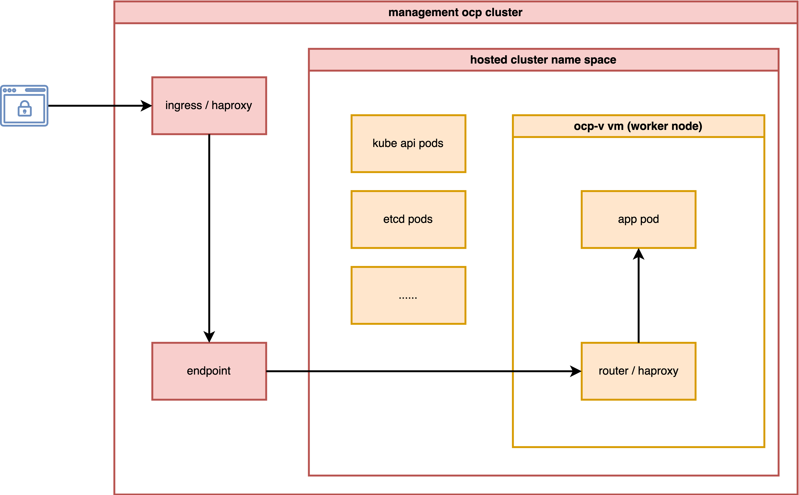
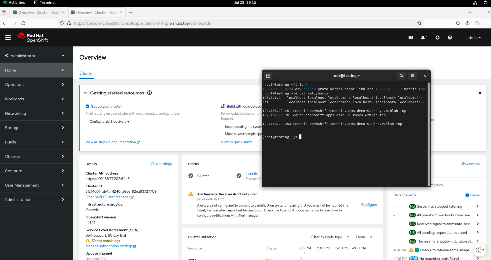
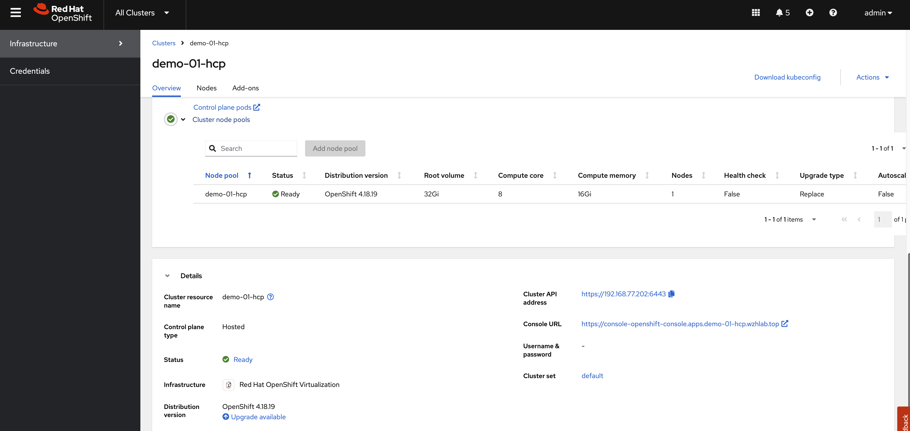

> [!NOTE]
> work in progress
# run hcp with ocp-v

Continuing from the previous [MetalLB on 2nic testing](./2025.07.metallb.2nic.md), we will explore how to expose the host control plane's hosted cluster through a second network.

In this test, we will activate a host control plane based on ocp-v to test its functionality.

The most important aspect is to analyze how the ingress network traffic path looks.

<!--  -->

# install metalLB

The MetalLB settings are the same as in the previous document; you can refer to it [here](./2025.07.metallb.2nic.md#enable-ip-forward-for-nodes).

# install ocp-v

We need ocp-v to provide VMs, which will serve as worker nodes for the hosted cluster.


Because we have customized NFS storage, we need to ensure CNV recognizes it.

```bash

cat << EOF > $BASE_DIR/data/install/cnv-sp.yaml
apiVersion: cdi.kubevirt.io/v1beta1
kind: StorageProfile
metadata:
  name: nfs-dynamic
spec:
  claimPropertySets:
  - accessModes:
    - ReadWriteMany
    volumeMode: Filesystem
EOF

oc apply -f $BASE_DIR/data/install/cnv-sp.yaml

```

# install multicluster engine Operator

We do not need ACM; MCE is sufficient for HCP over OCP-V, as MCE is a subset of ACM.


After enabling MCE, wait approximately 10 minutes for the necessary pods to install. Once complete, the new web UI will be accessible.


# hcp

Okay, let's start with HCP.

This time, we do not need to patch the ingress, as MetalLB will directly redirect traffic from the node to the hosted cluster.

```bash

# oc patch ingresscontroller -n openshift-ingress-operator default \
# --type=json \
# -p '[{ "op": "add", "path": "/spec/routeAdmission", "value": {"wildcardPolicy":
# "WildcardsAllowed"}}]'

```

Next, verify your DNS settings so the hosted cluster's domain name can be resolved. Set the DNS record:
- `*.apps.demo-01-hcp.wzhlab.top` -> `192.168.77.202`


## using cli

You can use the `HCP` CLI to create the hosted cluster.

First, ensure you have the `hcp` CLI tool installed on your local machine.

```bash
oc get ConsoleCLIDownload hcp-cli-download -o json | jq -r ".spec"
# {
#   "description": "With the Hosted Control Plane command line interface, you can create and manage OpenShift hosted clusters.\n",
#   "displayName": "hcp - Hosted Control Plane Command Line Interface (CLI)",
#   "links": [
#     {
#       "href": "https://hcp-cli-download-multicluster-engine.apps.demo-01-rhsys.wzhlab.top/linux/amd64/hcp.tar.gz",
#       "text": "Download hcp CLI for Linux for x86_64"
#     },
#     {
#       "href": "https://hcp-cli-download-multicluster-engine.apps.demo-01-rhsys.wzhlab.top/darwin/amd64/hcp.tar.gz",
#       "text": "Download hcp CLI for Mac for x86_64"
#     },
#     {
#       "href": "https://hcp-cli-download-multicluster-engine.apps.demo-01-rhsys.wzhlab.top/windows/amd64/hcp.tar.gz",
#       "text": "Download hcp CLI for Windows for x86_64"
#     },
#     {
#       "href": "https://hcp-cli-download-multicluster-engine.apps.demo-01-rhsys.wzhlab.top/linux/arm64/hcp.tar.gz",
#       "text": "Download hcp CLI for Linux for ARM 64"
#     },
#     {
#       "href": "https://hcp-cli-download-multicluster-engine.apps.demo-01-rhsys.wzhlab.top/darwin/arm64/hcp.tar.gz",
#       "text": "Download hcp CLI for Mac for ARM 64"
#     },
#     {
#       "href": "https://hcp-cli-download-multicluster-engine.apps.demo-01-rhsys.wzhlab.top/linux/ppc64/hcp.tar.gz",
#       "text": "Download hcp CLI for Linux for IBM Power"
#     },
#     {
#       "href": "https://hcp-cli-download-multicluster-engine.apps.demo-01-rhsys.wzhlab.top/linux/ppc64le/hcp.tar.gz",
#       "text": "Download hcp CLI for Linux for IBM Power, little endian"
#     },
#     {
#       "href": "https://hcp-cli-download-multicluster-engine.apps.demo-01-rhsys.wzhlab.top/linux/s390x/hcp.tar.gz",
#       "text": "Download hcp CLI for Linux for IBM Z"
#     }
#   ]
# }

wget --no-check-certificate https://hcp-cli-download-multicluster-engine.apps.demo-01-rhsys.wzhlab.top/linux/amd64/hcp.tar.gz

tar -xzf hcp.tar.gz -C $HOME/.local/bin/

```

Next, create the hosted cluster using the following parameters:

```bash

oc get secret -n openshift-config pull-secret -o template='{{index .data ".dockerconfigjson"}}' | base64 --decode > ~/pull-secret.json


hosted_cluster_name=demo-01-hcp
worker_count=1
value_for_memory=16Gi
value_for_cpu=8
var_release_image=quay.io/openshift-release-dev/ocp-release:4.18.19-multi
cluster_cidr="10.136.0.0/14"
service_cidr="172.31.0.0/16"
basedomain="wzhlab.top"

hcp create cluster kubevirt \
--name $hosted_cluster_name \
--node-pool-replicas $worker_count \
--pull-secret ~/pull-secret.json \
--memory $value_for_memory \
--cores $value_for_cpu \
--release-image $var_release_image \
--cluster-cidr ${cluster_cidr} \
--service-cidr ${service_cidr} \
--base-domain ${basedomain} \
--control-plane-availability-policy SingleReplica \
--infra-availability-policy SingleReplica

hcp create kubeconfig --name $hosted_cluster_name > kubeconfig.yaml


# hcp destroy cluster kubevirt --name wzh-01


oc --kubeconfig=kubeconfig.yaml get pod -A | grep ingress
# openshift-ingress-canary                           ingress-canary-bsf5b                                      1/1     Running   0             78m
# openshift-ingress                                  router-default-7dd6bbdd-6sw8q                             1/1     Running   0             78m

```

## setup metalLB

The hosted cluster cannot fully initialize because the ingress component fails to start. To resolve this, we need to modify the MetalLB configuration.

```bash

var_http_port=`oc --kubeconfig=kubeconfig.yaml get services \
-n openshift-ingress router-nodeport-default \
-o jsonpath='{.spec.ports[?(@.name=="http")].nodePort}'`

var_https_port=`oc --kubeconfig=kubeconfig.yaml get services \
-n openshift-ingress router-nodeport-default \
-o jsonpath='{.spec.ports[?(@.name=="https")].nodePort}'`

echo $var_http_port
# 32062
echo $var_https_port
# 32482

cat << EOF > metallb-ingress.yaml
apiVersion: v1
kind: Service
metadata:
  labels:
    app: $hosted_cluster_name
  name: $hosted_cluster_name-apps
  namespace: clusters-$hosted_cluster_name
  annotations:
    # metallb.universe.tf/ip-address-pool: hcp-pool
    metallb.io/ip-allocated-from-pool: hcp-pool
spec:
  ports:
  - name: https-443
    port: 443
    protocol: TCP
    targetPort: $var_https_port
  - name: http-80
    port: 80
    protocol: TCP
    targetPort: $var_http_port
  selector:
    kubevirt.io: virt-launcher
  type: LoadBalancer
EOF

oc apply -f metallb-ingress.yaml


oc -n clusters-$hosted_cluster_name get service $hosted_cluster_name-apps
# NAME               TYPE           CLUSTER-IP       EXTERNAL-IP      PORT(S)                      AGE
# demo-01-hcp-apps   LoadBalancer   172.22.235.208   192.168.77.203   443:30324/TCP,80:32522/TCP   6s

# oc -n clusters-$hosted_cluster_name get service $hosted_cluster_name-apps \
# -o jsonpath='{.status.loadBalancer.ingress[0].ip}'
```

After a short wait, the hosted cluster should be ready. To understand the ingress traffic path, observe the CLI output below. The traffic hits iptables, forwards to OVN, and then a rule/policy within OVN forwards it to the VM.

```bash
# on hosting worker node
iptables -L -v -n -t nat | grep 172.22.235.208
    # 0     0 DNAT       6    --  *      *       0.0.0.0/0            192.168.77.203       tcp dpt:80 to:172.22.235.208:80
    # 0     0 DNAT       6    --  *      *       0.0.0.0/0            192.168.77.203       tcp dpt:443 to:172.22.235.208:443
    # 0     0 DNAT       6    --  *      *       0.0.0.0/0            0.0.0.0/0            ADDRTYPE match dst-type LOCAL tcp dpt:32522 to:172.22.235.208:80
    # 0     0 DNAT       6    --  *      *       0.0.0.0/0            0.0.0.0/0            ADDRTYPE match dst-type LOCAL tcp dpt:30324 to:172.22.235.208:443

# back to helper/station node
oc get vmi -A -o wide
# NAMESPACE              NAME                      AGE   PHASE     IP             NODENAME         READY   LIVE-MIGRATABLE   PAUSED
# clusters-demo-01-hcp   demo-01-hcp-f9rmg-kn6lj   58m   Running   10.135.0.107   worker-02-demo   True    True

# check the ip on ovn database
VAR_POD=$(oc get pods -n openshift-ovn-kubernetes -l app=ovnkube-node -o name | sed -n '1p' | awk -F '/' '{print $NF}')

oc exec -it ${VAR_POD} -c ovn-controller -n openshift-ovn-kubernetes -- ovn-nbctl lb-list | grep 172.22.235.208
# 8270a575-1164-4cad-966c-2f48cec8e7c9    Service_clusters    tcp        172.22.235.208:443      10.135.0.107:32482
#                                                             tcp        172.22.235.208:80       10.135.0.107:32062

```

# add htpasswd auth in hosted cluster

Initially, the hosted cluster only has the `kubeadmin` user. We will add `htpasswd` as an authentication method to access the cluster.

- https://validatedpatterns.io/blog/2024-02-07-hcp-htpasswd-config/


```bash

# init the htpasswd file
htpasswd -c -B -b ${BASE_DIR}/data/install/users.htpasswd admin redhat

# add additional user
htpasswd -B -b ${BASE_DIR}/data/install/users.htpasswd user01 redhat

# import the htpasswd file
oc create secret generic htpass-secret-$hosted_cluster_name \
--from-file=htpasswd=${BASE_DIR}/data/install/users.htpasswd \
-n clusters

cat << EOF > ${BASE_DIR}/data/install/oauth.yaml
spec:
  configuration:
    oauth:
      identityProviders:
      - name: htpasswd
        mappingMethod: claim 
        type: HTPasswd
        htpasswd:
          fileData:
            name: htpass-secret-$hosted_cluster_name
EOF

# Make sure your kubeconfig points to the MANAGEMENT CLUSTER
oc patch hostedcluster $hosted_cluster_name \
-n clusters \
--type merge \
--patch-file=${BASE_DIR}/data/install/oauth.yaml

oc --kubeconfig=kubeconfig.yaml adm policy add-cluster-role-to-user cluster-admin admin


oc --kubeconfig=kubeconfig.yaml get co
# NAME                                       VERSION   AVAILABLE   PROGRESSING   DEGRADED   SINCE   MESSAGE
# console                                    4.18.19   True        False         False      59m
# csi-snapshot-controller                    4.18.19   True        False         False      73m
# dns                                        4.18.19   True        False         False      66m
# image-registry                             4.18.19   True        False         False      66m
# ingress                                    4.18.19   True        False         False      66m
# insights                                   4.18.19   True        False         False      67m
# kube-apiserver                             4.18.19   True        False         False      74m
# kube-controller-manager                    4.18.19   True        False         False      73m
# kube-scheduler                             4.18.19   True        False         False      73m
# kube-storage-version-migrator              4.18.19   True        False         False      66m
# monitoring                                 4.18.19   True        False         False      65m
# network                                    4.18.19   True        False         False      67m
# node-tuning                                4.18.19   True        False         False      68m
# openshift-apiserver                        4.18.19   True        False         False      74m
# openshift-controller-manager               4.18.19   True        False         False      74m
# openshift-samples                          4.18.19   True        False         False      66m
# operator-lifecycle-manager                 4.18.19   True        False         False      73m
# operator-lifecycle-manager-catalog         4.18.19   True        False         False      73m
# operator-lifecycle-manager-packageserver   4.18.19   True        False         False      73m
# service-ca                                 4.18.19   True        False         False      67m
# storage                                    4.18.19   True        False         False      74m
```

# testing

Finally, let's test the setup using the web console. Since we are using a disconnected VM connected only to the second network, we will use `/etc/hosts` for domain name resolution.

```bash

cat << EOF >> /etc/hosts

192.168.77.203 console-openshift-console.apps.demo-01-hcp.wzhlab.top
192.168.77.201 oauth-clusters-demo-01-hcp.apps.demo-01-rhsys.wzhlab.top

EOF


cat /etc/hosts
# ......
# 192.168.77.201 console-openshift-console.apps.demo-01-rhsys.wzhlab.top
# 192.168.77.201 oauth-openshift.apps.demo-01-rhsys.wzhlab.top

# 192.168.77.203 console-openshift-console.apps.demo-01-hcp.wzhlab.top
# 192.168.77.201 oauth-clusters-demo-01-hcp.apps.demo-01-rhsys.wzhlab.top

```

First, we will test using the CLI.

```bash

# testing with curl should work
curl -v --insecure --resolve console-openshift-console.apps.demo-01-hcp.wzhlab.top:443:192.168.77.203 https://console-openshift-console.apps.demo-01-hcp.wzhlab.top/
# * Added console-openshift-console.apps.demo-01-hcp.wzhlab.top:443:192.168.77.203 to DNS cache                                                                                        [42/450]
# * Hostname console-openshift-console.apps.demo-01-hcp.wzhlab.top was found in DNS cache
# *   Trying 192.168.77.203:443...
# * Connected to console-openshift-console.apps.demo-01-hcp.wzhlab.top (192.168.77.203) port 443 (#0)
# ......


oc login --insecure-skip-tls-verify=true https://192.168.77.202:6443 -u admin -p redhat
# WARNING: Using insecure TLS client config. Setting this option is not supported!

# Login successful.

# You have access to 63 projects, the list has been suppressed. You can list all projects with 'oc projects'

# Using project "default".

oc get node
# NAME                      STATUS   ROLES    AGE   VERSION
# demo-01-hcp-f9rmg-kn6lj   Ready    worker   44m   v1.31.9

```

Next, access the VM console and use a browser to reach the hosted cluster's web console.



The hosted cluster's status can also be verified on the MCE console.



# end


