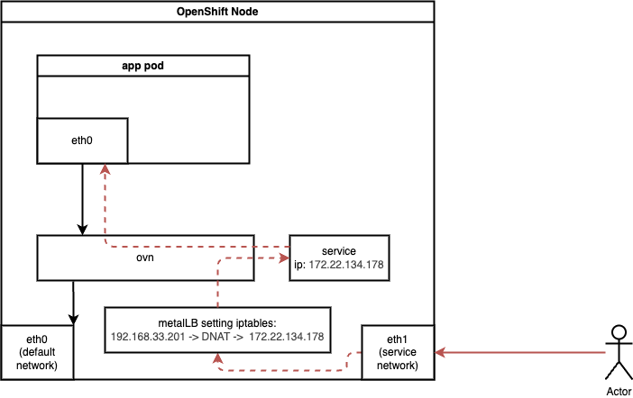
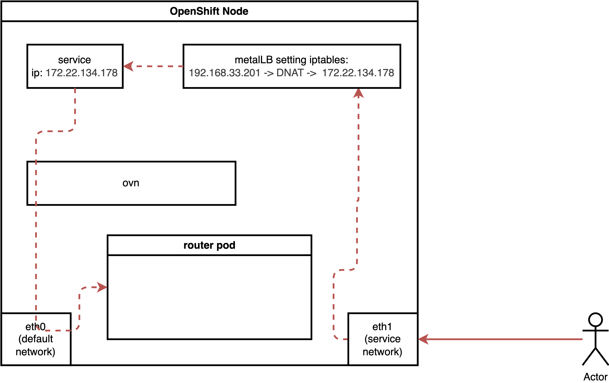
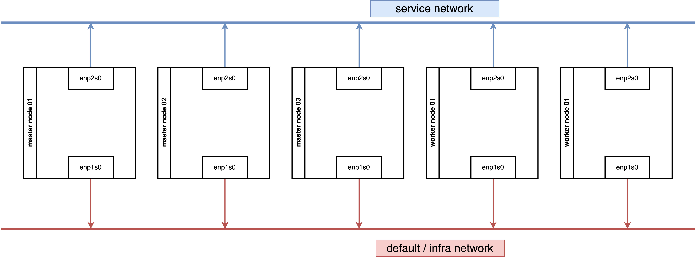
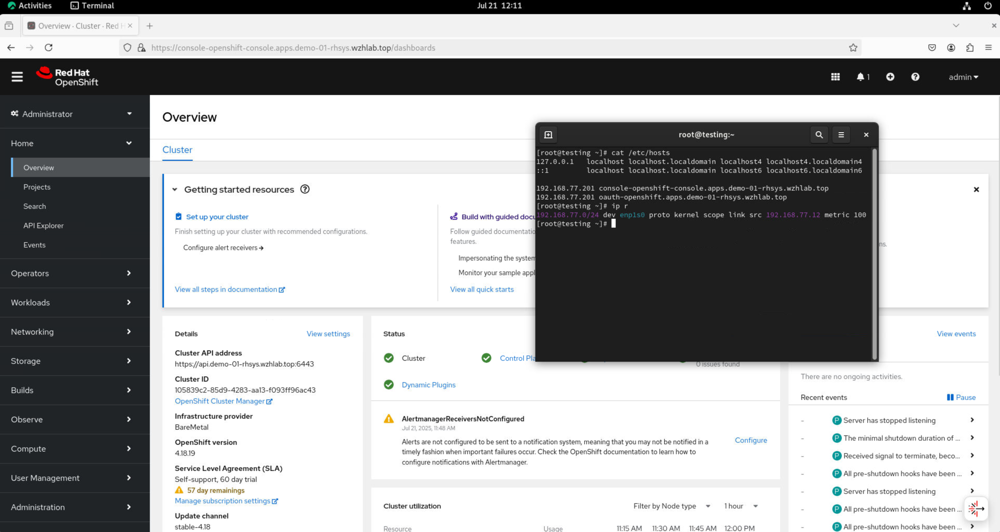

> [!NOTE]
> Work in progress
# Using MetalLB to Expose Services on a Second NIC

Refer to the official documentation for [MetalLB to expose services on a second network](https://docs.redhat.com/en/documentation/openshift_container_platform/4.19/html/networking/load-balancing-with-metallb#nw-metallb-configure-secondary-interface_about-advertising-ip-address-pool).

For a second NIC with a normal pod, the ingress traffic flow is as follows:



For a pod running with host network, the ingress traffic flow is as follows:



Our demo environment, consisting of 3 master nodes and 2 worker nodes, works as expected. If you encounter issues in your environment, verify the underlying network security configuration, such as MAC spoofing denial settings.

We tested a configuration where both 3 master nodes and 2 worker nodes are connected to two networks.



We also tested a configuration where 3 master nodes are connected to one network, and 2 worker nodes are connected to two networks.


Both network architectures work.

# Enable IP Forward for Nodes

While it is preferable to limit IP forwarding to specific NICs, for simplicity, we will enable it for all NICs.

```bash
oc patch network.operator cluster -p '{"spec":{"defaultNetwork":{"ovnKubernetesConfig":
{"gatewayConfig":{"ipForwarding": "Global"}}}}}' --type=merge
```

If you wish to limit forwarding to a specific NIC, refer to the [official documentation](https://docs.redhat.com/en/documentation/openshift_container_platform/4.18/html/networking/load-balancing-with-metallb#nw-enabling-ip-forwarding-specific-interface_about-advertising-ip-address-pool).

# Install MetalLB


Create a single instance of a MetalLB custom resource:

```yaml
apiVersion: metallb.io/v1beta1
kind: MetalLB
metadata:
  name: metallb
  namespace: metallb-system
```

Configure IP Address Pool

```yaml
apiVersion: metallb.io/v1beta1
kind: IPAddressPool
metadata:
  namespace: metallb-system
  name: hcp-pool
spec:
  addresses:
  - 192.168.77.200-192.168.77.220
  autoAssign: true
  avoidBuggyIPs: true
```

Configure L2 Advertisements

Initially, we planned to manually select nodes and NICs for IP broadcasting. However, testing revealed that MetalLB can automatically select the appropriate nodes and NICs, simplifying the configuration to node selection only.

```bash
oc label node worker-01-demo network-zone=enp2s0

oc label node worker-02-demo network-zone=enp2s0
```

By defining the L2 advertisement on the worker node, all ingress traffic will initially reach a worker node and then be redirected to its final destination.

```yaml
apiVersion: metallb.io/v1beta1
kind: L2Advertisement
metadata:
  name: l2-advertisement
  namespace: metallb-system
spec:
  ipAddressPools:
   - hcp-pool
  nodeSelectors:
    - matchLabels:
        network-zone: enp2s0
  # interfaces:
  #   - enp2s0
```

# Expose Kube-API

Let's expose a service. Exposing a normal pod connected to the default OVN network is straightforward and covered in the official documentation.

Therefore, we will focus on exposing special services, such as the Kube-API, which listen on 0.0.0.0. The process for exposing these services is surprisingly simple.

It turns out to be very easy.

```bash

oc get pods -n openshift-kube-apiserver -l app=openshift-kube-apiserver,apiserver="true"
# NAME                            READY   STATUS    RESTARTS   AGE
# kube-apiserver-master-01-demo   5/5     Running   0          3h22m
# kube-apiserver-master-02-demo   5/5     Running   0          3h19m
# kube-apiserver-master-03-demo   5/5     Running   0          3h16m

cat << EOF > ${BASE_DIR}/data/install/metallb-kube-api.yaml
apiVersion: v1
kind: Service
metadata:
  name: kube-api-secondary-lb
  namespace: openshift-kube-apiserver
  annotations:
    # This annotation is essential.
    # Replace 'your-eth1-pool-name' with the name of your IPAddressPool for eth1.
    # metallb.universe.tf/ip-address-pool: hcp-pool
    metallb.io/ip-address-pool: hcp-pool
spec:
  # This requests an IP from MetalLB
  type: LoadBalancer 
  # externalTrafficPolicy: Local
  selector:
    # 👇 Use the labels you found in the previous step
    app: openshift-kube-apiserver 
    apiserver: "true"
  ports:
    - name: https
      protocol: TCP
      port: 6443
      targetPort: 6443
EOF

oc apply -f ${BASE_DIR}/data/install/metallb-kube-api.yaml

oc get svc kube-api-secondary-lb -n openshift-kube-apiserver
# NAME                    TYPE           CLUSTER-IP      EXTERNAL-IP      PORT(S)          AGE
# kube-api-secondary-lb   LoadBalancer   172.22.78.172   192.168.77.200   6443:31135/TCP   1s

oc describe ep kube-api-secondary-lb -n openshift-kube-apiserver
# Name:         kube-api-secondary-lb
# Namespace:    openshift-kube-apiserver
# Labels:       <none>
# Annotations:  endpoints.kubernetes.io/last-change-trigger-time: 2025-07-18T13:40:17Z
# Subsets:
#   Addresses:          192.168.99.23,192.168.99.24,192.168.99.25
#   NotReadyAddresses:  <none>
#   Ports:
#     Name   Port  Protocol
#     ----   ----  --------
#     https  6443  TCP

# Events:  <none>

```

## Testing

We have a kube-api endpoint, we can use it to test the API server.

```bash

oc login --insecure-skip-tls-verify=true https://192.168.77.200:6443 -u admin -p redhat
# WARNING: Using insecure TLS client config. Setting this option is not supported!

# Login successful.

# You have access to 90 projects, the list has been suppressed. You can list all projects with 'oc projects'

# Using project "default".
# Welcome! See 'oc help' to get started.


oc get node
# NAME             STATUS   ROLES                         AGE   VERSION
# master-01-demo   Ready    control-plane,master,worker   27h   v1.31.9
# master-02-demo   Ready    control-plane,master,worker   27h   v1.31.9
# master-03-demo   Ready    control-plane,master,worker   27h   v1.31.9

```

# Expose Router

Next, we will expose another special service: the router/HAProxy service. This service hosts the admin console and handles cluster ingress traffic, and it also listens on 0.0.0.0.

This also proves to be very easy.

```bash

oc get pods,svc -n openshift-ingress -l ingresscontroller.operator.openshift.io/deployment-ingresscontroller=default
# NAME                                 READY   STATUS    RESTARTS   AGE
# pod/router-default-96f5d5446-7q9nq   1/1     Running   0          8h
# pod/router-default-96f5d5446-sm56b   1/1     Running   0          8h


cat << EOF > ${BASE_DIR}/data/install/metallb-router.yaml
apiVersion: v1
kind: Service
metadata:
  # The name must be 'router-default' if you're targeting the default ingresscontroller
  name: router-default 
  namespace: openshift-ingress
  annotations:
    # This annotation is essential.
    # Replace 'your-eth1-pool-name' with the name of your IPAddressPool for eth1.
    # metallb.universe.tf/ip-address-pool: hcp-pool
    metallb.io/ip-address-pool: hcp-pool
spec:
  # This requests a virtual IP from MetalLB
  type: LoadBalancer 
  # externalTrafficPolicy: Local 
  selector:
    # This selector targets the default router pods
    ingresscontroller.operator.openshift.io/deployment-ingresscontroller: default
  ports:
    - name: http
      port: 80
      protocol: TCP
      targetPort: 80
    - name: https
      port: 443
      protocol: TCP
      targetPort: 443
EOF

oc apply -f ${BASE_DIR}/data/install/metallb-router.yaml

oc get svc router-default  -n openshift-ingress
# NAME             TYPE           CLUSTER-IP      EXTERNAL-IP      PORT(S)                      AGE
# router-default   LoadBalancer   172.22.101.96   192.168.77.201   80:30390/TCP,443:32397/TCP   5s

oc describe ep router-default  -n openshift-ingress
# Name:         router-default
# Namespace:    openshift-ingress
# Labels:       <none>
# Annotations:  endpoints.kubernetes.io/last-change-trigger-time: 2025-07-18T13:51:30Z
# Subsets:
#   Addresses:          192.168.99.26,192.168.99.27
#   NotReadyAddresses:  <none>
#   Ports:
#     Name   Port  Protocol
#     ----   ----  --------
#     https  443   TCP
#     http   80    TCP

# Events:  <none>

```

## Testing

Change the content of `/etc/hosts` and use a browser to access the console and OAuth.

```bash
192.168.77.201 console-openshift-console.apps.demo-01-rhsys.wzhlab.top
192.168.77.201 oauth-openshift.apps.demo-01-rhsys.wzhlab.top
```

on worker node.
```bash
curl -v --insecure --resolve console-openshift-console.apps.demo-01-rhsys.wzhlab.top:443:192.168.77.201 https://console-openshift-console.apps.demo-01-rhsys.wzhlab.top
```

On the testing node's console, you can open a browser and access the console. Additionally, you can examine the host and IP route settings to confirm that traffic is confined to the `192.168.77.*` network segment.



# Firewall Rules

We can expose special services, but understanding *why* it works requires exploring the underlying traffic path.

Ingress traffic will first encounter an iptables NAT rule, which redirects it via DNAT to the service IP. The traffic then enters the OVN network, where another DNAT rule (within the OVN network/kmod) directs it to the actual endpoint.

On a worker node.

```bash
# on a worker node
iptables -L -v -n
# Chain INPUT (policy ACCEPT 65745 packets, 74M bytes)
#  pkts bytes target     prot opt in     out     source               destination
# 65745   74M KUBE-FIREWALL  0    --  *      *       0.0.0.0/0            0.0.0.0/0

# Chain FORWARD (policy ACCEPT 0 packets, 0 bytes)
#  pkts bytes target     prot opt in     out     source               destination
#     0     0 REJECT     6    --  *      *       0.0.0.0/0            0.0.0.0/0            tcp dpt:22624 flags:0x17/0x02 reject-with icmp-port-unreachable
#     0     0 REJECT     6    --  *      *       0.0.0.0/0            0.0.0.0/0            tcp dpt:22623 flags:0x17/0x02 reject-with icmp-port-unreachable

# Chain OUTPUT (policy ACCEPT 67796 packets, 30M bytes)
#  pkts bytes target     prot opt in     out     source               destination
#     0     0 REJECT     6    --  *      *       0.0.0.0/0            0.0.0.0/0            tcp dpt:22624 flags:0x17/0x02 reject-with icmp-port-unreachable
#     0     0 REJECT     6    --  *      *       0.0.0.0/0            0.0.0.0/0            tcp dpt:22623 flags:0x17/0x02 reject-with icmp-port-unreachable
# 67796   30M KUBE-FIREWALL  0    --  *      *       0.0.0.0/0            0.0.0.0/0

# Chain KUBE-FIREWALL (2 references)
#  pkts bytes target     prot opt in     out     source               destination
#     0     0 DROP       0    --  *      *      !127.0.0.0/8          127.0.0.0/8          /* block incoming localnet connections */ ! ctstate RELATED,ESTABLISHED,DNAT

# Chain KUBE-KUBELET-CANARY (0 references)
#  pkts bytes target     prot opt in     out     source               destination


iptables -L -v -n -t nat
# Chain PREROUTING (policy ACCEPT 58 packets, 12686 bytes)
#  pkts bytes target     prot opt in     out     source               destination
#    57 11186 OVN-KUBE-ETP  0    --  *      *       0.0.0.0/0            0.0.0.0/0
#    58 12686 OVN-KUBE-EXTERNALIP  0    --  *      *       0.0.0.0/0            0.0.0.0/0
#    58 12686 OVN-KUBE-NODEPORT  0    --  *      *       0.0.0.0/0            0.0.0.0/0

# Chain INPUT (policy ACCEPT 0 packets, 0 bytes)
#  pkts bytes target     prot opt in     out     source               destination

# Chain OUTPUT (policy ACCEPT 3578 packets, 216K bytes)
#  pkts bytes target     prot opt in     out     source               destination
#  3578  216K OVN-KUBE-EXTERNALIP  0    --  *      *       0.0.0.0/0            0.0.0.0/0
#  3578  216K OVN-KUBE-NODEPORT  0    --  *      *       0.0.0.0/0            0.0.0.0/0
#  3578  216K OVN-KUBE-ITP  0    --  *      *       0.0.0.0/0            0.0.0.0/0

# Chain POSTROUTING (policy ACCEPT 3568 packets, 215K bytes)
#  pkts bytes target     prot opt in     out     source               destination
#  3568  215K OVN-KUBE-EGRESS-IP-MULTI-NIC  0    --  *      *       0.0.0.0/0            0.0.0.0/0

# Chain KUBE-KUBELET-CANARY (0 references)
#  pkts bytes target     prot opt in     out     source               destination

# Chain OVN-KUBE-EGRESS-IP-MULTI-NIC (1 references)
#  pkts bytes target     prot opt in     out     source               destination

# Chain OVN-KUBE-ETP (1 references)
#  pkts bytes target     prot opt in     out     source               destination

# Chain OVN-KUBE-EXTERNALIP (2 references)
#  pkts bytes target     prot opt in     out     source               destination
#     0     0 DNAT       6    --  *      *       0.0.0.0/0            192.168.77.201       tcp dpt:443 to:172.22.119.141:443
#     0     0 DNAT       6    --  *      *       0.0.0.0/0            192.168.77.201       tcp dpt:80 to:172.22.119.141:80
#     0     0 DNAT       6    --  *      *       0.0.0.0/0            192.168.77.200       tcp dpt:6443 to:172.22.108.83:6443

# Chain OVN-KUBE-ITP (1 references)
#  pkts bytes target     prot opt in     out     source               destination

# Chain OVN-KUBE-NODEPORT (2 references)
#  pkts bytes target     prot opt in     out     source               destination
#     0     0 DNAT       6    --  *      *       0.0.0.0/0            0.0.0.0/0            ADDRTYPE match dst-type LOCAL tcp dpt:31084 to:172.22.119.141:443
#     0     0 DNAT       6    --  *      *       0.0.0.0/0            0.0.0.0/0            ADDRTYPE match dst-type LOCAL tcp dpt:30847 to:172.22.119.141:80
#     0     0 DNAT       6    --  *      *       0.0.0.0/0            0.0.0.0/0            ADDRTYPE match dst-type LOCAL tcp dpt:32603 to:172.22.108.83:6443

```

On a Master Node

```bash
# on a master node
iptables -L -v -n
# Chain INPUT (policy ACCEPT 579K packets, 482M bytes)
#  pkts bytes target     prot opt in     out     source               destination
#  579K  482M KUBE-FIREWALL  0    --  *      *       0.0.0.0/0            0.0.0.0/0

# Chain FORWARD (policy ACCEPT 5 packets, 200 bytes)
#  pkts bytes target     prot opt in     out     source               destination
#     0     0 REJECT     6    --  *      *       0.0.0.0/0            0.0.0.0/0            tcp dpt:22624 flags:0x17/0x02 reject-with icmp-port-unreachable
#     0     0 REJECT     6    --  *      *       0.0.0.0/0            0.0.0.0/0            tcp dpt:22623 flags:0x17/0x02 reject-with icmp-port-unreachable

# Chain OUTPUT (policy ACCEPT 566K packets, 441M bytes)
#  pkts bytes target     prot opt in     out     source               destination
#     0     0 REJECT     6    --  *      *       0.0.0.0/0            0.0.0.0/0            tcp dpt:22624 flags:0x17/0x02 reject-with icmp-port-unreachable
#     0     0 REJECT     6    --  *      *       0.0.0.0/0            0.0.0.0/0            tcp dpt:22623 flags:0x17/0x02 reject-with icmp-port-unreachable
#  566K  441M KUBE-FIREWALL  0    --  *      *       0.0.0.0/0            0.0.0.0/0

# Chain KUBE-FIREWALL (2 references)
#  pkts bytes target     prot opt in     out     source               destination
#     0     0 DROP       0    --  *      *      !127.0.0.0/8          127.0.0.0/8          /* block incoming localnet connections */ ! ctstate RELATED,ESTABLISHED,DNAT

# Chain KUBE-KUBELET-CANARY (0 references)
#  pkts bytes target     prot opt in     out     source               destination


iptables -L -v -n -t nat
# Chain PREROUTING (policy ACCEPT 1787 packets, 108K bytes)
#  pkts bytes target     prot opt in     out     source               destination
#  2022  124K OVN-KUBE-ETP  0    --  *      *       0.0.0.0/0            0.0.0.0/0
#  2022  124K OVN-KUBE-EXTERNALIP  0    --  *      *       0.0.0.0/0            0.0.0.0/0
#  2022  124K OVN-KUBE-NODEPORT  0    --  *      *       0.0.0.0/0            0.0.0.0/0
#   263 16959 REDIRECT   6    --  *      *       0.0.0.0/0            192.168.99.21        tcp dpt:6443 /* OCP_API_LB_REDIRECT */ redir ports 9445

# Chain INPUT (policy ACCEPT 0 packets, 0 bytes)
#  pkts bytes target     prot opt in     out     source               destination

# Chain OUTPUT (policy ACCEPT 6559 packets, 396K bytes)
#  pkts bytes target     prot opt in     out     source               destination
#  6343  383K OVN-KUBE-EXTERNALIP  0    --  *      *       0.0.0.0/0            0.0.0.0/0
#  6343  383K OVN-KUBE-NODEPORT  0    --  *      *       0.0.0.0/0            0.0.0.0/0
#  6343  383K OVN-KUBE-ITP  0    --  *      *       0.0.0.0/0            0.0.0.0/0
#     0     0 REDIRECT   6    --  *      lo      0.0.0.0/0            192.168.99.21        tcp dpt:6443 /* OCP_API_LB_REDIRECT */ redir ports 9445

# Chain POSTROUTING (policy ACCEPT 6032 packets, 364K bytes)
#  pkts bytes target     prot opt in     out     source               destination
#  6032  364K OVN-KUBE-EGRESS-IP-MULTI-NIC  0    --  *      *       0.0.0.0/0            0.0.0.0/0

# Chain KUBE-KUBELET-CANARY (0 references)
#  pkts bytes target     prot opt in     out     source               destination

# Chain OVN-KUBE-EGRESS-IP-MULTI-NIC (1 references)
#  pkts bytes target     prot opt in     out     source               destination

# Chain OVN-KUBE-ETP (1 references)
#  pkts bytes target     prot opt in     out     source               destination

# Chain OVN-KUBE-EXTERNALIP (2 references)
#  pkts bytes target     prot opt in     out     source               destination
#     0     0 DNAT       6    --  *      *       0.0.0.0/0            192.168.77.200       tcp dpt:6443 to:172.22.108.83:6443
#     0     0 DNAT       6    --  *      *       0.0.0.0/0            192.168.77.201       tcp dpt:443 to:172.22.119.141:443
#     0     0 DNAT       6    --  *      *       0.0.0.0/0            192.168.77.201       tcp dpt:80 to:172.22.119.141:80

# Chain OVN-KUBE-ITP (1 references)
#  pkts bytes target     prot opt in     out     source               destination

# Chain OVN-KUBE-NODEPORT (2 references)
#  pkts bytes target     prot opt in     out     source               destination
#     0     0 DNAT       6    --  *      *       0.0.0.0/0            0.0.0.0/0            ADDRTYPE match dst-type LOCAL tcp dpt:32603 to:172.22.108.83:6443
#     0     0 DNAT       6    --  *      *       0.0.0.0/0            0.0.0.0/0            ADDRTYPE match dst-type LOCAL tcp dpt:31084 to:172.22.119.141:443
#     0     0 DNAT       6    --  *      *       0.0.0.0/0            0.0.0.0/0            ADDRTYPE match dst-type LOCAL tcp dpt:30847 to:172.22.119.141:80


```

Now, let's check the OVN database.

```bash

VAR_POD=$(oc get pods -n openshift-ovn-kubernetes -l app=ovnkube-node -o name | sed -n '1p' | awk -F '/' '{print $NF}')


oc exec -it ${VAR_POD} -c ovn-controller -n openshift-ovn-kubernetes -- ovn-nbctl lb-list | grep 172.22.108.83
# 6bd05f80-4265-4867-b902-0041ef8814d7    Service_openshif    tcp        172.22.108.83:6443      192.168.99.23:6443,192.168.99.24:6443,192.168.99.25:6443
# b191dfe2-7422-464b-92b1-a47eaf76586b    Service_openshif    tcp        172.22.108.83:6443      169.254.0.2:6443,192.168.99.24:6443,192.168.99.25:6443

oc exec -it ${VAR_POD} -c ovn-controller -n openshift-ovn-kubernetes -- ovn-nbctl lb-list | grep 172.22.119.141
# 4945c96d-820d-4cdc-8347-907ca55af8e8    Service_openshif    tcp        172.22.119.141:443      192.168.99.26:443,192.168.99.27:443
#                                                             tcp        172.22.119.141:80       192.168.99.26:80,192.168.99.27:80


```

# Testing with 1 NIC Master and 2 NIC Worker.

Disable the second network on all master nodes.

```bash
# nmcli dev disconnect enp2s0

nmcli con mod enp2s0 connection.autoconnect no
```

The result is also working as expected.


## Debug

You can check the logs of MetalLB's speaker pod if you encounter any issues.

```bash

oc logs -n metallb-system -l component=speaker -c speaker --tail=-1 --prefix=true > logs

cat logs | grep 192.168.77.201 | grep announce | grep l2


oc delete pod -n metallb-system -l component=speaker

```

# end