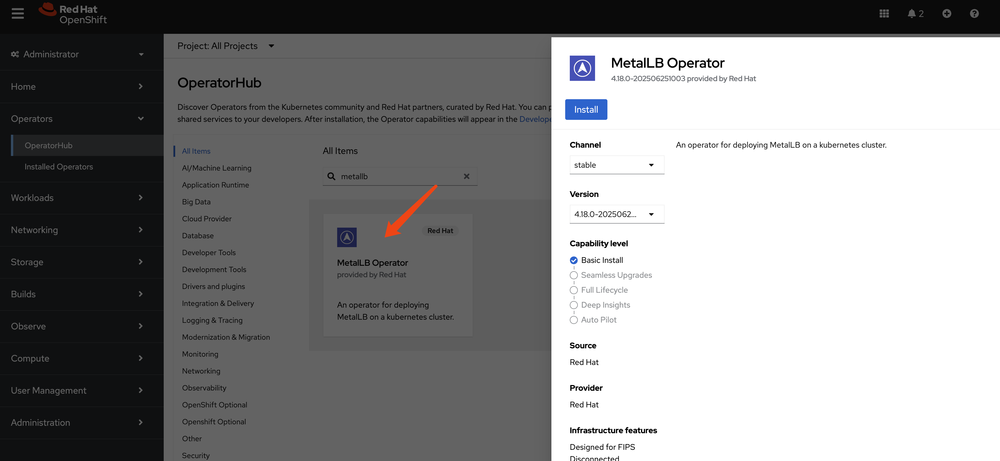
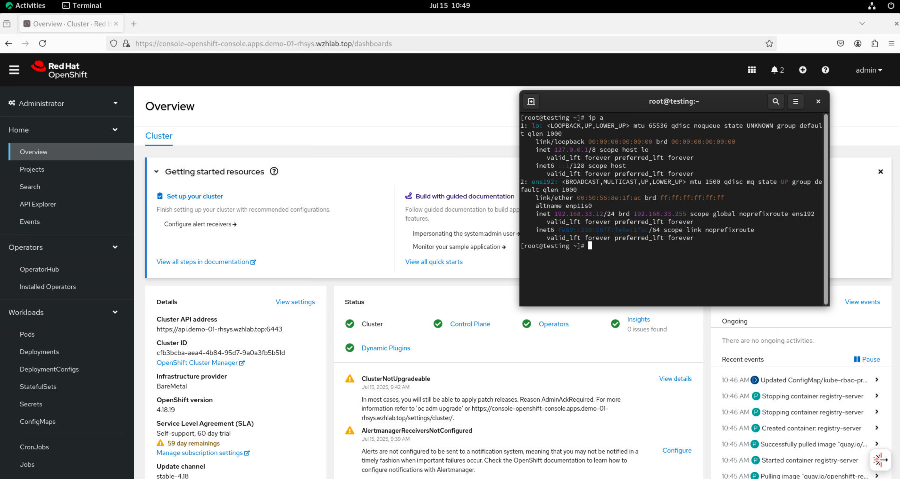

> [!NOTE]
> working in progress
# using metalLB to expose service on 2nd nic

# enable ip forward for nodes

It is better to limit the forward nic, but for simplity, we will enable it for all nic

```bash
oc patch network.operator cluster -p '{"spec":{"defaultNetwork":{"ovnKubernetesConfig":
{"gatewayConfig":{"ipForwarding": "Global"}}}}}' --type=merge
```

# install metalLB




Create a single instance of a MetalLB custom resource:

```yaml
apiVersion: metallb.io/v1beta1
kind: MetalLB
metadata:
  name: metallb
  namespace: metallb-system
```

Configure IP address pool

```yaml
apiVersion: metallb.io/v1beta1
kind: IPAddressPool
metadata:
  namespace: metallb-system
  name: hcp-pool
spec:
  addresses:
  - 192.168.33.200-192.168.33.220
  autoAssign: true
  avoidBuggyIPs: true
```

Configure L2 advertisements

```yaml
apiVersion: metallb.io/v1beta1
kind: L2Advertisement
metadata:
  name: l2-advertisement
  namespace: metallb-system
spec:
  ipAddressPools:
   - hcp-pool
  # nodeSelectors:
  #   - matchLabels:
  #       network-zone: ens224
  interfaces:
    - ens224
```

# expose web console service

```bash
oc get pods,svc -n openshift-console -l app=console
# NAME                             READY   STATUS    RESTARTS   AGE
# pod/console-7766f46b5f-jlshp     1/1     Running   1          5h28m
# pod/console-7766f46b5f-sf595     1/1     Running   1          5h28m
# pod/downloads-7c587b956c-9wrp6   1/1     Running   1          5h33m
# pod/downloads-7c587b956c-fjsgr   1/1     Running   1          5h33m

# NAME              TYPE        CLUSTER-IP       EXTERNAL-IP   PORT(S)   AGE
# service/console   ClusterIP   172.22.225.201   <none>        443/TCP   5h33m

oc get pods,svc -n openshift-console -l app=console,component=ui
# NAME                           READY   STATUS    RESTARTS   AGE
# pod/console-7766f46b5f-jlshp   1/1     Running   1          5h32m
# pod/console-7766f46b5f-sf595   1/1     Running   1          5h32m

cat << EOF > ${BASE_DIR}/data/install/metallb-web-console-svc.yaml
apiVersion: v1
kind: Service
metadata:
  name: console-loadbalancer-ens224
  namespace: openshift-console
  annotations:
    # This is the key instruction for MetalLB.
    # Replace 'your-eth1-pool-name' with the actual name of your IPAddressPool for eth1.
    # metallb.universe.tf/ip-address-pool: hcp-pool
    metallb.io/ip-allocated-from-pool: hcp-pool
spec:
  # This tells Kubernetes to request an IP from a load balancer (MetalLB).
  type: LoadBalancer
  # This selector must match the labels on the console pods.
  selector:
    app: console
    component: ui
  ports:
    - name: https
      protocol: TCP
      port: 443
      targetPort: 8443
EOF

oc apply -f ${BASE_DIR}/data/install/metallb-web-console-svc.yaml


oc get svc console-loadbalancer-ens224 -n openshift-console
# NAME                          TYPE           CLUSTER-IP       EXTERNAL-IP      PORT(S)         AGE
# console-loadbalancer-ens224   LoadBalancer   172.22.175.122   192.168.33.200   443:30718/TCP   24s

# dns
console.ens224.demo-01-rhsys.wzhlab.top. -> 192.168.33.200

oc get pods,svc -n openshift-authentication -l app=oauth-openshift
# NAME                                  READY   STATUS    RESTARTS   AGE
# pod/oauth-openshift-d899bf566-bq5mb   1/1     Running   1          5h29m
# pod/oauth-openshift-d899bf566-fkl46   1/1     Running   1          5h28m
# pod/oauth-openshift-d899bf566-mfkw6   1/1     Running   1          5h28m

# NAME                      TYPE        CLUSTER-IP      EXTERNAL-IP   PORT(S)   AGE
# service/oauth-openshift   ClusterIP   172.22.179.32   <none>        443/TCP   5h59m

cat << EOF > ${BASE_DIR}/data/install/metallb-oauth-service.yaml
apiVersion: v1
kind: Service
metadata:
  name: oauth-openshift-loadbalancer-ens224
  namespace: openshift-authentication
  annotations:
    # This annotation is essential.
    # Replace 'your-eth1-pool-name' with the name of your IPAddressPool for eth1.
    # metallb.universe.tf/ip-address-pool: hcp-pool
    metallb.io/ip-allocated-from-pool: hcp-pool
spec:
  # Request an IP from MetalLB
  type: LoadBalancer
  # This selector must match the labels on the oauth-openshift pods
  selector:
    app: oauth-openshift
  ports:
    - name: https-6443
      protocol: TCP
      # Expose the standard HTTPS port externally
      port: 443
      # Target the port the OAuth server actually listens on
      targetPort: 6443
EOF

oc apply -f ${BASE_DIR}/data/install/metallb-oauth-service.yaml


oc get svc oauth-openshift-loadbalancer-ens224 -n openshift-authentication
# NAME                                  TYPE           CLUSTER-IP       EXTERNAL-IP      PORT(S)         AGE
# oauth-openshift-loadbalancer-ens224   LoadBalancer   172.22.134.178   192.168.33.201   443:30629/TCP   32s


```

```bash

iptables -L -v -n -t nat
# Chain PREROUTING (policy ACCEPT 80022 packets, 4849K bytes)
#  pkts bytes target     prot opt in     out     source               destination
#     0     0 REDIRECT   6    --  *      *       0.0.0.0/0            192.168.22.21        tcp dpt:6443 /* OCP_API_LB_REDIRECT */ redir ports 9445
# 80314 4867K OVN-KUBE-ETP  0    --  *      *       0.0.0.0/0            0.0.0.0/0
# 80314 4867K OVN-KUBE-EXTERNALIP  0    --  *      *       0.0.0.0/0            0.0.0.0/0
# 80022 4849K OVN-KUBE-NODEPORT  0    --  *      *       0.0.0.0/0            0.0.0.0/0

# Chain INPUT (policy ACCEPT 0 packets, 0 bytes)
#  pkts bytes target     prot opt in     out     source               destination

# Chain OUTPUT (policy ACCEPT 497K packets, 30M bytes)
#  pkts bytes target     prot opt in     out     source               destination
#     0     0 REDIRECT   6    --  *      lo      0.0.0.0/0            192.168.22.21        tcp dpt:6443 /* OCP_API_LB_REDIRECT */ redir ports 9445
#  497K   30M OVN-KUBE-EXTERNALIP  0    --  *      *       0.0.0.0/0            0.0.0.0/0
#  497K   30M OVN-KUBE-NODEPORT  0    --  *      *       0.0.0.0/0            0.0.0.0/0
#  497K   30M OVN-KUBE-ITP  0    --  *      *       0.0.0.0/0            0.0.0.0/0

# Chain POSTROUTING (policy ACCEPT 497K packets, 30M bytes)
#  pkts bytes target     prot opt in     out     source               destination
#  497K   30M OVN-KUBE-EGRESS-IP-MULTI-NIC  0    --  *      *       0.0.0.0/0            0.0.0.0/0

# Chain KUBE-KUBELET-CANARY (0 references)
#  pkts bytes target     prot opt in     out     source               destination

# Chain OVN-KUBE-EGRESS-IP-MULTI-NIC (1 references)
#  pkts bytes target     prot opt in     out     source               destination

# Chain OVN-KUBE-ETP (1 references)
#  pkts bytes target     prot opt in     out     source               destination

# Chain OVN-KUBE-EXTERNALIP (2 references)
#  pkts bytes target     prot opt in     out     source               destination
#     0     0 DNAT       6    --  *      *       0.0.0.0/0            192.168.33.204       tcp dpt:443 to:172.22.206.53:443
#     0     0 DNAT       6    --  *      *       0.0.0.0/0            192.168.33.203       tcp dpt:80 to:172.22.18.50:80
#     0     0 DNAT       6    --  *      *       0.0.0.0/0            192.168.33.203       tcp dpt:443 to:172.22.18.50:443
#     0     0 DNAT       6    --  *      *       0.0.0.0/0            192.168.33.202       tcp dpt:6443 to:172.22.81.34:6443
#   168 10080 DNAT       6    --  *      *       0.0.0.0/0            192.168.33.200       tcp dpt:443 to:172.22.175.122:443
#     0     0 DNAT       6    --  *      *       0.0.0.0/0            192.168.33.201       tcp dpt:443 to:172.22.134.178:443

# Chain OVN-KUBE-ITP (1 references)
#  pkts bytes target     prot opt in     out     source               destination

# Chain OVN-KUBE-NODEPORT (2 references)
#  pkts bytes target     prot opt in     out     source               destination
#     0     0 DNAT       6    --  *      *       0.0.0.0/0            0.0.0.0/0            ADDRTYPE match dst-type LOCAL tcp dpt:31339 to:172.22.206.53:443
#     0     0 DNAT       6    --  *      *       0.0.0.0/0            0.0.0.0/0            ADDRTYPE match dst-type LOCAL tcp dpt:31332 to:172.22.18.50:80
#     0     0 DNAT       6    --  *      *       0.0.0.0/0            0.0.0.0/0            ADDRTYPE match dst-type LOCAL tcp dpt:31043 to:172.22.18.50:443
#     0     0 DNAT       6    --  *      *       0.0.0.0/0            0.0.0.0/0            ADDRTYPE match dst-type LOCAL tcp dpt:32766 to:172.22.81.34:6443
#     0     0 DNAT       6    --  *      *       0.0.0.0/0            0.0.0.0/0            ADDRTYPE match dst-type LOCAL tcp dpt:30718 to:172.22.175.122:443
#     0     0 DNAT       6    --  *      *       0.0.0.0/0            0.0.0.0/0            ADDRTYPE match dst-type LOCAL tcp dpt:30629 to:172.22.134.178:443


```

# testing

on a host with only `192.168.33.12` IP address, run the following command to confirm

```bash
ip a
# 1: lo: <LOOPBACK,UP,LOWER_UP> mtu 65536 qdisc noqueue state UNKNOWN group default qlen 1000
#     link/loopback 00:00:00:00:00:00 brd 00:00:00:00:00:00
#     inet 127.0.0.1/8 scope host lo
#        valid_lft forever preferred_lft forever
#     inet6 ::1/128 scope host
#        valid_lft forever preferred_lft forever
# 2: ens192: <BROADCAST,MULTICAST,UP,LOWER_UP> mtu 1500 qdisc mq state UP group default qlen 1000
#     link/ether 00:50:56:8e:1f:ac brd ff:ff:ff:ff:ff:ff
#     altname enp11s0
#     inet 192.168.33.12/24 brd 192.168.33.255 scope global noprefixroute ens192
#        valid_lft forever preferred_lft forever
#     inet6 fe80::250:56ff:fe8e:1fac/64 scope link noprefixroute
#        valid_lft forever preferred_lft forever

ip r
# 192.168.33.0/24 dev ens192 proto kernel scope link src 192.168.33.12 metric 100
```

config the `/etc/hosts` to add domain names

```bash
cat /etc/hosts
# 127.0.0.1   localhost localhost.localdomain localhost4 localhost4.localdomain4
# ::1         localhost localhost.localdomain localhost6 localhost6.localdomain6

# 192.168.33.200 console-openshift-console.apps.demo-01-rhsys.wzhlab.top
# 192.168.33.201 oauth-openshift.apps.demo-01-rhsys.wzhlab.top

```

Next, open browser, you can see the webUI is here



# policy routing

If ingress traffic hits 2nic, there is no route to the internet. So we need to configure policy routing.

It is something like this, but needs to be verified.

> [!NOTE]
> pending for verfication
```yaml
apiVersion: nmstate.io/v1
kind: NodeNetworkConfigurationPolicy
metadata:
  name: policy-route-for-eth1
spec:
  # 使用节点选择器，只在那些拥有 eth1 且需要暴露服务的节点上应用此策略
  nodeSelector:
    network-zone: eth1 # 您需要预先为这些节点打上标签
  desiredState:
    # 1. 定义路由规则 (Routing Rules)
    # 这是策略路由的核心：定义“什么样”的流量使用“哪个”路由表
    routes:
      config:
        # 为 eth1 网络创建一个专用的路由表 (table 101)
        # 规则 1: eth1 子网内的流量路由
        - destination: 192.168.10.0/24
          next-hop-interface: eth1
          table-id: 101
        # 规则 2: eth1 网络的默认网关
        - destination: 0.0.0.0/0
          next-hop-interface: eth1
          next-hop-address: 192.168.10.1 # eth1 网络的网关地址
          table-id: 101 # 关键：这条路由属于 table 101
          
    # 2. 定义路由策略 (Routing Policies / Rules)
    # 这是告诉内核“何时”去查看我们创建的新路由表
    rules:
      config:
        # 策略 1: 凡是源地址是 eth1 子网的包，都去查阅 table 101
        - from: 192.168.10.0/24
          table-id: 101
          priority: 100
        # 策略 2: (可选) 凡是发往 eth1 子网的包，也去查阅 table 101
        # - to: 192.168.10.0/24
        #   table-id: 101
        #   priority: 101
```

# expose kube-api, router

These service is lisen on 0.0.0.0, so how to expose them?

> [!NOTE]
> pending for verification
> 
```yaml


```


```yaml

apiVersion: v1
kind: Service
metadata:
  # The name must be 'router-default' if you're targeting the default ingresscontroller
  name: router-default 
  namespace: openshift-ingress
spec:
  # This requests a virtual IP from MetalLB
  type: LoadBalancer 
  # This preserves the original client IP address and is critical for hostNetwork
  externalTrafficPolicy: Local 
  selector:
    # This selector targets the default router pods
    ingresscontroller.operator.openshift.io/deployment-ingresscontroller: default
  ports:
    - name: http
      port: 80
      protocol: TCP
      targetPort: 80
    - name: https
      port: 443
      protocol: TCP
      targetPort: 443

```

# end