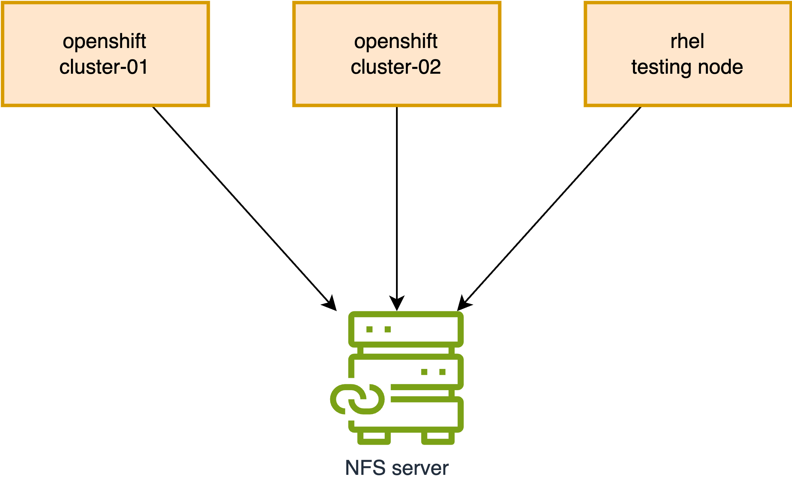

> [!NOTE]
> Work in progress

# NFS File Permissions on OpenShift/Kubernetes

We frequently encounter NFS file permission issues on OpenShift/Kubernetes. This document will simulate such a problem and demonstrate how to resolve it.



## Reproducing the Problem

First, let's reproduce the permission issue. We will create a new folder on the NFS server, which will serve as our target NFS directory for testing.

```bash
# Execute on the NFS Server
sudo mkdir -p /srv/nfs/static/pv-01
sudo chmod 777 /srv/nfs/static/pv-01
sudo chown nobody:nobody /srv/nfs/static/pv-01
```

### On Cluster-01

Next, we will create a Persistent Volume (PV), Persistent Volume Claim (PVC), and a Pod on Cluster-01 to write data to the NFS folder.

```bash
oc new-project demo

# Optional: Uncomment to enforce or remove pod security enforcement
# oc label namespace demo pod-security.kubernetes.io/enforce=restricted --overwrite
# oc label namespace demo pod-security.kubernetes.io/enforce-


# Delete existing local-sc.yaml if it exists
# oc delete -f $BASE_DIR/data/install/local-sc.yaml
cat << EOF > ${BASE_DIR}/data/install/local-sc.yaml
kind: StorageClass
apiVersion: storage.k8s.io/v1
metadata:
  name: free-volume
provisioner: kubernetes.io/no-provisioner
volumeBindingMode: Immediate # WaitForFirstConsumer
reclaimPolicy: Retain
EOF
oc apply -f ${BASE_DIR}/data/install/local-sc.yaml


# Delete existing nfs-pv.yaml if it exists
# oc delete -f $BASE_DIR/data/install/nfs-pv.yaml
cat << EOF > $BASE_DIR/data/install/nfs-pv.yaml
apiVersion: v1
kind: PersistentVolume
metadata:
  name: nfs-shared-pv
spec:
  capacity:
    storage: 1Gi
  accessModes:
    - ReadWriteMany
  persistentVolumeReclaimPolicy: Retain
  nfs:
    server: "192.168.99.1"
    path: "/srv/nfs/static/pv-01"
  storageClassName: "free-volume"
EOF

oc apply -f $BASE_DIR/data/install/nfs-pv.yaml


# Delete existing nfs-pvc.yaml if it exists
# oc delete -n demo -f $BASE_DIR/data/install/nfs-pvc.yaml
cat << EOF > $BASE_DIR/data/install/nfs-pvc.yaml
apiVersion: v1
kind: PersistentVolumeClaim
metadata:
  name: primary-site-pvc
spec:
  accessModes:
    - ReadWriteMany
  resources:
    requests:
      storage: 1Gi
  volumeName: nfs-shared-pv
  storageClassName: "free-volume"
EOF

oc apply -n demo -f $BASE_DIR/data/install/nfs-pvc.yaml


# Delete existing nfs-primary-pod.yaml if it exists
# oc delete -n demo -f $BASE_DIR/data/install/nfs-primary-pod.yaml
cat << 'EOF' > $BASE_DIR/data/install/nfs-primary-pod.yaml
apiVersion: v1
kind: Pod
metadata:
  name: primary-pod
spec:
  containers:
  - name: primary-container
    image: registry.access.redhat.com/ubi8/ubi-minimal # Using a non-root UBI image
    command: ["/bin/sh", "-c"]
    args:
      - |
        echo "Primary pod is running. Current user ID is $(id -u)."
        echo "Creating file from primary site..."
        touch /data/testfile.txt
        echo "Hello from Primary Site" > /data/testfile.txt
        echo "File created. Checking ownership (numeric ID)..."
        ls -ln /data/testfile.txt
        echo "Primary pod has finished its work and is now sleeping."
        sleep 3600
    securityContext:
      seccompProfile:
        type: RuntimeDefault
    volumeMounts:
    - name: nfs-storage
      mountPath: /data
  volumes:
  - name: nfs-storage
    persistentVolumeClaim:
      claimName: primary-site-pvc
EOF

oc apply -n demo -f $BASE_DIR/data/install/nfs-primary-pod.yaml

oc logs primary-pod -n demo
# Expected Output:
# Primary pod is running. Current user ID is 1000800000.
# Creating file from primary site...
# File created. Checking ownership (numeric ID)...
# -rw-r--r--. 1 1000800000 0 24 Jul 30 15:43 /data/testfile.txt
# Primary pod has finished its work and is now sleeping.

oc delete pod primary-pod -n demo
oc delete pvc primary-site-pvc -n demo
```

As observed, the pod runs with UID `1000800000`, and the file is successfully written.

Now, let's verify this on the NFS server:

```bash
ls -ln /srv/nfs/static/pv-01/
# Expected Output:
# -rw-r--r--. 1 1000800000 0 24 Jul 30 15:43 testfile.txt
```

### On Cluster-02

Next, we will create a PV, PVC, and a Pod on Cluster-02 to attempt writing to the same NFS folder.

```bash
oc new-project demo

# Optional: Uncomment to enforce or remove pod security enforcement
# oc label namespace demo pod-security.kubernetes.io/enforce=restricted --overwrite
# oc label namespace demo pod-security.kubernetes.io/enforce-


# Delete existing local-sc.yaml if it exists
# oc delete -f $BASE_DIR/data/install/local-sc.yaml
cat << EOF > ${BASE_DIR}/data/install/local-sc.yaml
kind: StorageClass
apiVersion: storage.k8s.io/v1
metadata:
  name: free-volume
provisioner: kubernetes.io/no-provisioner
volumeBindingMode: Immediate # WaitForFirstConsumer
reclaimPolicy: Retain
EOF
oc apply -f ${BASE_DIR}/data/install/local-sc.yaml


# Delete existing nfs-pv.yaml if it exists
# oc delete -f $BASE_DIR/data/install/nfs-pv.yaml
cat << EOF > $BASE_DIR/data/install/nfs-pv.yaml
apiVersion: v1
kind: PersistentVolume
metadata:
  name: nfs-shared-pv
spec:
  capacity:
    storage: 1Gi
  accessModes:
    - ReadWriteMany
  persistentVolumeReclaimPolicy: Retain
  nfs:
    server: "192.168.99.1"
    path: "/srv/nfs/static/pv-01"
  storageClassName: "free-volume"
EOF

oc apply -f $BASE_DIR/data/install/nfs-pv.yaml


# Delete existing nfs-pvc.yaml if it exists
# oc delete -n demo -f $BASE_DIR/data/install/nfs-pvc.yaml
cat << EOF > $BASE_DIR/data/install/nfs-pvc.yaml
apiVersion: v1
kind: PersistentVolumeClaim
metadata:
  name: dr-site-pvc
  namespace: demo
spec:
  accessModes:
    - ReadWriteMany
  resources:
    requests:
      storage: 1Gi
  volumeName: nfs-shared-pv
  storageClassName: "free-volume"
EOF

oc apply -n demo -f $BASE_DIR/data/install/nfs-pvc.yaml


# Delete existing nfs-primary-pod.yaml if it exists
# oc delete -n demo -f $BASE_DIR/data/install/nfs-primary-pod.yaml
cat << 'EOF' > $BASE_DIR/data/install/nfs-primary-pod.yaml
apiVersion: v1
kind: Pod
metadata:
  name: dr-pod
  namespace: demo
spec:
  containers:
  - name: dr-container
    image: registry.access.redhat.com/ubi8/ubi-minimal # Also using a UBI image
    command: ["/bin/sh", "-c"]
    args:
      - |
        echo "DR pod is running. Current user ID is $(id -u)."
        echo "Checking original file ownership..."
        ls -ln /data/testfile.txt
        echo "Attempting to append data to testfile.txt..."
        # Use sh -c to correctly handle redirection and error capture
        sh -c "echo 'Data from DR Site' >> /data/testfile.txt"
        if [ $? -eq 0 ]; then
          echo "✅ SUCCESS: Write completed. This should not happen."
        else
          echo "❌ FAILURE: Permission denied as expected."
        fi
        sleep 3600
    securityContext:
      seccompProfile:
        type: RuntimeDefault
    volumeMounts:
    - name: nfs-storage
      mountPath: /data
  volumes:
  - name: nfs-storage
    persistentVolumeClaim:
      claimName: dr-site-pvc
EOF

oc apply -n demo -f $BASE_DIR/data/install/nfs-primary-pod.yaml

oc logs dr-pod -n demo
# Expected Output:
# DR pod is running. Current user ID is 1000790000.
# Checking original file ownership...
# -rw-r--r--. 1 1000800000 0 42 Jul 30 15:49 /data/testfile.txt
# Attempting to append data to testfile.txt...
# sh: /data/testfile.txt: Permission denied
# ❌ FAILURE: Permission denied as expected.
```

Here, the pod runs with UID `1000790000`, and the file write operation fails as expected due to permission issues.

Verifying on the NFS server:

```bash
ls -ln /srv/nfs/static/pv-01/
# Expected Output:
# -rw-r--r--. 1 1000800000 0 42 Jul 30 15:49 testfile.txt
```

## Fixing the Issue on OpenShift

Now that we have reproduced the problem, let's fix it on OpenShift.

First, we will create another folder on the NFS server. This time, we will set more restrictive permissions.

```bash
# Execute on the NFS Server
mkdir -p /srv/nfs/static/pv-02

sudo chown 1001:2002 /srv/nfs/static/
sudo chmod 770 /srv/nfs/static/

sudo chown 1001:2002 /srv/nfs/static/pv-02
sudo chmod 770 /srv/nfs/static/pv-02
```

### On Cluster-01 (with fix)

Next, on Cluster-01, we will create the PV, PVC, and Pod again, incorporating the fix.

```bash
oc new-project demo

# Optional: Uncomment to enforce or remove pod security enforcement
# oc label namespace demo pod-security.kubernetes.io/enforce=restricted --overwrite
# oc label namespace demo pod-security.kubernetes.io/enforce-


# Delete existing local-sc.yaml if it exists
# oc delete -f $BASE_DIR/data/install/local-sc.yaml
cat << EOF > ${BASE_DIR}/data/install/local-sc.yaml
kind: StorageClass
apiVersion: storage.k8s.io/v1
metadata:
  name: free-volume
provisioner: kubernetes.io/no-provisioner
volumeBindingMode: Immediate # WaitForFirstConsumer
reclaimPolicy: Retain
EOF
oc apply -f ${BASE_DIR}/data/install/local-sc.yaml


# Delete existing nfs-pv.yaml if it exists
# oc delete -f $BASE_DIR/data/install/nfs-pv.yaml
cat << EOF > $BASE_DIR/data/install/nfs-pv.yaml
apiVersion: v1
kind: PersistentVolume
metadata:
  name: nfs-shared-pv
spec:
  capacity:
    storage: 1Gi
  accessModes:
    - ReadWriteMany
  persistentVolumeReclaimPolicy: Retain
  nfs:
    server: "192.168.99.1"
    path: "/srv/nfs/static/pv-02"
  storageClassName: "free-volume"
EOF

oc apply -f $BASE_DIR/data/install/nfs-pv.yaml


# Delete existing nfs-pvc.yaml if it exists
# oc delete -n demo -f $BASE_DIR/data/install/nfs-pvc.yaml
cat << EOF > $BASE_DIR/data/install/nfs-pvc.yaml
apiVersion: v1
kind: PersistentVolumeClaim
metadata:
  name: primary-site-pvc
spec:
  accessModes:
    - ReadWriteMany
  resources:
    requests:
      storage: 1Gi
  volumeName: nfs-shared-pv
  storageClassName: "free-volume"
EOF

oc apply -n demo -f $BASE_DIR/data/install/nfs-pvc.yaml


# Delete existing nfs-primary-pod.yaml if it exists
# oc delete -n demo -f $BASE_DIR/data/install/nfs-primary-pod.yaml
cat << 'EOF' > $BASE_DIR/data/install/nfs-primary-pod.yaml
apiVersion: v1
kind: Pod
metadata:
  name: primary-pod
spec:
  containers:
  - name: primary-container
    image: registry.access.redhat.com/ubi8/ubi-minimal # Using a non-root UBI image
    command: ["/bin/sh", "-c"]
    args:
      - |
        echo "Primary pod is running. Current user ID is $(id -u)."
        echo "Creating file from primary site..."
        touch /data/testfile.txt
        echo "Hello from Primary Site" > /data/testfile.txt
        echo "File created. Checking ownership (numeric ID)..."
        ls -ln /data/testfile.txt
        echo "Primary pod has finished its work and is now sleeping."
        sleep 3600
    securityContext:
      runAsUser: 1001
      runAsGroup: 2002
      fsGroup: 2002 # Ensure fsGroup matches GID
    volumeMounts:
    - name: nfs-storage
      mountPath: /data
  volumes:
  - name: nfs-storage
    persistentVolumeClaim:
      claimName: primary-site-pvc
EOF

oc apply -n demo -f $BASE_DIR/data/install/nfs-primary-pod.yaml

oc logs primary-pod -n demo
# Expected Output:
# Primary pod is running. Current user ID is 1001.
# Creating file from primary site...
# File created. Checking ownership (numeric ID)...
# -rw-r--r--. 1 1001 2002 24 Jul 31 03:46 /data/testfile.txt
# Primary pod has finished its work and is now sleeping.
```

We can see that the pod is now running with UID `1001`, and the file is successfully written.

Now, let's check on the NFS server:

```bash
ls -hln /srv/nfs/static/pv-02
# Expected Output:
# total 4.0K
# -rw-r--r--. 1 1001 2002 24 Jul 31 03:46 testfile.txt

ls -hln /srv/nfs/static
# Expected Output:
# drwxrwx---. 2  1001  2002 26 Jul 31 03:46 pv-02
```

The file on NFS now has UID `1001` and GID `2002`, aligning with the `securityContext` settings.

### On Cluster-02 (with fix)

Next, on Cluster-02, we will create the PV, PVC, and Pod again, using the corrected configuration.

```bash
oc new-project demo

# Optional: Uncomment to enforce or remove pod security enforcement
# oc label namespace demo pod-security.kubernetes.io/enforce=restricted --overwrite
# oc label namespace demo pod-security.kubernetes.io/enforce-


# Delete existing local-sc.yaml if it exists
# oc delete -f $BASE_DIR/data/install/local-sc.yaml
cat << EOF > ${BASE_DIR}/data/install/local-sc.yaml
kind: StorageClass
apiVersion: storage.k8s.io/v1
metadata:
  name: free-volume
provisioner: kubernetes.io/no-provisioner
volumeBindingMode: Immediate # WaitForFirstConsumer
reclaimPolicy: Retain
EOF
oc apply -f ${BASE_DIR}/data/install/local-sc.yaml


# Delete existing nfs-pv.yaml if it exists
# oc delete -f $BASE_DIR/data/install/nfs-pv.yaml
cat << EOF > $BASE_DIR/data/install/nfs-pv.yaml
apiVersion: v1
kind: PersistentVolume
metadata:
  name: nfs-shared-pv
spec:
  capacity:
    storage: 1Gi
  accessModes:
    - ReadWriteMany
  persistentVolumeReclaimPolicy: Retain
  nfs:
    server: "192.168.99.1"
    path: "/srv/nfs/static/pv-02"
  storageClassName: "free-volume"
EOF

oc apply -f $BASE_DIR/data/install/nfs-pv.yaml


# Delete existing nfs-pvc.yaml if it exists
# oc delete -n demo -f $BASE_DIR/data/install/nfs-pvc.yaml
cat << EOF > $BASE_DIR/data/install/nfs-pvc.yaml
apiVersion: v1
kind: PersistentVolumeClaim
metadata:
  name: dr-site-pvc
  namespace: demo
spec:
  accessModes:
    - ReadWriteMany
  resources:
    requests:
      storage: 1Gi
  volumeName: nfs-shared-pv
  storageClassName: "free-volume"
EOF

oc apply -n demo -f $BASE_DIR/data/install/nfs-pvc.yaml


# Delete existing nfs-primary-pod.yaml if it exists
# oc delete -n demo -f $BASE_DIR/data/install/nfs-primary-pod.yaml
cat << 'EOF' > $BASE_DIR/data/install/nfs-primary-pod.yaml
apiVersion: v1
kind: Pod
metadata:
  name: dr-pod
  namespace: demo
spec:
  containers:
  - name: dr-container
    image: registry.access.redhat.com/ubi8/ubi-minimal # Also using a UBI image
    command: ["/bin/sh", "-c"]
    args:
      - |
        echo "DR pod is running. Current user ID is $(id -u)."
        echo "Checking original file ownership..."
        ls -ln /data/testfile.txt
        echo "Attempting to append data to testfile.txt..."
        # Use sh -c to correctly handle redirection and error capture
        sh -c "echo 'Data from DR Site' >> /data/testfile.txt"
        if [ $? -eq 0 ]; then
          echo "✅ SUCCESS: Write completed. This should not happen."
        else
          echo "❌ FAILURE: Permission denied as expected."
        fi
        sleep 3600
    securityContext:
      runAsUser: 1001
      runAsGroup: 2002
      fsGroup: 2002 # Ensure fsGroup matches GID
    volumeMounts:
    - name: nfs-storage
      mountPath: /data
  volumes:
  - name: nfs-storage
    persistentVolumeClaim:
      claimName: dr-site-pvc
EOF

oc apply -n demo -f $BASE_DIR/data/install/nfs-primary-pod.yaml

oc logs dr-pod -n demo
# Expected Output:
# DR pod is running. Current user ID is 1001.
# Checking original file ownership...
# -rw-r--r--. 1 1001 2002 24 Jul 31 03:46 /data/testfile.txt
# Attempting to append data to testfile.txt...
# ✅ SUCCESS: Write completed. This should not happen.
```

This time, the write operation from the DR site is successful.

## Mounting on a RHEL Node

We have addressed the issue on OpenShift, but what if the NFS folder is shared with a RHEL node? Let's test this scenario.

```bash
# Prepare the RHEL Node (Install NFS Utilities)
sudo dnf install -y nfs-utils

# Create a Local Mount Point
sudo mkdir /mnt/ocp_nfs_share

# Mount the NFS Share
sudo mount -t nfs 192.168.99.1:/srv/nfs/static/pv-02 /mnt/ocp_nfs_share

# Verify that the mount was successful:
df -h | grep ocp_nfs_share
# Expected Output:
# 192.168.99.1:/srv/nfs/static/pv-02  500G  3.6G  497G   1% /mnt/ocp_nfs_share


# Create a group with GID 2002
sudo groupadd -g 2002 ocp_nfs_group

# Create a user with UID 1001 and assign it to the new group
sudo useradd -u 1001 -g 2002 ocp_nfs_user


# Switch to the ocp_nfs_user
sudo su - ocp_nfs_user

# You can now list the files
ls -l /mnt/ocp_nfs_share/
# Expected Output:
# -rw-r--r--. 1 ocp_nfs_user ocp_nfs_group 42 Jul 31 14:14 testfile.txt

# Read the file content
cat /mnt/ocp_nfs_share/testfile.txt
# Expected Output:
# Hello from Primary Site
# Data from DR Site

# Append new content to the file (this will succeed)
echo "This was written from the RHEL node" >> /mnt/ocp_nfs_share/testfile.txt

# Verify the new content
cat /mnt/ocp_nfs_share/testfile.txt
# Expected Output:
# Hello from Primary Site
# Data from DR Site
# This was written from the RHEL node

# Exit from the user's shell
exit

# Optional: Uncomment to unmount the NFS share
# sudo umount /mnt/ocp_nfs_share
```

Let's try with another user in the same group.

```bash
# Create a new user with a different UID, e.g., 1005
sudo useradd -u 1005 -g 2002 another_nfs_user

# Switch to the new user
sudo su - another_nfs_user


# 1. Reading the file (This will SUCCEED) ✅
cat /mnt/ocp_nfs_share/testfile.txt
# Expected Output:
# Hello from Primary Site
# Data from DR Site
# This was written from the RHEL node

# 2. Modifying the file (This will FAIL) ❌
echo "Trying to write" >> /mnt/ocp_nfs_share/testfile.txt
# Expected Output: bash: /mnt/ocp_nfs_share/testfile.txt: Permission denied

# 3. Creating a new file in the directory (This will SUCCEED) ✅
touch /mnt/ocp_nfs_share/new_file_from_another_user.txt

ls -ln /mnt/ocp_nfs_share/
# Expected Output:
# -rw-r--r--. 1 1005 2002  0 Jul 31 14:41 new_file_from_another_user.txt
# -rw-r--r--. 1 1001 2002 78 Jul 31 14:41 testfile.txt
```

# End
## Debugging Information

```bash
oc auth can-i use scc/anyuid --as=system:serviceaccount:demo:default -n demo
Warning: resource 'securitycontextconstraints' is not namespace scoped in group 'security.openshift.io'
# Output: no

oc auth can-i use scc/restricted-v2 --as=system:serviceaccount:demo:default -n demo
Warning: resource 'securitycontextconstraints' is not namespace scoped in group 'security.openshift.io'
# Output: yes


oc get mutatingwebhookconfigurations
# Output (example, may vary):
# NAME                                                      WEBHOOKS   AGE
# catalogd-mutating-webhook-configuration                   1          5d
# cdi-api-datavolume-mutate                                 1          4d23h
# cdi-api-pvc-mutate                                        1          4d23h
# kubemacpool-mutator                                       2          4d23h
# kubevirt-ipam-controller-mutating-webhook-configuration   1          4d23h
# machine-api                                               2          5d
# machine-api-metal3-remediation                            2          5d
# mutate-hyperconverged-hco.kubevirt.io-2nnh2               1          4h24m
# mutate-ns-hco.kubevirt.io-txcvn                           1          4h24m
# virt-api-mutator                                          4          4d23h


oc get validatingwebhookconfigurations
# Output (example, may vary):
# NAME                                                  WEBHOOKS   AGE
# alertmanagerconfigs.openshift.io                      1          5d
# autoscaling.openshift.io                              2          5d
# baremetal-operator-validating-webhook-configuration   2          5d
# cluster-baremetal-validating-webhook-configuration    1          5d
# controlplanemachineset.machine.openshift.io           1          5d
# machine-api                                           2          5d
# machine-api-metal3-remediation                        2          5d
# monitoringconfigmaps.openshift.io                     1          5d
# multus.openshift.io                                   1          5d
# network-node-identity.openshift.io                    2          5d
# performance-addon-operator                            1          5d
# prometheusrules.openshift.io                          1          5d


# Delete existing nfs-primary-pod.yaml if it exists
# oc delete -n demo -f $BASE_DIR/data/install/nfs-primary-pod.yaml
cat << 'EOF' > $BASE_DIR/data/install/nfs-primary-pod.yaml
apiVersion: v1
kind: Pod
metadata:
  name: primary-pod-01
spec:
  containers:
  - name: primary-container
    image: registry.access.redhat.com/ubi8/ubi-minimal
    command: ["/bin/sh", "-c"]
    args:
      - |
        echo "Primary pod is running. Current user ID is $(id -u)."
        echo "Creating file from primary site..."
        touch /data/testfile.txt
        echo "Hello from Primary Site" > /data/testfile.txt
        echo "File created. Checking ownership (numeric ID)..."
        ls -ln /data/testfile.txt
        echo "Primary pod has finished its work and is now sleeping."
        sleep 3600
    securityContext:
      # allowPrivilegeEscalation: false
      # capabilities:
      #   drop:
      #   - ALL
      # runAsNonRoot: true
      seccompProfile:
        type: RuntimeDefault
    volumeMounts:
    - name: nfs-storage
      mountPath: /data
  volumes:
  - name: nfs-storage
    emptyDir: {}
EOF

oc apply -n demo -f $BASE_DIR/data/install/nfs-primary-pod.yaml