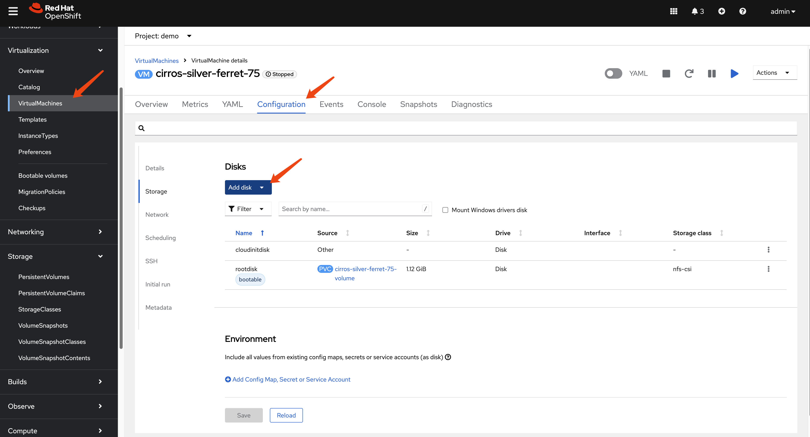
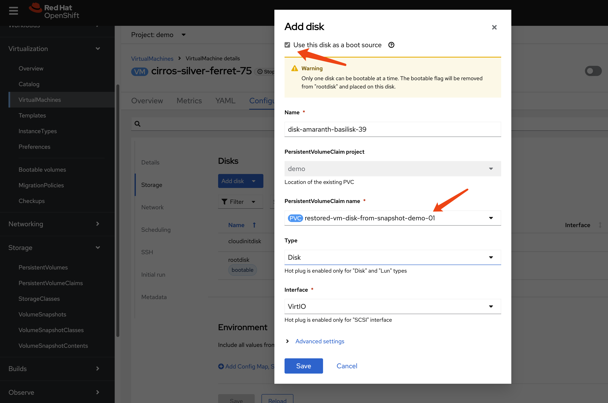
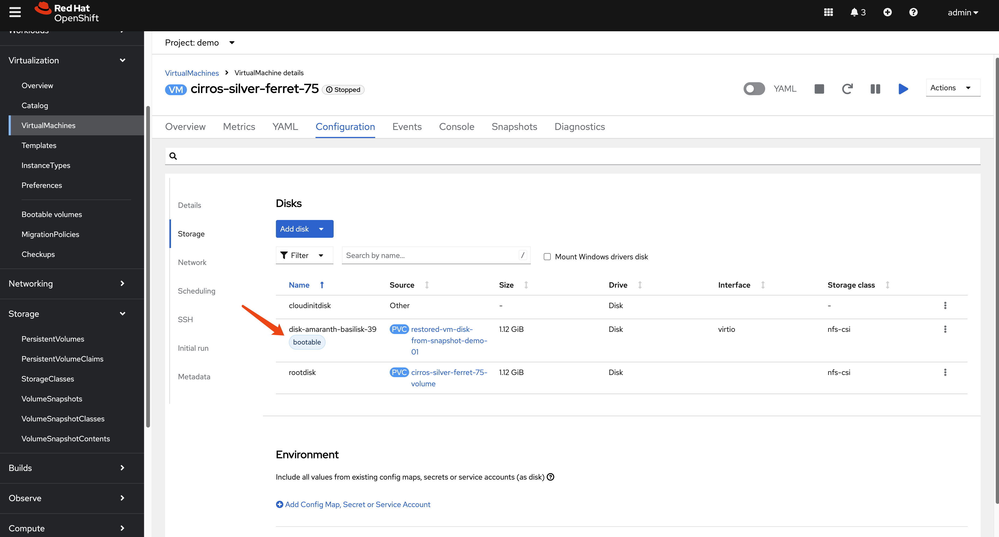
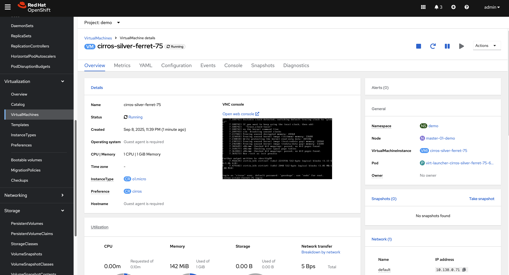

> [!NOTE]
> work in progress
# OpenShift Virtualization Disaster Recovery based on storage replication solution.

In Red Hat's solution, OpenShift Virtualization (OCP-V) does not have a built-in DR solution; Red Hat recommends using ODF's DR feature for this purpose. Essentially, this is a storage-based solution. ODF supports Ceph or IBM Flash Storage as backend storage solutions. However, if customers use third-party storage solutions like Dell, EMC, or Hitachi, how can an OCP-V DR solution be implemented?

Our approach leverages OpenShift's OADP (OpenShift API for Data Protection) feature to back up OCP-V metadata, including virtual machine configurations and Persistent Volume (PV)/Persistent Volume Claim (PVC) configurations. Concurrently, we utilize the underlying storage solution's remote replication capabilities to a remote site. Should the primary site encounter an issue, the DR process is manually triggered: OCP-V virtual machines at the primary site are shut down, and storage is set to read-only. Subsequently, the underlying storage's remote replication is verified or initiated to synchronize PVs/LUNs, and the completion of the backup process is confirmed. Finally, the OCP-V metadata is imported at the remote site, and storage system-related information within the PVs is updated to ensure PVs correctly map to the appropriate storage LUNs or directories. This completes the DR process.

The process for switching back from the remote site to the primary site is identical.

This document uses NFS to simulate the underlying storage system to demonstrate an OCP-V DR process. It begins with manual operations, followed by automating the entire process with the assistance of Generative AI and Ansible.


# install ocp-v

Our demo case is OCP-V, focusing on VM DR, so the `OpenShift Virtualization` operator needs to be installed.


Because we have customized NFS storage, we need to ensure CNV recognizes it.

```bash

cat << EOF > $BASE_DIR/data/install/cnv-sp.yaml
apiVersion: cdi.kubevirt.io/v1beta1
kind: StorageProfile
metadata:
  name: nfs-dynamic
spec:
  claimPropertySets:
  - accessModes:
    - ReadWriteMany
    volumeMode: Filesystem
EOF

oc apply -f $BASE_DIR/data/install/cnv-sp.yaml

```

# install oadp

We use OpenShift's official OADP (OpenShift API for Data Protection) operator for remote metadata backups. OADP is an S3-based remote backup solution that can back up both metadata and PVC data. However, since it compresses data and uploads it to S3, then downloads and decompress it during recovery, this process is too slow for virtual machines.

Therefore, our solution naturally involves using OADP to back up metadata, while leveraging the storage system's native capabilities for remote data replication.

First, we install OADP on both the local (cluster-01) and remote (cluster-02) clusters.


Next, we configure the S3 access credentials.

```bash
cat << EOF > $BASE_DIR/data/install/credentials-minio
[default]
aws_access_key_id = rustfsadmin
aws_secret_access_key = rustfsadmin
EOF

oc create secret generic minio-credentials \
--from-file=cloud=$BASE_DIR/data/install/credentials-minio \
-n openshift-adp
```

Finally, we create an OADP instance, specifying the S3 storage location to be used.

```bash
# define the oadp instance
# oc delete -f $BASE_DIR/data/install/oadp.yaml
cat << EOF > $BASE_DIR/data/install/oadp.yaml
apiVersion: oadp.openshift.io/v1alpha1
kind: DataProtectionApplication
metadata:
  name: velero-instance
  namespace: openshift-adp # The namespace where the OADP Operator is located
spec:
  # 1. Define your S3 bucket information here
  backupLocations:
    - name: default
      velero:
        provider: aws # or gcp, azure, etc.
        default: true
        objectStorage:
          bucket: ocp
          prefix: velero # Backups will be stored in the velero/ directory inside the bucket
        config:
          # For non-AWS S3, for example MinIO, you need to provide the URL
          s3Url: http://192.168.99.1:9000
          region: us-east-1
        # Reference the Secret containing your S3 credentials
        credential:
          name: minio-credentials
          key: cloud
  
  # 2. Configure Velero's core behavior and plugins here
  configuration:
    nodeAgent:
      enable: true
      uploaderType: kopia 
    velero:
      # Specify the plugins to use
      defaultPlugins:
        - openshift
        - kubevirt
        - csi
        - aws

      featureFlags:
        - EnableCSI

    # 3. Configure volume snapshots and data movers (DataMover/Kopia) here
    # csi:
    #   enable: false
    # datamover:
    #   enable: false
EOF

oc apply -f $BASE_DIR/data/install/oadp.yaml
```

# Main site(cluster-01) create backup

On the primary site, we have a `demo` project where a virtual machine has already been created.


Let's get the information of the vm, and the pvc and pv associated with the vm.

```bash
oc get vm -n demo
# NAME                                AGE    STATUS    READY
# centos-stream10-aqua-spoonbill-10   3d5h   Running   True

oc get vm centos-stream10-aqua-spoonbill-10 -n demo -o jsonpath='{.spec.template.spec.volumes[*].dataVolume.name}' && echo
# centos-stream10-aqua-spoonbill-10-volume


oc get pvc centos-stream10-aqua-spoonbill-10-volume -n demo -o jsonpath='{.spec.volumeName}' && echo
# pvc-7147333f-2db5-4b3f-9320-aac8da5170e2
```

On the primary site (cluster-01), we create an OADP backup specifically for the namespace, explicitly excluding Persistent Volume (PV) data.

```bash
# current testing test
# oc delete -f $BASE_DIR/data/install/oadp-backup.yaml
cat << EOF > $BASE_DIR/data/install/oadp-backup.yaml
apiVersion: velero.io/v1
kind: Backup
metadata:
  name: vm-full-metadata-backup-03
  namespace: openshift-adp
spec:
  # 1. Include the namespace containing your VMs and PVCs
  includedNamespaces:
    - demo

  # 2. Explicitly include PVs in the backup
  # By default, Velero automatically includes PVs bound by PVCs in the backup.
  # However, to be absolutely certain and explicit, you can specify them.
  # Note: Velero's intelligence usually makes this unnecessary if you are backing up the PVCs.
  # includedResources:
  #   - persistentvolumes
  #   - persistentvolumeclaims
    # - virtualmachines  (and any other resources you need)
    # If you leave this field empty, it backs up all resources in the includedNamespaces.

  # 3. Include cluster-scoped resources like PVs
  # When backing up a namespaced resource (PVC) that depends on a cluster-scoped
  # resource (PV), Velero typically includes the PV automatically. Setting this to 'true'
  # ensures all cluster-scoped resources are considered. For just capturing PVs
  # linked to your PVCs, the default 'nil' (auto) is usually sufficient.
  includeClusterResources: true

  # 4. The MOST IMPORTANT setting for your use case:
  # This tells Velero "Do NOT attempt to create a data snapshot of the PVs."
  # It will still save the PV object's YAML definition.
  snapshotVolumes: false
  snapshotMoveData: false
  defaultVolumesToFsBackup: false

  # Define where to store the metadata backup
  storageLocation: default

  # Set a Time To Live for the backup object
  # ttl: 720h0m0s # 30 days
  ttl: 3h0m0s
EOF

oc apply -f $BASE_DIR/data/install/oadp-backup.yaml

```


# Recovery (DR site, cluster-02)

At the DR site, the first step is to synchronize the data using the storage system's capabilities. In our NFS scenario, we can simply use the `rsync` tool to copy the directory.

```bash

sudo rsync -avh --progress /srv/nfs/openshift-01/demo-centos-stream10-aqua-spoonbill-10-volume-pvc-7147333f-2db5-4b3f-9320-aac8da5170e2 /srv/nfs/openshift-02/
```

Next, we manually locate the `pvc` (Persistent Volume Claim) and its metadata that needs to be synchronized from cluster-01. We then modify it according to the configuration of cluster-02 and create it on cluster-02.

In our NFS scenario, the `path` within the PV needs to be modified. For other storage backends, the relevant parameters should be replaced according to the specific situation.

```yaml
kind: PersistentVolume
apiVersion: v1
metadata:
  name: pvc-7147333f-2db5-4b3f-9320-aac8da5170e2
spec:
  capacity:
    storage: '36071014400'
  nfs:
    server: 192.168.99.1
    path: /srv/nfs/openshift-02/demo-centos-stream10-aqua-spoonbill-10-volume-pvc-7147333f-2db5-4b3f-9320-aac8da5170e2
  accessModes:
    - ReadWriteMany
  persistentVolumeReclaimPolicy: Delete
  storageClassName: nfs-dynamic
  volumeMode: Filesystem
```

Next, we create the PVC. Generally, OADP should not directly restore PVCs, as this would trigger automatic PV deployment on the new cluster.

```yaml
kind: PersistentVolumeClaim
apiVersion: v1
metadata:
  name: centos-stream10-aqua-spoonbill-10-volume
spec:
  accessModes:
    - ReadWriteMany
  resources:
    requests:
      storage: '36071014400'
  volumeName: pvc-7147333f-2db5-4b3f-9320-aac8da5170e2
  storageClassName: nfs-dynamic
  volumeMode: Filesystem
```

Next, we create the `restore` object. This will automatically recreate the virtual machines and their associated configurations from the original `demo` project on the target cluster (cluster-02) within the same project.

```bash
# oc delete -f $BASE_DIR/data/install/oadp-restore.yaml
cat << EOF > $BASE_DIR/data/install/oadp-restore.yaml
apiVersion: velero.io/v1
kind: Restore
metadata:
  name: restore-metadata-excluding-pvs-03
  namespace: openshift-adp
spec:
  # 1. Specify the name of the backup you want to restore from.
  backupName: vm-full-metadata-backup-03

  # 2. Exclude PersistentVolumes and PersistentVolumeClaims.
  # This is the most critical part for your request.
  excludedResources:
    - persistentvolumes
    - persistentvolumeclaims
    - snapshot
    - snapshotcontent
    - virtualMachineSnapshot
    - virtualMachineSnapshotContent
    - VolumeSnapshot
    - VolumeSnapshotContent

  # 3. (Optional) Map the original namespace to a new one if needed.
  # If you want to restore to the same namespace ('demo'), you can omit this.
  # If you want to restore to a different namespace (e.g., 'restored-demo'), use this.
  # namespaceMapping:
  #  demo: restored-demo

  # Let Velero restore cluster-scoped resources (like CRDs, etc.) that were included in the backup.
  # The default 'auto' is usually sufficient.
  includeClusterResources: false

  # Key field: Set the resource conflict policy here
  # Possible values: 'update' or 'none'
  existingResourcePolicy: 'update' # <-- Set to 'update' to overwrite existing resources
EOF

oc apply -f $BASE_DIR/data/install/oadp-restore.yaml

```

Now we can see the vm is created in cluster-02, it is in `paused` status because the demo system has limited io resource. 


# if something wrong

If the recovery process encounters issues and the VM fails to start, you can delete the VM and attempt to recreate the `restore` object.

```bash
# Delete the stuck VM
oc delete vm centos-stream10-aqua-spoonbill-10 -n demo
```

# Regular backups

In a real-world scenario, we would certainly implement scheduled backups, backing up the target project's metadata hourly. OADP provides this functionality.

```bash
# oc delete -f $BASE_DIR/data/install/oadp-schedule.yaml
cat << EOF > $BASE_DIR/data/install/oadp-schedule.yaml
apiVersion: velero.io/v1
kind: Schedule
metadata:
  name: daily-metadata-backup-schedule
  namespace: openshift-adp
spec:
  # 1. Define the backup schedule (using Cron expressions)
  # This example is for "22 min hourly"
  schedule: 22 * * * *

  # 2. Defining a backup content template. (template)
  # This section is almost identical to the Backup object you created earlier.
  template:
    spec:
      # Include the namespaces you need to back up.
      includedNamespaces:
        - demo

      # Ensure cluster-scoped resources are included.
      includeClusterResources: true

      # Most important setting: Do not take volume snapshots; only back up metadata.
      snapshotVolumes: false

      # Backup storage location
      storageLocation: default

      # 3. Set the backup retention policy. (TTL - Time To Live)
      # This backup will be automatically deleted 30 days after creation.
      # Format is hours (h)/minutes (m)/seconds (s).
      # ttl: 720h0m0s # (30 days * 24 hours = 720 hours)
      ttl: 3h0m0s
EOF

oc apply -f $BASE_DIR/data/install/oadp-schedule.yaml

```

OADP will automatically create backups with names like `daily-metadata-backup-schedule-20250730010000`, and these will be automatically deleted upon expiration.

# testing with nfs-csi

The above testing is based on nfs-subdir, we will now try testing with nfs-csi.

## manually operation

During testing with manually operation, pv/pvc, vm restore is ok, but vm snapshot has some problems.

Run `rsync` to simulate storage system replication.

```bash
# copy pv and snapshot data from openshift-01 to openshift-02
sudo rsync -avh --progress /srv/nfs/openshift-01/pvc-72c7d2e2-ab8e-46dc-887f-2f6d6e2d0343 /srv/nfs/openshift-02/
sudo rsync -avh --progress /srv/nfs/openshift-01/snapshot-0bdcb6bd-2793-4760-b29a-2949980c34f9 /srv/nfs/openshift-02/
```

On the DR site, create the PV.

```yaml
kind: PersistentVolume
apiVersion: v1
metadata:
  name: pvc-72c7d2e2-ab8e-46dc-887f-2f6d6e2d0343
spec:
  capacity:
    storage: 34400Mi
  csi:
    driver: nfs.csi.k8s.io
    volumeHandle: 192.168.99.1#openshift-02#pvc-72c7d2e2-ab8e-46dc-887f-2f6d6e2d0343## # Make sure to point to nfs02
    volumeAttributes:
      server: 192.168.99.1
      share: /openshift-02 # Make sure to point to nfs02
      subdir: pvc-72c7d2e2-ab8e-46dc-887f-2f6d6e2d0343
  accessModes:
    - ReadWriteMany
  persistentVolumeReclaimPolicy: Retain # Key point 1: Set to Retain
  storageClassName: nfs-csi
  mountOptions:
    - hard
    - nfsvers=4.2
    - rsize=1048576
    - wsize=1048576
    - noatime
    - nodiratime
    - actimeo=60
    - timeo=600
    - retrans=3
  volumeMode: Filesystem

```

Create the PVC.

```yaml
kind: PersistentVolumeClaim
apiVersion: v1
metadata:
  name: centos-stream10-gold-piranha-40-volume
  namespace: demo
spec:
  accessModes:
    - ReadWriteMany
  resources:
    requests:
      storage: '36071014400'
  volumeName: pvc-72c7d2e2-ab8e-46dc-887f-2f6d6e2d0343
  storageClassName: nfs-csi
  volumeMode: Filesystem
```

At this point, the PV/PVC is correctly configured.

Create the snapshot.

```yaml
apiVersion: snapshot.storage.k8s.io/v1
kind: VolumeSnapshot
metadata:
  name: vmsnapshot-6f75ec40-ca02-4f3c-9d07-ab84fc73d446-volume-rootdisk
  namespace: demo
spec:
  volumeSnapshotClassName: nfs-csi-snapclass 
  source:
    volumeSnapshotContentName: snapcontent-0bdcb6bd-2793-4760-b29a-2949980c34f9 # Point to the PVC name you plan to restore to

```

Create the snapshot content.

```yaml
apiVersion: snapshot.storage.k8s.io/v1
kind: VolumeSnapshotContent
metadata:
  name: snapcontent-0bdcb6bd-2793-4760-b29a-2949980c34f9
spec:
  deletionPolicy: Retain # Key point 1: Set to Retain
  driver: nfs.csi.k8s.io
  source:
    snapshotHandle: 192.168.99.1#openshift-02#snapshot-0bdcb6bd-2793-4760-b29a-2949980c34f9#snapshot-0bdcb6bd-2793-4760-b29a-2949980c34f9#pvc-72c7d2e2-ab8e-46dc-887f-2f6d6e2d0343 # Make sure to point to nfs02
  sourceVolumeMode: Filesystem
  volumeSnapshotClassName: nfs-csi-snapclass # Key point 2: ClassName must be specified
  volumeSnapshotRef:
    apiVersion: snapshot.storage.k8s.io/v1
    kind: VolumeSnapshot
    name: vmsnapshot-6f75ec40-ca02-4f3c-9d07-ab84fc73d446-volume-rootdisk
    namespace: demo
    uid: c7f932c1-4083-49fe-8715-a4f12e2c88f2 # get uid after above object created

```

Now, perform an OADP restore without the PV. You will observe that the VM creates a new snapshot instead of using the one synchronized from nfs-01.

Some of the time, you are lucky, no new snapshot created, but the vm snapshot is in error status, we can fix it then.

Check the status of `VirtualMachineSnapshot`

```yaml
status:
  error:
    message: VolumeSnapshots (vmsnapshot-f23dfb9d-451c-4b29-a05a-6849c5d8836b-volume-rootdisk) missing
    time: '2025-08-20T15:09:23Z'
  phase: Succeeded
  readyToUse: false
  snapshotVolumes:
    excludedVolumes:
      - cloudinitdisk
    includedVolumes:
      - rootdisk
  sourceUID: 9c9a8d17-6187-4c54-84b6-2bf8498fd760
  virtualMachineSnapshotContentName: vmsnapshot-content-f23dfb9d-451c-4b29-a05a-6849c5d8836b
```

we create snapshot again.


Create the snapshot.

```yaml
apiVersion: snapshot.storage.k8s.io/v1
kind: VolumeSnapshot
metadata:
  name: vmsnapshot-f23dfb9d-451c-4b29-a05a-6849c5d8836b-volume-rootdisk
  namespace: demo
spec:
  volumeSnapshotClassName: nfs-csi-snapclass 
  source:
    volumeSnapshotContentName: dup-snapcontent-0bdcb6bd-2793-4760-b29a-2949980c34f9 # Point to the PVC name you plan to restore to

```

Create the snapshot content.

```yaml
apiVersion: snapshot.storage.k8s.io/v1
kind: VolumeSnapshotContent
metadata:
  name: dup-snapcontent-0bdcb6bd-2793-4760-b29a-2949980c34f9
spec:
  deletionPolicy: Retain # Key point 1: Set to Retain
  driver: nfs.csi.k8s.io
  source:
    snapshotHandle: 192.168.99.1#openshift-02#snapshot-0bdcb6bd-2793-4760-b29a-2949980c34f9#snapshot-0bdcb6bd-2793-4760-b29a-2949980c34f9#pvc-72c7d2e2-ab8e-46dc-887f-2f6d6e2d0343 # Make sure to point to nfs02
  sourceVolumeMode: Filesystem
  volumeSnapshotClassName: nfs-csi-snapclass # Key point 2: ClassName must be specified
  volumeSnapshotRef:
    apiVersion: snapshot.storage.k8s.io/v1
    kind: VolumeSnapshot
    name: vmsnapshot-f23dfb9d-451c-4b29-a05a-6849c5d8836b-volume-rootdisk
    namespace: demo
    uid: 7dcc5083-8e89-456e-b584-7f21d16eb6d2 # get uid after above object created

```

How to debug

```bash

oc get pod -l app.kubernetes.io/part-of=hyperconverged-cluster -n openshift-cnv

oc logs -l app.kubernetes.io/part-of=hyperconverged-cluster --prefix=true -n openshift-cnv > logs

```


## test with oadp including pv

We will use OADP to test the backup and restore.

Create a backup on ocp-01.
```yaml
apiVersion: velero.io/v1
kind: Backup
metadata:
  name: vm-full-metadata-backup-05-pv
  namespace: openshift-adp
spec:
  # 1. Include the namespace containing your VMs and PVCs
  includedNamespaces:
    - demo

  # 2. Explicitly include PVs in the backup
  # By default, Velero automatically includes PVs bound by PVCs in the backup.
  # However, to be absolutely certain and explicit, you can specify them.
  # Note: Velero's intelligence usually makes this unnecessary if you are backing up the PVCs.
  # includedResources:
  #   - persistentvolumes
  #   - persistentvolumeclaims
    # - virtualmachines  (and any other resources you need)
    # If you leave this field empty, it backs up all resources in the includedNamespaces.

  # 3. Include cluster-scoped resources like PVs
  # When backing up a namespaced resource (PVC) that depends on a cluster-scoped
  # resource (PV), Velero typically includes the PV automatically. Setting this to 'true'
  # ensures all cluster-scoped resources are considered. For just capturing PVs
  # linked to your PVCs, the default 'nil' (auto) is usually sufficient.
  includeClusterResources: true

  # 4. The MOST IMPORTANT setting for your use case:
  # This tells Velero "Do NOT attempt to create a data snapshot of the PVs."
  # It will still save the PV object's YAML definition.
  snapshotVolumes: true
  snapshotMoveData: true
  defaultVolumesToFsBackup: false

  # Define where to store the metadata backup
  storageLocation: default

  # Set a Time To Live for the backup object
  # ttl: 720h0m0s # 30 days
  ttl: 3h0m0s
```

Create a restore on ocp-02.
```yaml
apiVersion: velero.io/v1
kind: Restore
metadata:
  name: restore-metadata-including-pvs-05
  namespace: openshift-adp
spec:
  # 1. Specify the name of the backup you want to restore from.
  backupName: vm-full-metadata-backup-05-pv

  # 2. Exclude PersistentVolumes and PersistentVolumeClaims.
  # This is the most critical part for your request.
  # excludedResources:
  #   - persistentvolumes
  #   - persistentvolumeclaims
  #   - snapshot
  #   - snapshotcontent

  # 3. (Optional) Map the original namespace to a new one if needed.
  # If you want to restore to the same namespace ('demo'), you can omit this.
  # If you want to restore to a different namespace (e.g., 'restored-demo'), use this.
  # namespaceMapping:
  #  demo: restored-demo

  # Let Velero restore cluster-scoped resources (like CRDs, etc.) that were included in the backup.
  # The default 'auto' is usually sufficient.
  includeClusterResources: false
```

The snapshot is restored, but with some minor issues, such as with the snapshot volumes.

`virtualMachineSnapshot`
```yaml
status:
  snapshotVolumes:
    excludedVolumes:
      - rootdisk
      - cloudinitdisk
```

Then, patch `VirtualMachineSnapshotContent`.

```yaml
spec:
  volumeBackups:
    - persistentVolumeClaim:
        metadata:
          annotations:
          name: centos-stream10-harlequin-mole-88-volume
          namespace: demo
        spec:
          accessModes:
            - ReadWriteMany
          resources:
            requests:
              storage: '36071014400'
          storageClassName: nfs-csi
          volumeMode: Filesystem
          volumeName: pvc-30b81056-de2a-47a1-9501-f0f30d6b81de # update to match ocp-02
      volumeName: rootdisk
      volumeSnapshotName: vmsnapshot-f8187894-9cd0-48cf-8046-1d72b59c7780-volume-rootdisk
```

Then the `VirtualMachineSnapshot` returns to a normal state.

# snapshot restore to pv

For some storage system, snapshot can not be synced to DR site, so we need find another way to sync. What we plan, is to restore the snapshot to pv on primary site, and sync the pv to DR site.

By doing so, 2 mainjor problem are present
- storage space wasted, as new pv double the storage spaces needed
- ocp-v user experience changed, as user need to select the snapshot restored pv to replace the disk, instead of restore the vm snapshot directly.

We can reduce the risk by
- enable storage system de-duplicate feature
- detailed document the user experience change.

Anyway, you need to communicate the changed with customer.

```bash
# new lets restore the pv from snapshot

tee $BASE_DIR/data/install/pv-restore.yaml << EOF
apiVersion: v1
kind: PersistentVolumeClaim
metadata:
  # 为您的新PVC起一个有意义的名字
  name: restored-vm-disk-from-snapshot-demo-01
  # 确保这个PVC创建在与快照相同的命名空间中
  namespace: demo
spec:
  # 关键部分：指定数据源为我们已有的快照
  # find the snapshot with ownerReferences to kind: VirtualMachineSnapshotContent
  dataSource:
    name: vmsnapshot-312f1d32-90d2-493a-81dc-ec3020eb10cb-volume-rootdisk
    kind: VolumeSnapshot
    apiGroup: snapshot.storage.k8s.io
  
  # 访问模式和存储大小必须与原始PVC兼容
  # we can hardcode it
  accessModes:
    - ReadWriteMany # NFS通常使用ReadWriteMany
  resources:
    requests:
      # 请求的存储大小必须大于或等于快照的恢复大小 (RESTORESIZE)
      # we need to find the value from the snapshot, and find the referenced original pv -> status: capacity: storage: '1207078749'
      # you can also get the value from referenced original pv -> spec: resources: requests: storage: '1207078749'
      storage: 1207078749
  
  # 存储类应该与快照的存储类匹配，或者使用兼容的存储类
  # we can hardcode it
  storageClassName: nfs-csi
EOF

oc apply -f $BASE_DIR/data/install/pv-restore.yaml

```

attach the pvc to vm as disk, and set it `bootable`







## sync to DR and restore

```bash

# first sync nfs data from nfs01 to nfs02
sudo rsync -avh --progress /srv/nfs/openshift-01/pvc-2d8cc130-07a8-45cd-8ee6-ef2d6908942d /srv/nfs/openshift-02/

```


On the DR site, create the PV.

```yaml
kind: PersistentVolume
apiVersion: v1
metadata:
  name: pvc-2d8cc130-07a8-45cd-8ee6-ef2d6908942d
spec:
  capacity:
    storage: 1207078749
  csi:
    driver: nfs.csi.k8s.io
    volumeHandle: 192.168.99.1#openshift-02#pvc-2d8cc130-07a8-45cd-8ee6-ef2d6908942d## # Make sure to point to nfs02
    volumeAttributes:
      server: 192.168.99.1
      share: /openshift-02 # Make sure to point to nfs02
      subdir: pvc-2d8cc130-07a8-45cd-8ee6-ef2d6908942d
  accessModes:
    - ReadWriteMany
  persistentVolumeReclaimPolicy: Retain # Key point 1: Set to Retain
  storageClassName: nfs-csi
  mountOptions:
    - hard
    - nfsvers=4.2
    - rsize=1048576
    - wsize=1048576
    - noatime
    - nodiratime
    - actimeo=60
    - timeo=600
    - retrans=3
  volumeMode: Filesystem

```

Create the PVC.

```yaml
kind: PersistentVolumeClaim
apiVersion: v1
metadata:
  name: restored-vm-disk-from-snapshot-demo-01
  namespace: demo
spec:
  accessModes:
    - ReadWriteMany
  resources:
    requests:
      storage: '1207078749'
  volumeName: pvc-2d8cc130-07a8-45cd-8ee6-ef2d6908942d
  storageClassName: nfs-csi
  volumeMode: Filesystem
```

after oadp backup and restore, you can see the vm come back withouth snapshot.



# Automating the DR Process

The manual steps outlined above can be scripted to create a fully automated disaster recovery workflow. Here is a high-level overview of the automation logic:

1.  **Schedule Backups**: On the primary cluster, create a recurring OADP `Schedule` to regularly back up application metadata.

2.  **Extract and Analyze**: An automation script will periodically download the latest backup from S3. It will then decompress the archive and parse the manifest files to identify the specific `PersistentVolume` (PV) and `PersistentVolumeClaim` (PVC) resources associated with the protected virtual machines.

3.  **Synchronize and Prepare**:
    *   Using the details from the PV manifests, the script will trigger the underlying storage system's remote replication to the DR site.
    *   The script will then transform the PV manifest, updating storage-specific parameters (e.g., NFS server IP, LUN ID) to match the configuration of the DR site.
    *   Finally, it will apply the modified PV and PVC manifests to the DR cluster to pre-stage the volume resources.

4.  **Execute Failover**: In the event of a disaster, the final automated step is to run an OADP `Restore` on the DR cluster. This restore will bring the VM and other application resources online, connecting them to the already replicated and pre-staged persistent volumes.

## install aap 

On the DR site, with version 2.5.


Create an `Ansible Automation Platform` instance with the default settings.


Get the default password.

```bash
oc get secret example-admin-password -n aap -o jsonpath='{.data.password}' | base64 --decode && echo
# YSxW550O59EcPgBKF4ugZTjaz9sYmBKj
```


To allow the admin to stay logged in longer, update the AAP settings:

```yaml
spec:
  extra_settings:
    - setting: SESSION_COOKIE_AGE
      value: '86400'
    - setting: AUTH_TOKEN_MAX_AGE
      value: '86400'
```

# RestoreItemAction

- https://github.com/vmware-tanzu/velero-plugin-example


velero-regex-map.yaml
```yaml
apiVersion: v1
kind: ConfigMap
metadata:
  name: velero-plugin-regex-map
  namespace: openshift-adp
data:
  # The regex pattern to find.
  # Example: Find "nfs-01"
  regex.find: "openshift-01"
  
  # The string to replace it with.
  # Example: Replace with "nfs-02"
  regex.replace: "openshift-02"
```

plugin-rbac.yaml
```yaml
apiVersion: rbac.authorization.k8s.io/v1
kind: ClusterRole
metadata:
  name: velero-plugin-regex-reader
rules:
- apiGroups: [""]
  resources: ["configmaps"]
  verbs: ["get"]
---
apiVersion: rbac.authorization.k8s.io/v1
kind: ClusterRoleBinding
metadata:
  name: velero-plugin-regex-reader-binding
subjects:
- kind: ServiceAccount
  name: velero-server
  namespace: openshift-adp
  kind: ClusterRole
  name: velero-plugin-regex-reader
  apiGroup: rbac.authorization.k8s.io
```

## build

```bash

dnf install -y podman-docker golang

mkdir -p /data

cd /data 

git clone https://github.com/wangzheng422/openshift-velero-plugin -b wzh-oadp-1.5

cd /data/openshift-velero-plugin

podman build -t quay.io/wangzheng422/qimgs:velero-plugin-oadp-dr-2025.10.28-v01 -f konflux.Dockerfile ./

podman push quay.io/wangzheng422/qimgs:velero-plugin-oadp-dr-2025.10.28-v01

```

on ocp

```bash

alias velero='oc -n openshift-adp exec deployment/velero -c velero -it -- ./velero'

# ocp-02
# no use
# velero plugin add quay.io/wangzheng422/qimgs:velero-plugin-oadp-dr-2025.10.28-v01

velero get plugins
# NAME                                                          KIND
# kubevirt-velero-plugin/backup-datavolume-action               BackupItemAction
# kubevirt-velero-plugin/backup-datavolume-action               BackupItemAction
# kubevirt-velero-plugin/backup-virtualmachine-action           BackupItemAction
# kubevirt-velero-plugin/backup-virtualmachine-action           BackupItemAction
# kubevirt-velero-plugin/backup-virtualmachineinstance-action   BackupItemAction
# kubevirt-velero-plugin/backup-virtualmachineinstance-action   BackupItemAction
# velero.io/crd-remap-version                                   BackupItemAction
# velero.io/crd-remap-version                                   BackupItemAction
# velero.io/pod                                                 BackupItemAction
# velero.io/pod                                                 BackupItemAction
# velero.io/pv                                                  BackupItemAction
# velero.io/pv                                                  BackupItemAction
# velero.io/service-account                                     BackupItemAction
# velero.io/service-account                                     BackupItemAction
# velero.io/csi-pvc-backupper                                   BackupItemActionV2
# velero.io/csi-volumesnapshot-backupper                        BackupItemActionV2
# velero.io/csi-volumesnapshotclass-backupper                   BackupItemActionV2
# velero.io/csi-volumesnapshotcontent-backupper                 BackupItemActionV2
# velero.io/csi-volumesnapshot-delete                           DeleteItemAction
# velero.io/csi-volumesnapshotcontent-delete                    DeleteItemAction
# velero.io/dataupload-delete                                   DeleteItemAction
# velero.io/aws                                                 ObjectStore
# kubevirt-velero-plugin/restore-pod-action                     RestoreItemAction
# kubevirt-velero-plugin/restore-pod-action                     RestoreItemAction
# kubevirt-velero-plugin/restore-pvc-action                     RestoreItemAction
# kubevirt-velero-plugin/restore-pvc-action                     RestoreItemAction
# kubevirt-velero-plugin/restore-vm-action                      RestoreItemAction
# kubevirt-velero-plugin/restore-vm-action                      RestoreItemAction
# kubevirt-velero-plugin/restore-vmi-action                     RestoreItemAction
# kubevirt-velero-plugin/restore-vmi-action                     RestoreItemAction
# velero.io/add-pv-from-pvc                                     RestoreItemAction
# velero.io/add-pv-from-pvc                                     RestoreItemAction
# velero.io/add-pvc-from-pod                                    RestoreItemAction
# velero.io/add-pvc-from-pod                                    RestoreItemAction
# velero.io/admission-webhook-configuration                     RestoreItemAction
# velero.io/admission-webhook-configuration                     RestoreItemAction
# velero.io/apiservice                                          RestoreItemAction
# velero.io/apiservice                                          RestoreItemAction
# velero.io/change-image-name                                   RestoreItemAction
# velero.io/change-image-name                                   RestoreItemAction
# velero.io/change-pvc-node-selector                            RestoreItemAction
# velero.io/change-pvc-node-selector                            RestoreItemAction
# velero.io/change-storage-class                                RestoreItemAction
# velero.io/change-storage-class                                RestoreItemAction
# velero.io/cluster-role-bindings                               RestoreItemAction
# velero.io/cluster-role-bindings                               RestoreItemAction
# velero.io/crd-preserve-fields                                 RestoreItemAction
# velero.io/crd-preserve-fields                                 RestoreItemAction
# velero.io/dataupload                                          RestoreItemAction
# velero.io/dataupload                                          RestoreItemAction
# velero.io/init-restore-hook                                   RestoreItemAction
# velero.io/init-restore-hook                                   RestoreItemAction
# velero.io/job                                                 RestoreItemAction
# velero.io/job                                                 RestoreItemAction
# velero.io/pod                                                 RestoreItemAction
# velero.io/pod                                                 RestoreItemAction
# velero.io/pod-volume-restore                                  RestoreItemAction
# velero.io/pod-volume-restore                                  RestoreItemAction
# velero.io/role-bindings                                       RestoreItemAction
# velero.io/role-bindings                                       RestoreItemAction
# velero.io/secret                                              RestoreItemAction
# velero.io/secret                                              RestoreItemAction
# velero.io/service                                             RestoreItemAction
# velero.io/service                                             RestoreItemAction
# velero.io/service-account                                     RestoreItemAction
# velero.io/service-account                                     RestoreItemAction
# wzhlab.top/modify-csi-volume-handle-action                    RestoreItemAction
# wzhlab.top/modify-csi-volume-handle-action                    RestoreItemAction
# velero.io/csi-pvc-restorer                                    RestoreItemActionV2
# velero.io/csi-volumesnapshot-restorer                         RestoreItemActionV2
# velero.io/csi-volumesnapshotclass-restorer                    RestoreItemActionV2
# velero.io/csi-volumesnapshotcontent-restorer                  RestoreItemActionV2
# velero.io/aws                                                 VolumeSnapshotter


# Define the OADP instance (DataProtectionApplication)
cat << EOF > $BASE_DIR/data/install/oadp.yaml
apiVersion: oadp.openshift.io/v1alpha1
kind: DataProtectionApplication
metadata:
  name: velero-instance
  namespace: openshift-adp
spec:
  # 1. Define the S3 backup storage location
  backupLocations:
    - name: default
      velero:
        provider: aws
        default: true
        objectStorage:
          bucket: ocp
          prefix: velero # Backups will be stored under the 'velero/' prefix
        config:
          # For non-AWS S3, provide the endpoint URL
          s3Url: http://192.168.99.1:9001
          region: us-east-1
        # Reference the secret containing S3 credentials
        credential:
          name: minio-credentials
          key: cloud
  
  # 2. Configure Velero plugins and features
  configuration:
    nodeAgent:
      enable: true
      uploaderType: kopia 
    velero:
      # Enable default plugins for OpenShift, KubeVirt, CSI, and AWS
      defaultPlugins:
        - openshift
        - kubevirt
        - csi
        - aws
      featureFlags:
        - EnableCSI
      customPlugins: # 添加自定义插件
      - name: csi-volume-dr # 您需要为其指定一个名称
        image: quay.io/wangzheng422/qimgs:velero-plugin-oadp-dr-2025.10.28-v01

    # 3. Configure volume snapshots and data movers (DataMover/Kopia) here
    # csi:
    #   enable: false
    # datamover:
    #   enable: false
EOF

oc apply -f $BASE_DIR/data/install/oadp.yaml


```

## cirros

download:
- https://github.com/cirros-dev/cirros/releases/download/0.6.3/cirros-0.6.3-x86_64-disk.img

and upload as a volume in cnv


```bash

sudo rsync -avh --progress /srv/nfs/openshift-01/pvc-7e8a47d7-758e-4f0e-8e6f-157bb29cfd13 /srv/nfs/openshift-02/


cat << EOF > $BASE_DIR/data/install/oadp-backup.yaml
apiVersion: velero.io/v1
kind: Backup
metadata:
  name: vm-full-metadata-backup-03
  namespace: openshift-adp
spec:
  # 1. Specify the namespace to back up
  includedNamespaces:
    - demo

  # 2. 关键修正：添加此列表，只备份您关心的资源
  # includedResources:
  #   # KubeVirt / OCP-V 虚拟机资源
  #   - virtualmachines.kubevirt.io
  #   - virtualmachineinstances.kubevirt.io
  #   - datavolumes.cdi.kubevirt.io
    
  #   # 标准的Kubernetes工作负载资源
  #   - pods
  #   - deployments
  #   - statefulsets
  #   - daemonsets
  #   - jobs
  #   - cronjobs

  #   # OpenShift 特有的工作负载资源
  #   - deploymentconfigs
  #   - buildconfigs

  #   # 应用的网络配置
  #   - services
  #   - routes
  #   - ingresses

  #   # 应用的配置和存储声明
  #   - configmaps
  #   - secrets
  #   - persistentvolumeclaims
  #   - persistentvolumes

    # 
  # 2. Ensure cluster-scoped resources like PVs are included in the metadata backup
  # While Velero typically includes PVs linked to PVCs automatically, setting this
  # to 'true' makes the behavior explicit.
  includeClusterResources: true

  # 3. CRITICAL: Disable volume snapshots
  # This tells Velero to NOT create data snapshots of the PVs.
  # It will only save the PV and PVC object definitions.
  snapshotVolumes: false
  snapshotMoveData: false
  defaultVolumesToFsBackup: false

  # 4. Specify the S3 storage location defined in the DPA
  storageLocation: default

  # 5. Set a Time-To-Live (TTL) for the backup object
  ttl: 720h0m0s # 30 days
EOF

oc apply -f $BASE_DIR/data/install/oadp-backup.yaml


cat << EOF > $BASE_DIR/data/install/oadp-restore.yaml
apiVersion: velero.io/v1
kind: Restore
metadata:
  name: restore-metadata-excluding-pvs-03
  namespace: openshift-adp
spec:
  # 1. Specify the backup to restore from
  backupName: vm-full-metadata-backup-03

  # 2. 关键修正：添加此“白名单”，只恢复这些资源
  includedResources:
    # KubeVirt / OCP-V 虚拟机资源
    - virtualmachines.kubevirt.io
    - virtualmachineinstances.kubevirt.io
    - datavolumes.cdi.kubevirt.io
    
    # 标准的Kubernetes工作负载资源
    - pods
    - deployments
    - statefulsets
    - daemonsets
    - jobs
    - cronjobs

    # OpenShift 特有的工作负载资源
    - deploymentconfigs
    - buildconfigs

    # 应用的网络配置
    - services
    - routes.route.openshift.io
    - ingresses

    # 应用的配置和存储声明 (包括PV)
    - configmaps
    - secrets
    - persistentvolumeclaims
    - persistentvolumes

  # 2. CRITICAL: Exclude PVs and PVCs from the restore
  # This prevents Velero from overwriting our manually created volumes.
  excludedResources:
    # - persistentvolumes
    # - persistentvolumeclaims
    - snapshot
    - snapshotcontent
    - virtualMachineSnapshot
    - virtualMachineSnapshotContent
    - VolumeSnapshot
    - VolumeSnapshotContent

  # 3. Set the resource conflict policy
  # 'update' will overwrite existing resources (like the VM definition if a restore is re-run).
  existingResourcePolicy: 'update'

  restorePVs: true
  
EOF

oc apply -f $BASE_DIR/data/install/oadp-restore.yaml


```

## virtctl

```bash

wget --no-check-certificate  https://hyperconverged-cluster-cli-download-openshift-cnv.apps.demo-01-rhsys.wzhlab.top/amd64/linux/virtctl.tar.gz

tar zvxf virtctl.tar.gz

mv virtctl ~/.local/bin/

```

# end
