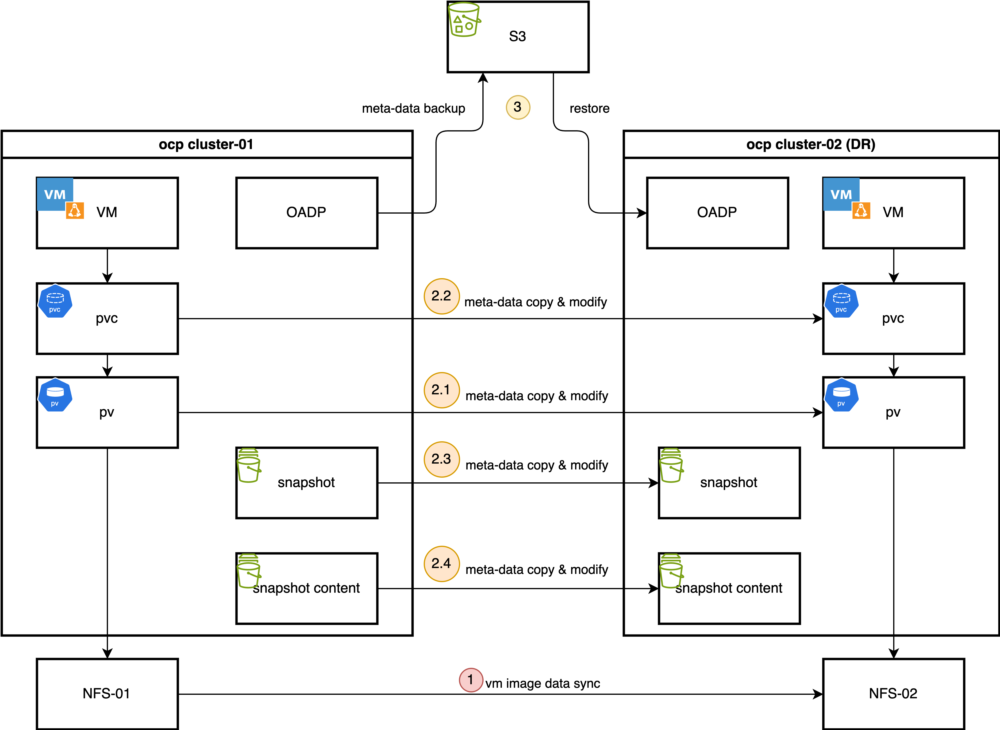
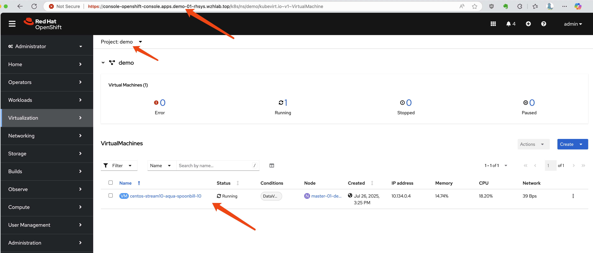
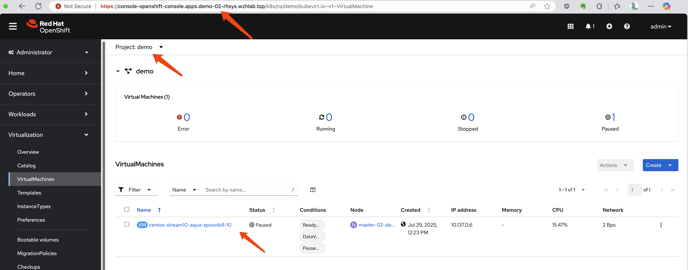
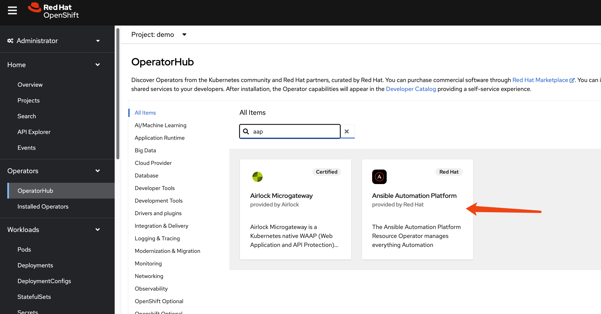
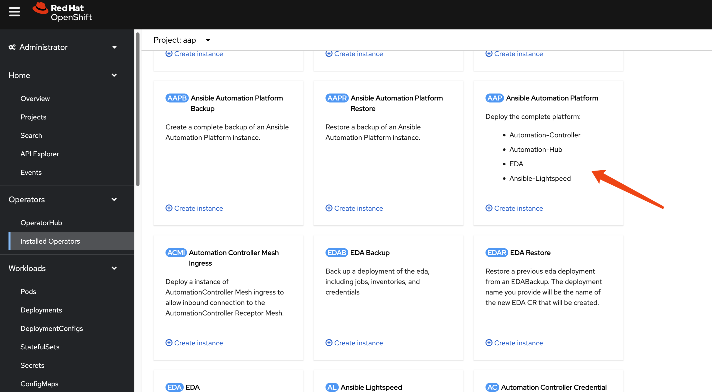
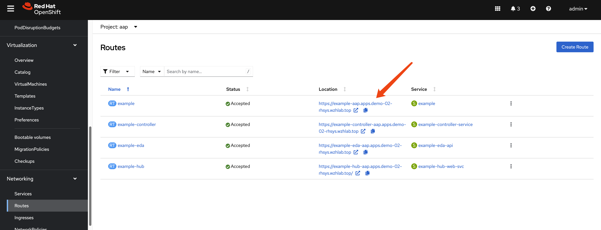
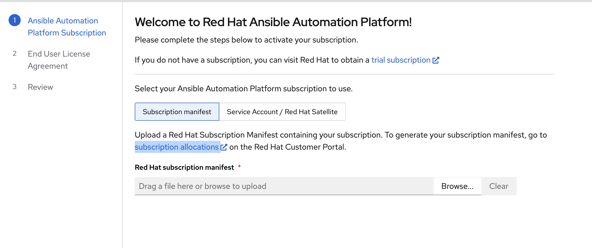
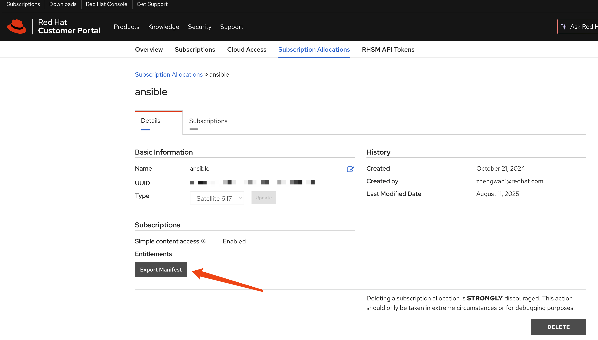
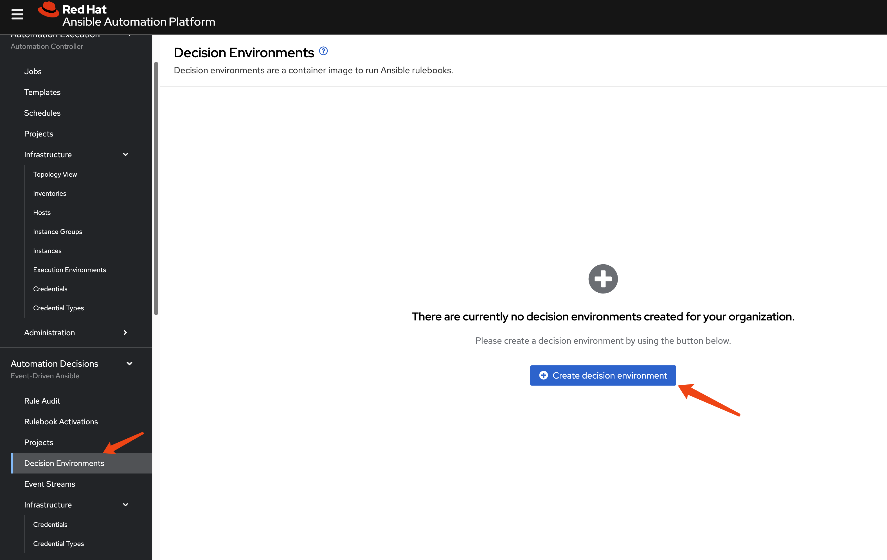

> [!NOTE]
> work in progress
# OpenShift Virtualization Disaster Recovery based on storage replication solution.

In Red Hat's solution, OpenShift Virtualization (OCP-V) does not have a built-in DR solution; Red Hat recommends using ODF's DR feature for this purpose. Essentially, this is a storage-based solution. ODF supports Ceph or IBM Flash Storage as backend storage solutions. However, if customers use third-party storage solutions like Dell, EMC, or Hitachi, how should an OCP-V DR solution be implemented?

Our approach leverages OpenShift's OADP (OpenShift API for Data Protection) feature to back up OCP-V metadata, including virtual machine configurations and Persistent Volume (PV)/Persistent Volume Claim (PVC) configurations. Concurrently, we utilize the underlying storage solution's remote replication capabilities to a remote site. Should the primary site encounter an issue, the DR process is manually triggered: OCP-V virtual machines at the primary site are shut down, and storage is set to read-only. Subsequently, the underlying storage's remote replication is verified or initiated to synchronize PVs/LUNs, and the completion of the backup process is confirmed. Finally, the OCP-V metadata is imported at the remote site, and storage system-related information within the PVs is updated to ensure PVs correctly map to the appropriate storage LUNs or directories. This completes the DR process.

The process for switching back from the remote site to the primary site is identical.

This document uses NFS to simulate the underlying storage system to demonstrate an OCP-V DR process. It begins with manual operations, followed by automating the entire process with the assistance of Generative AI and Ansible.



# install ocp-v

Our demo case is OCP-V, focusing on VM DR, so the `OpenShift Virtualization` operator needs to be installed.


Because we have customized NFS storage, we need to ensure CNV recognizes it.

```bash

cat << EOF > $BASE_DIR/data/install/cnv-sp.yaml
apiVersion: cdi.kubevirt.io/v1beta1
kind: StorageProfile
metadata:
  name: nfs-dynamic
spec:
  claimPropertySets:
  - accessModes:
    - ReadWriteMany
    volumeMode: Filesystem
EOF

oc apply -f $BASE_DIR/data/install/cnv-sp.yaml

```

# install oadp

We use OpenShift's official OADP (OpenShift API for Data Protection) operator for remote metadata backups. OADP is an S3-based remote backup solution that can back up both metadata and PVC data. However, since it compresses data and uploads it to S3, then downloads and decompresses it during recovery, this process is too slow for virtual machines.

Therefore, our solution naturally involves using OADP to back up metadata, while leveraging the storage system's native capabilities for remote data replication.

First, we install OADP on both the local (cluster-01) and remote (cluster-02) clusters.


Next, we configure the S3 access credentials.

```bash
cat << EOF > $BASE_DIR/data/install/credentials-minio
[default]
aws_access_key_id = rustfsadmin
aws_secret_access_key = rustfsadmin
EOF

oc create secret generic minio-credentials \
--from-file=cloud=$BASE_DIR/data/install/credentials-minio \
-n openshift-adp
```

Finally, we create an OADP instance, specifying the S3 storage location to be used.

```bash
# define the oadp instance
# oc delete -f $BASE_DIR/data/install/oadp.yaml
cat << EOF > $BASE_DIR/data/install/oadp.yaml
apiVersion: oadp.openshift.io/v1alpha1
kind: DataProtectionApplication
metadata:
  name: velero-instance
  namespace: openshift-adp # The namespace where the OADP Operator is located
spec:
  # 1. Define your S3 bucket information here
  backupLocations:
    - name: default
      velero:
        provider: aws # or gcp, azure, etc.
        default: true
        objectStorage:
          bucket: ocp
          prefix: velero # Backups will be stored in the velero/ directory inside the bucket
        config:
          # For non-AWS S3, for example MinIO, you need to provide the URL
          s3Url: http://192.168.99.1:9000
          region: us-east-1
        # Reference the Secret containing your S3 credentials
        credential:
          name: minio-credentials
          key: cloud
  
  # 2. Configure Velero's core behavior and plugins here
  configuration:
    nodeAgent:
      enable: true
      uploaderType: kopia 
    velero:
      # Specify the plugins to use
      defaultPlugins:
        - openshift
        - kubevirt
        - csi
        - aws

      featureFlags:
        - EnableCSI

    # 3. Configure volume snapshots and data movers (DataMover/Kopia) here
    # csi:
    #   enable: false
    # datamover:
    #   enable: false
EOF

oc apply -f $BASE_DIR/data/install/oadp.yaml
```

# Main site(cluster-01) create backup

On the primary site, we have a `demo` project where a virtual machine has already been created.



Let's get the information of the vm, and the pvc and pv associated with the vm.

```bash
oc get vm -n demo
# NAME                                AGE    STATUS    READY
# centos-stream10-aqua-spoonbill-10   3d5h   Running   True

oc get vm centos-stream10-aqua-spoonbill-10 -n demo -o jsonpath='{.spec.template.spec.volumes[*].dataVolume.name}' && echo
# centos-stream10-aqua-spoonbill-10-volume


oc get pvc centos-stream10-aqua-spoonbill-10-volume -n demo -o jsonpath='{.spec.volumeName}' && echo
# pvc-7147333f-2db5-4b3f-9320-aac8da5170e2
```

On the primary site (cluster-01), we create an OADP backup specifically for the namespace, explicitly excluding Persistent Volume (PV) data.

```bash
# current testing test
# oc delete -f $BASE_DIR/data/install/oadp-backup.yaml
cat << EOF > $BASE_DIR/data/install/oadp-backup.yaml
apiVersion: velero.io/v1
kind: Backup
metadata:
  name: vm-full-metadata-backup-03
  namespace: openshift-adp
spec:
  # 1. Include the namespace containing your VMs and PVCs
  includedNamespaces:
    - demo

  # 2. Explicitly include PVs in the backup
  # By default, Velero automatically includes PVs bound by PVCs in the backup.
  # However, to be absolutely certain and explicit, you can specify them.
  # Note: Velero's intelligence usually makes this unnecessary if you are backing up the PVCs.
  # includedResources:
  #   - persistentvolumes
  #   - persistentvolumeclaims
    # - virtualmachines  (and any other resources you need)
    # If you leave this field empty, it backs up all resources in the includedNamespaces.

  # 3. Include cluster-scoped resources like PVs
  # When backing up a namespaced resource (PVC) that depends on a cluster-scoped
  # resource (PV), Velero typically includes the PV automatically. Setting this to 'true'
  # ensures all cluster-scoped resources are considered. For just capturing PVs
  # linked to your PVCs, the default 'nil' (auto) is usually sufficient.
  includeClusterResources: true

  # 4. The MOST IMPORTANT setting for your use case:
  # This tells Velero "Do NOT attempt to create a data snapshot of the PVs."
  # It will still save the PV object's YAML definition.
  snapshotVolumes: false
  snapshotMoveData: false
  defaultVolumesToFsBackup: false

  # Define where to store the metadata backup
  storageLocation: default

  # Set a Time To Live for the backup object
  # ttl: 720h0m0s # 30 days
  ttl: 3h0m0s
EOF

oc apply -f $BASE_DIR/data/install/oadp-backup.yaml

```


# Recovery (DR site, cluster-02)

At the DR site, the first step is to synchronize the data using the storage system's capabilities. In our NFS scenario, we can simply use the `rsync` tool to copy the directory.

```bash

sudo rsync -avh --progress /srv/nfs/openshift-01/demo-centos-stream10-aqua-spoonbill-10-volume-pvc-7147333f-2db5-4b3f-9320-aac8da5170e2 /srv/nfs/openshift-02/
```

Next, we manually locate the `pvc` (Persistent Volume Claim) and its metadata that needs to be synchronized from cluster-01. We then modify it according to the configuration of cluster-02 and create it on cluster-02.

In our NFS scenario, the `path` within the PV needs to be modified. For other storage backends, the relevant parameters should be replaced according to the specific situation.

```yaml
kind: PersistentVolume
apiVersion: v1
metadata:
  name: pvc-7147333f-2db5-4b3f-9320-aac8da5170e2
spec:
  capacity:
    storage: '36071014400'
  nfs:
    server: 192.168.99.1
    path: /srv/nfs/openshift-02/demo-centos-stream10-aqua-spoonbill-10-volume-pvc-7147333f-2db5-4b3f-9320-aac8da5170e2
  accessModes:
    - ReadWriteMany
  persistentVolumeReclaimPolicy: Delete
  storageClassName: nfs-dynamic
  volumeMode: Filesystem
```

Next, we create the PVC. Generally, OADP should not directly restore PVCs, as this would trigger automatic PV deployment on the new cluster.

```yaml
kind: PersistentVolumeClaim
apiVersion: v1
metadata:
  name: centos-stream10-aqua-spoonbill-10-volume
spec:
  accessModes:
    - ReadWriteMany
  resources:
    requests:
      storage: '36071014400'
  volumeName: pvc-7147333f-2db5-4b3f-9320-aac8da5170e2
  storageClassName: nfs-dynamic
  volumeMode: Filesystem
```

Next, we create the `restore` object. This will automatically recreate the virtual machines and their associated configurations from the original `demo` project on the target cluster (cluster-02) within the same project.

```bash
# oc delete -f $BASE_DIR/data/install/oadp-restore.yaml
cat << EOF > $BASE_DIR/data/install/oadp-restore.yaml
apiVersion: velero.io/v1
kind: Restore
metadata:
  name: restore-metadata-excluding-pvs-03
  namespace: openshift-adp
spec:
  # 1. Specify the name of the backup you want to restore from.
  backupName: vm-full-metadata-backup-03

  # 2. Exclude PersistentVolumes and PersistentVolumeClaims.
  # This is the most critical part for your request.
  excludedResources:
    - persistentvolumes
    - persistentvolumeclaims
    - snapshot
    - snapshotcontent

  # 3. (Optional) Map the original namespace to a new one if needed.
  # If you want to restore to the same namespace ('demo'), you can omit this.
  # If you want to restore to a different namespace (e.g., 'restored-demo'), use this.
  # namespaceMapping:
  #  demo: restored-demo

  # Let Velero restore cluster-scoped resources (like CRDs, etc.) that were included in the backup.
  # The default 'auto' is usually sufficient.
  includeClusterResources: false
EOF

oc apply -f $BASE_DIR/data/install/oadp-restore.yaml

```

Now we can see the vm is created in cluster-02, it is in `paused` status because the demo system has limited io resource. 



# if something wrong

If the recovery process encounters issues and the VM fails to start, you can delete the VM and attempt to recreate the `restore` object.

```bash
# Delete the stuck VM
oc delete vm centos-stream10-aqua-spoonbill-10 -n demo
```

# Regular backups

In a real-world scenario, we would certainly implement scheduled backups, backing up the target project's metadata hourly. OADP provides this functionality.

```bash
# oc delete -f $BASE_DIR/data/install/oadp-schedule.yaml
cat << EOF > $BASE_DIR/data/install/oadp-schedule.yaml
apiVersion: velero.io/v1
kind: Schedule
metadata:
  name: daily-metadata-backup-schedule
  namespace: openshift-adp
spec:
  # 1. Define the backup schedule (using Cron expressions)
  # This example is for "22 min hourly"
  schedule: 22 * * * *

  # 2. Defining a backup content template. (template)
  # This section is almost identical to the Backup object you created earlier.
  template:
    spec:
      # Include the namespaces you need to back up.
      includedNamespaces:
        - demo

      # Ensure cluster-scoped resources are included.
      includeClusterResources: true

      # Most important setting: Do not take volume snapshots; only back up metadata.
      snapshotVolumes: false

      # Backup storage location
      storageLocation: default

      # 3. Set the backup retention policy. (TTL - Time To Live)
      # This backup will be automatically deleted 30 days after creation.
      # Format is hours (h)/minutes (m)/seconds (s).
      # ttl: 720h0m0s # (30 days * 24 hours = 720 hours)
      ttl: 3h0m0s
EOF

oc apply -f $BASE_DIR/data/install/oadp-schedule.yaml

```

OADP will automatically create backups with names like `daily-metadata-backup-schedule-20250730010000`, and these will be automatically deleted upon expiration.

# testing with nfs-csi

Above testing is based on nfs-subdir, we will try testing with nfs-csi.

```bash
# copy pv and snapshot data from openshift-01 to openshift-02
sudo rsync -avh --progress /srv/nfs/openshift-01/pvc-430cb55c-9e9f-4eb4-ad44-0b797d0c5a56 /srv/nfs/openshift-02/
sudo rsync -avh --progress /srv/nfs/openshift-01/snapshot-a3ad8ba8-4ba7-4a67-85b3-5517a1d4c06c /srv/nfs/openshift-02/

```

on DR site, create pv

```yaml
kind: PersistentVolume
apiVersion: v1
metadata:
  name: pvc-430cb55c-9e9f-4eb4-ad44-0b797d0c5a56
spec:
  capacity:
    storage: 34400Mi
  csi:
    driver: nfs.csi.k8s.io
    volumeHandle: 192.168.99.1#srv/nfs/openshift-02#pvc-430cb55c-9e9f-4eb4-ad44-0b797d0c5a56## # 确保指向nfs02
    volumeAttributes:
      server: 192.168.99.1
      share: /srv/nfs/openshift-02 # 确保指向nfs02
      subdir: pvc-430cb55c-9e9f-4eb4-ad44-0b797d0c5a56
  accessModes:
    - ReadWriteMany
  persistentVolumeReclaimPolicy: Retain # 关键点1: 设为Retain
  storageClassName: nfs-csi
  mountOptions:
    - hard
    - nfsvers=4.2
    - rsize=1048576
    - wsize=1048576
    - noatime
    - nodiratime
    - actimeo=60
    - timeo=600
    - retrans=3
  volumeMode: Filesystem

```

create pvc

```yaml
kind: PersistentVolumeClaim
apiVersion: v1
metadata:
  name: centos-stream10-harlequin-mole-88-volume
  namespace: demo
spec:
  accessModes:
    - ReadWriteMany
  resources:
    requests:
      storage: '36071014400'
  volumeName: pvc-430cb55c-9e9f-4eb4-ad44-0b797d0c5a56
  storageClassName: nfs-csi
  volumeMode: Filesystem
```

till here, pv/pvc is ok.

create snapshot

```yaml
apiVersion: snapshot.storage.k8s.io/v1
kind: VolumeSnapshot
metadata:
  name: vmsnapshot-f8187894-9cd0-48cf-8046-1d72b59c7780-volume-rootdisk
  namespace: demo
spec:
  # 关键点4: 不要指定 volumeSnapshotClassName
  # volumeSnapshotClassName: nfs-csi-snapclass 
  source:
    volumeSnapshotContentName: snapcontent-a3ad8ba8-4ba7-4a67-85b3-5517a1d4c06c # 指向您计划恢复到的PVC名称

```


create snapshotcontent

```yaml
apiVersion: snapshot.storage.k8s.io/v1
kind: VolumeSnapshotContent
metadata:
  name: snapcontent-a3ad8ba8-4ba7-4a67-85b3-5517a1d4c06c
spec:
  deletionPolicy: Retain # 关键点1: 设为Retain
  driver: nfs.csi.k8s.io
  source:
    volumeHandle: 192.168.99.1#srv/nfs/openshift-02#pvc-430cb55c-9e9f-4eb4-ad44-0b797d0c5a56## # 确保指向nfs02
  sourceVolumeMode: Filesystem
  volumeSnapshotClassName: nfs-csi-snapclass # 关键点2: 必须指定ClassName
  volumeSnapshotRef:
    apiVersion: snapshot.storage.k8s.io/v1
    kind: VolumeSnapshot
    name: vmsnapshot-f8187894-9cd0-48cf-8046-1d72b59c7780-volume-rootdisk
    namespace: demo
    uid: 0acaa4ca-2d92-4403-9c84-26d589a60636 # get uid after above object created

```


and the result is

```yaml
apiVersion: snapshot.storage.k8s.io/v1
kind: VolumeSnapshot
metadata:
  name: vmsnapshot-f8187894-9cd0-48cf-8046-1d72b59c7780-volume-rootdisk
  namespace: demo
spec:
  # 关键点4: 不要指定 volumeSnapshotClassName
  # volumeSnapshotClassName: nfs-csi-snapclass 
  source:
    volumeSnapshotContentName: snapcontent-a3ad8ba8-4ba7-4a67-85b3-5517a1d4c06c # 指向您计划恢复到的PVC名称
status:
  error:
    message: VolumeSnapshotContent is dynamically provisioned while expecting a pre-provisioned one
    time: '2025-08-15T13:32:20Z'
  readyToUse: false
```

but vsc is ok

```yaml
apiVersion: snapshot.storage.k8s.io/v1
kind: VolumeSnapshotContent
metadata:
  finalizers:
    - snapshot.storage.kubernetes.io/volumesnapshotcontent-bound-protection
  name: snapcontent-a3ad8ba8-4ba7-4a67-85b3-5517a1d4c06c
spec:
  deletionPolicy: Retain
  driver: nfs.csi.k8s.io
  source:
    volumeHandle: 192.168.99.1#srv/nfs/openshift-02#pvc-430cb55c-9e9f-4eb4-ad44-0b797d0c5a56##
  sourceVolumeMode: Filesystem
  volumeSnapshotClassName: nfs-csi-snapclass
  volumeSnapshotRef:
    apiVersion: snapshot.storage.k8s.io/v1
    kind: VolumeSnapshot
    name: vmsnapshot-f8187894-9cd0-48cf-8046-1d72b59c7780-volume-rootdisk
    namespace: demo
    uid: 06f68026-4072-4ea9-b3f3-699fc8846a39
status:
  creationTime: 1755266995304901400
  readyToUse: true
  restoreSize: 1692856304
  snapshotHandle: 192.168.99.1#srv/nfs/openshift-02#snapshot-06f68026-4072-4ea9-b3f3-699fc8846a39#snapshot-06f68026-4072-4ea9-b3f3-699fc8846a39#pvc-430cb55c-9e9f-4eb4-ad44-0b797d0c5a56

```

But, it seems create a new snapshot instead of use the folder just sync from nfs-01

So, there is deadlock, we try to disable the csi-snapshot-controller.

```bash
oc edit csisnapshotcontrollers.operator.openshift.io cluster
managementState: Managed -> Removed

oc get deployment -n openshift-cluster-storage-operator
# NAME                               READY   UP-TO-DATE   AVAILABLE   AGE
# cluster-storage-operator           1/1     1            1           11d
# csi-snapshot-controller            2/2     2            2           11d
# csi-snapshot-controller-operator   1/1     1            1           11d

oc scale deployment csi-snapshot-controller --replicas=0 -n openshift-cluster-storage-operator

oc scale deployment csi-snapshot-controller --replicas=2 -n openshift-cluster-storage-operator

"status":{"boundVolumeSnapshotContentName":"snapcontent-a3ad8ba8-4ba7-4a67-85b3-5517a1d4c06c","readyToUse":true}}

status:
  boundVolumeSnapshotContentName: snapcontent-a3ad8ba8-4ba7-4a67-85b3-5517a1d4c06c
  readyToUse: true
```

But it turn out still not work.

## using pv as intermediate storage

We will restore the snapshot on ocp-01, and rsync the pv to ocp-02, and create snapshot based on the pv on ocp-02.

Let's do it.


```bash
# on ocp-01

oc get vm
# NAME                                AGE   STATUS    READY
# centos-stream10-harlequin-mole-88   34h   Stopped   False

oc get pvc
# NAME                                       STATUS   VOLUME                                     CAPACITY   ACCESS MODES   STORAGECLASS   VOLUMEATTRIBUTESCLASS   AGE
# centos-stream10-harlequin-mole-88-volume   Bound    pvc-430cb55c-9e9f-4eb4-ad44-0b797d0c5a56   34400Mi    RWX            nfs-csi        <unset>                 34h

oc get vs
# NAME                                                              READYTOUSE   SOURCEPVC                                  SOURCESNAPSHOTCONTENT   RESTORESIZE   SNAPSHOTCLASS       SNAPSHOTCONTENT                                    CREATIONTIME   AGE
# vmsnapshot-f8187894-9cd0-48cf-8046-1d72b59c7780-volume-rootdisk   true         centos-stream10-harlequin-mole-88-volume                           1692856304    nfs-csi-snapclass   snapcontent-a3ad8ba8-4ba7-4a67-85b3-5517a1d4c06c   29h            30h


cat << EOF > $BASE_DIR/data/install/restore.yaml
apiVersion: v1
kind: PersistentVolumeClaim
metadata:
  # 为您的新PVC起一个有意义的名字
  name: restored-vm-disk-from-snapshot
  # 确保这个PVC创建在与快照相同的命名空间中
  namespace: demo
spec:
  # 关键部分：指定数据源为我们已有的快照
  dataSource:
    name: vmsnapshot-f8187894-9cd0-48cf-8046-1d72b59c7780-volume-rootdisk
    kind: VolumeSnapshot
    apiGroup: snapshot.storage.k8s.io
  
  # 访问模式和存储大小必须与原始PVC兼容
  accessModes:
    - ReadWriteMany # NFS通常使用ReadWriteMany
  resources:
    requests:
      # 请求的存储大小必须大于或等于快照的恢复大小 (RESTORESIZE)
      storage: 34Gi # <-- 请根据您VM原始磁盘的大小来设置这个值
  
  # 存储类应该与快照的存储类匹配，或者使用兼容的存储类
  storageClassName: nfs-csi
EOF

oc apply -f $BASE_DIR/data/install/restore.yaml

oc get pvc
# NAME                                       STATUS   VOLUME                                     CAPACITY   ACCESS MODES   STORAGECLASS   VOLUMEATTRIBUTESCLASS   AGE
# centos-stream10-harlequin-mole-88-volume   Bound    pvc-430cb55c-9e9f-4eb4-ad44-0b797d0c5a56   34400Mi    RWX            nfs-csi        <unset>                 34h
# restored-vm-disk-from-snapshot             Bound    pvc-d77429b2-042b-431b-b504-b3fc29f587e0   34Gi       RWX            nfs-csi        <unset>                 2m12s

# sync data from nfs-01 to nfs-02
sudo rsync -avh --progress /srv/nfs/openshift-01/pvc-d77429b2-042b-431b-b504-b3fc29f587e0 /srv/nfs/openshift-02/


cat << EOF > $BASE_DIR/data/install/dr-pv.yaml
kind: PersistentVolume
apiVersion: v1
metadata:
  name: pvc-d77429b2-042b-431b-b504-b3fc29f587e0
spec:
  capacity:
    storage: 34400Mi
  csi:
    driver: nfs.csi.k8s.io
    volumeHandle: 192.168.99.1#srv/nfs/openshift-02#pvc-d77429b2-042b-431b-b504-b3fc29f587e0## # 确保指向nfs02
    volumeAttributes:
      server: 192.168.99.1
      share: /srv/nfs/openshift-02 # 确保指向nfs02
      subdir: pvc-d77429b2-042b-431b-b504-b3fc29f587e0
  accessModes:
    - ReadWriteMany
  persistentVolumeReclaimPolicy: Retain # 关键点1: 设为Retain
  storageClassName: nfs-csi
  mountOptions:
    - hard
    - nfsvers=4.2
    - rsize=1048576
    - wsize=1048576
    - noatime
    - nodiratime
    - actimeo=60
    - timeo=600
    - retrans=3
  volumeMode: Filesystem
EOF

oc apply -f $BASE_DIR/data/install/dr-pv.yaml


cat << EOF > $BASE_DIR/data/install/dr-pvc.yaml
kind: PersistentVolumeClaim
apiVersion: v1
metadata:
  name: restored-vm-disk-from-snapshot
  namespace: demo
spec:
  accessModes:
    - ReadWriteMany
  resources:
    requests:
      storage: '36071014400'
  volumeName: pvc-d77429b2-042b-431b-b504-b3fc29f587e0
  storageClassName: nfs-csi
  volumeMode: Filesystem
EOF

oc apply -f $BASE_DIR/data/install/dr-pvc.yaml


cat << EOF > $BASE_DIR/data/install/dr-vs.yaml
apiVersion: snapshot.storage.k8s.io/v1
kind: VolumeSnapshot
metadata:
  # use the same vs name as ocp-01
  name: vmsnapshot-f8187894-9cd0-48cf-8046-1d72b59c7780-volume-rootdisk
  # 确保快照和源PVC在同一个命名空间
  namespace: demo
spec:
  # 关键部分：指定要为其创建快照的PVC
  source:
    persistentVolumeClaimName: restored-vm-disk-from-snapshot
  
  # 关键部分：指定使用哪个VolumeSnapshotClass
  # 这个名称取决于您集群中的配置，'nfs-csi-snapclass'是一个常见的命名
  volumeSnapshotClassName: nfs-csi-snapclass
EOF

oc apply -f $BASE_DIR/data/install/dr-vs.yaml

```

Then create backup on ocp-01, and create restore on ocp-02. 

## conclusion with snapshot of ocp-v

The `VirtualMachineSnapshot` definision does not support reference to dedicate snapshot, that means if it created, the only work it does, is to create snapshot based on current pvc.

So do not worry about snapshot for now.

## test with csi snapshot

```yaml
apiVersion: velero.io/v1
kind: Backup
metadata:
  name: vm-full-metadata-backup-03
  namespace: openshift-adp
spec:
  # 1. Include the namespace containing your VMs and PVCs
  includedNamespaces:
    - demo

  # 2. Explicitly include PVs in the backup
  # By default, Velero automatically includes PVs bound by PVCs in the backup.
  # However, to be absolutely certain and explicit, you can specify them.
  # Note: Velero's intelligence usually makes this unnecessary if you are backing up the PVCs.
  # includedResources:
  #   - persistentvolumes
  #   - persistentvolumeclaims
    # - virtualmachines  (and any other resources you need)
    # If you leave this field empty, it backs up all resources in the includedNamespaces.

  # 3. Include cluster-scoped resources like PVs
  # When backing up a namespaced resource (PVC) that depends on a cluster-scoped
  # resource (PV), Velero typically includes the PV automatically. Setting this to 'true'
  # ensures all cluster-scoped resources are considered. For just capturing PVs
  # linked to your PVCs, the default 'nil' (auto) is usually sufficient.
  includeClusterResources: true

  # 4. The MOST IMPORTANT setting for your use case:
  # This tells Velero "Do NOT attempt to create a data snapshot of the PVs."
  # It will still save the PV object's YAML definition.
  snapshotVolumes: true
  snapshotMoveData: true
  defaultVolumesToFsBackup: false

  # Define where to store the metadata backup
  storageLocation: default

  # Set a Time To Live for the backup object
  # ttl: 720h0m0s # 30 days
  ttl: 3h0m0s
```

# Automating the DR Process

The manual steps outlined above can be scripted to create a fully automated disaster recovery workflow. Here is a high-level overview of the automation logic:

1.  **Schedule Backups**: On the primary cluster, create a recurring OADP `Schedule` to regularly back up application metadata.

2.  **Extract and Analyze**: An automation script will periodically download the latest backup from S3. It will then decompress the archive and parse the manifest files to identify the specific `PersistentVolume` (PV) and `PersistentVolumeClaim` (PVC) resources associated with the protected virtual machines.

3.  **Synchronize and Prepare**:
    *   Using the details from the PV manifests, the script will trigger the underlying storage system's remote replication to the DR site.
    *   The script will then transform the PV manifest, updating storage-specific parameters (e.g., NFS server IP, LUN ID) to match the configuration of the DR site.
    *   Finally, it will apply the modified PV and PVC manifests to the DR cluster to pre-stage the volume resources.

4.  **Execute Failover**: In the event of a disaster, the final automated step is to run an OADP `Restore` on the DR cluster. This restore will bring the VM and other application resources online, connecting them to the already replicated and pre-staged persistent volumes.

## install aap 

On DR site, with verion 2.5



Create `ansible automation platform` with default setting.









get default password

```bash
oc get secret example-admin-password -n aap -o jsonpath='{.data.password}' | base64 --decode && echo
# YSxW550O59EcPgBKF4ugZTjaz9sYmBKj
```



For admin to login longer, update the aap setting:

```yaml
spec:
  extra_settings:
    - setting: SESSION_COOKIE_AGE
      value: '86400'
    - setting: AUTH_TOKEN_MAX_AGE
      value: '86400'
```

# end
