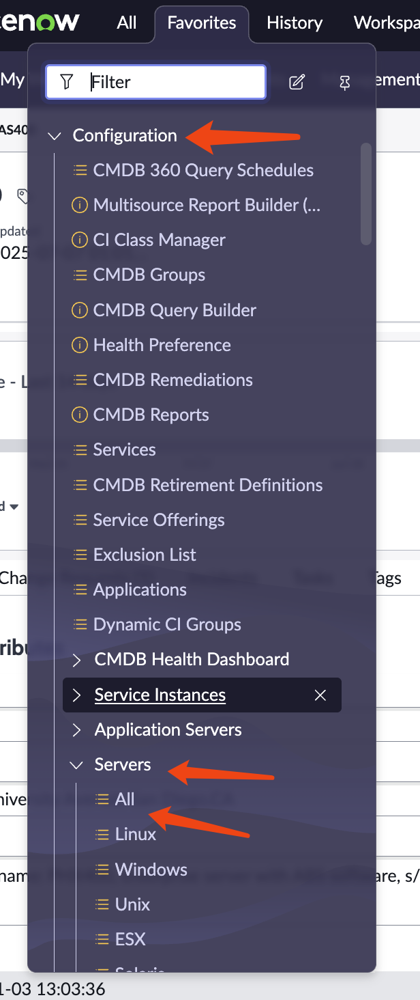
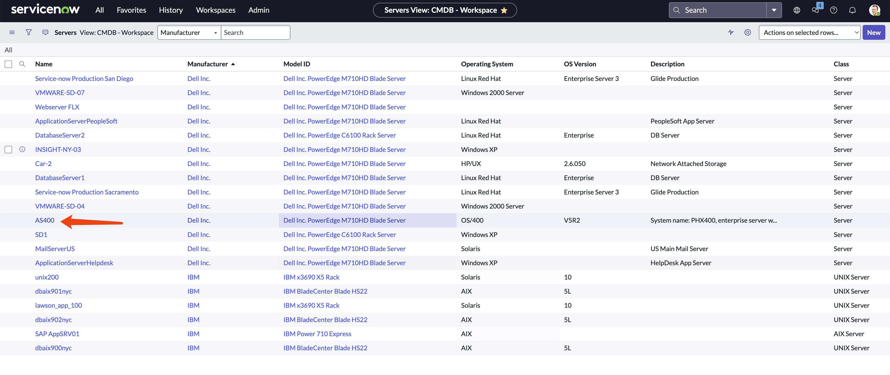
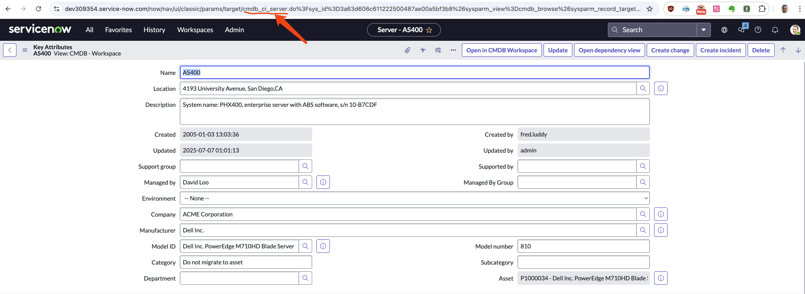

> [!NOTE]
> work in progress
# using ansible to get cmdb data from service now

A common use case for Ansible is to fetch data from a source system (like Service Now) and then perform some operations on that data. Typically there are 2 ways to do that
1. Using the `snow` module to directly call the API of Service Now.
2. Using ansible dynamic inventory to fetch data from Service Now.

In this article, we will use the first method to fetch data from Service Now.

# preparing

You need testing system to test your playbook. Here are the things you need:
- working ansible automation platform (aap 2.5)
- a service.now instance (developer instance is ok)
- credentials for accessing the service now instance

You can find the detailed instructins in [this previous article](https://github.com/wangzheng422/docker_env/blob/dev/redhat/ocp4/4.18/2025.05.ansible.service.now.md).

# get cmdb data from service.now

We already have a playbook to fetch data from Service Now, here is the [link](https://github.com/wangzheng422/ansible.service.now/blob/main/job.template/get_servicenow_cmdb_config.yml).

Let's go throught the key points of this playbook.

You need to find the class name of the CMDB object you want to search for. You can search without the class, but it will be very slow.

```yaml
    # Specify the CMDB class name to query.
    # Examples:
    # - cmdb_ci_server (for general servers)
    # - cmdb_ci_database (for databases)
    # - cmdb_ci_app_server (for application servers like Java app servers)
    # - cmdb_ci_web_server (for web servers)
    # You can find available class names in your ServiceNow instance under "Configuration > CI Class Manager"
    # or by inspecting the 'sys_db_object' table (filter for tables starting with 'cmdb_ci_').
    cmdb_ci_class_name: "cmdb_ci_server" # Default to servers, change as needed
```

How to find the class name you want? Here is a dummy method, if you do not know how to get it in another way.

Find the device you want to search for, click on the device, and then go to details. You can find the class name in the url.








And here is the core logic on how to get the cmdb data.

```yaml
    - name: Get CMDB information
      servicenow.itsm.configuration_item_info:
        instance:
          host: "{{ snow_instance }}"
          username: "{{ snow_username }}"
          password: "{{ snow_password }}"
        sys_class_name: "{{ cmdb_ci_class_name }}" # Use the variable for class name
        query:
          # - manufacturer.name: "= Dell Inc."
          #   install_status: "= installed"
          - manufacturer.name: "STARTSWITH Dell"
        return_fields: # Specify fields to retrieve (these might vary by class)
          - name
          - ip_address
          - os
          - manufacturer
          - model_id
          - serial_number
          - asset_tag
          - sys_class_name
          - sys_id
      register: cmdb_servers
```

You can see we limit the search to `sys_class_name`, and we also limit the search with query by matching the `manufacturer.name` field. We also limit the return fields. You can find more details on this ansible model at [offical document](https://github.com/ansible-collections/servicenow.itsm/blob/main/docs/servicenow.itsm.configuration_item_info_module.rst).

The other part of the playbook is to parse the json returned, and convert it to csv and upload.

