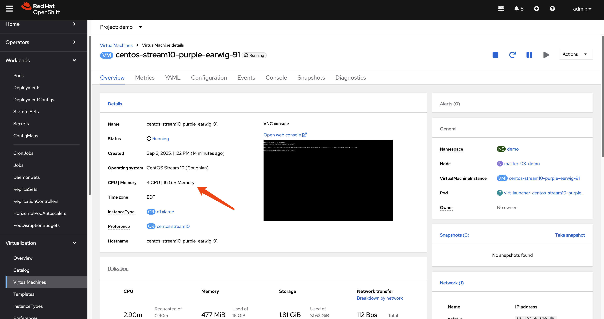

# OpenShift Workload Partitioning Deep Dive

## Introduction

Workload Partitioning is a powerful feature in OpenShift designed to provide CPU core isolation between critical OpenShift system components and user-deployed workloads. This isolation is particularly beneficial in resource-constrained environments such as Single-Node OpenShift (SNO) or 3-node compact clusters, where system services and user applications run on the same hosts and compete for CPU resources.

By dedicating specific CPU cores to the system and others to workloads, you can achieve more predictable performance and prevent user applications from impacting the stability and responsiveness of the cluster's control plane.

This document provides a detailed demonstration of how to configure and verify workload partitioning. We will deploy sample pods and a virtual machine to observe how the CPU isolation is enforced.

For official documentation, please refer to the Red Hat OpenShift Container Platform documentation:
- [Enabling Workload Partitioning](https://docs.redhat.com/en/documentation/openshift_container_platform/4.18/html/scalability_and_performance/enabling-workload-partitioning)

---

## 1. Enabling Workload Partitioning

Workload partitioning must be enabled during the initial cluster installation. This is done by adding the `cpuPartitioningMode` parameter to your `install-config.yaml` file.

```yaml
# install-config.yaml
...
cpuPartitioningMode: AllNodes
...
```

After the cluster is installed with this setting, you can apply a `PerformanceProfile` to define the CPU allocation.

### Applying the Performance Profile

In this example, we have a 3-node compact cluster where each node has 24 CPU cores. For demonstration purposes, we will reserve the first 20 cores (0-19) for OpenShift system components and leave the remaining 4 cores (20-23) for user workloads.

Create and apply the following `PerformanceProfile` manifest:

```bash
# Note: Ensure $BASE_DIR is set to your working directory
tee $BASE_DIR/data/install/performance-profile.yaml << 'EOF'
---
apiVersion: performance.openshift.io/v2
kind: PerformanceProfile
metadata:
  name: openshift-node-performance-profile
spec:
  cpu:
    # Cores reserved for user workloads
    isolated: "20-23" 
    # Cores reserved for OpenShift system components and the OS
    reserved: "0-19"
  machineConfigPoolSelector:
    pools.operator.machineconfiguration.openshift.io/master: ""
  nodeSelector:
    node-role.kubernetes.io/master: ''
  numa:
    # "restricted" policy enhances CPU affinity
    topologyPolicy: "restricted"
  realTimeKernel:
    enabled: false
  workloadHints:
    realTime: false
    highPowerConsumption: false
    perPodPowerManagement: false
EOF

oc apply -f $BASE_DIR/data/install/performance-profile.yaml
```

### Verifying System Component CPU Affinity

Once the `PerformanceProfile` is applied, the nodes will reboot to apply the new configuration. We can then verify that critical system processes, like `etcd`, are correctly pinned to the reserved CPU cores.

First, log in to a master node. Then, use the following script to check the CPU affinity for all `etcd` processes:

```bash
# Find all PIDs for etcd processes
ETCD_PIDS=$(ps -ef | grep "etcd " | grep -v grep | awk '{print $2}')

# Iterate through each PID and check its CPU affinity
for pid in $ETCD_PIDS; do
    echo "----------------------------------------"
    echo "Checking PID: ${pid}"
    
    COMMAND=$(ps -o args= -p "$pid")
    echo "Command: ${COMMAND}"
    
    echo -n "CPU affinity (Cpuset): "
    taskset -c -p "$pid"
done
```

The output should confirm that the `etcd` processes are running on the reserved cores (0-19).

```text
# Expected Output
----------------------------------------
Checking PID: 4332
Command: etcd --logger=zap ...
CPU affinity (Cpuset): pid 4332's current affinity list: 0-19
----------------------------------------
Checking PID: 4369
Command: etcd grpc-proxy start ...
CPU affinity (Cpuset): pid 4369's current affinity list: 0-19
```

---

## 2. Testing Workload Isolation with Pods

Now, let's test how different Quality of Service (QoS) classes of pods behave under this configuration. We will deploy a CPU-intensive pod and observe its CPU usage.

### Test Case 1: BestEffort Pod

A `BestEffort` pod is created when no resource requests or limits are specified. These pods are scheduled on the isolated (workload) CPUs.

```bash
tee $BASE_DIR/data/install/pod-besteffort.yaml << 'EOF'
---
apiVersion: apps/v1
kind: Deployment
metadata:
  name: cpu-stress-deployment
  namespace: demo
spec:
  replicas: 1
  selector:
    matchLabels:
      app: cpu-stress
  template:
    metadata:
      labels:
        app: cpu-stress
    spec:
      volumes:
        - name: temp-space
          emptyDir: {}
      containers:
        - name: stress-ng-container
          image: quay.io/wangzheng422/qimgs:rocky9-test-2025.04.30.v01
          volumeMounts:
            - name: temp-space
              mountPath: "/tmp/stress-workdir"
          # No resources defined, resulting in a BestEffort QoS class
          command:
            - "/bin/bash"
            - "-c"
            - |
              echo "Starting stress test on 4 CPUs...";
              stress-ng --cpu 4 --cpu-load 100 --temp-path /tmp/stress-workdir
EOF

oc apply -f $BASE_DIR/data/install/pod-besteffort.yaml
```

By running `top` on the host node, you will observe that the `stress-ng` processes are consuming 100% of the CPU on cores 20, 21, 22, and 23, while the reserved cores (0-19) remain largely unaffected.

```bash
# top output snippet
%Cpu19 :  2.0 us,  1.3 sy,  0.0 ni, 96.3 id,  0.0 wa,  0.3 hi,  0.0 si,  0.0 st
%Cpu20 : 98.7 us,  0.3 sy,  0.0 ni,  0.0 id,  0.0 wa,  0.7 hi,  0.3 si,  0.0 st
%Cpu21 : 97.0 us,  1.0 sy,  0.0 ni,  0.0 id,  0.0 wa,  0.7 hi,  1.3 si,  0.0 st
%Cpu22 : 99.3 us,  0.3 sy,  0.0 ni,  0.0 id,  0.0 wa,  0.3 hi,  0.0 si,  0.0 st
%Cpu23 : 99.3 us,  0.3 sy,  0.0 ni,  0.0 id,  0.0 wa,  0.3 hi,  0.0 si,  0.0 st
```

To further confirm the CPU pinning, we can inspect the process affinity using `taskset`. First, we find the parent process ID (PID) of our `stress-ng` workers. Then, we use `taskset` to check which CPU cores that process is bound to.

The output below shows that the parent `stress-ng` process (e.g., PID 86399) and its children are indeed bound to the isolated CPU core list, 20-23, confirming that the workload partitioning is working as expected.

```bash
# Find the parent process of the stress test
ps -ef | grep "stress-ng --"
1000740+   86399   86397  0 10:57 ?        00:00:00 stress-ng --cpu 4 --cpu-load 100 --temp-path /tmp/stress-workdir
1000740+   86403   86399 97 10:57 ?        00:01:58 stress-ng --cpu 4 --cpu-load 100 --temp-path /tmp/stress-workdir
1000740+   86404   86399 98 10:57 ?        00:02:00 stress-ng --cpu 4 --cpu-load 100 --temp-path /tmp/stress-workdir
1000740+   86405   86399 98 10:57 ?        00:02:00 stress-ng --cpu 4 --cpu-load 100 --temp-path /tmp/stress-workdir
1000740+   86406   86399 98 10:57 ?        00:02:00 stress-ng --cpu 4 --cpu-load 100 --temp-path /tmp/stress-workdir
# ... additional worker processes

# Check the CPU affinity of the parent process
taskset -c -p 86399
pid 86399's current affinity list: 20-23
```

### Test Case 2: Burstable Pod

A `Burstable` pod has resource requests that are lower than its limits. These pods are also scheduled on the isolated CPUs.

```bash
# Modify the deployment to set different requests and limits
...
          resources:
            requests:
              cpu: "1"
              memory: "512Mi"
            limits:
              cpu: "4"
              memory: "512Mi"
...
```

The result is the same: the workload runs exclusively on the isolated cores (20-23), demonstrating that the partitioning holds for `Burstable` pods.

### Test Case 3: Guaranteed Pod

A `Guaranteed` pod has CPU requests equal to its CPU limits. The Kubernetes CPU Manager assigns exclusive CPUs to each container in a `Guaranteed` pod.

```bash
# Modify the deployment to set equal requests and limits
...
          resources:
            requests:
              cpu: "3"
              memory: "512Mi"
            limits:
              cpu: "3"
              memory: "512Mi"
...
```

When this pod runs, it will be granted exclusive access to 3 cores from the isolated set (e.g., 20, 21, 22). The `top` output will show these specific cores at 100% utilization, while the fourth isolated core (23) and the reserved cores remain available.

---

## 3. Testing Workload Isolation with a Virtual Machine

Workload partitioning also applies to virtual machines managed by OpenShift Virtualization. Let's create a VM with 4 vCPUs and run the same stress test.

1.  **Create a VM:** Use the OpenShift console or `virtctl` to create a virtual machine with 4 CPU cores in a project/namespace.
    
    

2.  **Access the VM and Run Stress Test:**
    Use `virtctl` to SSH into the VM and execute the `stress-ng` command.

    ```bash
    # Download and install virtctl if you haven't already
    wget --no-check-certificate https://hyperconverged-cluster-cli-download-openshift-cnv.apps.demo-01-rhsys.wzhlab.top/amd64/linux/virtctl.tar.gz
    tar zvxf virtctl.tar.gz
    mv virtctl ~/.local/bin/

    # SSH into the VM and run the test
    virtctl -n demo ssh user@vm-name --identity-file=~/.ssh/id_rsa
    stress-ng --cpu 4 --cpu-load 100 --temp-path /tmp
    ```

3.  **Observe Host CPU Usage:**
    Checking `top` on the host node will again show that the QEMU process for the VM is consuming CPU cycles exclusively from the isolated cores (20-23).

    ```bash
    # top output snippet
    %Cpu19 :  1.7 us,  2.0 sy,  0.0 ni, 96.4 id,  0.0 wa,  0.0 hi,  0.0 si,  0.0 st
    %Cpu20 : 99.0 us,  0.3 sy,  0.0 ni,  0.0 id,  0.0 wa,  0.7 hi,  0.0 si,  0.0 st
    %Cpu21 : 96.7 us,  0.3 sy,  0.0 ni,  0.0 id,  0.0 wa,  1.0 hi,  2.0 si,  0.0 st
    %Cpu22 : 98.7 us,  0.3 sy,  0.0 ni,  0.0 id,  0.0 wa,  1.0 hi,  0.0 si,  0.0 st
    %Cpu23 : 99.0 us,  0.7 sy,  0.0 ni,  0.0 id,  0.0 wa,  0.3 hi,  0.0 si,  0.0 st
    ```

---

## 4. Behind the Scenes: How It Works

The isolation is achieved through a combination of configurations at the Kubelet and CRI-O levels, managed by the Performance Addon Operator.

### Kubelet Configuration

The `PerformanceProfile` creates a `KubeletConfig` object. The key parameter here is `reservedSystemCPUs`.

```bash
oc get kubeletconfig performance-openshift-node-performance-profile -o yaml
```

```yaml
# Snippet from KubeletConfig
...
spec:
  kubeletConfig:
    ...
    cpuManagerPolicy: static
    reservedSystemCPUs: 0-19
    topologyManagerPolicy: restricted
...
```

The `reservedSystemCPUs: 0-19` directive instructs the Kubelet to reserve cores 0-19 for the operating system and Kubernetes system daemons. The Kubelet's CPU Manager will only consider the remaining cores (20-23) as allocatable for pods.

### CRI-O Configuration

Additionally, a CRI-O configuration file is created to pin specific system-level workloads to the reserved cores. This ensures that even containers part of the OpenShift infrastructure are constrained to the reserved set.

```bash
# On a master node
cat /etc/crio/crio.conf.d/99-workload-pinning.conf
```

```ini
[crio.runtime.workloads.management]
activation_annotation = "target.workload.openshift.io/management"
annotation_prefix = "resources.workload.openshift.io"
resources = { "cpushares" = 0, "cpuset" = "0-19" }
```

This configuration tells CRI-O that any pod with the `target.workload.openshift.io/management` annotation should be placed on the `0-19` cpuset. This is how control plane pods are pinned, ensuring they do not interfere with user workloads.

---

## 5. Node Status Comparison

The effect of workload partitioning is clearly visible in the `oc describe node` output, specifically in the `Capacity` and `Allocatable` sections.

### After Workload Partitioning

Notice that while the `Capacity` shows 24 total CPUs, the `Allocatable` CPU count is only 4. This reflects the 20 cores that were reserved for the system.

```yaml
# oc describe node master-01-demo (After)
...
Capacity:
  cpu:                24
  memory:             30797848Ki
  pods:               250
Allocatable:
  cpu:                4
  memory:             29671448Ki
  pods:               250
...
```

### Before Workload Partitioning

Without workload partitioning, the `Allocatable` CPU is much higher (e.g., 23.5), as only a small fraction is reserved by default for system overhead.

```yaml
# oc describe node master-01-demo (Before)
...
Capacity:
  cpu:                24
  memory:             30797840Ki
  pods:               250
Allocatable:
  cpu:                23500m
  memory:             29646864Ki
  pods:               250
...
```

This comparison starkly illustrates how workload partitioning carves out a dedicated, non-allocatable set of CPU resources for system stability.

---

## Conclusion

Workload partitioning is an essential feature for running OpenShift in environments where resource contention is a concern. By creating a hard boundary between system and workload CPUs, it provides performance isolation, ensures control plane stability, and allows for more predictable application behavior. The configuration, managed via a `PerformanceProfile`, offers a robust mechanism to tailor CPU resource allocation to specific hardware and workload requirements.
