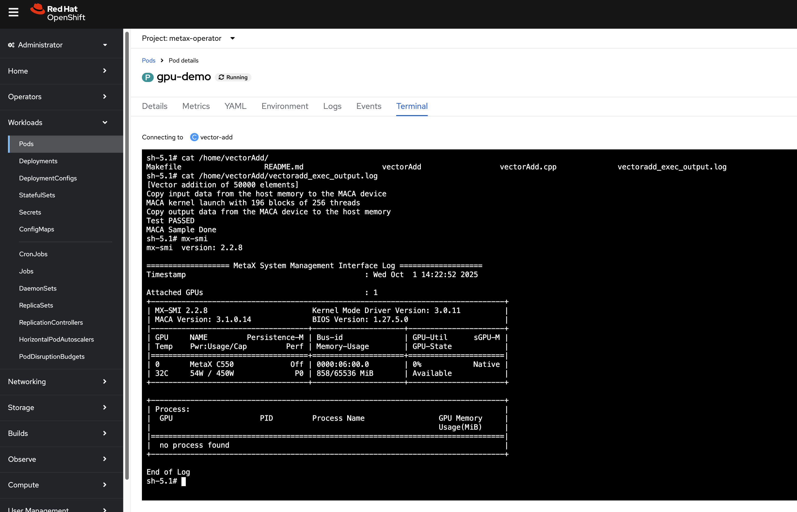

# metax gpu openshift on-boarding

we will try to integrate metax gpu on openshift 4.18. metax is a gpu vendor just like nvidia. It runs smoothly on rhel, but it can not run on openshift without some modification right now.

# dns setting

we will setup a openshift cluster for testing, and the external dependency will be dns, we set up public dns resolve. In disconnected env, you have to setup the dns server by youself.

public dns
- mirror.infra.wzhlab.top -> 192.168.99.1
- api.demo-01-rhsys.wzhlab.top -> 192.168.99.21
- api-int.demo-01-rhsys.wzhlab.top ->
- *.apps.demo-01-rhsys.wzhlab.top -> 192.168.99.22

 
# on helper node

we have a baremetal server, and we will use the server as helper, and run vms on the server to provision openshift cluster.

## boot parameter

to bypass the gpu card into vm, we need to enable some parameter on the baremetal server's kernel parameter.

```bash
sudo grubby --update-kernel=ALL --args="intel_iommu=on iommu=pt"
```

## over commit and nat

set kernel parameter, to allow ip forward, if your memory is limited, you can set memory over commit too.

```bash

cat << EOF >> /etc/sysctl.d/99-wzh-sysctl.conf

net.ipv4.ip_forward = 1

EOF
sysctl --system 

sysctl -a | grep ip_forward
# net.ipv4.ip_forward = 1
# net.ipv4.ip_forward_update_priority = 1
# net.ipv4.ip_forward_use_pmtu = 0
```

## lvs config

we have some free nvme disk, we will create a lvm pool, and create vm disk using lv.

```bash

# --- 可配置变量 ---
VG_NAME="vgdata"
POOL_NAME="poolA"
STRIPE_SIZE_KB=256

ALL_NVME_DISKS=$(lsblk -d -n -o NAME,TYPE | grep "nvme" | grep "disk" | awk '{print "/dev/"$1}')
echo $ALL_NVME_DISKS

PV_DEVICES=$ALL_NVME_DISKS
echo $PV_DEVICES

# Trim whitespace
PV_DEVICES=$(echo "$PV_DEVICES" | xargs)

NUM_DISKS=$(echo "$PV_DEVICES" | wc -w)
echo "Found $NUM_DISKS unused NVMe disks to be used: $PV_DEVICES"

echo -e "\n--- Step 2: Creating Physical Volumes (PVs) and a Volume Group (VG) ---"
echo "Initializing PVs..."
sudo pvcreate -y $PV_DEVICES

echo "Creating Volume Group '$VG_NAME'..."
sudo vgcreate "$VG_NAME" $PV_DEVICES

sudo lvcreate --type thin-pool -i "$NUM_DISKS" -I "${STRIPE_SIZE_KB}k" -c "${STRIPE_SIZE_KB}k" -Zn -l 99%FREE -n "$POOL_NAME" "$VG_NAME"

lvextend -l +100%FREE $VG_NAME/$POOL_NAME

```

## network setup

Now, it is time to install kvm components, and set up kvm network.

```bash

dnf -y install byobu htop jq ipmitool nmstate /usr/bin/htpasswd

dnf groupinstall -y development server 'server with gui'

dnf -y install qemu-kvm libvirt libguestfs-tools virt-install virt-viewer virt-manager tigervnc-server

systemctl enable --now libvirtd


mkdir -p /data/kvm
cd /data/kvm

# create network bridge

cat << EOF >  /data/kvm/virt-net.xml
<network>
  <name>br-ocp</name>
  <forward mode='nat'>
    <nat>
      <port start='1024' end='65535'/>
    </nat>
  </forward>
  <bridge name='br-ocp' stp='on' delay='0'/>
  <domain name='br-ocp'/>
  <ip address='192.168.99.1' netmask='255.255.255.0'>
  </ip>
  <ip address='192.168.77.1' netmask='255.255.255.0'>
  </ip>
  <ip address='192.168.88.1' netmask='255.255.255.0'>
  </ip>
</network>
EOF

virsh net-define --file /data/kvm/virt-net.xml
virsh net-autostart br-ocp
virsh net-start br-ocp


virsh net-list --all
#  Name      State    Autostart   Persistent
# --------------------------------------------
#  br-ocp    active   yes         yes
#  default   active   yes         yes


cat << EOF >> /etc/rc.d/rc.local

virsh net-start br-ocp || true

virsh list --all --name | grep -v '^$' | xargs -I {} virsh start {} || true

EOF
chmod +x /etc/rc.d/rc.local
systemctl enable --now rc-local

# chmod -x /etc/rc.d/rc.local
# systemctl disable --now rc-local

```

## vnc setup

we also need to setup vnc, for remote desktop and ui operation.

```bash

dnf groupinstall -y "Server with GUI"

dnf groupinstall -y "development"

dnf update -y

dnf install -y /usr/bin/nmstatectl

systemctl disable --now firewalld.service

dnf -y install tigervnc-server

# as user root
vncpasswd

mkdir -p ~/.vnc/
cat << EOF > ~/.vnc/config
session=gnome
securitytypes=vncauth,tlsvnc
# desktop=sandbox
geometry=1440x855
alwaysshared
EOF

# as user root
cat << EOF >> /etc/tigervnc/vncserver.users
:2=root
EOF

# systemctl start vncserver@:2
# systemctl stop vncserver@:2
systemctl enable --now vncserver@:2


```

## set cert key

we need to setup internal container registry, used for cache container images. before provision the registry, we need to create tls credentials for the registry.

```bash

mkdir -p /etc/crts/ && cd /etc/crts

# https://access.redhat.com/documentation/en-us/red_hat_codeready_workspaces/2.1/html/installation_guide/installing-codeready-workspaces-in-tls-mode-with-self-signed-certificates_crw
openssl genrsa -out /etc/crts/wzhlab.top.ca.key 4096

openssl req -x509 \
  -new -nodes \
  -key /etc/crts/wzhlab.top.ca.key \
  -sha256 \
  -days 36500 \
  -out /etc/crts/wzhlab.top.ca.crt \
  -subj /CN="Local wzh lab Signer" \
  -reqexts SAN \
  -extensions SAN \
  -config <(cat /etc/pki/tls/openssl.cnf \
      <(printf '[SAN]\nbasicConstraints=critical, CA:TRUE\nkeyUsage=keyCertSign, cRLSign, digitalSignature'))

openssl genrsa -out /etc/crts/wzhlab.top.key 2048

openssl req -new -sha256 \
    -key /etc/crts/wzhlab.top.key \
    -subj "/O=Local wzh lab /CN=*.infra.wzhlab.top" \
    -reqexts SAN \
    -config <(cat /etc/pki/tls/openssl.cnf \
        <(printf "\n[SAN]\nsubjectAltName=DNS:*.infra.wzhlab.top,DNS:*.wzhlab.top\nbasicConstraints=critical, CA:FALSE\nkeyUsage=digitalSignature, keyEncipherment, keyAgreement, dataEncipherment\nextendedKeyUsage=serverAuth")) \
    -out /etc/crts/wzhlab.top.csr

openssl x509 \
    -req \
    -sha256 \
    -extfile <(printf "subjectAltName=DNS:*.infra.wzhlab.top,DNS:*.wzhlab.top\nbasicConstraints=critical, CA:FALSE\nkeyUsage=digitalSignature, keyEncipherment, keyAgreement, dataEncipherment\nextendedKeyUsage=serverAuth") \
    -days 36500 \
    -in /etc/crts/wzhlab.top.csr \
    -CA /etc/crts/wzhlab.top.ca.crt \
    -CAkey /etc/crts/wzhlab.top.ca.key \
    -CAcreateserial -out /etc/crts/wzhlab.top.crt

openssl x509 -in /etc/crts/wzhlab.top.crt -text

/bin/cp -f /etc/crts/wzhlab.top.ca.crt /etc/pki/ca-trust/source/anchors/
update-ca-trust extract

```


## using mirror-registry (quay from redhat)

we have CA, private key, so we can create the registry, we will use redhat's registry(a simplified version of quay)

```bash
# https://docs.openshift.com/container-platform/4.10/installing/disconnected_install/installing-mirroring-creating-registry.html

mkdir -p /data/quay 
# cd /data/ocp4/clients
# cd to download folder
tar zvxf mirror-registry-amd64.tar.gz -C /data/quay

cd /data/quay
./mirror-registry install -v \
-k ~/.ssh/id_ed25519 \
--initPassword redhat.. --initUser admin \
--quayHostname mirror.infra.wzhlab.top --quayRoot /data/quay \
--targetHostname mirror.infra.wzhlab.top \
--sslKey /etc/crts/wzhlab.top.key --sslCert /etc/crts/wzhlab.top.crt
# PLAY RECAP **********************************************************************************************************************************************************************************
# root@mirror.infra.wzhlab.top : ok=46   changed=23   unreachable=0    failed=0    skipped=18   rescued=0    ignored=0

# INFO[2025-09-28 21:07:25] Quay installed successfully, config data is stored in /data/quay
# INFO[2025-09-28 21:07:25] Quay is available at https://mirror.infra.wzhlab.top:8443 with credentials (admin, redhat..)

ls -hl /data/quay
# total 4.1G
# -rw-r--r--. 1 root root 2.1G May  2 17:28 image-archive.tar
# -rw-r--r--. 1 root root 3.4M Mar  9 21:52 pause.tar
# drwxrwxr-x+ 3 root root   22 May  2 17:29 pg-data
# -rw-r--r--. 1 root root 585M Mar  9 21:54 postgres.tar
# drwxr-xr-x. 2 root root   90 May  2 18:00 quay-config
# drwxr-xr-x. 2 root root   60 May  2 17:29 quay-rootCA
# drwxrwxr-x+ 2 root root    6 May  2 17:29 quay-storage
# -rw-r--r--. 1 root root 1.1G Mar  9 21:53 quay.tar
# -rw-r--r--. 1 root root 430M Mar  9 21:54 redis.tar

# to uninstall, do not use in setup
cd /data/quay
./mirror-registry uninstall -v \
-k ~/.ssh/id_ed25519 \
--autoApprove true --quayRoot /data/quay \
--targetHostname mirror.infra.wzhlab.top \
--

# https://quaylab.infra.wzhlab.top:8443/
```


# ocp-01 setup

ok, everyting is setup, we can continue to provision an ocp.

First, we prepare a dedicate user, and download nessary files for install ocp.

```bash

# create a user and create the cluster under the user

useradd -m sno

su - sno

ssh-keygen

cat << EOF > ~/.ssh/config
StrictHostKeyChecking no
UserKnownHostsFile=/dev/null
EOF

chmod 600 ~/.ssh/config

cat << 'EOF' >> ~/.bashrc

export BASE_DIR='/home/sno'

export BUILDNUMBER=4.18.24

EOF

source ~/.bashrc

# switch to you install version

export BUILDNUMBER=4.18.24

mkdir -p ${BASE_DIR}/data/ocp-${BUILDNUMBER}
mkdir -p $HOME/.local/bin

cd ${BASE_DIR}/data/ocp-${BUILDNUMBER}

wget -O openshift-client-linux-${BUILDNUMBER}.tar.gz https://mirror.openshift.com/pub/openshift-v4/x86_64/clients/ocp/${BUILDNUMBER}/openshift-client-linux-${BUILDNUMBER}.tar.gz
wget -O openshift-install-linux-${BUILDNUMBER}.tar.gz https://mirror.openshift.com/pub/openshift-v4/x86_64/clients/ocp/${BUILDNUMBER}/openshift-install-linux-${BUILDNUMBER}.tar.gz
wget -O oc-mirror.tar.gz https://mirror.openshift.com/pub/openshift-v4/x86_64/clients/ocp/${BUILDNUMBER}/oc-mirror.tar.gz

tar -xzf openshift-client-linux-${BUILDNUMBER}.tar.gz -C $HOME/.local/bin/
tar -xzf openshift-install-linux-${BUILDNUMBER}.tar.gz -C $HOME/.local/bin/

tar -xzf oc-mirror.tar.gz -C $HOME/.local/bin/
chmod +x $HOME/.local/bin/oc-mirror


# client for butane
wget  -nd -np -e robots=off --reject="index.html*" -P ./ --recursive -A "butane-amd64" https://mirror.openshift.com/pub/openshift-v4/x86_64/clients/butane/latest/

# coreos-installer
wget  -nd -np -e robots=off --reject="index.html*" -P ./ -r -A "coreos-installer_amd64" https://mirror.openshift.com/pub/openshift-v4/x86_64/clients/coreos-installer/latest/

install -m 755 ./butane-amd64 $HOME/.local/bin/butane
install -m 755 ./coreos-installer_amd64 $HOME/.local/bin/coreos-installer

wget -O mirror-registry-amd64.tar.gz https://mirror.openshift.com/pub/cgw/mirror-registry/latest/mirror-registry-amd64.tar.gz

# for helm
wget -O helm-linux-amd64.tar.gz https://developers.redhat.com/content-gateway/file/pub/openshift-v4/clients/helm/3.17.1/helm-linux-amd64.tar.gz

tar xzf helm-linux-amd64.tar.gz -C $HOME/.local/bin/
mv ~/.local/bin/helm-linux-amd64 ~/.local/bin/helm


```

## pre-download

ocp needs a lot of container images, we can mirror it to local registry.

```bash

# https://github.com/openshift/oc-mirror

oc get packagemanifests | grep -i nfd
# openshift-nfd-operator                                Community Operators   71m
# nfd                                                   Red Hat Operators     71m

mkdir -p ${BASE_DIR}/data/mirror/

tee ${BASE_DIR}/data/mirror/mirror.yaml << EOF
apiVersion: mirror.openshift.io/v1alpha2
kind: ImageSetConfiguration
# archiveSize: 4
mirror:
  platform:
    architectures:
      - amd64
      # - arm64
    channels:
      - name: stable-4.18
        type: ocp
        minVersion: 4.18.24
        maxVersion: 4.18.24
        shortestPath: true
    graph: true
  operators:
    - catalog: registry.redhat.io/redhat/redhat-operator-index:v4.18
      packages:
       - name: nfd
       - name: kubevirt-hyperconverged
  additionalImages:
    - name: quay.io/wangzheng422/ocp:418.94.202509301252-metax-0-x86_64
    - name: quay.io/wangzheng422/ocp:418.94.202509301252-metax-0-x86_64-sdk-v01
    # - name: cr.metax-tech.com/public-library/maca-native:3.1.0.3-centos9-amd64
    # - name: cr.metax-tech.com/public-ai-release/maca/modelzoo.llm.vllm:maca.ai2.33.1.12-torch2.6-py310-centos9-amd64
EOF


cd ${BASE_DIR}/data/mirror/

INSTALL_IMAGE_REGISTRY=mirror.infra.wzhlab.top:8443

oc-mirror --v2 --config ${BASE_DIR}/data/mirror/mirror.yaml --authfile ${BASE_DIR}/data/pull-secret.json --workspace file://${BASE_DIR}/data/mirror/  docker://$INSTALL_IMAGE_REGISTRY


podman login mirror.infra.wzhlab.top:8443 -u admin -p redhat..

oc-mirror --v2 --config ${BASE_DIR}/data/mirror/mirror.yaml --authfile /run//user/1003/containers/auth.json --workspace file://${BASE_DIR}/data/mirror/  docker://$INSTALL_IMAGE_REGISTRY

# ......
#  ✓   (1m21s) ose-node-feature-discovery-rhel9@sha256:a1a60b53db81b32de0127dbb63f8c3a9ef7f70c95968aa53ffe8b49eced7dc43 ➡️  mirror.infra.wzhlab.top:8443/openshift4/
# 2025/09/28 23:24:57  [INFO]   : === Results ===
# 2025/09/28 23:24:57  [INFO]   :  ✓  190 / 190 release images mirrored successfully
# 2025/09/28 23:24:57  [INFO]   :  ✓  5 / 5 operator images mirrored successfully
# 2025/09/28 23:24:58  [INFO]   : 📄 Generating IDMS file...
# 2025/09/28 23:24:58  [INFO]   : /home/sno/data/mirror/working-dir/cluster-resources/idms-oc-mirror.yaml file created
# 2025/09/28 23:24:58  [INFO]   : 📄 Generating ITMS file...
# 2025/09/28 23:24:58  [INFO]   : /home/sno/data/mirror/working-dir/cluster-resources/itms-oc-mirror.yaml file created
# 2025/09/28 23:24:58  [INFO]   : 📄 Generating CatalogSource file...
# 2025/09/28 23:24:58  [INFO]   : /home/sno/data/mirror/working-dir/cluster-resources/cs-redhat-operator-index-v4-18.yaml file created
# 2025/09/28 23:24:58  [INFO]   : 📄 Generating ClusterCatalog file...
# 2025/09/28 23:24:58  [INFO]   : /home/sno/data/mirror/working-dir/cluster-resources/cc-redhat-operator-index-v4-18.yaml file created
# 2025/09/28 23:24:58  [INFO]   : 📄 Generating Signature Configmap...
# 2025/09/28 23:24:58  [INFO]   : /home/sno/data/mirror/working-dir/cluster-resources/signature-configmap.json file created
# 2025/09/28 23:24:58  [INFO]   : /home/sno/data/mirror/working-dir/cluster-resources/signature-configmap.yaml file created
# 2025/09/28 23:24:59  [INFO]   : 📄 Generating UpdateService file...
# 2025/09/28 23:24:59  [INFO]   : /home/sno/data/mirror/working-dir/cluster-resources/updateService.yaml file created
# 2025/09/28 23:24:59  [INFO]   : mirror time     : 8m45.456110219s
# 2025/09/28 23:24:59  [INFO]   : 👋 Goodbye, thank you for using oc-mirror

# there are yamls you need to apply to ocp under
# working-dir/cluster-resources

```

## start ocp config and install

Finally, we can start the install, create some configuration file, and create booting iso.

```bash

export BUILDNUMBER=4.18.24

mkdir -p ${BASE_DIR}/data/{sno/disconnected,install}

# set some parameter of you rcluster

# NODE_SSH_KEY="$(cat ${BASE_DIR}/.ssh/id_rsa.pub)"
INSTALL_IMAGE_REGISTRY=mirror.infra.wzhlab.top:8443

# PULL_SECRET='{"auths":{"registry.redhat.io": {"auth": "ZHVtbXk6ZHVtbXk=","email": "noemail@localhost"},"registry.ocp4.redhat.ren:5443": {"auth": "ZHVtbXk6ZHVtbXk=","email": "noemail@localhost"},"'${INSTALL_IMAGE_REGISTRY}'": {"auth": "'$( echo -n 'admin:shadowman' | openssl base64 )'","email": "noemail@localhost"}}}'
PULL_SECRET=$(cat ${BASE_DIR}/data/pull-secret.json)

cat << 'EOF' > ${BASE_DIR}/data/ocp-default.env
CIDR_PREFIX=192.168.99
CIDR_PREFIX_02=192.168.77
NTP_SERVER=time.nju.edu.cn
HELP_SERVER=$CIDR_PREFIX.11
API_VIP=$CIDR_PREFIX.21
INGRESS_VIP=$CIDR_PREFIX.22
MACHINE_NETWORK="$CIDR_PREFIX.0/24"

# 定义单节点集群的节点信息
SNO_CLUSTER_NAME=demo-01-rhsys
SNO_BASE_DOMAIN=wzhlab.top

# BOOTSTRAP_IP=172.21.6.22
MASTER_01_IP=$CIDR_PREFIX.23
MASTER_02_IP=$CIDR_PREFIX.24
MASTER_03_IP=$CIDR_PREFIX.25
WORKER_01_IP=$CIDR_PREFIX.26
WORKER_02_IP=$CIDR_PREFIX.27
# WORKER_03_IP=172.21.6.28

MASTER_01_IP_02=$CIDR_PREFIX_02.23
MASTER_02_IP_02=$CIDR_PREFIX_02.24
MASTER_03_IP_02=$CIDR_PREFIX_02.25
WORKER_01_IP_02=$CIDR_PREFIX_02.26
WORKER_02_IP_02=$CIDR_PREFIX_02.27

# BOOTSTRAP_IPv6=fd03::22
MASTER_01_IPv6=fd03::23
# MASTER_02_IPv6=fd03::24
# MASTER_03_IPv6=fd03::25
# WORKER_01_IPv6=fd03::26
# WORKER_02_IPv6=fd03::27
# WORKER_03_IPv6=fd03::28

# BOOTSTRAP_HOSTNAME=bootstrap-demo
MASTER_01_HOSTNAME=master-01-demo
MASTER_02_HOSTNAME=master-02-demo
MASTER_03_HOSTNAME=master-03-demo
WORKER_01_HOSTNAME=worker-01-demo
WORKER_02_HOSTNAME=worker-02-demo
# WORKER_03_HOSTNAME=worker-03-demo

# BOOTSTRAP_INTERFACE=enp1s0
MASTER_01_INTERFACE=enp1s0
MASTER_02_INTERFACE=enp1s0
MASTER_03_INTERFACE=enp1s0
WORKER_01_INTERFACE=enp1s0
WORKER_02_INTERFACE=enp1s0
# WORKER_03_INTERFACE=enp1s0

MASTER_01_INTERFACE_02=enp2s0
MASTER_02_INTERFACE_02=enp2s0
MASTER_03_INTERFACE_02=enp2s0
WORKER_01_INTERFACE_02=enp2s0
WORKER_02_INTERFACE_02=enp2s0

MASTER_01_INTERFACE_MAC=00:50:56:8e:2a:31
MASTER_02_INTERFACE_MAC=00:50:56:8e:2a:32
MASTER_03_INTERFACE_MAC=00:50:56:8e:2a:33
WORKER_01_INTERFACE_MAC=00:50:56:8e:2a:51
WORKER_02_INTERFACE_MAC=00:50:56:8e:2a:52
# WORKER_03_INTERFACE_MAC=52:54:00:12:A1:06

MASTER_01_INTERFACE_02_MAC=00:50:56:8e:2b:31
MASTER_02_INTERFACE_02_MAC=00:50:56:8e:2b:32
MASTER_03_INTERFACE_02_MAC=00:50:56:8e:2b:33
WORKER_01_INTERFACE_02_MAC=00:50:56:8e:2b:51
WORKER_02_INTERFACE_02_MAC=00:50:56:8e:2b:52

# BOOTSTRAP_DISK=/dev/vda
MASTER_01_DISK=/dev/vda
MASTER_02_DISK=/dev/vda
MASTER_03_DISK=/dev/vda
WORKER_01_DISK=/dev/vda
WORKER_02_DISK=/dev/vda
# WORKER_03_DISK=/dev/vda

OCP_GW=$CIDR_PREFIX.1
OCP_NETMASK=255.255.255.0
OCP_NETMASK_S=24
OCP_DNS=223.5.5.5

OCP_GW_v6=fd03::11
OCP_NETMASK_v6=64
EOF

source ${BASE_DIR}/data/ocp-default.env

# echo ${SNO_IF_MAC} > /data/sno/sno.mac

mkdir -p ${BASE_DIR}/data/install
cd ${BASE_DIR}/data/install

/bin/rm -rf *.ign .openshift_install_state.json auth bootstrap manifests master*[0-9] worker*[0-9] *

cat << EOF > ${BASE_DIR}/data/install/install-config.yaml 
apiVersion: v1
baseDomain: $SNO_BASE_DOMAIN
# cpuPartitioningMode: AllNodes # None
compute:
- name: worker
  replicas: 2
controlPlane:
  name: master
  replicas: 3
metadata:
  name: $SNO_CLUSTER_NAME
networking:
  # OVNKubernetes , OpenShiftSDN
  networkType: OVNKubernetes 
  clusterNetwork:
    - cidr: 10.132.0.0/14 
      hostPrefix: 23
    # - cidr: fd02::/48
    #   hostPrefix: 64
  machineNetwork:
    - cidr: $MACHINE_NETWORK
    # - cidr: 2001:DB8::/32
  serviceNetwork:
    - 172.22.0.0/16
    # - fd03::/112
platform:
  baremetal:
    apiVIPs:
    - $API_VIP
    # - 2001:DB8::4
    ingressVIPs:
    - $INGRESS_VIP
    # - 2001:DB8::5
pullSecret: '${PULL_SECRET}'
sshKey: |
$( cat ${BASE_DIR}/.ssh/id_ed25519.pub | sed 's/^/   /g' )
additionalTrustBundle: |
$( cat /etc/crts/wzhlab.top.ca.crt | sed 's/^/   /g' )
ImageDigestSources:
- mirrors:
  - ${INSTALL_IMAGE_REGISTRY}/openshift/release-images
  source: quay.io/openshift-release-dev/ocp-release
- mirrors:
  - ${INSTALL_IMAGE_REGISTRY}/openshift/release
  source: quay.io/openshift-release-dev/ocp-v4.0-art-dev
EOF

cat << EOF > ${BASE_DIR}/data/install/agent-config.yaml
apiVersion: v1alpha1
kind: AgentConfig
metadata:
  name: $SNO_CLUSTER_NAME
rendezvousIP: $MASTER_01_IP
additionalNTPSources:
- $NTP_SERVER
hosts:
  - hostname: $MASTER_01_HOSTNAME
    role: master
    rootDeviceHints:
      deviceName: "$MASTER_01_DISK"
    interfaces:
      - name: $MASTER_01_INTERFACE
        macAddress: $MASTER_01_INTERFACE_MAC
      - name: $MASTER_01_INTERFACE_02
        macAddress: $MASTER_01_INTERFACE_02_MAC
    networkConfig:
      interfaces:
        - name: $MASTER_01_INTERFACE
          type: ethernet
          state: up
          mac-address: $MASTER_01_INTERFACE_MAC
          ipv4:
            enabled: true
            address:
              - ip: $MASTER_01_IP
                prefix-length: $OCP_NETMASK_S
            dhcp: false
        - name: $MASTER_01_INTERFACE_02
          type: ethernet
          state: up
          mac-address: $MASTER_01_INTERFACE_02_MAC
          ipv4:
            enabled: true
            address:
              - ip: $MASTER_01_IP_02
                prefix-length: $OCP_NETMASK_S
            dhcp: false
      dns-resolver:
        config:
          server:
            - $OCP_DNS
      routes:
        config:
          - destination: 0.0.0.0/0
            next-hop-address: $OCP_GW
            next-hop-interface: $MASTER_01_INTERFACE
            table-id: 254
  - hostname: $MASTER_02_HOSTNAME
    role: master
    rootDeviceHints:
      deviceName: "$MASTER_02_DISK"
    interfaces:
      - name: $MASTER_02_INTERFACE
        macAddress: $MASTER_02_INTERFACE_MAC
      - name: $MASTER_02_INTERFACE_02
        macAddress: $MASTER_02_INTERFACE_02_MAC
    networkConfig:
      interfaces:
        - name: $MASTER_02_INTERFACE
          type: ethernet
          state: up
          mac-address: $MASTER_02_INTERFACE_MAC
          ipv4:
            enabled: true
            address:
              - ip: $MASTER_02_IP
                prefix-length: $OCP_NETMASK_S
            dhcp: false
        - name: $MASTER_02_INTERFACE_02
          type: ethernet
          state: up
          mac-address: $MASTER_02_INTERFACE_02_MAC
          ipv4:
            enabled: true
            address:
              - ip: $MASTER_02_IP_02
                prefix-length: $OCP_NETMASK_S
            dhcp: false
      dns-resolver:
        config:
          server:
            - $OCP_DNS
      routes:
        config:
          - destination: 0.0.0.0/0
            next-hop-address: $OCP_GW
            next-hop-interface: $MASTER_02_INTERFACE
            table-id: 254
  - hostname: $MASTER_03_HOSTNAME
    role: master
    rootDeviceHints:
      deviceName: "$MASTER_03_DISK"
    interfaces:
      - name: $MASTER_03_INTERFACE
        macAddress: $MASTER_03_INTERFACE_MAC
      - name: $MASTER_03_INTERFACE_02
        macAddress: $MASTER_03_INTERFACE_02_MAC
    networkConfig:
      interfaces:
        - name: $MASTER_03_INTERFACE
          type: ethernet
          state: up
          mac-address: $MASTER_03_INTERFACE_MAC
          ipv4:
            enabled: true
            address:
              - ip: $MASTER_03_IP
                prefix-length: $OCP_NETMASK_S
            dhcp: false
        - name: $MASTER_03_INTERFACE_02
          type: ethernet
          state: up
          mac-address: $MASTER_03_INTERFACE_02_MAC
          ipv4:
            enabled: true
            address:
              - ip: $MASTER_03_IP_02
                prefix-length: $OCP_NETMASK_S
            dhcp: false
      dns-resolver:
        config:
          server:
            - $OCP_DNS
      routes:
        config:
          - destination: 0.0.0.0/0
            next-hop-address: $OCP_GW
            next-hop-interface: $MASTER_03_INTERFACE
            table-id: 254
  - hostname: $WORKER_01_HOSTNAME
    role: worker
    rootDeviceHints:
      deviceName: "$WORKER_01_DISK"
    interfaces:
      - name: $WORKER_01_INTERFACE
        macAddress: $WORKER_01_INTERFACE_MAC
      - name: $WORKER_01_INTERFACE_02
        macAddress: $WORKER_01_INTERFACE_02_MAC
    networkConfig:
      interfaces:
        - name: $WORKER_01_INTERFACE
          type: ethernet
          state: up
          mac-address: $WORKER_01_INTERFACE_MAC
          ipv4:
            enabled: true
            address:
              - ip: $WORKER_01_IP
                prefix-length: $OCP_NETMASK_S
            dhcp: false
        - name: $WORKER_01_INTERFACE_02
          type: ethernet
          state: up
          mac-address: $WORKER_01_INTERFACE_02_MAC
          ipv4:
            enabled: true
            address:
              - ip: $WORKER_01_IP_02
                prefix-length: $OCP_NETMASK_S
            dhcp: false
      dns-resolver:
        config:
          server:
            - $OCP_DNS
      routes:
        config:
          - destination: 0.0.0.0/0
            next-hop-address: $OCP_GW
            next-hop-interface: $WORKER_01_INTERFACE
            table-id: 254
  - hostname: $WORKER_02_HOSTNAME
    role: worker
    rootDeviceHints:
      deviceName: "$WORKER_02_DISK"
    interfaces:
      - name: $WORKER_02_INTERFACE
        macAddress: $WORKER_02_INTERFACE_MAC
      - name: $WORKER_02_INTERFACE_02
        macAddress: $WORKER_02_INTERFACE_02_MAC
    networkConfig:
      interfaces:
        - name: $WORKER_02_INTERFACE
          type: ethernet
          state: up
          mac-address: $WORKER_02_INTERFACE_MAC
          ipv4:
            enabled: true
            address:
              - ip: $WORKER_02_IP
                prefix-length: $OCP_NETMASK_S
            dhcp: false
        - name: $WORKER_02_INTERFACE_02
          type: ethernet
          state: up
          mac-address: $WORKER_02_INTERFACE_02_MAC
          ipv4:
            enabled: true
            address:
              - ip: $WORKER_02_IP_02
                prefix-length: $OCP_NETMASK_S
            dhcp: false
      dns-resolver:
        config:
          server:
            - $OCP_DNS
      routes:
        config:
          - destination: 0.0.0.0/0
            next-hop-address: $OCP_GW
            next-hop-interface: $WORKER_02_INTERFACE
            table-id: 254
EOF

/bin/cp -f ${BASE_DIR}/data/install/install-config.yaml ${BASE_DIR}/data/install/install-config.yaml.bak

openshift-install --dir=${BASE_DIR}/data/install agent create cluster-manifests

# you can change the system's registry config
# but do not need under normal situation
# sudo bash -c "/bin/cp -f mirror/registries.conf /etc/containers/registries.conf.d/; chmod +r /etc/containers/registries.conf.d/*"

# /bin/cp -f  /data/ocp4/ansible-helper/files/* ${BASE_DIR}/data/install/openshift/

# sudo bash -c "cd /data/ocp4 ; bash image.registries.conf.sh quaylab.infra.wzhlab.top:5443 ;"

# we lost the way to customize the registry during install stage
# leave the configuration to day-2 operation.
# /bin/cp -f /data/ocp4/99-worker-container-registries.yaml ${BASE_DIR}/data/install/openshift
# /bin/cp -f /data/ocp4/99-master-container-registries.yaml ${BASE_DIR}/data/install/openshift

cd ${BASE_DIR}/data/install/

# openshift-install --dir=${BASE_DIR}/data/install create ignition-configs 

# there is additinal file cache
# 我们发现，除了iso，其他文件，就算提前下载了，他还是会重新下载。
mkdir -p ${HOME}/.cache/agent/{files_cache,image_cache}

# oc image extract -a /data/pull-secret.json --path /coreos/coreos-x86_64.iso:${HOME}/.cache/agent/image_cache --confirm quaylab.infra.wzhlab.top:5443/ocp4/openshift4:$BUILDNUMBER-x86_64-machine-os-images

# oc image extract -a /data/pull-secret.json --path /usr/lib64/libnmstate.so.*:${HOME}/.cache/agent/files_cache --confirm  quaylab.infra.wzhlab.top:5443/ocp4/openshift4:$BUILDNUMBER-x86_64-agent-installer-node-agent

# oc image extract -a /data/pull-secret.json --path /usr/bin/agent-tui:${HOME}/.cache/agent/files_cache --confirm  quaylab.infra.wzhlab.top:5443/ocp4/openshift4:$BUILDNUMBER-x86_64-agent-installer-node-agent

# mkdir -p ~/.cache/agent/image_cache/
# /bin/cp -f /data/ocp-$BUILDNUMBER/rhcos-live.x86_64.iso ~/.cache/agent/image_cache/coreos-x86_64.iso

openshift-install --dir=${BASE_DIR}/data/install agent create image --log-level=debug
# ......
# DEBUG Fetching image from OCP release (oc adm release info --image-for=machine-os-images --insecure=true --icsp-file=/tmp/icsp-file3636774741 quay.io/openshift-release-dev/ocp-release@sha256:96bf74ce789ccb22391deea98e0c5050c41b67cc17defbb38089d32226dba0b8)
# DEBUG The file was found in cache: /home/3node/.cache/agent/image_cache/coreos-x86_64.iso
# INFO Verifying cached file
# DEBUG extracting /coreos/coreos-x86_64.iso.sha256 to /tmp/cache1876698393, oc image extract --path /coreos/coreos-x86_64.iso.sha256:/tmp/cache1876698393 --confirm --icsp-file=/tmp/icsp-file455852761 quay.io/openshift-release-dev/ocp-v4.0-art-dev@sha256:052130abddf741195b6753888cf8a00757dedeb7010f7d4dcc4b842b5bc705f6
# ......


```

## create kvm to auto install

we have iso, just boot kvm with the iso, then everything else is automated.

```bash

# check your cpu model
virsh capabilities | grep model
    #  <model>Icelake-Server-v2</model>

# clean all lv
# List all LVs and grep those starting with 'lv'
lv_list=$(lvdisplay -c | cut -d: -f1 | grep '.*/lv')


# Loop through each LV and remove it
for lv in $lv_list; do
  echo "Deleting $lv..."
  lvremove -f $lv
done

lspci -nn | grep -i 9999
# 0f:00.0 Display controller [0380]: Device [9999:4000] (rev 01)
# 34:00.0 Display controller [0380]: Device [9999:4000] (rev 01)
# 48:00.0 Display controller [0380]: Device [9999:4000] (rev 01)
# 5a:00.0 Display controller [0380]: Device [9999:4000] (rev 01)
# 87:00.0 Display controller [0380]: Device [9999:4000] (rev 01)
# ae:00.0 Display controller [0380]: Device [9999:4000] (rev 01)
# c2:00.0 Display controller [0380]: Device [9999:4000] (rev 01)
# d7:00.0 Display controller [0380]: Device [9999:4000] (rev 01)

virsh nodedev-list --cap pci
# .....
# pci_0000_0f_00_0


# chmod 755 /home/cluster-01
/bin/cp -f /home/sno/data/install/agent.x86_64.iso /data/kvm/


create_lv() {
    var_vg=$1
    var_pool=$2
    var_lv=$3
    var_size=$4
    var_action=$5
    lvremove -f $var_vg/$var_lv || true
    # lvcreate -y -L $var_size -n $var_lv $var_vg
    if [ "$var_action" == "recreate" ]; then
      lvcreate --type thin -n $var_lv -V $var_size --thinpool $var_vg/$var_pool
      wipefs --all --force /dev/$var_vg/$var_lv
    fi
}

# read ocp default parameter
source /home/sno/data/ocp-default.env

# SNO_CPU=Cascadelake-Server-noTSX
SNO_CPU=host-model

SNO_CPU_CORE=8
SNO_MEM=32

virsh destroy demo-01-master-01
virsh undefine demo-01-master-01

create_lv vgdata poolA lv-demo-01-master-01 120G recreate
# create_lv vgdata poolA lv-demo-01-master-01-data 500G recreate

virt-install --name=demo-01-master-01 --vcpus=$SNO_CPU_CORE --ram=$(($SNO_MEM*1024)) \
--cpu=$SNO_CPU \
--disk path=/dev/vgdata/lv-demo-01-master-01,device=disk,bus=virtio,format=raw,discard=unmap \
--os-variant rhel9.6 \
--network bridge=br-ocp,model=virtio,mac=$MASTER_01_INTERFACE_MAC \
--network bridge=br-ocp,model=virtio,mac=$MASTER_01_INTERFACE_02_MAC \
--graphics vnc,listen=127.0.0.1,port=59001 --noautoconsole \
--boot menu=on --cdrom /data/kvm/agent.x86_64.iso

# --iothreads=$(($SNO_CPU/3)) \
# ,driver_queues=$SNO_CPU
# --disk path=/dev/vgdata/lv-demo-01-master-01-data,device=disk,bus=virtio,format=raw,discard=unmap,cache=default \


SNO_CPU_CORE=8
SNO_MEM=32

virsh destroy demo-01-master-02
virsh undefine demo-01-master-02

create_lv vgdata poolA lv-demo-01-master-02 120G recreate
# create_lv vgdata poolA lv-demo-01-master-02-data 500G recreate

virt-install --name=demo-01-master-02 --vcpus=$SNO_CPU_CORE --ram=$(($SNO_MEM*1024)) \
--cpu=$SNO_CPU \
--disk path=/dev/vgdata/lv-demo-01-master-02,device=disk,bus=virtio,format=raw,discard=unmap \
--os-variant rhel9.6 \
--network bridge=br-ocp,model=virtio,mac=$MASTER_02_INTERFACE_MAC \
--network bridge=br-ocp,model=virtio,mac=$MASTER_02_INTERFACE_02_MAC \
--graphics vnc,listen=127.0.0.1,port=59002 --noautoconsole \
--boot menu=on --cdrom /data/kvm/agent.x86_64.iso

# --disk path=/dev/vgdata/lv-demo-01-master-02-data,device=disk,bus=virtio,format=raw,discard=unmap,cache=default \


SNO_CPU_CORE=8
SNO_MEM=32

virsh destroy demo-01-master-03
virsh undefine demo-01-master-03

create_lv vgdata poolA lv-demo-01-master-03 120G recreate
# create_lv vgdata poolA lv-demo-01-master-03-data 500G recreate

virt-install --name=demo-01-master-03 --vcpus=$SNO_CPU_CORE --ram=$(($SNO_MEM*1024)) \
--cpu=$SNO_CPU \
--disk path=/dev/vgdata/lv-demo-01-master-03,device=disk,bus=virtio,format=raw,discard=unmap \
--os-variant rhel9.6 \
--network bridge=br-ocp,model=virtio,mac=$MASTER_03_INTERFACE_MAC \
--network bridge=br-ocp,model=virtio,mac=$MASTER_03_INTERFACE_02_MAC \
--graphics vnc,listen=127.0.0.1,port=59003 --noautoconsole \
--boot menu=on --cdrom /data/kvm/agent.x86_64.iso

# --disk path=/dev/vgdata/lv-demo-01-master-03-data,device=disk,bus=virtio,format=raw,discard=unmap,cache=default \


virsh nodedev-detach pci_0000_0f_00_0
virsh nodedev-detach pci_0000_34_00_0
# virsh nodedev-detach pci_0000_16_00_0
# virsh nodedev-detach pci_0000_36_00_0


SNO_CPU_CORE=50
SNO_MEM=450

virsh destroy demo-01-worker-01
virsh undefine demo-01-worker-01

create_lv vgdata poolA lv-demo-01-worker-01 1200G recreate
# create_lv vgdata poolA lv-demo-01-worker-01-data 500G recreate

virt-install --name=demo-01-worker-01 --vcpus=$SNO_CPU_CORE --ram=$(($SNO_MEM*1024)) \
--cpu=$SNO_CPU \
--disk path=/dev/vgdata/lv-demo-01-worker-01,device=disk,bus=virtio,format=raw,discard=unmap \
--os-variant rhel9.6 \
--network bridge=br-ocp,model=virtio,mac=$WORKER_01_INTERFACE_MAC \
--network bridge=br-ocp,model=virtio,mac=$WORKER_01_INTERFACE_02_MAC \
--host-device pci_0000_0f_00_0 \
--host-device pci_0000_34_00_0 \
--graphics vnc,listen=127.0.0.1,port=59004 --noautoconsole \
--boot menu=on --cdrom /data/kvm/agent.x86_64.iso

# --iothreads=$(($SNO_CPU/3)) \
# ,driver_queues=$SNO_CPU
# --disk path=/dev/vgdata/lv-demo-01-worker-01-data,device=disk,bus=virtio,format=raw,discard=unmap,cache=default \


virsh nodedev-detach pci_0000_87_00_0
virsh nodedev-detach pci_0000_ae_00_0
# virsh nodedev-detach pci_0000_f4_00_0
# virsh nodedev-detach pci_0000_f5_00_0


SNO_CPU_CORE=50
SNO_MEM=450

virsh destroy demo-01-worker-02
virsh undefine demo-01-worker-02

create_lv vgdata poolA lv-demo-01-worker-02 1200G recreate
# create_lv vgdata poolA lv-demo-01-worker-02-data 500G recreate

virt-install --name=demo-01-worker-02 --vcpus=$SNO_CPU_CORE --ram=$(($SNO_MEM*1024)) \
--cpu=$SNO_CPU \
--disk path=/dev/vgdata/lv-demo-01-worker-02,device=disk,bus=virtio,format=raw,discard=unmap \
--os-variant rhel9.6 \
--network bridge=br-ocp,model=virtio,mac=$WORKER_02_INTERFACE_MAC \
--network bridge=br-ocp,model=virtio,mac=$WORKER_02_INTERFACE_02_MAC \
--host-device pci_0000_87_00_0 \
--host-device pci_0000_ae_00_0 \
--graphics vnc,listen=127.0.0.1,port=59005 --noautoconsole \
--boot menu=on --cdrom /data/kvm/agent.x86_64.iso


```


monitoring shutdown and start

```bash

while true; do virsh list --state-shutoff --name | xargs -r -I {} virsh start {}; sleep 10; done

```

# on helper to see result

for unkonwn reason, the vm will be shutdown, instead of reboot, you have to poweron it manually.

```bash
cd ${BASE_DIR}/data/install
export KUBECONFIG=${BASE_DIR}/data/install/auth/kubeconfig
echo "export KUBECONFIG=${BASE_DIR}/data/install/auth/kubeconfig" >> ~/.bashrc
# oc completion bash | sudo tee /etc/bash_completion.d/openshift > /dev/null


cd ${BASE_DIR}/data/install
openshift-install --dir=${BASE_DIR}/data/install agent wait-for bootstrap-complete --log-level=debug
# ......
# DEBUG RendezvousIP from the AgentConfig 172.21.6.23
# INFO Bootstrap Kube API Initialized
# INFO Bootstrap configMap status is complete
# INFO cluster bootstrap is complete

cd ${BASE_DIR}/data/install
openshift-install --dir=${BASE_DIR}/data/install agent wait-for install-complete --log-level=debug
# ......
# INFO Cluster is installed
# INFO Install complete!
# INFO To access the cluster as the system:admin user when using 'oc', run
# INFO     export KUBECONFIG=/home/lab-user/data/install/auth/kubeconfig
# INFO Access the OpenShift web-console here: https://console-openshift-console.apps.demo-rhsys.wzhlab.top
# INFO Login to the console with user: "kubeadmin", and password: "FMH8R-PIHYT-pciZ8-aMNGH"

```


# password login and oc config

there is some tips, not nessary in every case, just allow remote login using root. Just for development env, not use in production.

```bash

# init setting for helper node
cat << EOF > ~/.ssh/config
StrictHostKeyChecking no
UserKnownHostsFile=/dev/null
EOF
chmod 600 ~/.ssh/config

# upgrade ssh to ed25519
# ssh-keygen -o -a 100 -t ed25519


# on helper, as user sno
# for master node
cat > ${BASE_DIR}/data/install/crack.txt << 'EOF'

echo redhat | sudo passwd --stdin root

sudo sh -c 'echo "PasswordAuthentication yes" > /etc/ssh/sshd_config.d/20-wzh.conf '
sudo sh -c 'echo "PermitRootLogin yes" >> /etc/ssh/sshd_config.d/20-wzh.conf '
sudo sh -c 'echo "ClientAliveInterval 1800" >> /etc/ssh/sshd_config.d/20-wzh.conf '

sudo systemctl restart sshd

sudo sh -c 'echo "export KUBECONFIG=/etc/kubernetes/static-pod-resources/kube-apiserver-certs/secrets/node-kubeconfigs/localhost.kubeconfig" >> /root/.bashrc'

sudo sh -c 'echo "RET=\`oc config use-context system:admin\`" >> /root/.bashrc'

EOF

for i in 23 24 25
do
  ssh core@192.168.99.$i < ${BASE_DIR}/data/install/crack.txt
done

# for worker node
cat > ${BASE_DIR}/data/install/crack.worker.txt << 'EOF'

echo redhat | sudo passwd --stdin root

sudo sh -c 'echo "PasswordAuthentication yes" > /etc/ssh/sshd_config.d/20-wzh.conf '
sudo sh -c 'echo "PermitRootLogin yes" >> /etc/ssh/sshd_config.d/20-wzh.conf '
sudo sh -c 'echo "ClientAliveInterval 1800" >> /etc/ssh/sshd_config.d/20-wzh.conf '

sudo systemctl restart sshd

EOF

for i in 26 27
do
  ssh core@192.168.99.$i < ${BASE_DIR}/data/install/crack.worker.txt
done


```

## from other host

```bash
# https://unix.stackexchange.com/questions/230084/send-the-password-through-stdin-in-ssh-copy-id
dnf install -y sshpass

for i in {23..26}
do
  sshpass -p 'redhat' ssh-copy-id root@192.168.99.$i
done

```


# setup htpasswd identity provider

you can setup admin and users apart from the default kubeadmin user.

- https://docs.openshift.com/container-platform/4.13/authentication/identity_providers/configuring-htpasswd-identity-provider.html

```bash
sudo dnf install -y /usr/bin/htpasswd

# init the htpasswd file
htpasswd -c -B -b ${BASE_DIR}/data/install/users.htpasswd admin redhat

# add additional user
htpasswd -B -b ${BASE_DIR}/data/install/users.htpasswd user01 redhat

# import the htpasswd file
oc create secret generic htpass-secret \
  --from-file=htpasswd=${BASE_DIR}/data/install/users.htpasswd \
  -n openshift-config 

cat << EOF > ${BASE_DIR}/data/install/oauth.yaml
spec:
  identityProviders:
  - name: htpasswd
    mappingMethod: claim 
    type: HTPasswd
    htpasswd:
      fileData:
        name: htpass-secret
EOF
oc patch oauth/cluster --type merge --patch-file=${BASE_DIR}/data/install/oauth.yaml

oc adm policy add-cluster-role-to-user cluster-admin admin

oc adm policy add-role-to-user admin user01 -n llm-demo

```

# NFD

after install ocp, you can install node feature discovery operator, it is not mandetory.

# add worker node later

Sometime, you may want to add worker node after the ocp provision. Or in somecase, you delete the node and want to add the node back.

```bash

oc extract -n openshift-machine-api secret/worker-user-data-managed --keys=userData --to=- > ${BASE_DIR}/data/install/worker.ign

cd ${BASE_DIR}/data/install/
python3 -m http.server

######################################################
# for worker-01

source $BASE_DIR/data/ocp-default.env
# define boot parameter, and create iso
BOOT_ARG=" ip=$WORKER_01_IP::$OCP_GW:$OCP_NETMASK:$WORKER_01_HOSTNAME:$WORKER_01_INTERFACE:none ip=$WORKER_01_IP_02:::$OCP_NETMASK:$WORKER_01_HOSTNAME:$WORKER_01_INTERFACE_02:none nameserver=$OCP_DNS coreos.inst.install_dev=${WORKER_01_DISK##*/} coreos.inst.ignition_url=http://192.168.99.1:8000/worker.ign"

# /bin/cp -f /data/ocp-$BUILDNUMBER/rhcos-live.x86_64.iso sno.iso
/bin/cp -f $HOME/.cache/agent/image_cache/coreos-x86_64.iso $BASE_DIR/data/install/sno.iso

cd ${BASE_DIR}/data/install/
coreos-installer iso kargs modify -a "$BOOT_ARG" sno.iso


# as root
/bin/cp -f /home/sno/data/install/sno.iso /data/kvm/sno.iso


create_lv() {
    var_vg=$1
    var_pool=$2
    var_lv=$3
    var_size=$4
    var_action=$5
    lvremove -f $var_vg/$var_lv || true
    # lvcreate -y -L $var_size -n $var_lv $var_vg
    if [ "$var_action" == "recreate" ]; then
      lvcreate --type thin -n $var_lv -V $var_size --thinpool $var_vg/$var_pool
      wipefs --all --force /dev/$var_vg/$var_lv
    fi
}

source /home/sno/data/ocp-default.env


virsh nodedev-detach pci_0000_0f_00_0
virsh nodedev-detach pci_0000_34_00_0
# virsh nodedev-detach pci_0000_16_00_0
# virsh nodedev-detach pci_0000_36_00_0


SNO_CPU_CORE=50
SNO_MEM=450

virsh destroy demo-01-worker-01
virsh undefine demo-01-worker-01

create_lv vgdata poolA lv-demo-01-worker-01 1200G recreate
# create_lv vgdata poolA lv-demo-01-worker-01-data 500G recreate

virt-install --name=demo-01-worker-01 --vcpus=$SNO_CPU_CORE --ram=$(($SNO_MEM*1024)) \
--cpu=$SNO_CPU \
--disk path=/dev/vgdata/lv-demo-01-worker-01,device=disk,bus=virtio,format=raw,discard=unmap \
--os-variant rhel9.6 \
--network bridge=br-ocp,model=virtio,mac=$WORKER_01_INTERFACE_MAC \
--network bridge=br-ocp,model=virtio,mac=$WORKER_01_INTERFACE_02_MAC \
--host-device pci_0000_0f_00_0 \
--host-device pci_0000_34_00_0 \
--graphics vnc,listen=127.0.0.1,port=59004 --noautoconsole \
--boot menu=on --cdrom /data/kvm/sno.iso

# --iothreads=$(($SNO_CPU/3)) \
# ,driver_queues=$SNO_CPU
# --disk path=/dev/vgdata/lv-demo-01-worker-01-data,device=disk,bus=virtio,format=raw,discard=unmap,cache=default \


#########################################
# for worker-02

source $BASE_DIR/data/ocp-default.env
# define boot parameter, and create iso
BOOT_ARG=" ip=$WORKER_02_IP::$OCP_GW:$OCP_NETMASK:$WORKER_02_HOSTNAME:$WORKER_02_INTERFACE:none ip=$WORKER_02_IP_02:::$OCP_NETMASK:$WORKER_02_HOSTNAME:$WORKER_02_INTERFACE_02:none nameserver=$OCP_DNS coreos.inst.install_dev=${WORKER_02_DISK##*/} coreos.inst.ignition_url=http://192.168.99.1:8000/worker.ign"


# /bin/cp -f /data/ocp-$BUILDNUMBER/rhcos-live.x86_64.iso sno.iso
/bin/cp -f $HOME/.cache/agent/image_cache/coreos-x86_64.iso $BASE_DIR/data/install/sno.iso

cd ${BASE_DIR}/data/install/
coreos-installer iso kargs modify -a "$BOOT_ARG" sno.iso


# as root
/bin/cp -f /home/sno/data/install/sno.iso /data/kvm/sno.iso


create_lv() {
    var_vg=$1
    var_pool=$2
    var_lv=$3
    var_size=$4
    var_action=$5
    lvremove -f $var_vg/$var_lv || true
    # lvcreate -y -L $var_size -n $var_lv $var_vg
    if [ "$var_action" == "recreate" ]; then
      lvcreate --type thin -n $var_lv -V $var_size --thinpool $var_vg/$var_pool
      wipefs --all --force /dev/$var_vg/$var_lv
    fi
}

source /home/sno2/data/ocp-default.env


virsh nodedev-detach pci_0000_87_00_0
virsh nodedev-detach pci_0000_ae_00_0
# virsh nodedev-detach pci_0000_f4_00_0
# virsh nodedev-detach pci_0000_f5_00_0


SNO_CPU_CORE=50
SNO_MEM=450

virsh destroy demo-01-worker-02
virsh undefine demo-01-worker-02

create_lv vgdata poolA lv-demo-01-worker-02 1200G recreate
# create_lv vgdata poolA lv-demo-01-worker-02-data 500G recreate

virt-install --name=demo-01-worker-02 --vcpus=$SNO_CPU_CORE --ram=$(($SNO_MEM*1024)) \
--cpu=$SNO_CPU \
--disk path=/dev/vgdata/lv-demo-01-worker-02,device=disk,bus=virtio,format=raw,discard=unmap \
--os-variant rhel9.6 \
--network bridge=br-ocp,model=virtio,mac=$WORKER_02_INTERFACE_MAC \
--network bridge=br-ocp,model=virtio,mac=$WORKER_02_INTERFACE_02_MAC \
--host-device pci_0000_87_00_0 \
--host-device pci_0000_ae_00_0 \
--graphics vnc,listen=127.0.0.1,port=59005 --noautoconsole \
--boot menu=on --cdrom /data/kvm/sno.iso


# after 2 boot up,
# go back to helper
oc get csr
oc get csr -ojson | jq -r '.items[] | select(.status == {} ) | .metadata.name' | xargs oc adm certificate approve


```

# install a rhel9 for testing

we need a rhel9 vm to build the rhcos for metax, so here is the kvm provision.

```bash

cd /data/kvm

create_lv() {
    var_vg=$1
    var_pool=$2
    var_lv=$3
    var_size=$4
    var_action=$5
    lvremove -f $var_vg/$var_lv || true
    # lvcreate -y -L $var_size -n $var_lv $var_vg
    if [ "$var_action" == "recreate" ]; then
      lvcreate --type thin -n $var_lv -V $var_size --thinpool $var_vg/$var_pool
      wipefs --all --force /dev/$var_vg/$var_lv
    fi
}


SNO_MEM=64

virsh destroy demo-01-test
virsh undefine demo-01-test

create_lv vgdata poolA lv-demo-01-test 200G recreate

virt-install --name=demo-01-test --vcpus=32 --ram=$(($SNO_MEM*1024)) \
--cpu=host-model \
--disk path=/dev/vgdata/lv-demo-01-test,device=disk,bus=virtio,format=raw \
--os-variant rhel9.6 \
--network bridge=br-ocp,model=virtio \
--graphics vnc,listen=127.0.0.1,port=58001 --noautoconsole \
--boot menu=on --location /data/kvm/rhel94.iso \
--initrd-inject helper-ks-rhel9.cfg --extra-args "inst.ks=file:/helper-ks-rhel9.cfg" 

# --host-device pci_0000_d7_00_0 \

# in the rhel shell
sudo subscription-manager release --list
# +-------------------------------------------+
#           Available Releases
# +-------------------------------------------+
# 9
# 9.0
# 9.1
# 9.2
# 9.3
# 9.4
# 9.5
# 9.6

sudo subscription-manager release --set=9.4


# 禁用当前的标准RHEL 9仓库
sudo subscription-manager repos --disable="rhel-9-for-x86_64-baseos-rpms" --disable="rhel-9-for-x86_64-appstream-rpms"

# 启用 RHEL 9.4 对应的EUS仓库
sudo subscription-manager repos --enable="rhel-9-for-x86_64-baseos-eus-rpms" --enable="rhel-9-for-x86_64-appstream-eus-rpms"

```

# build rhcos for metax

Now let's build the rhcos image for metax

## repo prepare

The most important part, is prepare the rhel repo for rhcos building.

```bash

sudo dnf install -y createrepo_c


mkdir -p /data/dnf/

cd /data/dnf/

dnf reposync --repoid=rhel-9-for-x86_64-baseos-eus-rpms -m --download-metadata --delete -n
dnf reposync --repoid=rhel-9-for-x86_64-appstream-eus-rpms -m --download-metadata --delete -n
# dnf reposync --repoid=rhel-8-for-x86_64-nfv-tus-rpms -m --download-metadata --delete -n
dnf reposync --repoid=rhel-9-for-x86_64-nfv-rpms -m --download-metadata --delete -n
# dnf reposync --repoid=advanced-virt-for-rhel-9-x86_64-eus-rpms -m --download-metadata --delete -n
dnf reposync --repoid=fast-datapath-for-rhel-9-x86_64-rpms -m --download-metadata --delete -n

dnf reposync --repoid=rhocp-4.18-for-rhel-9-x86_64-rpms -m --download-metadata --delete -n
dnf reposync --repoid=rhocp-ironic-4.18-for-rhel-9-x86_64-rpms -m --download-metadata --delete -n
dnf reposync --repoid=ocp-tools-4.18-for-rhel-9-x86_64-rpms -m --download-metadata --delete -n
dnf reposync --repoid=cnv-4.18-for-rhel-9-x86_64-rpms -m --download-metadata --delete -n

mkdir -p /data/dnf/wzh-fix-repo
cd /data/dnf/wzh-fix-repo

# --- Define all the packages you want in an array ---
PACKAGES_TO_QUERY=(
    "kernel-core-5.14.0-427.13.1.el9_4"
    "kernel-devel-5.14.0-427.13.1.el9_4"
    "kernel-headers-5.14.0-427.13.1.el9_4"
    "kernel-modules-5.14.0-427.13.1.el9_4"
    "kernel-modules-extra-5.14.0-427.13.1.el9_4"
    "kernel-5.14.0-427.13.1.el9_4"
)

# --- Create a temporary file to store the combined list ---
COMBINED_DEPS_FILE=$(mktemp)

# --- Loop through each package, find its dependencies, and add to the file ---
for pkg in "${PACKAGES_TO_QUERY[@]}"; do
    echo "Querying dependencies for: $pkg"
    dnf repoquery -q --requires --resolve --recursive --queryformat '%{name}-%{version}-%{release}.%{arch}' "$pkg" >> "$COMBINED_DEPS_FILE"
    # Also add the package itself to the list ---
    echo "$pkg" >> "$COMBINED_DEPS_FILE"
done

# --- Deduplicate the list and download all packages ---
echo "Downloading all unique dependencies..."
sort -u "$COMBINED_DEPS_FILE" | xargs sudo dnf download --destdir=.

# --- Clean up the temporary file ---
rm -f "$COMBINED_DEPS_FILE"


# addition, copy metax driver rpm here
mkdir -p /data/build/metax.base/tmp.driver
cd /data/build/metax.base/tmp.driver

wget -O metax-driver-3.1.0.11-rpm-x86_64.run "https://metax-pub.oss-cn-shanghai.aliyuncs.com/mxmaca2.0/3.1.0.x/binary/x86_64/driver/metax-driver-3.1.0.11-rpm-x86_64.run"

bash metax-driver-3.1.0.11-rpm-x86_64.run --noexec --keep

/bin/rm -f ./metax-driver-3.1.0.11/mxgvm-3.0.11-1.x86_64.rpm

/bin/cp -f ./*.rpm /data/dnf/wzh-fix-repo/


# recreate repo index on /data/dnf/wzh-fix-repo/
cd /data/dnf/wzh-fix-repo/
createrepo_c ./

# create web service on the dnf directory
cd /data/dnf
python3 -m http.server

```

## rhcos build

we have repo, then we can build the rhcos, it is very easy.

```bash
# https://github.com/wangzheng422/machine-os-content/tree/metax-ocp-4.18

export COREOS_ASSEMBLER_CONTAINER=quay.io/coreos-assembler/coreos-assembler:rhcos-4.18
podman pull quay.io/coreos-assembler/coreos-assembler:rhcos-4.18

mkdir -p /data/rhcos
cd /data/rhcos
rm -rf *

cosa() {
   env | grep COREOS_ASSEMBLER
   local -r COREOS_ASSEMBLER_CONTAINER_LATEST="quay.io/coreos-assembler/coreos-assembler:latest"
   if [[ -z ${COREOS_ASSEMBLER_CONTAINER} ]] && $(podman image exists ${COREOS_ASSEMBLER_CONTAINER_LATEST}); then
       local -r cosa_build_date_str="$(podman inspect -f "{{.Created}}" ${COREOS_ASSEMBLER_CONTAINER_LATEST} | awk '{print $1}')"
       local -r cosa_build_date="$(date -d ${cosa_build_date_str} +%s)"
       if [[ $(date +%s) -ge $((cosa_build_date + 60*60*24*7)) ]] ; then
         echo -e "\e[0;33m----" >&2
         echo "The COSA container image is more that a week old and likely outdated." >&2
         echo "You should pull the latest version with:" >&2
         echo "podman pull ${COREOS_ASSEMBLER_CONTAINER_LATEST}" >&2
         echo -e "----\e[0m" >&2
         sleep 10
       fi
   fi
   set -x
   podman run --rm -ti --security-opt=label=disable --privileged                                    \
              --userns=keep-id:uid=1000,gid=1000                                                    \
              -v=${PWD}:/srv/ --device=/dev/kvm --device=/dev/fuse                                  \
              --tmpfs=/tmp -v=/var/tmp:/var/tmp --name=cosa                                         \
              ${COREOS_ASSEMBLER_CONFIG_GIT:+-v=$COREOS_ASSEMBLER_CONFIG_GIT:/srv/src/config/:ro}   \
              ${COREOS_ASSEMBLER_GIT:+-v=$COREOS_ASSEMBLER_GIT/src/:/usr/lib/coreos-assembler/:ro}  \
              ${COREOS_ASSEMBLER_ADD_CERTS:+-v=/etc/pki/ca-trust:/etc/pki/ca-trust:ro}              \
              ${COREOS_ASSEMBLER_CONTAINER_RUNTIME_ARGS}                                            \
              ${COREOS_ASSEMBLER_CONTAINER:-$COREOS_ASSEMBLER_CONTAINER_LATEST} "$@"
   rc=$?; set +x; return $rc
}

export COREOS_ASSEMBLER_ADD_CERTS='y'

# export RHCOS_REPO="/data/repo.def"

cosa init --branch metax-ocp-4.18 https://github.com/wangzheng422/machine-os-content --force

# download rpm , and you can see errors of your configration
cosa fetch

# build the images, you can see the rpm run result.
# if something wrong here, you have to hack rpm itself.
cosa build


cosa list
# 418.94.202510070750-metax-0
#    Timestamp: 2025-10-07T07:57:37Z (0:10:52 ago)
#    Artifacts: ostree oci-manifest qemu
#       Config: metax-ocp-4.18 (a24a3f45ecf2)

/bin/cp -f /run//user/0/containers/auth.json ./
chmod +r auth.json

cosa push-container --authfile ./auth.json "quay.io/wangzheng422/ocp"
# quay.io/wangzheng422/ocp:418.94.202509291625-metax-0-x86_64. -> the real based ok one
# quay.io/wangzheng422/ocp:418.94.202509300851-metax-0-x86_64 -> with driver
# quay.io/wangzheng422/ocp:418.94.202509301252-metax-0-x86_64 -> driver without mxgvm
# quay.io/wangzheng422/ocp:418.94.202509301252-metax-0-x86_64-sdk-v01 -> driver with sdk
# round 2
# quay.io/wangzheng422/ocp:418.94.202510070750-metax-0-x86_64 -> kernel downgrade only

```


# use the new rhcos image

you can use the rhcos image by apply a config to ocp cluster.

```bash
# patch ocp to use dedicate rhcos version
tee $BASE_DIR/data/install/machine-config.yaml << 'EOF'
apiVersion: machineconfiguration.openshift.io/v1
kind: MachineConfig
metadata:
  labels:
    machineconfiguration.openshift.io/role: worker 
  name: os-layer-custom-worker
spec:
  config:
    ignition:
      version: 3.4.0
  # osImageURL: quay.io/wangzheng422/ocp:418.94.202509300851-metax-0-x86_64
  # osImageURL: mirror.infra.wzhlab.top:8443/wangzheng422/ocp:418.94.202509301252-metax-0-x86_64
  osImageURL: mirror.infra.wzhlab.top:8443/wangzheng422/ocp:418.94.202509301252-metax-0-x86_64-sdk-v01

EOF

oc apply -f $BASE_DIR/data/install/machine-config.yaml

# on node
mx-smi -u /usr/lib/firmware/metax/mxc500/mxvbios-1.27.5.0-899-C550.bin

mx-smi -r -i all

mx-smi

```

## metax sdk add

we can add metax sdk to rhcos, so the container will not need to embed the metax sdk to the container image, but this needs to wait until metax support crio runtime.

```bash

mkdir -p /data/build/metax.base
cd /data/build/metax.base

mkdir tmp
cd tmp

# wget -O metax-driver-3.1.0.11-rpm-x86_64.run "https://metax-pub.oss-cn-shanghai.aliyuncs.com/mxmaca2.0/3.1.0.x/binary/x86_64/driver/metax-driver-3.1.0.11-rpm-x86_64.run"

wget -O maca-sdk-3.1.0.14-rpm-x86_64.tar.xz "https://metax-pub.oss-cn-shanghai.aliyuncs.com/mxmaca2.0/3.1.0.x/binary/x86_64/sdk/maca-sdk-3.1.0.14-rpm-x86_64.tar.xz"

tar vxf maca-sdk-3.1.0.14-rpm-x86_64.tar.xz

cd /data/build/metax.base

# chcon -R -t container_file_t ./tmp

tee dockerfile << EOF 
FROM quay.io/wangzheng422/ocp:418.94.202509301252-metax-0-x86_64

RUN --mount=type=bind,source=tmp/maca-sdk-3.1.0.14/rpm,target=/wzh/ \
    cd /wzh/ && \
    dnf install -y *.rpm && \
    dnf clean all

EOF

podman build --security-opt label=disable -t quay.io/wangzheng422/ocp:418.94.202509301252-metax-0-x86_64-sdk-v01 -f dockerfile .

podman push quay.io/wangzheng422/ocp:418.94.202509301252-metax-0-x86_64-sdk-v01


```

# metax k8s

ok, we have image, we can deploy metax gpu operator, just download the helm package, patch it, it runs.

```bash

wget -O metax-gpu-k8s-package.0.12.0.tar.gz "https://metax-pub.oss-cn-shanghai.aliyuncs.com/mxmaca2.0/2.33.1.x/binary/x86_64/cloud/metax-gpu-k8s-package.0.12.0.tar.gz"

tar zvxf metax-gpu-k8s-package.0.12.0.tar.gz

dnf install -y /usr/bin/docker

podman login mirror.infra.wzhlab.top:8443 -u admin -p redhat..

# push images to internal registry
./metax-k8s-images.0.12.0.run push mirror.infra.wzhlab.top:8443/metax


tee $BASE_DIR/data/install/image-tag-mirror-metax.yaml << EOF
apiVersion: config.openshift.io/v1
kind: ImageTagMirrorSet
metadata:
  name: itms-generic-metax
spec:
  imageTagMirrors:
  - mirrors:
    - mirror.infra.wzhlab.top:8443/metax
    source: cr.metax-tech.com/cloud
  - mirrors:
    - mirror.infra.wzhlab.top:8443/public-library
    source: cr.metax-tech.com/public-library
  - mirrors:
    - mirror.infra.wzhlab.top:8443/public-ai-release/maca
    source: cr.metax-tech.com/public-ai-release/maca
EOF

oc apply -f $BASE_DIR/data/install/image-tag-mirror-metax.yaml

helm registry login mirror.infra.wzhlab.top:8443 -u admin -p redhat..

# we patch the metax upstream helm for ocp install, later metax will fix the helm by themself.
git clone https://github.com/wangzheng422/metax-operator

helm install ./metax-operator \
--create-namespace -n metax-operator \
--generate-name \
--wait \
--set registry=mirror.infra.wzhlab.top:8443/metax \
--set minimalMode=true

# Pulled: mirror.infra.wzhlab.top:8443/metax/metax-operator:0.12.0
# Digest: sha256:87dd03876c165d0492c73bc816d2386d60855df60c0803df1aa8dc9a84f61195
# W1001 11:23:16.360216  327002 warnings.go:70] spec.template.spec.affinity.nodeAffinity.preferredDuringSchedulingIgnoredDuringExecution[0].preference.matchExpressions[0].key: node-role.kubernetes.io/master is use "node-role.kubernetes.io/control-plane" instead
# W1001 11:23:16.373950  327002 warnings.go:70] metadata.finalizers: "gpu.metax-tech.com": prefer a domain-qualified finalizer name to avoid accidental conflicts with other finalizer writers
# NAME: metax-operator-1759288992
# LAST DEPLOYED: Wed Oct  1 11:23:15 2025
# NAMESPACE: metax-operator
# STATUS: deployed
# REVISION: 1
# TEST SUITE: None


# patch daemonset with service account
# serviceAccountName: metax-operator
oc patch daemonset metax-gpu-label -n metax-operator --type='merge' -p '{"spec":{"template":{"spec":{"serviceAccountName":"metax-operator"}}}}'

helm list -n metax-operator
# NAME                            NAMESPACE       REVISION        UPDATED                                 STATUS          CHART                   APP VERSION
# metax-operator-1759288992       metax-operator  1               2025-10-01 11:23:15.416862668 +0800 CST deployed        metax-operator-0.12.0   0.12.0

# to delete/uninstall
chart=$(helm list -q -f "metax" -n metax-operator)
if [[ -n $chart ]]; then
    helm uninstall $chart -n metax-operator --wait
fi

```

## try a demo pod

everything is ok, we just create testing pod to try the metax gpu.

```bash


apiVersion: v1
kind: Pod
metadata:
  name: gpu-demo
spec:
  serviceAccountName: metax-operator
  containers:
  - name: vector-add
    image: cr.metax-tech.com/public-library/maca-native:3.1.0.3-centos9-amd64
    command: [
        "bash",
        "-c",
        "cp -r /opt/maca/samples/0_Introduction/vectorAdd /home;
        cd /home/vectorAdd;
        mxcc -x maca vectorAdd.cpp -o vectorAdd --maca-path=/opt/maca;
        ./vectorAdd > vectoradd_exec_output.log;
        tail -f /dev/null",
    ]
    resources:
      limits:
        metax-tech.com/gpu: 1  # 申请 1 张GPU
```




## try vllm demo pod

below is based on metax artical: https://developer.metax-tech.com/doc/242

```bash
apiVersion: apps/v1
kind: Deployment
metadata:
  name: vllm-deployment
spec:
  replicas: 1
  selector:
    matchLabels:
      app: vllm
  template:
    metadata:
      labels:
        app: vllm
    spec:
      # Maps to the Service Account we granted privileges to
      serviceAccountName: metax-operator
      containers:
      - name: vllm
        # Maps to the container image
        image: cr.metax-tech.com/public-ai-release/maca/modelzoo.llm.vllm:maca.ai2.33.1.12-torch2.6-py310-centos9-amd64
        command: [
            "bash",
            "-c",
            "tail -f /dev/null",
        ]
        volumeMounts:
        # Maps to --shm-size 100gb
        - mountPath: /dev/shm
          name: dshm
        resources:
          limits:
            metax-tech.com/gpu: 1  # 申请 1 张GPU
      volumes:
      # Defines the shared memory volume
      - name: dshm
        emptyDir:
          medium: Memory
          sizeLimit: 100Gi

```

And in the pod terminal, run the command to run llm benchmark to see the result
```bash
dnf install -y python-pip git

mkdir /model
cd /model
pip install modelscope
cat > d.py <<EOF
#模型下载
from modelscope import snapshot_download
model_dir = snapshot_download('Qwen/Qwen2.5-7B-Instruct',cache_dir='./')
EOF
python d.py


#下载对应官方vllm对应版本的代码
git clone https://github.com/vllm-project/vllm
cd vllm/benchmarks
#输入512，输出512，并发
vllm bench throughput \
    --input-len 512 \
    --output-len 512 \
    --model /model/Qwen/Qwen2___5-7B-Instruct/  \
    --dtype bfloat16

```

# end
