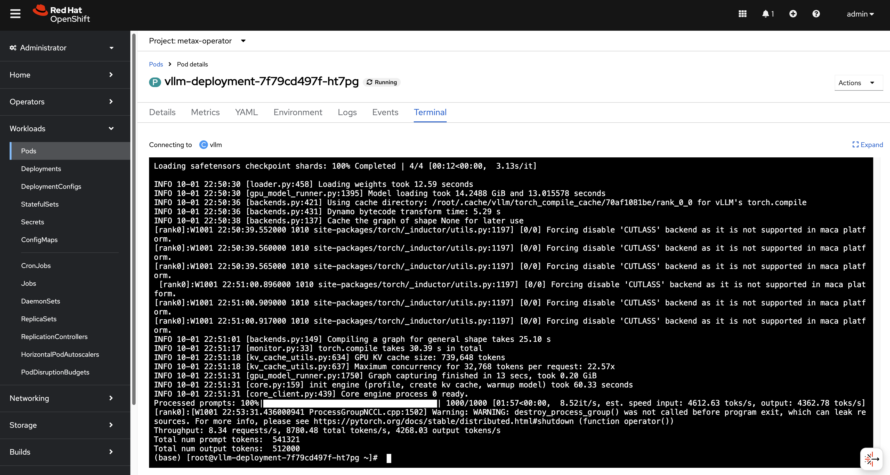
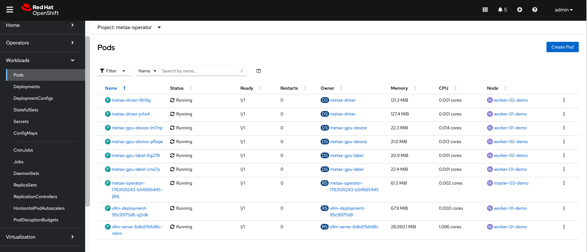
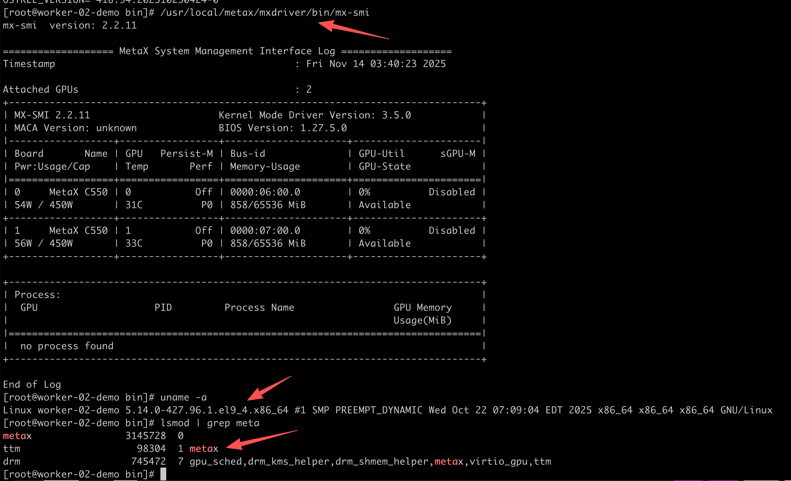

# Onboarding Metax GPU on OpenShift 4.18

## Introduction

This document provides a comprehensive guide for integrating Metax GPUs with an OpenShift Container Platform 4.18 cluster. Metax, a GPU vendor similar to NVIDIA, offers hardware that performs well on standard RHEL environments. However, enabling Metax GPUs on OpenShift requires specific configurations and a custom Red Hat Enterprise Linux CoreOS (RHCOS) image.

The primary objective is to build a custom RHCOS image that includes the necessary Metax drivers, deploy an OpenShift cluster using this image, and finally, install the Metax device plugin/operator to expose the GPU resources to containerized workloads. This guide covers the entire end-to-end process, from bare-metal helper node preparation to deploying a sample GPU-accelerated application.

---

## 1. DNS Configuration

A reliable DNS infrastructure is a critical prerequisite for any OpenShift installation. For this test environment, we will configure public DNS records. In a disconnected or air-gapped environment, you must provide your own internal DNS server to resolve these records.

**Public DNS Records:**
- `mirror.infra.wzhlab.top` -> `192.168.99.1` (Local Registry)
- `api.demo-01-rhsys.wzhlab.top` -> `192.168.99.21` (Cluster API)
- `api-int.demo-01-rhsys.wzhlab.top` -> `192.168.99.21` (Internal Cluster API)
- `*.apps.demo-01-rhsys.wzhlab.top` -> `192.168.99.22` (Wildcard for Applications)

---

## 2. Helper Node Preparation

We will utilize a bare-metal server as a "helper node." This server will host the necessary services (DNS, registry, etc.) and run the virtual machines (VMs) that will form the OpenShift cluster.

### 2.1. Kernel Boot Parameters for GPU Passthrough

To pass the physical GPU cards from the bare-metal host to the guest VMs, we need to enable IOMMU (Input-Output Memory Management Unit) in the host's kernel. This is achieved by modifying the GRUB boot parameters.

```bash
# This command enables Intel IOMMU and passthrough mode for all kernels
sudo grubby --update-kernel=ALL --args="intel_iommu=on iommu=pt"
```
*A reboot is required for these changes to take effect.*

### 2.2. Kernel Parameters for Overcommit and NAT

We need to adjust kernel parameters on the helper node to enable IP forwarding, which is essential for the NAT networking used by the VMs. Additionally, if the host has limited physical memory, configuring memory overcommit can provide more flexibility.

```bash
# Enable IP forwarding
cat << EOF >> /etc/sysctl.d/99-wzh-sysctl.conf
net.ipv4.ip_forward = 1
EOF

# Apply the new settings
sysctl --system 

# Verify the setting
sysctl -a | grep ip_forward
# net.ipv4.ip_forward = 1
# net.ipv4.ip_forward_update_priority = 1
# net.ipv4.ip_forward_use_pmtu = 0
```

### 2.3. LVM Configuration for VM Storage

To efficiently manage storage for our VMs, we will create an LVM (Logical Volume Manager) thin pool using the available NVMe disks. This allows for flexible and space-efficient provisioning of logical volumes, which will serve as the virtual disks for the VMs.

```bash
# --- Configurable Variables ---
VG_NAME="vgdata"
POOL_NAME="poolA"
STRIPE_SIZE_KB=256

# Discover all NVMe disks
ALL_NVME_DISKS=$(lsblk -d -n -o NAME,TYPE | grep "nvme" | grep "disk" | awk '{print "/dev/"$1}')
echo "Discovered NVMe disks: $ALL_NVME_DISKS"

PV_DEVICES=$ALL_NVME_DISKS
# Trim whitespace
PV_DEVICES=$(echo "$PV_DEVICES" | xargs)

NUM_DISKS=$(echo "$PV_DEVICES" | wc -w)
echo "Found $NUM_DISKS NVMe disks to be used: $PV_DEVICES"

echo -e "\n--- Creating Physical Volumes (PVs) and a Volume Group (VG) ---"
echo "Initializing PVs..."
sudo pvcreate -y $PV_DEVICES

echo "Creating Volume Group '$VG_NAME'..."
sudo vgcreate "$VG_NAME" $PV_DEVICES

echo "Creating LVM thin pool '$POOL_NAME'..."
sudo lvcreate --type thin-pool -i "$NUM_DISKS" -I "${STRIPE_SIZE_KB}k" -c "${STRIPE_SIZE_KB}k" -Zn -l 99%FREE -n "$POOL_NAME" "$VG_NAME"

echo "Extending the pool to use all available space..."
lvextend -l +100%FREE $VG_NAME/$POOL_NAME
```

### 2.4. KVM and Network Setup

Next, we will install KVM/libvirt packages and configure a virtual network bridge. This bridge will provide network connectivity for the OpenShift VMs and will be configured with NAT to allow outbound access.

```bash
# Install required tools and development packages
dnf -y install byobu htop jq ipmitool nmstate /usr/bin/htpasswd
dnf groupinstall -y "development" "Server with GUI"

# Install KVM and virtualization management tools
dnf -y install qemu-kvm libvirt libguestfs-tools virt-install virt-viewer virt-manager tigervnc-server

# Enable and start the libvirt daemon
systemctl enable --now libvirtd

# Prepare directory for KVM assets
mkdir -p /data/kvm
cd /data/kvm

# Define the virtual network bridge configuration
cat << EOF >  /data/kvm/virt-net.xml
<network>
  <name>br-ocp</name>
  <bridge name='br-ocp' stp='on' delay='0'/>
  <domain name='br-ocp'/>
  <ip address='192.168.99.1' netmask='255.255.255.0'>
  </ip>
  <ip address='192.168.77.1' netmask='255.255.255.0'>
  </ip>
  <ip address='192.168.88.1' netmask='255.255.255.0'>
  </ip>
</network>
EOF

# Create and start the virtual network
virsh net-define --file /data/kvm/virt-net.xml
virsh net-autostart br-ocp
virsh net-start br-ocp

# Verify the network status
virsh net-list --all
#  Name      State    Autostart   Persistent
# --------------------------------------------
#  br-ocp    active   yes         yes
#  default   active   yes         yes

# Configure services to start on boot
cat << EOF >> /etc/rc.d/rc.local
# Ensure the virtual network is started
virsh net-start br-ocp || true

# Start all defined VMs
virsh list --all --name | grep -v '^$' | xargs -I {} virsh start {} || true
EOF

chmod +x /etc/rc.d/rc.local
systemctl enable --now rc-local

# To disable autostart:
# chmod -x /etc/rc.d/rc.local
# systemctl disable --now rc-local
```

### 2.5. VNC Server Setup

To facilitate remote management and UI-based operations on the helper node, we will set up a VNC server.

```bash
# Install GUI and VNC server packages
dnf groupinstall -y "Server with GUI"
dnf -y install tigervnc-server

# Disable the firewall for simplicity in a lab environment
systemctl disable --now firewalld.service

# Set a VNC password for the root user
mkdir -p ~/.vnc/
echo "redhat" | vncpasswd -f > ~/.vnc/passwd
chmod 600 ~/.vnc/passwd

# Configure the VNC session
cat << EOF > ~/.vnc/config
session=gnome
securitytypes=vncauth,tlsvnc
geometry=1440x855
alwaysshared
EOF

# Map a display port to the root user
cat << EOF >> /etc/tigervnc/vncserver.users
:2=root
EOF

# Enable and start the VNC server service
systemctl enable --now vncserver@:2
# To manage the service:
# systemctl start vncserver@:2
# systemctl stop vncserver@:2
```

### 2.6. Certificate Generation for Local Registry

We will set up an internal container registry to cache images for the disconnected OpenShift installation. Before deploying the registry, we must generate self-signed TLS certificates to secure communication.

```bash
mkdir -p /etc/crts/ && cd /etc/crts

# Generate a self-signed Certificate Authority (CA)
# Reference: https://access.redhat.com/documentation/en-us/red_hat_codeready_workspaces/2.1/html/installation_guide/installing-codeready-workspaces-in-tls-mode-with-self-signed-certificates_crw
openssl genrsa -out /etc/crts/wzhlab.top.ca.key 4096

openssl req -x509 \
  -new -nodes \
  -key /etc/crts/wzhlab.top.ca.key \
  -sha256 \
  -days 36500 \
  -out /etc/crts/wzhlab.top.ca.crt \
  -subj /CN="Local wzh lab Signer" \
  -reqexts SAN \
  -extensions SAN \
  -config <(cat /etc/pki/tls/openssl.cnf \
      <(printf '[SAN]\nbasicConstraints=critical, CA:TRUE\nkeyUsage=keyCertSign, cRLSign, digitalSignature'))

# Generate a server key and CSR for the registry
openssl genrsa -out /etc/crts/wzhlab.top.key 2048

openssl req -new -sha256 \
    -key /etc/crts/wzhlab.top.key \
    -subj "/O=Local wzh lab /CN=*.infra.wzhlab.top" \
    -reqexts SAN \
    -config <(cat /etc/pki/tls/openssl.cnf \
        <(printf "\n[SAN]\nsubjectAltName=DNS:*.infra.wzhlab.top,DNS:*.wzhlab.top\nbasicConstraints=critical, CA:FALSE\nkeyUsage=digitalSignature, keyEncipherment, keyAgreement, dataEncipherment\nextendedKeyUsage=serverAuth")) \
    -out /etc/crts/wzhlab.top.csr

# Sign the server certificate with our CA
openssl x509 \
    -req \
    -sha256 \
    -extfile <(printf "subjectAltName=DNS:*.infra.wzhlab.top,DNS:*.wzhlab.top\nbasicConstraints=critical, CA:FALSE\nkeyUsage=digitalSignature, keyEncipherment, keyAgreement, dataEncipherment\nextendedKeyUsage=serverAuth") \
    -days 36500 \
    -in /etc/crts/wzhlab.top.csr \
    -CA /etc/crts/wzhlab.top.ca.crt \
    -CAkey /etc/crts/wzhlab.top.ca.key \
    -CAcreateserial -out /etc/crts/wzhlab.top.crt

# Verify the certificate
openssl x509 -in /etc/crts/wzhlab.top.crt -text

# Add the CA certificate to the system's trust store
/bin/cp -f /etc/crts/wzhlab.top.ca.crt /etc/pki/ca-trust/source/anchors/
update-ca-trust extract
```

### 2.7. Deploying the Mirror Registry (Quay)

With the TLS certificates in place, we can now deploy the mirror registry. We will use the `mirror-registry` tool provided by Red Hat, which deploys a simplified instance of Quay.

```bash
# Reference: https://docs.openshift.com/container-platform/4.10/installing/disconnected_install/installing-mirroring-creating-registry.html

mkdir -p /data/quay 
# Navigate to the directory where you downloaded the tool
# tar zvxf mirror-registry-amd64.tar.gz -C /data/quay

cd /data/quay
# Install the registry, providing the hostname and SSL certificates
./mirror-registry install -v \
-k ~/.ssh/id_ed25519 \
--initPassword redhat.. --initUser admin \
--quayHostname mirror.infra.wzhlab.top --quayRoot /data/quay \
--targetHostname mirror.infra.wzhlab.top \
--sslKey /etc/crts/wzhlab.top.key --sslCert /etc/crts/wzhlab.top.crt

# Expected output on success:
# PLAY RECAP **********************************************************************************************************************************************************************************
# root@mirror.infra.wzhlab.top : ok=46   changed=23   unreachable=0    failed=0    skipped=18   rescued=0    ignored=0
# INFO[2025-09-28 21:07:25] Quay installed successfully, config data is stored in /data/quay
# INFO[2025-09-28 21:07:25] Quay is available at https://mirror.infra.wzhlab.top:8443 with credentials (admin, redhat..)

# To uninstall the registry:
# cd /data/quay
# ./mirror-registry uninstall -v \
# -k ~/.ssh/id_ed25519 \
# --autoApprove true --quayRoot /data/quay \
# --targetHostname mirror.infra.wzhlab.top
```

---

## 3. OpenShift Cluster Installation

With the helper node fully configured, we can proceed with the OpenShift installation.

### 3.1. Initial Setup and Tooling

First, we'll create a dedicated user for the installation process and download the required OpenShift client binaries.

```bash
# Create a dedicated user for the installation
useradd -m sno
su - sno

# Configure passwordless SSH for convenience
ssh-keygen -t ed25519 -f ~/.ssh/id_ed25519 -N "" -q
cat << EOF > ~/.ssh/config
StrictHostKeyChecking no
UserKnownHostsFile=/dev/null
EOF
chmod 600 ~/.ssh/config

# Set environment variables for the installation
cat << 'EOF' >> ~/.bashrc
export BASE_DIR='/home/sno'
export BUILDNUMBER=4.18.27
# export BUILDNUMBER=4.19.17
EOF
source ~/.bashrc

# Set the specific OpenShift version for this installation
# export BUILDNUMBER=4.18.24

# Create directories for installation files
mkdir -p ${BASE_DIR}/data/ocp-${BUILDNUMBER}
mkdir -p $HOME/.local/bin

cd ${BASE_DIR}/data/ocp-${BUILDNUMBER}

# Download OpenShift client, installer, and mirror tools
wget -O openshift-client-linux-${BUILDNUMBER}.tar.gz https://mirror.openshift.com/pub/openshift-v4/x86_64/clients/ocp/${BUILDNUMBER}/openshift-client-linux-${BUILDNUMBER}.tar.gz
wget -O openshift-install-linux-${BUILDNUMBER}.tar.gz https://mirror.openshift.com/pub/openshift-v4/x86_64/clients/ocp/${BUILDNUMBER}/openshift-install-linux-${BUILDNUMBER}.tar.gz
wget -O oc-mirror.tar.gz https://mirror.openshift.com/pub/openshift-v4/x86_64/clients/ocp/${BUILDNUMBER}/oc-mirror.tar.gz

# Extract and install the binaries
tar -xzf openshift-client-linux-${BUILDNUMBER}.tar.gz -C $HOME/.local/bin/
tar -xzf openshift-install-linux-${BUILDNUMBER}.tar.gz -C $HOME/.local/bin/
tar -xzf oc-mirror.tar.gz -C $HOME/.local/bin/
chmod +x $HOME/.local/bin/oc-mirror

# Download butane and coreos-installer
wget  -nd -np -e robots=off --reject="index.html*" -P ./ --recursive -A "butane-amd64" https://mirror.openshift.com/pub/openshift-v4/x86_64/clients/butane/latest/
wget  -nd -np -e robots=off --reject="index.html*" -P ./ -r -A "coreos-installer_amd64" https://mirror.openshift.com/pub/openshift-v4/x86_64/clients/coreos-installer/latest/
install -m 755 ./butane-amd64 $HOME/.local/bin/butane
install -m 755 ./coreos-installer_amd64 $HOME/.local/bin/coreos-installer

# Download mirror-registry tool
wget -O mirror-registry-amd64.tar.gz https://mirror.openshift.com/pub/cgw/mirror-registry/latest/mirror-registry-amd64.tar.gz

# Download Helm client
wget -O helm-linux-amd64.tar.gz https://developers.redhat.com/content-gateway/file/pub/openshift-v4/clients/helm/3.17.1/helm-linux-amd64.tar.gz
tar xzf helm-linux-amd64.tar.gz -C $HOME/.local/bin/
mv ~/.local/bin/helm-linux-amd64 ~/.local/bin/helm
```

### 3.2. Mirroring Container Images

Before starting the installation, we must mirror all required OpenShift container images to our local Quay registry. This is a crucial step for a disconnected installation.

```bash
# Reference: https://github.com/openshift/oc-mirror

mkdir -p ${BASE_DIR}/data/mirror/

# Define the ImageSetConfiguration for oc-mirror
# This specifies the OpenShift version, operators, and any additional images to mirror.
tee ${BASE_DIR}/data/mirror/mirror.yaml << EOF
apiVersion: mirror.openshift.io/v1alpha2
kind: ImageSetConfiguration
mirror:
  platform:
    architectures:
      - amd64
    channels:
      - name: stable-4.18
        type: ocp
        minVersion: 4.18.27
        maxVersion: 4.18.27
        shortestPath: true
    graph: false
  # operators:
  #   - catalog: registry.redhat.io/redhat/redhat-operator-index:v4.18
  #     packages:
  #      - name: nfd
  #      - name: kubevirt-hyperconverged
  # additionalImages:
    # This is the custom RHCOS image we will build later
    # - name: quay.io/wangzheng422/ocp:418.94.202509301252-metax-0-x86_64
    # - name: quay.io/wangzheng422/ocp:418.94.202509301252-metax-0-x86_64-sdk-v01
EOF

cd ${BASE_DIR}/data/mirror/

INSTALL_IMAGE_REGISTRY=mirror.infra.wzhlab.top:8443

# Log in to the local registry
podman login $INSTALL_IMAGE_REGISTRY -u admin -p redhat..

# Run oc-mirror to start the mirroring process
# Note: This will take a significant amount of time and disk space.
oc-mirror --v2 --config ${BASE_DIR}/data/mirror/mirror.yaml --authfile ${BASE_DIR}/data/pull-secret.json --workspace file://${BASE_DIR}/data/mirror/  docker://$INSTALL_IMAGE_REGISTRY

# After mirroring, oc-mirror generates several YAML files in the working-dir/cluster-resources directory.
# These files must be applied to the cluster post-installation to configure it to use the local registry.
```

### 3.3. Configuring and Launching the OpenShift Installation

Now we create the configuration files (`install-config.yaml`, `agent-config.yaml`) that define our cluster topology and then generate the agent-based installation ISO.

```bash
# export BUILDNUMBER=4.18.24
mkdir -p ${BASE_DIR}/data/{sno/disconnected,install}

# Define cluster network and node parameters
INSTALL_IMAGE_REGISTRY=mirror.infra.wzhlab.top:8443
PULL_SECRET=$(cat ${BASE_DIR}/data/pull-secret.json)

# Create a file with default environment variables for the cluster nodes
cat << 'EOF' > ${BASE_DIR}/data/ocp-default.env
CIDR_PREFIX=192.168.99
CIDR_PREFIX_02=192.168.77
NTP_SERVER=time.nju.edu.cn
HELP_SERVER=$CIDR_PREFIX.11
API_VIP=$CIDR_PREFIX.21
INGRESS_VIP=$CIDR_PREFIX.22
MACHINE_NETWORK="$CIDR_PREFIX.0/24"

SNO_CLUSTER_NAME=demo-01-rhsys
SNO_BASE_DOMAIN=wzhlab.top

MASTER_01_IP=$CIDR_PREFIX.23
MASTER_02_IP=$CIDR_PREFIX.24
MASTER_03_IP=$CIDR_PREFIX.25
WORKER_01_IP=$CIDR_PREFIX.26
WORKER_02_IP=$CIDR_PREFIX.27

MASTER_01_IP_02=$CIDR_PREFIX_02.23
MASTER_02_IP_02=$CIDR_PREFIX_02.24
MASTER_03_IP_02=$CIDR_PREFIX_02.25
WORKER_01_IP_02=$CIDR_PREFIX_02.26
WORKER_02_IP_02=$CIDR_PREFIX_02.27

MASTER_01_HOSTNAME=master-01-demo
MASTER_02_HOSTNAME=master-02-demo
MASTER_03_HOSTNAME=master-03-demo
WORKER_01_HOSTNAME=worker-01-demo
WORKER_02_HOSTNAME=worker-02-demo

MASTER_01_INTERFACE=enp1s0
MASTER_02_INTERFACE=enp1s0
MASTER_03_INTERFACE=enp1s0
WORKER_01_INTERFACE=enp1s0
WORKER_02_INTERFACE=enp1s0

MASTER_01_INTERFACE_02=enp2s0
MASTER_02_INTERFACE_02=enp2s0
MASTER_03_INTERFACE_02=enp2s0
WORKER_01_INTERFACE_02=enp2s0
WORKER_02_INTERFACE_02=enp2s0

MASTER_01_INTERFACE_MAC=00:50:56:8e:2a:31
MASTER_02_INTERFACE_MAC=00:50:56:8e:2a:32
MASTER_03_INTERFACE_MAC=00:50:56:8e:2a:33
WORKER_01_INTERFACE_MAC=00:50:56:8e:2a:51
WORKER_02_INTERFACE_MAC=00:50:56:8e:2a:52

MASTER_01_INTERFACE_02_MAC=00:50:56:8e:2b:31
MASTER_02_INTERFACE_02_MAC=00:50:56:8e:2b:32
MASTER_03_INTERFACE_02_MAC=00:50:56:8e:2b:33
WORKER_01_INTERFACE_02_MAC=00:50:56:8e:2b:51
WORKER_02_INTERFACE_02_MAC=00:50:56:8e:2b:52

MASTER_01_DISK=/dev/vda
MASTER_02_DISK=/dev/vda
MASTER_03_DISK=/dev/vda
WORKER_01_DISK=/dev/vda
WORKER_02_DISK=/dev/vda

OCP_GW=$CIDR_PREFIX.1
OCP_NETMASK=255.255.255.0
OCP_NETMASK_S=24
OCP_DNS=223.5.5.5

OCP_GW_v6=fd03::11
OCP_NETMASK_v6=64
EOF

source ${BASE_DIR}/data/ocp-default.env

mkdir -p ${BASE_DIR}/data/install
cd ${BASE_DIR}/data/install

# Clean up previous installation attempts
/bin/rm -rf *.ign .openshift_install_state.json auth bootstrap manifests master*[0-9] worker*[0-9] *

# Create the main install-config.yaml
cat << EOF > ${BASE_DIR}/data/install/install-config.yaml 
apiVersion: v1
baseDomain: $SNO_BASE_DOMAIN
compute:
- name: worker
  replicas: 2
controlPlane:
  name: master
  replicas: 3
metadata:
  name: $SNO_CLUSTER_NAME
networking:
  networkType: OVNKubernetes 
  clusterNetwork:
    - cidr: 10.132.0.0/14 
      hostPrefix: 23
  machineNetwork:
    - cidr: $MACHINE_NETWORK
  serviceNetwork:
    - 172.22.0.0/16
platform:
  baremetal:
    apiVIPs:
    - $API_VIP
    ingressVIPs:
    - $INGRESS_VIP
pullSecret: '${PULL_SECRET}'
sshKey: |
$( cat ${BASE_DIR}/.ssh/id_ed25519.pub | sed 's/^/   /g' )
additionalTrustBundle: |
$( cat /etc/crts/wzhlab.top.ca.crt | sed 's/^/   /g' )
ImageDigestSources:
- mirrors:
  - ${INSTALL_IMAGE_REGISTRY}/openshift/release-images
  source: quay.io/openshift-release-dev/ocp-release
- mirrors:
  - ${INSTALL_IMAGE_REGISTRY}/openshift/release
  source: quay.io/openshift-release-dev/ocp-v4.0-art-dev
EOF

# Create the agent-config.yaml for static IP configuration
cat << EOF > ${BASE_DIR}/data/install/agent-config.yaml
apiVersion: v1alpha1
kind: AgentConfig
metadata:
  name: $SNO_CLUSTER_NAME
rendezvousIP: $MASTER_01_IP
additionalNTPSources:
- $NTP_SERVER
hosts:
  - hostname: $MASTER_01_HOSTNAME
    role: master
    rootDeviceHints:
      deviceName: "$MASTER_01_DISK"
    interfaces:
      - name: $MASTER_01_INTERFACE
        macAddress: $MASTER_01_INTERFACE_MAC
      - name: $MASTER_01_INTERFACE_02
        macAddress: $MASTER_01_INTERFACE_02_MAC
    networkConfig:
      interfaces:
        - name: $MASTER_01_INTERFACE
          type: ethernet
          state: up
          mac-address: $MASTER_01_INTERFACE_MAC
          ipv4:
            enabled: true
            address:
              - ip: $MASTER_01_IP
                prefix-length: $OCP_NETMASK_S
            dhcp: false
        - name: $MASTER_01_INTERFACE_02
          type: ethernet
          state: up
          mac-address: $MASTER_01_INTERFACE_02_MAC
          ipv4:
            enabled: true
            address:
              - ip: $MASTER_01_IP_02
                prefix-length: $OCP_NETMASK_S
            dhcp: false
      dns-resolver:
        config:
          server:
            - $OCP_DNS
      routes:
        config:
          - destination: 0.0.0.0/0
            next-hop-address: $OCP_GW
            next-hop-interface: $MASTER_01_INTERFACE
            table-id: 254
  - hostname: $MASTER_02_HOSTNAME
    role: master
    rootDeviceHints:
      deviceName: "$MASTER_02_DISK"
    interfaces:
      - name: $MASTER_02_INTERFACE
        macAddress: $MASTER_02_INTERFACE_MAC
      - name: $MASTER_02_INTERFACE_02
        macAddress: $MASTER_02_INTERFACE_02_MAC
    networkConfig:
      interfaces:
        - name: $MASTER_02_INTERFACE
          type: ethernet
          state: up
          mac-address: $MASTER_02_INTERFACE_MAC
          ipv4:
            enabled: true
            address:
              - ip: $MASTER_02_IP
                prefix-length: $OCP_NETMASK_S
            dhcp: false
        - name: $MASTER_02_INTERFACE_02
          type: ethernet
          state: up
          mac-address: $MASTER_02_INTERFACE_02_MAC
          ipv4:
            enabled: true
            address:
              - ip: $MASTER_02_IP_02
                prefix-length: $OCP_NETMASK_S
            dhcp: false
      dns-resolver:
        config:
          server:
            - $OCP_DNS
      routes:
        config:
          - destination: 0.0.0.0/0
            next-hop-address: $OCP_GW
            next-hop-interface: $MASTER_02_INTERFACE
            table-id: 254
  - hostname: $MASTER_03_HOSTNAME
    role: master
    rootDeviceHints:
      deviceName: "$MASTER_03_DISK"
    interfaces:
      - name: $MASTER_03_INTERFACE
        macAddress: $MASTER_03_INTERFACE_MAC
      - name: $MASTER_03_INTERFACE_02
        macAddress: $MASTER_03_INTERFACE_02_MAC
    networkConfig:
      interfaces:
        - name: $MASTER_03_INTERFACE
          type: ethernet
          state: up
          mac-address: $MASTER_03_INTERFACE_MAC
          ipv4:
            enabled: true
            address:
              - ip: $MASTER_03_IP
                prefix-length: $OCP_NETMASK_S
            dhcp: false
        - name: $MASTER_03_INTERFACE_02
          type: ethernet
          state: up
          mac-address: $MASTER_03_INTERFACE_02_MAC
          ipv4:
            enabled: true
            address:
              - ip: $MASTER_03_IP_02
                prefix-length: $OCP_NETMASK_S
            dhcp: false
      dns-resolver:
        config:
          server:
            - $OCP_DNS
      routes:
        config:
          - destination: 0.0.0.0/0
            next-hop-address: $OCP_GW
            next-hop-interface: $MASTER_03_INTERFACE
            table-id: 254
  - hostname: $WORKER_01_HOSTNAME
    role: worker
    rootDeviceHints:
      deviceName: "$WORKER_01_DISK"
    interfaces:
      - name: $WORKER_01_INTERFACE
        macAddress: $WORKER_01_INTERFACE_MAC
      - name: $WORKER_01_INTERFACE_02
        macAddress: $WORKER_01_INTERFACE_02_MAC
    networkConfig:
      interfaces:
        - name: $WORKER_01_INTERFACE
          type: ethernet
          state: up
          mac-address: $WORKER_01_INTERFACE_MAC
          ipv4:
            enabled: true
            address:
              - ip: $WORKER_01_IP
                prefix-length: $OCP_NETMASK_S
            dhcp: false
        - name: $WORKER_01_INTERFACE_02
          type: ethernet
          state: up
          mac-address: $WORKER_01_INTERFACE_02_MAC
          ipv4:
            enabled: true
            address:
              - ip: $WORKER_01_IP_02
                prefix-length: $OCP_NETMASK_S
            dhcp: false
      dns-resolver:
        config:
          server:
            - $OCP_DNS
      routes:
        config:
          - destination: 0.0.0.0/0
            next-hop-address: $OCP_GW
            next-hop-interface: $WORKER_01_INTERFACE
            table-id: 254
  - hostname: $WORKER_02_HOSTNAME
    role: worker
    rootDeviceHints:
      deviceName: "$WORKER_02_DISK"
    interfaces:
      - name: $WORKER_02_INTERFACE
        macAddress: $WORKER_02_INTERFACE_MAC
      - name: $WORKER_02_INTERFACE_02
        macAddress: $WORKER_02_INTERFACE_02_MAC
    networkConfig:
      interfaces:
        - name: $WORKER_02_INTERFACE
          type: ethernet
          state: up
          mac-address: $WORKER_02_INTERFACE_MAC
          ipv4:
            enabled: true
            address:
              - ip: $WORKER_02_IP
                prefix-length: $OCP_NETMASK_S
            dhcp: false
        - name: $WORKER_02_INTERFACE_02
          type: ethernet
          state: up
          mac-address: $WORKER_02_INTERFACE_02_MAC
          ipv4:
            enabled: true
            address:
              - ip: $WORKER_02_IP_02
                prefix-length: $OCP_NETMASK_S
            dhcp: false
      dns-resolver:
        config:
          server:
            - $OCP_DNS
      routes:
        config:
          - destination: 0.0.0.0/0
            next-hop-address: $OCP_GW
            next-hop-interface: $WORKER_02_INTERFACE
            table-id: 254
EOF

/bin/cp -f ${BASE_DIR}/data/install/install-config.yaml ${BASE_DIR}/data/install/install-config.yaml.bak

# Generate the cluster manifests from the config files
openshift-install --dir=${BASE_DIR}/data/install agent create cluster-manifests

cd ${BASE_DIR}/data/install/

# Create the agent installation ISO
# The installer will automatically cache downloaded files in ~/.cache/agent/
mkdir -p ${HOME}/.cache/agent/{files_cache,image_cache}
openshift-install --dir=${BASE_DIR}/data/install agent create image --log-level=debug
```

### 3.4. Provisioning VMs for OpenShift Installation

With the installation ISO created, we can now define and launch the KVM virtual machines. These VMs will boot from the ISO, which will trigger the automated, unattended installation of OpenShift.

```bash
# Verify the host CPU model for KVM configuration
virsh capabilities | grep model
#  <model>Icelake-Server-v2</model>

# (Optional) Clean up any existing logical volumes from previous attempts
# lv_list=$(lvdisplay -c | cut -d: -f1 | grep '.*/lv')
# for lv in $lv_list; do
#   echo "Deleting $lv..."
#   lvremove -f $lv
# done

# Identify PCI addresses of the Metax GPU devices for passthrough
lspci -nn | grep -i 9999
# 0f:00.0 Display controller [0380]: Device [9999:4000] (rev 01)
# ...
virsh nodedev-list --cap pci
# pci_0000_0f_00_0

# Copy the generated ISO to the KVM directory
/bin/cp -f /home/sno/data/install/agent.x86_64.iso /data/kvm/

# LV creation helper function
create_lv() {
    var_vg=$1
    var_pool=$2
    var_lv=$3
    var_size=$4
    var_action=$5
    lvremove -f $var_vg/$var_lv || true
    if [ "$var_action" == "recreate" ]; then
      lvcreate --type thin -n $var_lv -V $var_size --thinpool $var_vg/$var_pool
      wipefs --all --force /dev/$var_vg/$var_lv
    fi
}

# Source the cluster environment variables
source /home/sno/data/ocp-default.env

SNO_CPU=host-model

# --- Provision Master Node 1 ---
SNO_CPU_CORE=8
SNO_MEM=32
virsh destroy demo-01-master-01
virsh undefine demo-01-master-01
create_lv vgdata poolA lv-demo-01-master-01 120G recreate
virt-install --name=demo-01-master-01 --vcpus=$SNO_CPU_CORE --ram=$(($SNO_MEM*1024)) \
--cpu=$SNO_CPU \
--disk path=/dev/vgdata/lv-demo-01-master-01,device=disk,bus=virtio,format=raw,discard=unmap \
--os-variant rhel9.6 \
--network bridge=br-ocp,model=virtio,mac=$MASTER_01_INTERFACE_MAC \
--network bridge=br-ocp,model=virtio,mac=$MASTER_01_INTERFACE_02_MAC \
--graphics vnc,listen=127.0.0.1,port=59001 --noautoconsole \
--boot menu=on --cdrom /data/kvm/agent.x86_64.iso

# --- Provision Master Node 2 ---
SNO_CPU_CORE=8
SNO_MEM=32
virsh destroy demo-01-master-02
virsh undefine demo-01-master-02
create_lv vgdata poolA lv-demo-01-master-02 120G recreate
virt-install --name=demo-01-master-02 --vcpus=$SNO_CPU_CORE --ram=$(($SNO_MEM*1024)) \
--cpu=$SNO_CPU \
--disk path=/dev/vgdata/lv-demo-01-master-02,device=disk,bus=virtio,format=raw,discard=unmap \
--os-variant rhel9.6 \
--network bridge=br-ocp,model=virtio,mac=$MASTER_02_INTERFACE_MAC \
--network bridge=br-ocp,model=virtio,mac=$MASTER_02_INTERFACE_02_MAC \
--graphics vnc,listen=127.0.0.1,port=59002 --noautoconsole \
--boot menu=on --cdrom /data/kvm/agent.x86_64.iso

# --- Provision Master Node 3 ---
SNO_CPU_CORE=8
SNO_MEM=32
virsh destroy demo-01-master-03
virsh undefine demo-01-master-03
create_lv vgdata poolA lv-demo-01-master-03 120G recreate
virt-install --name=demo-01-master-03 --vcpus=$SNO_CPU_CORE --ram=$(($SNO_MEM*1024)) \
--cpu=$SNO_CPU \
--disk path=/dev/vgdata/lv-demo-01-master-03,device=disk,bus=virtio,format=raw,discard=unmap \
--os-variant rhel9.6 \
--network bridge=br-ocp,model=virtio,mac=$MASTER_03_INTERFACE_MAC \
--network bridge=br-ocp,model=virtio,mac=$MASTER_03_INTERFACE_02_MAC \
--graphics vnc,listen=127.0.0.1,port=59003 --noautoconsole \
--boot menu=on --cdrom /data/kvm/agent.x86_64.iso

# Detach GPUs from host before assigning to worker VMs
virsh nodedev-detach pci_0000_0f_00_0
virsh nodedev-detach pci_0000_34_00_0

# --- Provision Worker Node 1 (with GPU Passthrough) ---
SNO_CPU_CORE=50
SNO_MEM=450
virsh destroy demo-01-worker-01
virsh undefine demo-01-worker-01
create_lv vgdata poolA lv-demo-01-worker-01 1200G recreate
virt-install --name=demo-01-worker-01 --vcpus=$SNO_CPU_CORE --ram=$(($SNO_MEM*1024)) \
--cpu=$SNO_CPU \
--disk path=/dev/vgdata/lv-demo-01-worker-01,device=disk,bus=virtio,format=raw,discard=unmap \
--os-variant rhel9.6 \
--network bridge=br-ocp,model=virtio,mac=$WORKER_01_INTERFACE_MAC \
--network bridge=br-ocp,model=virtio,mac=$WORKER_01_INTERFACE_02_MAC \
--host-device pci_0000_0f_00_0 \
--host-device pci_0000_34_00_0 \
--graphics vnc,listen=127.0.0.1,port=59004 --noautoconsole \
--boot menu=on --cdrom /data/kvm/agent.x86_64.iso

# Detach GPUs from host before assigning to worker VMs
virsh nodedev-detach pci_0000_87_00_0
virsh nodedev-detach pci_0000_ae_00_0

# --- Provision Worker Node 2 (with GPU Passthrough) ---
SNO_CPU_CORE=50
SNO_MEM=450
virsh destroy demo-01-worker-02
virsh undefine demo-01-worker-02
create_lv vgdata poolA lv-demo-01-worker-02 1200G recreate
virt-install --name=demo-01-worker-02 --vcpus=$SNO_CPU_CORE --ram=$(($SNO_MEM*1024)) \
--cpu=$SNO_CPU \
--disk path=/dev/vgdata/lv-demo-01-worker-02,device=disk,bus=virtio,format=raw,discard=unmap \
--os-variant rhel9.6 \
--network bridge=br-ocp,model=virtio,mac=$WORKER_02_INTERFACE_MAC \
--network bridge=br-ocp,model=virtio,mac=$WORKER_02_INTERFACE_02_MAC \
--host-device pci_0000_87_00_0 \
--host-device pci_0000_ae_00_0 \
--graphics vnc,listen=127.0.0.1,port=59005 --noautoconsole \
--boot menu=on --cdrom /data/kvm/agent.x86_64.iso
```

### 3.5. Monitoring the Installation Progress

During the installation, the VMs may shut down instead of rebooting. A simple monitoring loop can ensure they are restarted promptly.

```bash
# This loop checks for shutdown VMs and starts them every 10 seconds.
while true; do virsh list --state-shutoff --name | xargs -r -I {} virsh start {}; sleep 10; done
```

You can monitor the installation progress from the helper node using the `openshift-install` command.

```bash
# Set the KUBECONFIG environment variable
cd ${BASE_DIR}/data/install
export KUBECONFIG=${BASE_DIR}/data/install/auth/kubeconfig
echo "export KUBECONFIG=${BASE_DIR}/data/install/auth/kubeconfig" >> ~/.bashrc

# Wait for the bootstrap process to complete
cd ${BASE_DIR}/data/install
openshift-install --dir=${BASE_DIR}/data/install agent wait-for bootstrap-complete --log-level=debug
# Expected output:
# INFO Bootstrap Kube API Initialized
# INFO Bootstrap configMap status is complete
# INFO cluster bootstrap is complete

# Wait for the final installation to complete
cd ${BASE_DIR}/data/install
openshift-install --dir=${BASE_DIR}/data/install agent wait-for install-complete --log-level=debug
# Expected output:
# INFO Cluster is installed
# INFO Install complete!
# INFO To access the cluster as the system:admin user when using 'oc', run
# INFO     export KUBECONFIG=/home/lab-user/data/install/auth/kubeconfig
# INFO Access the OpenShift web-console here: https://console-openshift-console.apps.demo-rhsys.wzhlab.top
# INFO Login to the console with user: "kubeadmin", and password: "..."
```

---

## 4. Post-Installation Configuration

### 4.1. Node Access Configuration (Optional)

For development and debugging purposes, it can be useful to enable password-based root login on the cluster nodes. **This is not recommended for production environments.**

```bash
# On the helper node, as the 'sno' user
# Create a script to enable root login and set password
cat > ${BASE_DIR}/data/install/crack.txt << 'EOF'
echo redhat | sudo passwd --stdin root
sudo sh -c 'echo "PasswordAuthentication yes" > /etc/ssh/sshd_config.d/20-wzh.conf '
sudo sh -c 'echo "PermitRootLogin yes" >> /etc/ssh/sshd_config.d/20-wzh.conf '
sudo sh -c 'echo "ClientAliveInterval 1800" >> /etc/ssh/sshd_config.d/20-wzh.conf '
sudo systemctl restart sshd
sudo sh -c 'echo "export KUBECONFIG=/etc/kubernetes/static-pod-resources/kube-apiserver-certs/secrets/node-kubeconfigs/localhost.kubeconfig" >> /root/.bashrc'
sudo sh -c 'echo "RET=\`oc config use-context system:admin\`" >> /root/.bashrc'
EOF

# Apply the script to all master nodes
for i in 23 24 25
do
  ssh core@192.168.99.$i < ${BASE_DIR}/data/install/crack.txt
done

# Create a similar script for worker nodes (without kubeconfig setup)
cat > ${BASE_DIR}/data/install/crack.worker.txt << 'EOF'
echo redhat | sudo passwd --stdin root
sudo sh -c 'echo "PasswordAuthentication yes" > /etc/ssh/sshd_config.d/20-wzh.conf '
sudo sh -c 'echo "PermitRootLogin yes" >> /etc/ssh/sshd_config.d/20-wzh.conf '
sudo sh -c 'echo "ClientAliveInterval 1800" >> /etc/ssh/sshd_config.d/20-wzh.conf '
sudo systemctl restart sshd
EOF

# Apply the script to all worker nodes
for i in 26 27
do
  ssh core@192.168.99.$i < ${BASE_DIR}/data/install/crack.worker.txt
done
```

### 4.2. Configuring HTPasswd Identity Provider

To provide a simple authentication mechanism, you can configure the HTPasswd identity provider. This allows you to create users with standard usernames and passwords.

- Reference: https://docs.openshift.com/container-platform/4.13/authentication/identity_providers/configuring-htpasswd-identity-provider.html

```bash
# Install htpasswd utility on the helper node
sudo dnf install -y /usr/bin/htpasswd

# Create an htpasswd file with an initial admin user
htpasswd -c -B -b ${BASE_DIR}/data/install/users.htpasswd admin redhat

# Add an additional user
htpasswd -B -b ${BASE_DIR}/data/install/users.htpasswd user01 redhat

# Create a secret in the cluster from the htpasswd file
oc create secret generic htpass-secret \
  --from-file=htpasswd=${BASE_DIR}/data/install/users.htpasswd \
  -n openshift-config 

# Patch the cluster OAuth configuration to use the HTPasswd provider
cat << EOF > ${BASE_DIR}/data/install/oauth.yaml
spec:
  identityProviders:
  - name: htpasswd
    mappingMethod: claim 
    type: HTPasswd
    htpasswd:
      fileData:
        name: htpass-secret
EOF
oc patch oauth/cluster --type merge --patch-file=${BASE_DIR}/data/install/oauth.yaml

# Grant cluster-admin privileges to the new admin user
oc adm policy add-cluster-role-to-user cluster-admin admin

# Grant admin role in a specific project to the new user
oc adm policy add-role-to-user admin user01 -n llm-demo
```

---

## 5. Building a Custom RHCOS Image with Metax Drivers

The standard RHCOS image does not contain the necessary drivers for Metax GPUs, and metax gpu driver depends on specific old kernel version. Therefore, we must build a custom image. This process involves setting up a build environment, preparing RPM repositories, and using the `coreos-assembler` (cosa) tool.

### 5.1. Setting Up a RHEL 9 Build Environment

First, provision a RHEL 9 VM that will serve as our build machine.

```bash
cd /data/kvm

# LV creation helper function
create_lv() {
    var_vg=$1
    var_pool=$2
    var_lv=$3
    var_size=$4
    var_action=$5
    lvremove -f $var_vg/$var_lv || true
    if [ "$var_action" == "recreate" ]; then
      lvcreate --type thin -n $var_lv -V $var_size --thinpool $var_pool
      wipefs --all --force /dev/$var_vg/$var_lv
    fi
}

SNO_MEM=64
virsh destroy demo-01-test
virsh undefine demo-01-test
create_lv vgdata poolA lv-demo-01-test 200G recreate

# Install RHEL 9 using a kickstart file
virt-install --name=demo-01-test --vcpus=32 --ram=$(($SNO_MEM*1024)) \
--cpu=host-model \
--disk path=/dev/vgdata/lv-demo-01-test,device=disk,bus=virtio,format=raw \
--os-variant rhel9.6 \
--network bridge=br-ocp,model=virtio \
--graphics vnc,listen=127.0.0.1,port=58001 --noautoconsole \
--boot menu=on --location /data/kvm/rhel94.iso \
--initrd-inject helper-ks-rhel9.cfg --extra-args "inst.ks=file:/helper-ks-rhel9.cfg" 

# Inside the RHEL 9 VM, lock the release to 9.4 to match OCP 4.18 dependencies
sudo subscription-manager release --set=9.4

# Enable the correct EUS repositories for RHEL 9.4
sudo subscription-manager repos --disable="rhel-9-for-x86_64-baseos-rpms" --disable="rhel-9-for-x86_64-appstream-rpms"
sudo subscription-manager repos --enable="rhel-9-for-x86_64-baseos-eus-rpms" --enable="rhel-9-for-x86_64-appstream-eus-rpms"
```

### 5.2. Preparing RPM Repositories

The RHCOS build process requires access to all necessary RPMs. We will sync the required repositories to the build machine and host them locally via a simple web server.

```bash
# On the RHEL 9 build VM
sudo dnf install -y createrepo_c

mkdir -p /data/dnf/
cd /data/dnf/

# Sync all required RHEL and OpenShift repositories
dnf reposync --repoid=rhel-9-for-x86_64-baseos-eus-rpms -m --download-metadata --delete -n
dnf reposync --repoid=rhel-9-for-x86_64-appstream-eus-rpms -m --download-metadata --delete -n
dnf reposync --repoid=rhel-9-for-x86_64-nfv-rpms -m --download-metadata --delete -n
dnf reposync --repoid=fast-datapath-for-rhel-9-x86_64-rpms -m --download-metadata --delete -n
dnf reposync --repoid=rhocp-4.18-for-rhel-9-x86_64-rpms -m --download-metadata --delete -n
dnf reposync --repoid=rhocp-ironic-4.18-for-rhel-9-x86_64-rpms -m --download-metadata --delete -n
dnf reposync --repoid=ocp-tools-4.18-for-rhel-9-x86_64-rpms -m --download-metadata --delete -n
dnf reposync --repoid=cnv-4.18-for-rhel-9-x86_64-rpms -m --download-metadata --delete -n

# Create a custom repository for kernel packages and Metax drivers
mkdir -p /data/dnf/wzh-fix-repo
cd /data/dnf/wzh-fix-repo

# Download the specific kernel version required by metax gpu and its dependencies
PACKAGES_TO_QUERY=(
    "kernel-core-5.14.0-427.13.1.el9_4"
    "kernel-devel-5.14.0-427.13.1.el9_4"
    "kernel-headers-5.14.0-427.13.1.el9_4"
    "kernel-modules-5.14.0-427.13.1.el9_4"
    "kernel-modules-extra-5.14.0-427.13.1.el9_4"
    "kernel-5.14.0-427.13.1.el9_4"
)
COMBINED_DEPS_FILE=$(mktemp)
for pkg in "${PACKAGES_TO_QUERY[@]}"; do
    dnf repoquery -q --requires --resolve --recursive --queryformat '%{name}-%{version}-%{release}.%{arch}' "$pkg" >> "$COMBINED_DEPS_FILE"
    echo "$pkg" >> "$COMBINED_DEPS_FILE"
done
sort -u "$COMBINED_DEPS_FILE" | xargs sudo dnf download --destdir=.
rm -f "$COMBINED_DEPS_FILE"

# Download and extract Metax driver RPMs
mkdir -p /data/build/metax.base/tmp.driver
cd /data/build/metax.base/tmp.driver
wget -O metax-driver-3.1.0.11-rpm-x86_64.run "https://metax-pub.oss-cn-shanghai.aliyuncs.com/mxmaca2.0/3.1.0.x/binary/x86_64/driver/metax-driver-3.1.0.11-rpm-x86_64.run"
bash metax-driver-3.1.0.11-rpm-x86_64.run --noexec --keep
# The mxgvm driver is not needed for this setup
/bin/rm -f ./metax-driver-3.1.0.11/mxgvm-3.0.11-1.x86_64.rpm
/bin/cp -f ./*.rpm /data/dnf/wzh-fix-repo/

# Create the repository index
cd /data/dnf/wzh-fix-repo/
createrepo_c ./

# Serve the repositories over HTTP
cd /data/dnf
python3 -m http.server
```

### 5.3. Building the RHCOS Image

With the repositories in place, we can now use `coreos-assembler` to build the custom image.

```bash
# On the RHEL 9 build VM
# Reference: https://github.com/wangzheng422/machine-os-content/tree/metax-ocp-4.18

# Set the container image for the build tool
export COREOS_ASSEMBLER_CONTAINER=quay.io/coreos-assembler/coreos-assembler:rhcos-4.18
podman pull $COREOS_ASSEMBLER_CONTAINER

mkdir -p /data/rhcos
cd /data/rhcos
rm -rf *

# Define the cosa helper function
cosa() {
   env | grep COREOS_ASSEMBLER
   local -r COREOS_ASSEMBLER_CONTAINER_LATEST="quay.io/coreos-assembler/coreos-assembler:latest"
   if [[ -z ${COREOS_ASSEMBLER_CONTAINER} ]] && $(podman image exists ${COREOS_ASSEMBLER_CONTAINER_LATEST}); then
       local -r cosa_build_date_str="$(podman inspect -f "{{.Created}}" ${COREOS_ASSEMBLER_CONTAINER_LATEST} | awk '{print $1}')"
       local -r cosa_build_date="$(date -d ${cosa_build_date_str} +%s)"
       if [[ $(date +%s) -ge $((cosa_build_date + 60*60*24*7)) ]] ; then
         echo -e "\e[0;33m----" >&2
         echo "The COSA container image is more that a week old and likely outdated." >&2
         echo "You should pull the latest version with:" >&2
         echo "podman pull ${COREOS_ASSEMBLER_CONTAINER_LATEST}" >&2
         echo -e "----\e[0m" >&2
         sleep 10
       fi
   fi
   set -x
   podman run --rm -ti --security-opt=label=disable --privileged                                    \
              --userns=keep-id:uid=1000,gid=1000                                                    \
              -v=${PWD}:/srv/ --device=/dev/kvm --device=/dev/fuse                                  \
              --tmpfs=/tmp -v=/var/tmp:/var/tmp --name=cosa                                         \
              ${COREOS_ASSEMBLER_CONFIG_GIT:+-v=$COREOS_ASSEMBLER_CONFIG_GIT:/srv/src/config/:ro}   \
              ${COREOS_ASSEMBLER_GIT:+-v=$COREOS_ASSEMBLER_GIT/src/:/usr/lib/coreos-assembler/:ro}  \
              ${COREOS_ASSEMBLER_ADD_CERTS:+-v=/etc/pki/ca-trust:/etc/pki/ca-trust:ro}              \
              ${COREOS_ASSEMBLER_CONTAINER_RUNTIME_ARGS}                                            \
              ${COREOS_ASSEMBLER_CONTAINER:-$COREOS_ASSEMBLER_CONTAINER_LATEST} "$@"
   rc=$?; set +x; return $rc
}

# Initialize the build environment from a forked machine-os-content repository
# This fork contains the necessary modifications to include the Metax drivers.
cosa init --branch metax-ocp-4.18 https://github.com/wangzheng422/machine-os-content --force

# Fetch all source RPMs
cosa fetch

# Build the RHCOS image. This will install the Metax driver RPMs into the image.
cosa build

# List the build artifacts
cosa list
# 418.94.202510070750-metax-0
#    Timestamp: 2025-10-07T07:57:37Z
#    Artifacts: ostree oci-manifest qemu

# Push the resulting container image to a registry
/bin/cp -f /run//user/0/containers/auth.json ./
chmod +r auth.json
cosa push-container --authfile ./auth.json "quay.io/wangzheng422/ocp"
# quay.io/wangzheng422/ocp:418.94.202509291625-metax-0-x86_64. -> the real based ok one
# quay.io/wangzheng422/ocp:418.94.202509300851-metax-0-x86_64 -> with driver
# quay.io/wangzheng422/ocp:418.94.202509301252-metax-0-x86_64 -> driver without mxgvm
# quay.io/wangzheng422/ocp:418.94.202509301252-metax-0-x86_64-sdk-v01 -> driver with sdk
# round 2
# quay.io/wangzheng422/ocp:418.94.202510070750-metax-0-x86_64 -> kernel downgrade only
```

---

## 6. Deploying and Using the Custom RHCOS Image

### 6.1. Applying the Custom Image to Worker Nodes

Once the custom RHCOS image is pushed to a registry accessible by the OpenShift cluster, we can apply a `MachineConfig` object to instruct the worker nodes to re-provision themselves using the new image.

```bash
# Create a MachineConfig to specify the custom osImageURL
tee $BASE_DIR/data/install/machine-config.yaml << 'EOF'
apiVersion: machineconfiguration.openshift.io/v1
kind: MachineConfig
metadata:
  labels:
    machineconfiguration.openshift.io/role: worker 
  name: os-layer-custom-worker
spec:
  config:
    ignition:
      version: 3.4.0
  # The osImageURL should point to the image we just built and pushed
  osImageURL: mirror.infra.wzhlab.top:8443/wangzheng422/ocp:418.94.202509301252-metax-0-x86_64-sdk-v01
EOF

# Apply the MachineConfig to the cluster
oc apply -f $BASE_DIR/data/install/machine-config.yaml

# oc delete -f $BASE_DIR/data/install/machine-config.yaml

# The Machine Config Operator (MCO) will now perform a rolling update of the worker nodes.
# You can monitor the progress with 'oc get mcp'
```

### 6.2. Verifying the Driver on a Node

After a worker node has been updated, you can SSH into it and verify that the Metax driver is functioning correctly using the `mx-smi` tool.

```bash
# On a worker node
mx-smi
```

The result should look like this:

```log
mx-smi  version: 2.2.8

=================== MetaX System Management Interface Log ===================
Timestamp                                         : Fri Oct 10 07:23:07 2025

Attached GPUs                                     : 2
+---------------------------------------------------------------------------------+
| MX-SMI 2.2.8                        Kernel Mode Driver Version: 3.0.11          |
| MACA Version: unknown               BIOS Version: 1.27.5.0                      |
|------------------------------------+---------------------+----------------------+
| GPU     NAME         Persistence-M | Bus-id              | GPU-Util      sGPU-M |
| Temp    Pwr:Usage/Cap         Perf | Memory-Usage        | GPU-State            |
|====================================+=====================+======================|
| 0       MetaX C550             Off | 0000:06:00.0        | 0%            Native |
| 31C     55W / 450W              P0 | 858/65536 MiB       | Available            |
+------------------------------------+---------------------+----------------------+
| 1       MetaX C550             Off | 0000:07:00.0        | 0%            Native |
| 33C     55W / 450W              P0 | 858/65536 MiB       | Available            |
+------------------------------------+---------------------+----------------------+

+---------------------------------------------------------------------------------+
| Process:                                                                        |
|  GPU                    PID         Process Name                 GPU Memory     |
|                                                                  Usage(MiB)     |
|=================================================================================|
|  no process found                                                               |
+---------------------------------------------------------------------------------+

End of Log
```

### 6.3. Layering the Metax SDK onto RHCOS (Optional)

As an alternative to including the SDK in every application container, you can layer it directly into the RHCOS image. This simplifies application containers but requires the GPU vendor to support the CRI-O container runtime.

```bash
# On the RHEL 9 build VM
mkdir -p /data/build/metax.base/tmp
cd /data/build/metax.base/tmp

# Download and extract the SDK RPMs
wget -O maca-sdk-3.1.0.14-rpm-x86_64.tar.xz "https://metax-pub.oss-cn-shanghai.aliyuncs.com/mxmaca2.0/3.1.0.x/binary/x86_64/sdk/maca-sdk-3.1.0.14-rpm-x86_64.tar.xz"
tar vxf maca-sdk-3.1.0.14-rpm-x86_64.tar.xz

cd /data/build/metax.base

# Create a Dockerfile to layer the SDK on top of our custom RHCOS image
tee dockerfile << EOF 
FROM quay.io/wangzheng422/ocp:418.94.202509301252-metax-0-x86_64

RUN --mount=type=bind,source=tmp/maca-sdk-3.1.0.14/rpm,target=/wzh/ \
    cd /wzh/ && \
    dnf install -y *.rpm && \
    dnf clean all
EOF

# Build and push the new SDK-enabled image
podman build --security-opt label=disable -t quay.io/wangzheng422/ocp:418.94.202509301252-metax-0-x86_64-sdk-v01 -f dockerfile .
podman push quay.io/wangzheng422/ocp:418.94.202509301252-metax-0-x86_64-sdk-v01
```

---

## 7. Deploying the Metax GPU Operator

With the nodes running the correct RHCOS image, the final step is to deploy the Metax GPU Operator. This operator will manage the device plugins, which expose the GPUs as a schedulable resource in Kubernetes.

```bash
# On the helper node
# Download the Metax Kubernetes package
wget -O metax-gpu-k8s-package.0.12.0.tar.gz "https://metax-pub.oss-cn-shanghai.aliyuncs.com/mxmaca2.0/2.33.1.x/binary/x86_64/cloud/metax-gpu-k8s-package.0.12.0.tar.gz"
tar zvxf metax-gpu-k8s-package.0.12.0.tar.gz

# Push the operator container images to our internal registry
podman login mirror.infra.wzhlab.top:8443 -u admin -p redhat..
./metax-k8s-images.0.12.0.run push mirror.infra.wzhlab.top:8443/metax

# Create an ImageTagMirrorSet to redirect image pulls from the public Metax registry to our internal one
tee $BASE_DIR/data/install/image-tag-mirror-metax.yaml << EOF
apiVersion: config.openshift.io/v1
kind: ImageTagMirrorSet
metadata:
  name: itms-generic-metax
spec:
  imageTagMirrors:
  - mirrors:
    - mirror.infra.wzhlab.top:8443/metax
    source: cr.metax-tech.com/cloud
  - mirrors:
    - mirror.infra.wzhlab.top:8443/public-library
    source: cr.metax-tech.com/public-library
  - mirrors:
    - mirror.infra.wzhlab.top:8443/public-ai-release/maca
    source: cr.metax-tech.com/public-ai-release/maca
  - mirrors:
    - mirror.infra.wzhlab.top:8443/public-cloud-release
    source: cr.metax-tech.com/public-cloud-release
EOF
oc apply -f $BASE_DIR/data/install/image-tag-mirror-metax.yaml

# Use a patched version of the Helm chart for OpenShift compatibility
git clone https://github.com/wangzheng422/metax-operator

# Install the operator using Helm
helm install ./metax-operator \
--create-namespace -n metax-operator \
--generate-name \
--wait \
--set registry=mirror.infra.wzhlab.top:8443/metax \
--set minimalMode=true

# Patch the daemonset to use the correct service account
oc patch daemonset metax-gpu-label -n metax-operator --type='merge' -p '{"spec":{"template":{"spec":{"serviceAccountName":"metax-operator"}}}}'

# To uninstall the operator:
# chart=$(helm list -q -f "metax" -n metax-operator)
# if [[ -n $chart ]]; then
#     helm uninstall $chart -n metax-operator --wait
# fi
```

---

## 8. Running GPU Workloads

### 8.1. Verifying GPU Access with a Demo Pod

Now that the operator is running, we can deploy a simple pod that requests a GPU resource to verify that the entire stack is working.

```yaml
# Save as gpu-demo.yaml
apiVersion: v1
kind: Pod
metadata:
  name: gpu-demo
spec:
  serviceAccountName: metax-operator
  containers:
  - name: vector-add
    image: cr.metax-tech.com/public-library/maca-native:3.1.0.3-centos9-amd64
    command: [
        "bash",
        "-c",
        "cp -r /opt/maca/samples/0_Introduction/vectorAdd ./;
        cd ./vectorAdd;
        mxcc -x maca vectorAdd.cpp -o vectorAdd --maca-path=/opt/maca;
        ./vectorAdd > vectoradd_exec_output.log;
        tail -f /dev/null",
    ]
    resources:
      limits:
        metax-tech.com/gpu: 1  # Request 1 GPU
```
*Apply this YAML with `oc apply -f gpu-demo.yaml`. If the pod starts successfully, the GPU is correctly configured.*


### 8.2. Running a VLLM Benchmark

As a more advanced test, we can deploy a VLLM (vLLM is a fast and easy-to-use library for LLM inference and serving) benchmark pod.

- Reference: https://developer.metax-tech.com/doc/242

```yaml
# Save as vllm-deployment.yaml
apiVersion: apps/v1
kind: Deployment
metadata:
  name: vllm-deployment
spec:
  replicas: 1
  selector:
    matchLabels:
      app: vllm
  template:
    metadata:
      labels:
        app: vllm
    spec:
      serviceAccountName: metax-maca
      containers:
      - name: vllm
        image: cr.metax-tech.com/public-ai-release/maca/modelzoo.llm.vllm:maca.ai2.33.1.12-torch2.6-py310-centos9-amd64
        command: [ "bash", "-c", "tail -f /dev/null" ]
        volumeMounts:
        - mountPath: /dev/shm
          name: dshm
        resources:
          limits:
            metax-tech.com/gpu: 1
      volumes:
      - name: dshm
        emptyDir:
          medium: Memory
          sizeLimit: 100Gi
```

After deploying, exec into the pod terminal and run the benchmark:
```bash
# In the pod's terminal
dnf install -y python-pip git

# Download the model
mkdir /model
cd /model
pip install modelscope
cat > d.py <<EOF
from modelscope import snapshot_download
model_dir = snapshot_download('Qwen/Qwen2.5-7B-Instruct',cache_dir='./')
EOF
python d.py

# Run the benchmark
git clone https://github.com/vllm-project/vllm
cd vllm/benchmarks
vllm bench throughput \
    --input-len 512 \
    --output-len 512 \
    --model /model/Qwen/Qwen2___5-7B-Instruct/  \
    --dtype bfloat16
```

You will see the output, the performance bench runs smoothly.



---

## 9. Alternative: Dynamic Kernel Module Injection with GPU Operator

### 9.1. Overview

In addition to building a custom RHCOS image, Metax provides an alternative, more dynamic method for enabling GPUs on RHCOS nodes: a Helm-based GPU operator. This operator is designed to automatically detect the host's kernel version and inject a compatible, pre-compiled Metax kernel driver module at runtime. This approach eliminates the need for manual RHCOS image builds when the underlying kernel version changes, offering greater flexibility and simplifying maintenance.

This section details the process of deploying the Metax GPU Operator on an OpenShift cluster.

### 9.2. Prerequisites and Compatibility

The dynamic driver injection relies on pre-compiled driver images that are compatible with specific OpenShift and kernel versions. Before proceeding, ensure your environment aligns with the supported versions.

**Supported OCP and Kernel Versions:**

| OpenShift Version | RHCOS Kernel Version        |
| ----------------- | --------------------------- |
| 4.18.27           | 5.14.0-427.96.1.el9_4       |
| 4.19.17           | 5.14.0-570.54.1.el9_6       |

### 9.3. Step 1: Mirroring Operator and Driver Images

First, the necessary container images for the operator and the specific driver version must be downloaded and pushed to your internal container registry.

```bash
# Push the main operator images to the local registry
./metax-k8s-images.1.0.0-20251113-626.run push mirror.infra.wzhlab.top:8443/metax

# Push the specific pre-compiled driver image to the local registry
bash ./metax-k8s-driver-image.20251113-631-x86_64.run push mirror.infra.wzhlab.top:8443/metax
# The original image location is cr.metax-tech.com/cloud/driver-image:20251113-631-amd64
# It will be mirrored to mirror.infra.wzhlab.top:8443/metax/driver-image:20251113-631-amd64
```

### 9.4. Step 2: Installing the GPU Operator via Helm

With the images available in the local registry, use Helm to install the Metax GPU Operator. The installation is configured to point to the internal registry and specifies the exact driver image to be used.

```bash
# Install the operator using the provided Helm chart
helm install metax-operator ./metax-operator \
--create-namespace -n metax-operator \
--wait \
--set openshift.enabled=true \
--set registry=mirror.infra.wzhlab.top:8443/metax \
--set maca.payload.registry=cr.metax-tech.com/public-library \
--set maca.payload.images[0]=maca-native:3.2.1.4-centos9-amd64 \
--set runtime.deploy=false \
--set driver.payload.name=driver-image \
--set driver.payload.version=20251113-631-amd64
```

**To uninstall the Helm chart:**

```bash
# Find the chart name and uninstall it
chart=$(helm list -q -f "metax" -n metax-operator)
if [[ -n $chart ]]; then
    helm uninstall $chart -n metax-operator --wait
fi
```

### 9.5. Step 3: Post-Installation Adjustments

After the Helm chart is installed, the operator pod will start and attempt to deploy several DaemonSets. In a setup where a dedicated runtime is not yet supported or required, the node selectors on these DaemonSets must be patched to allow them to run on all targeted worker nodes.

This is necessary because the default configuration expects nodes to be labeled with `metax-tech.com/runtime.ready` and `metax-tech.com/maca.ready`, which may not be present. Removing these selectors ensures the driver and device plugin pods are scheduled correctly.

```bash
# Patch the metax-driver DaemonSet to remove the runtime.ready node selector
oc patch daemonset metax-driver -n metax-operator \
  --type='json' \
  -p='[{"op": "remove", "path": "/spec/template/spec/nodeSelector/metax-tech.com~1runtime.ready"}]'

# Patch the metax-gpu-device DaemonSet to remove both maca.ready and runtime.ready selectors
oc patch daemonset metax-gpu-device -n metax-operator \
  --type='json' \
  -p='[
    {"op": "remove", "path": "/spec/template/spec/nodeSelector/metax-tech.com~1maca.ready"},
    {"op": "remove", "path": "/spec/template/spec/nodeSelector/metax-tech.com~1runtime.ready"}
  ]'
```





### 9.6. Installing with GPU Metrics Export

Monitoring GPU metrics is essential for AI workloads. The `mx-exporter` component provides Prometheus-compatible metrics for Metax GPUs.

```bash
# Download the container image and push it to the internal registry
wget -O mx-exporter.0.13.1.tgz "https://metax-pub.oss-cn-shanghai.aliyuncs.com/mxmaca2.0/3.2.1.x/binary/x86_64/cloud/mx-exporter.0.13.1.tgz?OSSAccessKeyId=LTAI5t8HeoJo71RpDsrCMZbQ&Expires=1763414110&Signature=2%2BovY20wsBaYuHrw%2FMhdY%2B%2FkdaE%3D"

# Extract and load the image
xz -d mx-exporter-0.13.1-amd64.xz 
podman image load -i mx-exporter-0.13.1-amd64

# Tag and push to the local registry
podman tag cr.metax-tech.com/cloud/mx-exporter:0.13.1 mirror.infra.wzhlab.top:8443/metax/mx-exporter:0.13.1-amd64
podman push mirror.infra.wzhlab.top:8443/metax/mx-exporter:0.13.1-amd64

# Install the operator with dataExporter enabled
helm install ./metax-operator \
--create-namespace -n metax-operator \
--generate-name \
--wait \
--set openshift.enabled=true \
--set dataExporter.deploy=true \
--set dataExporter.image.name=mx-exporter \
--set dataExporter.image.version=0.13.1-amd64 \
--set registry=mirror.infra.wzhlab.top:8443/metax \
--set maca.payload.registry=cr.metax-tech.com/public-library \
--set maca.payload.images[0]=maca-native:3.2.1.4-centos9-amd64 \
--set runtime.deploy=false \
--set driver.payload.name=driver-image \
--set driver.payload.version=20251113-631-amd64

# Apply security context constraints (SCC) patch for the metrics exporter
oc patch daemonset metax-data-exporter -n metax-operator --type='merge' -p '{"spec":{"template":{"spec":{"serviceAccount":"metax-driver"}}}}'
```

Enable user workload monitoring in OpenShift:

```bash
# Enable monitoring for non-platform namespaces
cat << EOF > ${BASE_DIR}/data/install/enable-monitor.yaml
apiVersion: v1
kind: ConfigMap
metadata:
  name: cluster-monitoring-config
  namespace: openshift-monitoring
data:
  config.yaml: |
    enableUserWorkload: true 
EOF

oc apply -f ${BASE_DIR}/data/install/enable-monitor.yaml

# Verify monitoring pods
oc -n openshift-user-workload-monitoring get pod
# NAME                                   READY   STATUS    RESTARTS   AGE
# prometheus-operator-6f766b4885-r92hx   2/2     Running   0          10s
# prometheus-user-workload-0             5/6     Running   0          9s
# prometheus-user-workload-1             5/6     Running   0          9s
# thanos-ruler-user-workload-0           4/4     Running   0          8s
# thanos-ruler-user-workload-1           4/4     Running   0          8s

oc label namespace metax-operator "openshift.io/cluster-monitoring=true"
```

Configure a ServiceMonitor to scrape metrics:

```yaml
apiVersion: monitoring.coreos.com/v1
kind: ServiceMonitor
metadata:
  name: metax-data-exporter
  namespace: metax-operator
spec:
  selector:
    matchLabels:
      # Match the application label of the exporter service
      app: metax-data-exporter
  endpoints:
  - port: metrics # Match the port name in the Service definition
    path: /metrics
    interval: 30s
```
you can check the result by access the api endpoint

```bash
curl http://metax-data-exporter:8000/metrics
```

and snipper of the result should looks like

```ini
# HELP mx_device_type Device type
# TYPE mx_device_type gauge
mx_device_type{deviceId="0",deviceType="MXC550",dieId="0",uuid="GPU-f31ed7f5-a28c-7df9-cd52-817776f4af03"} 1.0
mx_device_type{deviceId="1",deviceType="MXC550",dieId="0",uuid="GPU-11a13239-7d0a-7dd4-7b2b-4643afceafdc"} 1.0
# HELP mx_bios_ver Bios version
# TYPE mx_bios_ver gauge
mx_bios_ver{bios="1.27.5.0",deviceId="0",dieId="0"} 1.0
mx_bios_ver{bios="1.27.5.0",deviceId="1",dieId="0"} 1.0
```

---

## 10. Metax Kubernetes Operator v0.13.2 (December 2025 Update)

In December 2025, a new version of the Metax Kubernetes Operator (v0.13.2) was released. This version introduces updated drivers and improved support for containerized environments.

### 10.1. Downloading and Mirroring Components

The update involves downloading the driver image, the K8s package, and the latest `mx-exporter`.

```bash
# Download Driver Image runfile
wget -O metax-k8s-driver-image.3.3.0.4-x86_64.run "https://metax-pub.oss-cn-shanghai.aliyuncs.com/mxmaca2.0/3.3.0.x/binary/x86_64/driver/metax-k8s-driver-image.3.3.0.4-x86_64.run?OSSAccessKeyId=LTAI5t8HeoJo71RpDsrCMZbQ&Expires=1765732067&Signature=W3jPYwbZ7lwOfeJsz5qx%2BY8UYjI%3D"

# Download GPU K8s Package
wget -O metax-gpu-k8s-package.0.13.2.tar.gz "https://metax-pub.oss-cn-shanghai.aliyuncs.com/mxmaca2.0/3.0.0.x/binary/x86_64/cloud/metax-gpu-k8s-package.0.13.2.tar.gz?OSSAccessKeyId=LTAI5t8HeoJo71RpDsrCMZbQ&Expires=1765732096&Signature=FLNBs0R%2FLuFHSl2AuA9UebjWJio%3D"

# Download Latest mx-exporter
wget -O mx-exporter.0.13.2.tgz "https://metax-pub.oss-cn-shanghai.aliyuncs.com/mxmaca2.0/3.0.0.x/binary/x86_64/cloud/mx-exporter.0.13.2.tgz?OSSAccessKeyId=LTAI5t8HeoJo71RpDsrCMZbQ&Expires=1765733381&Signature=w8G17CfpCEiDCyR2H2wuFosNA00%3D"

# Download MACA Native Container Image
wget -O maca-native-3.3.0.4-centos9-amd64.container.xz "https://metax-pub.oss-cn-shanghai.aliyuncs.com/mxmaca2.0/3.3.0.x/binary/x86_64/container/maca-native-3.3.0.4-centos9-amd64.container.xz?OSSAccessKeyId=LTAI5t8HeoJo71RpDsrCMZbQ&Expires=1765733547&Signature=CQ9dtRzmvsY12rJD0xetvuRWCtg%3D"

# Log in and pull vLLM image
docker login --username=cr_temp_user --password=eyJpbnN0YW5jZUlkIjoiY3JpLXpxYTIzejI2YTU5M3R3M2QiLCJ0aW1lIjoiMTc2NTg1NzIzMTAwMCIsInR5cGUiOiJzdWIiLCJ1c2VySWQiOiIyMDcwOTQwMTA1NjYzNDE3OTIifQ:2e9ca368d0ac590ab9a6e1841bb9ca8064c1ce41 cr.metax-tech.com && docker pull cr.metax-tech.com/public-ai-release/maca/modelzoo.llm.vllm:1.0.0-maca.ai3.2.1.8-torch2.6-py310-centos9-amd64 
```

Mirroring the components to the local registry:

```bash
# Push driver images
bash ./metax-k8s-driver-image.3.3.0.4-x86_64.run push mirror.infra.wzhlab.top:8443/metax

# Extract K8s package
tar vxf metax-gpu-k8s-package.0.13.2.tar.gz

# Push operator images
bash metax-k8s-images.0.13.2.run push mirror.infra.wzhlab.top:8443/metax

# Load and push MACA native image
podman image load -i maca-native-3.3.0.4-centos9-amd64.container.xz
podman tag docker.io/library/maca-native:3.3.0.4-centos9-amd64 mirror.infra.wzhlab.top:8443/metax/maca-native:3.3.0.4-centos9-amd64
podman push mirror.infra.wzhlab.top:8443/metax/maca-native:3.3.0.4-centos9-amd64

# Load and push mx-exporter
tar vxf mx-exporter.0.13.2.tgz
podman image load -i mx-exporter/mx-exporter-0.13.2-amd64.xz
podman tag cr.metax-tech.com/cloud/mx-exporter:0.13.2 mirror.infra.wzhlab.top:8443/metax/mx-exporter:0.13.2
podman push mirror.infra.wzhlab.top:8443/metax/mx-exporter:0.13.2

# Mirror vLLM to local registry
podman tag cr.metax-tech.com/public-ai-release/maca/modelzoo.llm.vllm:1.0.0-maca.ai3.2.1.8-torch2.6-py310-centos9-amd64 mirror.infra.wzhlab.top:8443/metax/maca/modelzoo.llm.vllm:1.0.0-maca.ai3.2.1.8-torch2.6-py310-centos9-amd64
podman push mirror.infra.wzhlab.top:8443/metax/maca/modelzoo.llm.vllm:1.0.0-maca.ai3.2.1.8-torch2.6-py310-centos9-amd64
```

### 10.2. Building a Unified Driver Image for Multiple Kernels

Due to limitations in official driver images regarding specific kernel support on OpenShift, we create a unified driver image by merging modules from different versions.

```dockerfile
# driver-image.dockerfile
FROM mirror.infra.wzhlab.top:8443/metax/driver-image:20251113-631-amd64 as driver

FROM mirror.infra.wzhlab.top:8443/metax/driver-image:3.3.0.4-amd64

# Copy kernel modules for targeted RHCOS versions
COPY --from=driver /metax/kernel_module/5.14.0-570.54.1.el9_6.x86_64 /metax/kernel_module/5.14.0-570.54.1.el9_6.x86_64
COPY --from=driver /metax/kernel_module/5.14.0-427.96.1.el9_4.x86_64 /metax/kernel_module/5.14.0-427.96.1.el9_4.x86_64
```

Build and push the customized driver image:

```bash
# Build and push to internal registry
podman build -t mirror.infra.wzhlab.top:8443/metax/driver-image:3.3.0.4-amd64-ocp-v02 -f driver-image.dockerfile ./
podman push mirror.infra.wzhlab.top:8443/metax/driver-image:3.3.0.4-amd64-ocp-v02

# Optionally push to external registry
podman tag mirror.infra.wzhlab.top:8443/metax/driver-image:3.3.0.4-amd64-ocp-v02 quay.io/wangzheng422/metax/driver-image:3.3.0.4-amd64-ocp-v02
podman push quay.io/wangzheng422/metax/driver-image:3.3.0.4-amd64-ocp-v02
```

### 10.3. Deploying the Updated Operator

Deploying the v0.13.2 operator using the customized driver image.

```bash
# Extract the Helm chart
tar vxf metax-operator-0.13.2.tgz

# Install via Helm
helm install metax-operator ./metax-operator \
--create-namespace -n metax-operator \
--wait \
--set openshift.enabled=true \
--set dataExporter.deploy=false \
--set runtime.deploy=false \
--set maca.deploy=false \
--set dataExporter.image.name=mx-exporter \
--set dataExporter.image.version=0.13.2 \
--set registry=mirror.infra.wzhlab.top:8443/metax \
--set maca.payload.images[0]=maca-native:3.3.0.4-centos9-amd64 \
--set driver.payload.name=driver-image \
--set driver.payload.version=3.3.0.4-amd64-ocp-v02
```

Post-installation permissions setup for OpenShift SCC:

```bash
# Add privileged SCC to necessary service accounts
oc adm policy add-scc-to-user privileged -z metax-gpu-label -n metax-operator
oc adm policy add-scc-to-user privileged -z metax-container-runtime -n metax-operator
oc adm policy add-scc-to-user privileged -z metax-driver -n metax-operator
oc adm policy add-scc-to-user privileged -z metax-gpu-device -n metax-operator
```

Manual node labeling workaround (required if operator auto-labeling fails):

```bash
# Manually set ready labels for components
oc label node worker-01-demo metax-tech.com/maca.ready=true metax-tech.com/runtime.ready=true
oc label node worker-02-demo metax-tech.com/maca.ready=true metax-tech.com/runtime.ready=true
```

---

## 11. Custom Driver Loader for RHCOS / RHEL 9.6

For OpenShift clusters based on RHCOS / RHEL 9.6, the standard Metax kernel driver loader may fail to initialize properly without specific parameters. To resolve this, we implement a custom driver loader that manually handles **ACS (Access Control Services)** configuration and kernel module insertion with proper memory registration function addresses.

> **Note on ACS (Access Control Services):** While ACS is a PCIe capability that is typically managed within the hardware **BIOS settings** (often found under PCIe configuration or virtualization/IOMMU settings), it is not always accessible in cloud or restricted environments. The script below provides a software-based alternative using `setpci` to disable ACS isolation at the OS level, which is necessary for efficient Peer-to-Peer (P2P) communication between GPUs.

### 11.1. Building the Driver Init Image

We use a UBI9-based image with essential tools like `pciutils` and `insmod`.

```dockerfile
# driver-init.dockerfile
FROM registry.access.redhat.com/ubi9/ubi:latest

RUN dnf install -y pciutils /usr/sbin/insmod && \
    dnf clean all
```

```bash
# Build and push the init image
podman build -t quay.io/wangzheng422/qimgs:driver-init-2025.12.15-v01 -f driver-init.dockerfile ./
podman push quay.io/wangzheng422/qimgs:driver-init-2025.12.15-v01
```

### 11.2. Configuring Driver Loader Scripts

These scripts handle hardware preparation and driver loading.

```yaml
apiVersion: v1
kind: ConfigMap
metadata:
  name: metax-driver-scripts
  namespace: metax-operator
data:
  # Script 1: Disable ACS (Software-based alternative to BIOS setting)
  disable-acs.sh: |
    #!/bin/bash
    set -e
    echo ">>> Starting ACS disable script..."
    for BDF in `lspci -d "*:*:*" | awk '{print $1}'`; do
      # Check for ACS support
      setpci -v -s ${BDF} ECAP_ACS+0x6.w > /dev/null 2>&1
      if [ $? -ne 0 ]; then continue; fi
      # Disable ACS for the device via pci register manipulation
      setpci -v -s ${BDF} ECAP_ACS+0x6.w=0000
      echo "Disabled ACS on device $BDF"
    done
    echo ">>> ACS disable script finished."

  # Script 2: Load Kernel Module with Address Resolution
  load-metax.sh: |
    #!/bin/bash
    set -e
    KERNEL_VER=$(uname -r)
    # Find the appropriate metax.ko
    KO_PATH=$(find /metax -name "metax.ko" | head -n 1)
    if [ -z "$KO_PATH" ]; then
        echo "ERROR: metax.ko not found for kernel $KERNEL_VER"; exit 1
    fi
    echo "Found driver at: $KO_PATH"

    # Remove existing module if present
    if lsmod | grep -q "metax"; then
        echo "Module metax is already loaded. Attempting to remove..."
        rmmod metax || true
    fi

    # Retrieve memory registration function addresses from host kallsyms
    PROC_FILE="/host_proc/kallsyms"
    if [ ! -f "$PROC_FILE" ]; then PROC_FILE="/proc/kallsyms"; fi

    REG_FUNC="0x$(grep "T ib_register_peer_memory_client" $PROC_FILE | awk '{print $1}' | head -n 1)"
    UNREG_FUNC="0x$(grep "T ib_unregister_peer_memory_client" $PROC_FILE | awk '{print $1}' | head -n 1)"

    if [ -z "$REG_FUNC" ] || [ "$REG_FUNC" == "0x" ]; then
        echo "Error: Could not find ib_register_peer_memory_client symbol."; exit 1
    fi

    echo "ib_register_peer_memory_client addr:   $REG_FUNC"
    echo "ib_unregister_peer_memory_client addr: $UNREG_FUNC"

    # Insert module with resolved addresses
    echo "Installing metax driver..."
    insmod $KO_PATH ib_reg_addr=$REG_FUNC ib_unreg_addr=$UNREG_FUNC
    
    if lsmod | grep -q "metax"; then
        echo "SUCCESS: metax module loaded."
    else
        echo "FAIL: metax module failed to load."; exit 1
    fi

  # Entrypoint Script
  entrypoint.sh: |
    #!/bin/bash
    bash /scripts/disable-acs.sh
    bash /scripts/load-metax.sh
    echo ">>> All tasks done. Keeping pod alive..."
    while true; do sleep 3600; done
```

### 11.3. Deploying the Driver Loader DaemonSet

The DaemonSet uses an `initContainer` to extract modules and a main container to execute the loading logic.

```yaml
apiVersion: apps/v1
kind: DaemonSet
metadata:
  name: metax-driver-loader
  namespace: metax-operator
  labels:
    app: metax-driver-loader
spec:
  selector:
    matchLabels:
      app: metax-driver-loader
  template:
    metadata:
      labels:
        app: metax-driver-loader
    spec:
      hostPID: true
      hostNetwork: true
      serviceAccountName: metax-driver
      nodeSelector:
        metax-tech.com/gpu.installed: 'true'
        
      initContainers:
      - name: driver-extractor
        image: mirror.infra.wzhlab.top:8443/metax/driver-image:3.3.0.4-amd64-ocp-v02
        imagePullPolicy: IfNotPresent
        command: ["/bin/sh", "-c"]
        args:
          - |
            echo "Extracting driver modules..."
            mkdir -p /shared-driver/metax
            cp -r /metax/kernel_module/$(uname -r)/* /shared-driver/metax/
            echo "Extraction complete."
        volumeMounts:
        - name: driver-share
          mountPath: /shared-driver

      containers:
      - name: loader
        image: quay.io/wangzheng422/qimgs:driver-init-2025.12.15-v01
        imagePullPolicy: IfNotPresent
        command: ["/bin/bash", "/scripts/entrypoint.sh"]
        securityContext:
          privileged: true
          capabilities:
            add: ["SYS_MODULE", "SYS_ADMIN"]
        volumeMounts:
        - name: driver-share
          mountPath: /metax
        - name: scripts
          mountPath: /scripts
        - name: host-proc
          mountPath: /host_proc
          readOnly: true
        - name: sys
          mountPath: /sys
        - name: modules
          mountPath: /lib/modules
        - name: host-dev
          mountPath: /dev

      volumes:
      - name: driver-share
        emptyDir: {}
      - name: scripts
        configMap:
          name: metax-driver-scripts
          defaultMode: 0755
      - name: host-proc
        hostPath:
          path: /proc
      - name: sys
        hostPath:
          path: /sys
      - name: modules
        hostPath:
          path: /lib/modules
      - name: host-dev
        hostPath:
          path: /dev
```

---

## 12. Optimizing OpenShift for Large Language Models (LLMs)

Running massive models like Qwen3-235B using vLLM requires high resource limits (PIDs and memory). vLLM often uses Ray for distributed execution, which creates numerous processes.

### 12.1. CRI-O Configuration for High Process Limits

We increase the PID limit and set essential ulimits via a `MachineConfig`.

```yaml
apiVersion: machineconfiguration.openshift.io/v1
kind: MachineConfig
metadata:
  labels:
    machineconfiguration.openshift.io/role: worker
  name: 99-worker-crio-ulimits
spec:
  config:
    ignition:
      version: 3.2.0
    storage:
      files:
        - contents:
            # URL-encoded TOML content for /etc/crio/crio.conf.d/99-custom-ulimits.conf
            source: data:,%5Bcrio.runtime%5D%0Apids_limit%20%3D%200%0Adefault_ulimits%20%3D%20%5B%0A%20%20%20%20%22nproc%3D1048576%3A1048576%22%2C%0A%20%20%20%20%22memlock%3D-1%3A-1%22%2C%0A%20%20%20%20%22nofile%3D1048576%3A1048576%22%2C%0A%5D%0A
          mode: 420
          overwrite: true
          path: /etc/crio/crio.conf.d/99-custom-ulimits.conf
```

The content of the machine config come with the output of this command

```bash
python3 -c 'import urllib.parse; print("data:," + urllib.parse.quote("""[crio.runtime]
pids_limit = 0
default_ulimits = [
    "nproc=1048576:1048576",
    "memlock=-1:-1",
    "nofile=1048576:1048576",
]
"""))'
```

### 12.2. Kubelet Configuration for PID Management

Ensuring the Kubelet does not restrict the number of processes in pods.

```yaml
apiVersion: machineconfiguration.openshift.io/v1
kind: KubeletConfig
metadata:
  name: set-pids-limit-unlimited
spec:
  machineConfigPoolSelector:
    matchLabels:
      pools.operator.machineconfiguration.openshift.io/worker: "" 
  kubeletConfig:
    # Set to -1 to utilize host-level pid_max
    podPidsLimit: -1
```

---

## 13. Deploying AI Inference Services

### 13.1. Standard Inference with KServe

Example of a `ServingRuntime` and `InferenceService` for models like Qwen-32B.

```yaml
# ServingRuntime for vLLM on MetaX
apiVersion: serving.kserve.io/v1alpha1
kind: ServingRuntime
metadata:
  annotations:
    opendatahub.io/recommended-accelerators: '["metax-tech.com/gpu"]'
    openshift.io/display-name: vLLM MetaX Runtime
  name: vllm-maca-runtime
spec:
  annotations:
    opendatahub.io/kserve-runtime: vllm
    prometheus.io/path: /metrics
    prometheus.io/port: "8080"
  containers:
    - args:
        - serve
        - --port=8080
      command:
        - /opt/conda/bin/vllm
      image: quay.ocp.usuanova.com:8443/metax/maca/modelzoo.llm.vllm:1.0.0-maca.ai3.2.1.8-torch2.6-py310-centos9-amd64
      name: kserve-container
      ports:
        - containerPort: 8080
          protocol: TCP
      env:
        - name: HOME
          value: /tmp
        - name: LD_LIBRARY_PATH
          value: $LD_LIBRARY_PATH:/opt/maca/lib64
  multiModel: false
  supportedModelFormats:
    - autoSelect: true
      name: vLLM
```

```yaml
# InferenceService for Qwen-32B
apiVersion: serving.kserve.io/v1beta1
kind: InferenceService
metadata:
  name: qwen-32b-service
  namespace: models
  annotations:
    openshift.io/display-name: wzh-test
    serving.kserve.io/deploymentMode: RawDeployment
    serving.kserve.io/stop: 'true'
  labels:
    opendatahub.io/dashboard: 'true'
spec:
  predictor:
    automountServiceAccountToken: false
    imagePullSecrets:
      - name: wzh-oci
    maxReplicas: 1
    minReplicas: 1
    model:
      args:
        - '--model=/mnt/models/snapshots/9216db5781bf21249d130ec9da846c4624c16137'
        - '--served-model-name=Qwen'
        - '--tensor-parallel-size'
        - '4'
        - '--max-model-len=10240'
        - '--trust-remote-code'
        - '--gpu-memory-utilization'
        - '0.95'
      modelFormat:
        name: vLLM
      name: ''
      resources:
        limits:
          metax-tech.com/gpu: '4'
        requests:
          cpu: '64'
          memory: 640Gi
          metax-tech.com/gpu: '4'
      runtime: wzh-test
      storageUri: 'oci://quay.io/jonkey/models/qwen3:32b'
```

### 13.2. Distributed Inference with LeaderWorkerSet

For extremely large models (e.g., Qwen-235B) requiring multiple nodes, use the `LeaderWorkerSet` operator.

**Critical Tip:** Enabling `hostNetwork: true` is vital for multi-node Ray communication. Bypassing OVN can reduce First Token To Time (FTTT) latency by up to 500ms.

```yaml
apiVersion: leaderworkerset.x-k8s.io/v1
kind: LeaderWorkerSet
metadata:
  name: vllm
spec:
  replicas: 1
  leaderWorkerTemplate:
    size: 2
    restartPolicy: RecreateGroupOnPodRestart
    leaderTemplate:
      metadata:
        labels:
          role: leader
      spec:
        hostNetwork: true
        dnsPolicy: ClusterFirstWithHostNet
        containers:
          - name: vllm-leader
            image: quay.ocp.usuanova.com:8443/metax/maca/vllm:maca.ai3.1.0.7-torch2.6-py310-centos9-amd64
            securityContext:
              allowPrivilegeEscalation: true
              capabilities:
                add: ["NET_ADMIN", "IPC_LOCK"]
              privileged: true
            command:
              - bash
              - -lc
              - |
                bash /scripts/multi-node-serving.sh leader --ray_cluster_size=$(LWS_GROUP_SIZE)
                
                vllm serve /model/Qwen3-235B-A22B-Instruct-2507 \
                  --port 18080 \
                  --served-model-name wzh-model \
                  --trust-remote-code \
                  --max-model-len=32768 \
                  --max-num-seqs=128 \
                  --gpu-memory-utilization 0.90 \
                  --tensor-parallel-size 8 \
                  --pipeline_parallel_size 2
            env:
              - name: HOME
                value: /tmp
              # - name: VLLM_LOGGING_LEVEL
              #   value: "DEBUG"   
              - name: GLOO_SOCKET_IFNAME
                value: br-ex
              - name: MCCL_IB_HCA
                value: "mlx5_0,mlx5_1"
              # - name: MCCL_DEBUG
              #   value: "TRACE"
              # - name: MCCL_DEBUG_SUBSYS
              #   value: "INIT,NET"
              # --- 新增环境变量 Start ---
              - name: FORCE_ACTIVE_WAIT
                value: "2"
              - name: MCCL_CROSS_NIC
                value: "1"
              # --- 新增环境变量 End ---
              - name: LWS_WORKER_INDEX
                valueFrom:
                  fieldRef:
                    fieldPath: metadata.labels['leaderworkerset.sigs.k8s.io/worker-index']
            resources:
              limits:
                # cpu: "180"
                # memory: "640Gi"
                rdma/ib: 2
                metax-tech.com/gpu: '8'
              requests:
                cpu: "120"
                memory: "640Gi"
                rdma/ib: 2
                metax-tech.com/gpu: '8'
            ports:
              - containerPort: 18080
            readinessProbe:
              tcpSocket:
                port: 18080
              initialDelaySeconds: 15
              periodSeconds: 10
            volumeMounts:
              - name: cache-volume
                mountPath: /model
              - name: script-volume
                mountPath: /scripts
              - name: dshm
                mountPath: /dev/shm
        volumes:
        - name: cache-volume
          hostPath:
            path: /mnt/wzh
            type: Directory
        - name: script-volume
          configMap:
            name: scripts
            defaultMode: 0755 
        - name: dshm
          emptyDir:
            medium: Memory
            sizeLimit: 100Gi
    workerTemplate:
      spec:
        hostNetwork: true
        dnsPolicy: ClusterFirstWithHostNet
        containers:
          - name: vllm-worker
            image: quay.ocp.usuanova.com:8443/metax/maca/vllm:maca.ai3.1.0.7-torch2.6-py310-centos9-amd64
            securityContext:
              allowPrivilegeEscalation: true
              capabilities:
                add: ["NET_ADMIN", "IPC_LOCK"]
              privileged: true
            command:
              - bash
              - -lc
              - "bash /scripts/multi-node-serving.sh worker --ray_address=$(LWS_LEADER_ADDRESS)"
            env:
              - name: HOME
                value: /tmp    
              # - name: VLLM_LOGGING_LEVEL
              #   value: "DEBUG"              
              - name: GLOO_SOCKET_IFNAME
                value: br-ex
              - name: MCCL_IB_HCA
                value: "mlx5_0,mlx5_1"
              # - name: MCCL_DEBUG
              #   value: "TRACE"
              # - name: MCCL_DEBUG_SUBSYS
              #   value: "INIT,NET"
              # --- 新增环境变量 Start ---
              - name: FORCE_ACTIVE_WAIT
                value: "2"
              - name: MCCL_CROSS_NIC
                value: "1"
              # --- 新增环境变量 End ---
              - name: LWS_WORKER_INDEX
                valueFrom:
                  fieldRef:
                    fieldPath: metadata.labels['leaderworkerset.sigs.k8s.io/worker-index']
            resources:
              limits:
                # cpu: "180"
                # memory: "640Gi"
                rdma/ib: 2
                metax-tech.com/gpu: '8'
              requests:
                cpu: "120"
                memory: "640Gi"
                rdma/ib: 2
                metax-tech.com/gpu: '8'
            volumeMounts:
              - name: cache-volume
                mountPath: /model
              - name: script-volume
                mountPath: /scripts
              - name: dshm
                mountPath: /dev/shm
        volumes:
        - name: cache-volume
          hostPath:
            path: /mnt/wzh
            type: Directory
        - name: script-volume
          configMap:
            name: scripts
            defaultMode: 0755 
        - name: dshm
          emptyDir:
            medium: Memory
            sizeLimit: 100Gi
```

## End of Document
