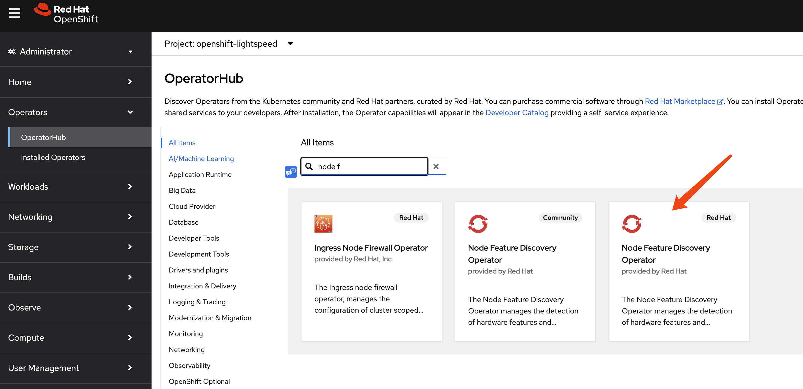
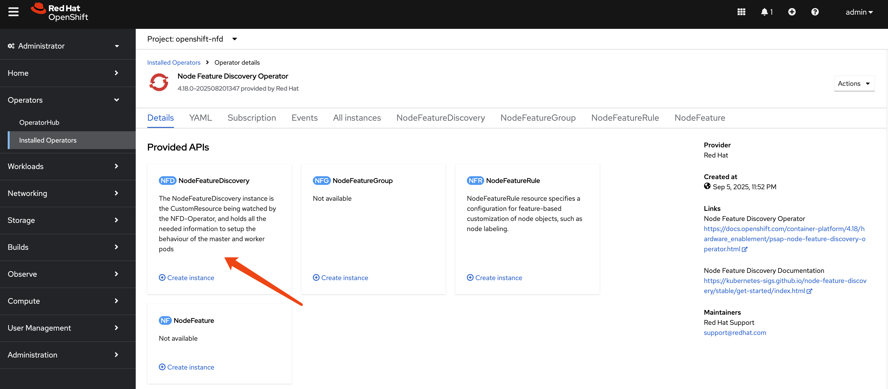
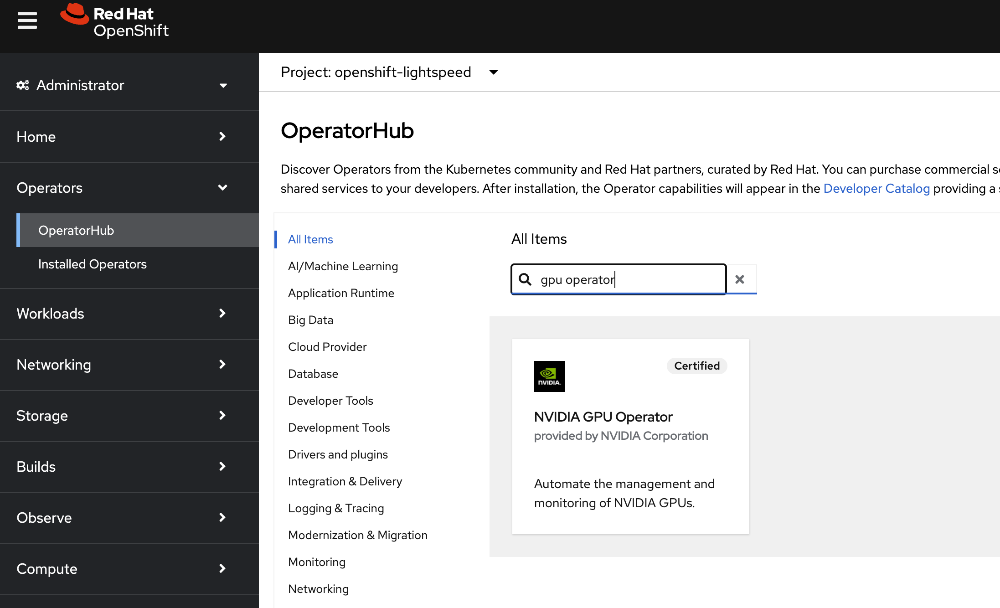
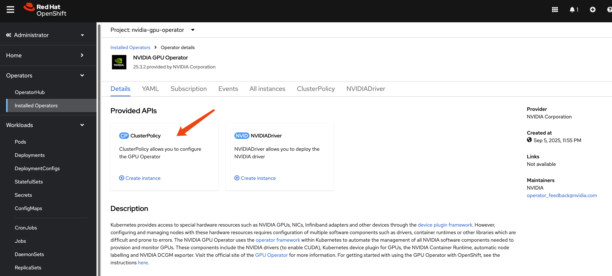
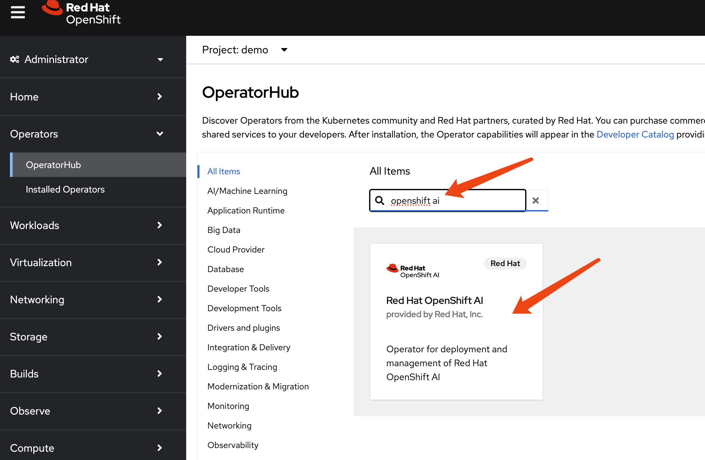

# try openshift ai

# install NFD operator

Node Feature Discovery





# install gpu operator





# install openshift ai



we select `fast` channel, and version `2.23.0`. This is the newest version at the time or writing.

create default setting for ocp ai

```yaml
apiVersion: datasciencecluster.opendatahub.io/v1
kind: DataScienceCluster
metadata:
  name: default-dsc
  labels:
    app.kubernetes.io/name: datasciencecluster
    app.kubernetes.io/instance: default-dsc
    app.kubernetes.io/part-of: rhods-operator
    app.kubernetes.io/managed-by: kustomize
    app.kubernetes.io/created-by: rhods-operator
spec:
  components:
    codeflare:
      managementState: Managed
    kserve:
      nim:
        managementState: Managed
      rawDeploymentServiceConfig: Headed # changed from `Headless` for raw deploy
      serving:
        ingressGateway:
          certificate:
            type: OpenshiftDefaultIngress
        managementState: Removed # changed from `Managed` for raw deply
        name: knative-serving
      managementState: Managed
      defaultDeploymentMode: RawDeployment # add for raw deploy
    modelregistry:
      registriesNamespace: rhoai-model-registries
      managementState: Removed
    feastoperator:
      managementState: Removed
    trustyai:
      managementState: Managed
    ray:
      managementState: Managed
    kueue:
      defaultClusterQueueName: default
      defaultLocalQueueName: default
      managementState: Managed
    workbenches:
      workbenchNamespace: rhods-notebooks
      managementState: Managed
    dashboard:
      managementState: Managed
    modelmeshserving:
      managementState: Managed
    llamastackoperator:
      managementState: Removed
    datasciencepipelines:
      argoWorkflowsControllers:
        managementState: Managed
      managementState: Managed
    trainingoperator:
      managementState: Managed
```

# end