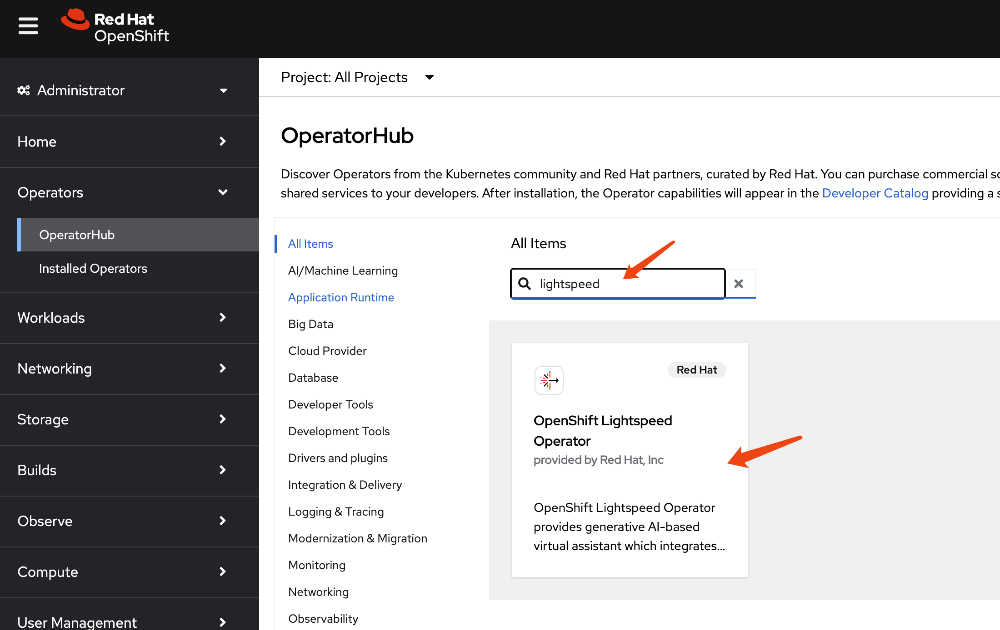

# demo of openshift lightspeed

office doc:
- https://docs.redhat.com/en/documentation/red_hat_openshift_lightspeed/1.0

# install lightspeed




# config lightspeed

```bash

VAR_API_URL=xxxxxxx # something like https://api.openai.com/v1
VAR_API_TOKEN=xxxxxxx
VAR_MODEL=xxxxx

tee $BASE_DIR/data/install/ocp-lightspeed.yaml << EOF
---
apiVersion: v1
kind: Secret
metadata:
  name: credentials
  namespace: openshift-lightspeed
type: Opaque
stringData:
  apitoken: $VAR_API_TOKEN

---
apiVersion: ols.openshift.io/v1alpha1
kind: OLSConfig
metadata:
  name: cluster
spec:
  llm:
    providers:
      - name: myOpenai
        type: openai
        credentialsSecretRef:
          name: credentials
        url: $VAR_API_URL
        models:
          - name: $VAR_MODEL
  ols:
    defaultModel: $VAR_MODEL
    defaultProvider: myOpenai

EOF

oc apply -f $BASE_DIR/data/install/ocp-lightspeed.yaml


```