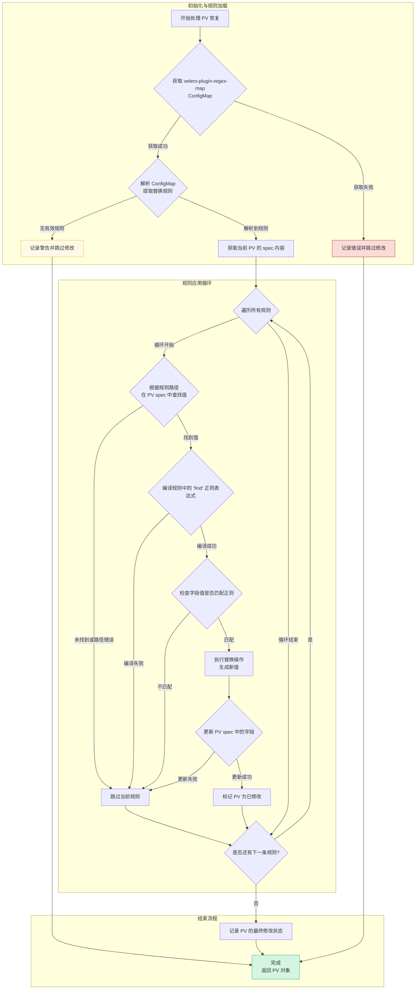
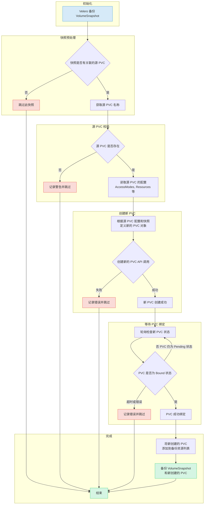

> [!NOTE]
> This document outlines a proof-of-concept for a disaster recovery solution for OpenShift Virtualization. The procedures and scripts are intended for demonstration and require adaptation for production environments.

# OpenShift Virtualization Disaster Recovery with Storage Replication and oadp plugin

## 1. Introduction and Strategy

### The Challenge
Red Hat OpenShift Virtualization (OCP-V) does not include a native, built-in disaster recovery (DR) solution. The official recommendation from Red Hat is to leverage the DR capabilities of OpenShift Data Foundation (ODF), which provides robust, integrated disaster recovery mechanisms. ODF typically uses Ceph or IBM Flash Storage as its backend.

However, many enterprise environments utilize third-party storage solutions from vendors like Dell, EMC, or Hitachi. In these scenarios, a different approach is required to implement a reliable DR strategy for virtual machines running on OpenShift Virtualization.

### Our Solution: OADP + Storage Replication
This document details a DR strategy that combines the strengths of OpenShift's native backup tools with the power of underlying storage replication. The core components of this solution are:

1.  **OpenShift API for Data Protection (OADP)**: We use OADP (based on the upstream Velero project) to perform metadata-only backups. This captures the essential Kubernetes and OpenShift Virtualization object configurations, such as Virtual Machine (VM) specifications, Persistent Volume Claims (PVCs), and other related resources. We deliberately exclude the actual volume data from the OADP backup to avoid the slow process of data compression, transfer to S3, and decompression during restore.

2.  **Storage-Level Replication**: The actual VM disk data (contained within Persistent Volumes) is replicated from the primary site to the DR site using the storage array's native remote replication capabilities. This method is highly efficient and significantly faster for large volumes compared to OADP's data movers.
3. oadp plugin: during main site backup, oadp plugin will restore pvc from snapshot. This is becuase hitachi storage does not support snapshot replication. during remote site restore, oadp plugin will patch pv, regex find pattern and replace it with another string, this is because during underlying storage replication, the pv parameters needs to change to match remote site setting, so pv can map to underlying storage correctly.

### the daily backup process

in daily operation, the main site will perform backup operation 1 time pre hour( or configure other value)

1. metadata backup: using oadp, to backup metadata into s3
2. restore pvc from snapshot: using oadp plugin, to restore pvc from snapshot, this is because hitachi storage does not support snapshot replication, so we restore snapshot to pvc to do dr.
3. add new restore pvc/pv to metadata backup: by continueing backup process, add newly craeted restored pvc/pv to metadata backup list.

### The Failover Process
In the event of a disaster at the primary site, a manual or automated failover process is initiated:

1.  **Quiesce Primary Site**: VMs at the primary site are shut down, and the underlying storage volumes are set to a read-only state to ensure data consistency.
2.  **Synchronize Storage**: The storage replication is finalized to ensure the DR site has the latest copy of the data.
3.  **Prepare DR Site Storage**: The replicated volumes (LUNs or NFS shares) are presented to the DR OpenShift cluster.
4.  **Re-map Persistent Volumes**: A crucial step involves manually creating or modifying the `PersistentVolume` (PV) objects on the DR cluster. The restored PV definitions are updated to point to the correct storage resources at the DR site (e.g., new NFS server IP, different LUN ID).
5.  **Restore Metadata**: The OADP metadata backup is restored to the DR cluster.
6.  **Start VMs**: With the metadata restored and the storage correctly mapped, the virtual machines can be started on the DR cluster.

The process for failing back from the DR site to the primary site follows the same logic in reverse.

This document uses a simple NFS storage backend to simulate the process, first demonstrating the manual steps and then outlining a path toward full automation using Ansible.


## 2. Prerequisites: Operator Installation

### provision nfs-csi

we will use nfs csi as storage backend for demo purpose

first deploy the nfs csi driver

```bash
curl -skSL https://raw.githubusercontent.com/kubernetes-csi/csi-driver-nfs/v4.12.1/deploy/install-driver.sh | bash -s v4.12.1 --
```

then create the storage class, here is an example

> [!NOTE]
> `reclaimPolicy` must be `Retain`, otherwise the oadp plugin for pv will not be trigger.

```yaml
apiVersion: storage.k8s.io/v1
kind: StorageClass
metadata:
  name: nfs-csi
  annotations:
    storageclass.kubernetes.io/is-default-class: "true"
provisioner: nfs.csi.k8s.io
parameters:
  server: 192.168.99.1
  # share: /srv/nfs/openshift-01 # nfs-subdir
  share: /openshift-01 # nfs-csi
  # csi.storage.k8s.io/provisioner-secret is only needed for providing mountOptions in DeleteVolume
  # csi.storage.k8s.io/provisioner-secret-name: "mount-options"
  # csi.storage.k8s.io/provisioner-secret-namespace: "default"
reclaimPolicy: Retain # Delete 
volumeBindingMode: Immediate
allowVolumeExpansion: true
mountOptions:
  - hard
  - nfsvers=4.2 # 4.2/3 # 推荐使用 NFSv4
  - rsize=1048576 # 增大读写块大小可以提升性能
  - wsize=1048576
  - noatime
  - nodiratime
  - actimeo=60 # Cache attributes for 60 seconds
  # --- 锁和超时优化，直接应对“锁丢失”问题 ---
  - timeo=600     # 超时时间（单位0.1秒），600=60秒。增加超时时间，容忍更长的网络抖动
  - retrans=3     # 重试次数。结合timeo，客户端会尝试更长时间来恢复连接

---
apiVersion: snapshot.storage.k8s.io/v1
kind: VolumeSnapshotClass
metadata:
  name: nfs-csi-snapclass
driver: nfs.csi.k8s.io
deletionPolicy: Delete

```

### Install OpenShift Virtualization
This guide focuses on the disaster recovery of virtual machines, so the `OpenShift Virtualization` operator is a primary requirement. Install it from the OperatorHub in your OpenShift cluster.


### Install OADP Operator
We use the `OpenShift API for Data Protection (OADP)` operator for metadata backup and restore. Install the OADP operator on **both** the primary (cluster-01) and DR (cluster-02) clusters.


Next, configure a Kubernetes `Secret` containing the credentials for your S3-compatible object storage bucket, which will store the metadata backups.

```bash
# Create a credentials file for MinIO or any S3-compatible storage
cat << EOF > $BASE_DIR/data/install/credentials-minio
[default]
aws_access_key_id = rustfsadmin
aws_secret_access_key = rustfsadmin
EOF

# Create the secret in the openshift-adp namespace
oc create secret generic minio-credentials \
--from-file=cloud=$BASE_DIR/data/install/credentials-minio \
-n openshift-adp
```

Finally, create a `DataProtectionApplication` (DPA) custom resource. This configures the OADP instance, specifying the S3 backup location and enabling the necessary plugins for OpenShift, KubeVirt (for VMs), and CSI.

```bash
# Define the OADP instance (DataProtectionApplication)
cat << EOF > $BASE_DIR/data/install/oadp.yaml
apiVersion: oadp.openshift.io/v1alpha1
kind: DataProtectionApplication
metadata:
  name: velero-instance
  namespace: openshift-adp
spec:
  # 1. Define the S3 backup storage location
  backupLocations:
    - name: default
      velero:
        provider: aws
        default: true
        objectStorage:
          bucket: ocp
          prefix: velero # Backups will be stored under the 'velero/' prefix
        config:
          # For non-AWS S3, provide the endpoint URL
          s3Url: http://192.168.99.1:9001
          region: us-east-1
        # Reference the secret containing S3 credentials
        credential:
          name: minio-credentials
          key: cloud
  
  # 2. Configure Velero plugins and features
  configuration:
    nodeAgent:
      enable: true
      uploaderType: kopia 
    velero:
      # Enable default plugins for OpenShift, KubeVirt, CSI, and AWS
      defaultPlugins:
        - openshift
        - kubevirt
        - csi
        - aws
      featureFlags:
        - EnableCSI
      customPlugins: # 添加自定义插件
      # this plugin will patch the pv when oadp restore
      - name: csi-volume-dr # 您需要为其指定一个名称
        image: quay.io/wangzheng422/qimgs:velero-plugin-oadp-dr-2025.11.02-v01
      # this plugin will restore pvc from snapshot when oadp backup
      - name: snapshot-dr # 您需要为其指定一个名称
        image: quay.io/wangzheng422/qimgs:velero-plugin-snapshot-2025.11.03-v02

    # 3. Configure volume snapshots and data movers (DataMover/Kopia) here
    # csi:
    #   enable: false
    # datamover:
    #   enable: false
EOF

oc apply -f $BASE_DIR/data/install/oadp.yaml
```

As you can see, we use 2 oadp plugins:

for  quay.io/wangzheng422/qimgs:velero-plugin-oadp-dr-2025.11.02-v01
the source code is here: https://github.com/wangzheng422/openshift-velero-plugin/blob/wzh-oadp-1.5/velero-plugins/modify-pv-handle.go
The logic is for oadp restore, during restore, the plugin will patch the pv yaml/CR, and apply logic based on config in configmap, which is search for regex pattern, and replace it with another predefined string.

The logic looks like this:


for quay.io/wangzheng422/qimgs:velero-plugin-snapshot-2025.11.03-v02
the source code is here: https://github.com/wangzheng422/openshift-velero-plugin/blob/wzh-odap-1.5-snapshot/velero-plugins/create-pvc-from-snapshot.go
The log is for oadp backup, during backup, the plugin will check for snapshot, if it find a snapshot, it will create a pvc which restore the snapshot, and wait for a while for the pv created for the pvc. This is for hitachi storage system, because it does not support snapshot replication.

The logic of this plugin is like this:



## 3. Primary Site: Performing the Backup

Assume we have a project named `demo` on the primary site (cluster-01) containing a running virtual machine.


First, let's identify the VM and its associated PVC and PV.

```bash
# Get the VM name
oc get vm -n demo
# NAME                       AGE     STATUS    READY
# cirros-crimson-wombat-26   3d20h   Running   True

# Get the PVC name associated with the VM
oc get vm cirros-crimson-wombat-26 -n demo -o jsonpath='{.spec.template.spec.volumes[*].dataVolume.name}' && echo
# cirros-crimson-wombat-26-volume

# Get the PV name bound to the PVC
oc get pvc cirros-crimson-wombat-26-volume -n demo -o jsonpath='{.spec.volumeName}' && echo
# pvc-7147333f-2db5-4b3f-9320-aac8da5170e2
```

Now, we create a Velero `Backup` object. The key configuration here is `snapshotVolumes: false`, which instructs OADP to back up only the resource definitions (YAML) and not the data within the volumes.

```bash
cat << EOF > $BASE_DIR/data/install/oadp-backup.yaml
apiVersion: velero.io/v1
kind: Backup
metadata:
  name: vm-full-metadata-backup-03
  namespace: openshift-adp
spec:
  # 1. Specify the namespace to back up
  includedNamespaces:
    - demo

  # 2. 关键修正：添加此列表，只备份您关心的资源
  # includedResources:
  #   # KubeVirt / OCP-V 虚拟机资源
  #   - virtualmachines.kubevirt.io
  #   - virtualmachineinstances.kubevirt.io
  #   - datavolumes.cdi.kubevirt.io
    
  #   # 标准的Kubernetes工作负载资源
  #   - pods
  #   - deployments
  #   - statefulsets
  #   - daemonsets
  #   - jobs
  #   - cronjobs

  #   # OpenShift 特有的工作负载资源
  #   - deploymentconfigs
  #   - buildconfigs

  #   # 应用的网络配置
  #   - services
  #   - routes
  #   - ingresses

  #   # 应用的配置和存储声明
  #   - configmaps
  #   - secrets
  #   - persistentvolumeclaims
  #   - persistentvolumes

    # 
  # 2. Ensure cluster-scoped resources like PVs are included in the metadata backup
  # While Velero typically includes PVs linked to PVCs automatically, setting this
  # to 'true' makes the behavior explicit.
  includeClusterResources: true

  # 3. CRITICAL: Disable volume snapshots
  # This tells Velero to NOT create data snapshots of the PVs.
  # It will only save the PV and PVC object definitions.
  snapshotVolumes: false
  snapshotMoveData: false
  defaultVolumesToFsBackup: false

  # 4. Specify the S3 storage location defined in the DPA
  storageLocation: default

  # 5. Set a Time-To-Live (TTL) for the backup object
  ttl: 720h0m0s # 30 days
EOF

oc apply -f $BASE_DIR/data/install/oadp-backup.yaml
```

### check the metat of pv and pvc

pvc meta data

```yaml


```

pv metat data

```yaml

```

### check the new pvc restored from snapshot

```yaml


```

## 4. DR Site: Recovery Process

### Step 1: Synchronize Storage Data
At the DR site, the first action is to ensure the data is synchronized. This is handled by the storage system. For our NFS simulation, we use `rsync` to copy the volume data from the primary NFS server to the DR NFS server.

```bash
# Simulate storage replication by copying the PV directory
sudo rsync -avh --progress /srv/nfs/openshift-01/demo-centos-stream10-aqua-spoonbill-10-volume-pvc-7147333f-2db5-4b3f-9320-aac8da5170e2 /srv/nfs/openshift-02/
```


### Step 3: Restore Metadata with OADP
Now, create a Velero `Restore` object on the DR cluster. This restore will recreate the VM and other resources from the backup. Crucially, we exclude PVs and PVCs from the restore process, as we have already created them manually.

```bash

cat << EOF > $BASE_DIR/data/install/oadp-restore.yaml
apiVersion: velero.io/v1
kind: Restore
metadata:
  name: restore-metadata-excluding-pvs-03
  namespace: openshift-adp
spec:
  # 1. Specify the backup to restore from
  backupName: vm-full-metadata-backup-03

  # 2. 关键修正：添加此“白名单”，只恢复这些资源
  includedResources:
    # KubeVirt / OCP-V 虚拟机资源
    - virtualmachines.kubevirt.io
    - virtualmachineinstances.kubevirt.io
    - datavolumes.cdi.kubevirt.io
    - virtualmachineclusterinstancetypes.instancetype.kubevirt.io
    - virtualmachineclusterpreferences.instancetype.kubevirt.io
    - controllerrevisions.apps

    # 标准的Kubernetes工作负载资源
    - pods
    - deployments
    - statefulsets
    - daemonsets
    - jobs
    - cronjobs

    # OpenShift 特有的工作负载资源
    - deploymentconfigs
    - buildconfigs

    # 应用的网络配置
    - services
    - routes.route.openshift.io
    - ingresses

    # 应用的配置和存储声明 (包括PV)
    - configmaps
    - secrets
    - persistentvolumeclaims
    - persistentvolumes

  # 2. CRITICAL: Exclude PVs and PVCs from the restore
  # This prevents Velero from overwriting our manually created volumes.
  excludedResources:
    # - persistentvolumes
    # - persistentvolumeclaims
    - snapshot
    - snapshotcontent
    - virtualMachineSnapshot
    - virtualMachineSnapshotContent
    - VolumeSnapshot
    - VolumeSnapshotContent

  # 3. Set the resource conflict policy
  # 'update' will overwrite existing resources (like the VM definition if a restore is re-run).
  existingResourcePolicy: 'update'

  restorePVs: true
  
EOF

oc apply -f $BASE_DIR/data/install/oadp-restore.yaml

```

After the restore completes, the VM will be created on the DR cluster and connected to the replicated data. 


### check the pvc and pv meta data

pvc meta data

```yaml


```


pv metat data

```yaml


```


### check the log of oadp

```bash


```


## 5. Automating Backups with Schedules

In a production environment, backups should be performed automatically on a regular schedule. OADP supports this via the `Schedule` custom resource. The following example creates a schedule to perform a metadata-only backup every hour at 22 minutes past the hour.

```bash
cat << EOF > $BASE_DIR/data/install/oadp-schedule.yaml
apiVersion: velero.io/v1
kind: Schedule
metadata:
  name: daily-metadata-backup-schedule
  namespace: openshift-adp
spec:
  # 1. Define the backup schedule using a Cron expression
  # This example runs at 22 minutes past every hour
  schedule: 22 * * * *

  # 2. Define the backup specification template
  # This template is identical to the manual 'Backup' object
  template:
    spec:
      includedNamespaces:
        - demo
      includeClusterResources: true
      # CRITICAL: Only back up metadata
      snapshotVolumes: false
      storageLocation: default
      # Set the retention policy for backups created by this schedule
      ttl: 720h0m0s # (30 days * 24 hours = 720 hours)
EOF

oc apply -f $BASE_DIR/data/install/oadp-schedule.yaml
```
OADP will automatically create `Backup` objects based on this schedule (e.g., `daily-metadata-backup-schedule-20250730012200`) and delete them when their TTL expires.

## 8. Path to Automation

The manual steps outlined in this document form the basis for a fully automated disaster recovery workflow. The high-level logic for an automation script (e.g., an Ansible playbook) would be:

1.  mainsite cleanup: on mainsite, if backup perform, a new pvc is created for each snapshot, if the snapshot is removed, the restored pvc should be deleted.

2.  **Failover Execution**: In a disaster, a failover is triggered by running a final OADP `Restore` on the DR cluster. This restore brings the VMs online, connecting them to the already replicated and pre-staged persistent volumes.
3.  cleanup pvc after failover/restore: oadp restore will only update and add pvc
4.  remove pv on both site, because we use `retain` policy.
