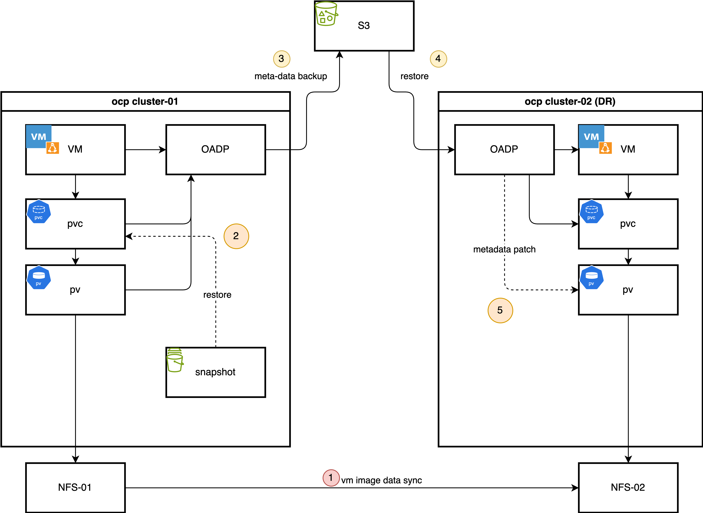
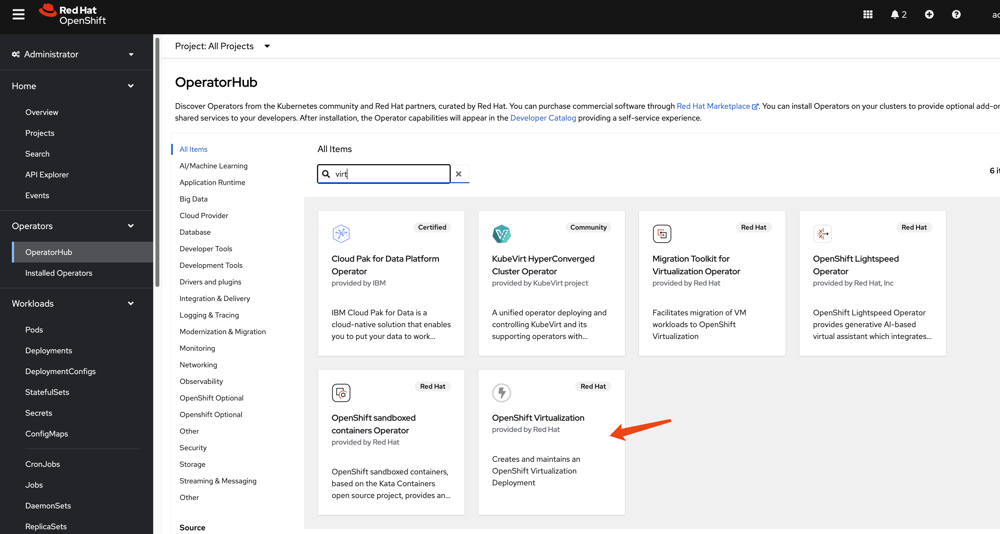
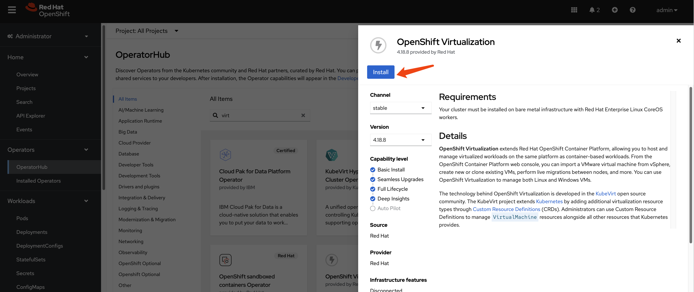
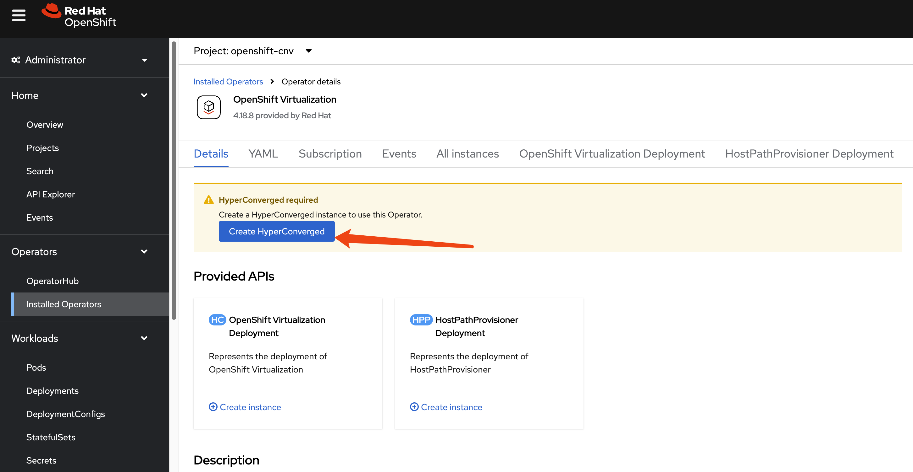
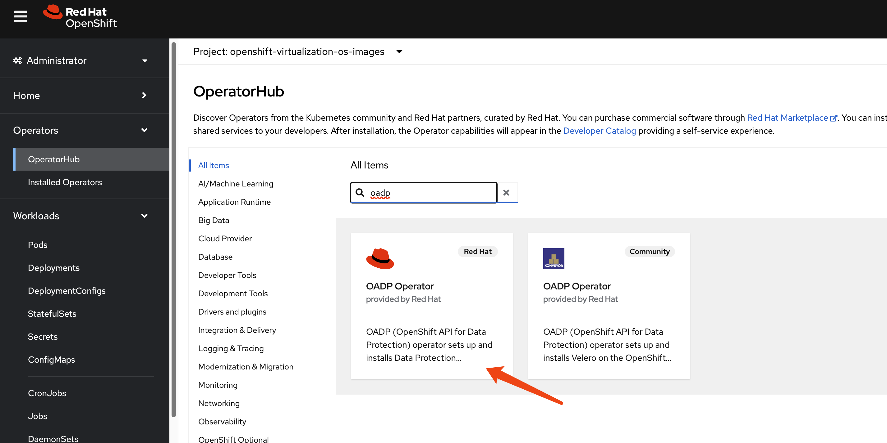
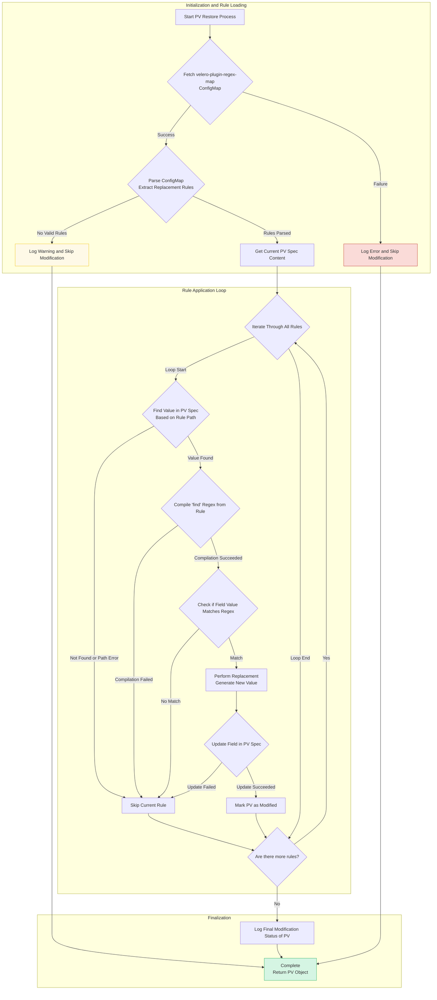
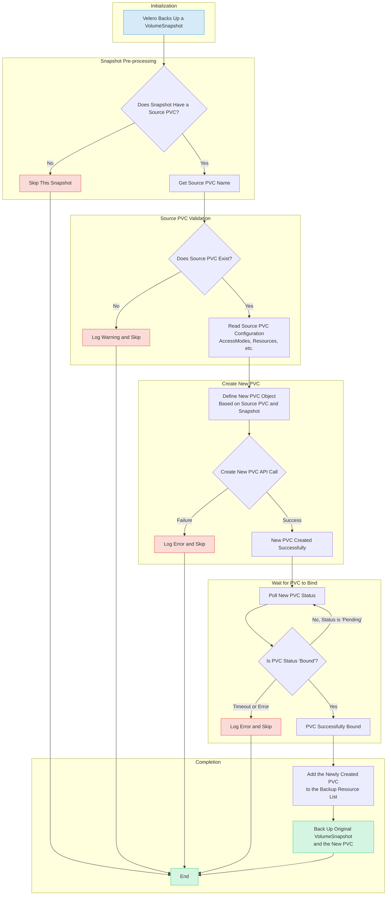
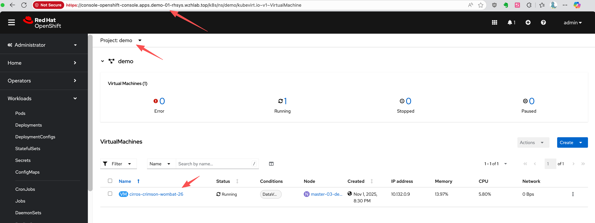
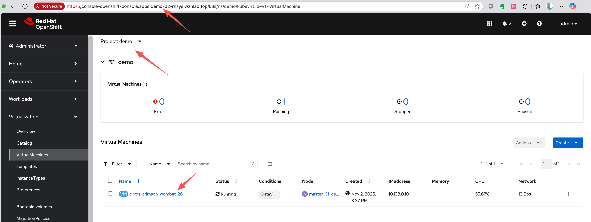

> [!NOTE]
> This document outlines a proof-of-concept for a disaster recovery solution for OpenShift Virtualization. The procedures and scripts are intended for demonstration and require adaptation for production environments.

# OpenShift Virtualization Disaster Recovery with Storage Replication and OADP Plugins

## 1. Introduction and Strategy

### The Challenge: Native DR Gaps in OpenShift Virtualization

Red Hat OpenShift Virtualization (OCP-V) is a powerful platform for running virtual machines alongside containers, but it does not include a native, built-in disaster recovery (DR) solution. The official recommendation from Red Hat is to leverage the DR capabilities of OpenShift Data Foundation (ODF), which provides robust, integrated disaster recovery mechanisms. ODF is typically backed by Ceph or IBM Flash Storage, offering a tightly integrated ecosystem.

However, many enterprise environments have standardized on third-party storage solutions from vendors like Dell, EMC, or Hitachi. In these heterogeneous storage scenarios, a different approach is required to implement a reliable and efficient DR strategy for virtual machines running on OpenShift Virtualization.

### Our Solution: A Hybrid Approach with OADP and Storage Replication

This document details a DR strategy that combines the strengths of OpenShift's native backup tools with the power of underlying storage replication. This hybrid model optimizes for both speed and consistency. The core components of this solution are:

1.  **OpenShift API for Data Protection (OADP)**: We use OADP (based on the upstream Velero project) to perform **metadata-only backups**. This captures the essential Kubernetes and OpenShift Virtualization object configurations, such as Virtual Machine (VM) specifications, Persistent Volume Claims (PVCs), and other related resources. We deliberately exclude the actual volume data from the OADP backup to avoid the time-consuming process of data compression, transfer to S3, and decompression during restore.

2.  **Storage-Level Replication**: The actual VM disk data, contained within Persistent Volumes (PVs), is replicated from the primary site to the DR site using the storage array's native remote replication capabilities. This method is highly efficient and significantly faster for large volumes compared to OADP's file-based data movers.

3.  **Custom OADP Plugins**: To bridge the gap between the metadata backup and the physically replicated storage, we employ two custom plugins:
    *   **Snapshot-to-PVC Plugin (Backup Time)**: Since some storage systems (like the Hitachi model in our use case) do not support replicating snapshots directly, this plugin activates during the backup process. It creates a new PVC from a volume snapshot, effectively materializing the snapshot as a replicable volume. This new PVC is then included in the OADP metadata backup.
    *   **PV Patching Plugin (Restore Time)**: During a restore at the DR site, this plugin intercepts the PersistentVolume objects. It dynamically modifies their definitions—for example, by changing storage server IPs or volume paths—to match the configuration of the DR site's storage infrastructure. This ensures that the restored PVs can correctly map to the replicated storage LUNs.

### The Daily Backup Process

In a typical operational cycle, the primary site performs automated backups at a regular interval (e.g., once per hour).

1.  **Metadata Backup Initiation**: OADP triggers a scheduled backup of all specified Kubernetes object metadata and stores it in an S3-compatible object store.
2.  **Snapshot-to-PVC Promotion**: The custom plugin identifies volume snapshots associated with the VMs being backed up. For each snapshot, it creates a new, corresponding PVC. This new PVC is instantly provisioned from the snapshot's data.
3.  **Inclusion of New PVCs/PVs**: The OADP backup process continues, adding the newly created PVCs and their associated PVs to the metadata backup set. This ensures the backup contains a complete, consistent, and replicable state of the application.

### The Failover Process

In the event of a disaster at the primary site, a manual or automated failover process is initiated:

1.  **Quiesce Primary Site**: VMs at the primary site are shut down, and the underlying storage volumes are set to a read-only state to ensure data consistency.
2.  **Finalize Storage Synchronization**: The storage replication is finalized to ensure the DR site has the latest consistent copy of the data.
3.  **Present Storage at DR Site**: The replicated volumes (LUNs or NFS shares) are made available and presented to the DR OpenShift cluster.
4.  **Restore Metadata with PV Patching**: The OADP metadata backup is restored to the DR cluster. During this process, the custom PV patching plugin automatically modifies the PV definitions to point to the correct storage resources at the DR site.
5.  **Start VMs**: With the metadata restored and the storage correctly mapped, the virtual machines can be started on the DR cluster, resuming operations.

The process for failing back from the DR site to the primary site follows the same logic in reverse.

This document uses a simple NFS storage backend to simulate the process, first demonstrating the manual steps and then outlining a path toward full automation using Ansible.



## 2. Prerequisites: Operator Installation

### Provisioning the NFS CSI Driver

For demonstration purposes, we will use the NFS CSI driver as the storage backend.

First, deploy the NFS CSI driver to your cluster.

```bash
curl -skSL https://raw.githubusercontent.com/kubernetes-csi/csi-driver-nfs/v4.12.1/deploy/install-driver.sh | bash -s v4.12.1 --
```

Next, create the `StorageClass` and `VolumeSnapshotClass`.

> [!NOTE]
> The `reclaimPolicy` must be set to `Retain`. Otherwise, the OADP plugin for PV modification will not be triggered during the restore process.

```yaml
apiVersion: storage.ks.io/v1
kind: StorageClass
metadata:
  name: nfs-csi
  annotations:
    storageclass.kubernetes.io/is-default-class: "true"
provisioner: nfs.csi.k8s.io
parameters:
  server: 192.168.99.1
  share: /openshift-01
reclaimPolicy: Retain # Must be Retain for this DR strategy
volumeBindingMode: Immediate
allowVolumeExpansion: true
mountOptions:
  - hard
  - nfsvers=4.2 # Recommended to use NFSv4
  - rsize=1048576 # Increasing read/write block size can improve performance
  - wsize=1048576
  - noatime
  - nodiratime
  - actimeo=60 # Cache attributes for 60 seconds
  # --- Lock and timeout optimizations to handle "lost lock" issues ---
  - timeo=600     # Timeout in tenths of a second (600 = 60s). Increases tolerance for network latency.
  - retrans=3     # Number of retransmissions.

---
apiVersion: snapshot.storage.k8s.io/v1
kind: VolumeSnapshotClass
metadata:
  name: nfs-csi-snapclass
driver: nfs.csi.k8s.io
deletionPolicy: Delete
```

### Install OpenShift Virtualization
This guide focuses on the disaster recovery of virtual machines, so the `OpenShift Virtualization` operator is a primary requirement. Install it from the OperatorHub in your OpenShift cluster.





### Install OADP Operator
We use the `OpenShift API for Data Protection (OADP)` operator for metadata backup and restore. Install the OADP operator on **both** the primary (cluster-01) and DR (cluster-02) clusters.



Next, configure a Kubernetes `Secret` containing the credentials for your S3-compatible object storage bucket, which will store the metadata backups.

```bash
# Create a credentials file for MinIO or any S3-compatible storage
cat << EOF > $BASE_DIR/data/install/credentials-minio
[default]
aws_access_key_id = rustfsadmin
aws_secret_access_key = rustfsadmin
EOF

# Create the secret in the openshift-adp namespace
oc create secret generic minio-credentials \
--from-file=cloud=$BASE_DIR/data/install/credentials-minio \
-n openshift-adp
```

Finally, create a `DataProtectionApplication` (DPA) custom resource. This configures the OADP instance, specifying the S3 backup location and enabling the necessary plugins for OpenShift, KubeVirt, CSI, and our custom DR logic.

```bash
# Define the OADP instance (DataProtectionApplication)
cat << EOF > $BASE_DIR/data/install/oadp.yaml
apiVersion: oadp.openshift.io/v1alpha1
kind: DataProtectionApplication
metadata:
  name: velero-instance
  namespace: openshift-adp
spec:
  # 1. Define the S3 backup storage location
  backupLocations:
    - name: default
      velero:
        provider: aws
        default: true
        objectStorage:
          bucket: ocp
          prefix: velero # Backups will be stored under the 'velero/' prefix
        config:
          # For non-AWS S3, provide the endpoint URL
          s3Url: http://192.168.99.1:9001
          region: us-east-1
        # Reference the secret containing S3 credentials
        credential:
          name: minio-credentials
          key: cloud
  
  # 2. Configure Velero plugins and features
  configuration:
    nodeAgent:
      enable: true
      uploaderType: kopia 
    velero:
      # Enable default plugins for OpenShift, KubeVirt, CSI, and AWS
      defaultPlugins:
        - openshift
        - kubevirt
        - csi
        - aws
      featureFlags:
        - EnableCSI
      customPlugins: # Add custom plugins
      # This plugin will patch the PV during OADP restore
      - name: csi-volume-dr # A unique name for the plugin
        image: quay.io/wangzheng422/qimgs:velero-plugin-oadp-dr-2025.11.05-v01
      # This plugin will restore a PVC from a snapshot during OADP backup
      - name: snapshot-dr # A unique name for the plugin
        image: quay.io/wangzheng422/qimgs:velero-plugin-snapshot-2025.11.05-v01

    # 3. Volume snapshot and data mover configuration is not needed for this metadata-only strategy
    # csi:
    #   enable: false
    # datamover:
    #   enable: false
EOF

oc apply -f $BASE_DIR/data/install/oadp.yaml
```

As you can see, we use two custom OADP plugins:

#### **1. PV Patching Plugin (`velero-plugin-oadp-dr`)**

The source code is available here: [https://github.com/wangzheng422/openshift-velero-plugin/blob/wzh-oadp-1.5/velero-plugins-wzhlab-top-pv-patch/modify-pv-handle.go](https://github.com/wangzheng422/openshift-velero-plugin/blob/wzh-oadp-1.5/velero-plugins-wzhlab-top-pv-patch/modify-pv-handle.go)

This plugin activates during a restore operation. It reads a `ConfigMap` named `velero-plugin-regex-map` which contains rules for finding and replacing strings within PV definitions. This allows it to dynamically adapt PVs to the DR site's storage environment.

The logic is as follows:


#### **2. Snapshot-to-PVC Plugin (`velero-plugin-snapshot`)**

The source code is available here: [https://github.com/wangzheng422/openshift-velero-plugin/blob/wzh-odap-1.5-snapshot/velero-plugins-wzhlab-top-restore-pvc-from-snapshot/create-pvc-from-snapshot.go](https://github.com/wangzheng422/openshift-velero-plugin/blob/wzh-odap-1.5-snapshot/velero-plugins-wzhlab-top-restore-pvc-from-snapshot/create-pvc-from-snapshot.go)

This plugin activates during a backup operation. It scans for `VolumeSnapshot` objects. If a snapshot is found, the plugin creates a new PVC that restores data from that snapshot. It then waits for the new PVC to become bound to a PV. This is essential for storage systems like Hitachi that do not support replicating snapshots directly.

The logic of this plugin is as follows:


## 3. Primary Site: Performing the Backup

Assume we have a project named `demo` on the primary site (cluster-01) containing a running virtual machine.



First, let's identify the VM and its associated PVC, PV, and VolumeSnapshot.

```bash
# Get the VM name
oc get vm -n demo
# NAME                       AGE     STATUS    READY
# cirros-crimson-wombat-26   3d20h   Running   True

# Get the PVC name associated with the VM
oc get vm cirros-crimson-wombat-26 -n demo -o jsonpath='{.spec.template.spec.volumes[*].dataVolume.name}' && echo
# cirros-crimson-wombat-26-volume

# Get the PV name bound to the PVC
oc get pvc cirros-crimson-wombat-26-volume -n demo -o jsonpath='{.spec.volumeName}' && echo
# pvc-7147333f-2db5-4b3f-9320-aac8da5170e2

# Get the snapshot from the vm/pvc
oc get volumesnapshot -n demo -o jsonpath='{.items[?(@.spec.source.persistentVolumeClaimName=="cirros-crimson-wombat-26-volume")].metadata.name}' && echo
# vmsnapshot-f1cafd2b-beb7-47a1-8f9c-c9c0d52569c5-volume-rootdisk
```

Now, we create a Velero `Backup` object. The key configuration here is `snapshotVolumes: false`, which instructs OADP to back up only the resource definitions (YAML) and not the data within the volumes.

```bash
cat << EOF > $BASE_DIR/data/install/oadp-backup.yaml
apiVersion: velero.io/v1
kind: Backup
metadata:
  name: vm-full-metadata-backup-03
  namespace: openshift-adp
spec:
  # 1. Specify the namespace to back up
  includedNamespaces:
    - demo

  # 2. Ensure cluster-scoped resources like PVs are included in the metadata backup.
  # While Velero typically includes PVs linked to PVCs automatically, setting this
  # to 'true' makes the behavior explicit.
  includeClusterResources: true

  # 3. CRITICAL: Disable Velero's native volume snapshots.
  # This tells Velero to NOT create data snapshots of the PVs.
  # It will only save the PV and PVC object definitions.
  snapshotVolumes: false
  snapshotMoveData: false
  defaultVolumesToFsBackup: false

  # 4. Specify the S3 storage location defined in the DPA
  storageLocation: default

  # 5. Set a Time-To-Live (TTL) for the backup object
  ttl: 720h0m0s # 30 days
EOF

oc apply -f $BASE_DIR/data/install/oadp-backup.yaml
```

### Inspecting the PVC and PV Metadata

Here is the metadata for the original PVC.

```yaml
kind: PersistentVolumeClaim
apiVersion: v1
metadata:
  name: cirros-crimson-wombat-26-volume
  namespace: demo
  # ......
spec:
  accessModes:
    - ReadWriteMany
  resources:
    requests:
      storage: '235635999'
  volumeName: pvc-b6d75156-0c58-422f-8bf8-6e40ed054c5d
  storageClassName: nfs-csi
  volumeMode: Filesystem
  dataSource:
    apiGroup: cdi.kubevirt.io
    kind: VolumeCloneSource
    name: volume-clone-source-916cf253-27ae-4f9a-8456-1e61d775206d
  dataSourceRef:
    apiGroup: cdi.kubevirt.io
    kind: VolumeCloneSource
    name: volume-clone-source-916cf253-27ae-4f9a-8456-1e61d775206d
# .....
```

And here is the corresponding PV metadata. Note that it points to the NFS share on `/openshift-01`.

```yaml
kind: PersistentVolume
apiVersion: v1
metadata:
  name: pvc-b6d75156-0c58-422f-8bf8-6e40ed054c5d
  # ......
spec:
  capacity:
    storage: '235635999'
  csi:
    driver: nfs.csi.k8s.io
    volumeHandle: 192.168.99.1#openshift-01#pvc-b6d75156-0c58-422f-8bf8-6e40ed054c5d##
    volumeAttributes:
      csi.storage.k8s.io/pv/name: pvc-b6d75156-0c58-422f-8bf8-6e40ed054c5d
      csi.storage.k8s.io/pvc/name: tmp-pvc-43d11600-7b1c-4a3f-997c-8e99526bdd32
      csi.storage.k8s.io/pvc/namespace: openshift-virtualization-os-images
      server: 192.168.99.1
      share: /openshift-01
      storage.kubernetes.io/csiProvisionerIdentity: 1761996473487-3594-nfs.csi.k8s.io
      subdir: pvc-b6d75156-0c58-422f-8bf8-6e40ed054c5d
  accessModes:
    - ReadWriteMany
  claimRef:
    namespace: demo
    name: cirros-crimson-wombat-26-volume
    uid: 43d11600-7b1c-4a3f-997c-8e99526bdd32
    resourceVersion: '126830'
  persistentVolumeReclaimPolicy: Retain
  storageClassName: nfs-csi
  mountOptions:
    - hard
    - nfsvers=4.2
    - rsize=1048576
    - wsize=1048576
    - noatime
    - nodiratime
    - actimeo=60
    - timeo=600
    - retrans=3
  volumeMode: Filesystem
# ......
```

### Verifying the New PVC Restored from Snapshot

The snapshot-to-PVC plugin creates a new PVC. Note the name, which is a concatenation of the original PVC name and the snapshot name, as defined by the plugin's logic.

```yaml
kind: PersistentVolumeClaim
apiVersion: v1
metadata:
  name: cirros-crimson-wombat-26-volume-vmsnapshot-f1cafd2b-beb7-47a1-8f9c-c9c0d52569c5-volume-rootdisk
  namespace: demo
  # ......
spec:
  accessModes:
    - ReadWriteMany
  resources:
    requests:
      storage: '235635999'
  volumeName: pvc-5183c8de-817f-4d45-947c-a02ccc18d422
  storageClassName: nfs-csi
  volumeMode: Filesystem
  dataSource:
    apiGroup: snapshot.storage.k8s.io
    kind: VolumeSnapshot
    name: vmsnapshot-f1cafd2b-beb7-47a1-8f9c-c9c0d52569c5-volume-rootdisk
  dataSourceRef:
    apiGroup: snapshot.storage.k8s.io
    kind: VolumeSnapshot
    name: vmsnapshot-f1cafd2b-beb7-47a1-8f9c-c9c0d52569c5-volume-rootdisk
# .....
```

### Checking the OADP Plugin Logs

You can verify the plugin's execution by checking the Velero pod logs. The logs show the plugin processing the snapshot and creating the new PVC.

```bash
oc logs -n openshift-adp -l app.kubernetes.io/name=velero --tail=-1 | grep create-pvc-from-snapshot.go
# time="2025-11-05T11:59:58Z" level=info msg="Starting CreatePvcFromSnapshotAction for VolumeSnapshot..." backup=openshift-adp/vm-full-metadata-backup-03 cmd=/plugins/velero-plugins-wzhlab-top-restore-pvc-from-snapshot logSource="/src/github.com/konveyor/openshift-velero-plugin/velero-plugins-wzhlab-top-restore-pvc-from-snapshot/create-pvc-from-snapshot.go:55" pluginName=velero-plugins-wzhlab-top-restore-pvc-from-snapshot
# time="2025-11-05T11:59:58Z" level=info msg="Processing VolumeSnapshot demo/vmsnapshot-f1cafd2b-beb7-47a1-8f9c-c9c0d52569c5-volume-rootdisk" backup=openshift-adp/vm-full-metadata-backup-03 cmd=/plugins/velero-plugins-wzhlab-top-restore-pvc-from-snapshot logSource="/src/github.com/konveyor/openshift-velero-plugin/velero-plugins-wzhlab-top-restore-pvc-from-snapshot/create-pvc-from-snapshot.go:62" pluginName=velero-plugins-wzhlab-top-restore-pvc-from-snapshot
# time="2025-11-05T11:59:58Z" level=info msg="Source PVC for snapshot is demo/cirros-crimson-wombat-26-volume" backup=openshift-adp/vm-full-metadata-backup-03 cmd=/plugins/velero-plugins-wzhlab-top-restore-pvc-from-snapshot logSource="/src/github.com/konveyor/openshift-velero-plugin/velero-plugins-wzhlab-top-restore-pvc-from-snapshot/create-pvc-from-snapshot.go:70" pluginName=velero-plugins-wzhlab-top-restore-pvc-from-snapshot
# time="2025-11-05T11:59:58Z" level=info msg="Attempting to create new PVC demo/cirros-crimson-wombat-26-volume-vmsnapshot-f1cafd2b-beb7-47a1-8f9c-c9c0d52569c5-volume-rootdisk from snapshot vmsnapshot-f1cafd2b-beb7-47a1-8f9c-c9c0d52569c5-volume-rootdisk" backup=openshift-adp/vm-full-metadata-backup-03 cmd=/plugins/velero-plugins-wzhlab-top-restore-pvc-from-snapshot logSource="/src/github.com/konveyor/openshift-velero-plugin/velero-plugins-wzhlab-top-restore-pvc-from-snapshot/create-pvc-from-snapshot.go:107" pluginName=velero-plugins-wzhlab-top-restore-pvc-from-snapshot
# time="2025-11-05T11:59:58Z" level=info msg="Successfully created new PVC demo/cirros-crimson-wombat-26-volume-vmsnapshot-f1cafd2b-beb7-47a1-8f9c-c9c0d52569c5-volume-rootdisk." backup=openshift-adp/vm-full-metadata-backup-03 cmd=/plugins/velero-plugins-wzhlab-top-restore-pvc-from-snapshot logSource="/src/github.com/konveyor/openshift-velero-plugin/velero-plugins-wzhlab-top-restore-pvc-from-snapshot/create-pvc-from-snapshot.go:117" pluginName=velero-plugins-wzhlab-top-restore-pvc-from-snapshot
# time="2025-11-05T11:59:58Z" level=info msg="Waiting for PVC demo/cirros-crimson-wombat-26-volume-vmsnapshot-f1cafd2b-beb7-47a1-8f9c-c9c0d52569c5-volume-rootdisk to become bound..." backup=openshift-adp/vm-full-metadata-backup-03 cmd=/plugins/velero-plugins-wzhlab-top-restore-pvc-from-snapshot logSource="/src/github.com/konveyor/openshift-velero-plugin/velero-plugins-wzhlab-top-restore-pvc-from-snapshot/create-pvc-from-snapshot.go:120" pluginName=velero-plugins-wzhlab-top-restore-pvc-from-snapshot
# time="2025-11-05T11:59:58Z" level=info msg="PVC demo/cirros-crimson-wombat-26-volume-vmsnapshot-f1cafd2b-beb7-47a1-8f9c-c9c0d52569c5-volume-rootdisk is still in phase Pending, waiting..." backup=openshift-adp/vm-full-metadata-backup-03 cmd=/plugins/velero-plugins-wzhlab-top-restore-pvc-from-snapshot logSource="/src/github.com/konveyor/openshift-velero-plugin/velero-plugins-wzhlab-top-restore-pvc-from-snapshot/create-pvc-from-snapshot.go:146" pluginName=velero-plugins-wzhlab-top-restore-pvc-from-snapshot
# time="2025-11-05T12:00:03Z" level=info msg="PVC demo/cirros-crimson-wombat-26-volume-vmsnapshot-f1cafd2b-beb7-47a1-8f9c-c9c0d52569c5-volume-rootdisk is now bound." backup=openshift-adp/vm-full-metadata-backup-03 cmd=/plugins/velero-plugins-wzhlab-top-restore-pvc-from-snapshot logSource="/src/github.com/konveyor/openshift-velero-plugin/velero-plugins-wzhlab-top-restore-pvc-from-snapshot/create-pvc-from-snapshot.go:142" pluginName=velero-plugins-wzhlab-top-restore-pvc-from-snapshot
# time="2025-11-05T12:00:03Z" level=info msg="Returning original VolumeSnapshot and adding new PVC cirros-crimson-wombat-26-volume-vmsnapshot-f1cafd2b-beb7-47a1-8f9c-c9c0d52569c5-volume-rootdisk to the backup." backup=openshift-adp/vm-full-metadata-backup-03 cmd=/plugins/velero-plugins-wzhlab-top-restore-pvc-from-snapshot logSource="/src/github.com/konveyor/openshift-velero-plugin/velero-plugins-wzhlab-top-restore-pvc-from-snapshot/create-pvc-from-snapshot.go:162" pluginName=velero-plugins-wzhlab-top-restore-pvc-from-snapshot
```

## 4. DR Site: Recovery Process

### Step 1: Synchronize Storage Data
At the DR site, the first action is to ensure the data is synchronized. This is handled by the storage system. For our NFS simulation, we use `rsync` to copy the volume data from the primary NFS server to the DR NFS server.

```bash
# Simulate storage replication by copying the PV directory
sudo rsync -avh --progress /srv/nfs/openshift-01/pvc-b6d75156-0c58-422f-8bf8-6e40ed054c5d /srv/nfs/openshift-02/
```

### Step 2: Restore Metadata with OADP
Now, create a Velero `Restore` object on the DR cluster. This restore will recreate the VM and other resources from the backup. The PV Patching plugin will automatically handle the re-mapping of storage.

```bash
cat << EOF > $BASE_DIR/data/install/oadp-restore.yaml
apiVersion: velero.io/v1
kind: Restore
metadata:
  name: restore-metadata-excluding-pvs-03
  namespace: openshift-adp
spec:
  # 1. Specify the backup to restore from
  backupName: vm-full-metadata-backup-03

  # 2. Whitelist the resources to restore. This provides granular control.
  includedResources:
    # KubeVirt / OCP-V VM resources
    - virtualmachines.kubevirt.io
    - virtualmachineinstances.kubevirt.io
    - datavolumes.cdi.kubevirt.io
    - virtualmachineclusterinstancetypes.instancetype.kubevirt.io
    - virtualmachineclusterpreferences.instancetype.kubevirt.io
    - controllerrevisions.apps

    # Standard Kubernetes workload resources
    - pods
    - deployments
    - statefulsets
    - daemonsets
    - jobs
    - cronjobs

    # OpenShift-specific workload resources
    - deploymentconfigs
    - buildconfigs

    # Application networking configuration
    - services
    - routes.route.openshift.io
    - ingresses

    # Application configuration and storage claims (including PVs)
    - configmaps
    - secrets
    - persistentvolumeclaims
    - persistentvolumes

  # 3. CRITICAL: Exclude snapshot-related resources
  # We are restoring from a materialized PVC, not the snapshot itself.
  excludedResources:
    - snapshot
    - snapshotcontent
    - virtualMachineSnapshot
    - virtualMachineSnapshotContent
    - VolumeSnapshot
    - VolumeSnapshotContent

  # 4. Set the resource conflict policy
  # 'update' will overwrite existing resources if a restore is re-run.
  existingResourcePolicy: 'update'

  # 5. Ensure PVs are restored so the plugin can patch them.
  restorePVs: true
  
EOF

oc apply -f $BASE_DIR/data/install/oadp-restore.yaml
```

After the restore completes, the VM will be created on the DR cluster and connected to the replicated data.



### Verifying the Restored PVC and PV Metadata

The restored PVC metadata shows that it is bound to the same PV name as on the primary site.

```yaml
kind: PersistentVolumeClaim
apiVersion: v1
metadata:
  name: cirros-crimson-wombat-26-volume
  namespace: demo
  # ......
spec:
  accessModes:
    - ReadWriteMany
  resources:
    requests:
      storage: '235635999'
  volumeName: pvc-b6d75156-0c58-422f-8bf8-6e40ed054c5d
  storageClassName: nfs-csi
  volumeMode: Filesystem
# ......
```

The restored PV metadata shows the effect of the patching plugin. The `share` and `volumeHandle` now point to the DR site's NFS server directory (`/openshift-02`), thanks to the plugin's logic.

```yaml
kind: PersistentVolume
apiVersion: v1
metadata:
  name: pvc-b6d75156-0c58-422f-8bf8-6e40ed054c5d
  # ......
spec:
  capacity:
    storage: '235635999'
  csi:
    driver: nfs.csi.k8s.io
    volumeHandle: 192.168.99.1#openshift-02#pvc-b6d75156-0c58-422f-8bf8-6e40ed054c5d##
    volumeAttributes:
      csi.storage.k8s.io/pv/name: pvc-b6d75156-0c58-422f-8bf8-6e40ed054c5d
      csi.storage.k8s.io/pvc/name: tmp-pvc-43d11600-7b1c-4a3f-997c-8e99526bdd32
      csi.storage.k8s.io/pvc/namespace: openshift-virtualization-os-images
      server: 192.168.99.1
      share: /openshift-02
      storage.kubernetes.io/csiProvisionerIdentity: 1761996473487-3594-nfs.csi.k8s.io
      subdir: pvc-b6d75156-0c58-422f-8bf8-6e40ed054c5d
  accessModes:
    - ReadWriteMany
  claimRef:
    kind: PersistentVolumeClaim
    namespace: demo
    name: cirros-crimson-wombat-26-volume
    uid: 4150f267-fc79-4234-a188-9dbd0b993fc2
    apiVersion: v1
    resourceVersion: '138499'
  persistentVolumeReclaimPolicy: Retain
  storageClassName: nfs-csi
  mountOptions:
    - hard
    - nfsvers=4.2
    - rsize=1048576
    - wsize=1048576
    - noatime
    - nodiratime
    - actimeo=60
    - timeo=600
    - retrans=3
  volumeMode: Filesystem
```

### Checking the OADP Plugin Logs

The Velero pod logs on the DR cluster confirm that the PV patching plugin executed successfully.

```bash
oc logs -n openshift-adp -l app.kubernetes.io/name=velero --tail=-1 | grep modify-pv-handle.go
# time="2025-11-05T11:41:57Z" level=info msg="Starting ModifyPVFieldsAction for PV..." cmd=/plugins/velero-plugins-wzhlab-top-pv-patch logSource="/src/github.com/konveyor/openshift-velero-plugin/velero-plugins-wzhlab-top-pv-patch/modify-pv-handle.go:66" pluginName=velero-plugins-wzhlab-top-pv-patch restore=openshift-adp/restore-metadata-excluding-pvs-03
# time="2025-11-05T11:41:57Z" level=info msg="Applying rule for path: spec.csi.volumeAttributes.share" cmd=/plugins/velero-plugins-wzhlab-top-pv-patch logSource="/src/github.com/konveyor/openshift-velero-plugin/velero-plugins-wzhlab-top-pv-patch/modify-pv-handle.go:98" pluginName=velero-plugins-wzhlab-top-pv-patch restore=openshift-adp/restore-metadata-excluding-pvs-03
# time="2025-11-05T11:41:57Z" level=info msg="PV pvc-5183c8de-817f-4d45-947c-a02ccc18d422: Match found for path spec.csi.volumeAttributes.share. Changing from '/openshift-01' to '/openshift-02'" cmd=/plugins/velero-plugins-wzhlab-top-pv-patch logSource="/src/github.com/konveyor/openshift-velero-plugin/velero-plugins-wzhlab-top-pv-patch/modify-pv-handle.go:126" pluginName=velero-plugins-wzhlab-top-pv-patch restore=openshift-adp/restore-metadata-excluding-pvs-03
# time="2025-11-05T11:41:57Z" level=info msg="Applying rule for path: spec.csi.volumeHandle" cmd=/plugins/velero-plugins-wzhlab-top-pv-patch logSource="/src/github.com/konveyor/openshift-velero-plugin/velero-plugins-wzhlab-top-pv-patch/modify-pv-handle.go:98" pluginName=velero-plugins-wzhlab-top-pv-patch restore=openshift-adp/restore-metadata-excluding-pvs-03
# time="2025-11-05T11:41:57Z" level=info msg="PV pvc-5183c8de-817f-4d45-947c-a02ccc18d422: Match found for path spec.csi.volumeHandle. Changing from '192.168.99.1#openshift-01#pvc-5183c8de-817f-4d45-947c-a02ccc18d422##' to '192.168.99.1#openshift-02#pvc-5183c8de-817f-4d45-947c-a02ccc18d422##'" cmd=/plugins/velero-plugins-wzhlab-top-pv-patch logSource="/src/github.com/konveyor/openshift-velero-plugin/velero-plugins-wzhlab-top-pv-patch/modify-pv-handle.go:126" pluginName=velero-plugins-wzhlab-top-pv-patch restore=openshift-adp/restore-metadata-excluding-pvs-03
# time="2025-11-05T11:41:57Z" level=info msg="PV pvc-5183c8de-817f-4d45-947c-a02ccc18d422 was modified." cmd=/plugins/velero-plugins-wzhlab-top-pv-patch logSource="/src/github.com/konveyor/openshift-velero-plugin/velero-plugins-wzhlab-top-pv-patch/modify-pv-handle.go:139" pluginName=velero-plugins-wzhlab-top-pv-patch restore=openshift-adp/restore-metadata-excluding-pvs-03
# time="2025-11-05T11:41:57Z" level=info msg="Starting ModifyPVFieldsAction for PV..." cmd=/plugins/velero-plugins-wzhlab-top-pv-patch logSource="/src/github.com/konveyor/openshift-velero-plugin/velero-plugins-wzhlab-top-pv-patch/modify-pv-handle.go:66" pluginName=velero-plugins-wzhlab-top-pv-patch restore=openshift-adp/restore-metadata-excluding-pvs-03
# time="2025-11-05T11:41:57Z" level=info msg="Applying rule for path: spec.csi.volumeAttributes.share" cmd=/plugins/velero-plugins-wzhlab-top-pv-patch logSource="/src/github.com/konveyor/openshift-velero-plugin/velero-plugins-wzhlab-top-pv-patch/modify-pv-handle.go:98" pluginName=velero-plugins-wzhlab-top-pv-patch restore=openshift-adp/restore-metadata-excluding-pvs-03
# time="2025-11-05T11:41:57Z" level=info msg="PV pvc-b6d75156-0c58-422f-8bf8-6e40ed054c5d: Match found for path spec.csi.volumeAttributes.share. Changing from '/openshift-01' to '/openshift-02'" cmd=/plugins/velero-plugins-wzhlab-top-pv-patch logSource="/src/github.com/konveyor/openshift-velero-plugin/velero-plugins-wzhlab-top-pv-patch/modify-pv-handle.go:126" pluginName=velero-plugins-wzhlab-top-pv-patch restore=openshift-adp/restore-metadata-excluding-pvs-03
# time="2025-11-05T11:41:57Z" level=info msg="Applying rule for path: spec.csi.volumeHandle" cmd=/plugins/velero-plugins-wzhlab-top-pv-patch logSource="/src/github.com/konveyor/openshift-velero-plugin/velero-plugins-wzhlab-top-pv-patch/modify-pv-handle.go:98" pluginName=velero-plugins-wzhlab-top-pv-patch restore=openshift-adp/restore-metadata-excluding-pvs-03
# time="2025-11-05T11:41:57Z" level=info msg="PV pvc-b6d75156-0c58-422f-8bf8-6e40ed054c5d: Match found for path spec.csi.volumeHandle. Changing from '192.168.99.1#openshift-01#pvc-b6d75156-0c58-422f-8bf8-6e40ed054c5d##' to '192.168.99.1#openshift-02#pvc-b6d75156-0c58-422f-8bf8-6e40ed054c5d##'" cmd=/plugins/velero-plugins-wzhlab-top-pv-patch logSource="/src/github.com/konveyor/openshift-velero-plugin/velero-plugins-wzhlab-top-pv-patch/modify-pv-handle.go:126" pluginName=velero-plugins-wzhlab-top-pv-patch restore=openshift-adp/restore-metadata-excluding-pvs-03
# time="2025-11-05T11:41:57Z" level=info msg="PV pvc-b6d75156-0c58-422f-8bf8-6e40ed054c5d was modified." cmd=/plugins/velero-plugins-wzhlab-top-pv-patch logSource="/src/github.com/konveyor/openshift-velero-plugin/velero-plugins-wzhlab-top-pv-patch/modify-pv-handle.go:139" pluginName=velero-plugins-wzhlab-top-pv-patch restore=openshift-adp/restore-metadata-excluding-pvs-03
```

## 5. Automating Backups with Schedules

In a production environment, backups should be performed automatically on a regular schedule. OADP supports this via the `Schedule` custom resource. The following example creates a schedule to perform a metadata-only backup every hour at 22 minutes past the hour.

```bash
cat << EOF > $BASE_DIR/data/install/oadp-schedule.yaml
apiVersion: velero.io/v1
kind: Schedule
metadata:
  name: daily-metadata-backup-schedule
  namespace: openshift-adp
spec:
  # 1. Define the backup schedule using a Cron expression
  # This example runs at 22 minutes past every hour
  schedule: 22 * * * *

  # 2. Define the backup specification template
  # This template is identical to the manual 'Backup' object
  template:
    spec:
      includedNamespaces:
        - demo
      includeClusterResources: true
      # CRITICAL: Only back up metadata
      snapshotVolumes: false
      storageLocation: default
      # Set the retention policy for backups created by this schedule
      ttl: 720h0m0s # (30 days * 24 hours = 720 hours)
EOF

oc apply -f $BASE_DIR/data/install/oadp-schedule.yaml
```
OADP will automatically create `Backup` objects based on this schedule (e.g., `daily-metadata-backup-schedule-20250730012200`) and delete them when their TTL expires.

## 6. Path to Automation

The manual steps outlined in this document form the basis for a fully automated disaster recovery workflow. An automation tool like Ansible can orchestrate the entire process. The high-level logic for an automation playbook would include:

1.  **Primary Site Cleanup**: On the primary site, a periodic task should run to clean up stale resources. If a snapshot is deleted and the PVC created from it is no longer referenced by any VM, that PVC should be automatically deleted to reclaim storage.

2.  **Backup Validation**: The automation should check the status of each OADP backup. Due to the plugin's logic, a backup might be marked as `PartiallyFailed` if it finds that a PVC from a snapshot has already been created by a previous run. The script should verify that this is the only cause of failure and that no other critical resources failed to back up.

3.  **Failover Execution**: In a disaster scenario, the playbook would trigger the final OADP `Restore` on the DR cluster. This restore brings the VMs online, connecting them to the already replicated and pre-staged persistent volumes.

4.  **Post-Failover Cleanup**: After a successful restore, the automation should perform a reconciliation. If a PVC was deleted on the primary site before the disaster, it should also be removed from the DR site to maintain consistency.

5.  **PV Garbage Collection**: Since the `StorageClass` uses a `Retain` policy, PVs are not automatically deleted. The automation should include steps to safely identify and remove orphaned PVs on both the primary and DR sites after failback and cleanup operations are complete.
