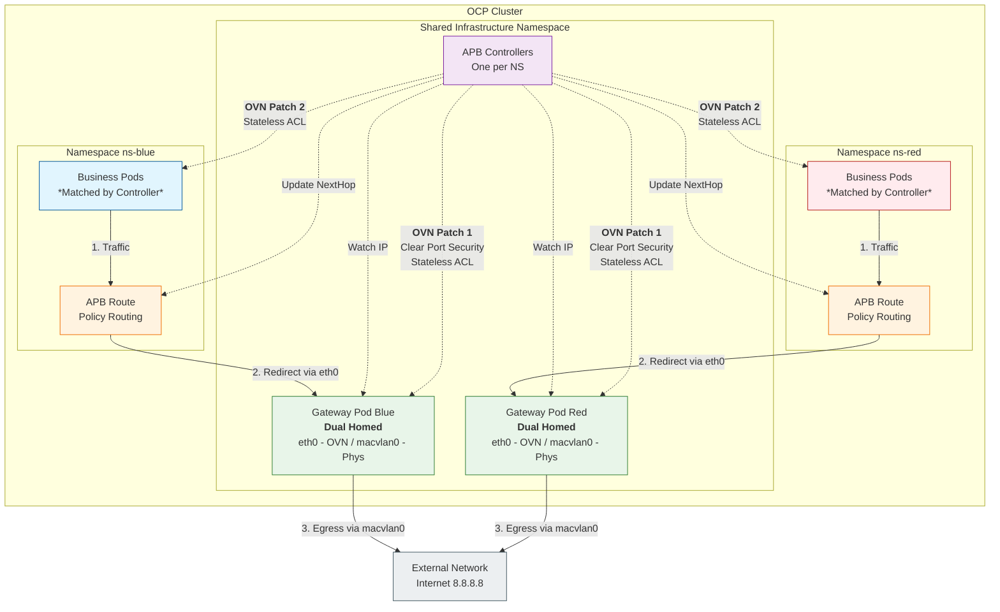

# OVN EgressIP Limitation Workaround

## Background

This document outlines a workaround implemented for a customer deploying OpenShift Container Platform (OCP) 4.18 on a third-party OpenStack environment using the baremetal installation method. 

**The Challenge:**
The underlying OpenStack platform imposes a strict limitation of 10 Elastic IPs per node. However, the security requirements mandate that each namespace must have a dedicated Egress IP, and there are over 40 namespaces planned. 

**The Limitation:**
The Elastic IP pools are distributed across different subnets, and worker nodes have varying associations with these subnets. The current OVN implementation for EgressIP does not support `nodeSelectors` to map specific EgressIP pools to specific nodes. Additionally, it generally supports only a single pool of Egress IPs.

**The Solution:**
To satisfy the requirement of a dedicated Egress IP per namespace, we implemented a "Gateway Pod" pattern:
1.  **Gateway Pod:** Deploy a dedicated Gateway Pod for each namespace to hold the Egress IP.
2.  **Traffic Steering:** Configure OVN to route traffic from the application namespace to its corresponding Gateway Pod.
3.  **Controller:** Use a custom controller (Tool Pod) to monitor the Gateway Pod's IP and dynamically update the OVN configuration (specifically the `AdminPolicyBasedExternalRoute`) if the Gateway Pod restarts or changes IP.

**Environment:**
-   **OCP Version:** 4.18
-   **Nodes:** 3 Masters, 2 Workers (`192.168.99.26`, `192.168.99.27`).
-   **Infrastructure:** A large RHEL 9 hypervisor hosting the 5 OCP nodes via KVM.
-   **Network:** No MAC address restrictions on the KVM network.

## OVN Architecture & Design Principles




### Why Patching is Required

The default security mechanisms in OpenShift OVN prevent this "Gateway Pod" scheme from functioning correctly. We must bypass specific checks to enable custom egress routing.

**Core Issues:**

1.  **Port Security Limitations**
    -   OVN enables Port Security by default, allowing a pod to send traffic *only* if the source IP matches its own assigned IP.
    -   The Gateway Pod needs to forward traffic originating from *other* pods (where the source IP is not the Gateway Pod's own IP).
    -   If Port Security is not cleared, OVN will drop the forwarded traffic.

2.  **Stateful ACL Source IP Checks**
    -   OVN uses stateful ACLs for connection tracking by default.
    -   When a Business Pod accesses an external IP (e.g., `8.8.8.8`) through the gateway, the return traffic has a source IP of `8.8.8.8`.
    -   Host-based Stateful ACLs may check this return traffic and drop it if it doesn't match expected flows.
    -   This causes failures for DNS queries, HTTPS requests, etc.

### What We Patch

We have modified OVN configurations (logic integrated into [controller.py](files/ovn.egressip/controller.py)) as follows:

**1. Gateway Pod Configuration**
```text
- Clear Port Security (allow-stateless)
  → Allows forwarding traffic where the source IP is not the pod's own.
  
- Add Stateless ACL (Priority 31821)
  → from-lport: Allow all outbound traffic.
  → to-lport: Allow all inbound traffic.
  → Bypasses OVN's strict source IP checking.
```

**2. Business Pod Configuration**
```text
- Keep Port Security (keep_port_security)
  → Maintain basic security; the pod can only send traffic masquerading as itself.
  
- Add Stateless ACL (Priority 31821)
  → from-lport: Allow all outbound traffic.
  → to-lport: Allow all inbound traffic.
  → Allows receiving return traffic from arbitrary external IPs.
```

**3. Intelligent ACL Cleanup**
```text
- Only delete "orphan" ACLs pointing to non-existent pods.
- Avoid accidentally deleting normal ACLs for other pods.
- Use custom priority 31821 to avoid conflicts with system ACLs.
```

### Benefits

✅ **Custom Limitless Egress Routing**
-   Bypasses the OVN EgressIP single-subnet limitation.
-   Supports a dedicated egress IP for every namespace.
-   Offers flexible node selector configurations.

✅ **Co-located Deployment Support**
-   Gateway pods and Business pods can reside on the same node.
-   The `accept_local` parameter resolves local routing issues.

✅ **Automated Management**
-   The Controller automatically applies and cleans up OVN configurations.
-   Automatic reconfiguration upon Pod restart.
-   Zero manual intervention required during operation.

### Risks and Trade-offs

⚠️ **Bypassing Network Policies**

**Scope of Impact:**
-   Using stateless ACLs bypasses parts of Kubernetes Network Policy enforcement.
-   Our priority `21743` is higher than standard Network Policy ACLs (usually `1000-2000`).
-   **Impact is limited only to patched pods** (Gateway Pods and Business Pods).

**Specific Effects:**
```text
Network Policy Function | Gateway Pod | Business Pod | Other Pods
------------------------|-------------|--------------|-----------
Egress Rules            | ❌ Bypassed  | ❌ Bypassed   | ✅ Normal
Ingress Rules           | ❌ Bypassed  | ❌ Bypassed   | ✅ Normal
Inter-Pod Restrictions  | ❌ Invalid   | ❌ Invalid    | ✅ Normal
```

**Mitigation:**
-   Deploy Gateway Pods in a dedicated infrastructure namespace.
-   Limit the number of pods in the Business Namespace.
-   Use RBAC to control who can create pods in these namespaces.
-   Implement additional IP-based access control (iptables) inside the Gateway Pod if necessary.

⚠️ **Port Security Risks**

**Gateway Pod (Port Security Cleared):**
-   Can send traffic with any source IP (IP spoofing).
-   Potential for abuse in network attacks.
-   **Mitigation**: Use privileged SCC restrictions; allow only specific ServiceAccounts.

**Business Pod (Port Security Kept):**
-   Can still only send traffic with its own IP.
-   Basic security is maintained.

⚠️ **OVN Database Modification**

-   Direct modification of the OVN database bypasses standard OpenShift processes.
-   Compatibility re-verification may be needed when upgrading OpenShift.
-   Controller anomalies could leave orphan ACLs (though intelligent cleanup mitigates this).

### Implementation Details

All the OVN patching logic described above is integrated into [controller.py](files/ovn.egressip/controller.py) and managed automatically via the Kubernetes controller pattern:

-   **Auto-Apply:** Configure OVN automatically when a Pod is created.
-   **Auto-Cleanup:** Clean up ACLs automatically when a Pod is deleted.
-   **Smart Management:** Only remove orphan ACLs to avoid collateral damage.
-   **High Availability:** Automatic restarts, exponential backoff, and double-layer exception handling.

## Workaround Implementation

### 1. Infrastructure Setup: Namespace and RBAC

First, we create the business namespace and the infrastructure namespace. We then establish the necessary ServiceAccounts and RBAC permissions for the controller.

```bash
# Create namespaces
oc create ns ns-blue
oc create ns ns-egress-infra

# Create ServiceAccount in the infra namespace
oc create sa apb-syncer -n ns-egress-infra

# Cleanup: Delete any old local rolebinding if it exists
oc delete rolebinding apb-syncer-binding -n ns-egress-infra --ignore-not-found


# 2. Create ClusterRole
# This role grants permissions to watch pods and manage OVN External Routes
cat <<EOF | oc apply -f -
apiVersion: rbac.authorization.k8s.io/v1
kind: ClusterRole
metadata:
  name: apb-cluster-manager
rules:
- apiGroups: [""]
  resources: ["pods"]
  verbs: ["get", "list", "watch"]
- apiGroups: [""]
  resources: ["pods/exec"]
  verbs: ["create"]
- apiGroups: ["k8s.ovn.org"]
  resources: ["adminpolicybasedexternalroutes"]
  verbs: ["get", "list", "watch", "patch", "update"]
EOF

# 3. Create ClusterRoleBinding
# Bind the SA 'apb-syncer' in 'ns-egress-infra' to the 'apb-cluster-manager' ClusterRole
cat <<EOF | oc apply -f -
apiVersion: rbac.authorization.k8s.io/v1
kind: ClusterRoleBinding
metadata:
  name: apb-syncer-cluster-binding
subjects:
- kind: ServiceAccount
  name: apb-syncer
  namespace: ns-egress-infra
roleRef:
  kind: ClusterRole
  name: apb-cluster-manager
  apiGroup: rbac.authorization.k8s.io
EOF
```

### 2. Network Preparation

We label the worker node to host the gateway and define the `NetworkAttachmentDefinition` for the `macvlan` interface that will provide the external Egress IP.

```bash
# Label the node where the gateway will run
oc label node worker-01-demo egress-node=ns-blue-group

# Create NetworkAttachmentDefinition for macvlan
# Note: This MUST be in the same namespace as the Gateway Pod
cat <<EOF | oc apply -f -
apiVersion: "k8s.cni.cncf.io/v1"
kind: NetworkAttachmentDefinition
metadata:
  name: ns-blue-external-macvlan
  namespace: ns-egress-infra 
spec:
  config: '{
      "cniVersion": "0.3.1",
      "type": "macvlan",
      "master": "enp2s0",
      "mode": "bridge",
      "ipam": {
        "type": "static"
      }
    }'
EOF
```

### 3. Gateway Pod Deployment

We configure a privileged ServiceAccount for the gateway and deploy the Gateway Pod. This pod utilizes a script to configure `sysctl`, `iptables`, and routing tables to function as a NAT gateway.

```bash
# Create dedicated SA for Gateway
oc create sa gateway-sa -n ns-egress-infra

# Grant privileged SCC to the SA so it can change network settings
oc adm policy add-scc-to-user privileged -z gateway-sa -n ns-egress-infra

# Deploy the Gateway
cat <<'EOF' | oc apply -f -
apiVersion: apps/v1
kind: Deployment
metadata:
  name: ns-blue-gateway
  namespace: ns-egress-infra
spec:
  replicas: 1 
  selector:
    matchLabels:
      app: ns-blue-gateway
  template:
    metadata:
      labels:
        app: ns-blue-gateway
      annotations:
        k8s.v1.cni.cncf.io/networks: '[
          {
            "name": "ns-blue-external-macvlan", 
            "interface": "macvlan0",
            "ips": ["192.168.99.2/24"]
          }
        ]'
    spec:
      serviceAccountName: gateway-sa
      nodeSelector:
        egress-node: ns-blue-group
      containers:
      - name: gateway
        image: registry.redhat.io/openshift4/ose-egress-router:latest
        command: ["/bin/sh", "-c"]
        args:
        - |
          # 0. Enable IP Forwarding & Disable Reverse Path Filtering
          sysctl -w net.ipv4.ip_forward=1
          sysctl -w net.ipv4.conf.all.rp_filter=0
          sysctl -w net.ipv4.conf.default.rp_filter=0
          sysctl -w net.ipv4.conf.eth0.rp_filter=0
          sysctl -w net.ipv4.conf.macvlan0.rp_filter=0

          # Critical: Allow receiving packets where the destination IP is not localhost
          sysctl -w net.ipv4.conf.eth0.accept_local=1
          sysctl -w net.ipv4.conf.all.accept_local=1
          
          # Ensure Forward chain is ACCEPT
          iptables -P FORWARD ACCEPT
          
          # 1. Save the original OVN Network Gateway
          OVN_GW=$(ip route show default | awk '/default/ {print $3}')
          
          # 2. Add routes for Pod Network and Service Network
          ip route add 10.0.0.0/8 via $OVN_GW dev eth0
          ip route add 172.16.0.0/12 via $OVN_GW dev eth0
          
          # 3. Ensure macvlan0 interface is up
          ip link set macvlan0 up
          
          # 4. Switch default route to point to the physical gateway
          ip route del default
          ip route add default via 192.168.99.1 dev macvlan0
          
          # Get the OVN IP of the gateway pod
          GW_OVN_IP=$(ip -4 addr show eth0 | grep -oP '(?<=inet\s)\d+(\.\d+){3}')
          
          # 5. Critical modification: Add policy routing to handle traffic from other pods
          # Use static route modification as policy routing tables were found to be ineffective in testing
          ip route del default
          ip route add default via 192.168.99.1 dev macvlan0
          
          # 6. SNAT Rules
          # Perform SNAT for egress traffic on eth0 (Internal traffic)
          iptables -t nat -A POSTROUTING -o eth0 -j SNAT --to-source $GW_OVN_IP
          
          # Perform SNAT for egress traffic on macvlan0 (External traffic)
          iptables -t nat -A POSTROUTING -o macvlan0 -j SNAT --to-source 192.168.99.2
          
          echo "Gateway started! Egress IP: 192.168.99.2, Physical GW: 192.168.99.1, OVN IP: $GW_OVN_IP";
          ip route show
          iptables -t nat -L -n -v
          
          # Prevent container exit
          sleep infinity;
        securityContext:
          privileged: true
EOF
```

## Automated Controller Deployment

The Controller manages OVN configurations and APB route synchronization automatically. The full source code is available here: [controller.py](files/ovn.egressip/controller.py).

**Core Features:**

1.  **APB Route Synchronization**
    -   Monitors the Gateway Pod's IP changes.
    -   Automatically updates the `nextHops` in `AdminPolicyBasedExternalRoute`.
    -   Prevents manual modifications from being overwritten (enforces state).

2.  **OVN Configuration Management**
    -   Automatically clears Port Security for Gateway Pods.
    -   Adds stateless ACLs for Business Pods and Gateway Pods.
    -   Intelligently cleans up orphan ACLs (removing only those pointing to non-existent pods).

3.  **High Availability**
    -   **Auto-recovery:** Recovers automatically from API errors.
    -   **Exponential Backoff:** Prevents resource exhaustion during persistent failures.
    -   **Robustness:** Protected by double-layer exception handling (Watch Stream and Event Handler).

4.  **Multi-Tenancy Support**
    -   All configurations are customizable via environment variables.
    -   Supports managing multiple namespace combinations.
    -   Configurable ACL priorities to prevent conflicts.

**Configuration:**
Configure the controller's behavior using environment variables. See the Deployment example below.

### Build and Deploy

This section builds the controller image and deploys it to the infrastructure namespace.

```bash
# Build and push controller image
tee controller.dockerfile <<EOF
FROM registry.access.redhat.com/ubi9/python-312

# Install Python dependencies
RUN pip install kubernetes

# Install OpenShift CLI (oc)
USER 0
RUN curl -L https://mirror.openshift.com/pub/openshift-v4/clients/ocp/stable/openshift-client-linux.tar.gz | \
    tar -xzf - -C /usr/local/bin/ oc && \
    chmod +x /usr/local/bin/oc

# Switch back to default user
USER 1001
EOF

podman build -f controller.dockerfile -t quay.io/wangzheng422/qimgs:apb-controller-2026.01.25-v01 .
podman push quay.io/wangzheng422/qimgs:apb-controller-2026.01.25-v01

# Create ConfigMap from the standalone controller.py file
# This assumes controller.py exists in the current directory
oc delete configmap apb-script -n ns-egress-infra --ignore-not-found
oc create configmap apb-script --from-file=controller.py -n ns-egress-infra

# Deploy Controller
cat <<EOF | oc apply -f -
apiVersion: apps/v1
kind: Deployment
metadata:
  name: apb-controller
  namespace: ns-egress-infra
spec:
  replicas: 1
  selector:
    matchLabels:
      app: apb-controller
  template:
    metadata:
      labels:
        app: apb-controller
    spec:
      serviceAccountName: apb-syncer
      containers:
      - name: controller
        image: quay.io/wangzheng422/qimgs:apb-controller-2026.01.25-v01
        command: ["/bin/sh", "-c", "python /mnt/controller.py"]
        env:
        # Gateway Configuration
        - name: GATEWAY_NAMESPACE
          value: "ns-egress-infra"
        - name: GATEWAY_LABEL
          value: "app=ns-blue-gateway"
        # Business Pod Configuration
        - name: BUSINESS_NAMESPACE
          value: "ns-blue"
        - name: BUSINESS_LABEL
          value: "app=business-app"
        # APB Configuration
        - name: APB_NAME
          value: "ns-blue-route"
        # OVN Configuration (optional, use defaults if not set)
        - name: OVN_NAMESPACE
          value: "openshift-ovn-kubernetes"
        - name: OVN_ACL_PRIORITY
          value: "21743"
        volumeMounts:
        - name: script
          mountPath: /mnt
      volumes:
      - name: script
        configMap:
          name: apb-script
EOF
```

### Apply Routing Policy and Deploy App

Apply the `AdminPolicyBasedExternalRoute` (which the controller will manage) and deploy the business application.

```bash
# Create the APB Route
# This policy directs traffic from the namespace match to the nextHop
cat <<EOF | oc apply -f -
apiVersion: k8s.ovn.org/v1
kind: AdminPolicyBasedExternalRoute
metadata:
  name: ns-blue-route
  namespace: ns-blue
spec:
  from:
    namespaceSelector:
      matchLabels:
        kubernetes.io/metadata.name: ns-blue
  nextHops:
    static:
    # This IP will be updated by apb-controller to match the gateway pod IP
    - ip: "192.168.99.1"
EOF


# Deploy the actual business application
cat <<EOF | oc apply -f -
apiVersion: apps/v1
kind: Deployment
metadata:
  name: business-app
  namespace: ns-blue
spec:
  replicas: 5
  selector:
    matchLabels:
      app: business-app
  template:
    metadata:
      labels:
        app: business-app
    spec:
      affinity:
        podAntiAffinity:
          preferredDuringSchedulingIgnoredDuringExecution:
          - weight: 100
            podAffinityTerm:
              labelSelector:
                matchExpressions:
                - key: app
                  operator: In
                  values:
                  - business-app
              topologyKey: kubernetes.io/hostname
      containers:
      - name: app
        image: quay.io/wangzheng422/qimgs:centos9-test-2025.12.18.v01
        command: ["/bin/sh", "-c", "sleep infinity"]
EOF
```

## Multi-Namespace Deployment Example

If you need to deploy independent controllers for multiple business namespaces, you can configure distinct instances via environment variables.

### Controller & Network Configuration

This example deploys a second controller for a red namespace (`ns-red`), ensuring it doesn't conflict with the blue deployment.

```bash
# Example: Deploy controller for ns-red namespace
cat <<EOF | oc apply -f -
apiVersion: apps/v1
kind: Deployment
metadata:
  name: apb-controller-red
  namespace: ns-egress-infra
spec:
  replicas: 1
  selector:
    matchLabels:
      app: apb-controller-red
  template:
    metadata:
      labels:
        app: apb-controller-red
    spec:
      serviceAccountName: apb-syncer
      containers:
      - name: controller
        image: quay.io/wangzheng422/qimgs:apb-controller-2026.01.25-v01
        command: ["/bin/sh", "-c", "python /mnt/controller.py"]
        env:
        # Gateway Configuration - Use the same infra namespace
        - name: GATEWAY_NAMESPACE
          value: "ns-egress-infra"
        - name: GATEWAY_LABEL
          value: "app=ns-red-gateway"  # Distinct gateway label
        # Business Pod Configuration - Distinct business namespace
        - name: BUSINESS_NAMESPACE
          value: "ns-red"
        - name: BUSINESS_LABEL
          value: "app=business-app"
        # APB Configuration - Distinct APB name
        - name: APB_NAME
          value: "ns-red-route"
        # OVN Configuration - Use different ACL priority to avoid conflict
        - name: OVN_ACL_PRIORITY
          value: "21743"  # Different priority
        volumeMounts:
        - name: script
          mountPath: /mnt
      volumes:
      - name: script
        configMap:
          name: apb-script
EOF


# Corresponding NetworkAttachmentDefinition for ns-red
cat <<EOF | oc apply -f -
apiVersion: "k8s.cni.cncf.io/v1"
kind: NetworkAttachmentDefinition
metadata:
  name: ns-red-external-macvlan
  namespace: ns-egress-infra  # Must be in the same namespace as the Gateway Pod
spec:
  config: '{
      "cniVersion": "0.3.1",
      "type": "macvlan",
      "master": "enp2s0",
      "mode": "bridge",
      "ipam": {
        "type": "static"
      }
    }'
EOF
```

### Gateway & Business Pods

Deploy the Gateway and Business logic for the red namespace.

```bash
# Corresponding Gateway Deployment for ns-red
cat <<'EOF' | oc apply -f -
apiVersion: apps/v1
kind: Deployment
metadata:
  name: ns-red-gateway
  namespace: ns-egress-infra
spec:
  replicas: 1 
  selector:
    matchLabels:
      app: ns-red-gateway
  template:
    metadata:
      labels:
        app: ns-red-gateway
      annotations:
        k8s.v1.cni.cncf.io/networks: '[
          {
            "name": "ns-red-external-macvlan", 
            "interface": "macvlan0",
            "ips": ["192.168.99.3/24"]
          }
        ]'
    spec:
      serviceAccountName: gateway-sa
      nodeSelector:
        egress-node: ns-blue-group
      containers:
      - name: gateway
        image: registry.redhat.io/openshift4/ose-egress-router:latest
        command: ["/bin/sh", "-c"]
        args:
        - |
          # 0. Enable IP Forwarding & Disable Reverse Path Filtering
          sysctl -w net.ipv4.ip_forward=1
          sysctl -w net.ipv4.conf.all.rp_filter=0
          sysctl -w net.ipv4.conf.default.rp_filter=0
          sysctl -w net.ipv4.conf.eth0.rp_filter=0
          sysctl -w net.ipv4.conf.macvlan0.rp_filter=0

          # Critical: Allow receiving packets where the destination IP is not localhost
          sysctl -w net.ipv4.conf.eth0.accept_local=1
          sysctl -w net.ipv4.conf.all.accept_local=1
          
          # Ensure Forward chain is ACCEPT
          iptables -P FORWARD ACCEPT
          
          # 1. Save the original OVN Network Gateway
          OVN_GW=$(ip route show default | awk '/default/ {print $3}')
          
          # 2. Add routes for Pod Network and Service Network
          ip route add 10.0.0.0/8 via $OVN_GW dev eth0
          ip route add 172.16.0.0/12 via $OVN_GW dev eth0
          
          # 3. Ensure macvlan0 interface is up
          ip link set macvlan0 up
          
          # 4. Switch default route to point to the physical gateway
          ip route del default
          ip route add default via 192.168.99.1 dev macvlan0
          
          # Get the OVN IP of the gateway pod
          GW_OVN_IP=$(ip -4 addr show eth0 | grep -oP '(?<=inet\s)\d+(\.\d+){3}')
          
          # 5. SNAT Rules
          # Perform SNAT for egress traffic on eth0 (Internal traffic)
          iptables -t nat -A POSTROUTING -o eth0 -j SNAT --to-source $GW_OVN_IP
          
          # Perform SNAT for egress traffic on macvlan0 (External traffic)
          iptables -t nat -A POSTROUTING -o macvlan0 -j SNAT --to-source 192.168.99.3
          
          echo "Gateway started! Egress IP: 192.168.99.3, Physical GW: 192.168.99.1, OVN IP: $GW_OVN_IP";
          ip route show
          iptables -t nat -L -n -v
          
          # Prevent container exit
          sleep infinity;
        securityContext:
          privileged: true
EOF

# Corresponding APB Policy for ns-red
cat <<EOF | oc apply -f -
apiVersion: k8s.ovn.org/v1
kind: AdminPolicyBasedExternalRoute
metadata:
  name: ns-red-route
spec:
  from:
    namespaceSelector:
      matchLabels:
        kubernetes.io/metadata.name: ns-red
  nextHops:
    static:
    - ip: "192.168.99.1"  # Will be automatically updated by controller
EOF

# Corresponding Business Pod for ns-red
cat <<EOF | oc apply -f -
apiVersion: apps/v1
kind: Deployment
metadata:
  name: business-app
  namespace: ns-red
spec:
  replicas: 5
  selector:
    matchLabels:
      app: business-app
  template:
    metadata:
      labels:
        app: business-app
    spec:
      affinity:
        podAntiAffinity:
          preferredDuringSchedulingIgnoredDuringExecution:
          - weight: 100
            podAffinityTerm:
              labelSelector:
                matchExpressions:
                - key: app
                  operator: In
                  values:
                  - business-app
              topologyKey: kubernetes.io/hostname
      containers:
      - name: app
        image: quay.io/wangzheng422/qimgs:centos9-test-2025.12.18.v01
        command: ["/bin/sh", "-c", "sleep infinity"]
EOF
```

### Configuration Reference

By utilizing environment variables, you can:

1.  **Manage Multiple Business Namespaces:** Deploy one Controller instance per business namespace.
2.  **Share Infrastructure Namespace:** Multiple controllers can co-exist in the same Gateway Infra namespace.
3.  **Prevent ACL Conflicts:** Assign a unique `OVN_ACL_PRIORITY` for each controller.
4.  **Flexible Label Selection:** Use `GATEWAY_LABEL` and `BUSINESS_LABEL` to target specific pod groups.

### Environment Variable Checklist

| Variable | Default | Description |
| :--- | :--- | :--- |
| `GATEWAY_NAMESPACE` | `ns-egress-infra` | Namespace where the Gateway Pod resides. |
| `GATEWAY_LABEL` | `app=ns-blue-gateway` | Label selector for the Gateway Pod. |
| `BUSINESS_NAMESPACE` | `ns-blue` | Namespace where the Business Pods reside. |
| `BUSINESS_LABEL` | `app=business-app` | Label selector for the Business Pods. |
| `APB_NAME` | `ns-blue-route` | Name of the `AdminPolicyBasedExternalRoute`. |
| `OVN_NAMESPACE` | `openshift-ovn-kubernetes` | Namespace where OVN components reside. |
| `OVN_POD_LABEL` | `app=ovnkube-node` | Label selector for OVN pods. |
| `OVN_CONTAINER` | `ovn-controller` | Name of the OVN container. |
| `OVN_ACL_PRIORITY` | `31821` | Priority for OVN ACL rules. |
