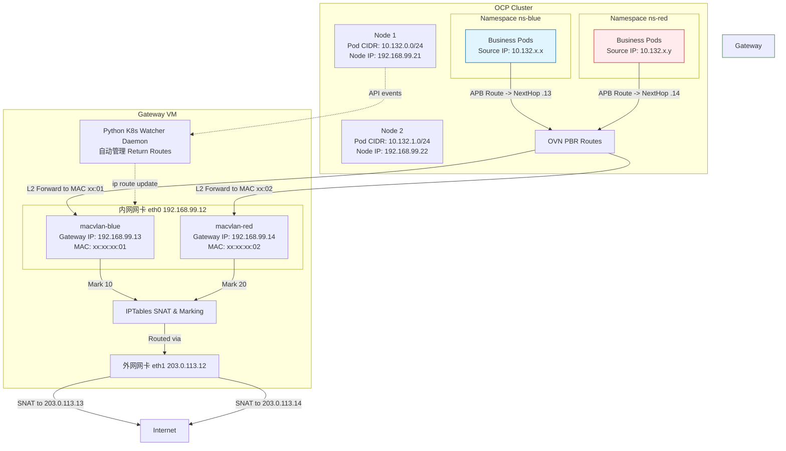

# OVN EgressIP 外部虚拟网关 (External Gateway VM) 动态路由与 SNAT 方案

## 背景与痛点

在某些底层基础设施（如受限的第三方 OpenStack 环境）上部署 OpenShift Container Platform (OCP) 4.18 时，往往会受到底层网络特性的限制。例如，平台每个节点只能绑定少量的弹性 IP（Elastic IP），而业务侧安全要求却需要为内部众多（例如 40+）命名空间（Namespace）分配独立的 Egress IP （出口公网 IP）。

OCP 自带的 OVN EgressIP 功能目前不支持通过 `nodeSelectors` 精细化地将特定的 IP 资源池分配给特定的物理节点，也难以应对单个节点 IP 配额受限的问题。

## 解决方案概述

为了在不打破底层云平台节点 IP 配额的前提下支持各租户/业务空间的独立 Egress IP，我们采用 **External Gateway VM（外部网关虚拟机）** 的模式来剥离 Egress IP 的分配：

1. **统一出口网关：** 在 OCP 集群外部配置一台独立的 Gateway VM，这台 VM 具备双网卡架构（一个内网 `eth0` 连接 OCP 集群，一个外网 `eth1` 连接公网），不受宿主机节点 Egress IP 数量限制。
2. **OCP 侧流量路由：** 在 OCP 内部利用 `AdminPolicyBasedExternalRoute` (APB) 功能，将来自于不同租户 Namespace 的出站流量，分别指派给 Gateway VM 上不同的**内部网关 IP**。
3. **网关流量标识拆分（MACVLAN）：** 为了让 Gateway VM 能够明确区分收到的流量来自于哪个 APB 策略（即来自哪个租户），Gateway VM 将在**内网网卡**上使用 `macvlan` 技术创建多个虚拟网卡。每个租户分配一个内部网关 IP 及对应的 MAC 地址。**注意：为防止与主机主网卡的路由（如 `192.168.99.0/24`）发生冲突并影响 FRR 等核心网络组件，这些 Macvlan 接口必须配置为 `/32` 掩码。**
4. **SNAT（源地址转换）：** 流量到达 Gateway VM 的租户专有虚拟网卡时，通过 `iptables` Mangle 表对数据包进行标记（MARK），然后在 POSTROUTING 阶段匹配标记，执行对应的 SNAT，将源地址转换为该租户专属的 **Egress IP**，并从**外网网卡**发包。
5. **动态回程路由监听：** APB 路由发出的流量，其源 IP 为 OCP 集群内部的 **Pod IP**。因此返回的流量在 Gateway VM 侧需要相应的 `ip route` 指向对应的 OCP 节点。为了应对 OCP 集群 Worker 节点的上下线、扩缩容，我们在 Gateway VM 上运行一个用 Python 编写的守护进程服务（Daemon）。该服务直接对接 OCP API Server，自动发现各节点的 Pod IP CIDR 范围（例如 `10.132.0.0/24 via 192.168.99.21`），并在 Gateway VM 上动态增删 IP 路由。

---

## 架构图解



---

## 详细配置步骤

### 1. 外部 Gateway VM 部署管理脚本

为了自动化配置 Gateway VM 级别的多租户隔离与动态路由，我们编写了一个 Python 脚本并打包放置在 `2026-02-24-egress-gw-manager` 目录中。

**前置依赖：**
需要安装 Kubernetes Python 客户端来监听 Kuberntes 节点事件。
```bash
pip3 install -r /Users/zhengwan/Desktop/dev/docker_env/redhat/ocp4/4.18/files/2026-02-24-egress-gw-manager/requirements.txt
```

同时，该脚本需要具备与 Kuberntes 交互的凭证，通常你可以通过设置环境变量来完成（例如拷贝 OCP 的 `kubeconfig` 到网关虚机的 `~/.kube/config`）。

### 2. OCP 集群侧配置 (AdminPolicyBasedExternalRoute)

为不同租户或 namespaces 引流到我们即将在 Gateway 上开设的网关 IP。这里我们给 Blue 租户设定 Next Hop 为 `192.168.99.13`，Red 租户设定为 `192.168.99.14`。

```bash
oc create ns ns-blue
oc create ns ns-red

cat <<EOF | oc apply -f -
apiVersion: apps/v1
kind: Deployment
metadata:
  name: business-app
  namespace: ns-red
spec:
  replicas: 2
  selector:
    matchLabels:
      app: business-app
  template:
    metadata:
      labels:
        app: business-app
    spec:
      affinity:
        podAntiAffinity:
          preferredDuringSchedulingIgnoredDuringExecution:
          - weight: 100
            podAffinityTerm:
              labelSelector:
                matchExpressions:
                - key: app
                  operator: In
                  values:
                  - business-app
              topologyKey: kubernetes.io/hostname
      containers:
      - name: app
        image: quay.io/wangzheng422/qimgs:centos9-test-2025.12.18.v01
        command: ["/bin/sh", "-c", "sleep infinity"]
EOF

cat <<EOF | oc apply -f -
apiVersion: apps/v1
kind: Deployment
metadata:
  name: business-app
  namespace: ns-blue
spec:
  replicas: 2
  selector:
    matchLabels:
      app: business-app
  template:
    metadata:
      labels:
        app: business-app
    spec:
      affinity:
        podAntiAffinity:
          preferredDuringSchedulingIgnoredDuringExecution:
          - weight: 100
            podAffinityTerm:
              labelSelector:
                matchExpressions:
                - key: app
                  operator: In
                  values:
                  - business-app
              topologyKey: kubernetes.io/hostname
      containers:
      - name: app
        image: quay.io/wangzheng422/qimgs:centos9-test-2025.12.18.v01
        command: ["/bin/sh", "-c", "sleep infinity"]
EOF
```

```yaml
# ns-blue-route.yaml
apiVersion: k8s.ovn.org/v1
kind: AdminPolicyBasedExternalRoute
metadata:
  name: ns-blue-route
spec:
  from:
    namespaceSelector:
      matchLabels:
        kubernetes.io/metadata.name: ns-blue
  nextHops:
    static:
    - ip: "192.168.99.13"
---
# ns-red-route.yaml
apiVersion: k8s.ovn.org/v1
kind: AdminPolicyBasedExternalRoute
metadata:
  name: ns-red-route
spec:
  from:
    namespaceSelector:
      matchLabels:
        kubernetes.io/metadata.name: ns-red
  nextHops:
    static:
    - ip: "192.168.99.14"
```

通过 `oc apply -f <filename>` 应用到 OCP 集群。此时集群内所有从 `ns-blue` 出去的访问，会直接以 Pod IP 作为源地址，发往 MAC 对应的 `192.168.99.13` 物理层。

### 3. Gateway VM 服务配置与运行

通过我们提供的 `ocp_egress_gw.py` 脚本，可以完全通过命令行管理这些租户配置和动态路由。

#### 步骤 A: 启动动态路由监听守护进程 (Daemon)

在后台使用 `root` 权限和正确的 `KUBECONFIG` 启动节点事件监听守护进程。这个守护进程会自动查询所有 Node 并配置相关的回程报文路由 `ip route add <pod_ip_cidr> via <node_ip> dev <内网网卡>`。后续新增或下线节点，路由表都会自动同步修改。

```bash
export KUBECONFIG=/root/.kube/config
python3 ocp_egress_gw.py daemon --dev enp1s0 &
```

> **注意:** 需要开放系统 `sysctl` 的 Forwarding 功能并关闭 Reverse Path Filter (`rp_filter = 0`) 来处理非对称路由场景。同时需要确保 Gateway VM 的默认路由是指向外网网卡 (`eth1`) 的。

#### 步骤 B: 增加相关租户配置与外部 Egress IP

通过 CLI 工具向 Gateway VM 注入租户设定，会自动完成内网网卡上的 `macvlan` 接口建立、网关 IP 设定以及基于标记 (Mark) 的外网网卡 IPTables SNAT 规则。

```bash
ip a
# 1: lo: <LOOPBACK,UP,LOWER_UP> mtu 65536 qdisc noqueue state UNKNOWN group default qlen 1000
#     link/loopback 00:00:00:00:00:00 brd 00:00:00:00:00:00
#     inet 127.0.0.1/8 scope host lo
#        valid_lft forever preferred_lft forever
#     inet6 ::1/128 scope host
#        valid_lft forever preferred_lft forever
# 2: enp1s0: <BROADCAST,MULTICAST,UP,LOWER_UP> mtu 1500 qdisc fq_codel state UP group default qlen 1000
#     link/ether 52:54:00:a4:4f:32 brd ff:ff:ff:ff:ff:ff
#     inet 192.168.99.12/24 brd 192.168.99.255 scope global noprefixroute enp1s0
#        valid_lft forever preferred_lft forever
#     inet6 fe80::5054:ff:fea4:4f32/64 scope link noprefixroute
#        valid_lft forever preferred_lft forever
# 3: enp7s0: <BROADCAST,MULTICAST,UP,LOWER_UP> mtu 1500 qdisc fq_codel state UP group default qlen 1000
#     link/ether 52:54:00:73:38:f7 brd ff:ff:ff:ff:ff:ff
#     inet 192.168.55.12/24 brd 192.168.55.255 scope global noprefixroute enp7s0
#        valid_lft forever preferred_lft forever
#     inet6 fe80::723:fe87:2520:b90d/64 scope link noprefixroute
#        valid_lft forever preferred_lft forever


# 添加 Blue 租户：内网网卡交互 IP 为 192.168.99.13，对外 Egress IP 为 203.0.113.13，防火墙标记 10
python3 ocp_egress_gw.py add-tenant --name ns-blue \
    --gw-ip 192.168.99.13 \
    --egress-ip 192.168.55.113 \
    --mark 10 --dev enp1s0 --out-dev enp7s0

# 添加 Red 租户：内网网卡交互 IP 为 192.168.99.14，对外 Egress IP 为 203.0.113.14，防火墙标记 20
python3 ocp_egress_gw.py add-tenant --name ns-red \
    --gw-ip 192.168.99.14 \
    --egress-ip 192.168.55.114 \
    --mark 20 --dev enp1s0 --out-dev enp7s0

# revert
python3 ocp_egress_gw.py remove-tenant --name ns-blue --mark 10 --egress-ip 192.168.55.113 --out-dev enp7s0

python3 ocp_egress_gw.py remove-tenant --name ns-red --mark 0x14 --egress-ip 192.168.55.114 --out-dev enp7s0


```

#### 步骤 C: 检查配置状态

命令行提供 `status` 命令查看机器上的路由表、MacVLAN 创建情况以及 IPTables：

```bash
python3 ocp_egress_gw.py status
```
*命令预期输出示例：*
```bash
--- MACVLAN Interfaces ---
macvlan-ns-blue@enp1s0 UP             ce:4a:63:57:b2:78 <BROADCAST,MULTICAST,UP,LOWER_UP>
macvlan-ns-red@enp1s0 UP             c2:aa:17:c5:35:84 <BROADCAST,MULTICAST,UP,LOWER_UP>

--- IP Routing Table (Pod CIDRs) ---
default via 192.168.99.1 dev enp1s0 proto static metric 100

--- Mangle Rules (Packet Marking) ---
0     0 MARK       all  --  macvlan-ns-red *       0.0.0.0/0            0.0.0.0/0            MARK set 0x14
  236 38239 MARK       all  --  macvlan-ns-blue *       0.0.0.0/0            0.0.0.0/0            MARK set 0xa

--- NAT Rules (SNAT) ---
0     0 SNAT       all  --  *      enp7s0  0.0.0.0/0            0.0.0.0/0            mark match 0x14 to:192.168.55.114
    0     0 SNAT       all  --  *      enp7s0  0.0.0.0/0            0.0.0.0/0            mark match 0xa to:192.168.55.113
```

### 4. 其它说明与局限性处理

**节点可用性问题 (MACVLAN 与 Node 下线)**
有了动态监控 K8s Node API 的 Python 脚本，我们解决了“由于 Node 下线导致单点路由回包失败”的问题。因为 OVN 环境下的 Pod Source IP 返回时，在 Gateway 端本来是必须要通过静态路由指向其中一台宿主机的。有了动态监听后：
1. 监控到节点变化 `ADDED` / `MODIFIED` 时，Python 程序根据最新的 Node `InternalIP` 重写 PodCIDR 对应的路由表。
2. 即使单个宿主机迁移或宕机，Pod 漂移到新的节点并在新节点获得该节点对应段的 PodIP 时，由于目标 PodIP 所属的 CIDR 段发生了自然变动（取决于所在节点），Gateway VM 将根据完整的、已经全部同步给 Linux Kernel 的 `ip route <PodCIDR> via <Node_IP>` 完成准确无误的回程送达。

通过该方案，管理员极大规避了原始静态路由配置下的扩展性与可用性受限的情况。源码和配置结构已经在同级 `2026-02-24-egress-gw-manager` 目录提供，可作为生产打包服务 (systemd) 进行持续驻留运行。

**避免 MACVLAN 引起的路由表混乱与 FRR 崩溃**
如果 Gateway VM 上还运行了 FRR（处理 BGP/OSPF）或需要正常的网关网络通行，直接在被设为 `.13` 和 `.14` 的 `macvlan` 接口上绑定传统的 `/24` 掩码会导致严重的灾难：Linux 内核会为每一个租户自动生成一条直连路由 `192.168.99.0/24 dev macvlan-ns-xxx` 插入主路由表中，导致主网卡 `enp1s0` 的流量被分散或劫持（ARP Flux 与不对称路由），引起外网连通性时断时续和 FRR 邻居关系的断开。
在此方案中，我们特别调整 `ocp_egress_gw.py` 工具，将其绑定的 IP 地址掩码强制设为 `/32`（例如 `ip addr add 192.168.99.13/32 dev macvlan-ns-blue`）。这种做法既可以让它回答对应主机的 ARP，又完全不会生成与主网卡冲突的 `192.168.99.0/24` 网段路由，从而有效维护了整个系统路由表的稳定。

**解决 ARP 漂移导致的 PREROUTING 规则失效 (ARP Flux)**
在使用多 MacVLAN 绑定在同一个底层网络接口（如 `enp1s0`）时，默认的 Linux ARP 行为会导致所有外部送往 网关IP（如 `192.168.99.13`）的 ARP Request 都被底层物理网卡（`enp1s0`）自身的物理 MAC 回复。这会导致流量从 `enp1s0` 接口流入内核，完全避开了针对 `-i macvlan-XXX` 设定的 IPTables PREROUTING Marking 规则。
为了解决这个著名的 ARP Flux 问题以确保 SNAT 链路正常工作，我们已经在 `ocp_egress_gw.py` 中强制应用了严格的 ARP 隔离内核参数：
```bash
sysctl -w net.ipv4.conf.all.arp_ignore=1
sysctl -w net.ipv4.conf.all.arp_announce=2
sysctl -w net.ipv4.conf.enp1s0.arp_ignore=1
sysctl -w net.ipv4.conf.enp1s0.arp_announce=2
```
这将强制只有绑定了对应 IP 的 `macvlan` 接口才能回应 ARP 并宣告其实际虚拟 MAC，保证进出流量正确映射。在新建租户时，脚本还会从特定的 MAVLAN 发起一次针对本网段的 Ping 以强制刷新同网段交换机、路由器的本地 ARP 表。
