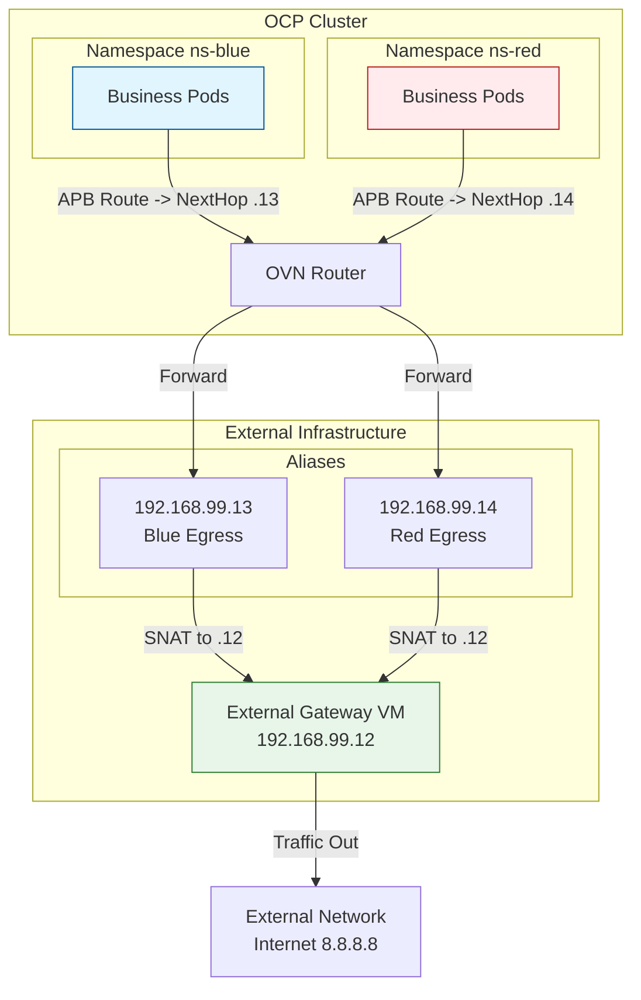

# OVN EgressIP Limitation Workaround

## Background

This document outlines a workaround implemented for a customer deploying OpenShift Container Platform (OCP) 4.18 on a third-party OpenStack environment using the baremetal installation method. 

**The Challenge:**
The underlying OpenStack platform imposes a strict limitation of 10 Elastic IPs per node. However, the security requirements mandate that each namespace must have a dedicated Egress IP, and there are over 40 namespaces planned. 

**The Limitation:**
The Elastic IP pools are distributed across different subnets, and worker nodes have varying associations with these subnets. The current OVN implementation for EgressIP does not support `nodeSelectors` to map specific EgressIP pools to specific nodes. Additionally, it generally supports only a single pool of Egress IPs.

**The Solution:**
To satisfy the requirement of a dedicated Egress IP per namespace without the limitations of OpenStack Elastic IPs on worker nodes, we implemented an **External Gateway VM** pattern:
1.  **External Gateway:** A standalone VM (outside the OpenShift cluster) holds the Egress IPs as secondary aliases.
2.  **Traffic Steering:** Configure OVN `AdminPolicyBasedExternalRoute` to route traffic from specific namespaces to the External Gateway's secondary IPs.
3.  **NAT/Forwarding:** The External Gateway performs SNAT (Masquerade) to forward traffic to the internet.

**Environment:**
-   **OCP Version:** 4.18
-   **Gateway VM:** RHEL/CentOS VM (`192.168.99.12`) with multiple IPs.
-   **Network:** L2 connectivity between OCP nodes and Gateway VM.

## Architecture



## Implementation

### 1. Configure External Gateway VM
Perform the following on the external VM (e.g., `192.168.99.12`).

**1.1 Configure Secondary IPs**
Add the dedicated Egress IPs for your namespaces.
```bash
# Example: Adding IPs for ns-blue and ns-red
ip addr add 192.168.99.13/24 dev enp1s0 label enp1s0:1
ip addr add 192.168.99.14/24 dev enp1s0 label enp1s0:2
```

**1.2 Enable IP Forwarding**
```bash
sysctl -w net.ipv4.ip_forward=1
# Make persistent in /etc/sysctl.d/99-fwd.conf if needed
```

**1.3 Disable Reverse Path Filtering (Critical)**
Asymmetric routing may occur; disabling `rp_filter` ensures packets aren't dropped.
```bash
sysctl -w net.ipv4.conf.all.rp_filter=0
sysctl -w net.ipv4.conf.default.rp_filter=0
sysctl -w net.ipv4.conf.enp1s0.rp_filter=0
```

**1.4 Configure Routes to OpenShift**
The VM needs to know how to send return traffic back to the Pods (`10.132.0.0/14`) and Services (`172.22.0.0/16`). Point these to an OCP Node IP (e.g., `192.168.99.23`).
```bash
ip route add 10.132.0.0/14 via 192.168.99.23 dev enp1s0
ip route add 172.22.0.0/16 via 192.168.99.23 dev enp1s0
```
> [!CAUTION]
> **Single Point of Failure (SPOF)**
> The return route above points to a **single** OpenShift Node (`.23`).
> 1.  If this node fails, the EgressIP return path breaks for **all** pods using this Gateway.
> 2.  If the pod moves to another node, traffic **may fail** if the new node cannot route return traffic received on `.23` (or if `.23` is down).
>
> **For Production:** You must ensure high availability for the return path, for example by pointing to an **External Load Balancer VIP** that distributes traffic to all OCP nodes, or using BGP/Dynamic Routing.
```

**1.5 Configure SNAT (Masquerade)**
```bash
# Flush existing rules if needed (Be careful!)
# iptables -F && iptables -t nat -F

# Masquerade traffic from OCP Pods
iptables -t nat -A POSTROUTING -s 10.132.0.0/14 -o enp1s0 -j SNAT --to-source 192.168.99.12
```

> [!WARNING]
> Ensure `firewalld` does not conflict. You may need to stop it or configure it to allow Masquerading and Forwarding.
> `systemctl stop firewalld`

### 2. Configure OpenShift
Apply the `AdminPolicyBasedExternalRoute` to steer traffic.

**2.1 Create Namespaces**
```bash
oc create ns ns-blue
oc create ns ns-red
```

**2.2 Apply APB Routes**

```yaml
# ns-blue-route.yaml
apiVersion: k8s.ovn.org/v1
kind: AdminPolicyBasedExternalRoute
metadata:
  name: ns-blue-route
spec:
  from:
    namespaceSelector:
      matchLabels:
        kubernetes.io/metadata.name: ns-blue
  nextHops:
    static:
    - ip: "192.168.99.13"
---
# ns-red-route.yaml
apiVersion: k8s.ovn.org/v1
kind: AdminPolicyBasedExternalRoute
metadata:
  name: ns-red-route
spec:
  from:
    namespaceSelector:
      matchLabels:
        kubernetes.io/metadata.name: ns-red
  nextHops:
    static:
    - ip: "192.168.99.14"
```

Apply with `oc apply -f <filename>`.

## Verification

### Automated Verification Script
Use the following script to verify connectivity.

```bash
#!/bin/bash
# 1. Start tcpdump on Gateway VM
ssh root@192.168.99.12 "timeout 15 tcpdump -nne -i enp1s0 icmp" > /tmp/vm_capture.txt 2>&1 &
PID_TCPDUMP=$!
sleep 2

# 2. Generate Traffic
echo "Pinging from ns-blue..."
oc run fast-test-blue -n ns-blue --rm -i --image=curlimages/curl -- ping -c 2 8.8.8.8
echo "Curling from ns-blue..."
oc run fast-test-blue-curl -n ns-blue --rm -i --image=curlimages/curl -- curl -I -s --connect-timeout 5 https://www.google.com

echo "Pinging from ns-red..."
oc run fast-test-red -n ns-red --rm -i --image=curlimages/curl -- ping -c 2 8.8.8.8
echo "Curling from ns-red..."
oc run fast-test-red-curl -n ns-red --rm -i --image=curlimages/curl -- curl -I -s --connect-timeout 5 https://www.google.com

# 3. Analyze
wait $PID_TCPDUMP
cat /tmp/vm_capture.txt
```

### Expected Results
1.  **Pod Connectivity:** Ping should succeed (0% packet loss).
2.  **Traffic Capture:** `tcpdump` should show:
    -   Incoming packets from Pod IPs to `8.8.8.8`.
    -   Outgoing packets from `192.168.99.12` to `8.8.8.8` (SNAT working).

## Verification Findings

> [!NOTE]
> **Why do we need to SNAT the Pod CIDR?**
> A common question is: *"Shouldn't the traffic source IP be the Node IP when it leaves OpenShift?"*
>
> **Answer:** No. When using `AdminPolicyBasedExternalRoute` with a local next-hop, OVN uses **Policy Based Routing (PBR)**.
>
> **Technical Flow:**
> 1.  **Reroute Policy:** OVN intercepts the traffic from the pod based on the policy match.
> 2.  **Next Hop:** It sets the registered Next Hop (`192.168.99.13`) directly.
> 3.  **SNAT Bypass:** This policy routing path **bypasses the standard Gateway Router SNAT** logic (which normally masks traffic to the Node IP).
> 4.  **Result:** The packet exits the node with the original **Pod IP**.
>
> **Evidence 1: OVN Static Route (Policy Based)**
> The `AdminPolicyBasedExternalRoute` controller implements this by creating a **Logical Router Static Route** with `policy="src-ip"`.
>
> **Command:**
> ```bash
> ovn-nbctl list logical_router_static_route | grep -B 5 -A 5 "192.168.99.13"
> ```
>
> **Output (NB DB):**
> ```text
> _uuid               : 9fd52347-47ca-4be0-88ff-22bb7643e4e3
> ip_prefix           : "10.134.0.13/32"       <-- Match Source Pod IP
> nexthop             : "192.168.99.13"        <-- Route to External Gateway
> policy              : src-ip                 <-- Enable Source-Based Routing
> output_port         : rtoe-GR_master-01-demo
> ```
> **Conclusion:** This specific `src-ip` route takes precedence over default gateway routes and bypasses the standard SNAT logic on the Gateway Router.

>
> **Evidence 2: Connection Tracking (tcpdump on Gateway VM)**
> The following capture on the Gateway VM (`192.168.99.12`) shows the raw packet flow.
> - **Timestamp:** 11:53:00.071999
> - **Source:** `10.134.0.13` (The Pod IP)
> - **Destination:** `8.8.8.8` (Google DNS)
>
> ```text
> [root@gateway ~]# tcpdump -nne -i enp1s0 icmp and host 8.8.8.8
> 11:53:00.071999 00:50:56:8e:2a:31 > 52:54:00:a4:4f:32, ethertype IPv4 (0x0800), length 98: 10.134.0.13 > 8.8.8.8: ICMP echo request, id 12, seq 0, length 64
> 11:53:00.078269 52:54:00:a4:4f:32 > 00:50:56:8e:2a:31, ethertype IPv4 (0x0800), length 98: 8.8.8.8 > 10.134.0.13: ICMP echo reply, id 12, seq 0, length 64
> ```
> **Crucially:** The source IP is preserved as `10.134.0.13` (Pod IP), confirming that OpenShift's standard Node-SNAT was bypassed.
>
> **Evidence 3: OVN Pipeline (Proof by Omission)**
> In the OVN Logical Flow pipeline (`lr_out_snat`), standard pods have explicit SNAT rules (Priority 33). The pod managed by APB `10.134.0.13` is **removed** from this SNAT table.
>
> **Command:** Use `ovn-sbctl lflow-list <GR_DATAPATH> | grep lr_out_snat`
> **Output:**
> ```text
> table=3 (lr_out_snat), priority=33, match=(ip4.src == 10.134.0.10 ...), action=(ct_snat(192.168.99.23...))
> table=3 (lr_out_snat), priority=33, match=(ip4.src == 10.134.0.11 ...), action=(ct_snat(192.168.99.23...))
> ... (10.134.0.13 IS MISSING) ...
> table=3 (lr_out_snat), priority=0 , match=(1), action=(next;)  <-- Fallback: No SNAT
> ```
> Because the specific SNAT rule for `10.134.0.13` is absent, the packet falls through to Priority 0, which simply forwards it without modifying the source IP.
>
> **Design Intent:** `AdminPolicyBasedExternalRoute` is primarily designed for Telco/NFV use cases (e.g., UPF Steering) where the external gateway **needs** to see the original subscriber IP to enforce policies or billing. It deliberately disables Node SNAT to preserve this visibility, which trade-offs with High Availability simplicity.

## Troubleshooting
-   **No Connectivity?**
    -   Check `sysctl net.ipv4.ip_forward`.
    -   Check `sysctl net.ipv4.conf.all.rp_filter` (Must be 0).
    -   Check firewall: `systemctl status firewalld`.
    -   Verify OCP Node can ping Gateway IPs (`.13`, `.14`).
    -   Verify VM has routes back to `10.132.0.0/14`.

## Dynamic Gateway Architecture (Experimental)

This section documents an alternative architecture using a `hostNetwork` Pod to act as a dynamic gateway. This approach aims to solve the SPOF issue by allowing any node running the gateway pod to handle egress traffic with local SNAT.

### 1. Architecture Design
-   **Gateway Pod**: A privileged Pod carrying `hostNetwork: true`. It runs on worker nodes.
-   **Traffic Flow**: Pod -> OVN -> Node (Gateway Pod) -> SNAT (Masquerade) -> External VM.
-   **Benefit**: Traffic appears to come from the Node IP, simplifying return routes and enabling ECMP/HA.

### 2. Implementation Details

#### Gateway Pod Configuration (`gateway-pod.yaml`)
Use a UBI9 image to ensure `iptables`, `iproute`, and `tcpdump` are available.

```yaml
apiVersion: apps/v1
kind: Deployment
metadata:
  name: gateway-pod
  namespace: ovn-gateway
  labels:
    app: gateway-pod
spec:
  replicas: 1
  selector:
    matchLabels:
      app: gateway-pod
  template:
    metadata:
      labels:
        app: gateway-pod
    spec:
      hostNetwork: true
      nodeSelector:
        kubernetes.io/hostname: master-01-demo
      containers:
      - name: gateway
        image: registry.access.redhat.com/ubi9/ubi
        command: ["/bin/sh", "-c"]
        args:
        - |
          # Install packages for debugging and routing
          dnf install -y iptables iproute tcpdump

          # Enable IP Forwarding
          sysctl -w net.ipv4.ip_forward=1 || true

          # CRITICAL: Relax RP Filter on br-ex to allow Asymmetric Routing
          # Traffic enters via br-ex but standard OVN routing might expect ovn-k8s-mp0
          sysctl -w net.ipv4.conf.br-ex.rp_filter=2 || true

          # Setup SNAT for Pod Traffic (10.132.0.0/14) at the TOP of the chain
          # This ensures traffic leaves the node with the Node IP
          iptables -t nat -I POSTROUTING 1 -s 10.132.0.0/14 -j MASQUERADE

          # Setup Policy Based Routing (PBR)
          # Force pod traffic to use a custom table ensuring it goes to the External VM
          ip rule add from 10.132.0.0/14 table 200
          ip route add default via 192.168.99.12 table 200

          echo "Gateway Pod Started on $(hostname) with IP $(hostname -I)"
          sleep infinity
        securityContext:
          privileged: true
          capabilities:
            add: ["NET_ADMIN"]
```

#### Dynamic Route Configuration (`apb-dynamic-route.yaml`)
```yaml
apiVersion: k8s.ovn.org/v1
kind: AdminPolicyBasedExternalRoute
metadata:
  name: ns-blue-dynamic-route
spec:
  from:
    namespaceSelector:
      matchLabels:
        kubernetes.io/metadata.name: ns-blue
  nextHops:
    dynamic:
    - podSelector:
        matchLabels:
          app: gateway-pod
      namespaceSelector:
        matchLabels:
          kubernetes.io/metadata.name: ovn-gateway
      bfdEnabled: false
```

### 3. Key Findings & Challenges
1.  **SCC Constraints**: The Gateway Pod requires `privileged` SCC to manipulate host `iptables` and `sysctl`.
2.  **Reverse Path Filter (rp_filter)**: Traffic from `AdminPolicyBasedExternalRoute` arriving at the node via `br-ex` was dropped by strict RP filtering. Setting `net.ipv4.conf.br-ex.rp_filter=2` (Loose mode) is required.
3.  **SNAT Precedence**: OVN rules might bypass standard `POSTROUTING` chains. Inserting the `MASQUERADE` rule at position 1 (`-I POSTROUTING 1`) is necessary to ensure it hits.
4.  **Pod Scheduling**: Rapid updates to `Deployment` manifest led to race conditions with Pod termination. Proper cleanup (`oc delete pod --all`) was often required.

### 4. Verification Status
-   **Success**: The PBR rules and SNAT rules are correctly applied within the Gateway Pod.
-   **Pending**: Final end-to-end connectivity verification. The packet capture on the external VM needs to confirm that the source IP is indeed the Node IP (`192.168.99.23`).

```bash
# Verification Script Summary
# 1. Start tcpdump on External VM
ssh root@192.168.99.12 "tcpdump -nne -i enp1s0 icmp"

# 2. Ping from Source Pod
oc exec -n ns-blue fast-test -- ping 8.8.8.8

# 3. Expected Result
# The VM should see ICMP requests from 192.168.99.23 (Node IP), NOT 10.134.x.x (Pod IP).
```

## FAQ: Return Traffic & High Availability

**Q: If I use standard OVN EgressIP, does the return traffic route (from the router) create a Single Point of Failure (SPOF)?**

**A: No.** 
Unlike the manual "Gateway Pod" approach where you might have configured a static route pointing to a specific Node IP (blocking HA), standard OVN EgressIPs are **Virtual IPs** (Floating IPs).

1.  **Dynamic Failover:** OVN monitors node health. If the node holding the EgressIP fails, OVN automatically reassigns that EgressIP to a different healthy node.
2.  **Gratuitous ARP (GARP):** When the EgressIP starts up on the new node, that node broadcasts a **Gratuitous ARP** packet.
3.  **Router Updates Automatically:** The upstream physical router/switch sees this GARP and updates its ARP table (mapping `EgressIP` -> `New Node MAC`). 
4.  **No Static Routes:** You do **not** need to configure static routes on your physical router pointing to specific Node IPs. The router just needs to know that the EgressIP subnet exists on that network segment.

**Q: Can I use ECMP (Equal-Cost Multi-Path) on the router for return traffic to a single EgressIP?**
**A: Generally, No.**
A specific IP address usually exists on one MAC address at a time in L2 networks. OVN assigns a specific EgressIP to **one** node at a time (Active-Passive).
*   **Load Balancing:** OVN achieves load balancing by distributing **multiple different** EgressIPs across different nodes, not by splitting traffic for a single IP.
*   **External Traffic Policy:** If you need ECMP for *ingress* (return) traffic, you typically use a `LoadBalancer` Service (MetalLB / BGP) rather than an EgressIP.

## Migration Strategy: Shared External NAT Gateway

**Scenario:** You have two clusters (Old and New) running simultaneously during a migration. Both need to present the **same** Public Egress IP to the internet (e.g., for firewall whitelisting), but they are separate clusters.

**Solution:** Use an **External NAT Gateway** (Intermediate Node/VM/Router) to aggregate traffic.

### Architecture
1.  **Cluster Old**: Configured with Internal Egress IP `10.0.0.1`.
2.  **Cluster New**: Configured with Internal Egress IP `10.0.0.2`.
3.  **External Gateway**:
    *   Connects to both clusters (L2 or L3).
    *   Holds the **Final Public Egress IP** (e.g., `203.0.113.80`).
    *   Default Gateway for the "Internal Egress IPs" is set to this External Gateway.

### Traffic Flow
1.  **Cluster Old** sends traffic: `Src=10.0.0.1` -> `Dest=Internet`.
2.  **Cluster New** sends traffic: `Src=10.0.0.2` -> `Dest=Internet`.
3.  **External Gateway** receives traffic.
4.  **External Gateway** performs **SNAT** (Masquerade):
    *   `10.0.0.1` -> `203.0.113.80`
    *   `10.0.0.2` -> `203.0.113.80`
5.  **Internet** receives traffic from `203.0.113.80`.
6.  **Return Traffic:** The External Gateway's connection tracking table maps the return traffic back to the correct internal cluster (`10.0.0.1` or `10.0.0.2`) automatically.

### Feasibility check
*   **Feasible?** **YES.** This is a standard "NAT Aggregation" pattern.
*   **Requirement:** The two clusters **MUST** use **different** internal Egress IPs (Intermediate IPs) to avoid ARP conflicts and routing ambiguity on the shared network segment.
*   **Result:** The destination server sees only the single Public IP (`203.0.113.80`) regardless of which cluster originated the request.


