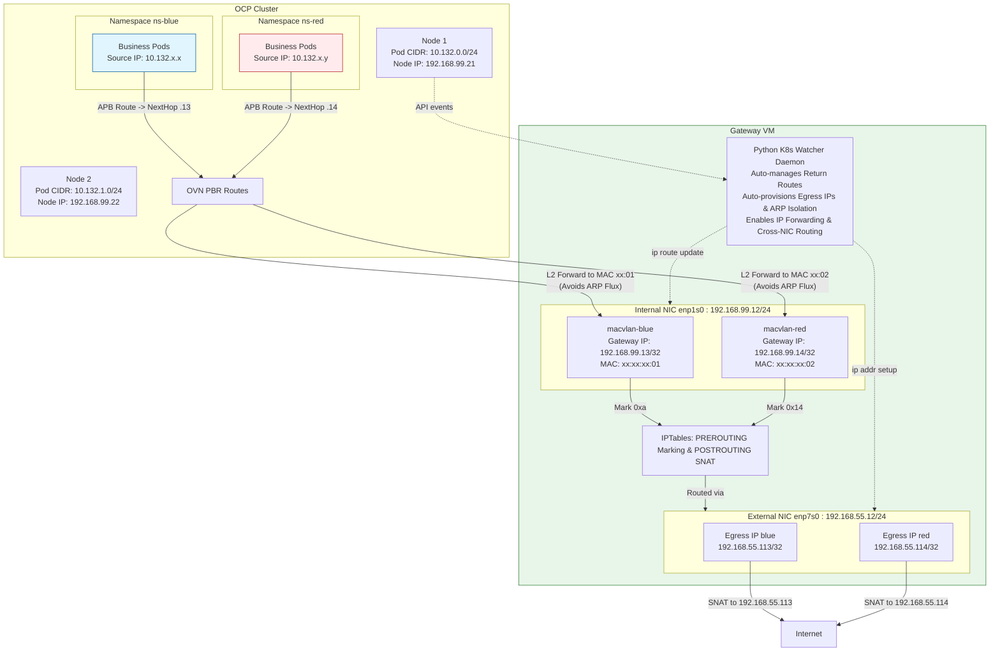

# OVN EgressIP External Gateway VM: Dynamic Routing & SNAT Solution

## Background and Pain Points

When deploying OpenShift Container Platform (OCP) 4.18 on certain infrastructure platforms (such as restricted third-party OpenStack environments), underlying network limitations often pose significant challenges. For instance, each node may only be allowed to bind a limited number of Floating IPs/Elastic IPs. However, business security requirements often demand independent Egress IPs for a large number of namespaces (e.g., 40+ namespaces).

The native OVN-Kubernetes EgressIP feature currently lacks the granularity to assign specific IP resource pools to specific physical nodes via `nodeSelectors` effectively. It also struggles to handle scenarios where single-node IP quotas are highly constrained.

## Solution Overview

To support independent Egress IPs for various tenants/namespaces without exceeding the underlying cloud platform's node IP quotas, we implement an **External Gateway VM** model to decouple Egress IP allocation from the OCP nodes:

1.  **Unified Egress Gateway**: A dedicated Gateway VM is configured outside the OCP cluster. This VM utilizes a dual-NIC architecture: an internal interface (`enp1s0`) connecting to the OCP cluster and an external interface (`enp7s0`) connecting to the public network. This setup bypasses the Egress IP quantity limitations imposed on individual host nodes.
2.  **OCP-Side Traffic Routing**: Within OCP, the `AdminPolicyBasedExternalRoute` (APB) feature is leveraged to direct outbound traffic from different tenant namespaces to specific **internal gateway IPs** hosted on the Gateway VM.
3.  **Traffic Isolation via MACVLAN**: To allow the Gateway VM to distinguish which APB policy (and thus which tenant) the incoming traffic belongs to, multiple virtual interfaces are created on the **internal NIC** using `macvlan` technology. Each tenant is assigned a unique internal gateway IP and a corresponding MAC address.
    > [!IMPORTANT]
    > To prevent routing conflicts with the host's primary network (e.g., `192.168.99.0/24`) and protect core network components like FRR, these Macvlan interfaces MUST be configured with a `/32` subnet mask.
4.  **Source NAT (SNAT)**: When traffic reaches a tenant-specific virtual interface on the Gateway VM, it is tagged using the `iptables` Mangle table. In the `POSTROUTING` stage, the tag is matched to perform the corresponding SNAT, translating the source address to the tenant's dedicated **Egress IP** before egressing through the **external NIC**.
5.  **Dynamic Return Route Monitoring**: Since traffic routed via APB retains the internal **Pod IP** as the source, the Gateway VM requires return routes pointing back to the respective OCP nodes. To handle OCP Worker node lifecycle events (joins, leaves, or scaling), a Python-based daemon runs on the Gateway VM. This daemon interfaces with the OCP API Server to automatically discover node PodCIDR ranges (e.g., `10.132.0.0/24 via 192.168.99.21`) and dynamically manages IP routes on the Gateway VM.

---

## Architecture Diagram



---

## Detailed Configuration Steps

### 1. External Gateway VM Management Script

To automate the configuration of multi-tenant isolation and dynamic routing at the Gateway VM level, we utilize a Python script located in the `2026-02-24-egress-gw-manager` directory.

**Prerequisites:**
Install the Kubernetes Python client to monitor node events.
```bash
pip3 install -r /Users/zhengwan/Desktop/dev/docker_env/redhat/ocp4/4.18/files/2026-02-24-egress-gw-manager/requirements.txt
```

Additionally, the script requires credentials to interact with the Kubernetes API, typically provided via a `kubeconfig` file (e.g., copied to `~/.kube/config` on the Gateway VM).

### 2. OCP Cluster-Side Configuration (AdminPolicyBasedExternalRoute)

Redirect traffic from different tenants or namespaces to the gateway IPs hosted on the Gateway VM. In this example, we set the Next Hop for the Blue tenant to `192.168.99.13` and for the Red tenant to `192.168.99.14`.

```bash
oc create ns ns-blue
oc create ns ns-red

cat <<EOF | oc apply -f -
apiVersion: apps/v1
kind: Deployment
metadata:
  name: business-app
  namespace: ns-red
spec:
  replicas: 2
  selector:
    matchLabels:
      app: business-app
  template:
    metadata:
      labels:
        app: business-app
    spec:
      affinity:
        podAntiAffinity:
          preferredDuringSchedulingIgnoredDuringExecution:
          - weight: 100
            podAffinityTerm:
              labelSelector:
                matchExpressions:
                - key: app
                  operator: In
                  values:
                  - business-app
              topologyKey: kubernetes.io/hostname
      containers:
      - name: app
        image: quay.io/wangzheng422/qimgs:centos9-test-2025.12.18.v01
        command: ["/bin/sh", "-c", "sleep infinity"]
EOF

cat <<EOF | oc apply -f -
apiVersion: apps/v1
kind: Deployment
metadata:
  name: business-app
  namespace: ns-blue
spec:
  replicas: 2
  selector:
    matchLabels:
      app: business-app
  template:
    metadata:
      labels:
        app: business-app
    spec:
      affinity:
        podAntiAffinity:
          preferredDuringSchedulingIgnoredDuringExecution:
          - weight: 100
            podAffinityTerm:
              labelSelector:
                matchExpressions:
                - key: app
                  operator: In
                  values:
                  - business-app
              topologyKey: kubernetes.io/hostname
      containers:
      - name: app
        image: quay.io/wangzheng422/qimgs:centos9-test-2025.12.18.v01
        command: ["/bin/sh", "-c", "sleep infinity"]
EOF
```

```yaml
# ns-blue-route.yaml
apiVersion: k8s.ovn.org/v1
kind: AdminPolicyBasedExternalRoute
metadata:
  name: ns-blue-route
spec:
  from:
    namespaceSelector:
      matchLabels:
        kubernetes.io/metadata.name: ns-blue
  nextHops:
    static:
    - ip: "192.168.99.13"
---
# ns-red-route.yaml
apiVersion: k8s.ovn.org/v1
kind: AdminPolicyBasedExternalRoute
metadata:
  name: ns-red-route
spec:
  from:
    namespaceSelector:
      matchLabels:
        kubernetes.io/metadata.name: ns-red
  nextHops:
    static:
    - ip: "192.168.99.14"
```

Apply these configurations using `oc apply -f <filename>`. All outbound traffic from `ns-blue` will now be forwarded at Layer 2 to the MAC address corresponding to `192.168.99.13`, retaining the Pod IP as the source.

### 3. Gateway VM Service Configuration and Execution

Using the provided `ocp_egress_gw.py` script, you can manage tenant configurations and dynamic routing via the CLI.

#### Step A: Start the Dynamic Route Monitoring Daemon

Run the node event listener daemon in the background with `root` privileges and a valid `KUBECONFIG`. This daemon automatically queries all nodes and configures return routes: `ip route add <pod_ip_cidr> via <node_ip> dev <internal_nic>`. It ensures routes are synchronized as nodes are added or removed.

```bash
export KUBECONFIG=/root/.kube/config
python3 ocp_egress_gw.py daemon --dev enp1s0 &
```

> [!NOTE]
> Ensure IP forwarding is enabled and Reverse Path Filtering is disabled (`rp_filter = 0`) to handle asymmetric routing scenarios. Also, verify that the Gateway VM's default route points to the external NIC (`eth1`).

#### Step B: Add Tenant Configurations and External Egress IPs

Inject tenant settings into the Gateway VM CLI. This automatically creates `macvlan` interfaces on the internal NIC, assigns gateway IPs, and sets up Mark-based SNAT rules on the external NIC via `iptables`.

```bash
ip a
# 1: lo: <LOOPBACK,UP,LOWER_UP> mtu 65536 qdisc noqueue state UNKNOWN group default qlen 1000
#     link/loopback 00:00:00:00:00:00 brd 00:00:00:00:00:00
#     inet 127.0.0.1/8 scope host lo
#        valid_lft forever preferred_lft forever
#     inet6 ::1/128 scope host
#        valid_lft forever preferred_lft forever
# 2: enp1s0: <BROADCAST,MULTICAST,UP,LOWER_UP> mtu 1500 qdisc fq_codel state UP group default qlen 1000
#     link/ether 52:54:00:a4:4f:32 brd ff:ff:ff:ff:ff:ff
#     inet 192.168.99.12/24 brd 192.168.99.255 scope global noprefixroute enp1s0
#        valid_lft forever preferred_lft forever
#     inet6 fe80::5054:ff:fea4:4f32/64 scope link noprefixroute
#        valid_lft forever preferred_lft forever
# 3: enp7s0: <BROADCAST,MULTICAST,UP,LOWER_UP> mtu 1500 qdisc fq_codel state UP group default qlen 1000
#     link/ether 52:54:00:73:38:f7 brd ff:ff:ff:ff:ff:ff
#     inet 192.168.55.12/24 brd 192.168.55.255 scope global noprefixroute enp7s0
#        valid_lft forever preferred_lft forever
#     inet6 fe80::723:fe87:2520:b90d/64 scope link noprefixroute
#        valid_lft forever preferred_lft forever


# Add Blue Tenant: Internal GW IP 192.168.99.13, External Egress IP 192.168.55.113, Mark 10 (0xa)
python3 ocp_egress_gw.py add-tenant --name ns-blue \
    --gw-ip 192.168.99.13 \
    --egress-ip 192.168.55.113 \
    --mark 10 --dev enp1s0 --out-dev enp7s0 --pod-cidr 10.128.0.0/14

# Add Red Tenant: Internal GW IP 192.168.99.14, External Egress IP 192.168.55.114, Mark 20 (0x14)
python3 ocp_egress_gw.py add-tenant --name ns-red \
    --gw-ip 192.168.99.14 \
    --egress-ip 192.168.55.114 \
    --mark 20 --dev enp1s0 --out-dev enp7s0 --pod-cidr 10.128.0.0/14

# Removal examples:
python3 ocp_egress_gw.py remove-tenant --name ns-blue --mark 10 --egress-ip 192.168.55.113 --out-dev enp7s0

python3 ocp_egress_gw.py remove-tenant --name ns-red --mark 0x14 --egress-ip 192.168.55.114 --out-dev enp7s0
```

#### Step C: Verify Configuration Status

Use the `status` command to inspect routing tables, MacVLAN interfaces, and `iptables` rules:

```bash
python3 ocp_egress_gw.py status
```

*Example Expected Output:*
```bash
--- MACVLAN Interfaces ---
macvlan-ns-blue@enp1s0 UP             ce:4a:63:57:b2:78 <BROADCAST,MULTICAST,UP,LOWER_UP>
macvlan-ns-red@enp1s0 UP             c2:aa:17:c5:35:84 <BROADCAST,MULTICAST,UP,LOWER_UP>

--- IP Routing Table (Pod CIDRs) ---
default via 192.168.99.1 dev enp1s0 proto static metric 100

--- Mangle Rules (Packet Marking) ---
0     0 MARK       all  --  macvlan-ns-red *       0.0.0.0/0            0.0.0.0/0            MARK set 0x14
  236 38239 MARK       all  --  macvlan-ns-blue *       0.0.0.0/0            0.0.0.0/0            MARK set 0xa

--- NAT Rules (SNAT) ---
0     0 SNAT       all  --  *      enp7s0  0.0.0.0/0            0.0.0.0/0            mark match 0x14 to:192.168.55.114
    0     0 SNAT       all  --  *      enp7s0  0.0.0.0/0            0.0.0.0/0            mark match 0xa to:192.168.55.113
```

Verify egress connectivity using `curl` from within the Pods:

```bash
# Get the first Pod in ns-red and perform testing
POD_RED_1=$(oc get pod -n ns-red --no-headers | awk 'NR==1 {print $1}')
oc exec -it $POD_RED_1 -n ns-red -- curl -s http://192.168.55.13:8080

# Get the second Pod in ns-red (adjust NR==2 to select)
POD_RED_2=$(oc get pod -n ns-red --no-headers | awk 'NR==2 {print $1}')
oc exec -it $POD_RED_2 -n ns-red -- curl -s http://192.168.55.13:8080

# Same for Blue Namespace
POD_BLUE_1=$(oc get pod -n ns-blue --no-headers | awk 'NR==1 {print $1}')
oc exec -it $POD_BLUE_1 -n ns-blue -- curl -s http://192.168.55.13:8080

POD_BLUE_2=$(oc get pod -n ns-blue --no-headers | awk 'NR==2 {print $1}')
oc exec -it $POD_BLUE_2 -n ns-blue -- curl -s http://192.168.55.13:8080
```

On the destination web server, observe traffic arriving from the respective external Egress IPs:

```bash
python -m http.server 8080
# Serving HTTP on 0.0.0.0 port 8080 (http://0.0.0.0:8080/) ...
# 192.168.55.113 - - [06/Mar/2026 21:45:05] "GET / HTTP/1.1" 200 -
# 192.168.55.114 - - [06/Mar/2026 21:53:31] "GET / HTTP/1.1" 200 -
# 192.168.55.113 - - [06/Mar/2026 21:54:18] "GET / HTTP/1.1" 200 -
# 192.168.55.114 - - [06/Mar/2026 21:54:26] "GET / HTTP/1.1" 200 -
# 192.168.55.113 - - [06/Mar/2026 21:54:33] "GET / HTTP/1.1" 200 -
# 192.168.55.114 - - [06/Mar/2026 21:54:39] "GET / HTTP/1.1" 200 -
# 192.168.55.113 - - [06/Mar/2026 21:54:43] "GET / HTTP/1.1" 200 -
```

---

## Technical Insights and Advanced Considerations

### Node Availability and Dynamic Monitoring
The Python daemon solves the "stale static route" problem when OCP nodes go offline or scale. In an OVN environment, return traffic for Pod source IPs must be explicitly routed via the specific host node.
1. When node events (`ADDED`/`MODIFIED`) are detected, the program updates the routing table based on the latest Node `InternalIP`.
2. Even during Pod migration or node failure, as long as the Pod obtains an IP within a valid PodCIDR on a healthy node, the Gateway VM dynamically ensures return packets reach the correct node via `ip route <PodCIDR> via <Node_IP>`.

### Avoiding Route Flapping and FRR Instability
If the Gateway VM runs FRR (BGP/OSPF) or requires standard gateway functionality, binding traditional `/24` masks to `macvlan` interfaces can be catastrophic. Linux would automatically generate direct routes (`192.168.99.0/24 dev macvlan-ns-xxx`) in the main table, hijacking traffic from the primary NIC (`enp1s0`) and causing ARP Flux, asymmetric routing, and FRR neighbor disconnects.
The solution uses `/32` masks (e.g., `ip addr add 192.168.99.13/32 dev macvlan-ns-blue`). This allows the interface to respond to ARP requests for its specific IP without polluting the routing table with overlapping subnet routes.

### Resolving ARP Flux for PREROUTING Integrity
When multiple MacVLANs share a physical interface, default Linux ARP behavior might cause the primary interface (`enp1s0`) to respond to ARP requests meant for the MacVLAN IP. If traffic enters via `enp1s0` instead of the specific `macvlan` interface, it bypasses the `-i macvlan-XXX` `iptables` PREROUTING marking rules, breaking the SNAT chain.
Strict ARP isolation parameters are applied:
```bash
sysctl -w net.ipv4.conf.all.arp_ignore=1
sysctl -w net.ipv4.conf.all.arp_announce=2
sysctl -w net.ipv4.conf.enp1s0.arp_ignore=1
sysctl -w net.ipv4.conf.enp1s0.arp_announce=2
```
This forces only the interface owning the IP to respond to ARP requests, ensuring traffic enters through the correct virtual NIC.

---

## Limitations: ARP Cache Latency and Pod IP Leakage Prevention

This solution relies heavily on Layer 2 MAC addresses for tenant isolation. When OCP nodes forward traffic via APB, they retain the original Pod IP at Layer 3 and use the target MAC address at Layer 2 to steer traffic into the correct `macvlan` interface.

### The Problem: ARP Convergence Delay
When a tenant gateway IP is newly created or migrated, OCP nodes may continue using the Gateway VM's **primary MAC address (`enp1s0`)** due to stale local ARP caches, even if Gratuitous ARPs are sent.
Traffic arriving at `enp1s0` fails to match the `macvlan`-specific `iptables` MARK rules. Since it retains the Pod IP and matches the default gateway, it is forwarded out of the external interface **without SNAT**, resulting in **Pod IP leakage**.

### The Impact: Conntrack "Lock-in"
Linux Connection Tracking (`conntrack`) immediately records these un-NAT'ed flows. Even after the ARP cache converges, subsequent packets for the same flow might be correctly tagged, but the NAT engine may continue skipping translation to maintain consistency with the existing `conntrack` entry. This leads to persistent communication failure until the connection times out.

### Mitigation: The "Fail-Closed" FORWARD Rule
To prevent leakage without disrupting normal Gateway management traffic (non-Pod traffic), a specific `FORWARD` rejection rule is recommended.
**Strategy**: "If traffic originating from the internal Pod CIDR enters via the internal NIC but has NOT been tagged with a tenant MARK, REJECT it immediately."

Example for a cluster Pod CIDR `10.128.0.0/14`:
```bash
iptables -I FORWARD -i enp1s0 -o enp7s0 -s 10.128.0.0/14 -m mark --mark 0 -j REJECT --reject-with icmp-port-unreachable
```
This rule acts as a safety net. It blocks "leaking" traffic and sends an ICMP unreachable message, which triggers the client to reset the connection. By the time a reconnection is attempted, ARP caches have typically synchronized, and the new flow will correctly enter the MacVLAN interface and receive proper SNAT. Normal management traffic from other VMs remains unaffected as their source IPs fall outside the Pod CIDR range.
