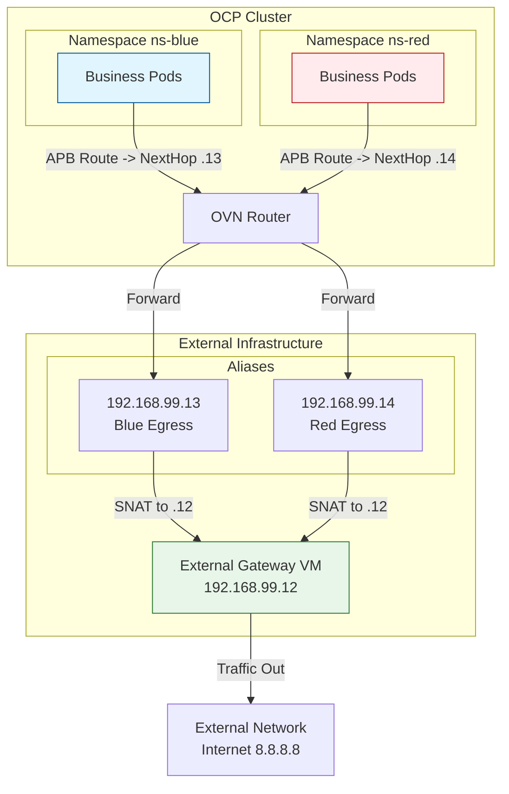

# OVN EgressIP Limitation Workaround

## Background

This document outlines a workaround implemented for a customer deploying OpenShift Container Platform (OCP) 4.18 on a third-party OpenStack environment using the baremetal installation method. 

**The Challenge:**
The underlying OpenStack platform imposes a strict limitation of 10 Elastic IPs per node. However, the security requirements mandate that each namespace must have a dedicated Egress IP, and there are over 40 namespaces planned. 

**The Limitation:**
The Elastic IP pools are distributed across different subnets, and worker nodes have varying associations with these subnets. The current OVN implementation for EgressIP does not support `nodeSelectors` to map specific EgressIP pools to specific nodes. Additionally, it generally supports only a single pool of Egress IPs.

**The Solution:**
To satisfy the requirement of a dedicated Egress IP per namespace without the limitations of OpenStack Elastic IPs on worker nodes, we implemented an **External Gateway VM** pattern:
1.  **External Gateway:** A standalone VM (outside the OpenShift cluster) holds the Egress IPs as secondary aliases.
2.  **Traffic Steering:** Configure OVN `AdminPolicyBasedExternalRoute` to route traffic from specific namespaces to the External Gateway's secondary IPs.
3.  **NAT/Forwarding:** The External Gateway performs SNAT (Masquerade) to forward traffic to the internet.

**Environment:**
-   **OCP Version:** 4.18
-   **Gateway VM:** RHEL/CentOS VM (`192.168.99.12`) with multiple IPs.
-   **Network:** L2 connectivity between OCP nodes and Gateway VM.

## Architecture



## Implementation

### 1. Configure External Gateway VM
Perform the following on the external VM (e.g., `192.168.99.12`).

**1.1 Configure Secondary IPs**
Add the dedicated Egress IPs for your namespaces.
```bash
# Example: Adding IPs for ns-blue and ns-red
ip addr add 192.168.99.13/24 dev enp1s0 label enp1s0:1
ip addr add 192.168.99.14/24 dev enp1s0 label enp1s0:2
```

**1.2 Enable IP Forwarding**
```bash
sysctl -w net.ipv4.ip_forward=1
# Make persistent in /etc/sysctl.d/99-fwd.conf if needed
```

**1.3 Disable Reverse Path Filtering (Critical)**
Asymmetric routing may occur; disabling `rp_filter` ensures packets aren't dropped.
```bash
sysctl -w net.ipv4.conf.all.rp_filter=0
sysctl -w net.ipv4.conf.default.rp_filter=0
sysctl -w net.ipv4.conf.enp1s0.rp_filter=0
```

**1.4 Configure Routes to OpenShift**
The VM needs to know how to send return traffic back to the Pods (`10.132.0.0/14`) and Services (`172.22.0.0/16`). Point these to an OCP Node IP (e.g., `192.168.99.23`).
```bash
ip route add 10.132.0.0/14 via 192.168.99.23 dev enp1s0
ip route add 172.22.0.0/16 via 192.168.99.23 dev enp1s0
```

**1.5 Configure SNAT (Masquerade)**
```bash
# Flush existing rules if needed (Be careful!)
# iptables -F && iptables -t nat -F

# Masquerade traffic from OCP Pods
iptables -t nat -A POSTROUTING -s 10.132.0.0/14 -o enp1s0 -j SNAT --to-source 192.168.99.12
```

> [!WARNING]
> Ensure `firewalld` does not conflict. You may need to stop it or configure it to allow Masquerading and Forwarding.
> `systemctl stop firewalld`

### 2. Configure OpenShift
Apply the `AdminPolicyBasedExternalRoute` to steer traffic.

**2.1 Create Namespaces**
```bash
oc create ns ns-blue
oc create ns ns-red
```

**2.2 Apply APB Routes**
```yaml
# ns-blue-route.yaml
apiVersion: k8s.ovn.org/v1
kind: AdminPolicyBasedExternalRoute
metadata:
  name: ns-blue-route
spec:
  from:
    namespaceSelector:
      matchLabels:
        kubernetes.io/metadata.name: ns-blue
  nextHops:
    static:
    - ip: "192.168.99.13"
---
# ns-red-route.yaml
apiVersion: k8s.ovn.org/v1
kind: AdminPolicyBasedExternalRoute
metadata:
  name: ns-red-route
spec:
  from:
    namespaceSelector:
      matchLabels:
        kubernetes.io/metadata.name: ns-red
  nextHops:
    static:
    - ip: "192.168.99.14"
```

Apply with `oc apply -f <filename>`.

## Verification

### Automated Verification Script
Use the following script to verify connectivity.

```bash
#!/bin/bash
# 1. Start tcpdump on Gateway VM
ssh root@192.168.99.12 "timeout 15 tcpdump -nne -i enp1s0 icmp" > /tmp/vm_capture.txt 2>&1 &
PID_TCPDUMP=$!
sleep 2

# 2. Generate Traffic
echo "Pinging from ns-blue..."
oc run fast-test-blue -n ns-blue --rm -i --image=curlimages/curl -- ping -c 2 8.8.8.8

echo "Pinging from ns-red..."
oc run fast-test-red -n ns-red --rm -i --image=curlimages/curl -- ping -c 2 8.8.8.8

# 3. Analyze
wait $PID_TCPDUMP
cat /tmp/vm_capture.txt
```

### Expected Results
1.  **Pod Connectivity:** Ping should succeed (0% packet loss).
2.  **Traffic Capture:** `tcpdump` should show:
    -   Incoming packets from Pod IPs to `8.8.8.8`.
    -   Outgoing packets from `192.168.99.12` to `8.8.8.8` (SNAT working).

## Troubleshooting
-   **No Connectivity?**
    -   Check `sysctl net.ipv4.ip_forward`.
    -   Check `sysctl net.ipv4.conf.all.rp_filter` (Must be 0).
    -   Check firewall: `systemctl status firewalld`.
    -   Verify OCP Node can ping Gateway IPs (`.13`, `.14`).
    -   Verify VM has routes back to `10.132.0.0/14`.
