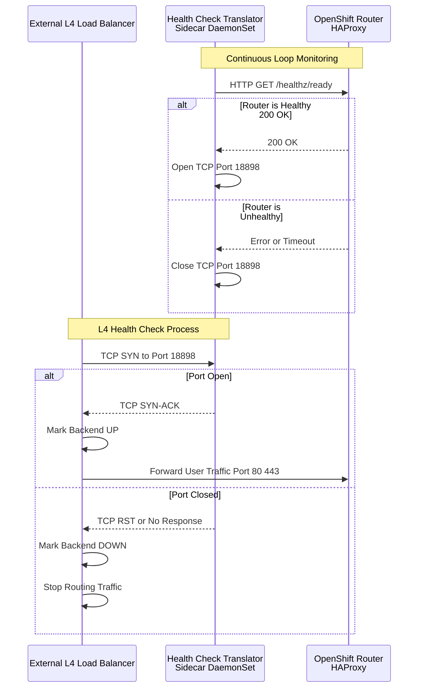

# Using L4 Switch as Ingress Gateway for OpenShift

## Executive Summary

In standard OpenShift Router deployments, it is widely recommended to utilize a Layer 7 (L7) Load Balancer in front of the router pods. This setup allows for effective traffic distribution based on application-level health checks (e.g., `HTTP GET /healthz/ready`), ensuring that requests are only forwarded to fully operational router instances.

However, existing infrastructure constraints often limit environments to Layer 4 (L4) switches. L4 switches operate primarily at the Transport Layer and perform health checks via simple TCP connection attempts (TCP alive check). This limitation introduces a critical race condition during Router Pod migration or restarts:

1.  **Premature Traffic Routing:** A new Router Pod starts, and the operating system immediately opens the TCP listening ports.
2.  **False Positive Health Check:** The L4 switch detects the open TCP port and instantly adds the pod to the active backend pool.
3.  **Service Unavailability:** The underlying HAProxy service within the pod may not yet be fully initialized or ready to handle HTTP requests.
4.  **Request Failure:** Consequently, client traffic is routed to an unready pod, resulting in 503 errors or connection resets.

To address this challenge without the need for expensive L7 infrastructure upgrades, we propose a **"Sidecar Health Check Translator"** solution. This mechanism employs a lightweight daemon running alongside the router to proxy the router's L7 status to an L4-compatible TCP port.

## Architecture & Solution Design

The proposed solution involves deploying a DaemonSet that runs as a "sibling" to the Router Pod on the same host. This daemon executes the following logic:

1.  **Monitor:** It continuously polls the local Router Pod's L7 health check endpoint (`http://localhost:1936/healthz/ready`).
2.  **Translate:**
    *   If the Router is **Healthy** (returns 200 OK), the daemon opens a specific dedicated TCP port (e.g., `18898`) on the host.
    *   If the Router is **Unhealthy** or the check fails, the daemon **immediately** closes this TCP port.
3.  **Route:** The external L4 switch is configured to check this "Translator Port" (`18898`) instead of the standard traffic port (`80` or `443`). Traffic is only forwarded to nodes where the Translator Port is open, guaranteeing that the underlying Router is truly ready to serve requests.



## Simulation and Verification

We will demonstrate the efficacy of this solution by simulating the environment using a local HAProxy instance. The verification process is structured into three distinct phases:

1.  **Baseline:** Testing with L7 health checks (The Ideal Scenario).
2.  **Problem Reproduction:** Testing with standard L4 checks (Demonstrating the failure).
3.  **Solution Verification:** Testing with the L4 Health Check Translator (Demonstrating the fix).

### Phase 1: Run with L7 Switch (Baseline)

To establish a baseline, we first install HAProxy locally to simulate an external Load Balancer.

```bash
dnf install -y haproxy
```

We configure HAProxy as an L7 switch. In this configuration, the load balancer directly inspects the HTTP health endpoint of the router.

```bash
setsebool -P haproxy_connect_any 1

tee /etc/haproxy/haproxy.cfg << EOF
global
  log stdout format raw local0
  maxconn 20000

defaults
  log     global
  mode    http
  option  httplog
  option  dontlognull
  # option  forwardfor
  timeout connect 1000
  timeout client  50000
  timeout server  50000

frontend http_front
  bind *:8080
  stats uri /haproxy?stats
  default_backend http_back

backend http_back
  balance roundrobin
  # --- L7 Health Check ---
  option httpchk GET /healthz/ready HTTP/1.0
  http-check expect status 200
  # Set default health check interval to 2 seconds (2000ms) for all servers
  default-server inter 2000
  # -----------------------
  # --- Traffic to 80 Health Check to 1936 ---
  server pod-1 192.168.99.23:80 check port 1936
  server pod-2 192.168.99.24:80 check port 1936
  server pod-3 192.168.99.25:80 check port 1936
EOF


systemctl restart haproxy

```

Next, we deploy a sample application, `hello-openshift`, with 3 replicas and expose it via an OpenShift Route. This will serve as our target application for traffic testing.

```bash
oc new-project l4-switch-demo

tee $BASE_DIR/data/install/route-l4-pod.yaml << EOF
apiVersion: apps/v1
kind: Deployment
metadata:
  name: hello-openshift
  namespace: l4-switch-demo
  labels:
    app: hello-openshift
spec:
  replicas: 3
  selector:
    matchLabels:
      app: hello-openshift
  template:
    metadata:
      labels:
        app: hello-openshift
    spec:
      affinity:
        podAntiAffinity:
          requiredDuringSchedulingIgnoredDuringExecution:
          - labelSelector:
              matchExpressions:
              - key: app
                operator: In
                values:
                - hello-openshift
            topologyKey: "kubernetes.io/hostname"
      containers:
      - name: hello-openshift
        image: docker.io/openshift/hello-openshift
        env:
          - name: "RESPONSE"
            value: "Hello World!"
        ports:
        - containerPort: 8080
          protocol: TCP
        - containerPort: 8888
          protocol: TCP
---
apiVersion: v1
kind: Service
metadata:
  name: hello-openshift
  namespace: l4-switch-demo
  labels:
    app: hello-openshift
spec:
  ports:
  - name: 8080-tcp
    port: 8080
    protocol: TCP
    targetPort: 8080
  - name: 8888-tcp
    port: 8888
    protocol: TCP
    targetPort: 8888
  selector:
    app: hello-openshift
  type: ClusterIP
---
apiVersion: route.openshift.io/v1
kind: Route
metadata:
  name: hello-openshift
  namespace: l4-switch-demo
  labels:
    app: hello-openshift
spec:
  to:
    kind: Service
    name: hello-openshift
    weight: 100
  port:
    targetPort: 8080-tcp
  wildcardPolicy: None
EOF

oc apply -f $BASE_DIR/data/install/route-l4-pod.yaml

```

We will use `hey`, a modern and high-performance HTTP load testing tool, to generate synthetic traffic against our application.

```bash
# Suitable for amd64 architecture
wget https://hey-release.s3.us-east-2.amazonaws.com/hey_linux_amd64
chmod +x hey_linux_amd64
mv hey_linux_amd64 ~/.local/bin/hey
```

**Test Execution:** We start the load test and simultaneously delete a router pod to simulate a failure scenario. Since we are using L7 health checks, the Load Balancer should detect the failing router immediately and stop sending traffic, resulting in a 100% success rate.

```bash
# Step 1: Get the OpenShift Route hostname and store it in a variable
ROUTE_HOST=$(oc get route hello-openshift -n l4-switch-demo -o jsonpath='{.spec.host}')

# Step 2: Print the variable to ensure we retrieved the correct hostname
echo "The route hostname to access is: ${ROUTE_HOST}"

# Step 3: Send a request using curl
# --header "Host: ${ROUTE_HOST}" simulates access via the domain name
# -v shows detailed request and response for troubleshooting
curl -v --header "Host: ${ROUTE_HOST}" http://127.0.0.1:8080/

# using hey to stress test
hey -c 2 -z 30m -t 10 -host "${ROUTE_HOST}" http://127.0.0.1:8080/ 

# check the status of router pod
watch oc get pod -n openshift-ingress -o wide


# during the hey, delete a router pod
router_pod_to_delete=$(oc get pods -n openshift-ingress -l ingresscontroller.operator.openshift.io/deployment-ingresscontroller=default -o jsonpath='{.items[0].metadata.name}')
echo ${router_pod_to_delete}
oc delete pod ${router_pod_to_delete} -n openshift-ingress 

```

**Result Analysis:** Upon interrupting the test (Ctrl-C), we observe a 100% success rate. This confirms that L7 health checks correctly handle router churn, preventing any downtime for the client.

```log

Summary:
  Total:        88.6920 secs
  Slowest:      0.0297 secs
  Fastest:      0.0003 secs
  Average:      0.0011 secs
  Requests/sec: 1835.6119

  Total data:   2116452 bytes
  Size/request: 13 bytes

Response time histogram:
  0.000 [1]     |
  0.003 [162047]        |■■■■■■■■■■■■■■■■■■■■■■■■■■■■■■■■■■■■■■■■
  0.006 [565]   |
  0.009 [122]   |
  0.012 [33]    |
  0.015 [13]    |
  0.018 [7]     |
  0.021 [7]     |
  0.024 [3]     |
  0.027 [3]     |
  0.030 [3]     |


Latency distribution:
  10% in 0.0007 secs
  25% in 0.0009 secs
  50% in 0.0011 secs
  75% in 0.0012 secs
  90% in 0.0015 secs
  95% in 0.0015 secs
  99% in 0.0021 secs

Details (average, fastest, slowest):
  DNS+dialup:   0.0000 secs, 0.0003 secs, 0.0297 secs
  DNS-lookup:   0.0000 secs, 0.0000 secs, 0.0000 secs
  req write:    0.0000 secs, 0.0000 secs, 0.0018 secs
  resp wait:    0.0010 secs, 0.0002 secs, 0.0296 secs
  resp read:    0.0000 secs, 0.0000 secs, 0.0019 secs

Status code distribution:
  [200] 162804 responses

```

### Phase 2: Run with L4 Switch (Problem Reproduction)

Now, we reconfigure HAProxy to simulate a typical L4 switch environment. We disable the HTTP health check and rely solely on the basic TCP connectivity check to the router's traffic port (80). This configuration reflects infrastructure where advanced L7 inspection is not possible.

```bash

tee /etc/haproxy/haproxy.cfg << EOF
global
  log stdout format raw local0
  maxconn 20000

defaults
  log     global
  mode    http
  option  httplog
  option  dontlognull
  # option  forwardfor
  timeout connect 1000
  timeout client  50000
  timeout server  50000

frontend http_front
  bind *:8080
  stats uri /haproxy?stats
  default_backend http_back

backend http_back
  balance roundrobin
  # --- L4 Health Check ---
  # option httpchk GET /healthz/ready HTTP/1.0
  # http-check expect status 200
  # Set default health check interval to 2 seconds (2000ms) for all servers
  default-server inter 2000
  # -----------------------
  # --- Traffic to 80 Health Check to 1936 ---
  server pod-1 192.168.99.23:80 check port 1936
  server pod-2 192.168.99.24:80 check port 1936
  server pod-3 192.168.99.25:80 check port 1936
EOF


systemctl restart haproxy

```

**Test Execution:** We perform the same load test using `hey`, again deleting a router pod to trigger a failover.

```bash
# Step 1: Get the OpenShift Route hostname and store it in a variable
ROUTE_HOST=$(oc get route hello-openshift -n l4-switch-demo -o jsonpath='{.spec.host}')

# Step 2: Print the variable to ensure we retrieved the correct hostname
echo "The route hostname to access is: ${ROUTE_HOST}"

# Step 3: Send a request using curl
# --header "Host: ${ROUTE_HOST}" simulates access via the domain name
# -v shows detailed request and response for troubleshooting
curl -v --header "Host: ${ROUTE_HOST}" http://127.0.0.1:8080/

# using hey to stress test
hey -c 2 -z 60m -t 10 -host "${ROUTE_HOST}" http://127.0.0.1:8080/ 

# check the status of router pod
watch oc get pod -n openshift-ingress -o wide


# during the hey, delete a router pod
router_pod_to_delete=$(oc get pods -n openshift-ingress -l ingresscontroller.operator.openshift.io/deployment-ingresscontroller=default -o jsonpath='{.items[0].metadata.name}')
echo ${router_pod_to_delete}
oc delete pod ${router_pod_to_delete} -n openshift-ingress 

```

**Result Analysis:** The output now shows failed requests (503 errors). This failure occurs because the L4 switch detects the port opening on the new pod and starts sending traffic before the HAProxy process inside the pod is ready to process requests. This confirms that relying solely on standard L4/TCP checks is insufficient for achieving zero-downtime operations.

```log
Summary:
  Total:        72.8544 secs
  Slowest:      3.0055 secs
  Fastest:      0.0003 secs
  Average:      0.0013 secs
  Requests/sec: 1543.8737

  Total data:   1462778 bytes
  Size/request: 13 bytes

Response time histogram:
  0.000 [1]     |
  0.301 [112471]        |■■■■■■■■■■■■■■■■■■■■■■■■■■■■■■■■■■■■■■■■
  0.601 [0]     |
  0.902 [0]     |
  1.202 [0]     |
  1.503 [0]     |
  1.803 [0]     |
  2.104 [0]     |
  2.404 [0]     |
  2.705 [0]     |
  3.006 [6]     |


Latency distribution:
  10% in 0.0008 secs
  25% in 0.0009 secs
  50% in 0.0011 secs
  75% in 0.0013 secs
  90% in 0.0015 secs
  95% in 0.0016 secs
  99% in 0.0021 secs

Details (average, fastest, slowest):
  DNS+dialup:   0.0000 secs, 0.0003 secs, 3.0055 secs
  DNS-lookup:   0.0000 secs, 0.0000 secs, 0.0000 secs
  req write:    0.0000 secs, 0.0000 secs, 0.0016 secs
  resp wait:    0.0012 secs, 0.0002 secs, 3.0054 secs
  resp read:    0.0000 secs, 0.0000 secs, 0.0032 secs

Status code distribution:
  [200] 112472 responses
  [503] 6 responses
```

### Phase 3: Run with L4 Check Translator (Solution Verification)

To mitigate the race condition identified in Phase 2, we implement the **Health Check Translator**.

First, we create a `ConfigMap` containing the Python script. This script serves as the logic engine, continuously checking the router's internal L7 status and toggling a listening port based on the result.

```yaml
apiVersion: v1
kind: ConfigMap
metadata:
  name: health-check-script
  namespace: l4-switch-demo
data:
  check.py: |
    import http.server
    import socketserver
    import threading
    import time
    import requests
    import os
    import signal
    import sys

    # --- Configuration ---
    ROUTER_HEALTH_URL = "http://localhost:1936/healthz/ready"
    HEALTH_CHECK_INTERVAL = 1  # seconds
    LISTENING_PORT = 18898
    LISTENING_IP = "0.0.0.0"

    # --- Global State ---
    server_process = None
    is_healthy = False

    def start_listener():
        """Starts a simple HTTP server in a separate process."""
        pid = os.fork()
        if pid == 0:
            # This is the child process
            try:
                handler = http.server.SimpleHTTPRequestHandler
                with socketserver.TCPServer((LISTENING_IP, LISTENING_PORT), handler) as httpd:
                    print(f"Child process serving on port {LISTENING_PORT}")
                    httpd.serve_forever()
            except Exception as e:
                print(f"Child process failed: {e}")
            finally:
                # Ensure the child process exits cleanly if server stops
                os._exit(0)
        else:
            # This is the parent process
            print(f"Parent process started listener child with PID: {pid}")
            return pid

    def stop_listener(pid):
        """Stops the listener process immediately."""
        if pid:
            print(f"Stopping listener process with PID: {pid}")
            try:
                os.kill(pid, signal.SIGKILL)
                os.waitpid(pid, 0)
                print(f"Listener process {pid} killed.")
            except ProcessLookupError:
                print(f"Listener process {pid} not found, already stopped?")
            except Exception as e:
                print(f"Error killing listener process {pid}: {e}")
        return None

    def check_router_health():
        """Checks the L7 health of the local router pod."""
        try:
            response = requests.get(ROUTER_HEALTH_URL, timeout=0.5)
            if response.status_code == 200:
                return True
            else:
                print(f"Router health check failed with status code: {response.status_code}")
                return False
        except requests.exceptions.RequestException as e:
            print(f"Router health check failed with exception: {e}")
            return False

    def main_loop():
        global server_process
        global is_healthy

        while True:
            current_health = check_router_health()

            if current_health and not is_healthy:
                print("Router is healthy. Starting listener.")
                is_healthy = True
                if server_process:
                    server_process = stop_listener(server_process)
                server_process = start_listener()

            elif not current_health and is_healthy:
                print("Router is unhealthy. Stopping listener immediately.")
                is_healthy = False
                if server_process:
                    server_process = stop_listener(server_process)
            
            time.sleep(HEALTH_CHECK_INTERVAL)

    if __name__ == "__main__":
        print("Starting router health checker...")
        # Graceful shutdown handler
        def signal_handler(sig, frame):
            print("Shutdown signal received. Stopping listener...")
            if server_process:
                stop_listener(server_process)
            sys.exit(0)

        signal.signal(signal.SIGINT, signal_handler)
        signal.signal(signal.SIGTERM, signal_handler)

        main_loop()
```

Next, we deploy the DaemonSet to execute this script on every node where a router resides. We utilize `hostNetwork: true` so that the script can access the router's localhost port and, crucially, expose the translator port (`18898`) directly to the external network.

```yaml
# Create ServiceAccount and grant privileges
oc create sa router-health-check -n l4-switch-demo
oc adm policy add-scc-to-user privileged -z router-health-check -n l4-switch-demo

# Apply DaemonSet
tee $BASE_DIR/data/install/router-health-check.yaml << EOF
apiVersion: apps/v1
kind: DaemonSet
metadata:
  name: router-health-check
  namespace: l4-switch-demo
  labels:
    app: router-health-check
spec:
  selector:
    matchLabels:
      app: router-health-check
  template:
    metadata:
      labels:
        app: router-health-check
    spec:
      serviceAccountName: router-health-check
      # Ensure this pod runs on the same nodes as the OpenShift router
      nodeSelector:
        node-role.kubernetes.io/worker: "" # Adjust if your routers run on master/infra nodes
      hostNetwork: true
      tolerations:
      # Add tolerations if your routers run on master/infra nodes
      - key: "node-role.kubernetes.io/master"
        operator: "Exists"
        effect: "NoSchedule"
      - key: "node-role.kubernetes.io/infra"
        operator: "Exists"
        effect: "NoSchedule"
      containers:
      - name: health-checker
        image: registry.redhat.io/ubi9/python-312:latest
        command: ["/usr/bin/python3", "/scripts/check.py"]
        volumeMounts:
        - name: script-volume
          mountPath: /scripts
        securityContext:
          # Required for host network access on some OpenShift versions
          privileged: true
      volumes:
      - name: script-volume
        configMap:
          name: health-check-script
          defaultMode: 0755 # Make the script executable
EOF

oc apply -f $BASE_DIR/data/install/router-health-check.yaml
```

Finally, we update the HAProxy configuration to check the new **Translator Port (`18898`)** for health status, while continuing to route actual traffic to the standard router port (`80`).

```bash

tee /etc/haproxy/haproxy.cfg << EOF
global
  log stdout format raw local0
  maxconn 20000

defaults
  log     global
  mode    http
  option  httplog
  option  dontlognull
  # option  forwardfor
  timeout connect 1000
  timeout client  50000
  timeout server  50000

frontend http_front
  bind *:8080
  stats uri /haproxy?stats
  default_backend http_back

backend http_back
  balance roundrobin
  # --- L4 Health Check ---
  # option httpchk GET /healthz/ready HTTP/1.0
  # http-check expect status 200
  # Set default health check interval to 2 seconds (2000ms) for all servers
  default-server inter 2000
  # -----------------------
  # --- Traffic to 80 Health Check to 18898 ---
  server pod-1 192.168.99.23:80 check port 18898
  server pod-2 192.168.99.24:80 check port 18898
  server pod-3 192.168.99.25:80 check port 18898
EOF


systemctl restart haproxy

```

**Test Execution:** We run the `hey` load test again with the translator active, simulating a router failure during the test.

```bash
# Step 1: Get the OpenShift Route hostname and store it in a variable
ROUTE_HOST=$(oc get route hello-openshift -n l4-switch-demo -o jsonpath='{.spec.host}')

# Step 2: Print the variable to ensure we retrieved the correct hostname
echo "The route hostname to access is: ${ROUTE_HOST}"

# Step 3: Send a request using curl
# --header "Host: ${ROUTE_HOST}" simulates access via the domain name
# -v shows detailed request and response for troubleshooting
curl -v --header "Host: ${ROUTE_HOST}" http://127.0.0.1:8080/

# using hey to stress test
hey -c 2 -z 60m -t 10 -host "${ROUTE_HOST}" http://127.0.0.1:8080/ 

# check the status of router pod
watch oc get pod -n openshift-ingress -o wide


# during the hey, delete a router pod
router_pod_to_delete=$(oc get pods -n openshift-ingress -l ingresscontroller.operator.openshift.io/deployment-ingresscontroller=default -o jsonpath='{.items[0].metadata.name}')
echo ${router_pod_to_delete}
oc delete pod ${router_pod_to_delete} -n openshift-ingress 

```

**Result Analysis:** The results confirm that with the translator in place, we achieve a **100% success rate**. This solution effectively mimics L7 health check behavior on an L4 infrastructure, preventing traffic from reaching unready pods.

```log
Summary:
  Total:        65.1206 secs
  Slowest:      0.0254 secs
  Fastest:      0.0003 secs
  Average:      0.0011 secs
  Requests/sec: 1739.1271

  Total data:   1472289 bytes
  Size/request: 13 bytes

Response time histogram:
  0.000 [1]     |
  0.003 [112550]        |■■■■■■■■■■■■■■■■■■■■■■■■■■■■■■■■■■■■■■■■
  0.005 [557]   |
  0.008 [103]   |
  0.010 [24]    |
  0.013 [8]     |
  0.015 [4]     |
  0.018 [0]     |
  0.020 [4]     |
  0.023 [1]     |
  0.025 [1]     |


Latency distribution:
  10% in 0.0008 secs
  25% in 0.0009 secs
  50% in 0.0011 secs
  75% in 0.0013 secs
  90% in 0.0015 secs
  95% in 0.0016 secs
  99% in 0.0022 secs

Details (average, fastest, slowest):
  DNS+dialup:   0.0000 secs, 0.0003 secs, 0.0254 secs
  DNS-lookup:   0.0000 secs, 0.0000 secs, 0.0000 secs
  req write:    0.0000 secs, 0.0000 secs, 0.0029 secs
  resp wait:    0.0011 secs, 0.0002 secs, 0.0253 secs
  resp read:    0.0000 secs, 0.0000 secs, 0.0039 secs

Status code distribution:
  [200] 113253 responses
```

## Extended Verification: Cluster Upgrade

The ultimate test for any OpenShift configuration is a complete cluster upgrade, which triggers rolling updates of all cluster components, including the router fleet.

**Test Scenario:** We perform a long-duration load test while initiating a cluster upgrade. This ensures that the solution remains robust even during extensive maintenance operations.

```bash
# Step 1: Get the OpenShift Route hostname and store it in a variable
ROUTE_HOST=$(oc get route hello-openshift -n l4-switch-demo -o jsonpath='{.spec.host}')


# Step 2: Print the variable to ensure we retrieved the correct hostname
echo "The route hostname to access is: ${ROUTE_HOST}"

# Step 3: Send a request using curl
# --header "Host: ${ROUTE_HOST}" simulates access via the domain name
# -v shows detailed request and response for troubleshooting
curl -v --header "Host: ${ROUTE_HOST}" http://127.0.0.1:8080/

# using hey to stress test
hey -c 2 -z 10h -t 10 -host "${ROUTE_HOST}" http://127.0.0.1:8080/ 

# check the status of router pod
watch oc get pod -n openshift-ingress -o wide
```

**Upgrade Process:**

1.  **Initiation:** The upgrade process is triggered.
    

2.  **Progress:** Monitoring the progress as the cluster components are updated.
    

3.  **Completion:** The upgrade successfully completes.
    

**Final Result:** The load test maintained a **100% success rate** throughout the entire upgrade process, validating the stability and robustness of the L4 Health Check Translator in a real-world production scenario.

```log
Summary:
  Total:        3989.5204 secs
  Slowest:      0.2107 secs
  Fastest:      0.0002 secs
  Average:      0.0080 secs
  Requests/sec: 1903.0485

  Total data:   98699263 bytes
  Size/request: 98 bytes

Response time histogram:
  0.000 [1]     |
  0.021 [999993]        |■■■■■■■■■■■■■■■■■■■■■■■■■■■■■■■■■■■■■■■■
  0.042 [4]     |
  0.063 [0]     |
  0.084 [0]     |
  0.105 [0]     |
  0.127 [0]     |
  0.148 [0]     |
  0.169 [0]     |
  0.190 [0]     |
  0.211 [2]     |


Latency distribution:
  10% in 0.0007 secs
  25% in 0.0009 secs
  50% in 0.0011 secs
  75% in 0.0012 secs
  90% in 0.0014 secs
  95% in 0.0015 secs
  99% in 0.0020 secs

Details (average, fastest, slowest):
  DNS+dialup:   0.0000 secs, 0.0002 secs, 0.2107 secs
  DNS-lookup:   0.0000 secs, 0.0000 secs, 0.0000 secs
  req write:    0.0001 secs, 0.0000 secs, 0.0018 secs
  resp wait:    0.0073 secs, 0.0002 secs, 0.2106 secs
  resp read:    0.0003 secs, 0.0000 secs, 0.0051 secs

Status code distribution:
  [200] 1000000 responses

```

## Support and Recommendations

The methodology described in this document serves as a **Reference Architecture / Proof of Concept (PoC)** for enabling L4 switches in OpenShift environments. While functional and effective, it is fundamentally a self-managed solution.

For enterprise-grade implementations requiring long-term support, we strongly recommend consulting **Red Hat Global Professional Services (GPS)** for a solution tailored to your specific infrastructure needs.

Potential enhancements for a production-grade implementation include:

1.  **Performance Optimization:** Re-implementing the Python translator in **Golang**. This would significantly reduce the resource footprint (CPU/Memory) and improve the reaction speed to health state changes.
2.  **Security Hardening:** Implementing `iptables` or `nftables` rules on the node level to ensure that the translator port (`18898`) accepts connections *only* from the trusted L4 switch IP addresses, effectively preventing unauthorized access.
3.  **Resilient Error Handling:** Adding robust logging, metrics integration (Prometheus), and advanced error handling to manage edge cases such as API server downtime or network partition scenarios.

# End
