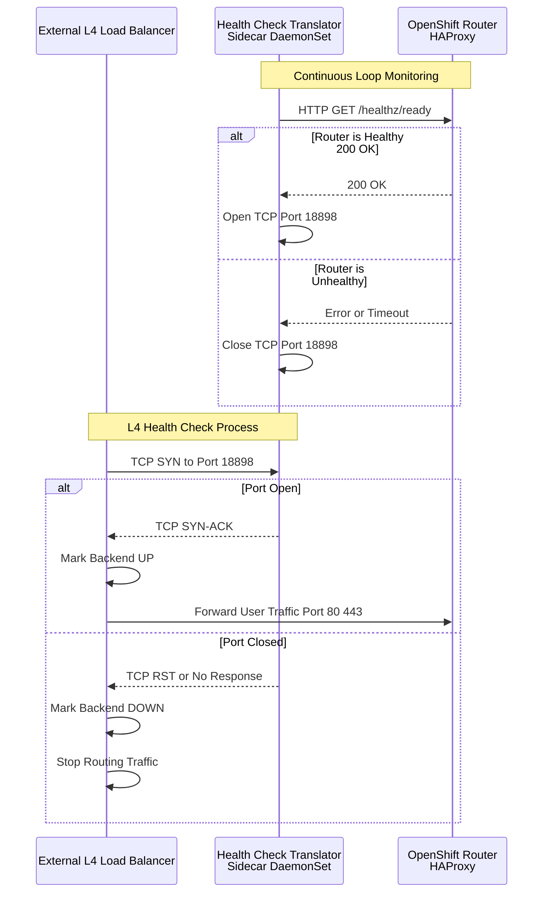
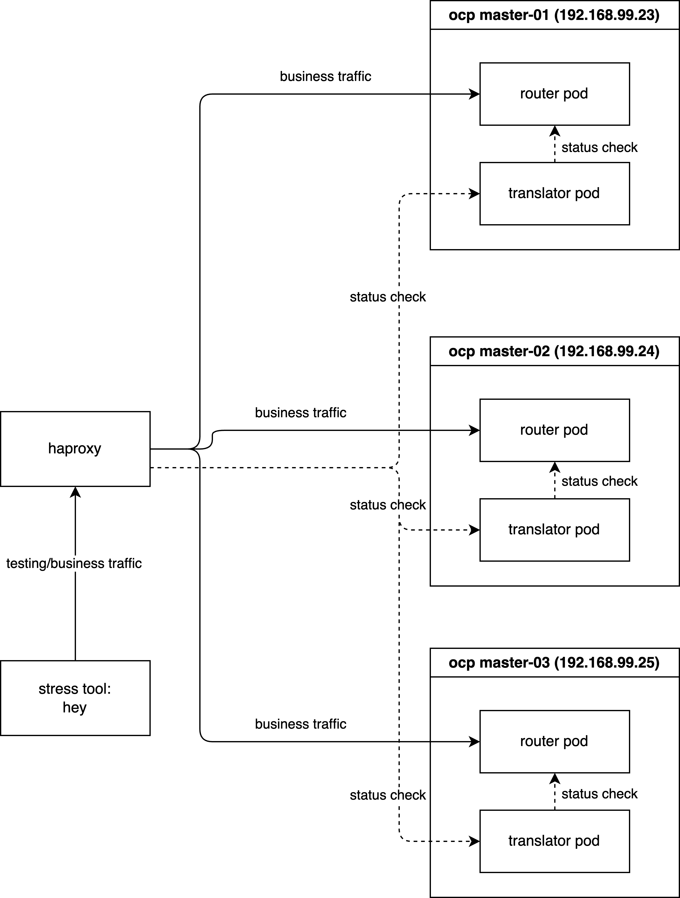
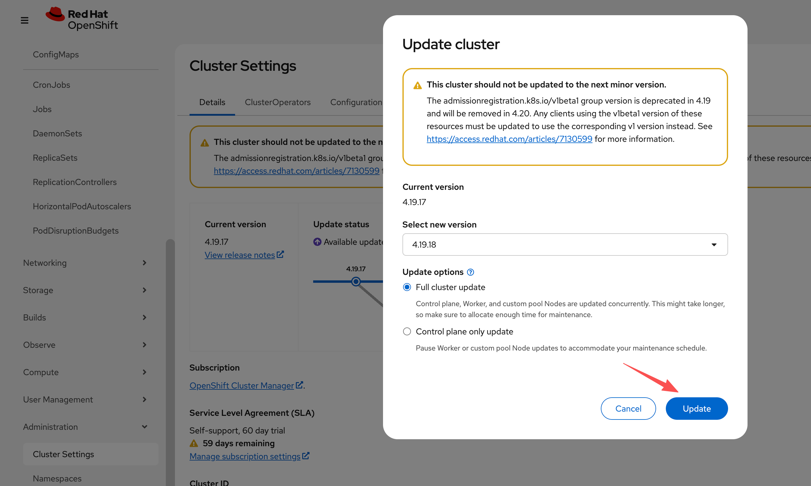
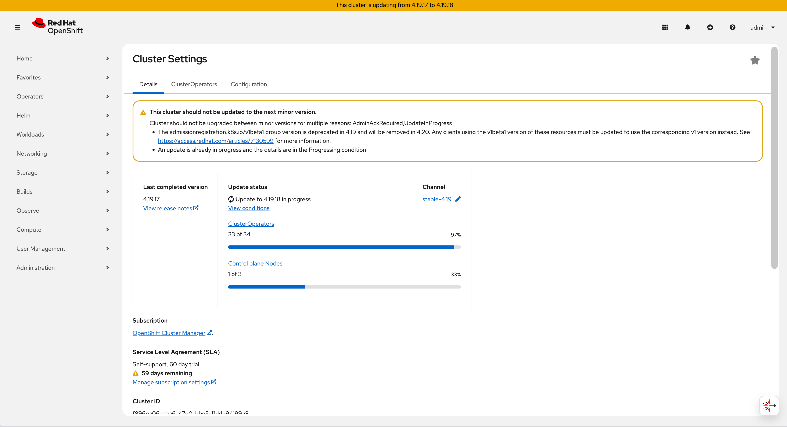
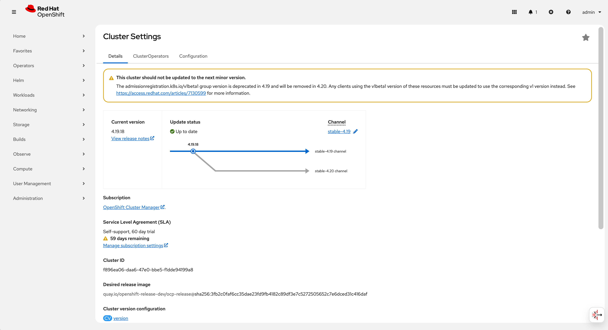

# Implementing Layer 4 Switch as Ingress Gateway for OpenShift: Challenges and Solutions

## 1. Executive Summary

In standard enterprise OpenShift deployments, utilizing a Layer 7 (L7) Load Balancer in front of the OpenShift Router (Ingress Controller) is the recommended best practice. L7 Load Balancers can inspect application-layer data, allowing them to query specific health endpoints (e.g., `HTTP GET /healthz/ready`). This ensures traffic is distributed only to router pods that are fully initialized and capable of processing requests.

However, real-world infrastructure constraints often dictate the use of Layer 4 (L4) switches. Unlike their L7 counterparts, L4 switches operate at the transport layer and typically rely on simple TCP connection attempts (SYN/ACK) to determine backend availability. This limitation creates a critical **race condition** during router pod lifecycles (scaling, restarts, or upgrades):

1.  **Premature Traffic Routing:** When a new Router Pod starts, the container's network stack and operating system immediately open the listening ports (80/443).
2.  **False Positive Health Check:** The L4 switch detects the open TCP port and immediately marks the backend as "UP".
3.  **Service Unavailability:** The application layer (HAProxy) within the pod may still be initializing (loading certificates, parsing configurations) and is not yet ready to serve traffic.
4.  **Request Failures:** Client traffic routed to this unready pod results in connection resets or HTTP 503 errors.

To overcome this limitation without requiring costly infrastructure upgrades to L7 hardware, we present a solution: the **"Sidecar Health Check Translator"**. This architecture introduces a lightweight daemon that bridges the gap between the Router's internal L7 status and the L4 switch's TCP-based expectations.

## 2. Technical Architecture & Solution Design

The proposed solution deploys a daemon (DaemonSet) on every node hosting an OpenShift Router. This "Sidecar" agent acts as a proxy for health status.

### Functional Logic

1.  **Monitor (L7):** The daemon continuously polls the local Router's application health endpoint (`http://localhost:1936/healthz/ready`).
2.  **Translate (Logic):**
    *   **Healthy State:** If the router returns `200 OK`, the daemon opens a dedicated TCP port (e.g., `18898`) on the host.
    *   **Unhealthy State:** If the router returns any error or times out, the daemon actively closes or refuses connections on port `18898`.
3.  **Route (L4):** The external L4 switch is configured to perform its TCP health check against this **Translator Port (`18898`)** instead of the traffic ports (`80`/`443`). Traffic is only forwarded to the node when the Translator Port is open, confirming that the underlying Router application is truly ready.

### Workflow Diagram



## 3. Simulation Environment & Verification

To rigorously validate this solution, we will simulate the environment using a local HAProxy instance acting as the external Load Balancer. The verification is conducted in three phases:

1.  **Phase 1 (Baseline):** Establishing the ideal behavior using L7 health checks.
2.  **Phase 2 (Problem Reproduction):** Demonstrating the failure mode with standard L4 checks.
3.  **Phase 3 (Solution Verification):** Proving the efficacy of the L4 Health Check Translator.

**Demo Deployment Architecture:**



### 3.1 Phase 1: Baseline with Layer 7 Health Checks

First, we install HAProxy to act as our load balancer simulator.

```bash
# Install HAProxy on the bastion/test machine
dnf install -y haproxy
```

We verify that SELinux allows HAProxy to connect to any port (necessary for our simulation).

```bash
# Allow HAProxy to make outbound connections
setsebool -P haproxy_connect_any 1
```

We configure HAProxy as an **Layer 7 Load Balancer**. Key configuration details:
*   `mode http`: Enables L7 inspection.
*   `option httpchk`: Performs an HTTP GET request to `/healthz/ready` to determine health.
*   `check port 1936`: Sends the health check to the router's status port (1936), independent of the traffic port (80).

```bash
tee /etc/haproxy/haproxy.cfg << EOF
global
  log stdout format raw local0
  maxconn 20000

defaults
  log     global
  mode    http
  option  httplog
  option  dontlognull
  # option  forwardfor
  timeout connect 1000
  timeout client  50000
  timeout server  50000

frontend http_front
  bind *:8080
  stats uri /haproxy?stats
  default_backend http_back

backend http_back
  balance roundrobin
  # --- L7 Health Check Configuration ---
  # Perform HTTP GET to check readiness
  option httpchk GET /healthz/ready HTTP/1.0
  # Expect a 200 OK response for a server to be considered UP
  http-check expect status 200
  # Set default health check interval to 2 seconds (2000ms)
  default-server inter 2000
  # -------------------------------------
  # --- Backend Servers ---
  # Traffic goes to port 80, but Health Checks go to port 1936
  server pod-1 192.168.99.23:80 check port 1936
  server pod-2 192.168.99.24:80 check port 1936
  server pod-3 192.168.99.25:80 check port 1936
EOF

# Apply the configuration
systemctl restart haproxy
```

Next, we deploy a sample workload (`hello-openshift`) to serve as our traffic destination.

```bash
# Create a demo project
oc new-project l4-switch-demo

# Deploy the application manifest
tee $BASE_DIR/data/install/route-l4-pod.yaml << EOF
apiVersion: apps/v1
kind: Deployment
metadata:
  name: hello-openshift
  namespace: l4-switch-demo
  labels:
    app: hello-openshift
spec:
  replicas: 3
  selector:
    matchLabels:
      app: hello-openshift
  template:
    metadata:
      labels:
        app: hello-openshift
    spec:
      affinity:
        # Ensure pods are spread across different nodes for high availability
        podAntiAffinity:
          requiredDuringSchedulingIgnoredDuringExecution:
          - labelSelector:
              matchExpressions:
              - key: app
                operator: In
                values:
                - hello-openshift
            topologyKey: "kubernetes.io/hostname"
      containers:
      - name: hello-openshift
        image: docker.io/openshift/hello-openshift
        env:
          - name: "RESPONSE"
            value: "Hello World!"
        ports:
        - containerPort: 8080
          protocol: TCP
        - containerPort: 8888
          protocol: TCP
---
apiVersion: v1
kind: Service
metadata:
  name: hello-openshift
  namespace: l4-switch-demo
  labels:
    app: hello-openshift
spec:
  ports:
  - name: 8080-tcp
    port: 8080
    protocol: TCP
    targetPort: 8080
  - name: 8888-tcp
    port: 8888
    protocol: TCP
    targetPort: 8888
  selector:
    app: hello-openshift
  type: ClusterIP
---
apiVersion: route.openshift.io/v1
kind: Route
metadata:
  name: hello-openshift
  namespace: l4-switch-demo
  labels:
    app: hello-openshift
spec:
  to:
    kind: Service
    name: hello-openshift
    weight: 100
  port:
    targetPort: 8080-tcp
  wildcardPolicy: None
EOF

oc apply -f $BASE_DIR/data/install/route-l4-pod.yaml
```

To generate load, we use `hey`, a modern HTTP load testing utility.

```bash
# Download and install hey (Suitable for amd64 architecture)
wget https://hey-release.s3.us-east-2.amazonaws.com/hey_linux_amd64
chmod +x hey_linux_amd64
mv hey_linux_amd64 ~/.local/bin/hey
```

**Test Execution:** We start the load generator. While the test runs, we manually delete a router pod. Since L7 checks are active, HAProxy should instantly detect the failure and stop routing traffic to that pod.

```bash
# Step 1: Retrieve the Route hostname
ROUTE_HOST=$(oc get route hello-openshift -n l4-switch-demo -o jsonpath='{.spec.host}')

# Step 2: Verify the hostname
echo "The route hostname to access is: ${ROUTE_HOST}"

# Step 3: Connectivity check using curl
# -v enables verbose output for debugging
curl -v --header "Host: ${ROUTE_HOST}" http://127.0.0.1:8080/

# Step 4: Start Stress Test
# -c 2: 2 concurrent workers
# -z 30m: Run for 30 minutes (we will interrupt manually)
# -host: Override the Host header
hey -c 2 -z 30m -t 10 -host "${ROUTE_HOST}" http://127.0.0.1:8080/ 

# In a separate terminal, monitor router pods
watch oc get pod -n openshift-ingress -o wide

# Trigger Fault: Delete a router pod to simulate failure/restart
router_pod_to_delete=$(oc get pods -n openshift-ingress -l ingresscontroller.operator.openshift.io/deployment-ingresscontroller=default -o jsonpath='{.items[0].metadata.name}')
echo ${router_pod_to_delete}
oc delete pod ${router_pod_to_delete} -n openshift-ingress 
```

**Result Analysis:** The test logs show a **100% success rate (200 OK)**. This confirms that L7 health checks correctly handle pod churn.

```log
Summary:
  Total:        88.6920 secs
  Slowest:      0.0297 secs
  Fastest:      0.0003 secs
  Average:      0.0011 secs
  Requests/sec: 1835.6119

  Total data:   2116452 bytes
  Size/request: 13 bytes

Response time histogram:
  0.000 [1]     |
  0.003 [162047]        |■■■■■■■■■■■■■■■■■■■■■■■■■■■■■■■■■■■■■■■■
  0.006 [565]   |
  0.009 [122]   |
  0.012 [33]    |
  0.015 [13]    |
  0.018 [7]     |
  0.021 [7]     |
  0.024 [3]     |
  0.027 [3]     |
  0.030 [3]     |


Latency distribution:
  10% in 0.0007 secs
  25% in 0.0009 secs
  50% in 0.0011 secs
  75% in 0.0012 secs
  90% in 0.0015 secs
  95% in 0.0015 secs
  99% in 0.0021 secs

Details (average, fastest, slowest):
  DNS+dialup:   0.0000 secs, 0.0003 secs, 0.0297 secs
  DNS-lookup:   0.0000 secs, 0.0000 secs, 0.0000 secs
  req write:    0.0000 secs, 0.0000 secs, 0.0018 secs
  resp wait:    0.0010 secs, 0.0002 secs, 0.0296 secs
  resp read:    0.0000 secs, 0.0000 secs, 0.0019 secs

Status code distribution:
  [200] 162804 responses
```

### 3.2 Phase 2: Reproducing the Race Condition (L4)

Now, we degrade the simulation to mimic a standard L4 switch. We disable HTTP health checks and rely solely on TCP port availability.

```bash
tee /etc/haproxy/haproxy.cfg << EOF
global
  log stdout format raw local0
  maxconn 20000

defaults
  log     global
  mode    http
  option  httplog
  option  dontlognull
  # option  forwardfor
  timeout connect 1000
  timeout client  50000
  timeout server  50000

frontend http_front
  bind *:8080
  stats uri /haproxy?stats
  default_backend http_back

backend http_back
  balance roundrobin
  # --- L4 Health Check Configuration ---
  # We comment out the L7 checks to simulate a dumb L4 switch
  # option httpchk GET /healthz/ready HTTP/1.0
  # http-check expect status 200
  
  # Default interval remains 2 seconds
  default-server inter 2000
  # -------------------------------------
  # --- Backend Servers ---
  # Health checks now default to simple TCP connectivity on port 1936
  server pod-1 192.168.99.23:80 check port 1936
  server pod-2 192.168.99.24:80 check port 1936
  server pod-3 192.168.99.25:80 check port 1936
EOF

systemctl restart haproxy
```

**Test Execution:** We repeat the exact same load test and fault injection.

```bash
# Step 1: Get the Route hostname
ROUTE_HOST=$(oc get route hello-openshift -n l4-switch-demo -o jsonpath='{.spec.host}')

# Step 2: Verify hostname
echo "The route hostname to access is: ${ROUTE_HOST}"

# Step 3: Curl check
curl -v --header "Host: ${ROUTE_HOST}" http://127.0.0.1:8080/

# Step 4: Start Stress Test
hey -c 2 -z 60m -t 10 -host "${ROUTE_HOST}" http://127.0.0.1:8080/ 

# Monitor pods in parallel
watch oc get pod -n openshift-ingress -o wide

# Trigger Fault: Delete a router pod
router_pod_to_delete=$(oc get pods -n openshift-ingress -l ingresscontroller.operator.openshift.io/deployment-ingresscontroller=default -o jsonpath='{.items[0].metadata.name}')
echo ${router_pod_to_delete}
oc delete pod ${router_pod_to_delete} -n openshift-ingress 
```

**Result Analysis:** We observe **6 failed requests (503 errors)**. This downtime corresponds to the window where the new router pod's OS opened the port, but HAProxy was not yet ready. The L4 switch routed traffic into a "black hole".

```log
Summary:
  Total:        72.8544 secs
  Slowest:      3.0055 secs
  Fastest:      0.0003 secs
  Average:      0.0013 secs
  Requests/sec: 1543.8737

  Total data:   1462778 bytes
  Size/request: 13 bytes

Response time histogram:
  0.000 [1]     |
  0.301 [112471]        |■■■■■■■■■■■■■■■■■■■■■■■■■■■■■■■■■■■■■■■■
  0.601 [0]     |
  0.902 [0]     |
  1.202 [0]     |
  1.503 [0]     |
  1.803 [0]     |
  1.803 [0]     |
  2.104 [0]     |
  2.404 [0]     |
  2.705 [0]     |
  3.006 [6]     |


Latency distribution:
  10% in 0.0008 secs
  25% in 0.0009 secs
  50% in 0.0011 secs
  75% in 0.0013 secs
  90% in 0.0015 secs
  95% in 0.0016 secs
  99% in 0.0021 secs

Details (average, fastest, slowest):
  DNS+dialup:   0.0000 secs, 0.0003 secs, 3.0055 secs
  DNS-lookup:   0.0000 secs, 0.0000 secs, 0.0000 secs
  req write:    0.0000 secs, 0.0000 secs, 0.0016 secs
  resp wait:    0.0012 secs, 0.0002 secs, 3.0054 secs
  resp read:    0.0000 secs, 0.0000 secs, 0.0032 secs

Status code distribution:
  [200] 112472 responses
  [503] 6 responses
```

### 3.3 Phase 3: Implementing the L4 Health Check Translator

We now deploy the Health Check Translator to fix the issue identified in Phase 2.

**Step 1: Deploy the Logic Script**
We create a `ConfigMap` containing the Python logic. This script uses standard library modules to check the router and manage a TCP listener process.

```yaml
apiVersion: v1
kind: ConfigMap
metadata:
  name: health-check-script
  namespace: l4-switch-demo
data:
  check.py: |
    import http.server
    import socketserver
    import threading
    import time
    import requests
    import os
    import signal
    import sys

    # --- Configuration ---
    # The local OpenShift Router health endpoint
    ROUTER_HEALTH_URL = "http://localhost:1936/healthz/ready"
    # How often to poll the router health (in seconds)
    HEALTH_CHECK_INTERVAL = 1 
    # The TCP port exposed to the external L4 Load Balancer
    LISTENING_PORT = 18898
    LISTENING_IP = "0.0.0.0"

    # --- Global State ---
    server_process = None
    is_healthy = False

    def start_listener():
        """
        Starts a simple TCP server in a child process to indicate 'Healthy'.
        When this port is open, the L4 switch considers the node ready.
        """
        pid = os.fork()
        if pid == 0:
            # Child process: Runs the actual TCP listener
            try:
                handler = http.server.SimpleHTTPRequestHandler
                with socketserver.TCPServer((LISTENING_IP, LISTENING_PORT), handler) as httpd:
                    print(f"Child process serving on port {LISTENING_PORT}")
                    httpd.serve_forever()
            except Exception as e:
                print(f"Child process failed: {e}")
            finally:
                os._exit(0)
        else:
            # Parent process: Tracks the child PID
            print(f"Parent process started listener child with PID: {pid}")
            return pid

    def stop_listener(pid):
        """
        Terminates the listener process to indicate 'Unhealthy'.
        When this port is closed, the L4 switch stops sending traffic.
        """
        if pid:
            print(f"Stopping listener process with PID: {pid}")
            try:
                os.kill(pid, signal.SIGKILL)
                os.waitpid(pid, 0)
                print(f"Listener process {pid} killed.")
            except ProcessLookupError:
                print(f"Listener process {pid} not found, already stopped?")
            except Exception as e:
                print(f"Error killing listener process {pid}: {e}")
        return None

    def check_router_health():
        """Performs the actual L7 health check against the Router."""
        try:
            response = requests.get(ROUTER_HEALTH_URL, timeout=0.5)
            if response.status_code == 200:
                return True
            else:
                print(f"Router health check failed with status code: {response.status_code}")
                return False
        except requests.exceptions.RequestException as e:
            print(f"Router health check failed with exception: {e}")
            return False

    def main_loop():
        global server_process
        global is_healthy

        while True:
            current_health = check_router_health()

            # State Transition: Unhealthy -> Healthy
            if current_health and not is_healthy:
                print("Router is healthy. Starting listener.")
                is_healthy = True
                if server_process:
                    server_process = stop_listener(server_process)
                server_process = start_listener()

            # State Transition: Healthy -> Unhealthy
            elif not current_health and is_healthy:
                print("Router is unhealthy. Stopping listener immediately.")
                is_healthy = False
                if server_process:
                    server_process = stop_listener(server_process)
            
            time.sleep(HEALTH_CHECK_INTERVAL)

    if __name__ == "__main__":
        print("Starting router health checker...")
        
        # Register signal handlers for graceful shutdown
        def signal_handler(sig, frame):
            print("Shutdown signal received. Stopping listener...")
            if server_process:
                stop_listener(server_process)
            sys.exit(0)

        signal.signal(signal.SIGINT, signal_handler)
        signal.signal(signal.SIGTERM, signal_handler)

        main_loop()
```

**Step 2: Deploy the DaemonSet**
We deploy the script as a DaemonSet. Key configuration points:
*   `hostNetwork: true`: Crucial. Allows the pod to bind the port `18898` on the node's IP interface, making it accessible to the external physical network.
*   `privileged: true`: Often required for host network operations and accessing local loopback services of other pods (context dependent).

```yaml
# Create ServiceAccount with necessary permissions
oc create sa router-health-check -n l4-switch-demo
oc adm policy add-scc-to-user privileged -z router-health-check -n l4-switch-demo

# Deploy the Sidecar Agent
tee $BASE_DIR/data/install/router-health-check.yaml << EOF
apiVersion: apps/v1
kind: DaemonSet
metadata:
  name: router-health-check
  namespace: l4-switch-demo
  labels:
    app: router-health-check
spec:
  selector:
    matchLabels:
      app: router-health-check
  template:
    metadata:
      labels:
        app: router-health-check
    spec:
      serviceAccountName: router-health-check
      # IMPORTANT: Ensure this runs on the same nodes as your Ingress Routers
      nodeSelector:
        node-role.kubernetes.io/worker: "" 
      hostNetwork: true
      tolerations:
      # Tolerate master/infra taints if routers are placed there
      - key: "node-role.kubernetes.io/master"
        operator: "Exists"
        effect: "NoSchedule"
      - key: "node-role.kubernetes.io/infra"
        operator: "Exists"
        effect: "NoSchedule"
      containers:
      - name: health-checker
        image: registry.redhat.io/ubi9/python-312:latest
        command: ["/usr/bin/python3", "/scripts/check.py"]
        volumeMounts:
        - name: script-volume
          mountPath: /scripts
        securityContext:
          privileged: true
      volumes:
      - name: script-volume
        configMap:
          name: health-check-script
          defaultMode: 0755
EOF

oc apply -f $BASE_DIR/data/install/router-health-check.yaml
```

**Step 3: Update Load Balancer Configuration**
We finally reconfigure HAProxy to use the **Translator Port (18898)** for health checks.

```bash
tee /etc/haproxy/haproxy.cfg << EOF
global
  log stdout format raw local0
  maxconn 20000

defaults
  log     global
  mode    http
  option  httplog
  option  dontlognull
  # option  forwardfor
  timeout connect 1000
  timeout client  50000
  timeout server  50000

frontend http_front
  bind *:8080
  stats uri /haproxy?stats
  default_backend http_back

backend http_back
  balance roundrobin
  # --- L4 Health Check Configuration ---
  # (L7 Options disabled)
  # option httpchk GET /healthz/ready HTTP/1.0
  # http-check expect status 200
  default-server inter 2000
  # -------------------------------------
  # --- Backend Servers ---
  # CRITICAL CHANGE: Health checks are now directed to the Translator Port 18898
  server pod-1 192.168.99.23:80 check port 18898
  server pod-2 192.168.99.24:80 check port 18898
  server pod-3 192.168.99.25:80 check port 18898
EOF

systemctl restart haproxy
```

**Test Execution:** One final run of the load test with the solution in place.

```bash
# Step 1: Get Route
ROUTE_HOST=$(oc get route hello-openshift -n l4-switch-demo -o jsonpath='{.spec.host}')

# Step 2: Verify
echo "The route hostname to access is: ${ROUTE_HOST}"

# Step 3: Connectivity
curl -v --header "Host: ${ROUTE_HOST}" http://127.0.0.1:8080/

# Step 4: Stress Test
hey -c 2 -z 60m -t 10 -host "${ROUTE_HOST}" http://127.0.0.1:8080/ 

# Monitor
watch oc get pod -n openshift-ingress -o wide

# Trigger Fault
router_pod_to_delete=$(oc get pods -n openshift-ingress -l ingresscontroller.operator.openshift.io/deployment-ingresscontroller=default -o jsonpath='{.items[0].metadata.name}')
echo ${router_pod_to_delete}
oc delete pod ${router_pod_to_delete} -n openshift-ingress 
```

**Result Analysis:** The results confirm the fix. We achieve a **100% success rate**, effectively bringing L7-like resilience to L4 infrastructure.

```log
Summary:
  Total:        65.1206 secs
  Slowest:      0.0254 secs
  Fastest:      0.0003 secs
  Average:      0.0011 secs
  Requests/sec: 1739.1271

  Total data:   1472289 bytes
  Size/request: 13 bytes

Response time histogram:
  0.000 [1]     |
  0.003 [112550]        |■■■■■■■■■■■■■■■■■■■■■■■■■■■■■■■■■■■■■■■■
  0.005 [557]   |
  0.008 [103]   |
  0.010 [24]    |
  0.013 [8]     |
  0.015 [4]     |
  0.018 [0]     |
  0.020 [4]     |
  0.023 [1]     |
  0.025 [1]     |


Latency distribution:
  10% in 0.0008 secs
  25% in 0.0009 secs
  50% in 0.0011 secs
  75% in 0.0013 secs
  90% in 0.0015 secs
  95% in 0.0016 secs
  99% in 0.0022 secs

Details (average, fastest, slowest):
  DNS+dialup:   0.0000 secs, 0.0003 secs, 0.0254 secs
  DNS-lookup:   0.0000 secs, 0.0000 secs, 0.0000 secs
  req write:    0.0000 secs, 0.0000 secs, 0.0029 secs
  resp wait:    0.0011 secs, 0.0002 secs, 0.0253 secs
  resp read:    0.0000 secs, 0.0000 secs, 0.0039 secs

Status code distribution:
  [200] 113253 responses
```

## 4. Reliability Verification: Cluster Upgrade

To demonstrate that this solution is robust enough for production, we conducted a long-running test during a full OpenShift Cluster Upgrade. This process involves rolling updates of all nodes and router pods, presenting the ultimate stress test for health checking and traffic draining.

```bash
# Step 1: Get Route
ROUTE_HOST=$(oc get route hello-openshift -n l4-switch-demo -o jsonpath='{.spec.host}')

# Step 2: Verify
echo "The route hostname to access is: ${ROUTE_HOST}"

# Step 3: Connectivity
curl -v --header "Host: ${ROUTE_HOST}" http://127.0.0.1:8080/

# Step 4: Endurance Test (10 Hours)
hey -c 2 -z 10h -t 10 -host "${ROUTE_HOST}" http://127.0.0.1:8080/ 

# Monitor Upgrade Progress
watch oc get pod -n openshift-ingress -o wide
```

**Upgrade Monitoring:**

1.  **Initiation:** The operator begins the upgrade process.
    

2.  **Progress:** Components update, triggering pod restarts and migrations.
    

3.  **Completion:** The cluster reaches the new version state.
    

**Final Result:** The endurance test successfully served **1,000,000 responses with zero failures**, proving that the L4 Health Check Translator allows for safe, zero-downtime maintenance operations even with basic L4 networking equipment.

```log
Summary:
  Total:        3989.5204 secs
  Slowest:      0.2107 secs
  Fastest:      0.0002 secs
  Average:      0.0080 secs
  Requests/sec: 1903.0485

  Total data:   98699263 bytes
  Size/request: 98 bytes

Response time histogram:
  0.000 [1]     |
  0.021 [999993]        |■■■■■■■■■■■■■■■■■■■■■■■■■■■■■■■■■■■■■■■■
  0.042 [4]     |
  0.063 [0]     |
  0.084 [0]     |
  0.105 [0]     |
  0.127 [0]     |
  0.148 [0]     |
  0.169 [0]     |
  0.190 [0]     |
  0.211 [2]     |


Latency distribution:
  10% in 0.0007 secs
  25% in 0.0009 secs
  50% in 0.0011 secs
  75% in 0.0012 secs
  90% in 0.0014 secs
  95% in 0.0015 secs
  99% in 0.0020 secs

Details (average, fastest, slowest):
  DNS+dialup:   0.0000 secs, 0.0002 secs, 0.2107 secs
  DNS-lookup:   0.0000 secs, 0.0000 secs, 0.0000 secs
  req write:    0.0001 secs, 0.0000 secs, 0.0018 secs
  resp wait:    0.0073 secs, 0.0002 secs, 0.2106 secs
  resp read:    0.0003 secs, 0.0000 secs, 0.0051 secs

Status code distribution:
  [200] 1000000 responses
```

## 5. Conclusion & Recommendations

The solution documented here provides a viable bridge for utilizing Layer 4 switches in an OpenShift environment, addressing the inherent race conditions of TCP-based health checks. It enables organizations to leverage existing network infrastructure without sacrificing application availability.

### Production Considerations

While this Proof of Concept (PoC) demonstrates functional validity, enterprise deployments should consider the following enhancements:

1.  **High-Performance Rewrite:** Migrating the agent logic from Python to **Golang** or **Rust** to minimize memory overhead and garbage collection pauses, ensuring microsecond-level reaction times.
2.  **Security Hardening:** 
    *   Restrict the `privileged` security context if possible by using specific capabilities (`CAP_NET_BIND_SERVICE`).
    *   Implement `iptables` or `nftables` rules to whitelist access to port `18898` exclusively from the Load Balancer's IP addresses.
3.  **Observability:** Instrument the agent to export Prometheus metrics (e.g., `router_health_status`, `check_latency_ms`), allowing platform teams to monitor the translator's performance and the underlying router's stability.

**Disclaimer:** This documentation describes a custom implementation. For fully supported, SLA-backed architecture designs, we recommend engaging with **Red Hat Consulting** or referring to the official **Red Hat OpenShift Reference Architecture**.

# End
