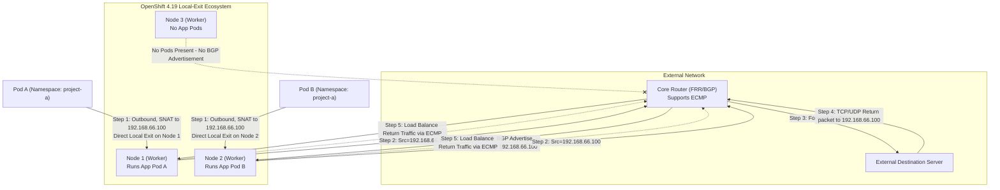

# 基于 BGP、OVN 与 Egress Service 的分布式 Egress IP 方案 (OpenShift 4.19)

## 1. 背景与痛点
在大型容需部署的集群环境中，当存在大量外部通信（Egress）需求时，传统的 Egress IP 架构存在明显的设计瓶颈：
- **单节点流量瓶颈**：传统的方案使用 `EgressIP` CRD，会将某个 Egress IP 绑定到特定的一个或多个托管节点（Hosted Node）。这意味着，即使一个业务的 Pod 广泛分布在集群所有节点，其出站流量也必须统一“绕道”发送至该托管节点才能向外网发包。当存在数百个 Egress IP 和大流量跨节点路由时，被选作出口的节点在网卡带宽和 CPU 解析上会很快达到上限。
- **网络跳数增加（Tromboning 效应）**：因为流量必须先发到集群边缘托管节点再经由该节点 SNAT 发出，造成无谓的内网网络开销。
- **业务需求不可妥协**：不能放弃使用独立的 Egress IP，因为外部的传统防火墙仍依赖特定的、固定的静态 IP 对来源流量的各个命名空间进行身份标识和安全检查隔离。
- **核心诉求**：客户的真正诉求并非要把 IP 和节点强绑定，而是：**让出站流量直接从 Pod 所在的当前节点流出（避免网络阻塞），但要在到达外部网络时呈现统一分配好的 Egress IP（用于统一的安全组审计）。**

## 2. 架构概述
在 OpenShift 4.19 中，建议摒弃传统的 `EgressIP` CRD，转而使用更加现代化的 **Egress Service** 结合 **OVN-Kubernetes** 与 **FRR-K8s (BGP)**，这能实现完美的“分布式 Egress IP”能力。本质上它结合了 Anycast IP 和出站 SNAT 分流。

核心特性如下：
- **本地流出 (Local Exit)**：OVN-Kubernetes 配合 EgressService，可在当前宿主机对 Pod 出方向的包建立一条逻辑路由器策略。将源 IP 直接被本地重写（SNAT）后由当前节点的出站网口发出，消除集群内部因为封装导致的跨节点跳数损耗。
- **动态 IP 分配**：使用标准的 `LoadBalancer` 类型的 `Service` 在地址池（如 MetalLB 配置池）中划出专用的“身份出口 IP”。
- **灵活的流量劫持**：定义同名的 `EgressService` 对象，配置 `sourceIPBy: "LoadBalancerIP"`，从而强制将选择到的 Pod 的出方向数据包源地址改为此 LoadBalancer IP。
- **分布式选路宣告 (BGP ECMP)**：通过集群内的 FRR-K8s（在 4.19 逐步取代基础版 MetalLB BGP 成为独立首选组件）模块，所有当前承载该目标 Pod 的 OCP 节点都会通过 BGP 议定向核心路由器宣告这个相同出口 IP 路由。上游路由器通过 ECMP (等价多路径) 技术同时将回包路由平均打回对应的健康 Worker 节点从而完成访问闭环。

## 3. 架构配图



## 5. 实验环境搭建与验证过程

为进一步论证上述技术的有效性可行性，设计下列基于 Linux 原生虚拟机环境组网进行验证。此实验构建在一台高性能宿主机 Baremetal CentOS 9 操作系统的 KVM(libvirt) 平台上。宿主机的 `br-ocp` 网桥网段为 `192.168.99.0/24`（宿主机 IP 为 192.168.99.1）。

### 5.1 环境说明
1. **OpenShift 4.19 虚拟集群**: 配置 3 个虚机节点（compact 融合节点作为 Worker及Master），网卡挂载在 `br-ocp`。启用了 OVN-Kubernetes 默认 CNI，并加装具备 MetalLB 的扩展。
   - 节点 IP 处于：`192.168.99.10 ~ 192.168.99.12`
   - **分配的池化 Egress IP 网段**: `192.168.66.0/24`
2. **KVM Router 节点 (CentOS 9)**: 作为模拟数据中心骨干交换机，其上运行软件态 FRR 处理 BGP。
   - 对 OCP 侧连接的桥接桥 `eth0` (处于 br-ocp): `192.168.99.2`
   - 对 Server 端外网模拟口 `eth1`: `192.168.55.1` 
3. **KVM Server 节点 (CentOS 9)**: 充当外域业务服务器供校验 SNAT。
   - 网卡 `eth0` (连接 Router 的 eth1 侧): `192.168.55.100`，默认网关指向 `192.168.55.1`

### 5.2 Router (FRR) 节点配置与就绪
登入作为 Router 的 CentOS 9 虚机节点，首先需开启服务器的数据包内核转发，再进行 FRR 的策略搭建使得 BGP 监听来自各方集群 OCP Worker 的通告。

```bash
# 1. 安装基础路由组件
sudo dnf install -y frr

# 在启动之前，必须在 daemons 文件中显式启用 bgpd 进程
sudo sed -i 's/^bgpd=no/bgpd=yes/' /etc/frr/daemons

sudo systemctl enable --now frr

# 2. 开启内核 IPv4 转发能力
echo "net.ipv4.ip_forward = 1" | sudo tee -a /etc/sysctl.d/99-ipforward.conf
sudo sysctl -p /etc/sysctl.d/99-ipforward.conf

# 3. 编排 FRR 核心配置文件
cat <<EOF | sudo tee /etc/frr/frr.conf
frr defaults traditional
log syslog informational
no ipv6 forwarding
!
router bgp 64512
 bgp router-id 192.168.99.12
 
 ! 配置分别对接 OCP 集群内各节点的 iBGP 邻居
 neighbor 192.168.99.23 remote-as 64512
 neighbor 192.168.99.24 remote-as 64512
 neighbor 192.168.99.25 remote-as 64512

 ! 确保 iBGP 等价多路径 (ECMP) 与网络宣发在 address-family 内配置
 address-family ipv4 unicast
  network 192.168.55.0/24
  maximum-paths ibgp 4
 exit-address-family
!
line vty
!
EOF

# 4. 重载使路由生效
sudo systemctl restart frr
```

### 5.3 Server 节点配置 (流量端点)
Server 是一台外网目标机器，它只需要能向 Router（192.168.55.1） 发包即可。用 Python 启动一个端口接收流量，再用 tcpdump 静候。

```bash
# 配置网关指向 Router
# sudo ip route add default via 192.168.55.12

sudo ip route add 192.168.66.100 via 192.168.55.12

ip r
default via 192.168.99.1 dev enp1s0 proto static metric 100
192.168.55.0/24 dev enp1s0 proto kernel scope link src 192.168.55.13 metric 100
192.168.66.100 via 192.168.55.12 dev enp1s0
192.168.99.0/24 dev enp1s0 proto kernel scope link src 192.168.99.13 metric 100

# 后台启一个用于检验数据能否顺利联通抵达的静态 Http 侦听点
# (同时监听 80 和 8080 端口，证明 Egress IP 不受 Service 端口声明的限制)
nohup python3 -m http.server 80 &
nohup python3 -m http.server 8080 &

# 抓取针对此端点的访问报文并观测实际封装和剥离后的 IP (观测 Egress IP 192.168.66.100)
sudo tcpdump -i any 'tcp port 80 or tcp port 8080' -n
```

### 5.4 OpenShift 集群侧配置实操
以下在能够与 OpenShift 集群使用 `oc` 客户端通信的控制端开始执行操作：

enable bgp
```bash
oc patch Network.operator.openshift.io cluster --type=merge \
-p='{
"spec": {
"additionalRoutingCapabilities": {
"providers": ["FRR"]
},
"defaultNetwork": {
"ovnKubernetesConfig": {
"routeAdvertisements": "Enabled"
}}}}'

```

clean up 

```bash

# 1. 删除旧的资源
oc delete egressservice egress-identity -n demo-egress --ignore-not-found
oc delete svc egress-identity -n demo-egress --ignore-not-found
oc delete bgpadvertisement egress-identity-bgp-adv -n metallb-system --ignore-not-found
oc delete svc egress-identity -n demo-egress --ignore-not-found
oc delete bgpadvertisement egress-identity-bgp-adv -n metallb-system --ignore-not-found
egressservice.k8s.ovn.org "egress-identity" deleted
service "egress-identity" deleted

# 2. 为所有节点打上 egress-assignable 标识（OVN-K 通过此标签挑选谁有资格承载 EgressIP）
oc label node --all k8s.ovn.org/egress-assignable="" --overwrite
node/master-01-demo labeled
node/master-02-demo labeled
node/master-03-demo labeled


# 3. 验证 FRR 基础配置是否存续并且在运行：
oc get frrconfiguration bgp-core-router -n openshift-frr-k8s -o yaml | grep "mode:"
            mode: all
            mode: filtered


oc get frrconfiguration bgp-core-router -n openshift-frr-k8s -o yaml
apiVersion: frrk8s.metallb.io/v1beta1
kind: FRRConfiguration
metadata:
  creationTimestamp: "2026-02-28T04:13:37Z"
  generation: 3
  labels:
    use-for-advertisements: "true"
  name: bgp-core-router
  namespace: openshift-frr-k8s
  resourceVersion: "226266"
  uid: 3bc0cd64-0e53-4366-996e-6034f25c8366
spec:
  bgp:
    bfdProfiles:
    - detectMultiplier: 3
      name: fast-bfd
    routers:
    - asn: 64512
      neighbors:
      - address: 192.168.99.12
        asn: 64512
        bfdProfile: fast-bfd
        disableMP: true
        dualStackAddressFamily: false
        toAdvertise:
          allowed:
            mode: all
        toReceive:
          allowed:
            mode: filtered
            prefixes:
            - prefix: 192.168.55.0/24
      prefixes:
      - 192.168.66.100/32


# 1. 部署官方 EgressIP CR
cat <<EOF | oc apply -f -
apiVersion: k8s.ovn.org/v1
kind: EgressIP
metadata:
  name: project-egressip
spec:
  egressIPs:
  - 192.168.66.100
  namespaceSelector:
    matchLabels:
      kubernetes.io/metadata.name: demo-egress
EOF


# 2. 探查 Egress IP 被集群 OVN-K 分配成了哪个节点作为托管 (Hosted Node)
# 这一步非常关键！它决定了等下我们要去哪台大动脉机器上解剖 OVS 流表
sleep 5
oc get egressips project-egressip -o yaml
# apiVersion: k8s.ovn.org/v1
# kind: EgressIP
# metadata:
#   annotations:
#     kubectl.kubernetes.io/last-applied-configuration: |
#       {"apiVersion":"k8s.ovn.org/v1","kind":"EgressIP","metadata":{"annotations":{},"name":"project-egressip"},"spec":{"egressIPs":["192.168.66.100"],"namespaceSelector":{"matchLabels":{"kubernetes.io/metadata.name":"demo-egress"}}}}
#   creationTimestamp: "2026-02-28T09:56:26Z"
#   generation: 1
#   name: project-egressip
#   resourceVersion: "251374"
#   uid: 0a9466b0-b94d-4f37-a490-b694ef6fc85d
# spec:
#   egressIPs:
#   - 192.168.66.100
#   namespaceSelector:
#     matchLabels:
#       kubernetes.io/metadata.name: demo-egress


# 3. 再去你的上游路由器 (FRR 虚拟机 192.168.99.12) 上确认 OVN 是否借助 FRR-K8s 发出了 BGP 公告
# 请登录到上游 Router VM 上执行：
vtysh -c "show ip route bgp"
Codes: K - kernel route, C - connected, S - static, R - RIP,
       O - OSPF, I - IS-IS, B - BGP, E - EIGRP, N - NHRP,
       T - Table, v - VNC, V - VNC-Direct, F - PBR,
       f - OpenFabric,
       > - selected route, * - FIB route, q - queued, r - rejected, b - backup
       t - trapped, o - offload failure

B>* 192.168.66.100/32 [200/0] via 192.168.99.23, enp1s0, weight 1, 00:14:31
  *                           via 192.168.99.24, enp1s0, weight 1, 00:14:31
  *                           via 192.168.99.25, enp1s0, weight 1, 00:14:31


# 1. 剔除 FRRConfiguration 中硬编码的 prefixes，把 BGP 发布权交还给 OVN-K 动态处理
oc patch frrconfiguration bgp-core-router -n openshift-frr-k8s --type=json -p='[{"op": "remove", "path": "/spec/bgp/routers/0/prefixes"}]'

# 2. 检查 OVN-K Cluster Manager 的日志，这是负责选举和分配 Egress IP 到宿主机的核心组件
oc logs -n openshift-ovn-kubernetes -l app=ovnkube-control-plane -c ovnkube-cluster-manager --tail=100 | grep -iE "egressip|project-egressip|192.168.66.100"

W0228 09:53:01.659639       1 egressip_healthcheck.go:169] Health checking using insecure connection
I0228 09:53:01.661219       1 egressip_healthcheck.go:194] Connected to master-03-demo (10.133.0.2:9107)
I0228 09:53:01.661262       1 egressip_event_handler.go:130] Node: master-03-demo has been labeled, adding it for egress assignment
E0228 09:56:26.225771       1 egressip_controller.go:1340] No matching host found for EgressIP: project-egressip
I0228 09:56:26.226218       1 event.go:377] Event(v1.ObjectReference{Kind:"EgressIP", Namespace:"", Name:"project-egressip", UID:"", APIVersion:"", ResourceVersion:"", FieldPath:""}): type: 'Warning' reason: 'NoMatchingNodeFound' No matching nodes found, which can host any of the egress IPs: [192.168.66.100] for object EgressIP: project-egressip
I0228 09:59:18.060861       1 reflector.go:946] "Watch close" reflector="github.com/openshift/ovn-kubernetes/go-controller/pkg/crd/egressip/v1/apis/informers/externalversions/factory.go:140" type="*v1.EgressIP" totalItems=10
I0228 10:05:05.064579       1 reflector.go:946] "Watch close" reflector="github.com/openshift/ovn-kubernetes/go-controller/pkg/crd/egressip/v1/apis/informers/externalversions/factory.go:140" type="*v1.EgressIP" totalItems=6
I0228 10:12:37.068722       1 reflector.go:946] "Watch close" reflector="github.com/openshift/ovn-kubernetes/go-controller/pkg/crd/egressip/v1/apis/informers/externalversions/factory.go:140" type="*v1.EgressIP" totalItems=8
I0228 10:18:59.072195       1 reflector.go:946] "Watch close" reflector="github.com/openshift/ovn-kubernetes/go-controller/pkg/crd/egressip/v1/apis/informers/externalversions/factory.go:140" type="*v1.EgressIP" totalItems=7
I0228 10:25:48.077591       1 reflector.go:946] "Watch close" reflector="github.com/openshift/ovn-kubernetes/go-controller/pkg/crd/egressip/v1/apis/informers/externalversions/factory.go:140" type="*v1.EgressIP" totalItems=8
I0228 10:32:53.080973       1 reflector.go:946] "Watch close" reflector="github.com/openshift/ovn-kubernetes/go-controller/pkg/crd/egressip/v1/apis/informers/externalversions/factory.go:140" type="*v1.EgressIP" totalItems=8


# 3. 检查 Node 的实际状态，确认 label 是否都成功附着在 node 的 Annotations 和 Labels 上
oc get nodes -o custom-columns=NAME:.metadata.name,NODEIPS:.status.addresses[?(@.type=="InternalIP")].address,ASSIGNABLE:.metadata.labels.'k8s\.ovn\.org/egress-assignable'

NAME   NODEIPS   ASSIGNABLE
error: unrecognized identifier InternalIP


oc get nodes -o custom-columns=NAME:.metadata.name,NODEIPS:.status.addresses
NAME             NODEIPS
master-01-demo   [map[address:192.168.99.23 type:InternalIP] map[address:master-01-demo type:Hostname]]
master-02-demo   [map[address:192.168.99.24 type:InternalIP] map[address:master-02-demo type:Hostname]]
master-03-demo   [map[address:192.168.99.25 type:InternalIP] map[address:master-03-demo type:Hostname]]


# 4. 去路由器上看看，刚刚我们删掉静态 bgp prefix 后，现在是否有动态路由被发布出来了
sleep 5
vtysh -c "show ip route bgp"

[root@routing-frr ~]# vtysh -c "show ip route bgp"
[root@routing-frr ~]#


# 5. 再次检查 EgressIP 的 status 是否出现了
oc get egressips project-egressip -o yaml

oc get egressips project-egressip -o yaml
# apiVersion: k8s.ovn.org/v1
# kind: EgressIP
# metadata:
#   annotations:
#     kubectl.kubernetes.io/last-applied-configuration: |
#       {"apiVersion":"k8s.ovn.org/v1","kind":"EgressIP","metadata":{"annotations":{},"name":"project-egressip"},"spec":{"egressIPs":["192.168.66.100"],"namespaceSelector":{"matchLabels":{"kubernetes.io/metadata.name":"demo-egress"}}}}
#   creationTimestamp: "2026-02-28T09:56:26Z"
#   generation: 1
#   name: project-egressip
#   resourceVersion: "251374"
#   uid: 0a9466b0-b94d-4f37-a490-b694ef6fc85d
# spec:
#   egressIPs:
#   - 192.168.66.100
#   namespaceSelector:
#     matchLabels:
#       kubernetes.io/metadata.name: demo-egress


# 1. 检查基础 Network.config 里面有没有显式配置（例如 egressIPConfig 等，不一定有，但需要排查）
oc get network.config.openshift.io cluster -o yaml | grep -A 10 egress

oc get network.config.openshift.io cluster -o yaml
apiVersion: config.openshift.io/v1
kind: Network
metadata:
  creationTimestamp: "2026-02-13T11:23:44Z"
  generation: 9
  name: cluster
  resourceVersion: "248340"
  uid: f1a80dec-b72f-4b0e-b8d9-48479d721820
spec:
  clusterNetwork:
  - cidr: 10.132.0.0/14
    hostPrefix: 23
  externalIP:
    policy: {}
  networkDiagnostics:
    mode: ""
    sourcePlacement: {}
    targetPlacement: {}
  networkType: OVNKubernetes
  serviceNetwork:
  - 172.22.0.0/16
status:
  clusterNetwork:
  - cidr: 10.132.0.0/14
    hostPrefix: 23
  clusterNetworkMTU: 1400
  conditions:
  - lastTransitionTime: "2026-02-28T09:44:11Z"
    message: ""
    observedGeneration: 0
    reason: AsExpected
    status: "True"
    type: NetworkDiagnosticsAvailable
  networkType: OVNKubernetes
  serviceNetwork:
  - 172.22.0.0/16

# 2. 检查 OVN-Kubernetes 配置中关于 Egress IP 的全局设定（这是决定非同网段 Egress IP 能否分配的关键）
oc get network.operator.openshift.io cluster -o yaml


apiVersion: operator.openshift.io/v1
kind: Network
metadata:
  creationTimestamp: "2026-02-13T11:27:22Z"
  generation: 3
  name: cluster
  resourceVersion: "248380"
  uid: 50de6779-ccba-466d-9835-c82123935fc2
spec:
  additionalRoutingCapabilities:
    providers:
    - FRR
  clusterNetwork:
  - cidr: 10.132.0.0/14
    hostPrefix: 23
  defaultNetwork:
    ovnKubernetesConfig:
      egressIPConfig: {}
      gatewayConfig:
        ipv4: {}
        ipv6: {}
        routingViaHost: false
      genevePort: 6081
      ipsecConfig:
        mode: Disabled
      mtu: 1400
      policyAuditConfig:
        destination: "null"
        maxFileSize: 50
        maxLogFiles: 5
        rateLimit: 20
        syslogFacility: local0
      routeAdvertisements: Enabled
    type: OVNKubernetes
  deployKubeProxy: false
  disableMultiNetwork: false
  disableNetworkDiagnostics: false
  logLevel: Normal
  managementState: Managed
  observedConfig: null
  operatorLogLevel: Normal
  serviceNetwork:
  - 172.22.0.0/16
  unsupportedConfigOverrides: null
  useMultiNetworkPolicy: false
status:
  conditions:
  - lastTransitionTime: "2026-02-27T08:09:49Z"
    message: ""
    reason: ""
    status: "False"
    type: ManagementStateDegraded
  - lastTransitionTime: "2026-02-13T11:27:55Z"
    message: ""
    reason: ""
    status: "False"
    type: Degraded
  - lastTransitionTime: "2026-02-13T11:27:22Z"
    message: ""
    reason: ""
    status: "True"
    type: Upgradeable
  - lastTransitionTime: "2026-02-28T03:21:58Z"
    message: ""
    reason: ""
    status: "False"
    type: Progressing
  - lastTransitionTime: "2026-02-13T11:28:41Z"
    message: ""
    reason: ""
    status: "True"
    type: Available
  readyReplicas: 0
  version: 4.19.24


# 3. 检查任意一个节点上，OVN 会记录它向哪些网口去挂接 EgressIP
oc get node master-01-demo -o jsonpath='{.metadata.annotations}' | grep -o -E '"k8s.ovn.org/node-egress-ifaddr":"[^"]+"'

[sno@ip-172-31-60-222 ~]$ oc get node master-01-demo -o jsonpath='{.metadata.annotations}' | grep -o -E '"k8s.ovn.org/node-egress-ifaddr":"[^"]+"'
[sno@ip-172-31-60-222 ~]$ oc get node master-01-demo -o jsonpath='{.metadata.annotations}'
{"k8s.ovn.org/host-cidrs":"[\"192.168.77.23/24\",\"192.168.99.21/32\",\"192.168.99.22/32\",\"192.168.99.23/24\"]","k8s.ovn.org/l3-gateway-config":"{\"default\":{\"mode\":\"shared\",\"bridge-id\":\"br-ex\",\"interface-id\":\"br-ex_master-01-demo\",\"mac-address\":\"00:50:56:8e:2a:31\",\"ip-addresses\":[\"192.168.99.23/24\"],\"ip-address\":\"192.168.99.23/24\",\"next-hops\":[\"192.168.99.1\"],\"next-hop\":\"192.168.99.1\",\"node-port-enable\":\"true\",\"vlan-id\":\"0\"}}","k8s.ovn.org/node-chassis-id":"5dd52df9-75e9-47e0-9cc4-2331ee9b26e3","k8s.ovn.org/node-encap-ips":"[\"192.168.99.23\"]","k8s.ovn.org/node-id":"4","k8s.ovn.org/node-masquerade-subnet":"{\"ipv4\":\"169.254.0.0/17\",\"ipv6\":\"fd69::/112\"}","k8s.ovn.org/node-primary-ifaddr":"{\"ipv4\":\"192.168.99.23/24\"}","k8s.ovn.org/node-subnets":"{\"default\":[\"10.134.0.0/23\"]}","k8s.ovn.org/node-transit-switch-port-ifaddr":"{\"ipv4\":\"100.88.0.4/16\"}","k8s.ovn.org/remote-zone-migrated":"master-01-demo","k8s.ovn.org/zone-name":"master-01-demo","machine.openshift.io/machine":"openshift-machine-api/demo-01-rhsys-hr8mp-master-0","machineconfiguration.openshift.io/controlPlaneTopology":"HighlyAvailable","machineconfiguration.openshift.io/currentConfig":"rendered-master-8ccbd48e5b86565d342e76ef31624253","machineconfiguration.openshift.io/desiredConfig":"rendered-master-8ccbd48e5b86565d342e76ef31624253","machineconfiguration.openshift.io/desiredDrain":"uncordon-rendered-master-8ccbd48e5b86565d342e76ef31624253","machineconfiguration.openshift.io/lastAppliedDrain":"uncordon-rendered-master-8ccbd48e5b86565d342e76ef31624253","machineconfiguration.openshift.io/lastObservedServerCAAnnotation":"false","machineconfiguration.openshift.io/lastSyncedControllerConfigResourceVersion":"152941","machineconfiguration.openshift.io/post-config-action":"","machineconfiguration.openshift.io/reason":"","machineconfiguration.openshift.io/state":"Done","volumes.kubernetes.io/controller-managed-attach-detach":"true"}


oc get node master-01-demo -o jsonpath='{.metadata.annotations}' | grep -o -E '"k8s.ovn.org/node-primary-ifaddr":"[^"]+"'

[sno@ip-172-31-60-222 ~]$ oc get node master-01-demo -o jsonpath='{.metadata.annotations}' | grep -o -E '"k8s.ovn.org/node-primary-ifaddr":"[^"]+"'
# "k8s.ovn.org/node-primary-ifaddr":"{\"


oc get node master-01-demo -o jsonpath='{.metadata.annotations}' | grep -o -E '"k8s.ovn.org/routing-capabilities":"[^"]+"'

# 4. 看看这个 egress IP 网段（192.168.66.0/24）是否被加到了 OVN 的外部允许的网络中或者主机子网中：
oc describe network.config.openshift.io cluster

Name:         cluster
Namespace:
Labels:       <none>
Annotations:  <none>
API Version:  config.openshift.io/v1
Kind:         Network
Metadata:
  Creation Timestamp:  2026-02-13T11:23:44Z
  Generation:          9
  Resource Version:    248340
  UID:                 f1a80dec-b72f-4b0e-b8d9-48479d721820
Spec:
  Cluster Network:
    Cidr:         10.132.0.0/14
    Host Prefix:  23
  External IP:
    Policy:
  Network Diagnostics:
    Mode:
    Source Placement:
    Target Placement:
  Network Type:  OVNKubernetes
  Service Network:
    172.22.0.0/16
Status:
  Cluster Network:
    Cidr:               10.132.0.0/14
    Host Prefix:        23
  Cluster Network MTU:  1400
  Conditions:
    Last Transition Time:  2026-02-28T09:44:11Z
    Message:
    Observed Generation:   0
    Reason:                AsExpected
    Status:                True
    Type:                  NetworkDiagnosticsAvailable
  Network Type:            OVNKubernetes
  Service Network:
    172.22.0.0/16
Events:  <none>


# 1. 开启 Egress IP 的 Host 路由能力，允许不同网段的 Egress IP 分发给节点
oc patch network.operator.openshift.io cluster --type=merge -p='{
  "spec": {
    "defaultNetwork": {
      "ovnKubernetesConfig": {
        "gatewayConfig": {
          "routingViaHost": true
        }
      }
    }
  }
}'

# 2. 修改配置后，OVN-K 控制平面会重启重启以应用。请等待约 1 分钟，然后检查是否分配成功：
sleep 60
oc get egressips project-egressip -o yaml

apiVersion: k8s.ovn.org/v1
kind: EgressIP
metadata:
  annotations:
    k8s.ovn.org/egressip-mark: "50000"
  creationTimestamp: "2026-02-28T09:56:26Z"
  generation: 1
  name: project-egressip
  resourceVersion: "264796"
  uid: 0a9466b0-b94d-4f37-a490-b694ef6fc85d
spec:
  egressIPs:
  - 192.168.66.100
  namespaceSelector:
    matchLabels:
      kubernetes.io/metadata.name: demo-egress


# 提取最新的报错信息
oc logs -n openshift-ovn-kubernetes -l app=ovnkube-control-plane -c ovnkube-cluster-manager --tail=100 | grep -iE "egressip|project-egressip|192.168.66.100"


I0228 10:55:41.493671       1 config.go:2358] Parsed config: {Default:{MTU:1400 RoutableMTU:0 ConntrackZone:64000 HostMasqConntrackZone:0 OVNMasqConntrackZone:0 HostNodePortConntrackZone:0 ReassemblyConntrackZone:0 EncapType:geneve EncapIP: EffectiveEncapIP: EncapPort:6081 InactivityProbe:100000 OpenFlowProbe:0 OfctrlWaitBeforeClear:0 MonitorAll:true OVSDBTxnTimeout:1m40s LFlowCacheEnable:true LFlowCacheLimit:0 LFlowCacheLimitKb:1048576 RawClusterSubnets:10.132.0.0/14/23 ClusterSubnets:[] EnableUDPAggregation:true Zone:global RawUDNAllowedDefaultServices:default/kubernetes,openshift-dns/dns-default UDNAllowedDefaultServices:[]} Logging:{File: CNIFile: LibovsdbFile:/var/log/ovnkube/libovsdb.log Level:4 LogFileMaxSize:100 LogFileMaxBackups:5 LogFileMaxAge:0 ACLLoggingRateLimit:20} Monitoring:{RawNetFlowTargets: RawSFlowTargets: RawIPFIXTargets: NetFlowTargets:[] SFlowTargets:[] IPFIXTargets:[]} IPFIX:{Sampling:400 CacheActiveTimeout:60 CacheMaxFlows:0} CNI:{ConfDir:/etc/cni/net.d Plugin:ovn-k8s-cni-overlay} OVNKubernetesFeature:{EnableAdminNetworkPolicy:true EnableEgressIP:true EgressIPReachabiltyTotalTimeout:1 EnableEgressFirewall:true EnableEgressQoS:true EnableEgressService:true EgressIPNodeHealthCheckPort:9107 EnableMultiNetwork:true EnableNetworkSegmentation:true EnablePreconfiguredUDNAddresses:false EnableRouteAdvertisements:false EnableMultiNetworkPolicy:false EnableStatelessNetPol:false EnableInterconnect:false EnableMultiExternalGateway:true EnablePersistentIPs:false EnableDNSNameResolver:false EnableServiceTemplateSupport:false EnableObservability:false EnableNetworkQoS:false AdvertisedUDNIsolationMode:strict} Kubernetes:{BootstrapKubeconfig: CertDir: CertDuration:10m0s Kubeconfig: CACert: CAData:[] APIServer:https://api-int.demo-01-rhsys.wzhlab.top:6443 Token: TokenFile: CompatServiceCIDR: RawServiceCIDRs:172.22.0.0/16 ServiceCIDRs:[] OVNConfigNamespace:openshift-ovn-kubernetes OVNEmptyLbEvents:false PodIP: RawNoHostSubnetNodes: NoHostSubnetNodes:<nil> HostNetworkNamespace:openshift-host-network DisableRequestedChassis:false PlatformType:BareMetal HealthzBindAddress:0.0.0.0:10256 CompatMetricsBindAddress: CompatOVNMetricsBindAddress: CompatMetricsEnablePprof:false DNSServiceNamespace:openshift-dns DNSServiceName:dns-default} Metrics:{BindAddress: OVNMetricsBindAddress: ExportOVSMetrics:false EnablePprof:false NodeServerPrivKey: NodeServerCert: EnableConfigDuration:false EnableScaleMetrics:false} OvnNorth:{Address: PrivKey: Cert: CACert: CertCommonName: Scheme: ElectionTimer:0 northbound:false exec:<nil>} OvnSouth:{Address: PrivKey: Cert: CACert: CertCommonName: Scheme: ElectionTimer:0 northbound:false exec:<nil>} Gateway:{Mode:local Interface: GatewayAcceleratedInterface: EgressGWInterface: NextHop: VLANID:0 NodeportEnable:true DisableSNATMultipleGWs:false V4JoinSubnet:100.64.0.0/16 V6JoinSubnet:fd98::/64 V4MasqueradeSubnet:169.254.169.0/29 V6MasqueradeSubnet:fd69::/125 MasqueradeIPs:{V4OVNMasqueradeIP:169.254.169.1 V6OVNMasqueradeIP:fd69::1 V4HostMasqueradeIP:169.254.169.2 V6HostMasqueradeIP:fd69::2 V4HostETPLocalMasqueradeIP:169.254.169.3 V6HostETPLocalMasqueradeIP:fd69::3 V4DummyNextHopMasqueradeIP:169.254.169.4 V6DummyNextHopMasqueradeIP:fd69::4 V4OVNServiceHairpinMasqueradeIP:169.254.169.5 V6OVNServiceHairpinMasqueradeIP:fd69::5} DisablePacketMTUCheck:false RouterSubnet: SingleNode:false DisableForwarding:false AllowNoUplink:false EphemeralPortRange:} MasterHA:{ElectionLeaseDuration:137 ElectionRenewDeadline:107 ElectionRetryPeriod:26} ClusterMgrHA:{ElectionLeaseDuration:137 ElectionRenewDeadline:107 ElectionRetryPeriod:26} HybridOverlay:{Enabled:false RawClusterSubnets: ClusterSubnets:[] VXLANPort:4789} OvnKubeNode:{Mode:full DPResourceDeviceIdsMap:map[] MgmtPortNetdev: MgmtPortDPResourceName:} ClusterManager:{V4TransitSwitchSubnet:100.88.0.0/16 V6TransitSwitchSubnet:fd97::/64}}
I0228 10:55:44.514984       1 controller.go:133] Adding controller clustermanager routeadvertisements egressip controller event handlers
I0228 10:55:44.515086       1 shared_informer.go:350] "Waiting for caches to sync" controller="clustermanager routeadvertisements egressip controller"
I0228 10:55:44.515108       1 shared_informer.go:357] "Caches are synced" controller="clustermanager routeadvertisements egressip controller"
I0228 10:55:44.515394       1 controller.go:157] Starting controller clustermanager routeadvertisements egressip controller with 1 workers
W0228 10:55:48.423695       1 egressip_healthcheck.go:169] Health checking using insecure connection
W0228 10:55:49.424062       1 egressip_healthcheck.go:188] Could not connect to master-02-demo (10.132.0.2:9107): context deadline exceeded
W0228 10:55:51.040085       1 egressip_healthcheck.go:169] Health checking using insecure connection
W0228 10:55:52.040577       1 egressip_healthcheck.go:188] Could not connect to master-02-demo (10.132.0.2:9107): context deadline exceeded
W0228 10:55:53.423931       1 egressip_healthcheck.go:169] Health checking using insecure connection
I0228 10:55:53.427574       1 egressip_healthcheck.go:194] Connected to master-02-demo (10.132.0.2:9107)
I0228 10:55:53.429456       1 egressip_controller.go:614] Node: master-02-demo is detected as reachable and ready again, adding it to egress assignment
E0228 10:55:53.434931       1 egressip_controller.go:1340] No matching host found for EgressIP: project-egressip
I0228 10:55:53.435068       1 event.go:377] Event(v1.ObjectReference{Kind:"EgressIP", Namespace:"", Name:"project-egressip", UID:"", APIVersion:"", ResourceVersion:"", FieldPath:""}): type: 'Warning' reason: 'NoMatchingNodeFound' No matching nodes found, which can host any of the egress IPs: [192.168.66.100] for object EgressIP: project-egressip
I0228 10:56:03.425887       1 egressip_healthcheck.go:203] Closing connection with master-01-demo (10.134.0.2:9107)
W0228 10:56:08.426152       1 egressip_healthcheck.go:169] Health checking using insecure connection
W0228 10:56:09.426671       1 egressip_healthcheck.go:188] Could not connect to master-01-demo (10.134.0.2:9107): context deadline exceeded
W0228 10:56:09.426896       1 egressip_controller.go:609] Node: master-01-demo is detected as unreachable, deleting it from egress assignment
W0228 10:56:11.414535       1 egressip_healthcheck.go:169] Health checking using insecure connection
W0228 10:56:12.415117       1 egressip_healthcheck.go:188] Could not connect to master-01-demo (10.134.0.2:9107): context deadline exceeded
W0228 10:56:13.425599       1 egressip_healthcheck.go:169] Health checking using insecure connection
I0228 10:56:13.428700       1 egressip_healthcheck.go:194] Connected to master-01-demo (10.134.0.2:9107)
I0228 10:56:13.429479       1 egressip_controller.go:614] Node: master-01-demo is detected as reachable and ready again, adding it to egress assignment
E0228 10:56:13.433183       1 egressip_controller.go:1340] No matching host found for EgressIP: project-egressip
I0228 10:56:13.433271       1 event.go:377] Event(v1.ObjectReference{Kind:"EgressIP", Namespace:"", Name:"project-egressip", UID:"", APIVersion:"", ResourceVersion:"", FieldPath:""}): type: 'Warning' reason: 'NoMatchingNodeFound' No matching nodes found, which can host any of the egress IPs: [192.168.66.100] for object EgressIP: project-egressip
I0228 10:56:23.426879       1 egressip_healthcheck.go:203] Closing connection with master-03-demo (10.133.0.2:9107)
W0228 10:56:28.426745       1 egressip_healthcheck.go:169] Health checking using insecure connection
W0228 10:56:29.427973       1 egressip_healthcheck.go:188] Could not connect to master-03-demo (10.133.0.2:9107): context deadline exceeded
W0228 10:56:29.428037       1 egressip_controller.go:609] Node: master-03-demo is detected as unreachable, deleting it from egress assignment
W0228 10:56:31.741355       1 egressip_healthcheck.go:169] Health checking using insecure connection
W0228 10:56:32.741766       1 egressip_healthcheck.go:188] Could not connect to master-03-demo (10.133.0.2:9107): context deadline exceeded
W0228 10:56:33.426301       1 egressip_healthcheck.go:169] Health checking using insecure connection
I0228 10:56:33.427345       1 egressip_healthcheck.go:194] Connected to master-03-demo (10.133.0.2:9107)
I0228 10:56:33.427386       1 egressip_controller.go:614] Node: master-03-demo is detected as reachable and ready again, adding it to egress assignment
E0228 10:56:33.430895       1 egressip_controller.go:1340] No matching host found for EgressIP: project-egressip
I0228 10:56:33.431011       1 event.go:377] Event(v1.ObjectReference{Kind:"EgressIP", Namespace:"", Name:"project-egressip", UID:"", APIVersion:"", ResourceVersion:"", FieldPath:""}): type: 'Warning' reason: 'NoMatchingNodeFound' No matching nodes found, which can host any of the egress IPs: [192.168.66.100] for object EgressIP: project-egressip
I0228 11:01:00.341189       1 reflector.go:946] "Watch close" reflector="github.com/openshift/ovn-kubernetes/go-controller/pkg/crd/egressip/v1/apis/informers/externalversions/factory.go:140" type="*v1.EgressIP" totalItems=7
I0228 11:08:29.347823       1 reflector.go:946] "Watch close" reflector="github.com/openshift/ovn-kubernetes/go-controller/pkg/crd/egressip/v1/apis/informers/externalversions/factory.go:140" type="*v1.EgressIP" totalItems=9


oc get egressip project-egressip -o yaml
apiVersion: k8s.ovn.org/v1
kind: EgressIP
metadata:
  annotations:
    k8s.ovn.org/egressip-mark: "50000"
  creationTimestamp: "2026-02-28T09:56:26Z"
  generation: 1
  name: project-egressip
  resourceVersion: "264796"
  uid: 0a9466b0-b94d-4f37-a490-b694ef6fc85d
spec:
  egressIPs:
  - 192.168.66.100
  namespaceSelector:
    matchLabels:
      kubernetes.io/metadata.name: demo-egress


oc get nodes --show-labels
NAME             STATUS   ROLES                         AGE   VERSION    LABELS
master-01-demo   Ready    control-plane,master,worker   14d   v1.32.10   beta.kubernetes.io/arch=amd64,beta.kubernetes.io/os=linux,k8s.ovn.org/egress-assignable=,kubernetes.io/arch=amd64,kubernetes.io/hostname=master-01-demo,kubernetes.io/os=linux,node-role.kubernetes.io/control-plane=,node-role.kubernetes.io/master=,node-role.kubernetes.io/worker=,node.openshift.io/os_id=rhcos
master-02-demo   Ready    control-plane,master,worker   14d   v1.32.10   beta.kubernetes.io/arch=amd64,beta.kubernetes.io/os=linux,k8s.ovn.org/egress-assignable=,kubernetes.io/arch=amd64,kubernetes.io/hostname=master-02-demo,kubernetes.io/os=linux,node-role.kubernetes.io/control-plane=,node-role.kubernetes.io/master=,node-role.kubernetes.io/worker=,node.openshift.io/os_id=rhcos
master-03-demo   Ready    control-plane,master,worker   14d   v1.32.10   beta.kubernetes.io/arch=amd64,beta.kubernetes.io/os=linux,k8s.ovn.org/egress-assignable=,kubernetes.io/arch=amd64,kubernetes.io/hostname=master-03-demo,kubernetes.io/os=linux,node-role.kubernetes.io/control-plane=,node-role.kubernetes.io/master=,node-role.kubernetes.io/worker=,node.openshift.io/os_id=rhcos

oc get nodes -l k8s.ovn.org/egress-assignable=""
NAME             STATUS   ROLES                         AGE   VERSION
master-01-demo   Ready    control-plane,master,worker   14d   v1.32.10
master-02-demo   Ready    control-plane,master,worker   14d   v1.32.10
master-03-demo   Ready    control-plane,master,worker   14d   v1.32.10


# 这就说明 OVN 把节点加入到了侯选池，连通性 HealthCheck (9107端口) 也是通的，但分配引擎依然拒绝了 192.168.66.100。

# 在 Baremetal（无 Cloud Provider）以及使用了 routingViaHost: true 的架构下，OVN 的 Egress IP 分配逻辑中最后也是最硬的一道坎是 Node 上的 annotations：cloud.network.openshift.io/egress-ipconfig 或者 k8s.ovn.org/node-egress-ifaddr。 既然 Network Operator 的全局 capacity 配置在 4.19 里对你的环境失效了，我们必须手动在 Node 级别宣告它的容量和承接网段，也就是强行给节点打标，告诉 OVN：这个节点不仅能做 Egress，而且它“承诺”自己上面有一张“虚拟”网卡能带起 66.x 网段的容量（或任意网段）。

# 请帮我执行这两条终极命令：

# 1. 强行给所有 master 节点声明 IPv4 Egress Capacity，让 OVN Scheduler 知道它们有"库存"可以接纳非直联网段的IP
oc annotate node --all cloud.network.openshift.io/egress-ipconfig='[{"interface":"br-ex","capacity":{"ipv4":100}}]' --overwrite

# 2. 等待片刻，查看分配结果
sleep 15
oc get egressips project-egressip -o yaml

apiVersion: k8s.ovn.org/v1
kind: EgressIP
metadata:
  annotations:
    k8s.ovn.org/egressip-mark: "50000"
  creationTimestamp: "2026-02-28T09:56:26Z"
  generation: 1
  name: project-egressip
  resourceVersion: "264796"
  uid: 0a9466b0-b94d-4f37-a490-b694ef6fc85d
spec:
  egressIPs:
  - 192.168.66.100
  namespaceSelector:
    matchLabels:
      kubernetes.io/metadata.name: demo-egress

```


### 4.1. FRR-K8s (BGP) 基础配置
向外部核心交换机宣示 AS 以及邻居构建逻辑。
```yaml
apiVersion: frrk8s.metallb.io/v1beta1
kind: FRRConfiguration
metadata:
  name: bgp-core-router
  namespace: openshift-frr-k8s
  labels:
    use-for-advertisements: true  # 供 OVN-K 路由发布使用
spec:
  bgp:
    bfdProfiles:
      - name: fast-bfd
        detectMultiplier: 3  # 检测倍数：连续 3 次未收到报文则判定链路故障
    routers:
    - asn: 64512 # OCP 集群私有 AS 号
      neighbors:
      - address: 192.168.99.12 # 物理路由器(FRR VM)邻居 IP
        asn: 64512
        disableMP: true  # 必须设为 true（IPv4/IPv6 单独建会话）
        bfdProfile: fast-bfd  # 使用上面定义的 BFD 配置文件
        toAdvertise:
          allowed:
            mode: all
        toReceive:
          allowed:
            mode: filtered # 开启过滤模式
            prefixes:
            - prefix: 192.168.55.0/24 # 【白名单】只收这一条
      prefixes:
      - 192.168.66.100/32  # 必须显式允许此前缀发往外部路由器
```

###  install and config metalLB operator

**1. 初始化相关网络池 (依赖 MetalLB Operator 提供 IPAM 地址分配能力)：**
由于之前已经在集群层面开启了 OVN-K 的原生 BGP 路由宣告（基于内置的 FRR-K8s），这里 **不再需要** 配置 MetalLB 的 `BGPPeer` 和 `BGPAdvertisement`。我们仅用 MetalLB 来为 LoadBalancer Service 分配 IP。

```yaml
apiVersion: metallb.io/v1beta1
kind: MetalLB
metadata:
  name: metallb
  namespace: metallb-system
spec:
  # 【关键配置】：显式指定后端为 frr
  bgpBackend: frr
```


```yaml
# metallb-ipam-config.yaml
apiVersion: metallb.io/v1beta1
kind: IPAddressPool
metadata:
  name: egress-pool
  namespace: metallb-system
spec:
  addresses:
  - 192.168.66.100-192.168.66.100 # 我们期望对外展示的独特 Egress IP (处于新的网段)
```
```bash
oc apply -f metallb-ipam-config.yaml
```


**3. 下发 Egress 截留与 SNAT 分配策略集：**

```bash
oc new-project demo-egress
```

```yaml
# egress-bundle.yaml
apiVersion: v1
kind: Service
metadata:
  name: egress-identity
  namespace: demo-egress
  annotations:
    metallb.universe.tf/address-pool: egress-pool
spec:
  type: LoadBalancer
  selector:
    app: requester
# 【灵魂配置】：
  # Cluster (默认): 全集群所有节点都宣告 BGP，回程包可能乱跳。
  # Local: 只有本节点存活了对应的 Pod，才向 BGP 宣告路由。
  externalTrafficPolicy: Local
  ports:
  # 注意：这里的 port 只是满足 K8s Service 语法的硬性占位要求。
  # OVN 对 Egress 的 SNAT 劫持是基于 Pod 源 IP 级别的，
  # 并不限制目标端口。Pod 访问外网任何端口(如 8080, 443 等)都会走 Egress IP。
  - port: 80
---
apiVersion: k8s.ovn.org/v1
kind: EgressService
metadata:
  name: egress-identity 
  namespace: demo-egress
spec:
  sourceIPBy: "LoadBalancerIP"
  
  # 3. 确定哪些节点可以承载这个出口任务
  # 如果不写 nodeSelector，默认全集群节点都行。
  nodeSelector:
    matchLabels:
      node-role.kubernetes.io/master: ""
```
```bash
oc apply -f egress-bundle.yaml
```

```yaml
apiVersion: metallb.io/v1beta1
kind: BGPAdvertisement
metadata:
  name: egress-identity-bgp-adv
  namespace: metallb-system
spec:
  ipAddressPools:
  - egress-pool
  # nodeSelectors:
  # - matchLabels:
  #     egress-service.k8s.ovn.org/demo-egress-egress-identity: ""
```

**2. 部署用于实测的 Demo Pod 实例：**
创建测试 Namespace 以及具有广域分布的 DaemonSet，以便使不同 Worker 上都有能出网际流量的载体：
```bash


cat <<EOF | oc apply -f -
apiVersion: apps/v1
kind: DaemonSet
metadata:
  name: edge-request-ds
  namespace: demo-egress
spec:
  selector:
    matchLabels:
      app: requester
  template:
    metadata:
      labels:
        app: requester
    spec:
      containers:
      - name: toolkit
        image: quay.io/wangzheng422/qimgs:centos9-test-2025.12.18.v01
        command: ["sleep", "infinity"]
EOF


```

### 5.5. 综合验证与观测流向
实验到了这步，即可验证最初假设。

**验证一：BGP 多路径下发 (FRR-Router 侧)**
在充当交换机的 Router（192.168.99.12）机器上打开命令行：


verify the bgp peer established.

```bash
# on up stream frr vm
vtysh -c "show bgp summary"

IPv4 Unicast Summary (VRF default):
BGP router identifier 192.168.99.12, local AS number 64512 vrf-id 0
BGP table version 3
RIB entries 3, using 576 bytes of memory
Peers 3, using 2174 KiB of memory

Neighbor        V         AS   MsgRcvd   MsgSent   TblVer  InQ OutQ  Up/Down State/PfxRcd   PfxSnt Desc
192.168.99.23   4      64512        68        73        0    0    0 00:06:26            1        1 N/A
192.168.99.24   4      64512        69        74        0    0    0 00:06:26            1        1 N/A
192.168.99.25   4      64512        68        73        0    0    0 00:06:26            1        1 N/A

Total number of neighbors 3
```


```bash
sudo vtysh -c "show ip route"
Codes: K - kernel route, C - connected, S - static, R - RIP,
       O - OSPF, I - IS-IS, B - BGP, E - EIGRP, N - NHRP,
       T - Table, v - VNC, V - VNC-Direct, F - PBR,
       f - OpenFabric,
       > - selected route, * - FIB route, q - queued, r - rejected, b - backup
       t - trapped, o - offload failure

K>* 0.0.0.0/0 [0/100] via 192.168.99.1, enp1s0, 01:03:43
C>* 192.168.55.0/24 is directly connected, enp7s0, 01:03:43
K * 192.168.55.0/24 [0/101] is directly connected, enp7s0, 01:03:43
B>* 192.168.66.100/32 [200/0] via 192.168.99.23, enp1s0, weight 1, 00:02:27
  *                           via 192.168.99.24, enp1s0, weight 1, 00:02:27
  *                           via 192.168.99.25, enp1s0, weight 1, 00:02:27
C>* 192.168.99.0/24 is directly connected, enp1s0, 01:03:43
K * 192.168.99.0/24 [0/100] is directly connected, enp1s0, 01:03:43
```

**验证二：不同节点出网的统一外部视点 (Server 侧)**
在控制台分别进入横跨不同 Worker 的两个 Pod 内进行发端：
```bash
NODE1_POD=$(oc get po -n demo-egress -o wide | grep "master-01-demo" | awk '{print $1}')
NODE2_POD=$(oc get po -n demo-egress -o wide | grep "master-02-demo" | awk '{print $1}')
NODE3_POD=$(oc get po -n demo-egress -o wide | grep "master-03-demo" | awk '{print $1}')

oc exec -it $NODE1_POD -n demo-egress --  ip r
default via 10.134.0.1 dev eth0
10.132.0.0/14 via 10.134.0.1 dev eth0
10.134.0.0/23 dev eth0 proto kernel scope link src 10.134.0.3
100.64.0.0/16 via 10.134.0.1 dev eth0
169.254.0.5 via 10.134.0.1 dev eth0
172.22.0.0/16 via 10.134.0.1 dev eth0


oc debug node/master-01-demo -- ip r
Temporary namespace openshift-debug-bm8bx is created for debugging node...
Starting pod/master-01-demo-debug-z7ktc ...
To use host binaries, run `chroot /host`
default via 192.168.99.1 dev br-ex proto static
10.132.0.0/14 via 10.134.0.1 dev ovn-k8s-mp0
10.134.0.0/23 dev ovn-k8s-mp0 proto kernel scope link src 10.134.0.2
169.254.0.0/17 dev br-ex proto kernel scope link src 169.254.0.2
169.254.0.1 dev br-ex src 192.168.99.23
169.254.0.3 via 10.134.0.1 dev ovn-k8s-mp0
172.22.0.0/16 via 169.254.0.4 dev br-ex src 169.254.0.2 mtu 1400
192.168.55.0/24 nhid 114 via 192.168.99.12 dev br-ex proto bgp metric 20
192.168.77.0/24 dev enp2s0 proto kernel scope link src 192.168.77.23 metric 100
192.168.99.0/24 dev br-ex proto kernel scope link src 192.168.99.23 metric 48

oc exec -it $NODE1_POD -n demo-egress -- curl -I http://192.168.55.13 --connect-timeout 2
oc exec -it $NODE2_POD -n demo-egress -- curl -I http://192.168.55.13 --connect-timeout 2
oc exec -it $NODE3_POD -n demo-egress -- curl -I http://192.168.55.13 --connect-timeout 2

# 测试访问 8080 端口，验证流量依然能通且受到 Egress 保护：
oc exec -it $NODE1_POD -n demo-egress -- curl -I http://192.168.55.13:8080 --connect-timeout 2
oc exec -it $NODE2_POD -n demo-egress -- curl -I http://192.168.55.13:8080 --connect-timeout 2


oc get nodes -l 'egress-service.k8s.ovn.org/demo-egress-egress-identity'
NAME             STATUS   ROLES                         AGE   VERSION
master-02-demo   Ready    control-plane,master,worker   14d   v1.32.10


oc logs -n metallb-system -l component=speaker -c speaker | grep -Ei "error|fail|warning"


oc logs -n metallb-system -l component=speaker | grep "Announcing"
Defaulted container "speaker" out of: speaker, frr, reloader, frr-metrics, kube-rbac-proxy, kube-rbac-proxy-frr, cp-frr-files (init), cp-reloader (init), cp-metrics (init)
Defaulted container "speaker" out of: speaker, frr, reloader, frr-metrics, kube-rbac-proxy, kube-rbac-proxy-frr, cp-frr-files (init), cp-reloader (init), cp-metrics (init)
Defaulted container "speaker" out of: speaker, frr, reloader, frr-metrics, kube-rbac-proxy, kube-rbac-proxy-frr, cp-frr-files (init), cp-reloader (init), cp-metrics (init)


SPEAKER_POD=$(oc get po -n metallb-system -l component=speaker -o name | head -n 1)
oc exec -n metallb-system $SPEAKER_POD -c speaker -- vtysh -c "show bgp summary"
executable file `vtysh` not found in $PATH: No such file or directory
command terminated with exit code 1

oc exec -n metallb-system $SPEAKER_POD -c frr -- vtysh -c "show ip bgp summary"
% BGP instance not found


# 验证 OVN-K 侧的 BGP 状态
echo "--- OVN-K BGP Status ---"
for pod in $(oc get po -n openshift-frr-k8s -l app=frr-k8s -o name); do
  echo "Node: $pod"
  oc exec -n openshift-frr-k8s $pod -c frr -- vtysh -c "show ip bgp summary"
done

Node: pod/frr-k8s-g5rlj

IPv4 Unicast Summary (VRF default):
BGP router identifier 192.168.99.23, local AS number 64512 vrf-id 0
BGP table version 2
RIB entries 3, using 576 bytes of memory
Peers 1, using 725 KiB of memory

Neighbor        V         AS   MsgRcvd   MsgSent   TblVer  InQ OutQ  Up/Down State/PfxRcd   PfxSnt Desc
192.168.99.12   4      64512        18        16        0    0    0 00:11:57            1        1 N/A

Total number of neighbors 1
Node: pod/frr-k8s-k8pkv

IPv4 Unicast Summary (VRF default):
BGP router identifier 192.168.99.25, local AS number 64512 vrf-id 0
BGP table version 2
RIB entries 3, using 576 bytes of memory
Peers 1, using 725 KiB of memory

Neighbor        V         AS   MsgRcvd   MsgSent   TblVer  InQ OutQ  Up/Down State/PfxRcd   PfxSnt Desc
192.168.99.12   4      64512        18        16        0    0    0 00:11:57            1        1 N/A

Total number of neighbors 1
Node: pod/frr-k8s-vgpwg

IPv4 Unicast Summary (VRF default):
BGP router identifier 192.168.99.24, local AS number 64512 vrf-id 0
BGP table version 2
RIB entries 3, using 576 bytes of memory
Peers 1, using 725 KiB of memory

Neighbor        V         AS   MsgRcvd   MsgSent   TblVer  InQ OutQ  Up/Down State/PfxRcd   PfxSnt Desc
192.168.99.12   4      64512        18        16        0    0    0 00:11:58            1        1 N/A

Total number of neighbors 1


# 验证 OVN-K 侧的 BGP 状态
echo "--- OVN-K BGP Status ---"
for pod in $(oc get po -n openshift-frr-k8s -l app=frr-k8s -o name); do
  echo "Node: $pod"
  oc exec -n openshift-frr-k8s $pod -c frr -- vtysh -c "show ip route"
done


--- OVN-K BGP Status ---
Node: pod/frr-k8s-g5rlj
Codes: K - kernel route, C - connected, S - static, R - RIP,
       O - OSPF, I - IS-IS, B - BGP, E - EIGRP, N - NHRP,
       T - Table, v - VNC, V - VNC-Direct, F - PBR,
       f - OpenFabric,
       > - selected route, * - FIB route, q - queued, r - rejected, b - backup
       t - trapped, o - offload failure

K>* 0.0.0.0/0 [0/0] via 192.168.99.1, br-ex, 01:03:38
K>* 10.132.0.0/14 [0/0] via 10.134.0.1, ovn-k8s-mp0, 01:03:33
C>* 10.134.0.0/23 is directly connected, ovn-k8s-mp0, 01:03:33
C>* 169.254.0.0/17 is directly connected, br-ex, 01:03:34
K>* 169.254.0.1/32 [0/0] is directly connected, br-ex, 01:03:34
K>* 169.254.0.3/32 [0/0] via 10.134.0.1, ovn-k8s-mp0, 01:03:33
K>* 172.22.0.0/16 [0/0] via 169.254.0.4, br-ex, src 169.254.0.2, 01:03:33
B>* 192.168.55.0/24 [200/0] via 192.168.99.12, br-ex, weight 1, 00:09:02
C>* 192.168.77.0/24 is directly connected, enp2s0, 01:03:38
C>* 192.168.99.0/24 is directly connected, br-ex, 01:03:38
C>* 192.168.99.22/32 is directly connected, br-ex, 01:03:21
Node: pod/frr-k8s-k8pkv
Codes: K - kernel route, C - connected, S - static, R - RIP,
       O - OSPF, I - IS-IS, B - BGP, E - EIGRP, N - NHRP,
       T - Table, v - VNC, V - VNC-Direct, F - PBR,
       f - OpenFabric,
       > - selected route, * - FIB route, q - queued, r - rejected, b - backup
       t - trapped, o - offload failure

K>* 0.0.0.0/0 [0/0] via 192.168.99.1, br-ex, 01:02:54
K>* 10.132.0.0/14 [0/0] via 10.133.0.1, ovn-k8s-mp0, 01:02:50
C>* 10.133.0.0/23 is directly connected, ovn-k8s-mp0, 01:02:50
C>* 169.254.0.0/17 is directly connected, br-ex, 01:02:51
K>* 169.254.0.1/32 [0/0] is directly connected, br-ex, 01:02:51
K>* 169.254.0.3/32 [0/0] via 10.133.0.1, ovn-k8s-mp0, 01:02:50
K>* 172.22.0.0/16 [0/0] via 169.254.0.4, br-ex, src 169.254.0.2, 01:02:51
B>* 192.168.55.0/24 [200/0] via 192.168.99.12, br-ex, weight 1, 00:09:02
C>* 192.168.77.0/24 is directly connected, enp2s0, 01:02:54
C>* 192.168.99.0/24 is directly connected, br-ex, 01:02:54
Node: pod/frr-k8s-vgpwg
Codes: K - kernel route, C - connected, S - static, R - RIP,
       O - OSPF, I - IS-IS, B - BGP, E - EIGRP, N - NHRP,
       T - Table, v - VNC, V - VNC-Direct, F - PBR,
       f - OpenFabric,
       > - selected route, * - FIB route, q - queued, r - rejected, b - backup
       t - trapped, o - offload failure

K>* 0.0.0.0/0 [0/0] via 192.168.99.1, br-ex, 01:03:50
K>* 10.132.0.0/14 [0/0] via 10.132.0.1, ovn-k8s-mp0, 01:03:44
C>* 10.132.0.0/23 is directly connected, ovn-k8s-mp0, 01:03:44
C>* 169.254.0.0/17 is directly connected, br-ex, 01:03:45
K>* 169.254.0.1/32 [0/0] is directly connected, br-ex, 01:03:45
K>* 169.254.0.3/32 [0/0] via 10.132.0.1, ovn-k8s-mp0, 01:03:44
K>* 172.22.0.0/16 [0/0] via 169.254.0.4, br-ex, src 169.254.0.2, 01:03:44
B>* 192.168.55.0/24 [200/0] via 192.168.99.12, br-ex, weight 1, 00:09:03
C>* 192.168.77.0/24 is directly connected, enp2s0, 01:03:50
C>* 192.168.99.0/24 is directly connected, br-ex, 01:03:50
C>* 192.168.99.21/32 is directly connected, br-ex, 01:03:48


```

与此同时，在外侧 Server (192.168.55.100) 的抓包界面应当看到，所有进入的数据包均呈现 **SNAT** 完成的状态，源地址均为 `192.168.66.100`，不论访问的是 80 还是 8080 端口，也不论由哪个节点的容器内促发：
```text

```
结论：Egress IP 配置生效。

**验证三：消除 Tromboning 的确凿证据 (OCP Worker 分析)**
最致命也是价值最高的验证，去分别在 192.168.99.10 和 192.168.99.11 的 **宿主机网卡**级别执行 tcpdump。
```bash
# 在 Node 1 (192.168.99.10) 宿主机操作：
sudo tcpdump -i eth0 host 192.168.55.100 and src 192.168.66.100

# 在 Node 2 (192.168.99.11) 宿主机操作：
sudo tcpdump -i eth0 host 192.168.55.100 and src 192.168.66.100
```
- 当在 Node 1 上的 Pod 发起外联测验时，**只有 Node 1 的 tcpdump 捕捉到出站包**，Node 2 沉默。
- 当在 Node 2 上的 Pod 发包进行测验时，**只有 Node 2 的 tcpdump 开始飞出数据包**。
- **另外，在整个过程中，Geneve 封装层 (在端口 6081 抓包发现) 不产生与访问外网流量相绑定的绕道转发流量。**

**最终推论**：本方案完美兑现了去中心化出口，解决了旧代 Egress 瓶颈并释放了各个业务工作节点的原生网络上限潜能。