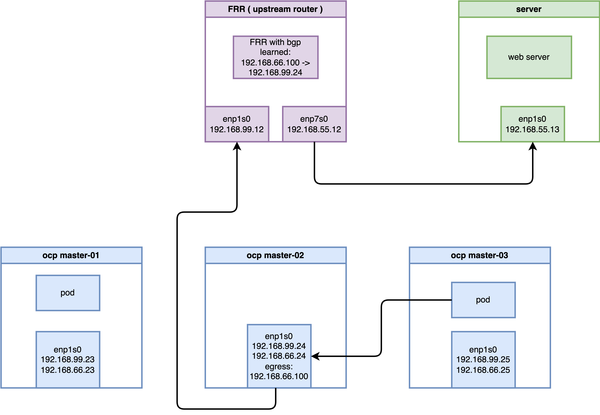

# Deep Dive: OVN Egress IP with BGP in OpenShift 4.19

This document provides a comprehensive technical guide on implementing and troubleshooting the **Egress IP** solution in an **OpenShift 4.19** environment using **OVN-Kubernetes** and **BGP (FRR)**. It explores the intricate "Tromboning" effect, where traffic is redirected across nodes for SNAT, and dissects the underlying OVS and Linux kernel mechanisms.

---

## 1. Abstract
In modern cloud-native architectures, controlling the exit point of cluster traffic is crucial for security and compliance. This guide demonstrates how to enable BGP with OVN-K to advertise Egress IPs to an upstream router. We will trace a data packet from a Pod to an external server, revealing how OVN "high-jacks" the route, encapsulates it via Geneve tunnels, and performs SNAT on a specific hosted node.

---

## 2. Lab Environment Architecture
To validate the technical feasibility, we utilize a virtualized environment built on a Baremetal CentOS 9 host with KVM/Libvirt.

### 2.1 Topology Overview
- **Host System**: CentOS 9 (IP: `192.168.99.1`)
- **Bridge**: `br-ocp` (`192.168.99.0/24`)

### 2.2 Component Details
1. **OpenShift 4.19 Cluster**:
    - **Nodes**: 3 Compact nodes (Master/Worker)
    - **IP Range**: `192.168.99.23` to `192.168.99.25`
    - **Egress IP Pool**: `192.168.66.100/24`
    - **Add-ons**: MetalLB/FRR-K8s for BGP capabilities.

2. **Upstream Router (FRR)**:
    - **OS**: CentOS 9 with FRR
    - **Interface `eth0` (Internal)**: `192.168.99.12` (Connects to OCP cluster)
    - **Interface `eth1` (External)**: `192.168.55.12` (Connects to Target Server)

3. **External Server**:
    - **OS**: CentOS 9
    - **Interface `eth0`**: `192.168.55.13`
    - **Gateway**: `192.168.55.12` (The KVM Router)



---

## 3. Infrastructure Configuration

### 3.1 Router (FRR) Node Setup
The router acts as the BGP peer for the OpenShift cluster. We must enable IPv4 forwarding and configure BGP to listen to OCP worker nodes.

```bash
# 1. Install FRR and base routing components
sudo dnf install -y frr

# Explicitly enable the bgpd process in the daemons file
sudo sed -i 's/^bgpd=no/bgpd=yes/' /etc/frr/daemons
sudo systemctl enable --now frr

# 2. Enable kernel IPv4 forwarding
echo "net.ipv4.ip_forward = 1" | sudo tee -a /etc/sysctl.d/99-ipforward.conf
sudo sysctl -p /etc/sysctl.d/99-ipforward.conf

# 3. Configure FRR BGP Instance
cat <<EOF | sudo tee /etc/frr/frr.conf
frr defaults traditional
log syslog informational
no ipv6 forwarding
!
router bgp 64512
 bgp router-id 192.168.99.12
 
 ! Define iBGP neighbors for each OCP cluster node
 neighbor 192.168.99.23 remote-as 64512
 neighbor 192.168.99.24 remote-as 64512
 neighbor 192.168.99.25 remote-as 64512

 ! Enable ECMP and advertise local networks
 address-family ipv4 unicast
  network 192.168.55.0/24
  maximum-paths ibgp 4
 exit-address-family
!
line vty
!
EOF

# 4. Restart FRR to apply changes
sudo systemctl restart frr
```

### 3.2 External Server Setup
The server acts as the traffic destination. We use Python to spin up simple HTTP listeners to verify connectivity from unrestricted ports.

```bash
# Set default gateway to the Router
# sudo ip route add default via 192.168.55.12
sudo ip route add 192.168.66.100 via 192.168.55.12

# Verify routing table
ip r
# default via 192.168.99.1 dev enp1s0 proto static metric 100
# 192.168.55.0/24 dev enp1s0 proto kernel scope link src 192.168.55.13 metric 100
# 192.168.66.100 via 192.168.55.12 dev enp1s0
# 192.168.99.0/24 dev enp1s0 proto kernel scope link src 192.168.99.13 metric 100

# Start HTTP listeners on different ports to prove Egress IP transparency
nohup python3 -m http.server 80 &
nohup python3 -m http.server 8080 &

# Use tcpdump to observe incoming traffic from the Egress IP (192.168.66.100)
sudo tcpdump -i any 'tcp port 80 or tcp port 8080' -n
```

---

## 4. OpenShift Configuration Flow

### 4.1 Deploying the Test Application
We deploy a test toolkit on specific nodes to verify traffic flows.

```bash
oc new-project demo-egress

cat <<EOF | oc apply -f -
apiVersion: apps/v1
kind: Deployment
metadata:
  name: edge-request-deployment
  namespace: demo-egress
spec:
  replicas: 2
  selector:
    matchLabels:
      app: requester
  template:
    metadata:
      labels:
        app: requester
    spec:
      affinity:
        nodeAffinity:
          requiredDuringSchedulingIgnoredDuringExecution:
            nodeSelectorTerms:
            - matchExpressions:
              - key: kubernetes.io/hostname
                operator: In
                values:
                - master-02-demo
                - master-03-demo
      containers:
      - name: toolkit
        image: quay.io/wangzheng422/qimgs:centos9-test-2025.12.18.v01
        command: ["sleep", "infinity"]
EOF
```

### 4.2 Enabling BGP and Node Configuration
Assign auxiliary IPs to the nodes' `br-ex` interfaces to support the Egress IP subnet.

```bash
# Safely append auxiliary IPs to Node interface configurations
oc debug node/master-01-demo -- chroot /host /bin/bash -c "nmcli connection modify enp1s0 +ipv4.addresses 192.168.66.23/24 && reboot"
oc debug node/master-02-demo -- chroot /host /bin/bash -c "nmcli connection modify enp1s0 +ipv4.addresses 192.168.66.24/24 && reboot"
oc debug node/master-03-demo -- chroot /host /bin/bash -c "nmcli connection modify enp1s0 +ipv4.addresses 192.168.66.25/24 && reboot"

# Enable FRR and Route Advertisements in the Network Operator
oc patch Network.operator.openshift.io cluster --type=merge -p \
'{
  "spec": {
    "additionalRoutingCapabilities": {
      "providers": ["FRR"]
    },
    "defaultNetwork": {
      "ovnKubernetesConfig": {
        "routeAdvertisements": "Enabled"
      }
    }
  }
}'
```

---

## 5. Egress IP and Route Advertisement Implementation

### 5.1 Preparing Nodes for Egress Assignment
Label nodes to allow OVN-K to host Egress IPs.

```bash
# Label all nodes as egress-assignable
oc label node --all k8s.ovn.org/egress-assignable="" --overwrite
```

### 5.2 Configuring OVN Route Advertisements
Instruct OVN to translate Egress IP routes into BGP prefixes for FRR.

```bash
cat <<EOF | oc apply -f -
apiVersion: k8s.ovn.org/v1
kind: RouteAdvertisements
metadata:
  name: default
spec:
  advertisements:
  - EgressIP
  nodeSelector: {}
  frrConfigurationSelector:
    matchLabels:
      use-for-advertisements: "true"
  networkSelectors:
  - networkSelectionType: DefaultNetwork
EOF
```

### 5.3 Deploying the Egress IP CRD
Assign the static IP `192.168.66.100` to the `demo-egress` namespace.

```bash
cat <<EOF | oc apply -f -
apiVersion: k8s.ovn.org/v1
kind: EgressIP
metadata:
  name: project-egressip
spec:
  egressIPs:
  - 192.168.66.100
  namespaceSelector:
    matchLabels:
      kubernetes.io/metadata.name: demo-egress
EOF

# Verify assignment
sleep 5
oc get egressips project-egressip -o yaml
# status:
#   items:
#   - egressIP: 192.168.66.100
#     node: master-02-demo
```

---

## 6. Operational Verification

### 6.1 BGP Route Confirmation
Login to the upstream Router VM and verify the dynamically advertised route.

```bash
vtysh -c "show ip route bgp"
# B>* 192.168.66.100/32 [200/0] via 192.168.99.24, enp1s0, weight 1, 00:00:20
```

### 6.2 Connectivity Test
Execute `curl` from Pods on different nodes to verify the SNAT target on the external server.

```bash
NODE2_POD=$(oc get po -n demo-egress -o wide | grep "master-02-demo" | awk '{print $1}')
NODE3_POD=$(oc get po -n demo-egress -o wide | grep "master-03-demo" | awk '{print $1}')

# Test from node hosting the Egress IP
oc exec -it $NODE2_POD -n demo-egress -- curl -I http://192.168.55.13 --connect-timeout 2

# Test from a different node (verifies "Tromboning")
oc exec -it $NODE3_POD -n demo-egress -- curl -I http://192.168.55.13 --connect-timeout 2
```

---

## 7. Under the Hood: The Mechanics of Redirection

When an Egress IP is assigned to `master-02`, OVN performs several low-level operations to ensure all traffic from the specified namespace exits via that node.

### 7.1 OVN Address Sets
OVN doesn't understand "Namespaces" at the flow level. It creates a dynamic **Address Set** containing all Pod IPs in that namespace.

```bash
OVN_NODE_01_POD=$(oc get po -n openshift-ovn-kubernetes -l app=ovnkube-node -o wide | grep "master-01-demo" | awk '{print $1}')

oc exec -n openshift-ovn-kubernetes $OVN_NODE_01_POD -c ovn-controller -- ovn-nbctl list address_set | grep -A 2 -B 2 -i demo-egress
# addresses           : ["10.132.0.13", "10.133.0.9"]
# name                : a11563627067456827758
```

### 7.2 OVS OpenFlow and Interceptor Markers
On the originating node (`master-03`), OVS intercepts traffic from the Pod and applies a metadata mark.

```bash
# Capture OVS OpenFlow for the Pod IP
oc exec -n openshift-ovn-kubernetes $OVN_NODE_03_POD -c ovn-controller -- ovs-ofctl dump-flows br-int | grep "10.133.0.9"

# Table 19: Apply Mark 0x2a (42) to packets from Egress Pod
# table=19, priority=103, ip, nw_src=10.133.0.9 actions=load:0x2a->NXM_NX_PKT_MARK[],resubmit(,20)
```

### 7.3 Kernel Policy-Based Routing (PBR)
The OVS mark translates to a Linux `fwmark`. The host's policy routing forces these packets to a specific routing table.

```bash
oc debug node/master-03-demo -- chroot /host /bin/bash -c "ip rule show"
# 30:     from all fwmark 0x1745ec lookup 7

oc debug node/master-03-demo -- chroot /host /bin/bash -c "ip route list table 7"
# 172.22.0.0/16 via 10.133.0.1 dev ovn-k8s-mp0
```

### 7.4 Hexadecimal Magic: Redirection via Transit Switch
The most advanced part of OVN-K's architecture is the direct rewrite of destination registers in OVS Table 25.

```bash
# Example OVS actions for redirection:
# load:0x64580003->NXM_NX_XXREG0[96..127],
# load:0x64580002->NXM_NX_XXREG1[64..95],
# mod_dl_src:0a:58:64:58:00:02
```

**Deconstruction**:
1. **`0x64580003`**: This is the hex representation of an IP address.
    - `0x64` = 100
    - `0x58` = 88
    - `0x00` = 0
    - `0x03` = 3
    - **Result**: `100.88.0.3` (The Transit Switch IP for `master-02`).
2. **`0a:58:64:58:00:02`**: The virtual MAC address of `master-03` on the Transit Switch.

This tells OVS: "Don't look at the logical router anymore. Encapsulate this packet and send it directly to the tunnel endpoint for `master-02` (100.88.0.3)."

### 7.5 Final SNAT on the Hosted Node
Once the packet traverses the Geneve tunnel and arrives at `master-02`, it hits the `iptables` NAT table just before leaving the physical interface.

```bash
oc debug node/master-02-demo -- chroot /host /bin/bash -c "iptables -t nat -S | grep 192.168.66.100"
# -A OVN-KUBE-EGRESS-IP-MULTI-NIC -s 10.133.0.9/32 -o br-ex -j SNAT --to-source 192.168.66.100
```

---

## 8. Conclusion
The OVN Egress IP solution in OpenShift 4.19 is a sophisticated interplay between Kubernetes CRDs, OVN logical abstractions, OVS OpenFlow rules, and Linux kernel policy routing. By directly manipulating registers at the lowest level (OVS Table 25), OVN-K achieves high-performance traffic redirection and "Tromboning" without the overhead of traditional hop-by-hop routing lookups. Understanding these hexadecimal mappings is key to advanced network troubleshooting in OCP 4.x.
